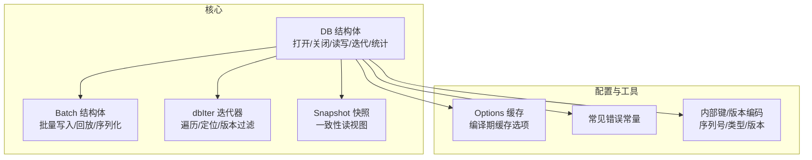
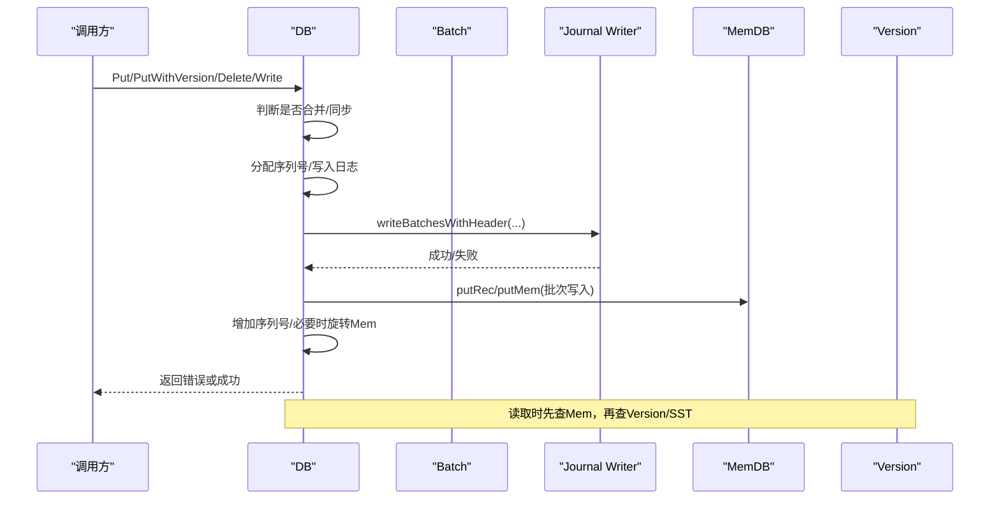
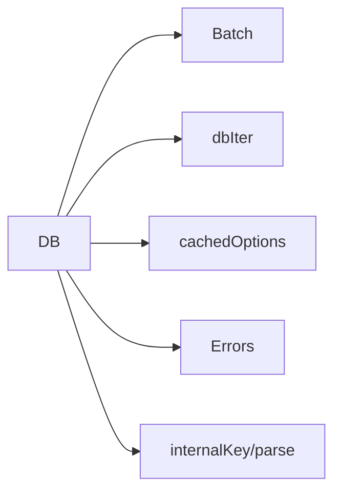

# API参考

<cite>
**本文引用的文件**
- [leveldb/db.go](file://leveldb/db.go)
- [leveldb/db_write.go](file://leveldb/db_write.go)
- [leveldb/db_iter.go](file://leveldb/db_iter.go)
- [leveldb/db_snapshot.go](file://leveldb/db_snapshot.go)
- [leveldb/db_state.go](file://leveldb/db_state.go)
- [leveldb/batch.go](file://leveldb/batch.go)
- [leveldb/options.go](file://leveldb/options.go)
- [leveldb/errors.go](file://leveldb/errors.go)
- [leveldb/key.go](file://leveldb/key.go)
- [leveldb/doc.go](file://leveldb/doc.go)
</cite>

## 目录
1. [简介](#简介)
2. [项目结构](#项目结构)
3. [核心组件](#核心组件)
4. [架构总览](#架构总览)
5. [详细组件分析](#详细组件分析)
6. [依赖分析](#依赖分析)
7. [性能考量](#性能考量)
8. [故障排查指南](#故障排查指南)
9. [结论](#结论)
10. [附录：常用示例与最佳实践](#附录常用示例与最佳实践)

## 简介
本参考文档面向 avccDB（基于 LevelDB 的数据库实现）的使用者与维护者，系统性梳理公开 API，覆盖 DB 结构体的主要方法（OpenFile、Put、Get、Delete、NewIterator、Write 等），并对 Batch、Iterator、Options、Errors 等核心类型进行字段与方法说明。文档严格遵循 Go 文档风格，提供函数签名路径、参数与返回值说明、错误类型、典型用法片段路径，并与源码保持同步，便于日常开发查询与集成。

## 项目结构
avccDB 采用模块化组织，核心入口位于 leveldb 包，关键子模块包括：
- 数据库核心：db.go、db_write.go、db_iter.go、db_snapshot.go、db_state.go
- 批处理：batch.go
- 选项与缓存：options.go
- 错误常量：errors.go
- 内部键与版本：key.go
- 包文档：doc.go

图表来源
- [leveldb/db.go](file://leveldb/db.go#L1-L120)
- [leveldb/batch.go](file://leveldb/batch.go#L60-L120)
- [leveldb/db_iter.go](file://leveldb/db_iter.go#L90-L140)
- [leveldb/db_snapshot.go](file://leveldb/db_snapshot.go#L74-L120)
- [leveldb/options.go](file://leveldb/options.go#L46-L108)
- [leveldb/errors.go](file://leveldb/errors.go#L13-L21)
- [leveldb/key.go](file://leveldb/key.go#L75-L140)

章节来源
- [leveldb/doc.go](file://leveldb/doc.go#L1-L93)

## 核心组件
本节对 DB、Batch、Iterator、Options、Errors 等核心类型进行概览说明。

- DB：数据库实例，提供打开/关闭、读写、迭代、属性查询、统计、压缩、只读切换等能力。
- Batch：批量写入单元，支持 Put/Delete/回放/序列化/版本化写入。
- dbIter：数据库迭代器，支持前向/后向移动、范围切片、版本过滤、采样触发压缩。
- Snapshot：快照对象，提供一致性的读视图。
- Options：选项封装与缓存，包含比较器、过滤器、严格模式、写缓冲等。
- Errors：常见错误常量（未找到、只读、快照释放、迭代器释放、已关闭）。
- Key：内部键格式与版本编码，序列号与类型打包，版本键解析。

章节来源
- [leveldb/db.go](file://leveldb/db.go#L33-L120)
- [leveldb/batch.go](file://leveldb/batch.go#L60-L120)
- [leveldb/db_iter.go](file://leveldb/db_iter.go#L90-L140)
- [leveldb/db_snapshot.go](file://leveldb/db_snapshot.go#L74-L120)
- [leveldb/options.go](file://leveldb/options.go#L46-L108)
- [leveldb/errors.go](file://leveldb/errors.go#L13-L21)
- [leveldb/key.go](file://leveldb/key.go#L75-L140)

## 架构总览
DB 的读写流程围绕内存表（MemDB）、日志（Journal）、SST 文件与版本管理展开；批量写入通过批处理合并、写入日志、更新内存表并按阈值触发旋转与压缩。

图表来源
- [leveldb/db_write.go](file://leveldb/db_write.go#L18-L33)
- [leveldb/db_write.go](file://leveldb/db_write.go#L268-L330)
- [leveldb/db_write.go](file://leveldb/db_write.go#L332-L438)
- [leveldb/db.go](file://leveldb/db.go#L798-L833)

## 详细组件分析

### DB 结构体与公开方法
- 打开/恢复
  - Open(stor, o)：打开或创建数据库，支持只读/存在性检查/错误策略。
  - OpenFile(path, o)：基于文件存储打开数据库。
  - Recover(stor, o) / RecoverFile(path, o)：修复缺失/损坏的清单文件后打开。
- 关闭
  - Close()：关闭数据库，清理资源，等待并发写锁释放。
- 读取
  - Get(key, ro)：获取最新版本值。
  - GetWithVersion(key, version, ro)：按指定版本获取值。
  - GetWithProof(key, version, ro)：获取值与 Merkle 证明。
  - GetVersionHistory(key, minVersion, maxVersion, ro)：查询指定范围内所有版本。
  - Has(key, ro)：判断是否存在。
  - NewIterator(slice, ro)：返回最新快照的迭代器。
  - GetSnapshot()：获取快照对象。
  - GetProperty(name)：查询统计属性字符串。
  - Stats(s)：填充数据库统计结构体。
  - SizeOf(ranges)：估算键区间占用空间。
  - GetMasterRoot()：获取 MasterRoot 汇总根哈希。
- 写入
  - Put(key, value, wo)：设置键值。
  - PutWithVersion(key, value, version, wo)：带版本号写入。
  - Delete(key, wo)：删除键。
  - Write(batch, wo)：应用批处理。
  - CompactRange(r)：对指定范围进行压缩。
  - SetReadOnly()：设为只读。
- 内部状态
  - getSeq()/addSeq()/setSeq()：序列号读写。
  - ok()：检查是否已关闭。
  - setClosed()/isClosed()：关闭状态管理。

章节来源
- [leveldb/db.go](file://leveldb/db.go#L177-L243)
- [leveldb/db.go](file://leveldb/db.go#L245-L293)
- [leveldb/db.go](file://leveldb/db.go#L1092-L1198)
- [leveldb/db.go](file://leveldb/db.go#L1200-L1243)
- [leveldb/db.go](file://leveldb/db.go#L1245-L1356)
- [leveldb/db.go](file://leveldb/db.go#L1358-L1441)
- [leveldb/db.go](file://leveldb/db.go#L1443-L1490)
- [leveldb/db.go](file://leveldb/db.go#L1491-L1571)
- [leveldb/db.go](file://leveldb/db.go#L1573-L1643)
- [leveldb/db_write.go](file://leveldb/db_write.go#L268-L330)
- [leveldb/db_write.go](file://leveldb/db_write.go#L332-L438)
- [leveldb/db_write.go](file://leveldb/db_write.go#L456-L501)
- [leveldb/db_write.go](file://leveldb/db_write.go#L503-L530)
- [leveldb/db_state.go](file://leveldb/db_state.go#L51-L80)
- [leveldb/db_state.go](file://leveldb/db_state.go#L220-L237)

### Batch 类型
- 字段
  - data：编码后的记录字节流。
  - index：每条记录在 data 中的位置索引（含键/值偏移、类型、版本）。
  - internalLen：累计“内部键长度”（含键/值与元数据长度）。
  - growLimit：增长阈值，用于控制内存分配节奏。
- 方法
  - Put(key, value) / PutWithVersion(key, value, version)：追加写入记录。
  - Delete(key)：追加删除记录。
  - Dump()：导出内部编码数据（不复制）。
  - Load(data)：从编码数据加载（不复制）。
  - Replay(r)：回放至 BatchReplay 接口。
  - Len() / Reset()：记录数与重置。
  - MakeBatch(n) / MakeBatchWithConfig(cfg)：构造预分配容量的批处理。
- 编解码
  - Dump/Load 与 Replay 互为镜像；Decode/Encode 头部包含序列号与记录数。
- 版本化
  - 支持带版本号的 Put，内部键格式包含版本字段。

章节来源
- [leveldb/batch.go](file://leveldb/batch.go#L60-L120)
- [leveldb/batch.go](file://leveldb/batch.go#L138-L196)
- [leveldb/batch.go](file://leveldb/batch.go#L226-L242)
- [leveldb/batch.go](file://leveldb/batch.go#L263-L302)
- [leveldb/batch.go](file://leveldb/batch.go#L304-L344)
- [leveldb/batch.go](file://leveldb/batch.go#L346-L393)
- [leveldb/batch.go](file://leveldb/batch.go#L394-L413)

### Iterator 类型（dbIter）
- 行为
  - First/Last/Next/Prev/Seek：支持前向/后向移动与定位。
  - Key()/Value()：当前键值（仅在 Valid() 为真时有效）。
  - Release()/Error()：释放与错误查询。
  - SetReleaser：设置资源释放器。
- 过滤与采样
  - 严格模式下解析内部键失败会报错。
  - 采样触发压缩：根据访问路径长度采样，周期性触发表级压缩。
- 版本过滤
  - 仅返回小于等于迭代器序列号的最新版本键值。

章节来源
- [leveldb/db_iter.go](file://leveldb/db_iter.go#L90-L140)
- [leveldb/db_iter.go](file://leveldb/db_iter.go#L149-L206)
- [leveldb/db_iter.go](file://leveldb/db_iter.go#L204-L260)
- [leveldb/db_iter.go](file://leveldb/db_iter.go#L262-L304)
- [leveldb/db_iter.go](file://leveldb/db_iter.go#L346-L393)

### Options 类型
- 作用
  - dupOptions：复制并补全默认严格模式。
  - setOptions：注入比较器/过滤器，构建缓存选项。
  - cachedOptions：对若干压缩相关参数进行编译期缓存，加速读取。
- 常见用途
  - 设置比较器、过滤器、严格模式、写缓冲大小、压缩阈值等。

章节来源
- [leveldb/options.go](file://leveldb/options.go#L14-L23)
- [leveldb/options.go](file://leveldb/options.go#L25-L44)
- [leveldb/options.go](file://leveldb/options.go#L48-L108)

### Errors 常量
- 常见错误
  - ErrNotFound：未找到。
  - ErrReadOnly：只读模式。
  - ErrSnapshotReleased：快照已释放。
  - ErrIterReleased：迭代器已释放。
  - ErrClosed：数据库已关闭。

章节来源
- [leveldb/errors.go](file://leveldb/errors.go#L13-L21)

### Key/版本编码
- 内部键格式
  - 非版本键：用户键 + 8 字节（序列号<<8 | 类型）。
  - 版本键：用户键 + 8 字节版本 + 8 字节（序列号<<8 | 类型）。
- 解析
  - parseInternalKey / parseInternalKeyWithVersion：解析内部键，提取用户键、序列号、类型、版本。
  - hasVersion / extractVersion：检测并提取版本号。
- 辅助
  - makeInternalKey / makeInternalKeyWithVersion：构造内部键。
  - validInternalKey：校验内部键有效性。

章节来源
- [leveldb/key.go](file://leveldb/key.go#L75-L140)
- [leveldb/key.go](file://leveldb/key.go#L119-L146)
- [leveldb/key.go](file://leveldb/key.go#L148-L197)

## 依赖分析
- DB 对 Batch 的依赖：写入路径中将 Batch 编码为日志记录，同时将记录写入内存表。
- DB 对 Iterator 的依赖：NewIterator 返回 dbIter，内部聚合 MemDB 与 SST 迭代器。
- DB 对 Options 的依赖：读取缓存选项以决定行为（如严格模式、写缓冲、压缩阈值）。
- DB 对 Errors 的依赖：返回统一错误常量。
- DB 对 Key 的依赖：内部键编码/解析贯穿读写路径。

图表来源
- [leveldb/db.go](file://leveldb/db.go#L177-L243)
- [leveldb/db_iter.go](file://leveldb/db_iter.go#L31-L61)
- [leveldb/options.go](file://leveldb/options.go#L48-L108)
- [leveldb/errors.go](file://leveldb/errors.go#L13-L21)
- [leveldb/key.go](file://leveldb/key.go#L75-L140)

## 性能考量
- 写入合并：Write/Put/Delete 在小批量情况下尝试合并，减少日志写入次数与序列号分配成本。
- 写入节流：当 L0 表数量超过阈值时，写入会延迟或暂停，等待压缩完成。
- 内存池：MemDB 使用池化复用，避免频繁分配。
- 迭代采样：按访问路径长度采样触发压缩，降低后续扫描成本。
- 只读优化：SetReadOnly 后写入被拒绝，读取路径更稳定。

章节来源
- [leveldb/db_write.go](file://leveldb/db_write.go#L66-L131)
- [leveldb/db_write.go](file://leveldb/db_write.go#L133-L266)
- [leveldb/db_state.go](file://leveldb/db_state.go#L74-L118)
- [leveldb/db_iter.go](file://leveldb/db_iter.go#L124-L135)

## 故障排查指南
- 常见错误
  - ErrNotFound：键不存在或版本不存在。
  - ErrReadOnly：在只读模式下执行写操作。
  - ErrSnapshotReleased / ErrIterReleased：对象已释放仍被使用。
  - ErrClosed：数据库已关闭，继续调用无效。
- 定位建议
  - 写入失败：检查 WriteOptions（NoWriteMerge/Sync）、Options（WriteBuffer/Strict）、是否触发只读。
  - 读取异常：确认 NewIterator/Get/GetWithVersion 的读选项与版本号是否正确。
  - 迭代器问题：确保迭代器在使用后及时 Release，避免跨线程共享。
  - 关闭问题：确保所有迭代器与快照释放后再 Close。

章节来源
- [leveldb/errors.go](file://leveldb/errors.go#L13-L21)
- [leveldb/db_write.go](file://leveldb/db_write.go#L268-L330)
- [leveldb/db_iter.go](file://leveldb/db_iter.go#L360-L393)
- [leveldb/db_snapshot.go](file://leveldb/db_snapshot.go#L168-L188)

## 结论
本文档系统梳理了 avccDB 的公开 API，覆盖 DB 的打开/关闭、读写、迭代、统计与压缩等核心能力，并对 Batch、Iterator、Options、Errors、Key/版本编码等关键类型进行了深入说明。结合源码路径与图示，读者可快速定位实现细节与使用方式，提升开发效率与稳定性。

## 附录：常用示例与最佳实践
- 打开数据库
  - 使用 OpenFile 或 Open，结合 opt.Options 设置比较器/过滤器/严格模式。
  - 示例路径：[leveldb/doc.go](file://leveldb/doc.go#L10-L16)
- 读取数据
  - Get/Has/NewIterator 获取最新值或遍历。
  - 示例路径：[leveldb/doc.go](file://leveldb/doc.go#L18-L40)
- 批量写入
  - 使用 Batch.Put/Delete/Replay，然后 Write 应用。
  - 示例路径：[leveldb/doc.go](file://leveldb/doc.go#L74-L82)
- 版本化读写
  - PutWithVersion/GetWithVersion/GetVersionHistory 支持多版本溯源。
  - 示例路径：[leveldb/db.go](file://leveldb/db.go#L1109-L1184)
- 获取 Merkle 证明
  - GetWithProof 返回值与证明，可用于链上验证。
  - 示例路径：[leveldb/db.go](file://leveldb/db.go#L1127-L1146)
- 快照一致性读
  - GetSnapshot 获取快照，配合 Snapshot.Get/NewIterator。
  - 示例路径：[leveldb/db_snapshot.go](file://leveldb/db_snapshot.go#L120-L166)
- 统计与诊断
  - GetProperty/Stats/SizeOf 查询运行时状态与占用。
  - 示例路径：[leveldb/db.go](file://leveldb/db.go#L1245-L1356)