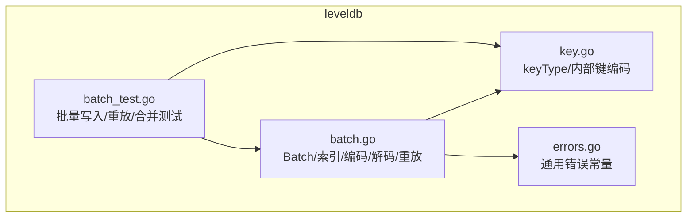
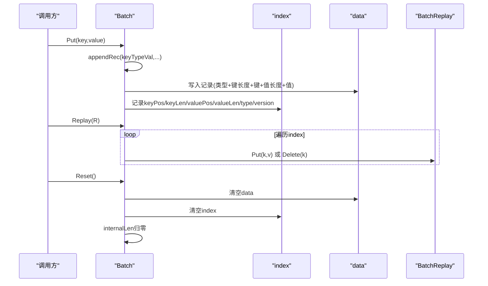
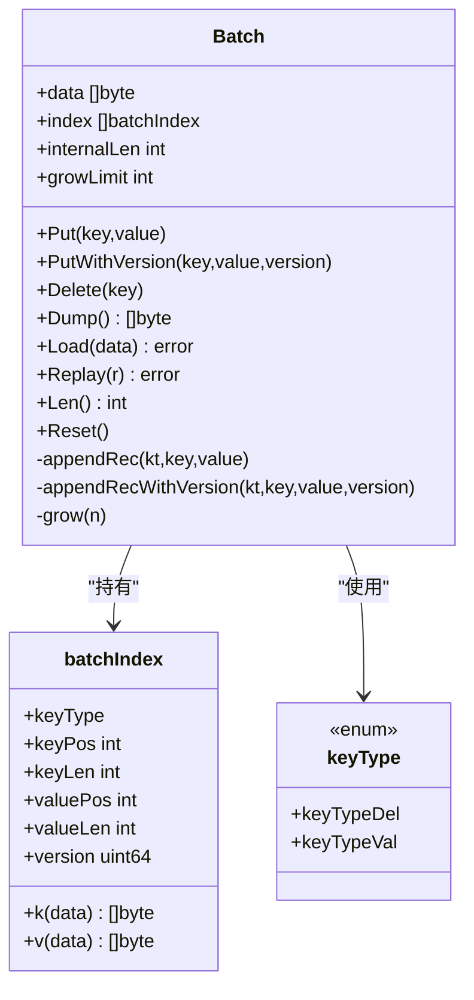
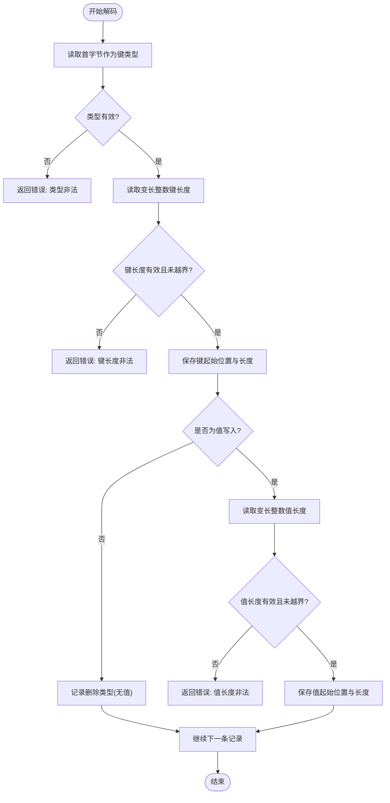
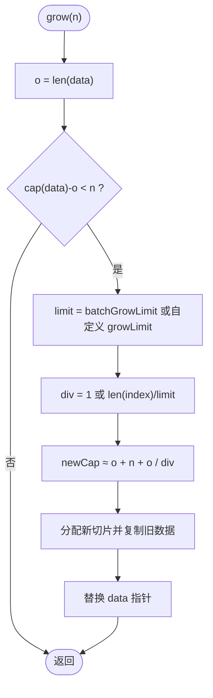
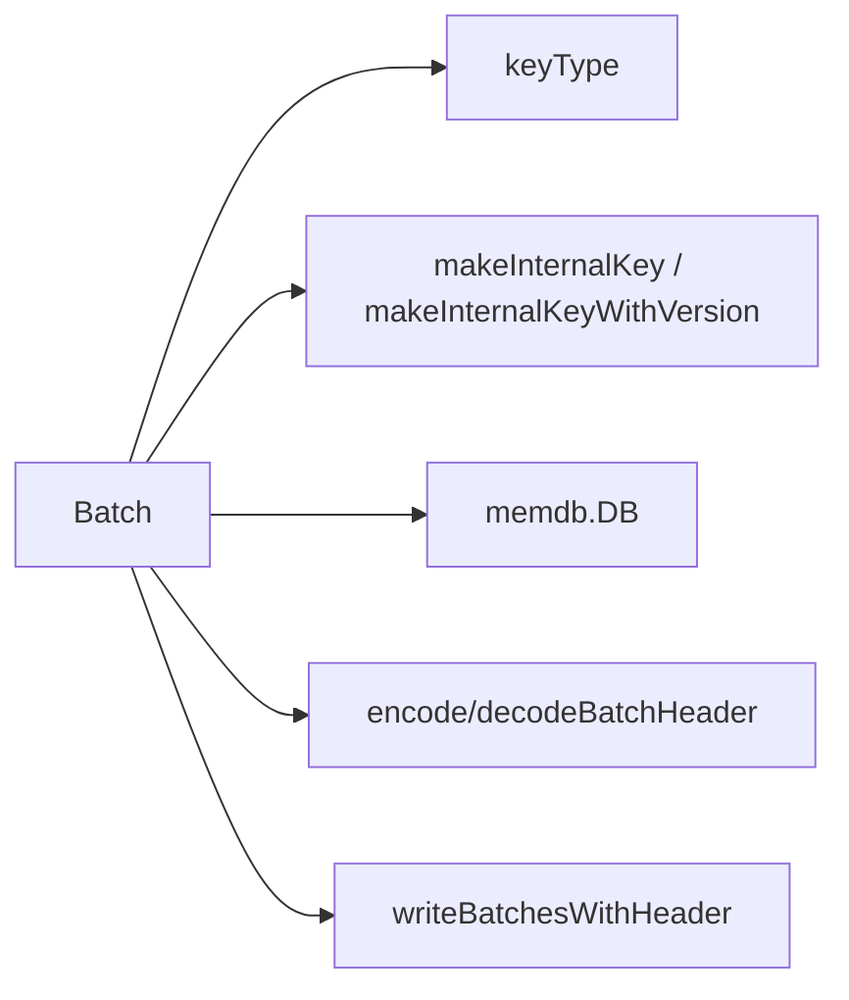

# 批量操作基础

<cite>
**本文引用的文件**
- [batch.go](file://leveldb/batch.go)
- [batch_test.go](file://leveldb/batch_test.go)
- [key.go](file://leveldb/key.go)
- [errors.go](file://leveldb/errors.go)
</cite>

## 目录
1. [简介](#简介)
2. [项目结构](#项目结构)
3. [核心组件](#核心组件)
4. [架构总览](#架构总览)
5. [详细组件分析](#详细组件分析)
6. [依赖关系分析](#依赖关系分析)
7. [性能考量](#性能考量)
8. [故障排查指南](#故障排查指南)
9. [结论](#结论)
10. [附录](#附录)

## 简介
本文件围绕 avccDB 的批量写入基础能力进行系统化说明，重点覆盖 Batch 结构体的核心字段（data、index、internalLen）与其内存布局设计原理；深入解析 Put、Delete、Reset 和 Len 方法的实现机制与使用场景；阐述 appendRec 内部方法如何构建操作记录，以及数据编码格式（变长整数、键类型标识）的设计考量；提供典型使用示例（事务性写入模式与批量重放 Replay），并分析内存增长策略（grow 方法）对性能的影响及最佳实践建议；最后涵盖错误处理机制，特别是数据损坏（ErrBatchCorrupted）的检测与恢复策略。

## 项目结构
- 批量操作核心位于 leveldb/batch.go，包含 Batch 结构体、索引结构、编码/解码、内存增长策略、重放接口等。
- 键类型与内部键编码在 leveldb/key.go 中定义，用于区分 Put/Delete 操作与序列号/版本号打包。
- 单元测试 leveldb/batch_test.go 验证了批量写入、重放、合并、长度统计等行为。
- 错误类型定义在 leveldb/errors.go 中，ErrBatchCorrupted 由 batch.go 构造并包装为存储层的 ErrCorrupted。

图表来源
- [batch.go](file://leveldb/batch.go#L62-L143)
- [key.go](file://leveldb/key.go#L31-L48)
- [batch_test.go](file://leveldb/batch_test.go#L1-L179)

章节来源
- [batch.go](file://leveldb/batch.go#L62-L143)
- [key.go](file://leveldb/key.go#L31-L48)
- [batch_test.go](file://leveldb/batch_test.go#L1-L179)

## 核心组件
- Batch：批量写入容器，维护原始字节缓冲区 data、记录索引 index、内部键长度估算 internalLen。
- batchIndex：记录每条记录在 data 中的偏移与长度，以及键类型与可选版本号。
- keyType：键类型枚举，区分删除与值写入。
- BatchReplay 接口：抽象批量重放的回调接口，支持 Put/Delete 两种操作。

关键字段与职责
- data：连续字节缓冲区，按固定格式编码所有记录。
- index：每条记录在 data 中的起始位置与长度信息，便于零拷贝读取。
- internalLen：记录“用户键/值长度 + 内部键开销”的累计估算，用于容量规划与统计。
- growLimit：内存增长阈值，控制 grow 策略以降低频繁分配。

章节来源
- [batch.go](file://leveldb/batch.go#L62-L75)
- [batch.go](file://leveldb/batch.go#L44-L61)
- [key.go](file://leveldb/key.go#L31-L48)

## 架构总览
Batch 将多条写入操作序列化到单一字节缓冲区中，通过索引在不复制数据的前提下快速访问各条记录。Put/Delete 调用 appendRec 构建记录，采用变长整数编码键/值长度，首字节表示键类型。Load/Dump 支持将 Batch 序列化为字节切片或从字节切片重建。Replay 将记录回放到实现了 BatchReplay 的目标对象，用于重放或验证。

图表来源
- [batch.go](file://leveldb/batch.go#L138-L196)
- [batch.go](file://leveldb/batch.go#L173-L184)
- [batch.go](file://leveldb/batch.go#L191-L196)

## 详细组件分析

### Batch 结构体与内存布局
- data：连续字节缓冲区，按“记录”顺序存放。每条记录格式为：
  - 首字节：键类型（keyTypeVal 或 keyTypeDel）
  - 变长整数：键长度 n
  - n 字节：键内容
  - 若为值写入（keyTypeVal）：再写入变长整数 m，再写入 m 字节值
  - 若为删除（keyTypeDel）：无值部分
  - 若启用版本号（appendRecWithVersion），会在键长度前插入一个变长整数版本号
- index：batchIndex 列表，记录每条记录在 data 中的偏移与长度，以及键类型与版本号，用于零拷贝读取。
- internalLen：累计估算值，用于容量规划与统计。非精确值，因为不同记录可能携带版本号导致内部键长度差异。
- growLimit：内存增长阈值，影响 grow 的扩容步长。

图表来源
- [batch.go](file://leveldb/batch.go#L62-L75)
- [batch.go](file://leveldb/batch.go#L44-L61)
- [batch.go](file://leveldb/batch.go#L94-L136)
- [key.go](file://leveldb/key.go#L31-L48)

章节来源
- [batch.go](file://leveldb/batch.go#L62-L75)
- [batch.go](file://leveldb/batch.go#L44-L61)
- [batch.go](file://leveldb/batch.go#L94-L136)

### 数据编码格式与设计考量
- 键类型标识：首字节为键类型（keyTypeVal=1，keyTypeDel=0）。用于区分记录类型，确保解码时正确跳过值字段。
- 变长整数：键长度、值长度均采用变长整数编码，减少小尺寸键/值的存储开销，同时允许大键/值的稳定编码。
- 版本号支持：当使用带版本号的写入时，在键长度前插入一个变长整数版本号，使内部键格式扩展为“用户键 + 版本(8字节) + 序列号+类型(8字节)”。
- 解码流程：decodeBatch 逐条读取记录，先读取类型，再读取键长度并校验边界，若为值写入则继续读取值长度与值内容，最终生成 batchIndex 并追加到索引列表。

图表来源
- [batch.go](file://leveldb/batch.go#L304-L344)

章节来源
- [batch.go](file://leveldb/batch.go#L304-L344)

### appendRec 内部方法与记录构建
- 参数：键类型、键、值（删除操作传 nil）、可选版本号。
- 预估所需空间：首字节 + 变长整数键长度 + 键 + 变长整数值长度 + 值（仅值写入） + 可选版本号。
- grow：根据预估空间检查容量，必要时扩容，扩容策略受 growLimit 影响。
- 写入：按顺序写入类型、版本号（如存在）、键长度、键、值长度（如存在）、值。
- 更新索引：记录键/值在 data 中的位置与长度，更新 internalLen。
- internalLen 计算：删除记录 +8 字节内部键开销，值写入记录 +8 字节（或 +16 字节，当带版本号时）。

章节来源
- [batch.go](file://leveldb/batch.go#L94-L136)

### Put、Delete、Reset、Len 方法
- Put(key, value)：调用 appendRec(keyTypeVal, ...)，将键值对加入批处理。
- Delete(key)：调用 appendRec(keyTypeDel, ...)，将删除记录加入批处理。
- Reset()：清空 data、index，并将 internalLen 归零，复用已分配缓冲区。
- Len()：返回当前记录数量，即 index 长度。

章节来源
- [batch.go](file://leveldb/batch.go#L138-L196)

### Replay 与内部重放
- Replay(r)：遍历 index，调用 r.Put 或 r.Delete 将记录回放到外部目标。
- replayInternal(fn)：内部重放，逐条回调函数，便于测试与验证。
- Load/Dump：Load 将给定字节切片作为 Batch 的 data 使用（不复制），Dump 返回当前 data 引用（不可修改）。

章节来源
- [batch.go](file://leveldb/batch.go#L173-L196)
- [batch.go](file://leveldb/batch.go#L157-L172)

### 内存增长策略（grow 方法）
- 触发条件：当剩余容量不足时触发扩容。
- 扩容公式：新容量 ≈ 当前长度 + 需要空间 + 当前长度 / div，其中 div 由记录数量与 growLimit 共同决定。
- growLimit 默认值：batchGrowLimit，可通过 BatchConfig 自定义。
- 性能影响：较大的 growLimit 可减少扩容次数但增大单次分配；较小 growLimit 可降低峰值内存但增加分配次数。

图表来源
- [batch.go](file://leveldb/batch.go#L77-L92)
- [batch.go](file://leveldb/batch.go#L268-L302)

章节来源
- [batch.go](file://leveldb/batch.go#L77-L92)
- [batch.go](file://leveldb/batch.go#L268-L302)

### 错误处理与数据损坏检测（ErrBatchCorrupted）
- ErrBatchCorrupted：封装批处理损坏原因，由 newErrBatchCorrupted 构造并包装为存储层的 ErrCorrupted。
- 解码阶段的常见错误：
  - 类型非法：首字节不在合法范围。
  - 键长度非法：变长整数无效或越界。
  - 值长度非法：变长整数无效或越界。
  - 记录数量不匹配：Load/Replay 时长度校验失败。
- 恢复策略：上层捕获 ErrCorrupted 并根据业务需求选择丢弃、修复或回退。

章节来源
- [batch.go](file://leveldb/batch.go#L19-L36)
- [batch.go](file://leveldb/batch.go#L304-L344)
- [batch.go](file://leveldb/batch.go#L226-L242)

## 依赖关系分析
- Batch 依赖 keyType 定义键类型，依赖内部键编码函数（makeInternalKey、makeInternalKeyWithVersion）在写入 memdb 时构造内部键。
- Batch 与 memdb 的交互通过 putMem 实现，将每条记录转换为内部键后写入内存数据库。
- Batch 与存储层的交互体现在 header 编解码（encodeBatchHeader/decodeBatchHeader）与批量写出（writeBatchesWithHeader）。

图表来源
- [batch.go](file://leveldb/batch.go#L244-L257)
- [batch.go](file://leveldb/batch.go#L374-L392)
- [batch.go](file://leveldb/batch.go#L402-L412)
- [key.go](file://leveldb/key.go#L77-L104)

章节来源
- [batch.go](file://leveldb/batch.go#L244-L257)
- [batch.go](file://leveldb/batch.go#L374-L392)
- [batch.go](file://leveldb/batch.go#L402-L412)
- [key.go](file://leveldb/key.go#L77-L104)

## 性能考量
- 批量写入优势：减少系统调用与锁竞争，提升吞吐。
- 内存增长策略：
  - 使用 MakeBatchWithConfig 预设初始容量与 growLimit，可显著降低分配次数。
  - 在高并发/大批量写入场景，适当提高 growLimit 可平滑内存增长曲线。
- 零拷贝读取：index 提供键/值在 data 中的偏移，避免重复复制。
- 变长整数：小键/值节省空间，大键/值仍可稳定编码。
- 测试基准：batch_test.go 提供默认与“快速分配”配置的写入基准，可用于评估不同 growLimit 对分配次数的影响。

章节来源
- [batch.go](file://leveldb/batch.go#L263-L302)
- [batch_test.go](file://leveldb/batch_test.go#L150-L179)

## 故障排查指南
- 常见问题
  - 批处理损坏：Load/Replay 时出现 ErrBatchCorrupted，检查数据来源与完整性。
  - 记录数量不一致：Load 时期望长度与实际不符，确认编码/解码流程与 header 是否正确。
  - 内存增长异常：频繁扩容导致 GC 抖动，调整 growLimit 或预估容量。
- 排查步骤
  - 使用 Dump 获取 data，结合 decodeBatch 验证记录边界与类型。
  - 使用 Replay 将记录回放到空 Batch，验证索引与长度一致性。
  - 使用 Reset 复用 Batch，避免重复分配。

章节来源
- [batch.go](file://leveldb/batch.go#L19-L36)
- [batch.go](file://leveldb/batch.go#L226-L242)
- [batch.go](file://leveldb/batch.go#L173-L196)

## 结论
Batch 通过紧凑的字节编码与索引结构，提供了高效的批量写入与重放能力。其内存增长策略与变长整数编码兼顾了空间效率与稳定性。配合内部键编码与 header 编解码，Batch 可无缝对接存储层与内存数据库。合理设置初始容量与 growLimit，可在保证性能的同时降低内存抖动风险。

## 附录

### 典型使用示例（文字描述）
- 事务性写入模式
  - 创建 Batch，循环调用 Put/删除操作，期间可随时调用 Len 统计记录数。
  - 使用 Reset 清理中间状态，或使用 append 合并多个 Batch。
  - 最终通过 putMem 将记录转换为内部键并写入 memdb。
- 批量重放（Replay）
  - 将已编码的 Batch 通过 Load 设置为当前 Batch 的 data。
  - 调用 Replay 将记录回放到实现了 BatchReplay 的对象，验证一致性。
  - 使用 Dump 导出 data，便于持久化或网络传输。

章节来源
- [batch.go](file://leveldb/batch.go#L173-L196)
- [batch.go](file://leveldb/batch.go#L157-L172)
- [batch.go](file://leveldb/batch.go#L207-L224)
- [batch.go](file://leveldb/batch.go#L244-L257)