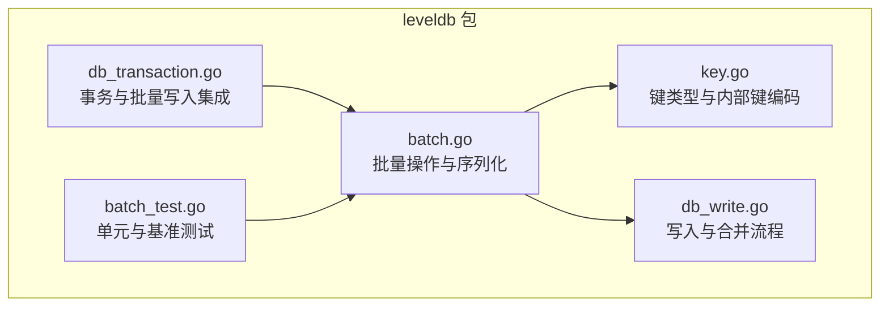
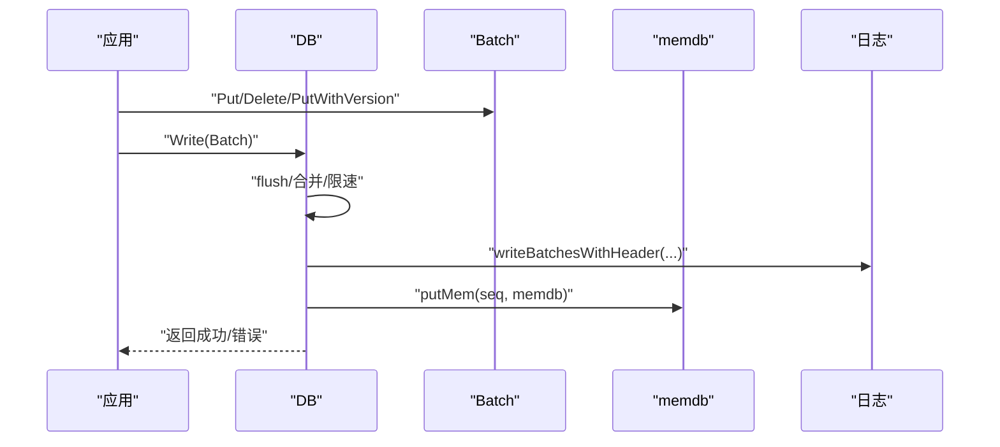
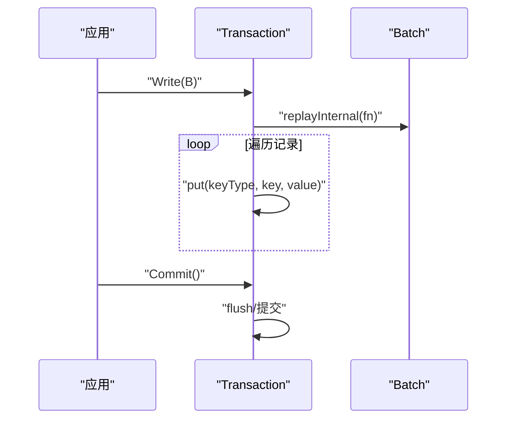
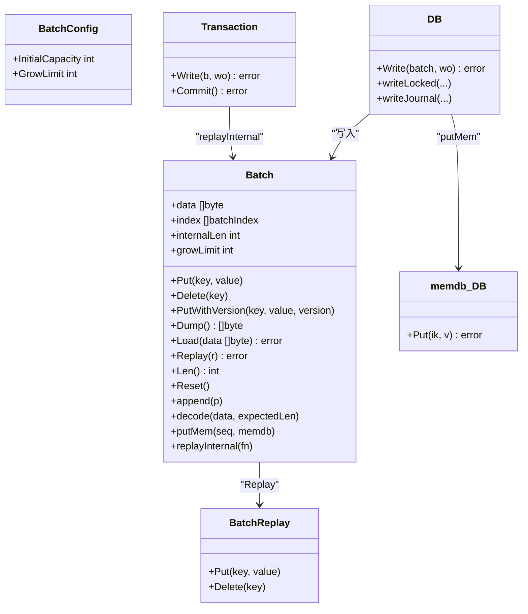

# 批量操作接口

<cite>
**本文引用的文件列表**
- [batch.go](file://leveldb/batch.go)
- [batch_test.go](file://leveldb/batch_test.go)
- [key.go](file://leveldb/key.go)
- [db_write.go](file://leveldb/db_write.go)
- [db_transaction.go](file://leveldb/db_transaction.go)
</cite>

## 目录
1. [简介](#简介)
2. [项目结构与定位](#项目结构与定位)
3. [核心组件总览](#核心组件总览)
4. [架构概览](#架构概览)
5. [详细组件分析](#详细组件分析)
6. [依赖关系分析](#依赖关系分析)
7. [性能与内存特性](#性能与内存特性)
8. [故障排查指南](#故障排查指南)
9. [结论](#结论)
10. [附录：典型使用模式与最佳实践](#附录典型使用模式与最佳实践)

## 简介
本文件为 avccDB 的批量操作（Batch）功能提供完整的 API 参考与实现解析，覆盖 Batch 结构体的字段与方法、内部数据结构与内存管理机制、BatchConfig 配置项、编码与序列化格式、错误处理策略以及性能特征分析，并给出事务性写入与数据重放的典型使用模式与避坑建议。

## 项目结构与定位
- 批量操作核心位于 leveldb 包内，关键文件：
  - 批量操作与序列化：[batch.go](file://leveldb/batch.go)
  - 键类型与内部键编码：[key.go](file://leveldb/key.go)
  - 写入流程与合并：[db_write.go](file://leveldb/db_write.go)
  - 事务与批量写入集成：[db_transaction.go](file://leveldb/db_transaction.go)
  - 单元测试与基准测试：[batch_test.go](file://leveldb/batch_test.go)

图表来源
- [batch.go](file://leveldb/batch.go#L1-L120)
- [key.go](file://leveldb/key.go#L1-L120)
- [db_write.go](file://leveldb/db_write.go#L1-L120)
- [db_transaction.go](file://leveldb/db_transaction.go#L140-L200)
- [batch_test.go](file://leveldb/batch_test.go#L1-L60)

章节来源
- [batch.go](file://leveldb/batch.go#L1-L120)
- [key.go](file://leveldb/key.go#L1-L120)
- [db_write.go](file://leveldb/db_write.go#L1-L120)
- [db_transaction.go](file://leveldb/db_transaction.go#L140-L200)
- [batch_test.go](file://leveldb/batch_test.go#L1-L60)

## 核心组件总览
- Batch：内存中的写入批次，支持 Put/Delete/PutWithVersion、Dump/Load、Replay、Len/Reset、append/decode 等能力。
- BatchReplay：用于重放的回调接口，接收 Put/Delete 操作。
- BatchConfig：批量初始化配置，含 InitialCapacity 与 GrowLimit。
- 内部键编码：keyType、makeInternalKey、makeInternalKeyWithVersion、parseInternalKey 等。

章节来源
- [batch.go](file://leveldb/batch.go#L38-L76)
- [batch.go](file://leveldb/batch.go#L268-L302)
- [key.go](file://leveldb/key.go#L31-L66)

## 架构概览
批量写入在 DB 中的典型流程：
- 应用层构造 Batch 并写入若干条目。
- DB 在写入前进行合并与节流，必要时写入日志并写入内存表。
- 事务层可将 Batch 重放至临时内存或记录中，最终提交。

图表来源
- [db_write.go](file://leveldb/db_write.go#L18-L33)
- [db_write.go](file://leveldb/db_write.go#L246-L251)
- [batch.go](file://leveldb/batch.go#L374-L413)

章节来源
- [db_write.go](file://leveldb/db_write.go#L18-L33)
- [db_write.go](file://leveldb/db_write.go#L246-L251)
- [batch.go](file://leveldb/batch.go#L374-L413)

## 详细组件分析

### Batch 结构体与字段
- 字段
  - data：存储编码后的批次内容（字节序列）
  - index：索引数组，记录每条记录的类型、键值偏移与长度，以及版本号（若存在）
  - internalLen：累计“内部键长度”（用户键+值+类型+序列号等开销），用于合并与内存预估
  - growLimit：增长阈值，控制扩容节奏，避免频繁大步分配
- 关键方法
  - Put(key, value)：追加一条 Put 记录
  - Delete(key)：追加一条 Delete 记录
  - PutWithVersion(key, value, version)：带版本号的 Put 记录
  - Dump()：导出当前批次数据（不复制，谨慎使用）
  - Load(data)：从给定字节切片加载批次（会复用底层缓冲区）
  - Replay(replayer)：将批次内容重放到实现了 BatchReplay 接口的对象
  - Len()：返回记录数量
  - Reset()：清空批次状态
  - append(p)：拼接另一个 Batch，更新索引偏移
  - decode(data, expectedLen)：解码批次数据到索引
  - putMem(seq, memdb)：将批次转换为内部键并写入内存表
  - replayInternal(fn)：内部遍历回调，供事务等场景使用

章节来源
- [batch.go](file://leveldb/batch.go#L62-L76)
- [batch.go](file://leveldb/batch.go#L138-L196)
- [batch.go](file://leveldb/batch.go#L207-L242)
- [batch.go](file://leveldb/batch.go#L244-L257)

### BatchReplay 接口
- 作用：抽象重放逻辑，接收 Put/Delete 回调
- 常见用途：将 Batch 重放到临时内存或事务记录

章节来源
- [batch.go](file://leveldb/batch.go#L38-L43)

### BatchConfig 配置
- 字段
  - InitialCapacity：初始容量，用于预分配 data 缓冲区
  - GrowLimit：增长阈值，控制每次扩容的上限，影响分配频率与步长
- 初始化
  - MakeBatch(n)：按初始容量创建 Batch
  - MakeBatchWithConfig(config)：按配置创建 Batch

章节来源
- [batch.go](file://leveldb/batch.go#L268-L302)
- [batch.go](file://leveldb/batch.go#L263-L267)

### 内部数据结构与内存管理
- 数据布局
  - data：连续字节块，按记录顺序存放；每条记录包含：类型、键长度、键、值长度（仅 Put）、值
  - index：对 data 的轻量索引，记录键/值偏移与长度，以及版本号（若非零）
- 内存增长策略
  - grow(n)：当剩余容量不足时，按阈值分阶段扩容，避免一次性大分配
  - growLimit 控制“超过阈值后”的每次扩容上限，降低分配次数
- 索引偏移维护
  - append(p)：当拼接多个 Batch 时，更新新批次中索引的 keyPos/valuePos 偏移

章节来源
- [batch.go](file://leveldb/batch.go#L77-L92)
- [batch.go](file://leveldb/batch.go#L207-L224)

### 编码格式与序列化机制
- 批次头部
  - 8 字节：起始序列号（LittleEndian）
  - 4 字节：记录条数（LittleEndian）
- 记录编码
  - 类型：1 字节（keyTypeVal 或 keyTypeDel）
  - 键：变长无符号整数 + 键字节
  - 值：仅 Put 记录包含：变长无符号整数 + 值字节
  - 版本：PutWithVersion 时额外写入 8 字节版本号（LittleEndian）
- 解码流程
  - decodeBatchHeader：读取头部，校验长度与记录数
  - decodeBatch：遍历 data，解析每条记录并填充 index
- 写入日志
  - writeBatchesWithHeader：先写入头部，再写入每个 Batch 的 data

章节来源
- [batch.go](file://leveldb/batch.go#L374-L413)
- [batch.go](file://leveldb/batch.go#L304-L344)
- [batch.go](file://leveldb/batch.go#L346-L373)

### 错误处理策略
- 批次损坏错误
  - ErrBatchCorrupted：包装为 ErrCorrupted，包含原因字符串
  - 解码阶段对类型、长度、记录数进行严格校验，失败即报错
- 内部键错误
  - ErrInternalKeyCorrupted：内部键长度或类型非法时报错
- 写入阶段
  - DB 写入时可能因内存表空间不足触发合并/旋转，或因同步写阻塞导致延迟

章节来源
- [batch.go](file://leveldb/batch.go#L19-L36)
- [batch.go](file://leveldb/batch.go#L304-L344)
- [key.go](file://leveldb/key.go#L17-L29)

### 典型使用模式

#### 事务性写入
- 将 Batch 重放至事务，由事务内部逐条写入临时内存或记录，最后统一提交
- 优点：保持事务隔离与原子性，避免重复写入

图表来源
- [db_transaction.go](file://leveldb/db_transaction.go#L161-L180)
- [batch.go](file://leveldb/batch.go#L198-L205)

章节来源
- [db_transaction.go](file://leveldb/db_transaction.go#L161-L180)
- [batch.go](file://leveldb/batch.go#L198-L205)

#### 数据重放场景
- 使用 Replay 将 Batch 重放到实现了 BatchReplay 的对象，常用于恢复或迁移
- 使用 Load/Dump 可在进程内或跨进程传递批次数据

章节来源
- [batch.go](file://leveldb/batch.go#L173-L184)
- [batch.go](file://leveldb/batch.go#L157-L171)

## 依赖关系分析

图表来源
- [batch.go](file://leveldb/batch.go#L38-L76)
- [batch.go](file://leveldb/batch.go#L138-L205)
- [batch.go](file://leveldb/batch.go#L268-L302)
- [db_write.go](file://leveldb/db_write.go#L18-L33)
- [db_write.go](file://leveldb/db_write.go#L246-L251)
- [db_transaction.go](file://leveldb/db_transaction.go#L161-L180)

章节来源
- [batch.go](file://leveldb/batch.go#L38-L76)
- [batch.go](file://leveldb/batch.go#L138-L205)
- [batch.go](file://leveldb/batch.go#L268-L302)
- [db_write.go](file://leveldb/db_write.go#L18-L33)
- [db_write.go](file://leveldb/db_write.go#L246-L251)
- [db_transaction.go](file://leveldb/db_transaction.go#L161-L180)

## 性能与内存特性

### 内存增长与分配
- grow(n)：当容量不足时，按“阈值分阶段”扩容，避免频繁大步分配
- growLimit：默认阈值为固定常量；可通过 BatchConfig 调整，增大可减少分配次数但增加峰值内存占用

章节来源
- [batch.go](file://leveldb/batch.go#L77-L92)
- [batch.go](file://leveldb/batch.go#L288-L302)

### 写入合并与吞吐
- DB 写入时会尝试合并多个小 Batch，以提升吞吐并减少日志写入次数
- 合并受内存表可用空间与阈值限制，必要时会触发合并/旋转

章节来源
- [db_write.go](file://leveldb/db_write.go#L155-L205)
- [db_write.go](file://leveldb/db_write.go#L246-L251)

### 编码与序列化成本
- 变长整数编码（Uvarint）用于键/值长度，短键/值更节省空间
- 头部包含序列号与记录数，便于恢复与校验

章节来源
- [batch.go](file://leveldb/batch.go#L304-L344)
- [batch.go](file://leveldb/batch.go#L374-L392)

### 基准测试参考
- 默认写入与快速分配写入对比，体现 GrowLimit 对分配次数的影响

章节来源
- [batch_test.go](file://leveldb/batch_test.go#L150-L179)

## 故障排查指南

- 批次损坏
  - 现象：Load/Replay 报错，提示记录类型或长度非法
  - 排查：确认 data 来源是否被修改；检查编码/解码流程；核对头部与记录数
- 内部键错误
  - 现象：内部键解析失败
  - 排查：确认内部键构造参数（序列号、类型）未越界
- 写入阻塞/延迟
  - 现象：写入延迟或暂停
  - 排查：检查 L0 层数量与写入节流阈值；适当增大 WriteBuffer 或调整合并策略

章节来源
- [batch.go](file://leveldb/batch.go#L19-L36)
- [batch.go](file://leveldb/batch.go#L304-L344)
- [key.go](file://leveldb/key.go#L77-L117)
- [db_write.go](file://leveldb/db_write.go#L66-L131)

## 结论
Batch 提供了高效、可序列化的批量写入能力，结合内部键编码与 DB 的合并/节流机制，可在保证一致性的前提下获得良好吞吐。通过合理配置 BatchConfig（尤其是 GrowLimit）与正确使用 Dump/Load/Replay，可满足事务性写入与数据重放等复杂场景。

## 附录：典型使用模式与最佳实践

- 事务性写入
  - 将 Batch 交给 Transaction.Write，由事务内部逐条写入临时记录，最后统一提交
  - 适合需要强一致与原子性的多条写入组合
- 数据重放
  - 使用 Replay 将 Batch 重放到自定义 BatchReplay 实现，常用于迁移或恢复
  - 使用 Load/Dump 在进程间传递批次数据，注意 Dump 返回的是共享缓冲区，不要修改
- 性能优化
  - 预估写入规模，使用 MakeBatchWithConfig 设置 InitialCapacity 与合适的 GrowLimit
  - 尽量合并小 Batch，减少日志写入与内存表写入次数
- 避免常见陷阱
  - 不要修改 Dump 返回的缓冲区；不要修改 Load 使用的外部缓冲区
  - 注意 PutWithVersion 的版本号与序列号组合，确保排序与可见性符合预期
  - 避免在高并发下频繁创建超大批量，优先采用合并策略

章节来源
- [db_transaction.go](file://leveldb/db_transaction.go#L161-L180)
- [batch.go](file://leveldb/batch.go#L157-L184)
- [batch.go](file://leveldb/batch.go#L263-L302)
- [batch_test.go](file://leveldb/batch_test.go#L150-L179)