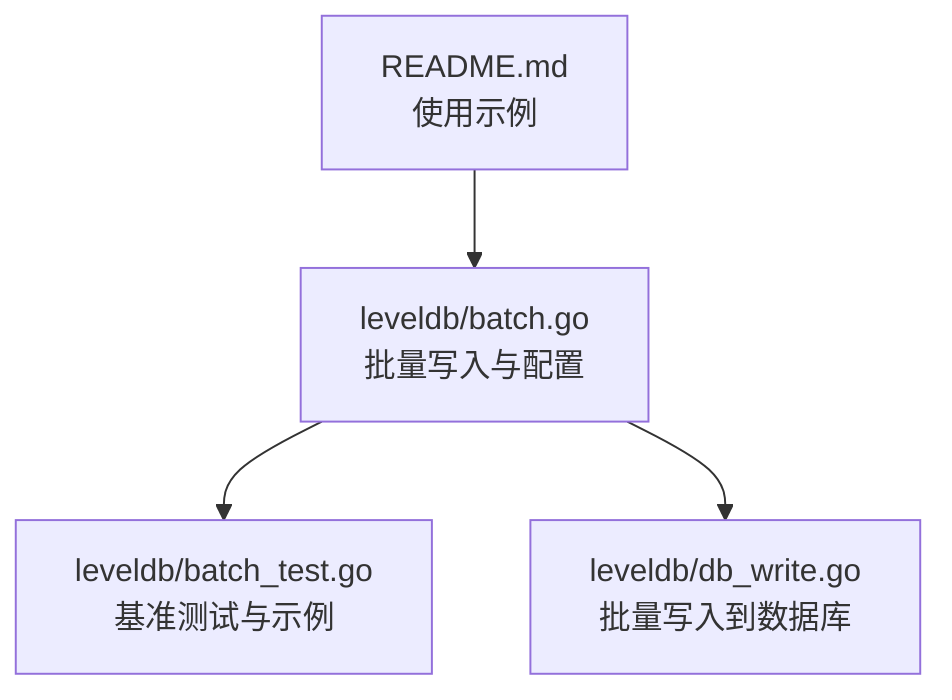
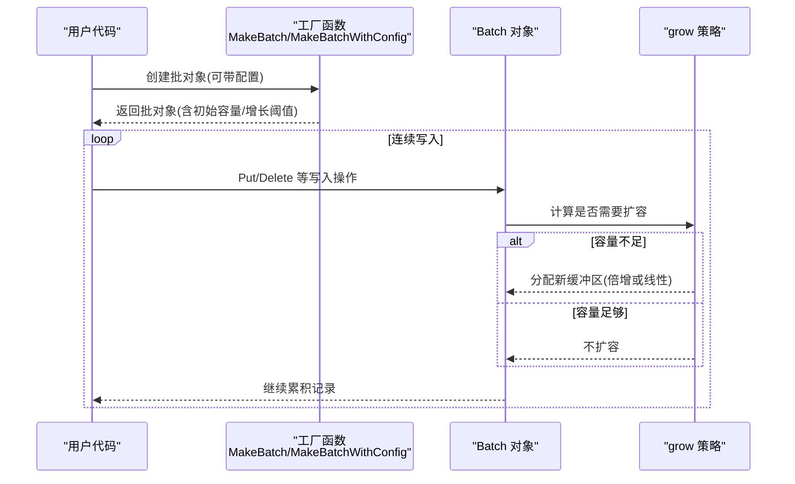
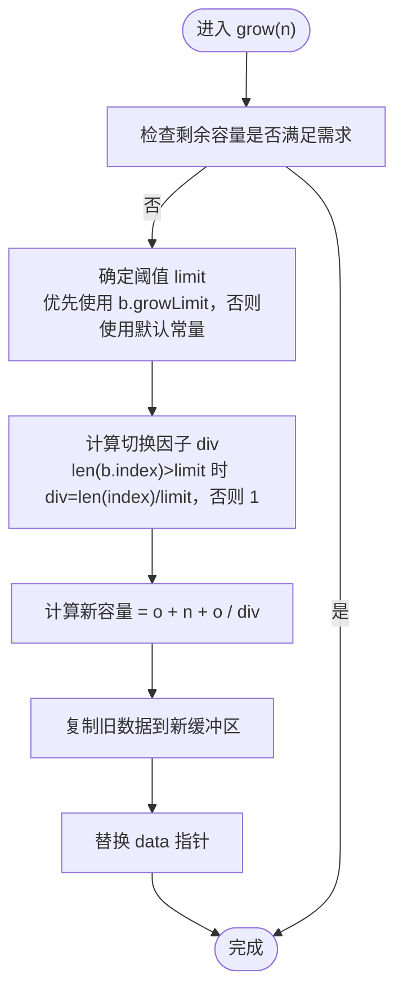
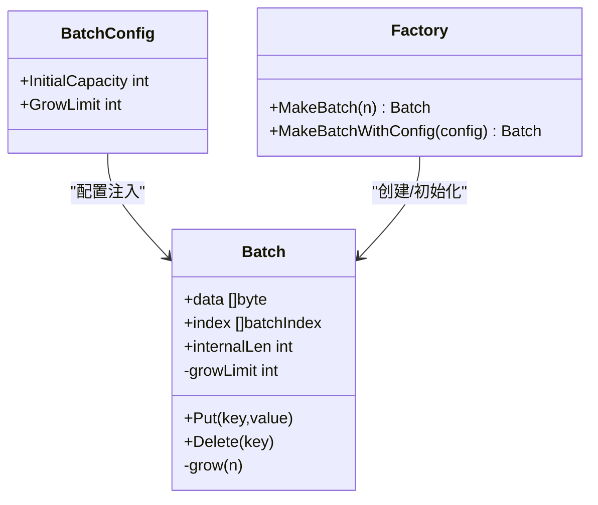

# 批量操作配置

<cite>
**本文引用的文件**
- [batch.go](file://leveldb/batch.go)
- [batch_test.go](file://leveldb/batch_test.go)
- [README.md](file://README.md)
</cite>

## 目录
1. [引言](#引言)
2. [项目结构](#项目结构)
3. [核心组件](#核心组件)
4. [架构总览](#架构总览)
5. [详细组件分析](#详细组件分析)
6. [依赖关系分析](#依赖关系分析)
7. [性能考量](#性能考量)
8. [故障排查指南](#故障排查指南)
9. [结论](#结论)
10. [附录](#附录)

## 引言
本文件围绕批量写入配置机制进行深入技术解析，重点阐述 BatchConfig 结构体的两个关键配置项：InitialCapacity（初始容量）与 GrowLimit（增长阈值）。我们将从源码实现出发，解释 InitialCapacity 如何通过 MakeBatch 与 MakeBatchWithConfig 实现预分配缓冲区以降低内存碎片；剖析 GrowLimit 参数如何控制内存增长行为——在记录数低于阈值时采用倍增策略，在超过阈值后转为线性增长；并结合 grow 方法的实现逻辑，说明该机制如何在内存使用效率与分配性能之间取得平衡。最后给出不同工作负载下的配置调优建议，并提供 MakeBatch 与 MakeBatchWithConfig 的使用对比示例路径。

## 项目结构
本仓库为 LevelDB 的 Go 语言实现，批量写入功能位于 leveldb 包内。本次文档聚焦于批量写入相关的核心文件：
- leveldb/batch.go：批量写入类型、配置结构体、工厂函数与增长策略实现
- leveldb/batch_test.go：批量写入基准测试与配置使用示例
- README.md：项目使用示例，包含批量写入的基本用法

图表来源
- [batch.go](file://leveldb/batch.go#L263-L302)
- [batch_test.go](file://leveldb/batch_test.go#L150-L178)
- [README.md](file://README.md#L85-L93)

章节来源
- [batch.go](file://leveldb/batch.go#L263-L302)
- [batch_test.go](file://leveldb/batch_test.go#L150-L178)
- [README.md](file://README.md#L85-L93)

## 核心组件
- Batch：批量写入对象，内部维护字节缓冲区与索引，用于累积键值对或删除操作。
- BatchConfig：批量写入配置结构体，包含 InitialCapacity 与 GrowLimit 两项配置。
- 工厂函数：
  - MakeBatch(n)：返回一个初始容量为 n 的空批对象（预分配缓冲区）
  - MakeBatchWithConfig(config)：根据配置初始化批对象，支持设置 InitialCapacity 与 GrowLimit

章节来源
- [batch.go](file://leveldb/batch.go#L62-L75)
- [batch.go](file://leveldb/batch.go#L263-L302)

## 架构总览
批量写入配置机制在运行时影响以下流程：
- 初始化阶段：通过工厂函数选择合适的初始容量与增长阈值
- 写入阶段：每次追加记录前调用 grow 预估并按需扩容
- 增长策略：根据当前记录数量与 GrowLimit 切换倍增与线性增长

图表来源
- [batch.go](file://leveldb/batch.go#L263-L302)
- [batch.go](file://leveldb/batch.go#L77-L92)

## 详细组件分析

### BatchConfig 结构体与配置项
- InitialCapacity
  - 含义：批对象初始容量（字节数），用于预分配底层缓冲区，避免频繁扩容
  - 默认值：0（不预分配）
  - 设置方式：通过 MakeBatchWithConfig(config) 将 config.InitialCapacity 应用到新建的 Batch 对象
- GrowLimit
  - 含义：增长阈值（记录条数），决定扩容策略的切换点
  - 默认值：3000（常量）
  - 设置方式：通过 MakeBatchWithConfig(config) 将 config.GrowLimit 应用到新建的 Batch 对象

章节来源
- [batch.go](file://leveldb/batch.go#L268-L288)
- [batch.go](file://leveldb/batch.go#L33-L36)
- [batch.go](file://leveldb/batch.go#L290-L302)

### 工厂函数：MakeBatch 与 MakeBatchWithConfig
- MakeBatch(n)
  - 行为：创建一个初始长度为 0、容量为 n 的空批对象
  - 适用场景：已知大致写入规模，直接一次性预分配，减少后续扩容次数
  - 参考路径：[MakeBatch](file://leveldb/batch.go#L263-L266)
- MakeBatchWithConfig(config)
  - 行为：根据配置初始化批对象
    - 若 config.InitialCapacity > 0，则设置初始容量
    - 若 config.GrowLimit > 0，则设置增长阈值
  - 适用场景：需要更精细地控制内存增长节奏，或针对特定工作负载优化
  - 参考路径：[MakeBatchWithConfig](file://leveldb/batch.go#L290-L302)

章节来源
- [batch.go](file://leveldb/batch.go#L263-L302)

### 增长策略：grow 方法与倍增/线性切换
- grow(n) 的核心逻辑
  - 当前数据长度为 o = len(b.data)，若剩余容量 cap(b.data)-o 小于所需空间 n，则触发扩容
  - 扩容阈值 limit 的确定：
    - 默认使用常量 batchGrowLimit（默认 3000）
    - 若 b.growLimit > 0，则使用 b.growLimit
  - 切换因子 div 的计算：
    - 若当前记录数 len(b.index) 超过 limit，则 div = len(b.index) / limit
    - 否则 div = 1（保持倍增）
  - 新容量计算：新容量 = o + n + o / div
  - 复制旧数据到新缓冲区并替换指针
- 倍增与线性增长的含义
  - 倍增：div=1 时，新容量约为原容量的 1 + n/o 倍，通常接近翻倍
  - 线性增长：div>1 时，新增容量被限制为约 o + n + o/div，div 越大，增长越趋近线性

图表来源
- [batch.go](file://leveldb/batch.go#L77-L92)
- [batch.go](file://leveldb/batch.go#L33-L36)

章节来源
- [batch.go](file://leveldb/batch.go#L77-L92)
- [batch.go](file://leveldb/batch.go#L33-L36)

### 写入路径与索引更新
- 每次写入（Put/Delete）会先调用 grow 预估并扩容，然后将记录编码到缓冲区末尾，并更新索引与 internalLen
- 索引结构包含键类型、键/值位置与版本号等信息，便于后续回放与内存写入

章节来源
- [batch.go](file://leveldb/batch.go#L94-L136)

### 使用对比示例（路径）
- 使用 MakeBatch 预分配固定容量
  - 示例路径：[MakeBatch 示例](file://leveldb/batch.go#L263-L266)
- 使用 MakeBatchWithConfig 指定 InitialCapacity 与 GrowLimit
  - 示例路径：[MakeBatchWithConfig 示例](file://leveldb/batch.go#L290-L302)
- 基准测试中使用不同 GrowLimit 的对比
  - 示例路径：[基准测试-默认与高 GrowLimit](file://leveldb/batch_test.go#L150-L178)

章节来源
- [batch.go](file://leveldb/batch.go#L263-L302)
- [batch_test.go](file://leveldb/batch_test.go#L150-L178)

## 依赖关系分析
- Batch 对象依赖 grow 策略来管理内存增长
- BatchConfig 作为外部配置注入到 Batch 对象
- 工厂函数负责将配置应用到 Batch 对象
- 基准测试验证不同 GrowLimit 下的分配开销差异

图表来源
- [batch.go](file://leveldb/batch.go#L62-L75)
- [batch.go](file://leveldb/batch.go#L268-L302)

章节来源
- [batch.go](file://leveldb/batch.go#L62-L75)
- [batch.go](file://leveldb/batch.go#L268-L302)

## 性能考量
- InitialCapacity 的作用
  - 在已知写入规模时，通过 MakeBatch(n) 或 MakeBatchWithConfig(config) 设置 InitialCapacity，可显著减少扩容次数，降低内存碎片与拷贝成本
- GrowLimit 的作用
  - 默认阈值为 3000 条记录，用于在“倍增”与“线性增长”之间切换
  - 倍增阶段适合小规模累积，快速扩大容量
  - 超过阈值后线性增长，避免单次分配过大导致内存浪费与抖动
- 基准测试启示
  - 测试通过设置较大的 GrowLimit（如 10 倍默认阈值）来减少分配次数，从而提升高吞吐写入场景的性能
  - 参考路径：[基准测试-高 GrowLimit](file://leveldb/batch_test.go#L154-L157)

章节来源
- [batch.go](file://leveldb/batch.go#L33-L36)
- [batch.go](file://leveldb/batch.go#L268-L288)
- [batch_test.go](file://leveldb/batch_test.go#L154-L157)

## 故障排查指南
- 批量写入异常
  - 若出现“批损坏”错误，通常是由于记录编码或解码过程中的长度校验失败
  - 可通过回放（Replay）或加载（Load）接口定位问题
  - 参考路径：[错误类型与解码流程](file://leveldb/batch.go#L19-L31)
- 写入性能问题
  - 如果分配过于频繁，考虑提高 InitialCapacity 或增大 GrowLimit
  - 如果单次分配过大导致内存压力，适当降低 GrowLimit 或减少单次写入批次大小
- 使用建议
  - 高吞吐写入场景：设置较高的 GrowLimit，减少分配次数
  - 小批量写入场景：可使用较小的 InitialCapacity 并保持默认 GrowLimit
  - 参考路径：[基准测试示例](file://leveldb/batch_test.go#L150-L178)

章节来源
- [batch.go](file://leveldb/batch.go#L19-L31)
- [batch_test.go](file://leveldb/batch_test.go#L150-L178)

## 结论
BatchConfig 的两个配置项在批量写入中扮演关键角色：
- InitialCapacity 通过预分配缓冲区减少扩容次数，改善内存局部性与分配性能
- GrowLimit 通过“倍增—线性”的动态切换策略，在早期快速扩展与后期稳定增长之间取得平衡
结合工厂函数与 grow 策略，开发者可在不同工作负载下灵活调优，获得更优的吞吐与内存使用表现。

## 附录
- 快速参考
  - 配置结构体：[BatchConfig](file://leveldb/batch.go#L268-L288)
  - 工厂函数：
    - [MakeBatch](file://leveldb/batch.go#L263-L266)
    - [MakeBatchWithConfig](file://leveldb/batch.go#L290-L302)
  - 增长策略：[grow](file://leveldb/batch.go#L77-L92)
  - 默认阈值：[batchGrowLimit](file://leveldb/batch.go#L33-L36)
  - 使用示例（README）：[批量写入示例](file://README.md#L85-L93)
  - 基准测试（对比不同 GrowLimit）：[基准测试](file://leveldb/batch_test.go#L150-L178)