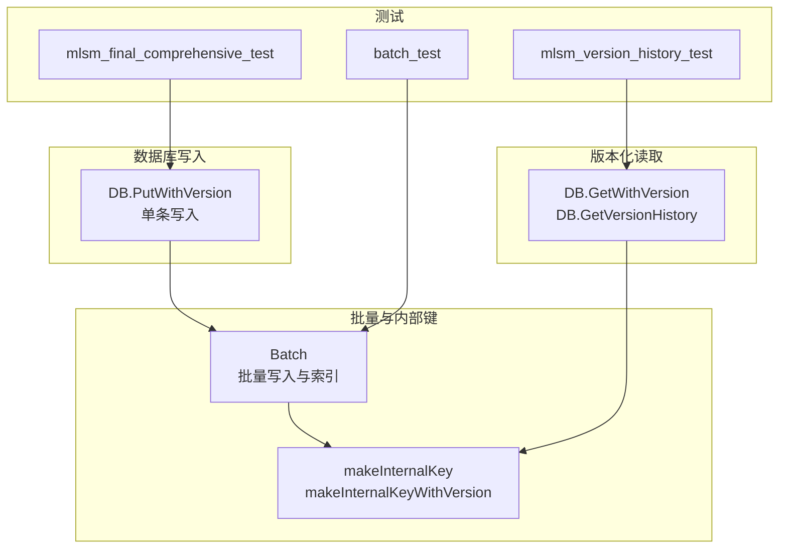
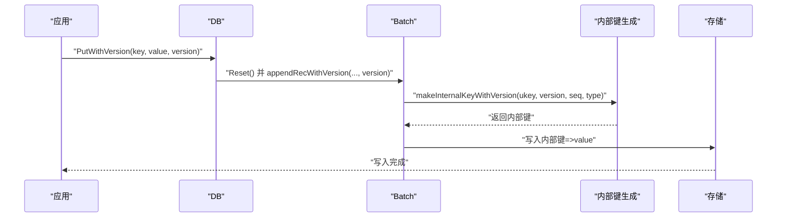
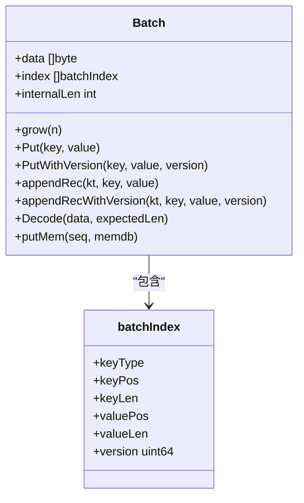
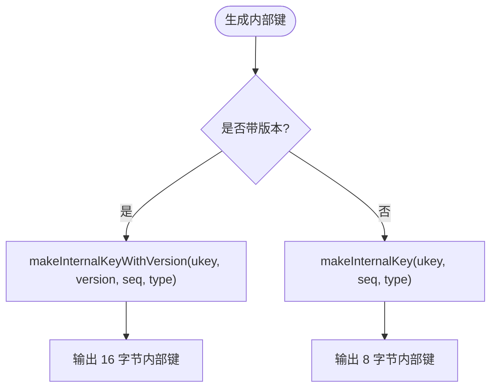
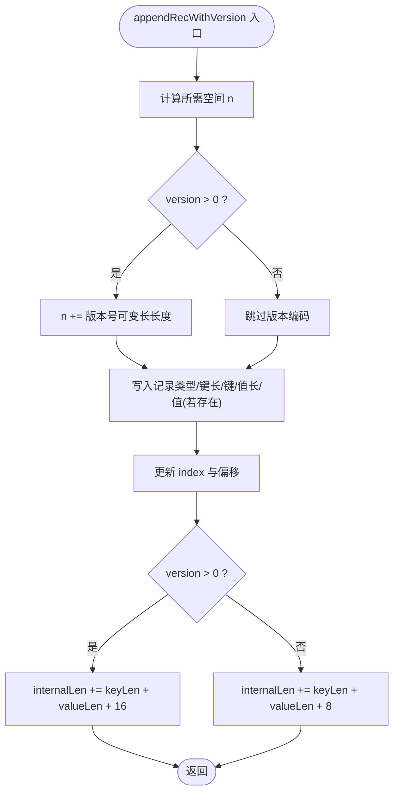
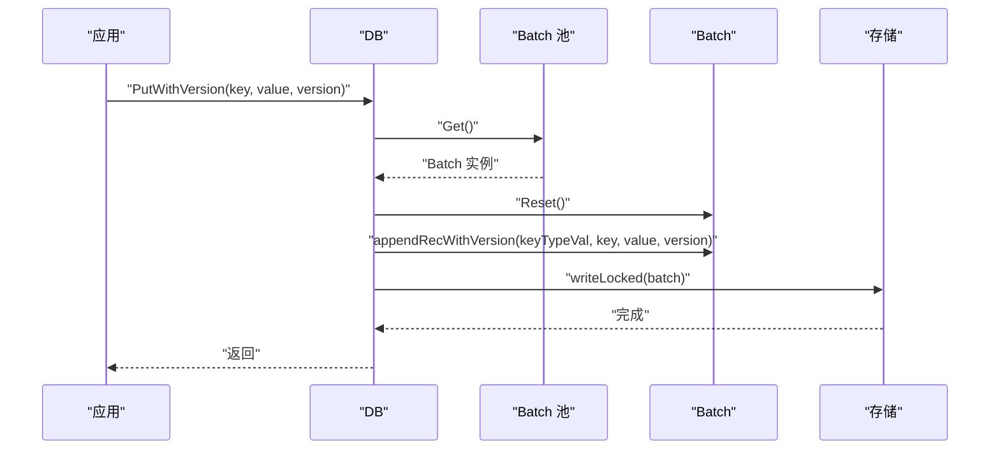
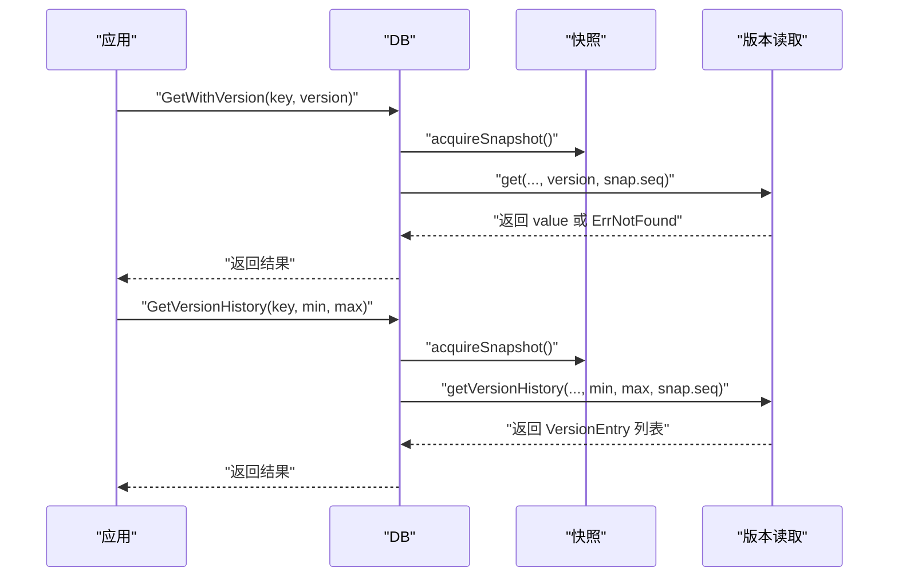
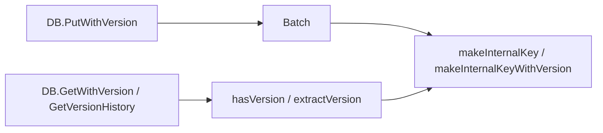

# 版本化批量操作

<cite>
**本文引用的文件**
- [leveldb/batch.go](file://leveldb/batch.go)
- [leveldb/key.go](file://leveldb/key.go)
- [leveldb/db_write.go](file://leveldb/db_write.go)
- [leveldb/db.go](file://leveldb/db.go)
- [leveldb/mlsm_version_history_test.go](file://leveldb/mlsm_version_history_test.go)
- [leveldb/mlsm_final_comprehensive_test.go](file://leveldb/mlsm_final_comprehensive_test.go)
- [leveldb/batch_test.go](file://leveldb/batch_test.go)
</cite>

## 目录
1. [简介](#简介)
2. [项目结构](#项目结构)
3. [核心组件](#核心组件)
4. [架构总览](#架构总览)
5. [详细组件分析](#详细组件分析)
6. [依赖关系分析](#依赖关系分析)
7. [性能考量](#性能考量)
8. [故障排查指南](#故障排查指南)
9. [结论](#结论)
10. [附录](#附录)

## 简介
本文件系统性记录 avccDB 中“版本化批量操作”的实现与使用，重点围绕以下目标展开：
- 解释 PutWithVersion 方法如何扩展标准 Put 操作以支持版本号写入；
- 解析 batchIndex 结构体中 version 字段的作用及其在内部键（internal key）生成中的应用；
- 解释 appendRecWithVersion 方法如何处理带版本的数据记录编码，并分析其对 internalLen 计算的影响；
- 描述版本化批量操作在多版本并发控制（MVCC）场景下的典型应用模式，如历史数据插入和时间序列写入；
- 提供与非版本化操作的性能对比分析，指出额外开销来源（如 16 字节内部键），并给出优化建议。

## 项目结构
与版本化批量操作直接相关的核心文件包括：
- 批量写入与索引：leveldb/batch.go
- 内部键编码与解析：leveldb/key.go
- 数据库写入入口（单条 PutWithVersion）：leveldb/db_write.go
- 版本化读取接口（GetWithVersion、GetVersionHistory）：leveldb/db.go
- 版本化功能测试：leveldb/mlsm_version_history_test.go、leveldb/mlsm_final_comprehensive_test.go
- 批量写入行为与 internalLen 行为测试：leveldb/batch_test.go

图表来源
- [leveldb/batch.go](file://leveldb/batch.go#L62-L196)
- [leveldb/key.go](file://leveldb/key.go#L75-L147)
- [leveldb/db_write.go](file://leveldb/db_write.go#L387-L438)
- [leveldb/db.go](file://leveldb/db.go#L1092-L1182)
- [leveldb/mlsm_version_history_test.go](file://leveldb/mlsm_version_history_test.go#L1-L139)
- [leveldb/mlsm_final_comprehensive_test.go](file://leveldb/mlsm_final_comprehensive_test.go#L73-L116)
- [leveldb/batch_test.go](file://leveldb/batch_test.go#L55-L149)

章节来源
- [leveldb/batch.go](file://leveldb/batch.go#L62-L196)
- [leveldb/key.go](file://leveldb/key.go#L75-L147)
- [leveldb/db_write.go](file://leveldb/db_write.go#L387-L438)
- [leveldb/db.go](file://leveldb/db.go#L1092-L1182)
- [leveldb/mlsm_version_history_test.go](file://leveldb/mlsm_version_history_test.go#L1-L139)
- [leveldb/mlsm_final_comprehensive_test.go](file://leveldb/mlsm_final_comprehensive_test.go#L73-L116)
- [leveldb/batch_test.go](file://leveldb/batch_test.go#L55-L149)

## 核心组件
- Batch：封装批量写入记录，维护 data 缓冲区、索引数组 index，以及 internalLen 统计。
- batchIndex：记录每条记录的类型、键值偏移与长度、以及版本号 version。
- makeInternalKey / makeInternalKeyWithVersion：内部键编码函数，分别生成 8 字节或 16 字节内部键。
- DB.PutWithVersion：单条带版本写入入口，内部构造 Batch 并提交。
- DB.GetWithVersion / DB.GetVersionHistory：版本化读取接口，支持按版本范围查询历史。

章节来源
- [leveldb/batch.go](file://leveldb/batch.go#L62-L196)
- [leveldb/key.go](file://leveldb/key.go#L75-L147)
- [leveldb/db_write.go](file://leveldb/db_write.go#L387-L438)
- [leveldb/db.go](file://leveldb/db.go#L1092-L1182)

## 架构总览
版本化批量写入的关键流程如下：
- 应用通过 Batch.PutWithVersion 或 DB.PutWithVersion 提交带版本的写入请求；
- Batch 在 appendRecWithVersion 中编码记录，包含可选版本号，并更新 internalLen；
- 写入时根据是否带版本选择 makeInternalKeyWithVersion 或 makeInternalKey 生成内部键；
- 读取时通过 DB.GetWithVersion 或 DB.GetVersionHistory 查询指定版本的历史数据。

图表来源
- [leveldb/db_write.go](file://leveldb/db_write.go#L387-L438)
- [leveldb/batch.go](file://leveldb/batch.go#L98-L136)
- [leveldb/key.go](file://leveldb/key.go#L90-L104)

## 详细组件分析

### Batch 与版本化记录编码
- 扩展 Put 操作：Batch.PutWithVersion 直接委托给 appendRecWithVersion，传入 version 参数。
- 记录编码：appendRecWithVersion 支持可选版本号，当 version > 0 时，会在记录中编码该版本；同时根据是否带版本调整 internalLen 的增量规则。
- 索引与偏移：batchIndex 记录 keyType、keyPos/keyLen、valuePos/valueLen 以及 version，用于后续解码与重放。

图表来源
- [leveldb/batch.go](file://leveldb/batch.go#L62-L196)

章节来源
- [leveldb/batch.go](file://leveldb/batch.go#L98-L136)
- [leveldb/batch.go](file://leveldb/batch.go#L138-L148)
- [leveldb/batch.go](file://leveldb/batch.go#L226-L242)

### 内部键生成与 version 字段作用
- makeInternalKey：生成 8 字节内部键，格式为 ukey + 8 字节 packed(seq, type)。
- makeInternalKeyWithVersion：生成 16 字节内部键，格式为 ukey + 8 字节 version + 8 字节 packed(seq, type)。
- version 字段作用：在内部键中携带版本号，使同一 ukey 的多版本数据可共存且可按版本排序；解析时可通过 hasVersion/extractVersion 判断并提取版本。

图表来源
- [leveldb/key.go](file://leveldb/key.go#L75-L104)
- [leveldb/key.go](file://leveldb/key.go#L134-L147)

章节来源
- [leveldb/key.go](file://leveldb/key.go#L75-L104)
- [leveldb/key.go](file://leveldb/key.go#L134-L147)

### appendRecWithVersion 的编码逻辑与 internalLen 影响
- 可变长编码：键长、值长均采用可变长编码；当带版本时，还会写入版本号的可变长编码。
- internalLen 计算：非版本记录 +8 字节内部键头，版本记录 +16 字节内部键头；该统计用于批量元信息与内存预分配策略。

图表来源
- [leveldb/batch.go](file://leveldb/batch.go#L98-L136)

章节来源
- [leveldb/batch.go](file://leveldb/batch.go#L98-L136)

### 单条写入入口：DB.PutWithVersion
- 获取写锁/合并策略，构造 Batch 并调用 appendRecWithVersion 写入带版本记录，随后提交到存储层。

图表来源
- [leveldb/db_write.go](file://leveldb/db_write.go#L387-L438)
- [leveldb/batch.go](file://leveldb/batch.go#L98-L136)

章节来源
- [leveldb/db_write.go](file://leveldb/db_write.go#L387-L438)

### 版本化读取：GetWithVersion 与 GetVersionHistory
- GetWithVersion：获取指定版本的历史值；若 version 为 0，则返回最新版本。
- GetVersionHistory：按版本范围查询某键的所有历史版本，返回有序列表。

图表来源
- [leveldb/db.go](file://leveldb/db.go#L1092-L1182)

章节来源
- [leveldb/db.go](file://leveldb/db.go#L1092-L1182)

### 典型应用模式：历史数据插入与时间序列写入
- 历史数据插入：对同一键多次写入不同版本，形成历史版本链；通过 GetVersionHistory 查询指定范围内的版本。
- 时间序列写入：以时间戳作为版本号，写入随时间演进的数据点；读取时按版本范围检索。

章节来源
- [leveldb/mlsm_version_history_test.go](file://leveldb/mlsm_version_history_test.go#L1-L139)
- [leveldb/mlsm_final_comprehensive_test.go](file://leveldb/mlsm_final_comprehensive_test.go#L73-L116)

## 依赖关系分析
- Batch 依赖内部键生成函数以决定 8 字节或 16 字节内部键头大小；
- DB.PutWithVersion 依赖 Batch 的 appendRecWithVersion；
- 版本化读取依赖内部键解析工具（hasVersion/extractVersion）判断版本键并提取版本号。

图表来源
- [leveldb/batch.go](file://leveldb/batch.go#L98-L136)
- [leveldb/key.go](file://leveldb/key.go#L90-L147)
- [leveldb/db_write.go](file://leveldb/db_write.go#L387-L438)
- [leveldb/db.go](file://leveldb/db.go#L1092-L1182)

章节来源
- [leveldb/batch.go](file://leveldb/batch.go#L98-L136)
- [leveldb/key.go](file://leveldb/key.go#L90-L147)
- [leveldb/db_write.go](file://leveldb/db_write.go#L387-L438)
- [leveldb/db.go](file://leveldb/db.go#L1092-L1182)

## 性能考量
- 额外开销来源
  - 内部键头：版本记录比非版本记录多 8 字节内部键头（从 8 字节增加到 16 字节），导致存储与比较成本上升。
  - 可变长编码：键长/值长/版本号均采用可变长编码，编码与解码带来 CPU 开销。
  - 内存增长策略：Batch.grow 在 entries 超过阈值时按比例扩容，避免频繁分配。
- 与非版本化操作对比
  - 存储体积：版本化写入通常更大（16 字节内部键头 vs 8 字节）。
  - 写入吞吐：版本化写入在编码与内部键头处理上略有额外开销；批量写入可显著降低单条写入开销。
  - 读取路径：GetVersionHistory 需要遍历版本并按版本排序，范围查询可能涉及多层 SST 文件扫描。
- 优化建议
  - 合理设置 Batch 初始容量与 GrowLimit，减少扩容次数。
  - 使用批量写入（Batch）合并多次写入，降低内部键头与元组开销。
  - 控制版本数量与范围，避免过度膨胀；必要时定期触发 Compaction 清理过期版本。
  - 对热点键采用更合理的版本策略（如仅保留最近 N 个版本）。

章节来源
- [leveldb/batch.go](file://leveldb/batch.go#L77-L96)
- [leveldb/batch.go](file://leveldb/batch.go#L98-L136)
- [leveldb/mlsm_final_comprehensive_test.go](file://leveldb/mlsm_final_comprehensive_test.go#L73-L116)

## 故障排查指南
- 批量损坏错误：Batch.decode/decodeBatch 在记录长度或类型异常时返回批损坏错误，需检查数据源与加载流程。
- 内部键损坏：parseInternalKey/parseInternalKeyWithVersion 在长度不足或类型非法时返回内部键损坏错误，需确认内部键格式。
- 读取不到版本：确认版本号是否正确传递，以及是否存在对应版本；使用 GetVersionHistory 校验版本范围。

章节来源
- [leveldb/batch.go](file://leveldb/batch.go#L226-L242)
- [leveldb/key.go](file://leveldb/key.go#L106-L133)

## 结论
avccDB 的版本化批量操作通过在内部键中嵌入版本号，实现了对同一键多版本数据的稳定存储与高效查询。Batch.AppendRecWithVersion 与 DB.PutWithVersion 将版本号无缝集成到写入路径，配合 makeInternalKeyWithVersion 的内部键生成，确保了版本排序与 MVCC 场景下的正确性。尽管版本化写入引入了额外的内部键头与编码开销，但通过批量写入与合理的配置，可在保证功能的同时获得良好的整体性能。

## 附录
- 测试参考
  - 版本历史查询测试：验证 GetVersionHistory 的范围查询与一致性。
  - 综合性能测试：覆盖多键多版本写入与验证流程。
  - 批量行为测试：验证 internalLen 与索引行为的一致性。

章节来源
- [leveldb/mlsm_version_history_test.go](file://leveldb/mlsm_version_history_test.go#L1-L139)
- [leveldb/mlsm_final_comprehensive_test.go](file://leveldb/mlsm_final_comprehensive_test.go#L73-L116)
- [leveldb/batch_test.go](file://leveldb/batch_test.go#L55-L149)