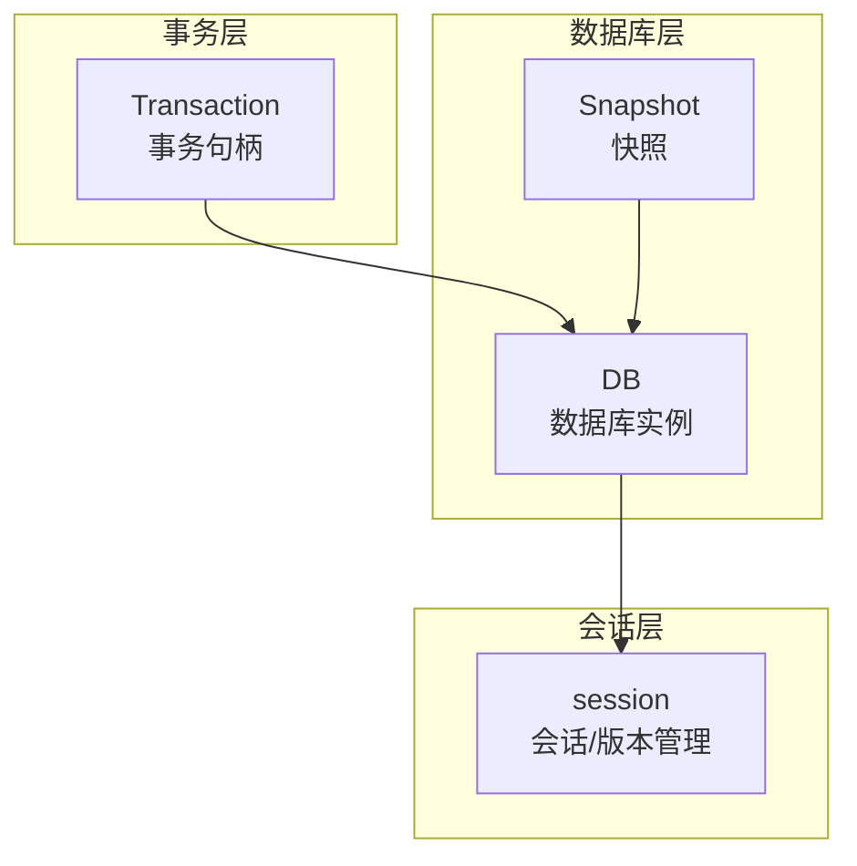
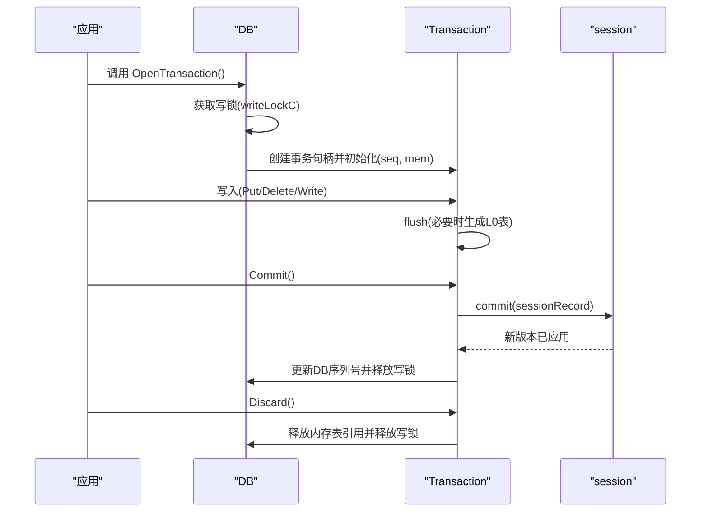
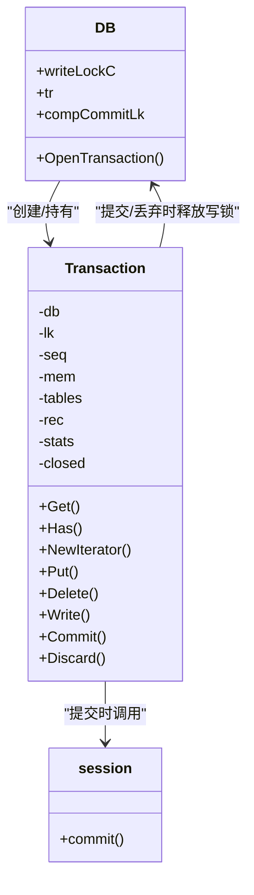

# 事务管理

<cite>
**本文引用的文件**
- [db_transaction.go](file://leveldb/db_transaction.go)
- [db.go](file://leveldb/db.go)
- [db_snapshot.go](file://leveldb/db_snapshot.go)
- [session.go](file://leveldb/session.go)
- [db_test.go](file://leveldb/db_test.go)
- [external_test.go](file://leveldb/external_test.go)
- [main.go](file://manualtest/dbstress/main.go)
</cite>

## 目录
1. [简介](#简介)
2. [项目结构](#项目结构)
3. [核心组件](#核心组件)
4. [架构总览](#架构总览)
5. [详细组件分析](#详细组件分析)
6. [依赖关系分析](#依赖关系分析)
7. [性能考量](#性能考量)
8. [故障排查指南](#故障排查指南)
9. [结论](#结论)

## 简介
本文件面向 avccDB 的事务管理能力，系统化梳理事务的生命周期、ACID 特性保障、隔离级别与并发控制、与快照的协作方式，以及在高并发场景下的性能表现。重点覆盖以下 API：
- DB.OpenTransaction：开启原子事务
- Transaction.Commit：提交事务
- Transaction.Discard：丢弃事务
同时给出标准使用模式、错误处理最佳实践、常见问题（如死锁预防、事务回滚）的解决方案。

## 项目结构
事务相关的核心实现集中在 leveldb 子包中，关键文件如下：
- 事务句柄与提交逻辑：leveldb/db_transaction.go
- 数据库主结构与并发控制：leveldb/db.go
- 快照与序列号管理：leveldb/db_snapshot.go
- 会话提交与版本推进：leveldb/session.go
- 行为验证与并发测试：leveldb/db_test.go、leveldb/external_test.go
- 压力测试与性能观测：manualtest/dbstress/main.go

图表来源
- [db_transaction.go](file://leveldb/db_transaction.go#L284-L336)
- [db.go](file://leveldb/db.go#L33-L120)
- [db_snapshot.go](file://leveldb/db_snapshot.go#L21-L91)
- [session.go](file://leveldb/session.go#L210-L243)

章节来源
- [db_transaction.go](file://leveldb/db_transaction.go#L284-L336)
- [db.go](file://leveldb/db.go#L33-L120)
- [db_snapshot.go](file://leveldb/db_snapshot.go#L21-L91)
- [session.go](file://leveldb/session.go#L210-L243)

## 核心组件
- 事务句柄 Transaction：封装事务状态（内存表、已落盘表、序列号、统计）、读写操作、提交与丢弃流程。
- 数据库 DB：持有全局写锁、事务指针、会话对象；负责事务开启时的互斥与等待、提交时的版本推进与触发压缩。
- 会话 session：负责将事务记录合并到当前版本，推进 Manifest 并应用新版本。
- 快照 Snapshot：基于序列号提供一致性视图，与事务的读取语义协同工作。

章节来源
- [db_transaction.go](file://leveldb/db_transaction.go#L21-L33)
- [db.go](file://leveldb/db.go#L33-L120)
- [session.go](file://leveldb/session.go#L210-L243)
- [db_snapshot.go](file://leveldb/db_snapshot.go#L21-L91)

## 架构总览
事务从“开启—写入—提交/丢弃”贯穿 DB、Transaction、session 三层，期间通过写锁与会话提交确保原子性与持久性。

图表来源
- [db_transaction.go](file://leveldb/db_transaction.go#L284-L336)
- [db_transaction.go](file://leveldb/db_transaction.go#L189-L252)
- [session.go](file://leveldb/session.go#L210-L243)
- [db.go](file://leveldb/db.go#L33-L120)

## 详细组件分析

### 事务句柄 Transaction
- 关键字段
  - db：所属数据库实例
  - lk：读写锁，保护事务内部状态
  - seq：事务内自增序列号
  - mem：事务专用内存表
  - tables：已落盘的L0表集合
  - rec：事务记录（用于提交）
  - stats：提交阶段的统计计时
  - closed：是否已关闭（提交或丢弃后置位）

- 读写接口
  - Get/Has/NewIterator：基于事务的最新快照读取，返回的迭代器可独立于事务生命周期存在
  - Put/Delete/Write：写入事务，必要时触发 flush 将内存表转为 L0 表

- 提交流程
  - flush：当内存表空间不足时，将内存表内容重放到 L0 表，并更新 rec 与统计
  - Commit：执行 flush 后，若存在 L0 表则调用 session.commit 推进版本；支持最多3次重试；成功后设置 DB 序列号并触发压缩；最后 setDone 释放资源
  - Discard：丢弃事务，移除临时生成的 L0 表并释放资源

- 生命周期管理
  - 开启：OpenTransaction 成功后，DB 持有写锁，同一时刻仅允许一个事务
  - 结束：Commit 或 Discard 后，事务标记 closed，释放 mem 引用并归还写锁
  - 关闭 DB：会丢弃开放中的事务

章节来源
- [db_transaction.go](file://leveldb/db_transaction.go#L21-L33)
- [db_transaction.go](file://leveldb/db_transaction.go#L118-L181)
- [db_transaction.go](file://leveldb/db_transaction.go#L189-L252)
- [db_transaction.go](file://leveldb/db_transaction.go#L254-L275)
- [db_transaction.go](file://leveldb/db_transaction.go#L284-L336)

### 数据库 DB 与并发控制
- 写锁 writeLockC：OpenTransaction 通过 select 阻塞式获取写锁，确保同一时刻仅有一个事务处于活跃状态
- tr 指针：指向当前开放事务，防止重复开启
- compCommitLk：提交阶段的互斥锁，避免与常规写入/压缩冲突
- waitCompaction：当 L0 表数量超过阈值时阻塞事务，避免过度堆积

章节来源
- [db.go](file://leveldb/db.go#L33-L120)
- [db_transaction.go](file://leveldb/db_transaction.go#L284-L336)

### 会话 session 与版本推进
- commit：根据当前版本生成新版本，写入 Manifest 并应用新版本；失败时丢弃新版本 ID
- 事务提交最终通过 session.commit 完成持久化与版本推进

章节来源
- [session.go](file://leveldb/session.go#L210-L243)

### 快照与事务的一致性
- 快照基于序列号提供一致性视图，事务读取时使用事务的 seq 作为可见性依据
- 事务 NewIterator 返回的迭代器可独立于事务生命周期存在，但其持有的版本引用不随事务释放而失效

章节来源
- [db_snapshot.go](file://leveldb/db_snapshot.go#L21-L91)
- [db_transaction.go](file://leveldb/db_transaction.go#L61-L90)

### API 参考

- 函数：DB.OpenTransaction
  - 功能：开启一个原子事务，同一时刻仅允许一个事务处于活跃状态
  - 并发：通过写锁与 tr 指针保证互斥
  - 返回：事务句柄与错误
  - 使用要点：开启后必须显式 Commit 或 Discard；关闭 DB 会自动丢弃开放事务
  - 参考路径：[OpenTransaction 实现](file://leveldb/db_transaction.go#L284-L336)

- 函数：Transaction.Commit
  - 功能：提交事务；若存在 L0 表，调用 session.commit 推进版本；支持最多3次重试
  - 错误处理：返回非空错误表示提交失败，用户可选择重试或丢弃
  - 资源释放：成功后更新 DB 序列号、触发压缩、释放写锁
  - 参考路径：[Commit 实现](file://leveldb/db_transaction.go#L189-L252)

- 函数：Transaction.Discard
  - 功能：丢弃事务，清理临时生成的 L0 表并释放资源
  - 并发：加锁保护，避免重复丢弃
  - 参考路径：[Discard 实现](file://leveldb/db_transaction.go#L254-L275)

- 函数：Transaction.Get/Has/NewIterator
  - 功能：基于事务的最新快照进行读取；NewIterator 返回的迭代器可独立于事务生命周期存在
  - 参考路径：[Get/Has/NewIterator 实现](file://leveldb/db_transaction.go#L41-L90)

- 函数：Transaction.Put/Delete/Write
  - 功能：写入事务；必要时触发 flush 将内存表转为 L0 表
  - 参考路径：[Put/Delete/Write 实现](file://leveldb/db_transaction.go#L132-L181)

- 函数：Snapshot.Get/Has/NewIterator/Release
  - 功能：基于序列号提供一致视图；Release 释放快照但不影响已返回的迭代器
  - 参考路径：[Snapshot 实现](file://leveldb/db_snapshot.go#L74-L188)

### 使用模式与示例（以路径代替代码）
- 标准事务流程
  - 打开事务：[OpenTransaction 调用](file://leveldb/db_transaction.go#L284-L336)
  - 写入数据：[Put/Write 示例](file://leveldb/db_transaction.go#L132-L181)
  - 提交事务：[Commit 流程](file://leveldb/db_transaction.go#L189-L252)
  - 丢弃事务：[Discard 流程](file://leveldb/db_transaction.go#L254-L275)

- 与快照结合
  - 事务读取：[NewIterator 基于事务快照](file://leveldb/db_transaction.go#L61-L90)
  - 快照读取：[Snapshot.NewIterator](file://leveldb/db_snapshot.go#L133-L166)

- 并发与压力测试参考
  - 事务与普通写入混合压力测试：[dbstress 主程序](file://manualtest/dbstress/main.go#L392-L467)
  - 事务行为验证（提交/丢弃）：[external_test 事务用例](file://leveldb/external_test.go#L88-L117)

章节来源
- [db_transaction.go](file://leveldb/db_transaction.go#L41-L90)
- [db_transaction.go](file://leveldb/db_transaction.go#L132-L181)
- [db_transaction.go](file://leveldb/db_transaction.go#L189-L252)
- [db_transaction.go](file://leveldb/db_transaction.go#L254-L275)
- [db_transaction.go](file://leveldb/db_transaction.go#L284-L336)
- [db_snapshot.go](file://leveldb/db_snapshot.go#L74-L188)
- [external_test.go](file://leveldb/external_test.go#L88-L117)
- [main.go](file://manualtest/dbstress/main.go#L392-L467)

## 依赖关系分析

图表来源
- [db.go](file://leveldb/db.go#L33-L120)
- [db_transaction.go](file://leveldb/db_transaction.go#L21-L33)
- [session.go](file://leveldb/session.go#L210-L243)

章节来源
- [db.go](file://leveldb/db.go#L33-L120)
- [db_transaction.go](file://leveldb/db_transaction.go#L21-L33)
- [session.go](file://leveldb/session.go#L210-L243)

## 性能考量
- 事务大小与写缓冲
  - 文档注释建议：当需要写入的数据量达到“Options.WriteBuffer”级时再使用事务，否则事务可能过度影响压缩
  - 参考路径：[OpenTransaction 注释](file://leveldb/db_transaction.go#L284-L296)

- 写锁与互斥
  - 事务开启时获取写锁，后续写入与 OpenTransaction 会被阻塞，避免并发写入竞争
  - 参考路径：[OpenTransaction 写锁获取](file://leveldb/db_transaction.go#L302-L310)

- L0 表堆积与暂停
  - 当 L0 表数量超过阈值时，waitCompaction 会阻塞事务，防止进一步堆积
  - 参考路径：[waitCompaction](file://leveldb/db_transaction.go#L277-L282)

- 提交重试与延迟
  - Commit 支持最多3次重试，遇到错误会短暂等待并继续重试，提升稳定性
  - 参考路径：[Commit 重试逻辑](file://leveldb/db_transaction.go#L214-L229)

- 压力测试与指标
  - 压力测试工具输出包括事务吞吐、延迟、写延迟、打开表数、存活快照等指标，便于评估性能
  - 参考路径：[dbstress 指标输出](file://manualtest/dbstress/main.go#L420-L448)

章节来源
- [db_transaction.go](file://leveldb/db_transaction.go#L277-L282)
- [db_transaction.go](file://leveldb/db_transaction.go#L284-L296)
- [db_transaction.go](file://leveldb/db_transaction.go#L214-L229)
- [main.go](file://manualtest/dbstress/main.go#L420-L448)

## 故障排查指南

- 死锁与阻塞
  - 症状：OpenTransaction 长时间阻塞
  - 原因：已有事务未提交或丢弃，导致写锁无法获取
  - 解决：确保及时 Commit 或 Discard；检查是否存在长时间运行的事务
  - 参考路径：[OpenTransaction 写锁获取](file://leveldb/db_transaction.go#L302-L310)

- 提交失败与重试
  - 症状：Commit 返回错误
  - 处理：根据错误决定重试或丢弃；重试前检查系统状态（如写延迟、L0 表数量）
  - 参考路径：[Commit 错误处理](file://leveldb/db_transaction.go#L214-L229)

- 事务回滚
  - 方式：调用 Discard 丢弃事务，释放临时生成的 L0 表与资源
  - 注意：丢弃后事务不可再次使用
  - 参考路径：[Discard 实现](file://leveldb/db_transaction.go#L254-L275)

- 迭代器与快照
  - 症状：迭代器在事务结束后仍需释放
  - 处理：使用完成后调用 Release；快照释放不影响已返回的迭代器
  - 参考路径：[Snapshot.Release](file://leveldb/db_snapshot.go#L168-L188)

- 并发读写
  - 症状：读取到旧值或异常
  - 处理：确认读取路径使用正确的快照或事务；避免跨事务共享迭代器
  - 参考路径：[NewIterator 语义](file://leveldb/db_transaction.go#L61-L90)

章节来源
- [db_transaction.go](file://leveldb/db_transaction.go#L254-L275)
- [db_transaction.go](file://leveldb/db_transaction.go#L284-L336)
- [db_snapshot.go](file://leveldb/db_snapshot.go#L168-L188)

## 结论
avccDB 的事务管理通过严格的写锁互斥、事务内的内存表与 L0 表组合、以及会话层的版本推进，实现了单事务内的原子性与持久性。读取通过序列号与快照保证一致性，NewIterator 的设计使其可独立于事务生命周期存在。在高并发场景下，建议遵循“大批次事务”的使用策略，合理利用重试与压缩触发机制，以获得更佳的吞吐与稳定性。