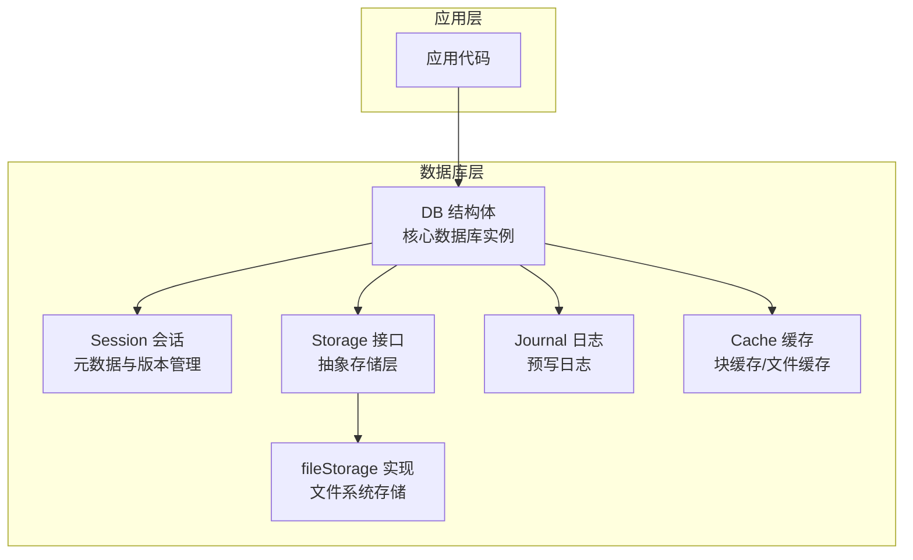
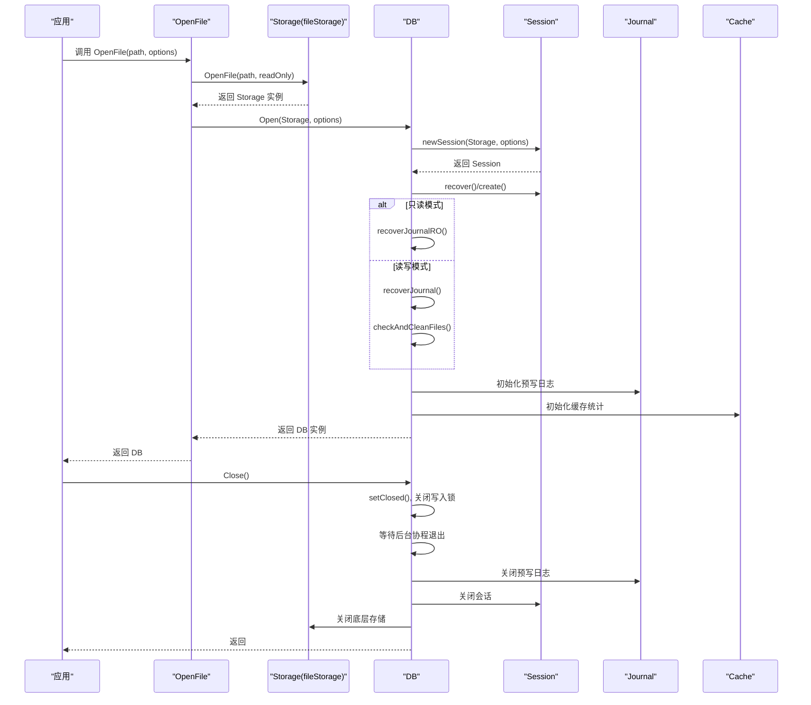
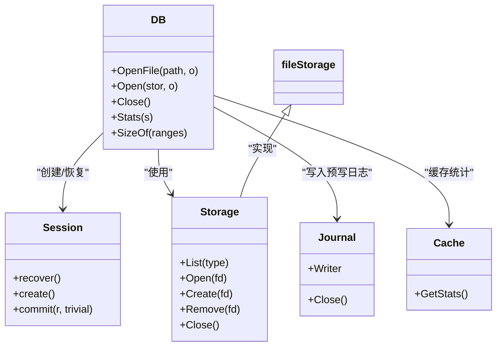

# 基本操作

<cite>
**本文引用的文件**
- [leveldb/db.go](file://leveldb/db.go)
- [leveldb/doc.go](file://leveldb/doc.go)
- [leveldb/errors.go](file://leveldb/errors.go)
- [leveldb/options.go](file://leveldb/options.go)
- [leveldb/session.go](file://leveldb/session.go)
- [leveldb/cache/cache.go](file://leveldb/cache/cache.go)
- [leveldb/storage/storage.go](file://leveldb/storage/storage.go)
- [leveldb/storage/file_storage.go](file://leveldb/storage/file_storage.go)
- [leveldb/journal/journal.go](file://leveldb/journal/journal.go)
- [leveldb/db_test.go](file://leveldb/db_test.go)
- [leveldb/bench_test.go](file://leveldb/bench_test.go)
</cite>

## 目录
1. [简介](#简介)
2. [项目结构](#项目结构)
3. [核心组件](#核心组件)
4. [架构总览](#架构总览)
5. [详细组件分析](#详细组件分析)
6. [依赖关系分析](#依赖关系分析)
7. [性能考量](#性能考量)
8. [故障排查指南](#故障排查指南)
9. [结论](#结论)
10. [附录](#附录)

## 简介
本章节面向 avccDB 的基础数据库操作，聚焦以下 API 的系统化参考：
- OpenFile：以路径方式打开或创建数据库
- Close：关闭数据库并释放资源
- Stats：采集数据库运行期统计信息
- SizeOf：估算给定键范围的存储占用大小

文档将逐项说明各方法的参数类型、含义与默认行为、返回值、可能抛出的错误类型；重点阐述数据库生命周期管理（OpenFile/Close）、内部资源管理与并发安全保证；并给出 Stats 与 SizeOf 的使用场景、返回值结构与调优建议。最后提供“打开-操作-关闭”的标准工作流与最佳实践。

## 项目结构
avccDB 的数据库核心位于 leveldb 子包中，围绕 DB 结构体实现数据库的打开、写入、读取、统计与关闭等能力。OpenFile 是对外暴露的常用入口，它通过 storage 层实现文件系统访问，并委托给 Open 完成会话初始化与恢复流程。

图表来源
- [leveldb/db.go](file://leveldb/db.go#L90-L175)
- [leveldb/session.go](file://leveldb/session.go#L120-L208)
- [leveldb/storage/storage.go](file://leveldb/storage/storage.go#L84-L90)
- [leveldb/storage/file_storage.go](file://leveldb/storage/file_storage.go#L564-L618)
- [leveldb/journal/journal.go](file://leveldb/journal/journal.go#L424-L432)
- [leveldb/cache/cache.go](file://leveldb/cache/cache.go#L424-L436)

章节来源
- [leveldb/db.go](file://leveldb/db.go#L90-L175)
- [leveldb/doc.go](file://leveldb/doc.go#L1-L93)

## 核心组件
- DB：数据库核心结构体，封装序列号、统计计数、内存表、预写日志、快照链表、写入合并通道、压缩控制、关闭信号等。
- Session：数据库会话，负责元数据（manifest/journal）恢复与版本管理。
- Storage：抽象存储接口，提供文件列表、打开/创建/删除等能力。
- fileStorage：基于文件系统的具体实现，负责文件锁、打开计数与关闭。
- Journal：预写日志写入器，负责持久化批量写入。
- Cache：块缓存与文件缓存统计接口。

章节来源
- [leveldb/db.go](file://leveldb/db.go#L90-L175)
- [leveldb/session.go](file://leveldb/session.go#L120-L208)
- [leveldb/storage/storage.go](file://leveldb/storage/storage.go#L84-L90)
- [leveldb/storage/file_storage.go](file://leveldb/storage/file_storage.go#L564-L618)
- [leveldb/journal/journal.go](file://leveldb/journal/journal.go#L424-L432)
- [leveldb/cache/cache.go](file://leveldb/cache/cache.go#L424-L436)

## 架构总览
下图展示了 OpenFile 到 DB 初始化的关键流程，以及 Close 的资源回收顺序。

图表来源
- [leveldb/db.go](file://leveldb/db.go#L217-L243)
- [leveldb/db.go](file://leveldb/db.go#L100-L175)
- [leveldb/session.go](file://leveldb/session.go#L120-L208)
- [leveldb/storage/file_storage.go](file://leveldb/storage/file_storage.go#L564-L618)
- [leveldb/journal/journal.go](file://leveldb/journal/journal.go#L424-L432)

## 详细组件分析

### OpenFile：打开或创建数据库（按路径）
- 函数签名（参考路径）
  - [OpenFile(path string, o *opt.Options) (db *DB, err error)](file://leveldb/db.go#L217-L243)
- 参数
  - path：数据库目录路径
  - o：可选配置对象，支持只读、严格模式、过滤器、比较器、压缩策略等
- 行为与默认
  - 若数据库不存在且未设置 ErrorIfMissing，则自动创建
  - 若 ErrorIfExist 为真且数据库已存在，返回已存在错误
  - 读写模式下会恢复预写日志并清理过期文件；只读模式下仅恢复到内存表
  - 返回的 DB 实例是并发安全的，可在多 goroutine 中同时使用
- 返回值
  - db：数据库实例指针
  - err：错误，可能为 ErrCorrupted（检测到损坏）、os.ErrExist（已存在且要求报错）、其他存储或会话错误
- 可能抛出的错误类型
  - ErrCorrupted：数据库损坏
  - os.ErrExist：数据库已存在但要求报错
  - 其他：存储层错误、会话恢复失败、文件锁冲突等
- 并发安全与资源管理
  - 返回的 DB 在内部持有 closer 字段，Close 时会一并关闭底层存储
  - 内部使用原子标志位与互斥量保证并发安全
- 使用示例（参考路径）
  - [示例：OpenFile 后 defer Close](file://leveldb/doc.go#L10-L16)

章节来源
- [leveldb/db.go](file://leveldb/db.go#L217-L243)
- [leveldb/doc.go](file://leveldb/doc.go#L10-L16)
- [leveldb/options.go](file://leveldb/options.go#L14-L23)
- [leveldb/errors.go](file://leveldb/errors.go#L13-L21)

### Close：关闭数据库并释放资源
- 函数签名（参考路径）
  - [Close() error](file://leveldb/db.go#L1578-L1641)
- 行为与资源管理
  - 设置关闭标志位，避免重复关闭
  - 获取后台压缩错误（忽略只读错误）
  - 关闭写入锁，等待所有后台协程退出
  - 关闭预写日志及其写入器
  - 关闭会话与存储（若存在 closer）
  - 清理内存表
- 并发安全
  - 使用原子标志位与互斥量保护关闭过程
  - 多次调用返回 ErrClosed
- 可能抛出的错误类型
  - ErrClosed：重复关闭
  - 存储层关闭错误
  - 预写日志关闭错误
- 使用示例（参考路径）
  - [测试中关闭 DB 的示例](file://leveldb/db_test.go#L108-L111)
  - [基准测试中关闭 DB 的示例](file://leveldb/bench_test.go#L250-L261)

章节来源
- [leveldb/db.go](file://leveldb/db.go#L1578-L1641)
- [leveldb/errors.go](file://leveldb/errors.go#L13-L21)
- [leveldb/storage/file_storage.go](file://leveldb/storage/file_storage.go#L564-L618)
- [leveldb/journal/journal.go](file://leveldb/journal/journal.go#L424-L432)
- [leveldb/db_test.go](file://leveldb/db_test.go#L108-L111)
- [leveldb/bench_test.go](file://leveldb/bench_test.go#L250-L261)

### Stats：采集数据库统计信息
- 函数签名（参考路径）
  - [Stats(s *DBStats) error](file://leveldb/db.go#L1388-L1440)
- 参数
  - s：输出型 DBStats 结构体，用于承载统计结果
- 返回值
  - error：若 DB 已关闭则返回 ErrClosed；否则返回 nil
- 返回值结构（字段说明）
  - WriteDelayCount：累计写延迟次数
  - WriteDelayDuration：累计写延迟时间
  - WritePaused：写暂停状态
  - AliveSnapshots：活跃快照数量
  - AliveIterators：活跃迭代器数量
  - IOWrite/IORead：累计 IO 写/读字节数
  - BlockCacheSize：块缓存大小
  - OpenedTablesCount：已打开的表数量
  - FileCache/BlockCache：文件缓存与块缓存统计
  - LevelSizes：各级别数据大小
  - LevelTablesCounts：各级别表数量
  - LevelRead/LevelWrite：各级别读/写统计
  - LevelDurations：各级别耗时
  - MemComp/Level0Comp/NonLevel0Comp/SeekComp：各类压缩计数
- 使用场景
  - 运行监控：观察写延迟、压缩频率、缓存命中情况
  - 调优参考：根据 LevelSizes 与压缩计数调整写缓冲、压缩策略与过滤器
- 调优建议
  - 关注 WriteDelayCount/Duration 与 WritePaused，必要时增大写缓冲或降低写压力
  - 依据 LevelSizes 与 LevelDurations 分析热点层级，优化 compaction 策略
  - 通过 BlockCache/FileCache 统计评估缓存命中率，适当调整缓存大小
- 示例（参考路径）
  - [DBStats 字段定义](file://leveldb/db.go#L1359-L1386)
  - [Stats 方法实现](file://leveldb/db.go#L1388-L1440)
  - [缓存统计接口](file://leveldb/cache/cache.go#L424-L436)

章节来源
- [leveldb/db.go](file://leveldb/db.go#L1359-L1440)
- [leveldb/cache/cache.go](file://leveldb/cache/cache.go#L424-L436)

### SizeOf：估算键范围的存储占用
- 函数签名（参考路径）
  - [SizeOf(ranges []util.Range) (Sizes, error)](file://leveldb/db.go#L1443-L1477)
- 参数
  - ranges：键范围数组，每个 Range 包含 Start/Limit
- 返回值
  - Sizes：与 ranges 等长的大小数组，单位为字节（反映存储空间占用）
  - error：若 DB 已关闭则返回 ErrClosed；否则返回 nil
- 行为说明
  - 计算每个范围在版本中的起止偏移差值作为近似大小
  - 结果不包含最近写入的内存表数据
- 使用场景
  - 空间规划：估算不同前缀或范围的数据体量
  - 压缩/分层策略评估：结合 Stats 的 LevelSizes 分析热点范围
- 示例（参考路径）
  - [SizeOf 方法实现](file://leveldb/db.go#L1443-L1477)
  - [测试用例：SizeOf 行为验证](file://leveldb/db_test.go#L1083-L1132)

章节来源
- [leveldb/db.go](file://leveldb/db.go#L1443-L1477)
- [leveldb/db_test.go](file://leveldb/db_test.go#L1083-L1132)

### Open：以 Storage 打开数据库（内部流程）
- 函数签名（参考路径）
  - [Open(stor storage.Storage, o *opt.Options) (db *DB, err error)](file://leveldb/db.go#L177-L216)
- 行为
  - 创建并恢复会话（recover/create），根据只读标志选择恢复路径
  - 初始化 DB 对象、后台协程与统计
  - 返回 DB 实例
- 错误
  - 会话恢复失败、存储层错误、只读模式下的限制等

章节来源
- [leveldb/db.go](file://leveldb/db.go#L177-L216)
- [leveldb/session.go](file://leveldb/session.go#L120-L208)

## 依赖关系分析
- DB 依赖 Session 进行元数据恢复与版本管理
- DB 依赖 Storage 抽象进行文件操作，fileStorage 为默认实现
- DB 依赖 Journal 进行预写日志写入
- DB 依赖 Cache 提供块缓存与文件缓存统计
- DB 通过 options.dupOptions 复制并缓存配置

图表来源
- [leveldb/db.go](file://leveldb/db.go#L90-L175)
- [leveldb/session.go](file://leveldb/session.go#L120-L208)
- [leveldb/storage/storage.go](file://leveldb/storage/storage.go#L84-L90)
- [leveldb/storage/file_storage.go](file://leveldb/storage/file_storage.go#L564-L618)
- [leveldb/journal/journal.go](file://leveldb/journal/journal.go#L424-L432)
- [leveldb/cache/cache.go](file://leveldb/cache/cache.go#L424-L436)

## 性能考量
- 写入延迟与暂停
  - 通过 Stats 的 WriteDelayCount/Duration 和 WritePaused 观察写入压力与压缩阻塞
  - 可通过增大写缓冲、减少写放大、优化过滤器与压缩策略缓解
- 缓存命中
  - 通过 BlockCache/FileCache 统计评估命中率，必要时扩大缓存容量
- 压缩与层级
  - 依据 LevelSizes 与压缩计数判断是否需要调整 compaction 参数
- I/O 读写
  - IOWrite/IORead 可用于评估写放大与读放大趋势

[本节为通用指导，无需列出章节来源]

## 故障排查指南
- 常见错误类型
  - ErrClosed：对已关闭的 DB 调用方法
  - ErrCorrupted：数据库损坏，需使用 Recover 或 RecoverFile 恢复
  - os.ErrExist：数据库已存在但要求报错
- 关闭相关
  - 确保所有迭代器与快照释放后再关闭
  - 多次调用 Close 返回 ErrClosed，应避免重复关闭
- 资源泄漏
  - 确保 OpenFile 成功后最终调用 Close
  - fileStorage 在关闭时会检查仍有打开的文件并发出警告，注意及时释放

章节来源
- [leveldb/errors.go](file://leveldb/errors.go#L13-L21)
- [leveldb/storage/file_storage.go](file://leveldb/storage/file_storage.go#L564-L618)
- [leveldb/db_test.go](file://leveldb/db_test.go#L108-L111)

## 结论
- OpenFile/Close 提供了 avccDB 的标准生命周期管理入口，具备良好的并发安全与资源回收机制
- Stats/SizeOf 为运维与调优提供了关键指标，建议结合业务场景持续观测与迭代
- 建议遵循“打开-操作-关闭”的工作流，并在关闭前确保迭代器与快照全部释放

[本节为总结，无需列出章节来源]

## 附录

### 标准工作流（参考路径）
- 打开数据库
  - [OpenFile 示例](file://leveldb/doc.go#L10-L16)
- 读写操作
  - [基本读写示例](file://leveldb/doc.go#L18-L27)
- 关闭数据库
  - [defer Close 示例](file://leveldb/doc.go#L10-L16)
  - [测试中关闭 DB 的示例](file://leveldb/db_test.go#L108-L111)

### API 参考清单（参考路径）
- OpenFile
  - [函数定义](file://leveldb/db.go#L217-L243)
  - [使用示例](file://leveldb/doc.go#L10-L16)
- Close
  - [函数定义](file://leveldb/db.go#L1578-L1641)
  - [测试示例](file://leveldb/db_test.go#L108-L111)
- Stats
  - [函数定义](file://leveldb/db.go#L1388-L1440)
  - [结构体定义](file://leveldb/db.go#L1359-L1386)
  - [缓存统计接口](file://leveldb/cache/cache.go#L424-L436)
- SizeOf
  - [函数定义](file://leveldb/db.go#L1443-L1477)
  - [测试用例](file://leveldb/db_test.go#L1083-L1132)