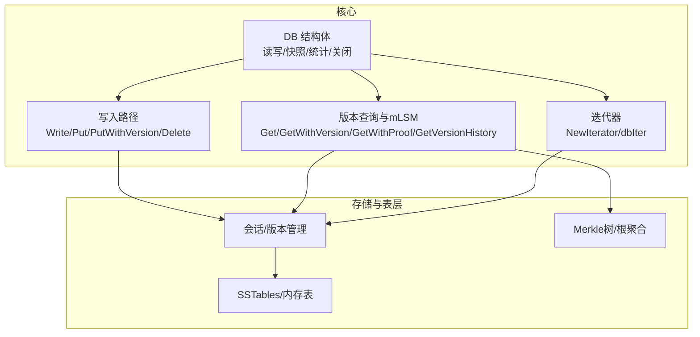
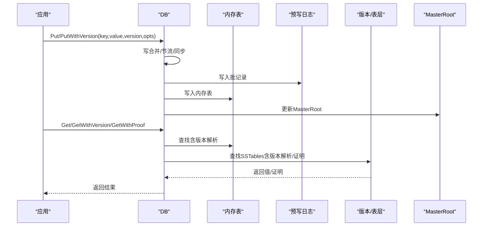
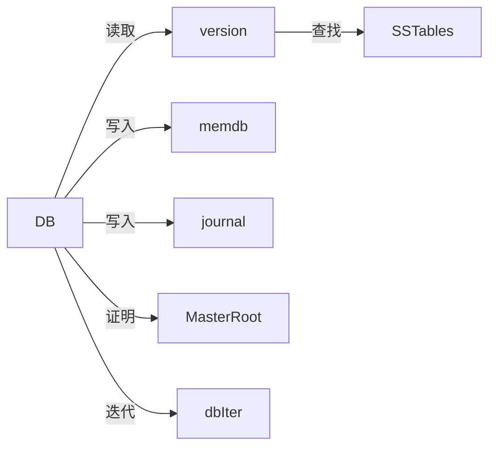

# 数据库接口

<cite>
**本文引用的文件**
- [leveldb/db.go](file://leveldb/db.go)
- [leveldb/db_write.go](file://leveldb/db_write.go)
- [leveldb/db_iter.go](file://leveldb/db_iter.go)
- [leveldb/version.go](file://leveldb/version.go)
- [leveldb/mlsm_final_comprehensive_test.go](file://leveldb/mlsm_final_comprehensive_test.go)
- [leveldb/db_util.go](file://leveldb/db_util.go)
</cite>

## 目录
1. [简介](#简介)
2. [项目结构](#项目结构)
3. [核心组件](#核心组件)
4. [架构总览](#架构总览)
5. [详细组件分析](#详细组件分析)
6. [依赖分析](#依赖分析)
7. [性能考量](#性能考量)
8. [故障排查指南](#故障排查指南)
9. [结论](#结论)
10. [附录](#附录)

## 简介
本文件为 avccDB 的数据库核心接口 API 参考文档，聚焦于 DB 结构体及其公开方法，覆盖标准读写接口（OpenFile、Put、Get、Delete、NewIterator、Write、Close）、mLSM 架构增强接口（PutWithVersion、GetWithVersion、GetWithProof、GetVersionHistory、GetMasterRoot、SizeOf、Stats），并解释方法间的调用关系、线程安全保证、错误处理策略与性能调优建议。文档同时提供典型“打开-操作-关闭”工作流示例与最佳实践。

## 项目结构
- 核心数据库实现位于 leveldb/db.go，包含 DB 结构体、读写流程、快照、迭代器、统计与关闭逻辑。
- 写入路径位于 leveldb/db_write.go，包含 Write、Put、PutWithVersion、Delete、CompactRange、SetReadOnly 等。
- 版本查询与 mLSM 增强能力位于 leveldb/version.go，包含 Get、GetWithProof、GetVersionHistory、MasterRoot 计算与聚合。
- 迭代器实现位于 leveldb/db_iter.go，封装合并迭代器与版本序列控制。
- 综合测试展示了 mLSM 的大规模使用场景，可用于理解增强接口的实际用法。
- 辅助工具位于 leveldb/db_util.go，包含 Reader 接口、清理文件、日志等。

图表来源
- [leveldb/db.go](file://leveldb/db.go#L1-L120)
- [leveldb/db_write.go](file://leveldb/db_write.go#L268-L530)
- [leveldb/version.go](file://leveldb/version.go#L142-L429)
- [leveldb/db_iter.go](file://leveldb/db_iter.go#L31-L91)

章节来源
- [leveldb/db.go](file://leveldb/db.go#L1-L120)
- [leveldb/db_write.go](file://leveldb/db_write.go#L268-L530)
- [leveldb/version.go](file://leveldb/version.go#L142-L429)
- [leveldb/db_iter.go](file://leveldb/db_iter.go#L31-L91)

## 核心组件
- DB 结构体：持有会话、内存表、预写日志、快照链表、写入合并通道、压缩命令通道、MasterRoot 聚合、关闭控制等。
- 写入子系统：支持批量写入、写合并、同步选项、大批次事务绕行、延迟与暂停控制。
- 读取子系统：支持最新版本查询、指定版本查询、带证明查询、版本历史查询、迭代器、属性查询。
- mLSM 增强：版本化键、证明生成、MasterRoot 聚合、跨层证明组合。
- 统计与大小估算：Stats、SizeOf、GetProperty。

章节来源
- [leveldb/db.go](file://leveldb/db.go#L33-L120)
- [leveldb/db_write.go](file://leveldb/db_write.go#L133-L267)
- [leveldb/version.go](file://leveldb/version.go#L142-L286)
- [leveldb/db.go](file://leveldb/db.go#L1358-L1441)

## 架构总览
DB 的读写路径围绕“内存表 + 预写日志 + SSTables”的 LSM-Tree 架构；mLSM 在此基础上引入版本化键与 Merkle 证明，MasterRoot 作为全层级聚合根，用于外部验证。

图表来源
- [leveldb/db_write.go](file://leveldb/db_write.go#L268-L438)
- [leveldb/db.go](file://leveldb/db.go#L835-L932)
- [leveldb/version.go](file://leveldb/version.go#L142-L286)
- [leveldb/db.go](file://leveldb/db.go#L1491-L1571)

## 详细组件分析

### DB.Open 与 OpenFile
- Open(stor, opts)：打开或创建数据库，恢复会话、恢复日志、清理冗余文件、初始化后台任务与 MasterRoot。
- OpenFile(path, opts)：基于文件系统存储打开数据库，内部委托 Open 并设置关闭资源。

函数签名与行为要点
- 参数
  - stor：存储抽象接口
  - path：文件系统路径
  - o：选项（读写缓冲、压缩、严格模式等）
- 返回
  - db：DB 实例（并发安全）
  - err：错误（含损坏检测）
- 错误
  - 当检测到损坏时返回损坏错误类型，可通过 IsCorrupted 判定
  - 仅在只读模式下忽略缺失/存在性选项
- 线程安全
  - 返回实例并发安全，内部使用互斥与通道协调

使用示例（参考测试）
- 打开文件存储并创建 DB，随后执行写入、查询、证明与统计

章节来源
- [leveldb/db.go](file://leveldb/db.go#L177-L243)
- [leveldb/db.go](file://leveldb/db.go#L245-L293)
- [leveldb/mlsm_final_comprehensive_test.go](file://leveldb/mlsm_final_comprehensive_test.go#L36-L56)

### DB.Put 与 DB.PutWithVersion
- Put(key, value, wo)：设置键值对，支持写合并与同步选项。
- PutWithVersion(key, value, version, wo)：设置指定版本的键值对，版本号越大越新；支持写合并与同步选项。

函数签名与行为要点
- 参数
  - key/value：字节切片
  - version：版本号（0 表示最新）
  - wo：写入选项（是否合并、是否同步）
- 返回
  - err：错误（含只读、关闭、合并冲突等）
- 写入流程
  - 尝试写合并；若批过大且允许大批次事务则转为事务写入
  - 写入预写日志；写入内存表；必要时旋转内存表并触发压缩
  - 更新序列号；更新 MasterRoot
- 线程安全
  - 通过写锁与合并通道保证顺序一致性

使用示例（参考测试）
- PutWithVersion 写入多个版本键，随后 GetWithVersion 与 Get 验证

章节来源
- [leveldb/db_write.go](file://leveldb/db_write.go#L268-L438)
- [leveldb/mlsm_final_comprehensive_test.go](file://leveldb/mlsm_final_comprehensive_test.go#L69-L89)

### DB.Get 与 DB.GetWithVersion
- Get(key, ro)：获取最新版本的值。
- GetWithVersion(key, version, ro)：获取指定版本的值；version=0 表示最新。

函数签名与行为要点
- 参数
  - key：字节切片
  - ro：读取选项
- 返回
  - value：拷贝后的值
  - err：未找到或错误
- 查询流程
  - 快照序列号参与构建内部键
  - 先查辅助内存表，再查有效/冻结内存表，最后查版本树（SSTables）
  - 若命中 L0 或未指定版本，按序列号选择最新值
- 线程安全
  - 通过快照与只读版本保证一致性

使用示例（参考测试）
- Get(GetWithVersion) 验证最新与指定版本

章节来源
- [leveldb/db.go](file://leveldb/db.go#L1092-L1125)
- [leveldb/db.go](file://leveldb/db.go#L1127-L1146)
- [leveldb/mlsm_final_comprehensive_test.go](file://leveldb/mlsm_final_comprehensive_test.go#L101-L140)

### DB.GetWithProof
- GetWithProof(key, version, ro)：获取值与 Merkle 证明，用于无需信任数据库的外部验证。
- 版本解析与证明生成
  - 若在内存表命中，构造包含 MasterRoot 的简单证明
  - 若在 SSTables 命中，结合表层证明与 MasterRoot 进行增强
  - 若未命中，返回未找到

函数签名与行为要点
- 返回
  - value：拷贝后的值
  - proof：Merkle 证明（包含根、路径、存在性等）
  - err：未找到或错误
- 线程安全
  - 通过快照与只读版本保证一致性

使用示例（参考测试）
- GetWithProof 验证证明结构与 MasterRoot 关系

章节来源
- [leveldb/db.go](file://leveldb/db.go#L835-L932)
- [leveldb/version.go](file://leveldb/version.go#L288-L429)
- [leveldb/mlsm_final_comprehensive_test.go](file://leveldb/mlsm_final_comprehensive_test.go#L237-L320)

### DB.GetVersionHistory
- GetVersionHistory(key, minVersion, maxVersion, ro)：查询指定范围内的所有版本条目（升序）。
- 收集来源
  - 内存表（含辅助内存表）
  - 版本树（SSTables）
- 返回
  - entries：VersionEntry 列表（Version/Value）
  - err：未找到或错误

使用示例（参考测试）
- 查询版本范围并遍历输出

章节来源
- [leveldb/db.go](file://leveldb/db.go#L934-L993)
- [leveldb/version.go](file://leveldb/version.go#L431-L532)
- [leveldb/mlsm_final_comprehensive_test.go](file://leveldb/mlsm_final_comprehensive_test.go#L176-L211)

### DB.Delete
- Delete(key, wo)：删除键（写入墓碑标记），在 mLSM 中保留历史版本可查询。
- 返回
  - err：错误（含只读、关闭）

使用示例（参考测试）
- Delete 验证删除后历史仍可访问

章节来源
- [leveldb/db_write.go](file://leveldb/db_write.go#L440-L447)
- [leveldb/mlsm_final_comprehensive_test.go](file://leveldb/mlsm_final_comprehensive_test.go#L360-L416)

### DB.NewIterator
- NewIterator(slice, ro)：返回最新快照的迭代器。
- 行为
  - 返回的迭代器不安全并发使用，但可多迭代器并发
  - 迭代器内部解析版本键，仅返回小于等于快照序列号的最新值
  - 使用完毕必须释放
- 返回
  - 迭代器对象

使用示例（参考测试）
- 创建迭代器并遍历键值

章节来源
- [leveldb/db.go](file://leveldb/db.go#L1200-L1230)
- [leveldb/db_iter.go](file://leveldb/db_iter.go#L31-L91)
- [leveldb/mlsm_final_comprehensive_test.go](file://leveldb/mlsm_final_comprehensive_test.go#L326-L359)

### DB.Write
- Write(batch, wo)：应用批记录，按顺序写入；支持写合并与大批次事务绕行。
- 返回
  - err：错误（含只读、关闭、合并冲突）

使用示例（参考测试）
- 批量写入与事务提交

章节来源
- [leveldb/db_write.go](file://leveldb/db_write.go#L268-L331)

### DB.CompactRange 与 DB.SetReadOnly
- CompactRange(r)：对指定键范围进行压缩，必要时触发内存表刷新与表层压缩。
- SetReadOnly()：设为只读，阻塞写入并设置压缩错误通道。

章节来源
- [leveldb/db_write.go](file://leveldb/db_write.go#L456-L530)

### DB.GetMasterRoot
- GetMasterRoot()：返回当前 MasterRoot（全层级聚合根）。
- 线程安全
  - 读取使用 RWMutex 保护

章节来源
- [leveldb/db.go](file://leveldb/db.go#L1479-L1489)
- [leveldb/db.go](file://leveldb/db.go#L1491-L1571)

### DB.Stats 与 DB.SizeOf
- Stats(s)：填充 DBStats 结构，包含 IO、缓存、活跃快照/迭代器、各层级大小与压缩统计。
- SizeOf(ranges)：估算给定键范围的存储空间使用（可能不包含最近写入数据）。

章节来源
- [leveldb/db.go](file://leveldb/db.go#L1358-L1441)
- [leveldb/db.go](file://leveldb/db.go#L1443-L1477)

### DB.GetProperty
- GetProperty(name)：返回特定属性字符串（如各层级文件数、统计、IO 统计、写延迟、SSTables 列表、缓存统计、存活快照/迭代器等）。

章节来源
- [leveldb/db.go](file://leveldb/db.go#L1245-L1356)

### DB.Close
- Close()：关闭数据库，释放快照、中止压缩、丢弃事务、等待后台任务、关闭日志与会话。
- 线程安全
  - 可多次调用；调用后其他方法不再安全

章节来源
- [leveldb/db.go](file://leveldb/db.go#L1573-L1643)

## 依赖分析
- DB 与版本/表层交互
  - 读取：DB.get -> version.get -> table 层查找
  - 证明：DB.getWithProof -> version.getWithProof -> 表层证明 + MasterRoot 组合
  - 历史：DB.getVersionHistory -> version.getVersionHistory
- 写入：DB.writeLocked -> journal -> memdb -> flush/rotate -> compaction -> updateMasterRoot
- 迭代器：DB.newIterator -> dbIter -> 合并迭代器 -> 版本/内存表/SSTables

图表来源
- [leveldb/db.go](file://leveldb/db.go#L798-L833)
- [leveldb/version.go](file://leveldb/version.go#L142-L286)
- [leveldb/db_write.go](file://leveldb/db_write.go#L18-L33)
- [leveldb/db_iter.go](file://leveldb/db_iter.go#L31-L91)

## 性能考量
- 写入节流与暂停
  - flush 会根据 L0 文件数与写缓冲阈值触发延迟与暂停，减少写放大
  - 可通过选项调整慢速阈值与暂停阈值
- 写合并
  - 小批量写入可合并，降低日志写入次数；大批次可绕过合并直接事务写入
- 迭代采样
  - 迭代器按采样率触发表层压缩调度，平衡查询与压缩
- 统计与监控
  - Stats 提供各层级大小、读写、持续时间、写延迟与暂停状态
  - SizeOf 估算范围大小，辅助容量规划
- MasterRoot 更新
  - flush/compaction 后更新 MasterRoot，避免频繁重算

章节来源
- [leveldb/db_write.go](file://leveldb/db_write.go#L66-L131)
- [leveldb/db_iter.go](file://leveldb/db_iter.go#L124-L135)
- [leveldb/db.go](file://leveldb/db.go#L1388-L1441)
- [leveldb/db.go](file://leveldb/db.go#L1491-L1571)

## 故障排查指南
- 常见错误类型
  - ErrNotFound：键不存在
  - ErrClosed：DB 已关闭
  - ErrReadOnly：只读模式下禁止写入
  - 损坏检测：Open/Recover 返回损坏错误，可用 IsCorrupted 判定
- 排查步骤
  - 检查只读/关闭状态
  - 检查写入选项（同步、合并）
  - 使用 GetProperty 获取统计与层级信息
  - 使用 Stats 获取详细统计
  - 使用 SizeOf 评估范围大小
- 建议
  - 写入前确保未处于只读模式
  - 大批量写入优先考虑事务写入
  - 配置合适的写缓冲与压缩策略
  - 定期检查 MasterRoot 变化以确认压缩生效

章节来源
- [leveldb/db.go](file://leveldb/db.go#L1245-L1356)
- [leveldb/db.go](file://leveldb/db.go#L1388-L1441)
- [leveldb/db_write.go](file://leveldb/db_write.go#L456-L530)

## 结论
avccDB 的 DB 接口在标准 LSM-Tree 基础上，通过 mLSM 的版本化键与 Merkle 证明扩展了区块链等场景所需的可追溯性与可验证性。其读写路径清晰、并发安全、统计完备，配合 MasterRoot 聚合与证明生成，既满足高性能读写，也满足审计与验证需求。合理配置写入选项与压缩策略，可获得更佳的吞吐与空间效率。

## 附录

### API 参考摘要（不含代码片段）
- Open(stor, opts)：打开或创建数据库
- OpenFile(path, opts)：基于文件系统打开数据库
- Recover(stor, opts) / RecoverFile(path, opts)：修复并打开损坏数据库
- Put(key, value, wo)：写入键值
- PutWithVersion(key, value, version, wo)：写入指定版本键值
- Get(key, ro)：获取最新版本值
- GetWithVersion(key, version, ro)：获取指定版本值
- GetWithProof(key, version, ro)：获取值与证明
- GetVersionHistory(key, minVersion, maxVersion, ro)：查询版本历史
- Delete(key, wo)：删除键（写入墓碑）
- NewIterator(slice, ro)：创建迭代器
- Write(batch, wo)：应用批记录
- CompactRange(r)：压缩指定范围
- SetReadOnly()：设为只读
- GetMasterRoot()：获取 MasterRoot
- Stats(s)：填充数据库统计
- SizeOf(ranges)：估算范围大小
- GetProperty(name)：获取属性
- Close()：关闭数据库

章节来源
- [leveldb/db.go](file://leveldb/db.go#L177-L243)
- [leveldb/db.go](file://leveldb/db.go#L245-L293)
- [leveldb/db_write.go](file://leveldb/db_write.go#L268-L447)
- [leveldb/db.go](file://leveldb/db.go#L1092-L1146)
- [leveldb/db.go](file://leveldb/db.go#L835-L932)
- [leveldb/db.go](file://leveldb/db.go#L934-L993)
- [leveldb/db.go](file://leveldb/db.go#L1200-L1230)
- [leveldb/db_write.go](file://leveldb/db_write.go#L456-L530)
- [leveldb/db.go](file://leveldb/db.go#L1479-L1489)
- [leveldb/db.go](file://leveldb/db.go#L1358-L1441)
- [leveldb/db.go](file://leveldb/db.go#L1443-L1477)
- [leveldb/db.go](file://leveldb/db.go#L1245-L1356)
- [leveldb/db.go](file://leveldb/db.go#L1573-L1643)