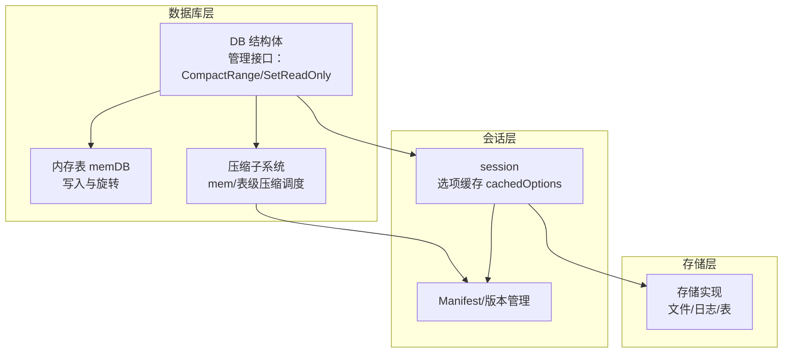
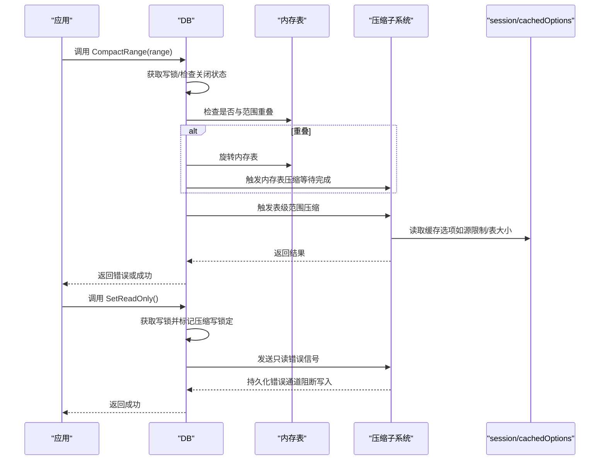
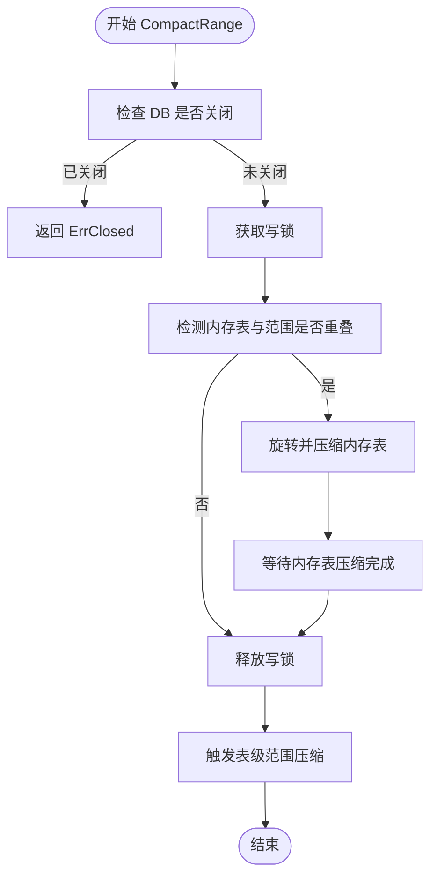
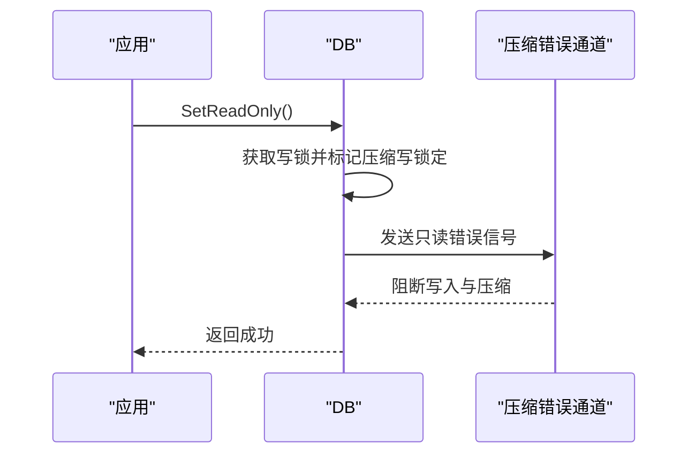
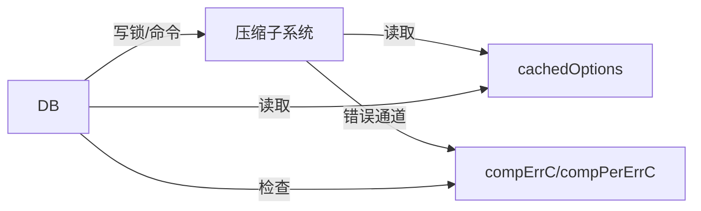

# 数据库管理

<cite>
**本文引用的文件**
- [leveldb/db_write.go](file://leveldb/db_write.go)
- [leveldb/db_compaction.go](file://leveldb/db_compaction.go)
- [leveldb/session_compaction.go](file://leveldb/session_compaction.go)
- [leveldb/options.go](file://leveldb/options.go)
- [leveldb/opt/options.go](file://leveldb/opt/options.go)
- [leveldb/errors.go](file://leveldb/errors.go)
- [leveldb/db.go](file://leveldb/db.go)
- [leveldb/db_state.go](file://leveldb/db_state.go)
- [leveldb/session.go](file://leveldb/session.go)
</cite>

## 目录
1. [简介](#简介)
2. [项目结构](#项目结构)
3. [核心组件](#核心组件)
4. [架构总览](#架构总览)
5. [详细组件分析](#详细组件分析)
6. [依赖分析](#依赖分析)
7. [性能考量](#性能考量)
8. [故障排查指南](#故障排查指南)
9. [结论](#结论)

## 简介
本文件面向 avccDB 的数据库管理能力，聚焦于三类核心管理方法：CompactRange（范围压缩）、SetReadOnly（只读模式切换）与 SetOpt（配置更新）。我们将系统性地说明每个方法的参数、行为、返回值与错误类型；深入解析 CompactRange 的触发机制、执行策略与性能影响；阐述只读模式切换的使用场景与限制；并给出标准的数据库维护与调优实践，包括错误处理最佳实践与常见问题的解决方案。

## 项目结构
- 管理接口集中在 DB 结构体的方法中，其中 CompactRange 与 SetReadOnly 在写路径上通过统一的写锁通道进行协调。
- 压缩调度与执行由 compaction 子系统负责，包括内存表压缩与表级压缩，并通过命令通道驱动。
- 选项系统通过 session.setOptions 将用户配置缓存到 cachedOptions 中，供运行时高效访问。

图表来源
- [leveldb/db_write.go](file://leveldb/db_write.go#L456-L529)
- [leveldb/db_compaction.go](file://leveldb/db_compaction.go#L269-L355)
- [leveldb/session.go](file://leveldb/session.go#L36-L97)
- [leveldb/options.go](file://leveldb/options.go#L25-L44)

章节来源
- [leveldb/db_write.go](file://leveldb/db_write.go#L456-L529)
- [leveldb/db_compaction.go](file://leveldb/db_compaction.go#L269-L355)
- [leveldb/session.go](file://leveldb/session.go#L36-L97)
- [leveldb/options.go](file://leveldb/options.go#L25-L44)

## 核心组件
- CompactRange：按指定键范围触发压缩，必要时先旋转并压缩内存表，再对表级进行范围压缩。
- SetReadOnly：将数据库切换为只读模式，阻断写入与后台压缩，适用于只读副本或维护窗口。
- SetOpt：通过 session.setOptions 更新运行期配置，涉及比较器、过滤器、缓存等，需谨慎评估生效时机与影响。

章节来源
- [leveldb/db_write.go](file://leveldb/db_write.go#L456-L529)
- [leveldb/options.go](file://leveldb/options.go#L25-L44)
- [leveldb/session.go](file://leveldb/session.go#L36-L97)

## 架构总览
下图展示了管理方法与压缩子系统的交互流程，以及选项缓存如何影响运行时行为。

图表来源
- [leveldb/db_write.go](file://leveldb/db_write.go#L456-L529)
- [leveldb/db_compaction.go](file://leveldb/db_compaction.go#L269-L355)
- [leveldb/session_compaction.go](file://leveldb/session_compaction.go#L97-L133)
- [leveldb/options.go](file://leveldb/options.go#L25-L44)

## 详细组件分析

### CompactRange（范围压缩）
- 函数签名路径
  - [leveldb/db_write.go#L456-L501](file://leveldb/db_write.go#L456-L501)
- 参数与含义
  - r: util.Range，表示要压缩的键范围。nil 表示全库压缩。
- 执行策略
  - 写锁保护：获取写锁后进入，避免与写入冲突。
  - 内存表重叠检测：若有效内存表与目标范围有重叠，则先旋转并压缩内存表，确保后续表级压缩能正确覆盖。
  - 表级压缩：调用表级范围压缩，支持跨层级的多轮压缩直至无重叠。
- 返回值与错误
  - 成功：返回 nil。
  - 可能错误：ErrClosed（DB 已关闭）、持久化压缩错误（通过压缩错误通道传播）。
- 性能影响
  - 内存表旋转与压缩会占用 CPU 与 IO，建议在低峰时段执行。
  - 大范围压缩可能导致长时间阻塞写入，应结合业务窗口进行。
- 使用模式
  - 清理过期数据或热点键范围：传入起止键范围。
  - 全库压缩：传入空范围。
  - 与只读模式配合：在维护窗口设置只读后再执行压缩，避免写入干扰。

图表来源
- [leveldb/db_write.go](file://leveldb/db_write.go#L456-L501)
- [leveldb/db_compaction.go](file://leveldb/db_compaction.go#L631-L667)

章节来源
- [leveldb/db_write.go](file://leveldb/db_write.go#L456-L501)
- [leveldb/db_compaction.go](file://leveldb/db_compaction.go#L631-L667)
- [leveldb/session_compaction.go](file://leveldb/session_compaction.go#L97-L133)

### SetReadOnly（只读模式切换）
- 函数签名路径
  - [leveldb/db_write.go#L503-L528](file://leveldb/db_write.go#L503-L528)
- 行为说明
  - 获取写锁并标记压缩写锁定，向压缩错误通道发送只读错误信号，使后台压缩与写入被阻断。
  - 一旦设置为只读，需重启数据库才能恢复写入。
- 返回值与错误
  - 成功：返回 nil。
  - 可能错误：ErrClosed（DB 已关闭）、持久化压缩错误（通过压缩错误通道传播）。
- 使用场景与限制
  - 场景：只读副本、备份窗口、维护期间防止写入。
  - 限制：只读模式不可逆，需重新打开数据库以恢复写入。

图表来源
- [leveldb/db_write.go](file://leveldb/db_write.go#L503-L528)
- [leveldb/db_compaction.go](file://leveldb/db_compaction.go#L87-L139)

章节来源
- [leveldb/db_write.go](file://leveldb/db_write.go#L503-L528)
- [leveldb/db_compaction.go](file://leveldb/db_compaction.go#L87-L139)

### SetOpt（配置更新）
- 函数签名路径
  - [leveldb/options.go#L25-L44](file://leveldb/options.go#L25-L44)
- 行为说明
  - 将用户提供的 Options 进行复制与规范化，设置比较器、过滤器等，并将配置缓存到 cachedOptions 中，供运行时快速读取。
- 影响范围
  - 会影响压缩策略（如表大小、源限制、总大小等）、缓存容量、严格级别等。
- 注意事项
  - 该方法用于初始化阶段或会话创建时，运行期动态修改需谨慎评估对现有写入与压缩的影响。
  - 与只读模式不同，SetOpt 不会阻断写入，但会影响后续压缩与读写行为。

章节来源
- [leveldb/options.go](file://leveldb/options.go#L25-L44)
- [leveldb/opt/options.go](file://leveldb/opt/options.go#L1-L42)

## 依赖分析
- DB 与压缩子系统
  - DB 通过命令通道（mcompCmdC/tcompCmdC）与压缩子系统交互，控制内存表与表级压缩的触发与等待。
  - 压缩执行过程中会读取 cachedOptions 中的压缩参数，如源限制、表大小、总大小等。
- DB 与会话/选项
  - session.setOptions 将 Options 缓存到 cachedOptions，DB 在运行时通过 session.o 访问这些参数。
- 错误传播
  - 压缩错误通过 compErrC/compPerErrC 通道传播，DB 在写入与压缩等待时会检查这些通道以决定返回错误。

图表来源
- [leveldb/db_write.go](file://leveldb/db_write.go#L456-L529)
- [leveldb/db_compaction.go](file://leveldb/db_compaction.go#L269-L355)
- [leveldb/options.go](file://leveldb/options.go#L25-L44)

章节来源
- [leveldb/db_write.go](file://leveldb/db_write.go#L456-L529)
- [leveldb/db_compaction.go](file://leveldb/db_compaction.go#L269-L355)
- [leveldb/options.go](file://leveldb/options.go#L25-L44)

## 性能考量
- 压缩策略参数
  - 源限制（SourceLimit）：限制单次压缩扫描的源文件总量，避免一次性压缩过多导致 IO 抖动。
  - 表大小（TableSize）：随层级递增，影响压缩粒度与输出文件大小。
  - 总大小（TotalSize）：控制各层级总容量阈值，影响自动压缩触发频率。
- 写入节流与暂停
  - 当 L0 文件数超过慢速阈值时会进行延迟；超过暂停阈值时会触发表级压缩等待，期间写入暂停。
- 只读模式
  - 设置只读后，写入与压缩均被阻断，适合维护窗口或只读副本场景，但不会释放资源或回收空间。

章节来源
- [leveldb/db_compaction.go](file://leveldb/db_compaction.go#L669-L757)
- [leveldb/db_write.go](file://leveldb/db_write.go#L66-L131)
- [leveldb/opt/options.go](file://leveldb/opt/options.go#L469-L540)

## 故障排查指南
- 常见错误类型
  - ErrClosed：DB 已关闭，无法继续操作。
  - ErrReadOnly：数据库处于只读模式，写入或压缩被阻断。
  - 压缩持久化错误：压缩过程中出现持久化错误，DB 会通过压缩错误通道上报。
- 压缩操作阻塞
  - 现象：CompactRange 或写入长时间无响应。
  - 排查：
    - 检查 L0 文件数量是否超过暂停阈值，确认是否存在大量写入导致压缩等待。
    - 若设置了只读模式，请先恢复写入或重启数据库。
    - 查看压缩统计与 IO 统计，定位瓶颈层级。
- 配置更新失败
  - 现象：SetOpt 后行为未改变。
  - 排查：
    - 确认配置项是否在初始化阶段生效；运行期动态修改需谨慎评估。
    - 检查 cachedOptions 是否正确缓存了新配置。
- 最佳实践
  - 在低峰时段执行大范围压缩，避免影响在线写入。
  - 使用只读模式进行维护窗口，完成后重启数据库恢复写入。
  - 定期监控压缩统计与写延迟，及时调整压缩参数。

章节来源
- [leveldb/errors.go](file://leveldb/errors.go#L13-L21)
- [leveldb/db_compaction.go](file://leveldb/db_compaction.go#L87-L139)
- [leveldb/db_write.go](file://leveldb/db_write.go#L66-L131)
- [leveldb/db.go](file://leveldb/db.go#L1245-L1356)

## 结论
- CompactRange 提供了可控的范围压缩能力，结合内存表旋转与表级压缩，能够有效清理冗余数据与碎片。
- SetReadOnly 是一种强约束的维护手段，适合只读副本与维护窗口，但不具备可逆性。
- SetOpt 通过 cachedOptions 将配置注入运行时，影响压缩与读写行为，需在初始化阶段合理设置。
- 实践中应结合业务窗口与性能指标，选择合适的压缩策略与只读模式，确保系统稳定与可用性。