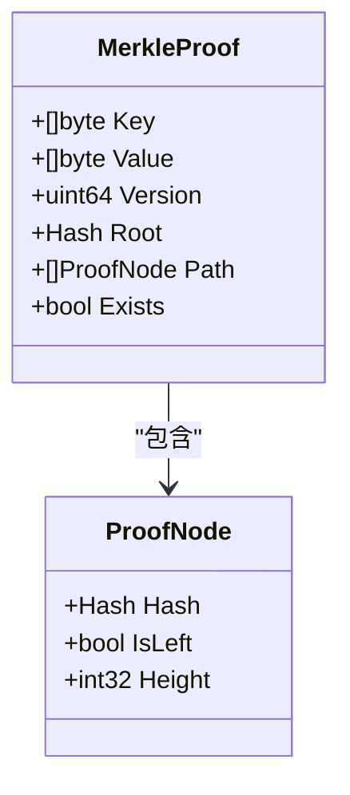
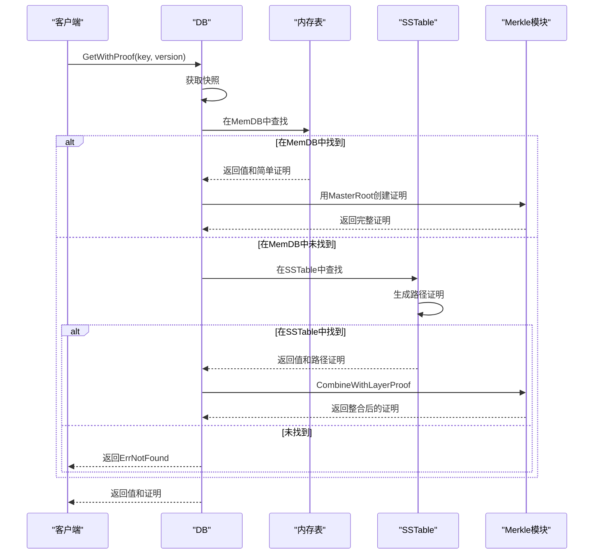
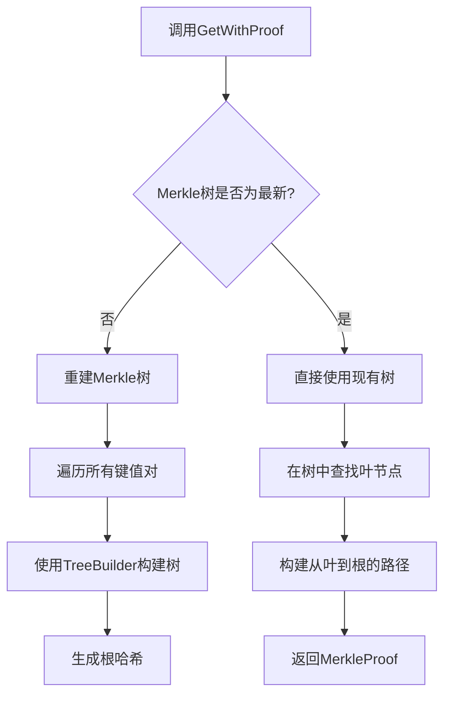

# GetWithProof操作

<cite>
**本文档引用的文件**   
- [db.go](file://leveldb/db.go)
- [memdb_merkle.go](file://leveldb/memdb/memdb_merkle.go)
- [reader.go](file://leveldb/table/reader.go)
- [tree.go](file://leveldb/merkle/tree.go)
- [node.go](file://leveldb/merkle/node.go)
- [hash.go](file://leveldb/merkle/hash.go)
- [version.go](file://leveldb/version.go)
</cite>

## 目录
1. [简介](#简介)
2. [函数签名与返回值结构](#函数签名与返回值结构)
3. [Merkle证明的组成](#merkle证明的组成)
4. [查询流程与数据协调](#查询流程与数据协调)
5. [SSTable层的证明生成](#sstable层的证明生成)
6. [内存表的证明生成](#内存表的证明生成)
7. [代码示例](#代码示例)
8. [版本查询行为](#版本查询行为)
9. [性能影响与缓存优化](#性能影响与缓存优化)
10. [异常处理指南](#异常处理指南)

## 简介
`GetWithProof`方法是avccDB中用于实现防篡改验证的核心API。该方法不仅返回指定键的值，还同时生成一个Merkle证明，允许客户端在不信任数据库的情况下验证数据的真实性。此功能通过在数据库的各个层级（内存表和SSTable文件）构建Merkle树来实现，最终形成一个聚合的MasterRoot，作为整个数据库状态的密码学摘要。

**Section sources**
- [db.go](file://leveldb/db.go#L1127-L1146)

## 函数签名与返回值结构
`GetWithProof`方法的函数签名如下：
```go
func (db *DB) GetWithProof(key []byte, version uint64, ro *opt.ReadOptions) (value []byte, proof *merkle.MerkleProof, err error)
```
该方法接受一个键（`key`）、一个版本号（`version`）和读取选项（`ro`），并返回三个值：
- `value []byte`: 与键关联的值，如果键不存在则为`nil`。
- `proof *merkle.MerkleProof`: 一个包含验证所需所有信息的Merkle证明。
- `err error`: 操作过程中可能发生的错误。

**Section sources**
- [db.go](file://leveldb/db.go#L1127-L1146)

## Merkle证明的组成
`merkle.MerkleProof`结构体是验证过程的核心，其字段定义了证明的完整信息：
- **Key**: 被查询的键。
- **Value**: 与键关联的值。
- **Version**: 该键值对的版本号。
- **Root**: 整个数据库的聚合根哈希（MasterRoot）。
- **Path**: 从叶节点到根节点的路径，包含一系列`ProofNode`。每个`ProofNode`包含一个哈希值、一个指示其在路径中位置的布尔值（`IsLeft`）和高度。
- **Exists**: 一个布尔值，指示该键是否存在于数据库中。

这个证明允许客户端使用已知的MasterRoot，通过重新计算路径上的哈希，来验证所返回的值是否确实属于数据库的当前状态。



**Diagram sources**
- [node.go](file://leveldb/merkle/node.go#L98-L113)

## 查询流程与数据协调
`GetWithProof`方法的查询流程是一个协调内存表（MemDB）和SSTable文件的复杂过程：

1.  **入口**: `DB.GetWithProof`方法被调用，它首先获取一个快照以保证读取的一致性。
2.  **内存表查询**: 方法调用`db.getWithProof`，首先在内存表（包括有效和冻结的MemDB）中查找键。
3.  **SSTable查询**: 如果在内存表中未找到，则查询SSTable文件。
4.  **证明整合**: 根据查询结果，生成或整合Merkle证明。

当在内存表中找到数据时，会生成一个简单的证明，其根哈希为MasterRoot，但路径为空。当在SSTable中找到数据时，会生成一个具体的路径证明，然后通过`CombineWithLayerProof`函数将SSTable的证明与MasterRoot整合，形成最终的、可用于验证的完整证明。



**Diagram sources**
- [db.go](file://leveldb/db.go#L837-L931)
- [node.go](file://leveldb/merkle/node.go#L346-L369)

## SSTable层的证明生成
SSTable层的证明生成由`Reader.GetWithProof`方法负责。当SSTable文件被创建时，如果启用了Merkle功能，会为文件中的每个数据块生成哈希，并构建一个Merkle树。当调用`GetWithProof`时，系统会：

1.  在SSTable的索引中定位到包含目标键的数据块。
2.  从该数据块中检索出键值对。
3.  从Merkle树中生成从该叶节点到根节点的路径证明。

这个过程确保了即使SSTable文件被单独验证，其内部数据的完整性也能得到保证。生成的证明包含了从叶节点到SSTable自身Merkle根的完整路径。

**Section sources**
- [reader.go](file://leveldb/table/reader.go#L788-L800)
- [reader_merkle_test.go](file://leveldb/table/reader_merkle_test.go#L87-L111)

## 内存表的证明生成
内存表的证明生成由`MerkleDB.GetWithProof`方法处理。`MerkleDB`是`memdb.DB`的一个包装器，它维护了一个基于当前内存状态的Merkle树。

1.  当调用`GetWithProof`时，`MerkleDB`会检查其内部的Merkle树是否为最新（`dirty`标志）。
2.  如果树是脏的（即自上次构建后数据已更改），它会遍历内存中的所有键值对，使用`BuildFromSorted`函数重建Merkle树。
3.  一旦树是最新的，`GenerateProof`函数会从树中检索出目标键的叶节点，并递归地构建从该叶节点到根节点的路径。

由于内存表是易失性的，其Merkle根会随着数据的写入而频繁变化，但`GetWithProof`方法确保了在返回证明的那一刻，该证明是基于当时内存的精确状态。



**Diagram sources**
- [memdb_merkle.go](file://leveldb/memdb/memdb_merkle.go#L126-L147)
- [tree_builder.go](file://leveldb/merkle/tree_builder.go#L82-L131)

## 代码示例
以下代码示例展示了如何使用`GetWithProof`方法以及如何验证返回的证明：

```go
// 发起带证明的查询
value, proof, err := db.GetWithProof([]byte("mykey"), 0, nil)
if err != nil {
    log.Fatal(err)
}

// 获取当前的MasterRoot用于验证
masterRoot, err := db.GetMasterRoot()
if err != nil {
    log.Fatal(err)
}

// 验证证明的有效性
if proof != nil && proof.Root.Equal(masterRoot) && proof.Verify() {
    fmt.Printf("验证成功！值: %s\n", string(value))
} else {
    fmt.Println("验证失败：数据可能被篡改")
}
```

**Section sources**
- [mlsm_final_comprehensive_test.go](file://leveldb/mlsm_final_comprehensive_test.go#L248-L288)

## 版本查询行为
`version`参数控制着查询的语义：
- **`version`为0**: 查询该键的最新版本。系统会搜索所有版本，并返回序列号（seq）最大的那个。
- **`version`非0**: 查询该键的特定版本。系统会精确匹配指定的版本号，如果该版本不存在，则返回`ErrNotFound`。

这种设计使得`GetWithProof`不仅适用于常规的键值查询，也适用于需要验证历史数据的场景。

**Section sources**
- [db.go](file://leveldb/db.go#L841-L843)
- [version.go](file://leveldb/version.go#L295-L301)

## 性能影响与缓存优化
生成Merkle证明会带来额外的性能开销，主要体现在：
1.  **计算开销**: 构建Merkle树和生成路径需要进行大量的哈希计算。
2.  **I/O开销**: 从磁盘读取SSTable文件中的Merkle树元数据。

为了优化性能，系统采用了以下策略：
- **缓存**: SSTable的Merkle树在首次加载后会被缓存，避免重复解析。
- **惰性构建**: 内存表的Merkle树仅在需要时（`dirty`为`true`）才进行重建。
- **批量操作**: 在写入和压缩过程中，Merkle树的更新是批量进行的，减少了频繁重建的开销。

**Section sources**
- [reader.go](file://leveldb/table/reader.go#L716-L720)
- [memdb_merkle.go](file://leveldb/memdb/memdb_merkle.go#L113-L119)

## 异常处理指南
在使用`GetWithProof`时，可能会遇到以下异常情况：
- **证明生成失败**: 如果Merkle树在构建过程中遇到错误（如空树），`GetWithProof`会返回`nil`证明和相应的错误。客户端应检查`err`参数。
- **Merkle树未初始化**: 如果数据库未启用Merkle功能，`GetWithProof`仍会返回值，但`proof`参数为`nil`。客户端在进行验证前必须检查`proof`是否为`nil`。
- **键不存在**: 如果键不存在，`value`为`nil`，`Exists`字段为`false`，`err`为`ErrNotFound`。

```go
value, proof, err := db.GetWithProof(key, version, ro)
if err != nil {
    if err == leveldb.ErrNotFound {
        fmt.Println("键不存在")
    } else {
        fmt.Printf("查询失败: %v\n", err)
    }
    return
}

if proof == nil {
    fmt.Println("警告：无法生成证明，Merkle功能可能未启用")
    // 只能信任数据库
    return
}

// 此时可以安全地验证proof
```

**Section sources**
- [errors.go](file://leveldb/merkle/errors.go#L10-L31)
- [db.go](file://leveldb/db.go#L904-L906)