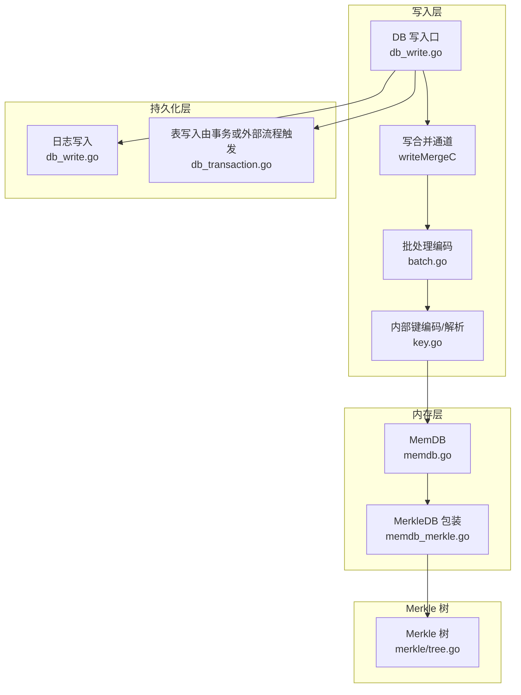
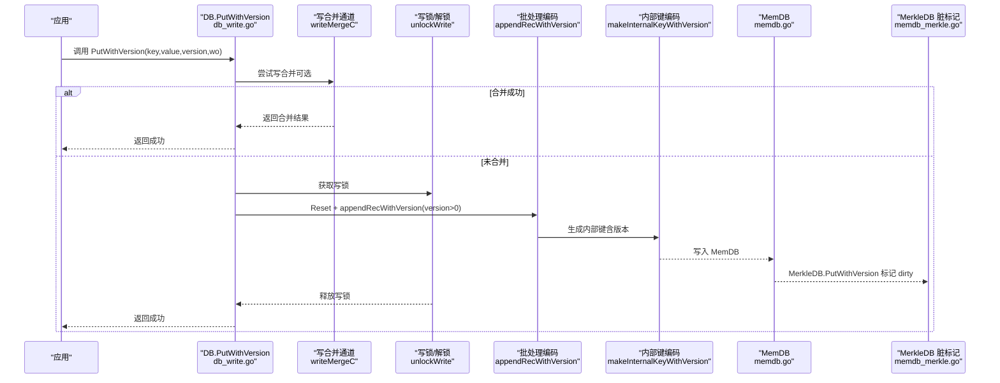
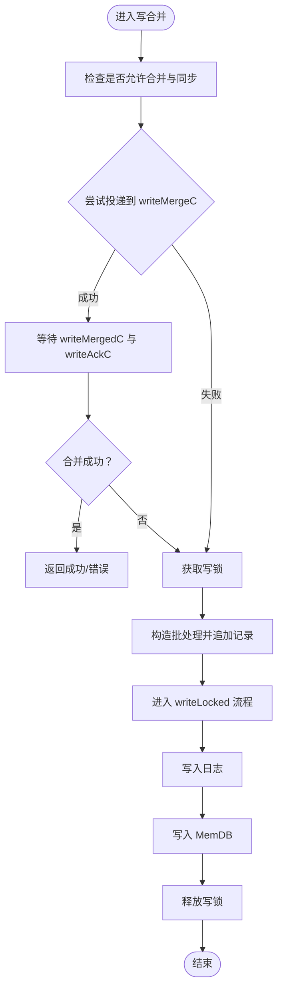
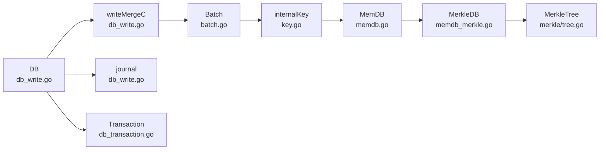

# PutWithVersion操作

<cite>
**本文引用的文件**
- [leveldb/db_write.go](file://leveldb/db_write.go)
- [leveldb/db.go](file://leveldb/db.go)
- [leveldb/batch.go](file://leveldb/batch.go)
- [leveldb/key.go](file://leveldb/key.go)
- [leveldb/memdb/memdb_merkle.go](file://leveldb/memdb/memdb_merkle.go)
- [leveldb/merkle/tree.go](file://leveldb/merkle/tree.go)
- [leveldb/mlsm_version_history_test.go](file://leveldb/mlsm_version_history_test.go)
- [leveldb/db_transaction.go](file://leveldb/db_transaction.go)
</cite>

## 目录
1. [简介](#简介)
2. [项目结构](#项目结构)
3. [核心组件](#核心组件)
4. [架构总览](#架构总览)
5. [详细组件分析](#详细组件分析)
6. [依赖关系分析](#依赖关系分析)
7. [性能考量](#性能考量)
8. [故障排查指南](#故障排查指南)
9. [结论](#结论)
10. [附录](#附录)

## 简介
本篇文档围绕 avccDB 的 PutWithVersion 方法进行深入的 API 参考说明，重点阐述其如何实现多版本并发控制（MVCC）以及与 Merkle 树的集成机制。文档将逐项解释函数签名、参数语义、内部写合并流程、版本信息编码到内部键的方式、MemDB 写入时对 Merkle 树脏标记的触发逻辑，并给出在事务与批量操作中的最佳实践建议。同时，对比 PutWithVersion 与标准 Put 的性能差异与适用场景，涵盖锁竞争、写放大等潜在问题，并总结版本冲突与写入合并失败等异常情况的处理策略。

## 项目结构
本节聚焦与 PutWithVersion 直接相关的模块：
- 写路径：DB 写入口、写合并通道、批处理编码与写入
- 键编码：内部键格式（含版本字段）与解析
- 内存数据库：MemDB 与带版本支持的 MerkleDB
- Merkle 树：树构建、根哈希缓存与证明生成
- 版本历史查询：GetVersionHistory 的使用示例与行为验证

图表来源
- [leveldb/db_write.go](file://leveldb/db_write.go#L133-L266)
- [leveldb/batch.go](file://leveldb/batch.go#L94-L136)
- [leveldb/key.go](file://leveldb/key.go#L75-L104)
- [leveldb/memdb/memdb_merkle.go](file://leveldb/memdb/memdb_merkle.go#L14-L56)
- [leveldb/merkle/tree.go](file://leveldb/merkle/tree.go#L1-L74)
- [leveldb/db_transaction.go](file://leveldb/db_transaction.go#L92-L116)

章节来源
- [leveldb/db_write.go](file://leveldb/db_write.go#L133-L266)
- [leveldb/batch.go](file://leveldb/batch.go#L94-L136)
- [leveldb/key.go](file://leveldb/key.go#L75-L104)
- [leveldb/memdb/memdb_merkle.go](file://leveldb/memdb/memdb_merkle.go#L14-L56)
- [leveldb/merkle/tree.go](file://leveldb/merkle/tree.go#L1-L74)
- [leveldb/db_transaction.go](file://leveldb/db_transaction.go#L92-L116)

## 核心组件
- DB 写入口与写合并
  - 写合并通道 writeMergeC 用于接收待合并的写请求；若允许合并且有空位，则尝试聚合多个写请求，否则获取写锁进入串行执行。
  - 合并成功后通过 writeMergedC 通知发送方，直接返回写入结果；否则将写锁移交至当前写入者。
- 批处理编码与内部键
  - 批处理支持带版本的记录编码 appendRecWithVersion，内部长度计算考虑版本字段带来的额外开销。
  - putMem 将批内每条记录转换为内部键（含版本或非版本），再写入 MemDB。
- 内部键编码与解析
  - makeInternalKeyWithVersion 将用户键、版本号、序列号与类型打包为内部键；parseInternalKeyWithVersion 解析内部键并提取版本号。
- MemDB 与 Merkle 集成
  - MemDB 提供基础 KV 存储；MerkleDB 在 PutWithVersion 成功后标记 dirty，延迟重建 Merkle 树并缓存根哈希。
- 版本历史查询
  - 测试用例展示了如何使用 GetVersionHistory 查询指定键的所有版本或范围版本，验证版本顺序与值一致性。

章节来源
- [leveldb/db_write.go](file://leveldb/db_write.go#L133-L266)
- [leveldb/batch.go](file://leveldb/batch.go#L94-L136)
- [leveldb/key.go](file://leveldb/key.go#L75-L104)
- [leveldb/memdb/memdb_merkle.go](file://leveldb/memdb/memdb_merkle.go#L14-L56)
- [leveldb/mlsm_version_history_test.go](file://leveldb/mlsm_version_history_test.go#L1-L139)

## 架构总览
下图展示 PutWithVersion 的端到端调用链路，从应用层调用到最终写入 MemDB 并触发 Merkle 树脏标记。

图表来源
- [leveldb/db_write.go](file://leveldb/db_write.go#L387-L438)
- [leveldb/db_write.go](file://leveldb/db_write.go#L133-L266)
- [leveldb/batch.go](file://leveldb/batch.go#L94-L136)
- [leveldb/key.go](file://leveldb/key.go#L75-L104)
- [leveldb/memdb/memdb_merkle.go](file://leveldb/memdb/memdb_merkle.go#L42-L56)

## 详细组件分析

### 函数签名与参数说明
- 函数签名：func (db *DB) PutWithVersion(key, value []byte, version uint64, wo *opt.WriteOptions) error
- 参数含义
  - key：用户键，作为内部键的 ukey 部分。
  - value：用户值，写入 MemDB。
  - version：版本号，用于标识同一用户键的多个版本；版本号越大，排序越靠前。
  - wo：写选项，决定是否启用写合并与同步刷盘。
- 版本号的作用
  - 通过内部键编码将版本号嵌入到排序字段，实现按版本降序排列，便于 MVCC 查询最新版本或指定范围版本。
  - 版本号与序列号共同构成内部键，确保全局唯一性与有序性。

章节来源
- [leveldb/db_write.go](file://leveldb/db_write.go#L387-L438)
- [leveldb/key.go](file://leveldb/key.go#L75-L104)

### 写合并优化与通道交互
- 写合并通道 writeMergeC
  - 发送方将写请求封装为 writeMerge 结构体（包含 sync、keyType、key、value、version），尝试投递到通道。
  - 若接收方已准备好合并，会通过 writeMergedC 返回 true，并在 writeAckC 上返回错误或成功；否则接收方会将写锁移交发送方。
- 合并限制与溢出
  - 合并容量受批内部长度与 MemDB 剩余空间限制；当单条记录或批次超出剩余空间时，标记 overflow 并停止合并。
- 合并策略
  - 对于带版本的写入，会在批处理中追加带版本的记录；对于不带版本的写入，使用普通记录。

图表来源
- [leveldb/db_write.go](file://leveldb/db_write.go#L133-L266)

章节来源
- [leveldb/db_write.go](file://leveldb/db_write.go#L133-L266)

### 版本信息编码到内部键
- 批处理编码
  - appendRecWithVersion 支持带版本记录；当 version > 0 时，内部长度增加 16 字节（版本 8 字节 + 序列+类型 8 字节）。
- 内部键格式
  - makeInternalKeyWithVersion：ukey | version(8字节) | seq+type(8字节)
  - parseInternalKeyWithVersion：从内部键解析出 ukey、version、seq、kt。
- 排序规则
  - 内部键排序基于 (ukey, version, seq)；由于序列号以大端形式编码在 8 字节末尾，且类型占低 8 位，整体排序满足“版本优先、序列号降序”的 MVCC 语义。

章节来源
- [leveldb/batch.go](file://leveldb/batch.go#L94-L136)
- [leveldb/key.go](file://leveldb/key.go#L75-L104)
- [leveldb/key.go](file://leveldb/key.go#L119-L132)

### MemDB 写入与 Merkle 树脏标记
- MemDB 写入
  - putMem 将批内记录逐一转换为内部键并写入 MemDB；对于带版本记录，使用带版本的内部键。
- Merkle 树脏标记
  - MerkleDB.PutWithVersion 在底层 MemDB 成功写入后，设置 dirty=true，表示树需要重建；随后通过 GetRootHash 或 GetWithProof 触发重建并缓存根哈希。
- 性能影响
  - 每次写入都会标记 dirty，可能增加后续查询的树重建成本；可通过批量查询后再一次性重建以降低开销。

章节来源
- [leveldb/batch.go](file://leveldb/batch.go#L244-L257)
- [leveldb/memdb/memdb_merkle.go](file://leveldb/memdb/memdb_merkle.go#L42-L56)
- [leveldb/merkle/tree.go](file://leveldb/merkle/tree.go#L68-L101)

### 版本历史查询与使用示例
- 使用示例
  - 测试用例展示了对同一键写入多个版本，并通过 GetVersionHistory 查询全部版本或指定范围版本，验证版本顺序与值一致性。
- 适用场景
  - 区块链等需要溯源与审计的场景，通过版本号表达区块高度或其他业务时间戳。

章节来源
- [leveldb/mlsm_version_history_test.go](file://leveldb/mlsm_version_history_test.go#L1-L139)

### 与标准 Put 的对比与最佳实践
- 与 Put 的差异
  - Put 写入非版本记录，内部键仅包含 ukey 与 seq+type；PutWithVersion 写入带版本记录，内部键包含 ukey、version、seq+type。
  - 在写合并方面，两者共享相同的写合并通道与策略；区别在于批处理编码阶段是否携带版本信息。
- 最佳实践
  - 事务与批量操作
    - 大量写入建议使用事务或批量写入，避免频繁的日志写入与 MemDB 切换。
    - 在事务提交前，尽量减少对同一键的多次写入，降低冲突概率。
  - 版本号设计
    - 版本号应单调递增，通常采用区块高度或时间戳；避免重复或回退导致的排序异常。
  - 锁竞争与写放大
    - 合理配置 WriteOptions 以启用写合并，减少写放大；在高并发场景下，适当增大 WriteBuffer 有助于降低写放大。
  - 异常处理
    - 当写合并失败或溢出时，系统会自动获取写锁进入串行写入；若出现错误，返回相应错误类型（如 ErrCorrupted、ErrMissingFiles 等）。

章节来源
- [leveldb/db_write.go](file://leveldb/db_write.go#L268-L386)
- [leveldb/db_transaction.go](file://leveldb/db_transaction.go#L92-L116)
- [leveldb/errors/errors.go](file://leveldb/errors/errors.go#L50-L79)

## 依赖关系分析
- 组件耦合
  - DB 依赖写合并通道与批处理模块；批处理依赖内部键编码；内部键编码依赖比较器与序列号上限；MemDB 与 MerkleDB 形成包装关系。
- 外部依赖
  - 日志写入（journal）与表写入（事务流程）分别由 DB 与 Transaction 协作完成。
- 循环依赖
  - 未发现循环依赖；各模块职责清晰，接口边界明确。

图表来源
- [leveldb/db_write.go](file://leveldb/db_write.go#L133-L266)
- [leveldb/batch.go](file://leveldb/batch.go#L94-L136)
- [leveldb/key.go](file://leveldb/key.go#L75-L104)
- [leveldb/memdb/memdb_merkle.go](file://leveldb/memdb/memdb_merkle.go#L14-L56)
- [leveldb/merkle/tree.go](file://leveldb/merkle/tree.go#L1-L74)
- [leveldb/db_transaction.go](file://leveldb/db_transaction.go#L92-L116)

章节来源
- [leveldb/db_write.go](file://leveldb/db_write.go#L133-L266)
- [leveldb/batch.go](file://leveldb/batch.go#L94-L136)
- [leveldb/key.go](file://leveldb/key.go#L75-L104)
- [leveldb/memdb/memdb_merkle.go](file://leveldb/memdb/memdb_merkle.go#L14-L56)
- [leveldb/merkle/tree.go](file://leveldb/merkle/tree.go#L1-L74)
- [leveldb/db_transaction.go](file://leveldb/db_transaction.go#L92-L116)

## 性能考量
- 写合并收益
  - 合并多个小写入可显著减少日志写入次数与 MemDB 切换，降低写放大。
- 写放大与锁竞争
  - 高并发下，若写合并失败或溢出，系统会串行化写入，可能增加锁竞争；合理配置 WriteBuffer 与 WriteOptions 可缓解。
- 版本历史与压缩
  - 版本历史查询不会影响压缩过程，但大量版本会增加内存占用；建议在业务侧控制版本数量或定期清理旧版本。
- Merkle 树重建成本
  - 每次写入都会标记 dirty，后续查询时触发重建；批量查询后再统一重建可降低重建频率。

[本节为通用性能讨论，无需列出具体文件来源]

## 故障排查指南
- 写合并失败
  - 现象：写合并通道无法接收或溢出，系统自动获取写锁。
  - 排查：检查 WriteOptions 是否禁用了写合并；确认 MemDB 剩余空间与批内部长度限制。
- 版本冲突
  - 现象：同一键的多个版本写入顺序异常。
  - 排查：确认版本号单调递增；检查内部键编码是否正确（版本字段与序列号组合）。
- 日志写入错误
  - 现象：写入日志失败。
  - 排查：检查磁盘空间与权限；查看错误类型（如 ErrCorrupted、ErrMissingFiles）。
- Merkle 树根哈希不一致
  - 现象：查询到的根哈希与预期不符。
  - 排查：确认是否在写入后及时重建树；检查脏标记是否被正确清除。

章节来源
- [leveldb/db_write.go](file://leveldb/db_write.go#L133-L266)
- [leveldb/errors/errors.go](file://leveldb/errors/errors.go#L50-L79)
- [leveldb/memdb/memdb_merkle.go](file://leveldb/memdb/memdb_merkle.go#L42-L56)

## 结论
PutWithVersion 通过内部键编码引入版本号，结合写合并与批处理机制，实现了高效的多版本并发控制（MVCC）。与标准 Put 相比，它在排序与查询上具备更强的版本感知能力，适用于需要溯源与审计的场景。配合 MemDB 与 MerkleDB 的集成，可在保持高性能的同时提供可验证的数据完整性。实践中应关注写合并策略、版本号设计与锁竞争问题，以获得更优的整体性能与稳定性。

[本节为总结性内容，无需列出具体文件来源]

## 附录
- 版本历史查询示例（来自测试）
  - 对同一键写入多个版本，随后查询全部版本或指定范围版本，验证版本顺序与值一致性。
- 事务与批量操作建议
  - 大批量写入优先使用事务或批量写入；在事务提交前尽量减少对同一键的多次写入。

章节来源
- [leveldb/mlsm_version_history_test.go](file://leveldb/mlsm_version_history_test.go#L1-L139)
- [leveldb/db_transaction.go](file://leveldb/db_transaction.go#L92-L116)