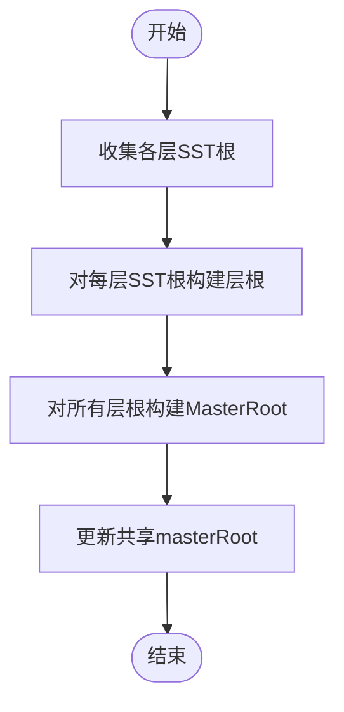

# mLSM增强操作

<cite>
**本文引用的文件**
- [leveldb/db.go](file://leveldb/db.go)
- [leveldb/db_write.go](file://leveldb/db_write.go)
- [leveldb/key.go](file://leveldb/key.go)
- [leveldb/version.go](file://leveldb/version.go)
- [leveldb/merkle/tree.go](file://leveldb/merkle/tree.go)
- [leveldb/merkle/hash.go](file://leveldb/merkle/hash.go)
- [leveldb/mlsm_final_comprehensive_test.go](file://leveldb/mlsm_final_comprehensive_test.go)
- [leveldb/mlsm_version_history_test.go](file://leveldb/mlsm_version_history_test.go)
- [leveldb/memdb/memdb_merkle.go](file://leveldb/memdb/memdb_merkle.go)
</cite>

## 目录
1. [简介](#简介)
2. [项目结构](#项目结构)
3. [核心组件](#核心组件)
4. [架构总览](#架构总览)
5. [详细组件分析](#详细组件分析)
6. [依赖分析](#依赖分析)
7. [性能考虑](#性能考虑)
8. [故障排查指南](#故障排查指南)
9. [结论](#结论)
10. [附录](#附录)

## 简介
本文件面向 avccDB 的 mLSM 架构，聚焦于增强的读写 API：PutWithVersion 与 GetWithProof。内容涵盖：
- PutWithVersion 的版本参数如何实现多版本并发控制与排序；
- 与 Merkle 树的集成方式及 MasterRoot 的聚合策略；
- GetWithProof 的证明生成、结构与验证流程；
- 与标准读写操作的关系、调用链与性能权衡；
- 版本冲突、证明验证失败等异常场景的处理建议。

## 项目结构
围绕 mLSM 增强操作的关键模块：
- 读写入口与事务合并：db_write.go
- 版本化内部键编码与解析：key.go
- 版本查询与证明生成：version.go
- 数据库对外 API：db.go（含 GetWithVersion、GetWithProof、GetMasterRoot、computeMasterRoot/updateMasterRoot）
- Merkle 树与哈希聚合：merkle/tree.go、merkle/hash.go
- 内存层 Merkle 支持（可选集成）：memdb/memdb_merkle.go
- 行为验证与示例：mlsm_final_comprehensive_test.go、mlsm_version_history_test.go

图表来源
- [leveldb/db_write.go](file://leveldb/db_write.go#L133-L438)
- [leveldb/key.go](file://leveldb/key.go#L90-L147)
- [leveldb/version.go](file://leveldb/version.go#L142-L429)
- [leveldb/db.go](file://leveldb/db.go#L1479-L1571)
- [leveldb/merkle/tree.go](file://leveldb/merkle/tree.go#L1-L120)
- [leveldb/merkle/hash.go](file://leveldb/merkle/hash.go#L127-L152)
- [leveldb/memdb/memdb_merkle.go](file://leveldb/memdb/memdb_merkle.go#L1-L181)

章节来源
- [leveldb/db_write.go](file://leveldb/db_write.go#L133-L438)
- [leveldb/key.go](file://leveldb/key.go#L90-L147)
- [leveldb/version.go](file://leveldb/version.go#L142-L429)
- [leveldb/db.go](file://leveldb/db.go#L1479-L1571)
- [leveldb/merkle/tree.go](file://leveldb/merkle/tree.go#L1-L120)
- [leveldb/merkle/hash.go](file://leveldb/merkle/hash.go#L127-L152)
- [leveldb/memdb/memdb_merkle.go](file://leveldb/memdb/memdb_merkle.go#L1-L181)

## 核心组件
- 版本化内部键格式与解析：makeInternalKeyWithVersion、parseInternalKeyWithVersion、extractVersion
- 写入合并与版本化批处理：PutWithVersion、writeLocked、writeMerge
- 读取与证明：GetWithVersion、GetWithProof、version.get/getWithProof
- Merkle 树与 MasterRoot：MerkleTree、BuildTreeFromHashes、AggregateRoots、computeMasterRoot/updateMasterRoot

章节来源
- [leveldb/key.go](file://leveldb/key.go#L90-L147)
- [leveldb/db_write.go](file://leveldb/db_write.go#L387-L438)
- [leveldb/version.go](file://leveldb/version.go#L142-L429)
- [leveldb/db.go](file://leveldb/db.go#L1479-L1571)
- [leveldb/merkle/tree.go](file://leveldb/merkle/tree.go#L1-L120)
- [leveldb/merkle/hash.go](file://leveldb/merkle/hash.go#L127-L152)

## 架构总览
mLSM 在标准 LevelDB 上扩展了“版本化键”和“Merkle 证明”。写入时将版本号编码进内部键；读取时按版本匹配或返回最新版本；同时维护每层 SST 的 Merkle 根，并聚合为 MasterRoot，用于全局完整性校验。

图表来源
- [leveldb/db.go](file://leveldb/db.go#L1113-L1146)
- [leveldb/version.go](file://leveldb/version.go#L288-L429)

## 详细组件分析

### PutWithVersion：版本化写入与并发控制
- 版本参数作用
  - 将 version 编码进内部键，形成“用户键 + 版本 + 序列号”的复合键，确保同一用户键下多版本共存。
  - 版本号参与排序，查询时可通过版本精确匹配或返回最新版本。
- 并发控制
  - 采用写合并通道 writeMergeC，支持批量合并写入，减少日志与内存压力。
  - 当写入批次过大时，自动降级为直接写入表（跳过日志），以避免内存膨胀。
  - 写入过程中维护序列号 seq，保证全局单调递增。
- 与 Merkle 集成
  - 写入路径不直接修改 Merkle 树，而是依赖后续 flush/compaction 后的 SST 层 Merkle 根聚合，最终更新 MasterRoot。

图表来源
- [leveldb/db_write.go](file://leveldb/db_write.go#L133-L438)
- [leveldb/db.go](file://leveldb/db.go#L1562-L1571)

章节来源
- [leveldb/db_write.go](file://leveldb/db_write.go#L133-L438)
- [leveldb/key.go](file://leveldb/key.go#L90-L147)
- [leveldb/db.go](file://leveldb/db.go#L1562-L1571)

### GetWithVersion：版本化读取与快照隔离
- 版本匹配逻辑
  - 若 version=0，则构造“通配符”版本标记，查询时匹配任意版本并选择最高序列号作为最新值。
  - 若 version>0，则严格匹配指定版本。
- 快照与序列号
  - 通过 acquireSnapshot/releaseSnapshot 获取稳定视图，避免读写竞争导致的不一致。
- 读取顺序
  - 先查辅助 MemDB，再查有效/冻结 MemDB，最后通过 version.get 遍历层级与表查找。

图表来源
- [leveldb/db.go](file://leveldb/db.go#L798-L833)
- [leveldb/version.go](file://leveldb/version.go#L142-L285)

章节来源
- [leveldb/db.go](file://leveldb/db.go#L798-L833)
- [leveldb/version.go](file://leveldb/version.go#L142-L285)

### GetWithProof：证明生成与验证
- 证明生成
  - 对于 MemDB：若命中，直接构造包含 MasterRoot 的简单证明（路径为空，表示当前状态由 MasterRoot 代表）。
  - 对于 SST：通过 version.getWithProof 返回值与 Merkle 证明；证明包含叶子键、值、版本、根哈希与路径。
- 证明结构
  - 字段：Key、Value、Version、Root、Exists、Path。
  - Path 为从叶节点到根的兄弟节点哈希与方向信息。
- 验证流程
  - 本地验证：先比对证明 Root 与当前数据库 MasterRoot 一致；再调用证明对象的 Verify 方法逐层重算哈希，确认路径正确。
  - 注意：当前测试中 MemDB 的证明 Root 与 MasterRoot 不一致属预期（MemDB 未完全集成 MerkleDB 根），SST 层证明 Root 为局部 SST 根。

图表来源
- [leveldb/db.go](file://leveldb/db.go#L835-L910)
- [leveldb/version.go](file://leveldb/version.go#L288-L429)
- [leveldb/db.go](file://leveldb/db.go#L1479-L1571)

章节来源
- [leveldb/db.go](file://leveldb/db.go#L835-L910)
- [leveldb/version.go](file://leveldb/version.go#L288-L429)
- [leveldb/db.go](file://leveldb/db.go#L1479-L1571)

### MasterRoot 与 Merkle 树聚合
- 层次化聚合
  - SST 层：每个 SST 生成 Merkle 根；
  - 层聚合：同层所有 SST 根构建 Merkle 根（Layer Root）；
  - 主聚合：所有层根构建 MasterRoot。
- 更新时机
  - flush/compaction 后调用 updateMasterRoot 重新计算并写入共享锁保护的 masterRoot。
- 聚合算法
  - 使用 BuildTreeFromHashes 或 AggregateRoots（后者为标记+拼接的简单聚合）。

图表来源
- [leveldb/db.go](file://leveldb/db.go#L1491-L1571)
- [leveldb/merkle/hash.go](file://leveldb/merkle/hash.go#L127-L152)

章节来源
- [leveldb/db.go](file://leveldb/db.go#L1491-L1571)
- [leveldb/merkle/hash.go](file://leveldb/merkle/hash.go#L127-L152)

### 内存层 Merkle（可选集成）
- MerkleDB 提供 MemDB 的 Merkle 树能力，支持 BuildMerkleTree、GetWithProof、GetRootHash 等。
- 当前 DB 的 getWithProof 对 MemDB 的证明 Root 与 MasterRoot 不一致属预期，因 MemDB MerkleDB 根尚未完全集成。

章节来源
- [leveldb/memdb/memdb_merkle.go](file://leveldb/memdb/memdb_merkle.go#L1-L181)

## 依赖分析
- 写入路径依赖
  - 内部键编码/解析：key.go
  - 写合并与批处理：db_write.go
  - 日志与序列号：journal + seq（db_write.go）
- 读取路径依赖
  - 版本查询与证明：version.go
  - Merkle 树与聚合：merkle/tree.go、merkle/hash.go
  - MasterRoot：db.go
- 测试验证
  - 大规模写入与版本历史：mlsm_final_comprehensive_test.go、mlsm_version_history_test.go

图表来源
- [leveldb/db_write.go](file://leveldb/db_write.go#L133-L438)
- [leveldb/key.go](file://leveldb/key.go#L90-L147)
- [leveldb/version.go](file://leveldb/version.go#L142-L429)
- [leveldb/db.go](file://leveldb/db.go#L1479-L1571)

章节来源
- [leveldb/db_write.go](file://leveldb/db_write.go#L133-L438)
- [leveldb/key.go](file://leveldb/key.go#L90-L147)
- [leveldb/version.go](file://leveldb/version.go#L142-L429)
- [leveldb/db.go](file://leveldb/db.go#L1479-L1571)

## 性能考虑
- 写入性能
  - 写合并显著降低日志写入与内存压力，适合高吞吐场景。
  - 大批次写入会绕过日志直接写表，减少延迟但占用更多内存。
- 读取性能
  - GetWithVersion 在 L0 可能存在重叠扫描，建议合理设置阈值与压缩策略。
  - GetWithProof 会额外生成/返回证明，增加 CPU 与内存开销，适合需要抗篡改验证的场景。
- Merkle 聚合
  - computeMasterRoot 遍历所有层级与表，代价与表数量、大小相关；建议在 flush/compaction 后统一更新。

[本节为通用指导，不直接分析具体文件]

## 故障排查指南
- 版本冲突/覆盖
  - 同一版本写入会覆盖旧值；如需保留历史请使用更高版本号。
  - 若出现“找不到版本”，检查 version 参数是否为 0（查询最新）或指定版本是否正确。
- 证明验证失败
  - 若证明 Root 与 MasterRoot 不一致，且来自 MemDB，属预期；来自 SST 的证明应与 MasterRoot 一致。
  - 验证失败时，优先检查数据库是否发生 compaction 导致 MasterRoot 更新，或证明是否被篡改。
- 并发写入阻塞
  - 写合并队列溢出或写入过快导致暂停，观察 writeDelay/writeDelayN 统计；必要时调整 WriteBuffer/阈值。
- 删除与 Tombstone
  - mLSM 保留历史版本，Delete 写入 Tombstone；最新版本查询可能返回删除前的值，历史版本仍可查询。

章节来源
- [leveldb/db.go](file://leveldb/db.go#L1479-L1571)
- [leveldb/mlsm_final_comprehensive_test.go](file://leveldb/mlsm_final_comprehensive_test.go#L360-L416)

## 结论
mLSM 通过版本化内部键与 Merkle 证明，实现了可追溯、可验证的多版本存储。PutWithVersion 提供细粒度版本控制，GetWithVersion/GetWithProof 支持精确版本查询与完整性验证。MasterRoot 作为全局一致性锚点，配合层级聚合保障跨层数据可信。实际部署中需根据业务对吞吐、延迟与安全性的权衡，合理配置写合并、压缩与证明生成策略。

[本节为总结，不直接分析具体文件]

## 附录

### API 参考与使用要点
- 函数签名与行为
  - GetWithVersion(key, version, ro)：返回指定版本或最新版本的值；version=0 表示最新。
  - GetWithProof(key, version, ro)：返回值与 Merkle 证明；可用于离线验证。
  - PutWithVersion(key, value, version, wo)：写入指定版本值；支持写合并与大批次直写。
  - GetMasterRoot()：返回当前 MasterRoot。
  - computeMasterRoot()/updateMasterRoot()：内部用于聚合层级根并更新 MasterRoot。
- 使用示例（路径引用）
  - 写入多版本：[leveldb/mlsm_final_comprehensive_test.go](file://leveldb/mlsm_final_comprehensive_test.go#L73-L116)
  - 查询最新版本：[leveldb/mlsm_final_comprehensive_test.go](file://leveldb/mlsm_final_comprehensive_test.go#L126-L139)
  - 查询指定版本：[leveldb/db.go](file://leveldb/db.go#L1113-L1125)
  - 生成并验证证明：[leveldb/db.go](file://leveldb/db.go#L1127-L1146)、[leveldb/mlsm_final_comprehensive_test.go](file://leveldb/mlsm_final_comprehensive_test.go#L237-L320)
  - 版本历史查询：[leveldb/mlsm_version_history_test.go](file://leveldb/mlsm_version_history_test.go#L12-L139)

章节来源
- [leveldb/db.go](file://leveldb/db.go#L1113-L1146)
- [leveldb/mlsm_final_comprehensive_test.go](file://leveldb/mlsm_final_comprehensive_test.go#L73-L139)
- [leveldb/mlsm_version_history_test.go](file://leveldb/mlsm_version_history_test.go#L12-L139)