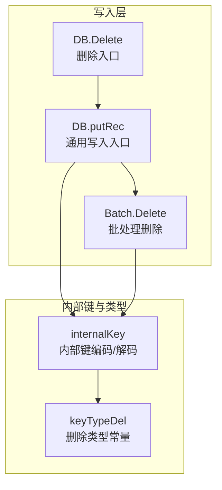
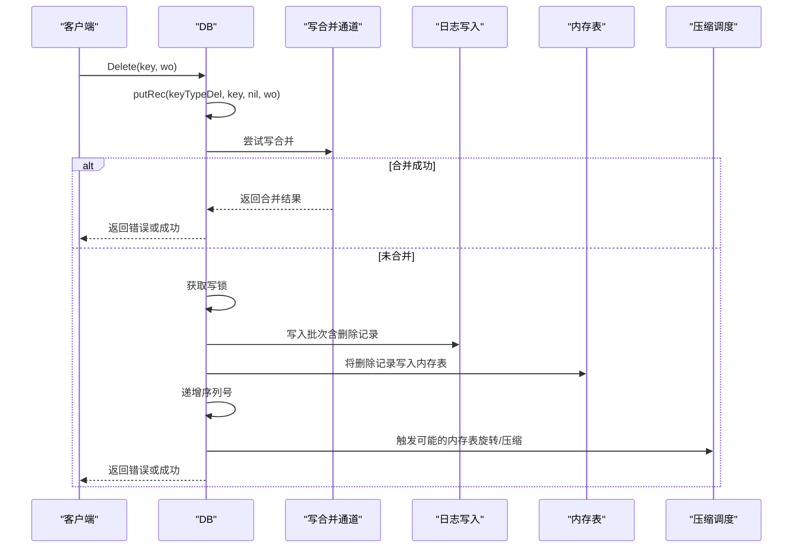
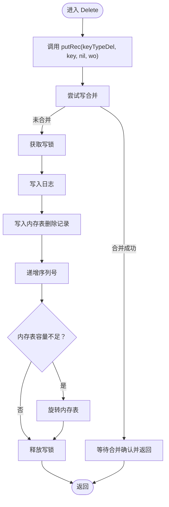
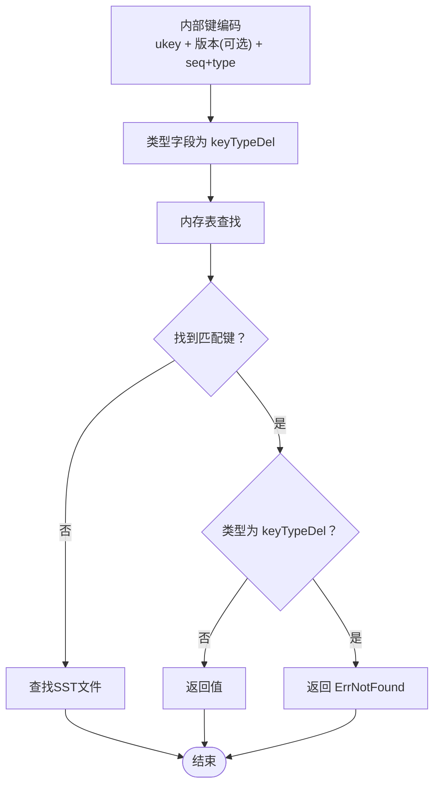
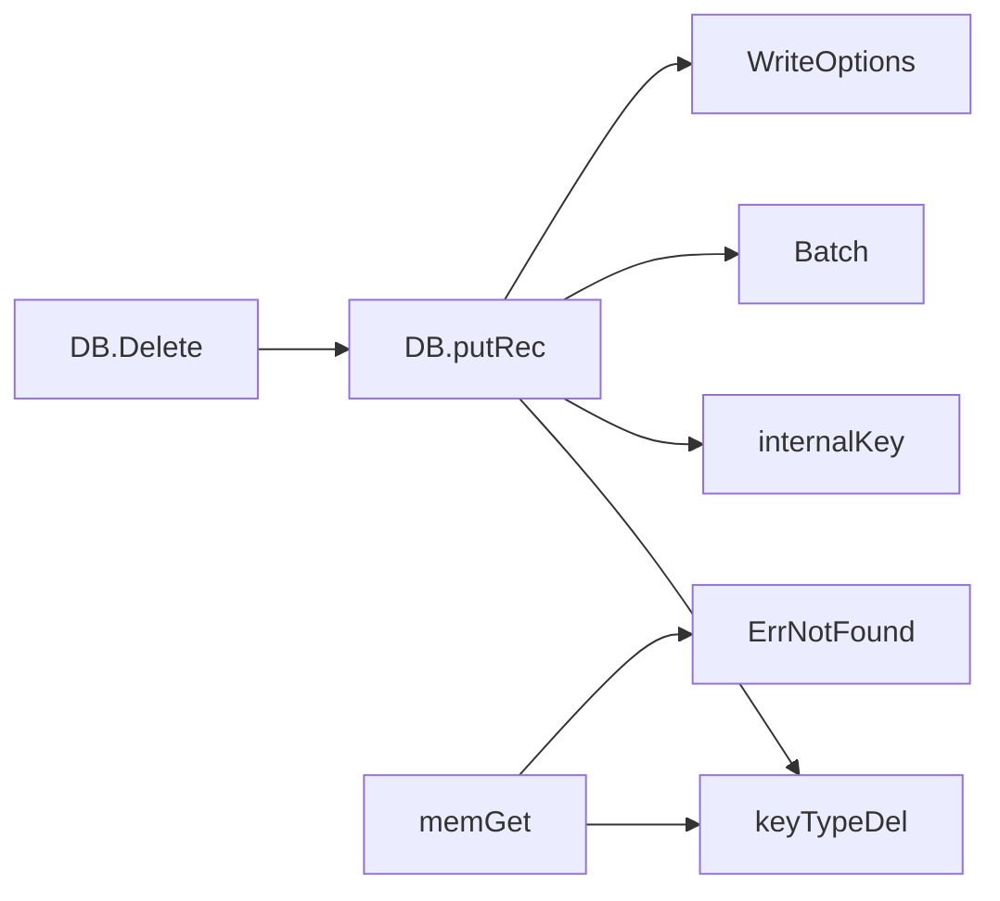

# Delete操作

<cite>
**本文引用的文件列表**
- [db_write.go](file://leveldb/db_write.go)
- [db.go](file://leveldb/db.go)
- [key.go](file://leveldb/key.go)
- [batch.go](file://leveldb/batch.go)
- [errors.go](file://leveldb/errors.go)
- [options.go](file://leveldb/opt/options.go)
- [db_transaction.go](file://leveldb/db_transaction.go)
- [mlsm_final_comprehensive_test.go](file://leveldb/mlsm_final_comprehensive_test.go)
</cite>

## 目录
1. [简介](#简介)
2. [项目结构与定位](#项目结构与定位)
3. [核心组件与职责](#核心组件与职责)
4. [架构总览](#架构总览)
5. [详细组件分析](#详细组件分析)
6. [依赖关系分析](#依赖关系分析)
7. [性能与并发特性](#性能与并发特性)
8. [故障排查与最佳实践](#故障排查与最佳实践)
9. [结论](#结论)

## 简介
本章节面向avccDB的Delete操作，提供完整的API参考与实现解析。Delete方法用于删除指定键的数据，其语义为“逻辑删除”：通过写入一个特殊的删除标记（tombstone）来标记该键被删除；真正的物理删除发生在后续的压缩（compaction）过程中。Delete操作复用内部写入路径，统一走写合并与序列号分配流程，确保与Put等其他写操作一致的并发与一致性模型。

## 项目结构与定位
- Delete位于数据库写入层，对外暴露为DB.Delete(key []byte, wo *opt.WriteOptions) error。
- 实现通过调用内部通用写入入口db.putRec(keyTypeDel, key, nil, wo)，将删除记录以批处理形式写入内存表并落盘。
- 内部键编码与类型常量定义在key.go中，用于区分删除记录与普通值记录。
- 批处理（Batch）支持直接追加删除记录，便于批量删除场景。

图表来源
- [db_write.go](file://leveldb/db_write.go#L440-L447)
- [db_write.go](file://leveldb/db_write.go#L332-L375)
- [batch.go](file://leveldb/batch.go#L150-L155)
- [key.go](file://leveldb/key.go#L31-L48)
- [key.go](file://leveldb/key.go#L75-L117)

章节来源
- [db_write.go](file://leveldb/db_write.go#L440-L447)
- [batch.go](file://leveldb/batch.go#L150-L155)
- [key.go](file://leveldb/key.go#L31-L48)

## 核心组件与职责
- DB.Delete
  - 函数签名：Delete(key []byte, wo *opt.WriteOptions) error
  - 参数
    - key []byte：要删除的用户键
    - wo *opt.WriteOptions：写入选项，控制是否启用写合并、是否同步刷盘等
  - 返回值：error，可能为ErrClosed、ErrReadOnly或底层写入错误
  - 行为：写入删除标记（tombstone），不立即物理删除
- DB.putRec
  - 通用写入入口，负责写合并、序列号分配、日志写入与内存表写入
  - Delete通过传入keyTypeDel触发删除记录写入
- Batch.Delete
  - 批处理中的删除记录追加，便于批量删除
- keyTypeDel与internalKey
  - keyTypeDel标识删除类型
  - internalKey编码包含用户键、版本（可选）、序列号与类型字段，用于排序与查找

章节来源
- [db_write.go](file://leveldb/db_write.go#L440-L447)
- [db_write.go](file://leveldb/db_write.go#L332-L375)
- [batch.go](file://leveldb/batch.go#L150-L155)
- [key.go](file://leveldb/key.go#L31-L48)
- [key.go](file://leveldb/key.go#L75-L117)

## 架构总览
Delete操作的调用链路如下：
- 外部调用DB.Delete -> DB.putRec(keyTypeDel, key, nil, wo) -> 写合并/锁竞争 -> 写入日志 -> 写入内存表 -> 序列号递增 -> 可能触发旋转内存表
- 读取侧：当从内存表或SST文件中找到对应键的记录，若类型为keyTypeDel，则返回“未找到”语义（ErrNotFound）

图表来源
- [db_write.go](file://leveldb/db_write.go#L268-L331)
- [db_write.go](file://leveldb/db_write.go#L332-L375)
- [db_write.go](file://leveldb/db_write.go#L18-L33)

## 详细组件分析

### Delete方法API参考
- 方法签名
  - Delete(key []byte, wo *opt.WriteOptions) error
- 参数说明
  - key []byte：用户键，不可为nil
  - wo *opt.WriteOptions：写入选项，可为nil（使用默认值）
    - NoWriteMerge：是否禁用写合并，默认false
    - Sync：是否同步刷盘，默认false
- 返回值
  - error：可能返回ErrClosed、ErrReadOnly、ErrNotFound（读取侧语义）或底层写入错误
- 语义与行为
  - Delete写入删除标记（tombstone），不保证立即可见性
  - 读取侧遇到keyTypeDel会返回“未找到”，但mLSM保留历史版本时，Get(latest)可能返回历史值或NotFound，具体取决于实现策略
  - 物理删除在后续压缩过程中发生

章节来源
- [db_write.go](file://leveldb/db_write.go#L440-L447)
- [options.go](file://leveldb/opt/options.go#L723-L747)

### Delete实现与写入合并机制
- Delete通过DB.putRec(keyTypeDel, key, nil, wo)复用通用写入路径
- 写合并（writeMergeC）在小批次写入时尝试合并，减少日志与内存表写入次数
- 写入顺序：先写journal，再写内存表，最后递增序列号
- 若当前内存表容量不足，可能触发旋转内存表（rotateMem）

图表来源
- [db_write.go](file://leveldb/db_write.go#L332-L375)
- [db_write.go](file://leveldb/db_write.go#L18-L33)
- [db_write.go](file://leveldb/db_write.go#L35-L64)

章节来源
- [db_write.go](file://leveldb/db_write.go#L268-L331)
- [db_write.go](file://leveldb/db_write.go#L332-L375)

### 内部键编码与删除标记
- keyTypeDel定义删除类型，internalKey编码包含用户键、版本（可选）、序列号与类型字段
- 读取侧在内存表查找时，若发现类型为keyTypeDel则返回“未找到”
- mLSM保留历史版本时，Get(latest)可能返回历史值或NotFound，测试用例验证了该行为

图表来源
- [key.go](file://leveldb/key.go#L31-L48)
- [key.go](file://leveldb/key.go#L75-L117)
- [db.go](file://leveldb/db.go#L769-L796)

章节来源
- [key.go](file://leveldb/key.go#L31-L48)
- [key.go](file://leveldb/key.go#L75-L117)
- [db.go](file://leveldb/db.go#L769-L796)

### 批处理中的Delete
- Batch.Delete(key []byte)会在批处理中追加一条删除记录
- Batch在提交到DB时，同样通过DB.putRec写入，保持一致性

章节来源
- [batch.go](file://leveldb/batch.go#L150-L155)

### 事务中的Delete
- Transaction.Delete(key []byte, wo *opt.WriteOptions) error
- 事务内Delete同样写入keyTypeDel，但事务未提交前不会触发压缩

章节来源
- [db_transaction.go](file://leveldb/db_transaction.go#L147-L159)

### 使用示例与最佳实践
- 单键删除
  - 调用DB.Delete(key, wo)
  - 若需要强一致可见性，可在删除后进行一次CompactRange或等待后台压缩
- 批量删除
  - 使用Batch.Delete(key)累积多条删除记录，最后一次性DB.Write(batch, wo)
- 并发与线程安全
  - DB.Delete是并发安全的，内部通过写锁与写合并通道协调
  - 读取侧遇到keyTypeDel返回“未找到”，但mLSM保留历史版本时需注意Get(latest)的行为
- 错误处理
  - ErrClosed：DB已关闭
  - ErrReadOnly：只读模式下不允许写入
  - 其他写入错误：如磁盘空间不足、IO错误等

章节来源
- [db_write.go](file://leveldb/db_write.go#L440-L447)
- [errors.go](file://leveldb/errors.go#L13-L21)
- [mlsm_final_comprehensive_test.go](file://leveldb/mlsm_final_comprehensive_test.go#L373-L415)

## 依赖关系分析
- Delete依赖
  - DB.putRec：通用写入入口
  - keyTypeDel：删除类型常量
  - internalKey：内部键编码/解码
  - Batch：批处理删除
  - WriteOptions：写入选项
- 读取侧依赖
  - memGet：内存表查找时识别keyTypeDel并返回ErrNotFound
  - mLSM历史版本：Get(latest)可能返回历史值或NotFound

图表来源
- [db_write.go](file://leveldb/db_write.go#L440-L447)
- [db_write.go](file://leveldb/db_write.go#L332-L375)
- [key.go](file://leveldb/key.go#L31-L48)
- [db.go](file://leveldb/db.go#L769-L796)
- [errors.go](file://leveldb/errors.go#L13-L21)

章节来源
- [db_write.go](file://leveldb/db_write.go#L440-L447)
- [db_write.go](file://leveldb/db_write.go#L332-L375)
- [key.go](file://leveldb/key.go#L31-L48)
- [db.go](file://leveldb/db.go#L769-L796)
- [errors.go](file://leveldb/errors.go#L13-L21)

## 性能与并发特性
- 写合并
  - 小批次写入可通过写合并通道合并，降低日志与内存表写入次数
- 写锁与写合并通道
  - Delete通过写合并通道与写锁协调，避免频繁竞争
- 内存表容量阈值
  - 当写入导致内存表接近容量上限时，可能触发旋转内存表，进而触发压缩
- 并发安全
  - DB.Delete是并发安全的，DB实例在Open时声明“并发使用安全”

章节来源
- [db_write.go](file://leveldb/db_write.go#L133-L153)
- [db_write.go](file://leveldb/db_write.go#L155-L266)
- [db_write.go](file://leveldb/db_write.go#L35-L64)

## 故障排查与最佳实践
- 常见错误
  - ErrClosed：DB已关闭，检查Close调用时机
  - ErrReadOnly：只读模式，需在非只读模式下执行Delete
  - IO错误：磁盘空间不足、权限问题等，检查系统状态
- 读取行为
  - Delete后Get(latest)可能返回NotFound或历史值（mLSM保留历史），属于预期行为
- 最佳实践
  - 批量删除使用Batch.Delete + DB.Write，减少写入开销
  - 对关键路径的删除操作，建议在业务层做幂等判断
  - 需要强一致可见性时，可在删除后触发一次压缩或等待后台压缩完成

章节来源
- [errors.go](file://leveldb/errors.go#L13-L21)
- [mlsm_final_comprehensive_test.go](file://leveldb/mlsm_final_comprehensive_test.go#L373-L415)

## 结论
avccDB的Delete操作采用“逻辑删除+延迟物理删除”的设计：通过写入删除标记（tombstone）实现快速删除，真正的物理清理由压缩过程完成。Delete复用通用写入路径，具备写合并、序列号管理与并发控制能力；读取侧在内存表中遇到删除标记即返回“未找到”。对于需要保留历史版本的mLSM场景，Get(latest)可能返回历史值或NotFound，属于预期行为。在实际使用中，建议结合批处理与合适的写选项，以获得更好的性能与一致性表现。