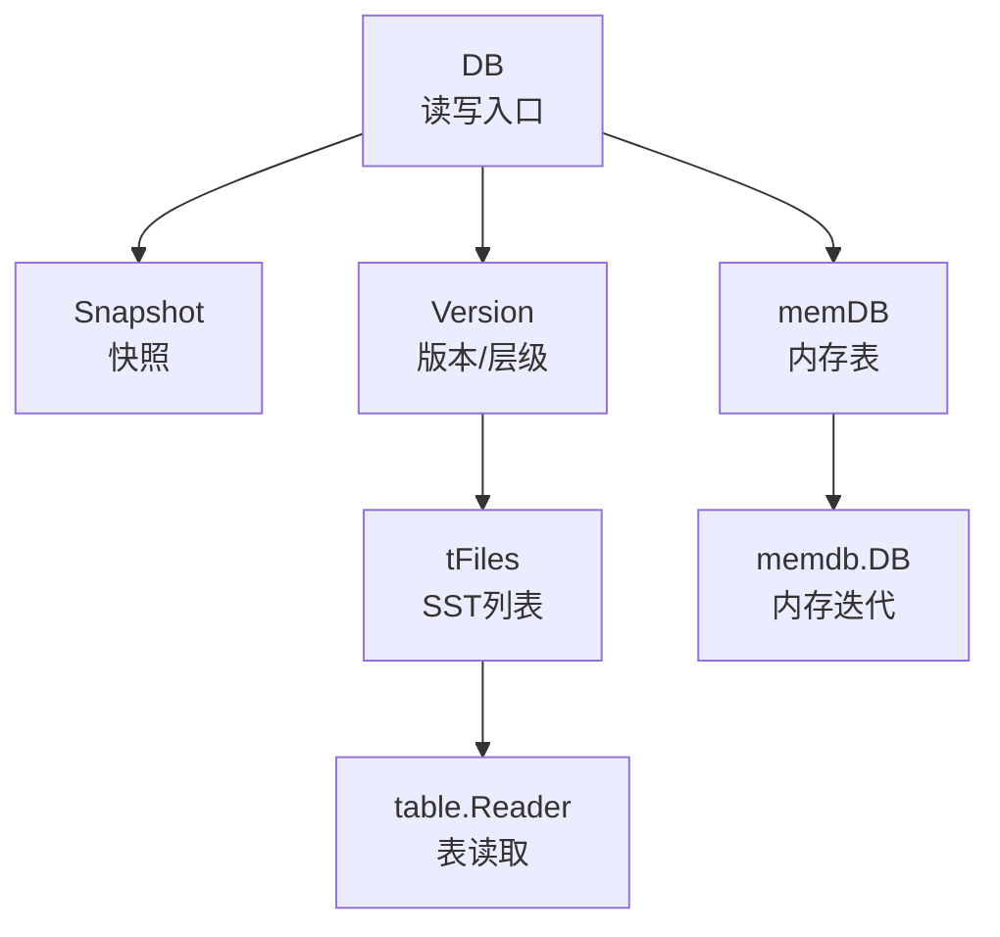
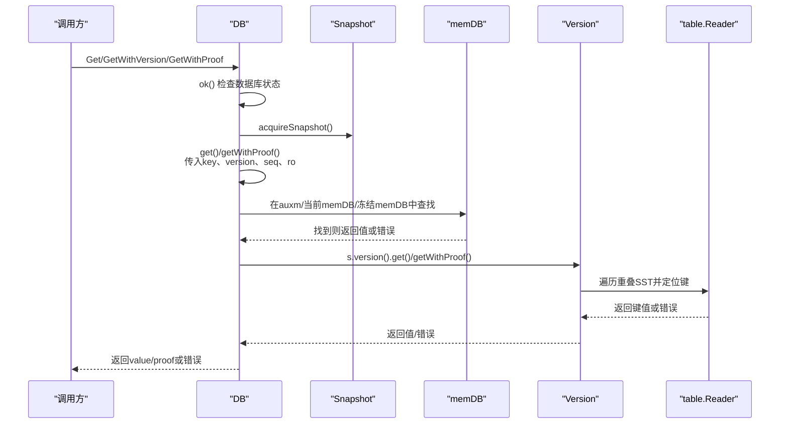
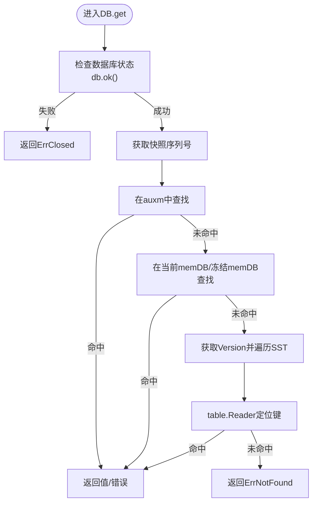
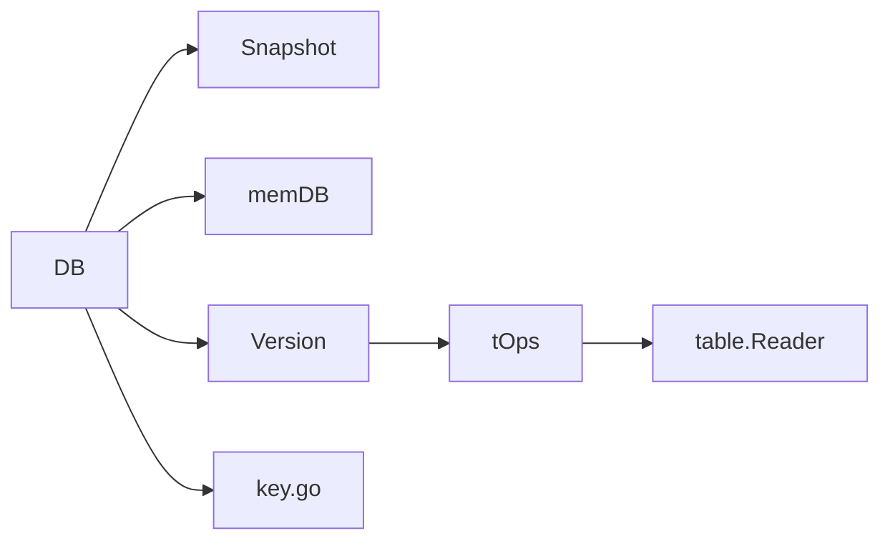

# Get操作

<cite>
**本文引用的文件**
- [leveldb/db.go](file://leveldb/db.go)
- [leveldb/db_state.go](file://leveldb/db_state.go)
- [leveldb/db_snapshot.go](file://leveldb/db_snapshot.go)
- [leveldb/key.go](file://leveldb/key.go)
- [leveldb/version.go](file://leveldb/version.go)
- [leveldb/table.go](file://leveldb/table.go)
- [leveldb/table/reader.go](file://leveldb/table/reader.go)
- [leveldb/memdb/memdb.go](file://leveldb/memdb/memdb.go)
- [leveldb/errors.go](file://leveldb/errors.go)
</cite>

## 目录
1. [简介](#简介)
2. [项目结构](#项目结构)
3. [核心组件](#核心组件)
4. [架构总览](#架构总览)
5. [详细组件分析](#详细组件分析)
6. [依赖关系分析](#依赖关系分析)
7. [性能考量](#性能考量)
8. [故障排查指南](#故障排查指南)
9. [结论](#结论)

## 简介
本章节面向avccDB的Get操作，提供一份系统化的API参考文档。内容涵盖：
- 函数签名与参数语义（key []byte, ro *opt.ReadOptions）
- 返回值与错误类型
- 读取流程：数据库状态检查、快照序列号获取、在memDB与SSTable中的查找顺序
- 快照隔离如何保障一致性
- 内存表与磁盘表的查找策略
- 使用示例路径与最佳实践
- 常见问题与错误处理建议

## 项目结构
围绕Get操作的关键模块包括：
- 数据库入口与读写控制：leveldb/db.go
- 快照与序列号管理：leveldb/db_snapshot.go、leveldb/db_state.go
- 版本与层级查找：leveldb/version.go、leveldb/table.go
- 表层读取与迭代器：leveldb/table/reader.go
- 内存表读取：leveldb/memdb/memdb.go
- 内部键构造与解析：leveldb/key.go
- 错误类型定义：leveldb/errors.go

图表来源
- [leveldb/db.go](file://leveldb/db.go#L1092-L1107)
- [leveldb/db_snapshot.go](file://leveldb/db_snapshot.go#L27-L61)
- [leveldb/version.go](file://leveldb/version.go#L142-L285)
- [leveldb/table.go](file://leveldb/table.go#L433-L488)
- [leveldb/table/reader.go](file://leveldb/table/reader.go#L770-L800)
- [leveldb/memdb/memdb.go](file://leveldb/memdb/memdb.go#L351-L366)

章节来源
- [leveldb/db.go](file://leveldb/db.go#L1092-L1107)
- [leveldb/db_snapshot.go](file://leveldb/db_snapshot.go#L27-L61)
- [leveldb/version.go](file://leveldb/version.go#L142-L285)
- [leveldb/table.go](file://leveldb/table.go#L433-L488)
- [leveldb/table/reader.go](file://leveldb/table/reader.go#L770-L800)
- [leveldb/memdb/memdb.go](file://leveldb/memdb/memdb.go#L351-L366)

## 核心组件
- DB.Get(key []byte, ro *opt.ReadOptions)
  - 功能：获取指定键的最新版本值；若不存在返回ErrNotFound
  - 参数：
    - key：用户键字节切片
    - ro：读选项（opt.ReadOptions），用于控制读行为（如校验、缓存等）
  - 返回：value []byte（拷贝后的值）、err error
  - 错误：ErrNotFound（键不存在）、ErrClosed（数据库已关闭）、ErrReadOnly（只读模式下不允许写但读仍可用）

- DB.GetWithVersion(key []byte, version uint64, ro *opt.ReadOptions)
  - 功能：获取指定版本的值；version为0表示最新版本
  - 返回：value []byte、err error

- DB.GetWithProof(key []byte, version uint64, ro *opt.ReadOptions)
  - 功能：获取值及Merkle证明（可验证值的真实性）
  - 返回：value []byte、proof *merkle.MerkleProof、err error

- Snapshot.Get(key []byte, ro *opt.ReadOptions)
  - 功能：基于快照读取，保证读取期间数据一致性
  - 返回：value []byte、err error

章节来源
- [leveldb/db.go](file://leveldb/db.go#L1092-L1146)
- [leveldb/db_snapshot.go](file://leveldb/db_snapshot.go#L97-L114)
- [leveldb/errors.go](file://leveldb/errors.go#L13-L21)

## 架构总览
Get操作的调用链路如下：
- 外层调用DB.Get/DB.GetWithVersion/DB.GetWithProof
- 获取快照序列号（acquireSnapshot），确保读取一致性
- 调用内部get/getWithProof，按以下顺序查找：
  1) 辅助memDB（auxm）
  2) 当前有效memDB与冻结memDB
  3) 版本树（Version）遍历SST文件，按层级与重叠范围查找
- 对于SST层，使用table.Reader进行定位与读取

图表来源
- [leveldb/db.go](file://leveldb/db.go#L1092-L1146)
- [leveldb/db_snapshot.go](file://leveldb/db_snapshot.go#L27-L61)
- [leveldb/version.go](file://leveldb/version.go#L142-L285)
- [leveldb/table/reader.go](file://leveldb/table/reader.go#L770-L800)

## 详细组件分析

### Get方法API定义与语义
- 函数签名
  - DB.Get(key []byte, ro *opt.ReadOptions) (value []byte, err error)
  - DB.GetWithVersion(key []byte, version uint64, ro *opt.ReadOptions) (value []byte, err error)
  - DB.GetWithProof(key []byte, version uint64, ro *opt.ReadOptions) (value []byte, proof *merkle.MerkleProof, err error)
- 参数
  - key：用户键字节切片
  - version：目标版本号；0表示最新版本
  - ro：读选项，影响读取行为（如是否校验、缓存策略等）
- 返回
  - value：拷贝后的值；调用方可安全修改返回值
  - proof：Merkle证明（仅GetWithProof）
  - err：错误；常见为ErrNotFound、ErrClosed、ErrReadOnly
- 并发与快照
  - Get系列方法内部会获取快照并释放，保证读取一致性

章节来源
- [leveldb/db.go](file://leveldb/db.go#L1092-L1146)
- [leveldb/errors.go](file://leveldb/errors.go#L13-L21)

### 读取流程与查找策略
- 步骤一：检查数据库状态
  - 通过db.ok()判断是否已关闭；若关闭返回ErrClosed
- 步骤二：获取快照序列号
  - acquireSnapshot()返回当前序列号；后续读取以此seq为准
- 步骤三：在memDB中查找
  - 先尝试auxm（辅助memDB，通常为空）
  - 再尝试当前有效memDB与冻结memDB
  - memGet()负责解析内部键，区分删除标记与值，并处理版本匹配
- 步骤四：在SSTable中查找
  - 通过version.get()/getWithProof()遍历重叠SST
  - 对于非版本化键，按最大序列号选择最新值；对于版本化键，按目标版本匹配
  - 使用table.Reader定位键并读取值

图表来源
- [leveldb/db.go](file://leveldb/db.go#L798-L833)
- [leveldb/version.go](file://leveldb/version.go#L142-L285)
- [leveldb/table/reader.go](file://leveldb/table/reader.go#L770-L800)

章节来源
- [leveldb/db.go](file://leveldb/db.go#L798-L833)
- [leveldb/version.go](file://leveldb/version.go#L142-L285)

### 快照隔离与一致性
- 快照机制
  - acquireSnapshot()记录当前序列号，确保读取期间不会看到之后提交的写入
  - minSeq()返回最小未被快照持有的序列号，用于清理与压缩决策
- 一致性保证
  - 读取时使用快照seq作为上限，避免读到新写入的值
  - Snapshot.Get()内部同样通过db.ok()与acquire/releaseSnapshot保证生命周期内的一致性

章节来源
- [leveldb/db_snapshot.go](file://leveldb/db_snapshot.go#L27-L61)
- [leveldb/db_state.go](file://leveldb/db_state.go#L61-L72)

### 内存表与磁盘表的查找策略
- 内存表（memDB）
  - memGet()解析内部键，支持带版本与不带版本两种格式
  - 删除键以keyTypeDel标识，遇到删除键返回ErrNotFound
  - 优先级：auxm > 当前memDB > 冻结memDB
- 磁盘表（SST）
  - version.get()按层级与重叠范围遍历SST
  - 对于Level-0可能存在相互重叠，需逐个检查
  - 非版本化键按最大序列号取最新值；版本化键按目标版本精确匹配

章节来源
- [leveldb/db.go](file://leveldb/db.go#L769-L796)
- [leveldb/version.go](file://leveldb/version.go#L142-L285)
- [leveldb/key.go](file://leveldb/key.go#L90-L146)

### 内部键与版本
- 内部键格式
  - 非版本化：ukey + (seq<<8|type)
  - 版本化：ukey + version(8B) + (seq<<8|type)
- 解析与比较
  - parseInternalKey/parseInternalKeyWithVersion用于解析
  - ukey()提取用户键
  - keyMaxSeq用于“匹配任意版本”的特殊标记

章节来源
- [leveldb/key.go](file://leveldb/key.go#L75-L146)

### 表层读取与迭代器
- table.Reader提供Find/FindKey/NewIterator等能力
- tOps封装打开、查找、迭代等操作，内部使用缓存与缓冲池优化
- getWithProof()在SST层生成Merkle证明，结合master root形成完整证明

章节来源
- [leveldb/table/reader.go](file://leveldb/table/reader.go#L770-L800)
- [leveldb/table.go](file://leveldb/table.go#L433-L488)

## 依赖关系分析
- DB对Snapshot的依赖：通过acquire/releaseSnapshot管理生命周期
- DB对memDB的依赖：通过getMems()获取当前与冻结memDB
- DB对Version的依赖：通过s.version()获取不可变版本视图
- Version对tOps与table.Reader的依赖：用于SST层查找与迭代
- key.go提供内部键构造与解析工具

图表来源
- [leveldb/db.go](file://leveldb/db.go#L1092-L1146)
- [leveldb/db_snapshot.go](file://leveldb/db_snapshot.go#L27-L61)
- [leveldb/version.go](file://leveldb/version.go#L142-L285)
- [leveldb/table.go](file://leveldb/table.go#L433-L488)
- [leveldb/key.go](file://leveldb/key.go#L75-L146)

章节来源
- [leveldb/db.go](file://leveldb/db.go#L1092-L1146)
- [leveldb/version.go](file://leveldb/version.go#L142-L285)

## 性能考量
- 快照成本：每次Get都会创建快照，频繁读取可考虑复用Snapshot
- 层级遍历：Level-0重叠较多，可能需要检查多个SST；合理设置读选项可减少IO
- 缓存利用：table.Reader与tOps使用文件缓存与块缓存，提升重复读取性能
- 版本化键：版本化查询可避免扫描所有版本，提高效率

## 故障排查指南
- 键不存在
  - 现象：返回ErrNotFound
  - 排查：确认键是否正确写入、是否被删除、版本是否正确
- 数据库已关闭
  - 现象：返回ErrClosed
  - 排查：确认DB是否已被Close，避免在关闭后继续读取
- 只读模式
  - 现象：ErrReadOnly（写操作不允许，读操作仍可用）
  - 排查：确认打开选项是否为只读模式
- 内部键异常
  - 现象：解析内部键时报错
  - 排查：检查内部键构造逻辑与存储完整性

章节来源
- [leveldb/errors.go](file://leveldb/errors.go#L13-L21)
- [leveldb/db_state.go](file://leveldb/db_state.go#L231-L237)

## 结论
Get操作通过“数据库状态检查—快照序列号—memDB—SST”四步流程，实现了高效且一致的读取。借助快照隔离与内部键版本机制，既能满足最新版本读取，也能支持特定版本与证明读取。实践中应关注快照成本、层级遍历与缓存配置，以获得更优性能。