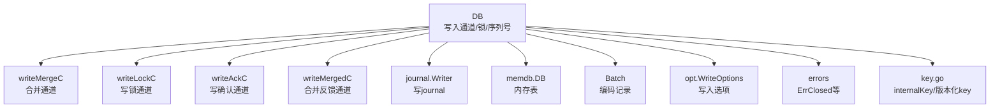
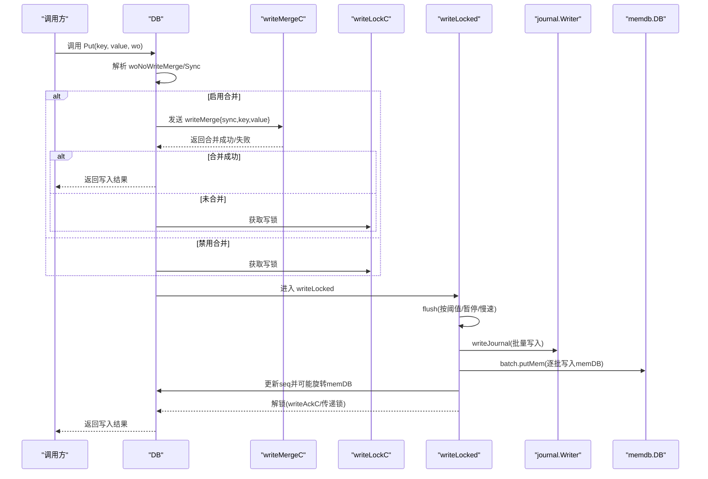
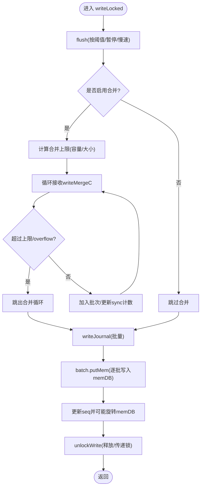
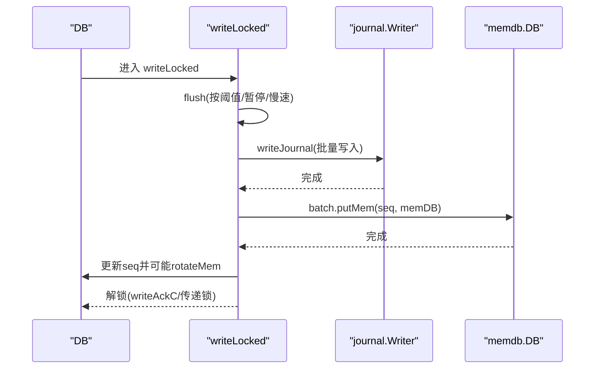
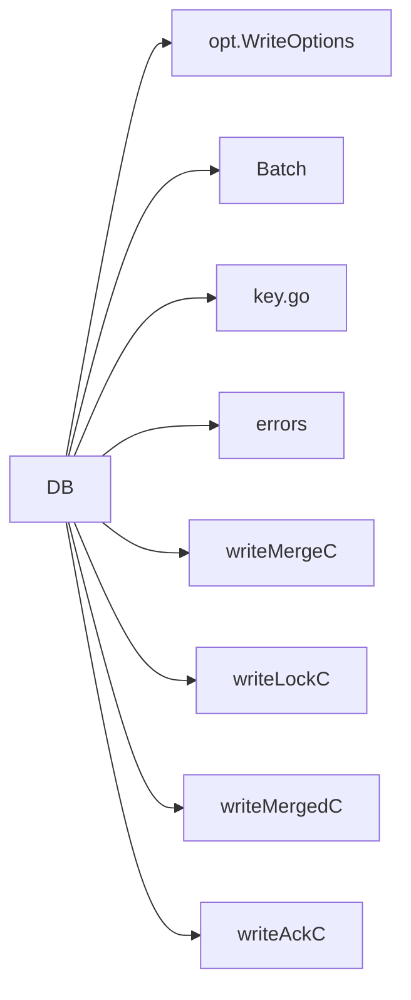

# Put操作

<cite>
**本文引用的文件**
- [leveldb/db_write.go](file://leveldb/db_write.go)
- [leveldb/db.go](file://leveldb/db.go)
- [leveldb/batch.go](file://leveldb/batch.go)
- [leveldb/key.go](file://leveldb/key.go)
- [leveldb/opt/options.go](file://leveldb/opt/options.go)
- [leveldb/errors.go](file://leveldb/errors.go)
- [leveldb/db_test.go](file://leveldb/db_test.go)
- [leveldb/bench_test.go](file://leveldb/bench_test.go)
</cite>

## 目录
1. [简介](#简介)
2. [项目结构](#项目结构)
3. [核心组件](#核心组件)
4. [架构总览](#架构总览)
5. [详细组件分析](#详细组件分析)
6. [依赖关系分析](#依赖关系分析)
7. [性能考量](#性能考量)
8. [故障排查指南](#故障排查指南)
9. [结论](#结论)
10. [附录](#附录)

## 简介
本章节面向avccDB的Put操作，提供一份完整的API参考与实现解析。内容涵盖：
- 函数签名与参数说明（key []byte, value []byte, wo *opt.WriteOptions）
- 返回错误类型与常见错误场景
- 写入合并（writeMerge）机制与性能优化
- 线程安全保证与并发访问要点
- 底层实现流程：获取写入锁、检查数据库状态、写journal、插入memDB
- 错误处理最佳实践与常见问题定位
- 标准使用示例路径（不直接展示代码）

## 项目结构
围绕Put操作的关键文件与职责：
- 数据库对象与写入通道：DB结构体持有写入相关通道与锁，负责协调写入合并、刷写与序列号管理
- 写入实现：DB.Write/Put/PutWithVersion等方法，统一通过writeMerge机制进行合并
- 批处理：Batch用于编码多条记录，Put内部会构造单条记录的Batch
- 键编码：internalKey与版本化internalKey的生成与解析
- 选项：WriteOptions控制是否启用写入合并与同步策略
- 错误：ErrClosed等通用错误类型

图表来源
- [leveldb/db.go](file://leveldb/db.go#L33-L97)
- [leveldb/db_write.go](file://leveldb/db_write.go#L133-L170)
- [leveldb/batch.go](file://leveldb/batch.go#L63-L100)
- [leveldb/key.go](file://leveldb/key.go#L75-L104)
- [leveldb/opt/options.go](file://leveldb/opt/options.go#L724-L743)
- [leveldb/errors.go](file://leveldb/errors.go#L13-L21)

章节来源
- [leveldb/db.go](file://leveldb/db.go#L33-L97)
- [leveldb/db_write.go](file://leveldb/db_write.go#L133-L170)

## 核心组件
- DB结构体中的写入相关字段
  - writeMergeC：接收待合并的写入请求
  - writeLockC：写锁通道，确保同一时刻只有一个写入在执行
  - writeMergedC：通知合并是否成功
  - writeAckC：向等待合并的写入发送最终结果
  - seq：全局单调递增的序列号
  - journal/journalWriter：持久化写入到journal
  - mem/frozenMem：当前与冻结的内存表
- 写入选项
  - NoWriteMerge：禁用写入合并
  - Sync：是否强制同步落盘
- Batch
  - 记录编码与internalLen计算，支持版本化记录
- internalKey与版本化internalKey
  - 将用户键与序列号/版本打包，作为存储层内部键

章节来源
- [leveldb/db.go](file://leveldb/db.go#L33-L97)
- [leveldb/opt/options.go](file://leveldb/opt/options.go#L724-L743)
- [leveldb/batch.go](file://leveldb/batch.go#L63-L100)
- [leveldb/key.go](file://leveldb/key.go#L75-L104)

## 架构总览
Put操作通过writeMerge机制实现“写入合并”，在满足容量限制的前提下，将多个小写入合并为一次批量写入，减少journal写入次数与memDB插入次数，从而提升吞吐并降低延迟。

图表来源
- [leveldb/db_write.go](file://leveldb/db_write.go#L295-L330)
- [leveldb/db_write.go](file://leveldb/db_write.go#L331-L375)
- [leveldb/db_write.go](file://leveldb/db_write.go#L155-L266)

## 详细组件分析

### Put方法API定义与参数说明
- 方法签名
  - func (db *DB) Put(key, value []byte, wo *opt.WriteOptions) error
- 参数
  - key []byte：用户键
  - value []byte：用户值
  - wo *opt.WriteOptions：写入选项
    - NoWriteMerge：是否禁用写入合并
    - Sync：是否强制同步落盘
- 返回值
  - error：可能返回ErrClosed（数据库已关闭）、ErrReadOnly（只读模式）或写入过程中的其他错误

章节来源
- [leveldb/db_write.go](file://leveldb/db_write.go#L377-L385)
- [leveldb/opt/options.go](file://leveldb/opt/options.go#L724-L743)
- [leveldb/errors.go](file://leveldb/errors.go#L13-L21)

### 写入合并机制（writeMerge）
- 合并触发条件
  - wo.NoWriteMerge为false且全局NoWriteMerge配置为false时启用
- 合并策略
  - 从writeMergeC中非阻塞地接收其他写入请求，累计到批次上限
  - 合并上限由两部分决定：
    - 单条Put的internalLen估算（key+len(value)+8字节内部键头）
    - memDB剩余容量（mdbFree）
  - 若某条写入超出剩余容量，则标记overflow并停止合并
- 合并结果
  - 成功合并：向发起者返回合并后的写入结果
  - 未合并：将写锁交给当前写入，继续执行writeLocked

图表来源
- [leveldb/db_write.go](file://leveldb/db_write.go#L155-L266)

章节来源
- [leveldb/db_write.go](file://leveldb/db_write.go#L133-L170)
- [leveldb/db_write.go](file://leveldb/db_write.go#L155-L266)

### 线程安全保证
- 写入锁
  - writeLockC为长度为1的通道，确保同一时刻仅有一个写入在执行
- 合并通道
  - writeMergeC用于收集可合并的写入；若无法合并则竞争写锁
- 并发访问
  - DB实例被设计为可并发使用，Put/PutWithVersion/Delete等写操作均通过上述机制保证一致性
- 只读模式
  - SetReadOnly后写入会被拒绝（ErrReadOnly），避免破坏只读约束

章节来源
- [leveldb/db_write.go](file://leveldb/db_write.go#L295-L330)
- [leveldb/db_write.go](file://leveldb/db_write.go#L503-L530)
- [leveldb/errors.go](file://leveldb/errors.go#L13-L21)

### 底层实现流程详解
- 获取写入锁
  - 若启用合并，优先尝试将writeMerge放入writeMergeC；若失败则竞争writeLockC
- 检查数据库状态
  - 使用db.ok()检查是否已关闭；若关闭返回ErrClosed
- 写journal
  - writeJournal将批量记录写入journal，并根据Sync选项决定是否同步
- 插入memDB
  - 逐批调用batch.putMem写入memdb.DB
- 更新序列号与旋转memDB
  - 增量更新全局seq；当batch大小达到memDB剩余容量时触发rotateMem
- 解锁与返回
  - unlockWrite向等待合并的写入发送最终结果；若overflow则将写锁传递给下一个写入

图表来源
- [leveldb/db_write.go](file://leveldb/db_write.go#L155-L266)
- [leveldb/db_write.go](file://leveldb/db_write.go#L18-L33)

章节来源
- [leveldb/db_write.go](file://leveldb/db_write.go#L155-L266)
- [leveldb/db_write.go](file://leveldb/db_write.go#L18-L33)

### 错误类型与处理建议
- 常见错误
  - ErrClosed：数据库已关闭，通常发生在Close后仍尝试写入
  - ErrReadOnly：只读模式下禁止写入
  - 其他：journal写入失败、memDB写入失败等
- 处理建议
  - 在业务层捕获ErrClosed并终止后续写入，避免重复尝试
  - 对于ErrReadOnly，需先解除只读再写入
  - 避免在高并发场景下频繁切换NoWriteMerge，以免影响合并效果
  - 对大批次写入可考虑使用事务（Write）以绕过journal，但需权衡可靠性

章节来源
- [leveldb/errors.go](file://leveldb/errors.go#L13-L21)
- [leveldb/db_write.go](file://leveldb/db_write.go#L295-L330)

### 标准使用示例（路径）
- 单次键值写入
  - 示例路径：leveldb/db_test.go#L165-L168
- 基准测试中的Put
  - 示例路径：leveldb/bench_test.go#L181-L191

章节来源
- [leveldb/db_test.go](file://leveldb/db_test.go#L165-L168)
- [leveldb/bench_test.go](file://leveldb/bench_test.go#L181-L191)

## 依赖关系分析
- DB依赖
  - opt.WriteOptions：控制写入行为
  - batch.Batch：编码单条或多条记录
  - key.go：internalKey与版本化internalKey的生成与解析
  - errors：ErrClosed等错误常量
- 内部协作
  - writeMergeC/writeLockC/writeMergedC/writeAckC构成写入协调环路
  - flush/rotateMem/seq更新贯穿整个写入链路

图表来源
- [leveldb/db_write.go](file://leveldb/db_write.go#L133-L170)
- [leveldb/opt/options.go](file://leveldb/opt/options.go#L724-L743)
- [leveldb/batch.go](file://leveldb/batch.go#L63-L100)
- [leveldb/key.go](file://leveldb/key.go#L75-L104)
- [leveldb/errors.go](file://leveldb/errors.go#L13-L21)

章节来源
- [leveldb/db_write.go](file://leveldb/db_write.go#L133-L170)
- [leveldb/opt/options.go](file://leveldb/opt/options.go#L724-L743)
- [leveldb/batch.go](file://leveldb/batch.go#L63-L100)
- [leveldb/key.go](file://leveldb/key.go#L75-L104)
- [leveldb/errors.go](file://leveldb/errors.go#L13-L21)

## 性能考量
- 写入合并
  - 合并上限受memDB剩余容量与单条记录大小共同限制，避免过度合并导致内存压力
- 刷写与暂停
  - flush会在L0表数量接近阈值时触发暂停，防止写放大；writeLocked中会根据阈值调整写入节奏
- 同步策略
  - Sync=true会增加fsync开销，适合强一致场景；默认false以获得更高吞吐
- 大批次写入
  - 当batch大小超过写缓冲阈值时，Write会自动转为事务写入，绕过journal，减少journal写入次数

章节来源
- [leveldb/db_write.go](file://leveldb/db_write.go#L66-L131)
- [leveldb/db_write.go](file://leveldb/db_write.go#L295-L330)

## 故障排查指南
- 数据库已关闭
  - 现象：调用Put返回ErrClosed
  - 排查：确认DB是否已被Close；避免在Close后继续写入
- 只读模式
  - 现象：写入被拒绝（ErrReadOnly）
  - 排查：确认是否调用了SetReadOnly；如需写入请先解除只读
- 写入冲突与合并失败
  - 现象：大量写入未被合并，写锁竞争激烈
  - 排查：检查NoWriteMerge配置；适当增大写缓冲或启用合并
- journal写入异常
  - 现象：writeJournal返回错误
  - 排查：检查磁盘空间、权限与journal文件状态；必要时重建journal
- 内存表溢出
  - 现象：flush触发rotateMem，写入变慢
  - 排查：监控L0表数量与写入速率；调整写缓冲或Compaction策略

章节来源
- [leveldb/errors.go](file://leveldb/errors.go#L13-L21)
- [leveldb/db_write.go](file://leveldb/db_write.go#L295-L330)
- [leveldb/db_write.go](file://leveldb/db_write.go#L66-L131)

## 结论
Put操作通过writeMerge机制实现了高效的写入合并，结合写锁与flush/rotateMem策略，在保证一致性的同时显著提升了吞吐。正确理解参数与错误类型、合理配置WriteOptions与写缓冲，是发挥Put性能的关键。对于只读模式与数据库关闭状态，应遵循ErrReadOnly与ErrClosed的处理约定，避免无效重试与资源浪费。

## 附录
- 版本化写入
  - 若需保留历史版本，可使用PutWithVersion；内部键包含版本号，便于多版本共存与排序
- 内部键格式
  - 非版本化：用户键 + 8字节序列号+类型
  - 版本化：用户键 + 8字节版本 + 8字节序列号+类型

章节来源
- [leveldb/db_write.go](file://leveldb/db_write.go#L387-L438)
- [leveldb/key.go](file://leveldb/key.go#L90-L104)