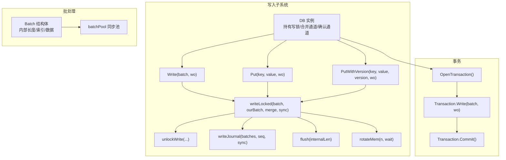
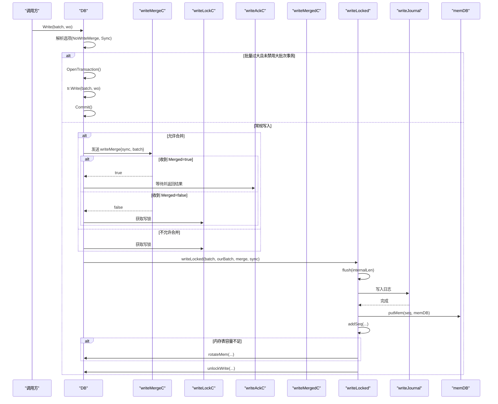
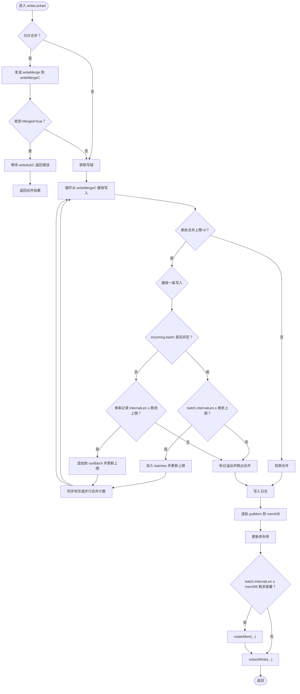
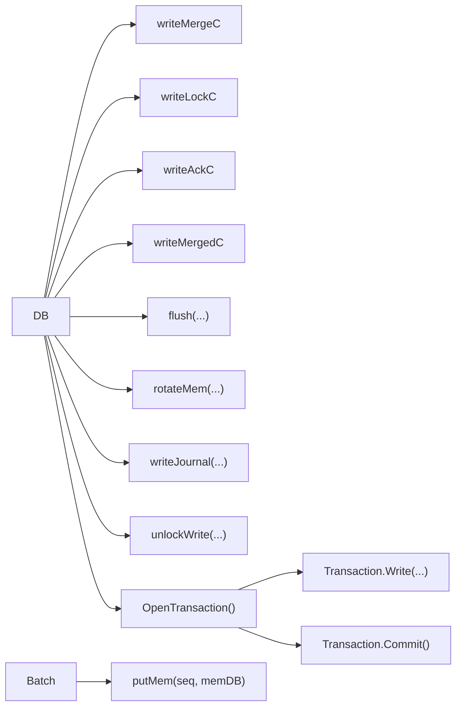

# 写入操作

<cite>
**本文引用的文件列表**
- [leveldb/db_write.go](file://leveldb/db_write.go)
- [leveldb/db.go](file://leveldb/db.go)
- [leveldb/batch.go](file://leveldb/batch.go)
- [leveldb/db_transaction.go](file://leveldb/db_transaction.go)
- [leveldb/opt/options.go](file://leveldb/opt/options.go)
- [leveldb/db_test.go](file://leveldb/db_test.go)
</cite>

## 目录
1. [简介](#简介)
2. [项目结构与入口](#项目结构与入口)
3. [核心组件与职责](#核心组件与职责)
4. [架构总览](#架构总览)
5. [详细组件分析](#详细组件分析)
6. [依赖关系分析](#依赖关系分析)
7. [性能考量](#性能考量)
8. [故障排查指南](#故障排查指南)
9. [结论](#结论)
10. [附录：使用示例与最佳实践](#附录使用示例与最佳实践)

## 简介
本章节面向 avccDB 的 Write 操作，提供系统化的 API 参考与实现解析。重点覆盖：
- Write 方法的函数签名、参数类型与语义
- 返回错误类型与常见错误场景
- 批量写入的原子性保证机制
- 写入合并（write merge）通过 channel 协调并发写入请求，提升吞吐量的机制
- 当批量大小超过写缓冲区阈值时，系统自动切换到事务模式直接写入 SSTable 的优化路径
- 如何构建 Batch 对象并执行批量写入
- writeLocked 函数的实现细节：获取写锁、写入日志、更新内存表、可能触发 memDB 轮转，以及错误处理与性能优化

## 项目结构与入口
Write 操作位于数据库核心模块中，涉及以下关键文件：
- 写入主流程与合并逻辑：leveldb/db_write.go
- 数据库实例字段与并发控制通道：leveldb/db.go
- 批处理数据结构与序列化：leveldb/batch.go
- 事务写入与提交：leveldb/db_transaction.go
- 写入选项与行为开关：leveldb/opt/options.go
- 测试用例与基准测试：leveldb/db_test.go

图表来源
- [leveldb/db_write.go](file://leveldb/db_write.go#L133-L330)
- [leveldb/db.go](file://leveldb/db.go#L67-L76)
- [leveldb/batch.go](file://leveldb/batch.go#L62-L160)
- [leveldb/db_transaction.go](file://leveldb/db_transaction.go#L284-L336)

章节来源
- [leveldb/db_write.go](file://leveldb/db_write.go#L133-L330)
- [leveldb/db.go](file://leveldb/db.go#L67-L76)
- [leveldb/batch.go](file://leveldb/batch.go#L62-L160)
- [leveldb/db_transaction.go](file://leveldb/db_transaction.go#L284-L336)

## 核心组件与职责
- DB 实例字段
  - 写锁通道 writeLockC：保证同一时刻只有一个写入者持有写锁
  - 合并通道 writeMergeC：用于收集可合并的小批量写入
  - 确认通道 writeAckC：向等待合并的写入者返回结果
  - 合并确认通道 writeMergedC：通知合并是否成功
  - batchPool：Batch 对象池，减少分配开销
- Batch 结构体
  - data：编码后的记录字节流
  - index：记录索引，便于回放与解码
  - internalLen：记录“内部长度”（键/值长度+固定开销），用于容量与合并限制判断
- WriteOptions
  - NoWriteMerge：禁用写入合并
  - Sync：是否同步落盘
- Transaction
  - 大批量写入的替代路径：绕过日志，直接写入 SSTable 并在提交时统一记录元数据

章节来源
- [leveldb/db.go](file://leveldb/db.go#L67-L76)
- [leveldb/batch.go](file://leveldb/batch.go#L62-L160)
- [leveldb/opt/options.go](file://leveldb/opt/options.go#L723-L760)
- [leveldb/db_transaction.go](file://leveldb/db_transaction.go#L284-L336)

## 架构总览
Write 操作的总体流程如下：
- 参数校验与选项解析
- 若批量过大且未禁用大批次事务，则开启事务并直接写入 SSTable，避免日志开销
- 否则进入常规写入路径：
  - 尝试获取写锁；若允许合并，先尝试将当前写入与队列中的其他写入合并
  - 合并完成后，写入日志并更新内存表
  - 若内存表容量不足，触发 memDB 轮转
  - 释放写锁或传递给下一个写入者

图表来源
- [leveldb/db_write.go](file://leveldb/db_write.go#L268-L330)
- [leveldb/db_write.go](file://leveldb/db_write.go#L154-L266)
- [leveldb/db_transaction.go](file://leveldb/db_transaction.go#L284-L336)

## 详细组件分析

### Write 方法 API 参考
- 函数签名
  - func (db *DB) Write(batch *Batch, wo *opt.WriteOptions) error
- 参数
  - batch: 批处理对象，包含多条 Put/Delete 记录
  - wo: 写入选项，决定是否启用写入合并与是否同步落盘
- 返回值
  - error：可能的错误包括但不限于数据库关闭、写入合并通道阻塞、日志写入失败、内存表写入失败、合并溢出等
- 行为要点
  - 若 batch 为空或数据库已关闭，立即返回错误
  - 若 batch.internalLen 超过写缓冲阈值且未禁用大批次事务，系统将自动切换到事务模式，直接写入 SSTable 并提交
  - 否则按常规路径执行：尝试合并、写入日志、更新内存表、必要时轮转 memDB，并释放写锁

章节来源
- [leveldb/db_write.go](file://leveldb/db_write.go#L268-L330)
- [leveldb/opt/options.go](file://leveldb/opt/options.go#L723-L760)

### 写入合并（write merge）机制
- 通道协调
  - writeMergeC：写入者尝试将自身写入与队列中的其他写入合并
  - writeMergedC：通知发起合并请求的写入者“是否成功合并”
  - writeAckC：向等待合并的写入者返回最终错误
- 合并策略
  - 计算合并上限：基于 batch.internalLen 与 memDB 剩余容量，动态调整合并上限
  - 批合并：当 incoming.batch 非空时，累加其 internalLen
  - 单条记录合并：当 incoming.batch 为空时，计算单条记录的 internalLen（含版本号开销）
  - 同步标志：合并过程中若任一写入要求同步，最终将采用同步写入
- 锁传递
  - 若合并溢出（超出剩余容量），将“溢出”标记为真，将写锁传递给下一个写入者，避免死锁

图表来源
- [leveldb/db_write.go](file://leveldb/db_write.go#L154-L266)

章节来源
- [leveldb/db_write.go](file://leveldb/db_write.go#L133-L153)
- [leveldb/db_write.go](file://leveldb/db_write.go#L154-L266)

### writeLocked 实现详解
- flush(internalLen)
  - 在写入前尝试刷新 memDB，避免写入过快导致压缩跟不上
  - 若达到暂停阈值，会阻塞写入直至压缩完成
- 日志写入
  - 使用 writeJournal 将合并后的 batches 与起始序列号写入日志
  - 若任一写入要求同步，最终将执行同步落盘
- 更新内存表
  - 逐批调用 batch.putMem，将记录转换为内部键并写入 memDB
  - 递增全局序列号
- memDB 轮转
  - 若当前 batch 的 internalLen 达到 memDB 剩余容量，触发 rotateMem 创建新 memDB 并调度压缩
- 错误处理与锁释放
  - 任何阶段出现错误，均通过 unlockWrite 通知等待的合并写入者并释放/传递写锁

章节来源
- [leveldb/db_write.go](file://leveldb/db_write.go#L154-L266)

### 大批量写入的事务模式
- 触发条件
  - batch.internalLen > Options.WriteBuffer 且未禁用大批次事务
- 行为
  - OpenTransaction 获取全局写锁并确保无并发事务
  - Transaction.Write 将记录直接写入内存表，不经过日志
  - Commit 将所有 SSTable 文件登记到 manifest 并触发压缩
- 优势
  - 避免日志写入与刷盘开销，适合大批量写入
  - 但会增加压缩压力，需谨慎使用

章节来源
- [leveldb/db_write.go](file://leveldb/db_write.go#L280-L293)
- [leveldb/db_transaction.go](file://leveldb/db_transaction.go#L284-L336)

### Batch 对象与构建
- Batch 字段
  - data：编码后的记录字节流
  - index：记录索引，包含键/值位置与类型
  - internalLen：内部长度，用于容量与合并限制判断
- 构建方式
  - 直接构造：new(Batch) 或 MakeBatch(n)
  - 配置构造：MakeBatchWithConfig(config)
  - 追加记录：Put/PutWithVersion/Delete
  - 回放：Replay/BatchReplay
- 内部长度计算
  - 每条记录的 internalLen 包含键/值长度与固定开销；带版本号时额外增加版本字段开销

章节来源
- [leveldb/batch.go](file://leveldb/batch.go#L62-L160)
- [leveldb/batch.go](file://leveldb/batch.go#L138-L155)
- [leveldb/batch.go](file://leveldb/batch.go#L244-L257)
- [leveldb/batch.go](file://leveldb/batch.go#L263-L302)

### 错误类型与返回
- 常见错误
  - 数据库关闭：ErrClosed
  - 合并溢出：通过 unlockWrite 传播
  - 日志写入失败：writeJournal 返回错误
  - 内存表写入失败：batch.putMem 返回错误
  - 事务提交失败：Transaction.Commit 返回错误
- 错误传播
  - writeLocked 中任一阶段失败，都会通过 unlockWrite 通知等待的合并写入者并返回错误
  - 事务模式下，OpenTransaction/Commit/Write 的错误由对应方法返回

章节来源
- [leveldb/db_write.go](file://leveldb/db_write.go#L141-L152)
- [leveldb/db_write.go](file://leveldb/db_write.go#L240-L243)
- [leveldb/db_transaction.go](file://leveldb/db_transaction.go#L194-L252)

## 依赖关系分析
- 组件耦合
  - DB 与 writeMergeC/writeLockC/writeAckC/writeMergedC 紧密耦合，共同保障写入的有序与并发安全
  - writeLocked 依赖 flush/rotateMem/writeJournal/batch.putMem/unlockWrite
  - Batch 与 memDB 的交互通过 putMem 完成
  - 事务模式与 DB 的全局写锁存在竞争关系
- 外部依赖
  - journal.Writer：负责日志写入
  - memdb.DB：内存表写入
  - Options：写缓冲阈值、是否禁用大批次事务、是否禁用写入合并、是否强制同步等

图表来源
- [leveldb/db_write.go](file://leveldb/db_write.go#L154-L266)
- [leveldb/db.go](file://leveldb/db.go#L67-L76)
- [leveldb/batch.go](file://leveldb/batch.go#L244-L257)
- [leveldb/db_transaction.go](file://leveldb/db_transaction.go#L284-L336)

章节来源
- [leveldb/db_write.go](file://leveldb/db_write.go#L154-L266)
- [leveldb/db.go](file://leveldb/db.go#L67-L76)
- [leveldb/batch.go](file://leveldb/batch.go#L244-L257)
- [leveldb/db_transaction.go](file://leveldb/db_transaction.go#L284-L336)

## 性能考量
- 写入合并
  - 合并上限随 batch.internalLen 与 memDB 剩余容量动态调整，避免过度合并导致内存膨胀
  - 合并过程中仅做长度检查，不复制数据，降低 CPU 与内存压力
- 日志与同步
  - 合并后一次性写入日志，减少系统调用次数
  - 任一写入要求同步时，整体采用同步写入，确保可靠性但牺牲吞吐
- 大批量事务
  - 跳过日志路径，适合大批量写入；但会显著增加压缩压力，建议在低频写入场景使用
- 内存表轮转
  - 当 batch.internalLen ≥ memDB 剩余容量时触发轮转，避免 memDB 过载
- 缓冲与池化
  - batchPool 重用 Batch 对象，减少 GC 压力
  - Batch.grow 采用分段扩容策略，避免频繁大块分配

章节来源
- [leveldb/db_write.go](file://leveldb/db_write.go#L154-L266)
- [leveldb/batch.go](file://leveldb/batch.go#L77-L92)
- [leveldb/db_transaction.go](file://leveldb/db_transaction.go#L284-L336)

## 故障排查指南
- 常见问题
  - 写入阻塞：检查 writeMergeC/writeLockC 是否被占用；确认是否存在大量小批量写入导致合并失败
  - 合并溢出：当 batch.internalLen 超过剩余容量时，writeLocked 会标记溢出并传递写锁
  - 日志写入失败：检查 journal.Writer 的可用性与磁盘空间
  - 内存表写入失败：检查 memDB 的容量与键/值大小
  - 事务提交失败：查看 Transaction.Commit 的错误并重试或丢弃
- 排查步骤
  - 确认 Options.WriteBuffer 与 Options.DisableLargeBatchTransaction 设置
  - 检查 WriteOptions.NoWriteMerge 与 Sync 设置
  - 关注 writeDelay 与 writeDelayN 统计，评估写入节流影响
  - 在高并发场景下，适当增大 WriteBuffer 或启用事务模式

章节来源
- [leveldb/db_write.go](file://leveldb/db_write.go#L154-L266)
- [leveldb/db_transaction.go](file://leveldb/db_transaction.go#L194-L252)
- [leveldb/db.go](file://leveldb/db.go#L33-L48)

## 结论
avccDB 的 Write 操作通过“写入合并 + 日志 + 内存表”的组合，在保证原子性的同时最大化吞吐。对于超大规模写入，系统提供事务模式以规避日志开销。writeLocked 作为核心实现，严格遵循“先合并/再日志/后内存表”的顺序，并在容量不足时进行 memDB 轮转。合理配置 WriteOptions 与 Options，可在可靠性与性能之间取得平衡。

## 附录：使用示例与最佳实践
- 构建 Batch 并执行批量写入
  - 使用 MakeBatch 或 MakeBatchWithConfig 预分配容量
  - 通过 Put/PutWithVersion/Delete 追加记录
  - 调用 DB.Write(batch, wo) 提交
- 并发写入
  - 默认启用写入合并，适合小批量并发写入
  - 若写入量巨大且持续，考虑禁用写入合并或使用事务模式
- 版本化写入
  - 使用 PutWithVersion 为键指定版本号，支持多版本共存
- 最佳实践
  - 控制单次 Batch 的 internalLen，避免接近或超过 WriteBuffer
  - 在高吞吐场景下，优先使用批量写入而非单条 Put
  - 对于超大批量写入，使用事务模式并在低峰期执行
  - 合理设置 Sync，平衡可靠性与性能

章节来源
- [leveldb/batch.go](file://leveldb/batch.go#L138-L155)
- [leveldb/batch.go](file://leveldb/batch.go#L263-L302)
- [leveldb/db_write.go](file://leveldb/db_write.go#L268-L330)
- [leveldb/db_test.go](file://leveldb/db_test.go#L2239-L2295)
- [leveldb/bench_test.go](file://leveldb/bench_test.go#L141-L171)