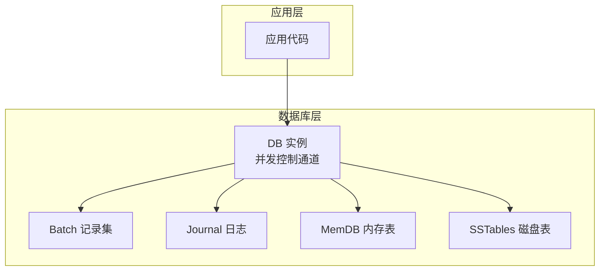
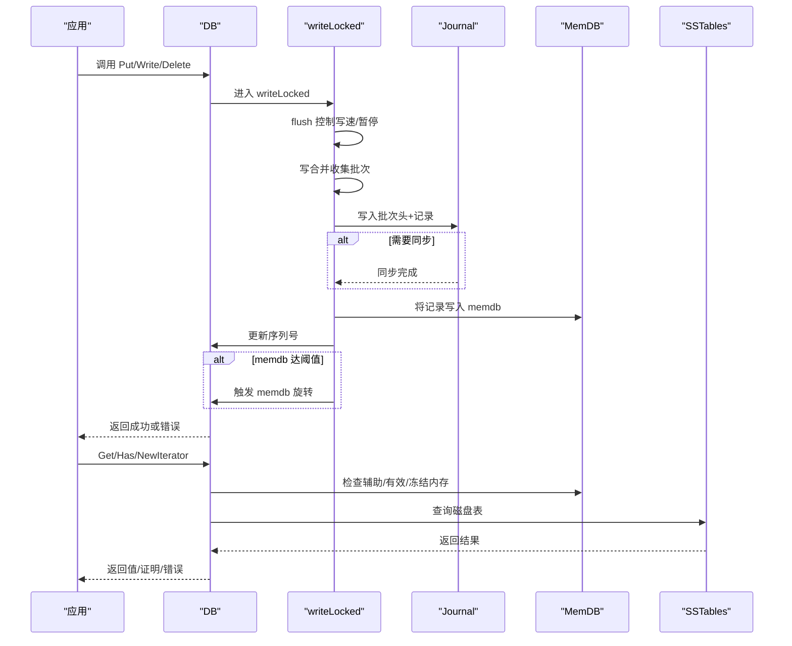
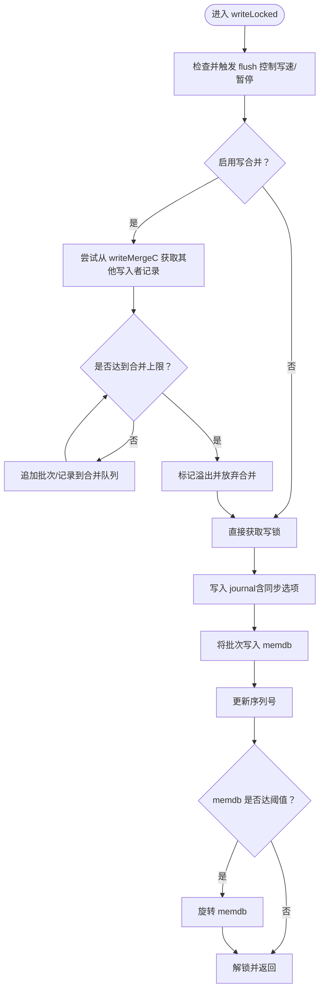
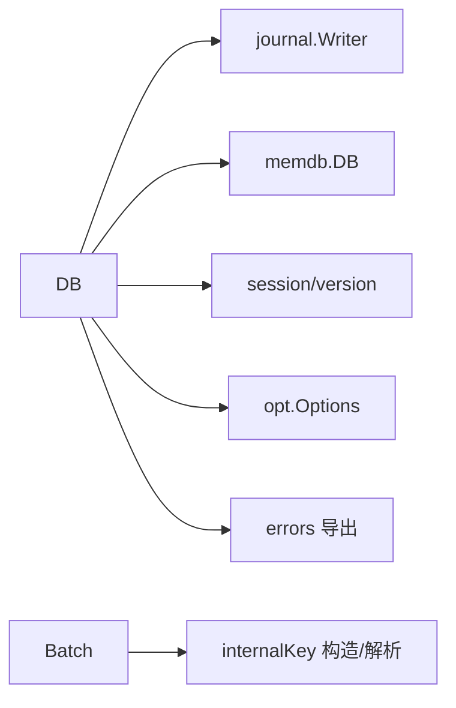

# 标准读写操作

<cite>
**本文引用的文件**
- [leveldb/db.go](file://leveldb/db.go)
- [leveldb/db_write.go](file://leveldb/db_write.go)
- [leveldb/batch.go](file://leveldb/batch.go)
- [leveldb/errors.go](file://leveldb/errors.go)
- [leveldb/key.go](file://leveldb/key.go)
- [leveldb/options.go](file://leveldb/options.go)
</cite>

## 目录
1. [简介](#简介)
2. [项目结构](#项目结构)
3. [核心组件](#核心组件)
4. [架构总览](#架构总览)
5. [详细组件分析](#详细组件分析)
6. [依赖关系分析](#依赖关系分析)
7. [性能考量](#性能考量)
8. [故障排查指南](#故障排查指南)
9. [结论](#结论)

## 简介
本文件面向 avccDB 的标准读写操作，系统化梳理 Put、Get、Delete、Write 等核心方法的参数与行为、返回值与错误类型，并解释这些操作如何通过 Write 方法实现底层写入，以及线程安全与并发控制机制。同时给出批量写入 Write 的使用模式、原子性与写合并（write merge）机制说明，并提供错误处理最佳实践与常见问题解决方案。

## 项目结构
- 数据库核心在 leveldb 包中，DB 结构体承载了数据库实例的状态与并发控制通道。
- 写入路径由 Write 聚合多条记录，先写入日志（journal），再写入内存表（memdb），并在合适时机触发旋转或刷新。
- 读取路径通过快照（snapshot）隔离可见性，按顺序查询辅助内存、有效/冻结内存与磁盘表（table）。
- 批量写入 Batch 提供高效的记录编码与解码，支持版本化键（versioned key）。

图表来源
- [leveldb/db.go](file://leveldb/db.go#L33-L98)
- [leveldb/db_write.go](file://leveldb/db_write.go#L18-L33)
- [leveldb/batch.go](file://leveldb/batch.go#L63-L100)

章节来源
- [leveldb/db.go](file://leveldb/db.go#L33-L98)
- [leveldb/db_write.go](file://leveldb/db_write.go#L18-L33)
- [leveldb/batch.go](file://leveldb/batch.go#L63-L100)

## 核心组件
- DB：数据库实例，维护序列号、写入通道、内存表、快照链表、合并写入通道、写延迟统计等。
- Batch：写入批次，支持 Put/Delete 操作记录，内部编码为二进制格式，支持版本化键。
- 键类型与内部键：keyType 定义删除/值两类；内部键包含用户键、版本号、序列号与类型字段，用于排序与去重。
- 错误集合：统一导出 ErrNotFound、ErrReadOnly、ErrSnapshotReleased、ErrIterReleased、ErrClosed 等。

章节来源
- [leveldb/db.go](file://leveldb/db.go#L33-L98)
- [leveldb/batch.go](file://leveldb/batch.go#L63-L100)
- [leveldb/key.go](file://leveldb/key.go#L31-L66)
- [leveldb/errors.go](file://leveldb/errors.go#L14-L21)

## 架构总览
写入流程概览：
- 应用调用 Put/Write/Delete，最终进入 writeLocked。
- writeLocked 先尝试 flush 控制写速与暂停，随后进行写合并（write merge）收集待写入批次。
- 将批次写入 journal 并同步（可选），然后将记录写入 memdb，更新序列号，必要时触发 memdb 旋转。
- 读取流程通过快照隔离可见性，依次检查辅助内存、有效/冻结内存与磁盘表。

图表来源
- [leveldb/db_write.go](file://leveldb/db_write.go#L155-L266)
- [leveldb/db_write.go](file://leveldb/db_write.go#L268-L330)
- [leveldb/db_write.go](file://leveldb/db_write.go#L332-L438)
- [leveldb/db.go](file://leveldb/db.go#L1092-L1147)

## 详细组件分析

### Put 方法
- 功能：设置指定键的值，覆盖旧值；支持写合并。
- 参数
  - key：[]byte，用户键
  - value：[]byte，用户值
  - wo：*opt.WriteOptions，写入选项
- 返回值：error
- 默认行为与选项
  - 若 wo.GetNoWriteMerge() 为 false 且全局 NoWriteMerge 未开启，则启用写合并。
  - 若 wo.GetSync() 为 true 且全局 NoSync 未开启，则写入后同步到存储。
- 错误类型
  - ErrClosed：数据库已关闭
  - ErrReadOnly：数据库只读模式
  - 其他写入相关错误（如存储层错误）
- 使用要点
  - 修改参数后可安全释放；返回前不修改参数内容。
  - 大小写敏感，重复 Put 会覆盖旧值。
- 可能抛出的错误
  - 数据库关闭：ErrClosed
  - 只读模式：ErrReadOnly
  - 并发写入被暂停：写入延迟或等待恢复
- 线程安全性
  - 通过 writeLockC 串行化写入；写合并通道 writeMergeC 支持多写入者竞争获取锁。
- 原子性
  - 单次 Put 在 writeLocked 中以批内顺序写入，journal 与 memdb 作为一个整体提交。
- 版本化键
  - 若需版本化写入，请使用 PutWithVersion。

章节来源
- [leveldb/db_write.go](file://leveldb/db_write.go#L377-L386)
- [leveldb/db_write.go](file://leveldb/db_write.go#L332-L375)

### PutWithVersion 方法
- 功能：带版本号的 Put，允许同一用户键存在多个版本，按版本降序排列。
- 参数
  - key：[]byte，用户键
  - value：[]byte，用户值
  - version：uint64，版本号（通常用于区块高度）
  - wo：*opt.WriteOptions，写入选项
- 返回值：error
- 行为说明
  - 内部构造带版本的内部键，写入流程与 Put 类似。
  - 版本号为 0 时等价于最新版本查询。
- 错误类型
  - 同 Put
- 使用要点
  - 版本号越大越新；可用于区块链场景的版本溯源。
- 线程安全性
  - 同 Put
- 原子性
  - 同 Put

章节来源
- [leveldb/db_write.go](file://leveldb/db_write.go#L387-L438)
- [leveldb/key.go](file://leveldb/key.go#L90-L104)

### Delete 方法
- 功能：删除指定键；若键不存在不报错。
- 参数
  - key：[]byte，用户键
  - wo：*opt.WriteOptions，写入选项
- 返回值：error
- 行为说明
  - 内部以 keyTypeDel 形式写入，相当于 Put(key, nil)。
- 错误类型
  - 同 Put
- 线程安全性
  - 同 Put
- 原子性
  - 同 Put

章节来源
- [leveldb/db_write.go](file://leveldb/db_write.go#L440-L447)
- [leveldb/db_write.go](file://leveldb/db_write.go#L332-L375)

### Write 方法（批量写入）
- 功能：将 Batch 中的多条记录一次性写入数据库，支持写合并与大批次优化。
- 参数
  - batch：*Batch，待写入的记录集合
  - wo：*opt.WriteOptions，写入选项
- 返回值：error
- 写合并（write merge）机制
  - 当启用合并且 batch 小于 memdb 剩余容量时，写入者可将自身记录与其他写入者合并，减少 journal 写入次数。
  - 合并上限受剩余容量与阈值限制，溢出则放弃合并并获取写锁。
- 大批次优化
  - 当 batch.internalLen 超过写缓冲阈值且未禁用大批次事务时，自动转为使用事务直接写入表，跳过 journal。
- 错误类型
  - ErrClosed：数据库已关闭
  - ErrReadOnly：数据库只读模式
  - 存储层错误
- 使用模式
  - 优先使用 Batch 累积多条 Put/Delete，最后一次性 Write。
  - 对于超大批量，考虑使用事务（OpenTransaction + Write + Commit）以绕过 journal。
- 原子性
  - 单次 Write 作为原子单元提交；journal 与 memdb 的提交在 writeLocked 中完成。
- 线程安全性
  - 通过 writeLockC 或 writeMergeC 串行化；写合并通道允许多写入者竞争。
- 性能建议
  - 合理设置 WriteOptions.NoWriteMerge 与全局 NoWriteMerge，平衡吞吐与延迟。
  - 大批次建议使用事务路径以降低 journal 开销。

章节来源
- [leveldb/db_write.go](file://leveldb/db_write.go#L268-L330)
- [leveldb/db_write.go](file://leveldb/db_write.go#L133-L266)
- [leveldb/batch.go](file://leveldb/batch.go#L63-L100)

### Get 与 GetWithVersion
- Get
  - 功能：获取指定键的最新版本值
  - 参数：key []byte，ro *opt.ReadOptions
  - 返回：value []byte（返回副本）、error
  - 行为：通过快照隔离可见性，按辅助内存→有效/冻结内存→磁盘表顺序查找
- GetWithVersion
  - 功能：获取指定键在指定版本的值；version=0 表示最新版本
  - 参数：key []byte，version uint64，ro *opt.ReadOptions
  - 返回：value []byte、error
- 错误类型
  - ErrNotFound：键不存在
  - ErrClosed：数据库已关闭
  - 其他读取错误
- 线程安全性
  - 读取通过快照隔离，不阻塞写入；NewIterator 与快照并发安全。
- 使用要点
  - 返回值为独立副本，可安全修改。
  - 版本化键查询时，内部键包含版本字段，按版本降序比较。

章节来源
- [leveldb/db.go](file://leveldb/db.go#L1092-L1147)
- [leveldb/db.go](file://leveldb/db.go#L1148-L1184)
- [leveldb/key.go](file://leveldb/key.go#L90-L132)

### Has 与 NewIterator
- Has：判断键是否存在（忽略值）
- NewIterator：基于最新快照返回迭代器，支持范围切片
- 行为与错误
  - 迭代器释放后不可再使用；快照释放后对应读取失效
  - 迭代器与数据库并发使用时保证一致性

章节来源
- [leveldb/db.go](file://leveldb/db.go#L1186-L1244)

### 内部键与版本化键
- 内部键结构
  - 非版本化：用户键 + 8 字节序列号+类型
  - 版本化：用户键 + 8 字节版本 + 8 字节序列号+类型
- 解析与构造
  - makeInternalKey / makeInternalKeyWithVersion
  - parseInternalKey / parseInternalKeyWithVersion
- 排序规则
  - 按用户键排序，版本化键中版本优先级更高（降序）

章节来源
- [leveldb/key.go](file://leveldb/key.go#L75-L132)
- [leveldb/key.go](file://leveldb/key.go#L139-L171)

### 写合并（write merge）流程

图表来源
- [leveldb/db_write.go](file://leveldb/db_write.go#L155-L266)

## 依赖关系分析
- DB 依赖
  - journal.Writer：写入日志
  - memdb.DB：内存表
  - session/version：管理 SSTables 与版本信息
  - opt.Options：配置缓存与压缩策略
- Batch 依赖
  - 编解码：encode/decodeBatchHeader、decodeBatch
  - 内部键构造：makeInternalKey / makeInternalKeyWithVersion
- 错误类型
  - 统一导出 ErrNotFound、ErrReadOnly、ErrSnapshotReleased、ErrIterReleased、ErrClosed

图表来源
- [leveldb/db.go](file://leveldb/db.go#L33-L98)
- [leveldb/db_write.go](file://leveldb/db_write.go#L18-L33)
- [leveldb/batch.go](file://leveldb/batch.go#L304-L413)
- [leveldb/key.go](file://leveldb/key.go#L75-L132)
- [leveldb/errors.go](file://leveldb/errors.go#L14-L21)

章节来源
- [leveldb/db.go](file://leveldb/db.go#L33-L98)
- [leveldb/db_write.go](file://leveldb/db_write.go#L18-L33)
- [leveldb/batch.go](file://leveldb/batch.go#L304-L413)
- [leveldb/key.go](file://leveldb/key.go#L75-L132)
- [leveldb/errors.go](file://leveldb/errors.go#L14-L21)

## 性能考量
- 写合并
  - 合并可显著减少 journal 写入次数，提高吞吐；但需权衡内存占用与延迟。
  - 合并上限由剩余容量与阈值共同决定，溢出则回退到串行写锁。
- flush 与写暂停
  - 当 L0 表数量超过阈值时，写入会被延时或暂停，直到压缩完成。
  - 写暂停期间会设置标志位，写入方感知后等待恢复。
- 大批次优化
  - 超过写缓冲阈值的批量写入会自动走事务路径，跳过 journal，降低开销。
- 读取性能
  - 快照隔离避免读写互斥；迭代器与数据库并发使用时保持一致性。
- 版本化键
  - 版本化键在内存与磁盘层均支持，适合需要溯源的场景。

章节来源
- [leveldb/db_write.go](file://leveldb/db_write.go#L66-L131)
- [leveldb/db_write.go](file://leveldb/db_write.go#L268-L330)
- [leveldb/db.go](file://leveldb/db.go#L1092-L1147)

## 故障排查指南
- 数据库已关闭（ErrClosed）
  - 现象：调用 Put/Get/Write 等方法返回 ErrClosed
  - 处理：确保在 DB 关闭前释放所有快照与迭代器；避免重复关闭
  - 参考：关闭流程中会广播关闭信号并等待协程退出
- 只读模式（ErrReadOnly）
  - 现象：SetReadOnly 后仍可读，但无法写入
  - 处理：在只读模式下仅执行读取操作；如需写入需重新打开
- 写入冲突与写暂停
  - 现象：写入被延时或暂停，写延迟计数增加
  - 处理：等待压缩完成或调整压缩阈值；合理设置 WriteOptions.NoWriteMerge
- 键不存在（ErrNotFound）
  - 现象：Get/Has 返回 ErrNotFound
  - 处理：确认键是否正确；版本化查询时注意版本号
- 版本化键解析错误
  - 现象：内部键长度不足或类型非法
  - 处理：检查内部键构造与解析逻辑；确保版本字段正确

章节来源
- [leveldb/db_write.go](file://leveldb/db_write.go#L66-L131)
- [leveldb/db_write.go](file://leveldb/db_write.go#L332-L438)
- [leveldb/db.go](file://leveldb/db.go#L1599-L1643)
- [leveldb/errors.go](file://leveldb/errors.go#L14-L21)

## 结论
- Put/Get/Delete/Write 提供了完整的标准读写能力，其中 Write 是底层写入的核心入口，支持写合并与大批次优化。
- 线程安全通过写锁与写合并通道保障；读取通过快照隔离实现高并发一致性。
- 版本化键为区块链等场景提供多版本数据管理能力；GetWithVersion/GetVersionHistory 支持溯源查询。
- 正确处理 ErrClosed、ErrReadOnly、ErrNotFound 等常见错误，结合写暂停与写合并策略，可获得稳定且高性能的数据库体验。