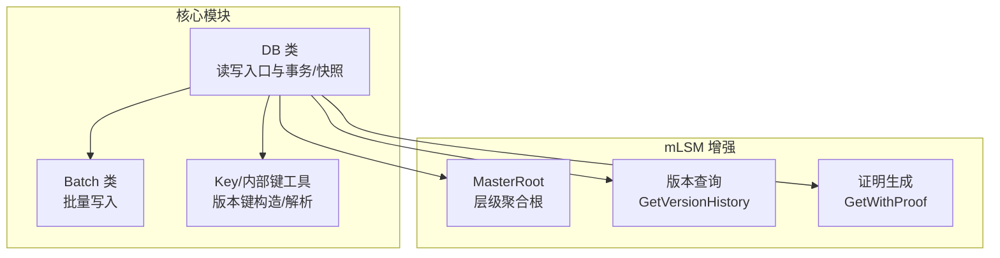
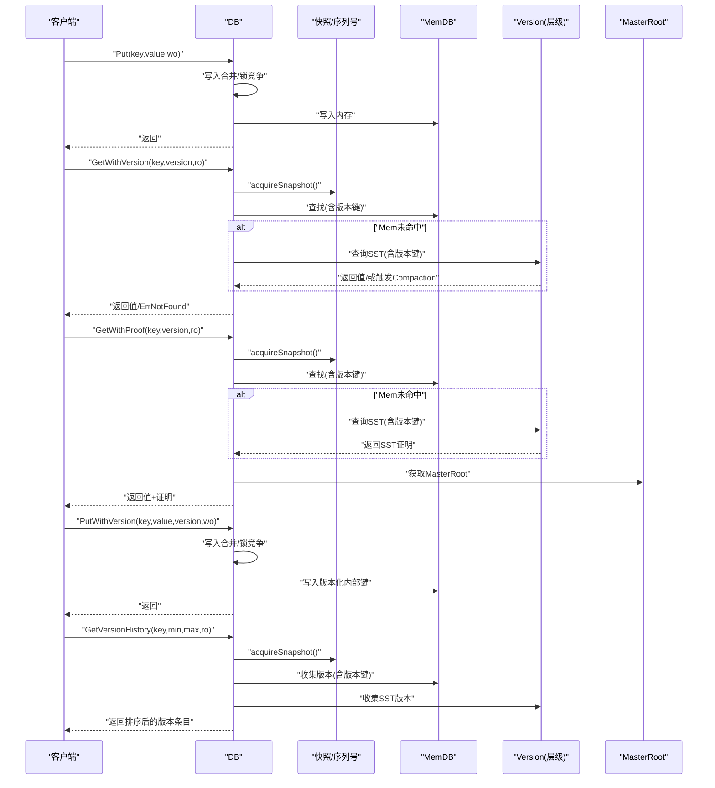
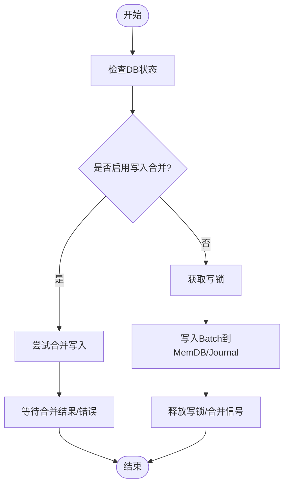
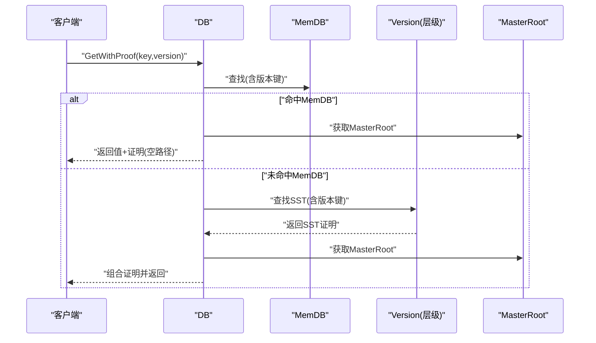
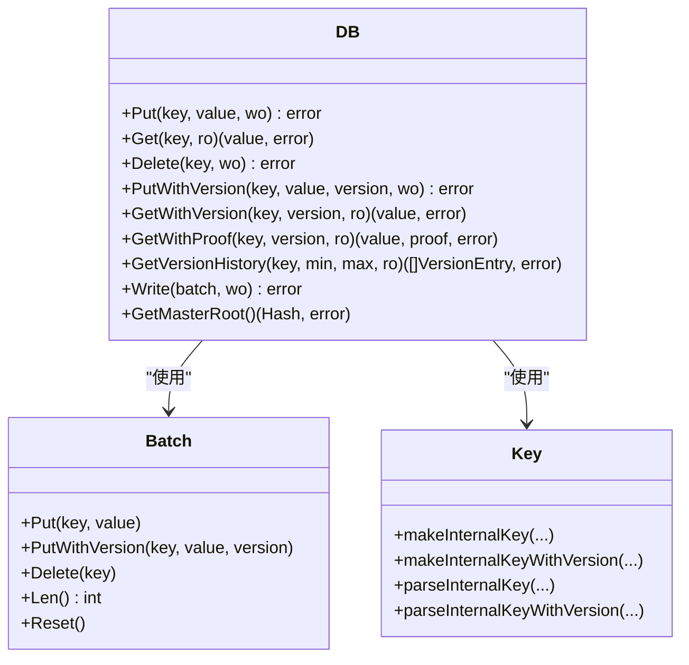

# 读写操作

<cite>
**本文引用的文件列表**
- [leveldb/db.go](file://leveldb/db.go)
- [leveldb/db_write.go](file://leveldb/db_write.go)
- [leveldb/batch.go](file://leveldb/batch.go)
- [leveldb/key.go](file://leveldb/key.go)
- [leveldb/mlsm_final_comprehensive_test.go](file://leveldb/mlsm_final_comprehensive_test.go)
- [leveldb/mlsm_version_history_test.go](file://leveldb/mlsm_version_history_test.go)
- [leveldb/errors.go](file://leveldb/errors.go)
- [leveldb/options.go](file://leveldb/options.go)
</cite>

## 目录
1. [简介](#简介)
2. [项目结构](#项目结构)
3. [核心组件](#核心组件)
4. [架构总览](#架构总览)
5. [详细组件分析](#详细组件分析)
6. [依赖关系分析](#依赖关系分析)
7. [性能考量](#性能考量)
8. [故障排查指南](#故障排查指南)
9. [结论](#结论)

## 简介
本章节面向 avccDB 的读写 API，系统性梳理 Put、Get、Delete、GetWithProof 与 PutWithVersion 等核心方法。重点解释 mLSM 架构下的增强能力：版本控制（PutWithVersion、GetWithVersion、GetVersionHistory）、数据完整性验证（GetWithProof、MasterRoot 聚合根）、以及批量写入（Write）的合并与原子性保障。同时给出线程安全性说明、错误类型与最佳实践，并通过序列图与流程图帮助理解调用链路与内部实现。

## 项目结构
- 读写入口集中在 DB 类型的方法族，包括：
  - 写入：Put、PutWithVersion、Delete、Write
  - 读取：Get、GetWithVersion、GetWithProof、GetVersionHistory、Has、NewIterator
  - 元数据与证明：GetMasterRoot、GetProperty、Stats
- 版本与内部键格式由 key.go 提供，Batch 用于批量写入与合并。
- mLSM 增强能力由 db.go 中的 get/getWithProof/versionHistory/updateMasterRoot/computeMasterRoot 等方法实现。

图表来源
- [leveldb/db.go](file://leveldb/db.go#L1092-L1184)
- [leveldb/db_write.go](file://leveldb/db_write.go#L268-L438)
- [leveldb/batch.go](file://leveldb/batch.go#L138-L156)
- [leveldb/key.go](file://leveldb/key.go#L75-L147)
- [leveldb/db.go](file://leveldb/db.go#L1479-L1571)

章节来源
- [leveldb/db.go](file://leveldb/db.go#L1092-L1184)
- [leveldb/db_write.go](file://leveldb/db_write.go#L268-L438)
- [leveldb/batch.go](file://leveldb/batch.go#L138-L156)
- [leveldb/key.go](file://leveldb/key.go#L75-L147)

## 核心组件
- DB：数据库实例，提供读写、快照、迭代、属性查询、统计等能力；支持并发安全。
- Batch：写入批处理，支持合并写入、版本化记录、内存池复用。
- Key 工具：内部键构造/解析，支持带版本号的键格式。
- mLSM 增强：
  - MasterRoot：按层级聚合 Merkle 根，用于证明校验。
  - GetWithProof：返回值与 Merkle 证明，结合 MasterRoot 验证。
  - GetVersionHistory：按版本范围查询历史版本条目。
  - PutWithVersion：写入指定版本，支持多版本共存与排序。

章节来源
- [leveldb/db.go](file://leveldb/db.go#L1092-L1184)
- [leveldb/db_write.go](file://leveldb/db_write.go#L268-L438)
- [leveldb/batch.go](file://leveldb/batch.go#L138-L156)
- [leveldb/key.go](file://leveldb/key.go#L75-L147)

## 架构总览
下图展示了读写路径与 mLSM 增强的关键交互：

图表来源
- [leveldb/db.go](file://leveldb/db.go#L1092-L1184)
- [leveldb/db.go](file://leveldb/db.go#L835-L932)
- [leveldb/db.go](file://leveldb/db.go#L1479-L1571)
- [leveldb/db_write.go](file://leveldb/db_write.go#L268-L438)

## 详细组件分析

### Put 方法
- 函数签名路径：[leveldb/db_write.go](file://leveldb/db_write.go#L377-L385)
- 功能：设置给定键的值，覆盖旧值；支持写入合并与同步选项。
- 参数
  - key：字节切片，用户键
  - value：字节切片，用户值
  - wo：写入选项，支持 NoWriteMerge、Sync 等
- 返回：错误（ErrClosed、ErrReadOnly、ErrNotFound 等）
- 并发与原子性：通过写锁与合并队列保证；小批量写入可合并，提升吞吐。
- 默认行为：若未显式禁用，启用写入合并；若启用同步，则落盘同步。
- 使用示例路径：[leveldb/mlsm_final_comprehensive_test.go](file://leveldb/mlsm_final_comprehensive_test.go#L77-L80)

章节来源
- [leveldb/db_write.go](file://leveldb/db_write.go#L268-L385)
- [leveldb/mlsm_final_comprehensive_test.go](file://leveldb/mlsm_final_comprehensive_test.go#L77-L80)

### Get 方法
- 函数签名路径：[leveldb/db.go](file://leveldb/db.go#L1092-L1107)
- 功能：获取给定键的最新版本值；若不存在返回 ErrNotFound。
- 参数
  - key：字节切片，用户键
  - ro：读取选项
- 返回：value、err
- 并发与快照：内部使用快照 seq，确保读取一致性。
- 使用示例路径：[leveldb/mlsm_final_comprehensive_test.go](file://leveldb/mlsm_final_comprehensive_test.go#L127-L139)

章节来源
- [leveldb/db.go](file://leveldb/db.go#L1092-L1107)
- [leveldb/mlsm_final_comprehensive_test.go](file://leveldb/mlsm_final_comprehensive_test.go#L127-L139)

### Delete 方法
- 函数签名路径：[leveldb/db_write.go](file://leveldb/db_write.go#L440-L447)
- 功能：删除给定键；若键不存在不报错；在 mLSM 设计中通常写入墓碑（Tombstone）而非物理删除，历史版本仍可通过 GetWithVersion 查询。
- 参数
  - key：字节切片，用户键
  - wo：写入选项
- 返回：错误
- 使用示例路径：[leveldb/mlsm_final_comprehensive_test.go](file://leveldb/mlsm_final_comprehensive_test.go#L373-L379)

章节来源
- [leveldb/db_write.go](file://leveldb/db_write.go#L440-L447)
- [leveldb/mlsm_final_comprehensive_test.go](file://leveldb/mlsm_final_comprehensive_test.go#L373-L379)

### PutWithVersion 方法
- 函数签名路径：[leveldb/db_write.go](file://leveldb/db_write.go#L387-L438)
- 功能：以指定版本写入键值；版本号通常代表区块高度等；同一键可保留多版本，按版本降序排列。
- 参数
  - key：字节切片，用户键
  - value：字节切片，用户值
  - version：版本号（uint64），0 表示最新版本语义
  - wo：写入选项
- 返回：错误
- 版本控制要点
  - 内部键格式包含版本字段，解析与构造见 [leveldb/key.go](file://leveldb/key.go#L90-L147)。
  - 写入时将记录编码为带版本的内部键，写入 MemDB/Journal。
- 使用示例路径：[leveldb/mlsm_final_comprehensive_test.go](file://leveldb/mlsm_final_comprehensive_test.go#L77-L80)

图表来源
- [leveldb/db_write.go](file://leveldb/db_write.go#L387-L438)
- [leveldb/db_write.go](file://leveldb/db_write.go#L133-L266)

章节来源
- [leveldb/db_write.go](file://leveldb/db_write.go#L387-L438)
- [leveldb/key.go](file://leveldb/key.go#L90-L147)

### GetWithVersion 方法
- 函数签名路径：[leveldb/db.go](file://leveldb/db.go#L1109-L1125)
- 功能：按指定版本获取键值；version=0 表示最新版本。
- 参数
  - key：字节切片，用户键
  - version：版本号（uint64）
  - ro：读取选项
- 返回：value、err
- 查找顺序：辅助 MemDB → 有效/冻结 MemDB → Version 层（SST）；必要时触发表级 Compaction。
- 使用示例路径：[leveldb/mlsm_final_comprehensive_test.go](file://leveldb/mlsm_final_comprehensive_test.go#L111-L119)

章节来源
- [leveldb/db.go](file://leveldb/db.go#L1109-L1125)
- [leveldb/mlsm_final_comprehensive_test.go](file://leveldb/mlsm_final_comprehensive_test.go#L111-L119)

### GetWithProof 方法
- 函数签名路径：[leveldb/db.go](file://leveldb/db.go#L1127-L1146)
- 功能：返回值与 Merkle 证明；可用于无需信任数据库的完整性验证。
- 参数
  - key：字节切片，用户键
  - version：版本号（uint64），0 表示最新版本
  - ro：读取选项
- 返回：value、proof、err
- 证明生成逻辑
  - 若命中 MemDB：直接以 MasterRoot 构造简单证明（路径为空）。
  - 若命中 SST：从 Version 层获取 SST 层证明，再与 MasterRoot 组合增强证明。
  - MasterRoot 由 updateMasterRoot/computeMasterRoot 计算并缓存。
- 使用示例路径：[leveldb/mlsm_final_comprehensive_test.go](file://leveldb/mlsm_final_comprehensive_test.go#L248-L315)

图表来源
- [leveldb/db.go](file://leveldb/db.go#L1127-L1146)
- [leveldb/db.go](file://leveldb/db.go#L835-L932)
- [leveldb/db.go](file://leveldb/db.go#L1479-L1571)

章节来源
- [leveldb/db.go](file://leveldb/db.go#L1127-L1146)
- [leveldb/db.go](file://leveldb/db.go#L835-L932)
- [leveldb/db.go](file://leveldb/db.go#L1479-L1571)

### GetVersionHistory 方法
- 函数签名路径：[leveldb/db.go](file://leveldb/db.go#L1155-L1184)
- 功能：按版本范围查询键的历史版本条目，返回排序后的 VersionEntry 列表。
- 参数
  - key：字节切片，用户键
  - minVersion：最小版本（含），0 表示无下界
  - maxVersion：最大版本（含），0 表示无上界
  - ro：读取选项
- 返回：[]VersionEntry、err
- 实现要点
  - 从辅助 MemDB、有效/冻结 MemDB 收集版本（忽略已删除项）。
  - 从 Version 层（SST）收集版本并去重合并。
  - 按版本升序排序返回。
- 使用示例路径：[leveldb/mlsm_version_history_test.go](file://leveldb/mlsm_version_history_test.go#L52-L109)

章节来源
- [leveldb/db.go](file://leveldb/db.go#L1155-L1184)
- [leveldb/mlsm_version_history_test.go](file://leveldb/mlsm_version_history_test.go#L52-L109)

### Write 方法（批量写入）
- 函数签名路径：[leveldb/db_write.go](file://leveldb/db_write.go#L268-L330)
- 功能：应用批处理记录；支持写入合并；大批次可自动转为事务写入以跳过 Journal。
- 参数
  - batch：Batch 对象，包含多条 Put/Delete 记录
  - wo：写入选项（NoWriteMerge、Sync）
- 返回：错误
- 原子性与合并
  - 小批量写入可合并，减少 Journal 写入次数。
  - 大批量写入（超过写缓冲阈值）自动开启事务，直接写入表文件，避免 Journal。
  - 写入顺序由序列号递增保证。
- 使用示例路径：[leveldb/mlsm_final_comprehensive_test.go](file://leveldb/mlsm_final_comprehensive_test.go#L77-L80)

章节来源
- [leveldb/db_write.go](file://leveldb/db_write.go#L268-L330)
- [leveldb/mlsm_final_comprehensive_test.go](file://leveldb/mlsm_final_comprehensive_test.go#L77-L80)

### 版本键格式与内部键
- 内部键构造
  - 无版本：ukey + seq+type（8 字节）
  - 有版本：ukey + version（8 字节）+ seq+type（8 字节）
- 解析与提取
  - parseInternalKey、parseInternalKeyWithVersion
  - hasVersion、extractVersion
- 使用路径：[leveldb/key.go](file://leveldb/key.go#L75-L147)

章节来源
- [leveldb/key.go](file://leveldb/key.go#L75-L147)

### MasterRoot 与证明聚合
- 计算与更新
  - computeMasterRoot：从各层级 SST 根构建层根，再聚合为 MasterRoot。
  - updateMasterRoot：在刷新/Compaction 后更新缓存。
  - GetMasterRoot：返回当前 MasterRoot。
- 使用路径：[leveldb/db.go](file://leveldb/db.go#L1479-L1571)

章节来源
- [leveldb/db.go](file://leveldb/db.go#L1479-L1571)

## 依赖关系分析
- DB 与 Batch 的关系：DB.Write/Batch.putMem 通过内部键格式协作，Batch 提供记录编码与索引。
- DB 与 Key 的关系：内部键构造/解析贯穿读写路径，支持版本化键。
- DB 与 mLSM：GetWithProof 依赖 Version 层证明与 MasterRoot 聚合；GetVersionHistory 聚合 MemDB 与 SST 版本。
- 并发与锁：DB 内部多处使用 RWMutex/Mutex/atomic，保证读写一致性与线程安全。

图表来源
- [leveldb/db.go](file://leveldb/db.go#L1092-L1184)
- [leveldb/db_write.go](file://leveldb/db_write.go#L268-L438)
- [leveldb/batch.go](file://leveldb/batch.go#L138-L156)
- [leveldb/key.go](file://leveldb/key.go#L75-L147)

章节来源
- [leveldb/db.go](file://leveldb/db.go#L1092-L1184)
- [leveldb/db_write.go](file://leveldb/db_write.go#L268-L438)
- [leveldb/batch.go](file://leveldb/batch.go#L138-L156)
- [leveldb/key.go](file://leveldb/key.go#L75-L147)

## 性能考量
- 写入合并：Write/Put/PutWithVersion/删除在小批量场景可合并，显著降低 Journal 压力与写放大。
- 大批量写入：超过写缓冲阈值时自动转为事务写入，绕过 Journal，提高吞吐。
- 写入节流：flush/rotateMem 会在 L0 触发慢速/暂停策略，避免写入过快导致 Compaction 无法跟上。
- 读取路径：GetWithVersion 优先 MemDB，其次 SST；必要时触发 Compaction。
- 证明生成：GetWithProof 在 MemDB 直接返回简单证明，在 SST 通过组合 MasterRoot 增强证明，避免额外磁盘扫描。

[本节为通用性能建议，不直接分析具体文件]

## 故障排查指南
- 常见错误
  - ErrNotFound：键不存在或指定版本不存在
  - ErrReadOnly：数据库处于只读模式
  - ErrClosed：数据库已关闭
  - ErrSnapshotReleased、ErrIterReleased：快照/迭代器已释放
- 排查步骤
  - 确认 DB 实例未关闭且非只读
  - 检查版本号是否正确（0 表示最新版本）
  - 对于 GetWithProof，确认 MasterRoot 可用且证明路径非空时可验证
  - 对于批量写入，检查 Batch 是否为空或过大导致自动事务写入
- 相关定义路径：[leveldb/errors.go](file://leveldb/errors.go#L13-L21)

章节来源
- [leveldb/errors.go](file://leveldb/errors.go#L13-L21)

## 结论
avccDB 在传统 LevelDB 之上扩展了 mLSM 的版本控制与证明能力，使读写 API 在区块链等场景具备更强的溯源与完整性验证能力。通过内部键版本化、MasterRoot 聚合与 GetWithProof，开发者可以在不信任数据库的前提下验证数据真实性。同时，写入合并、事务写入与写入节流机制确保了高吞吐与稳定性。建议在生产环境中合理配置写缓冲与压缩策略，并充分利用 GetVersionHistory 与 GetWithProof 进行审计与验证。