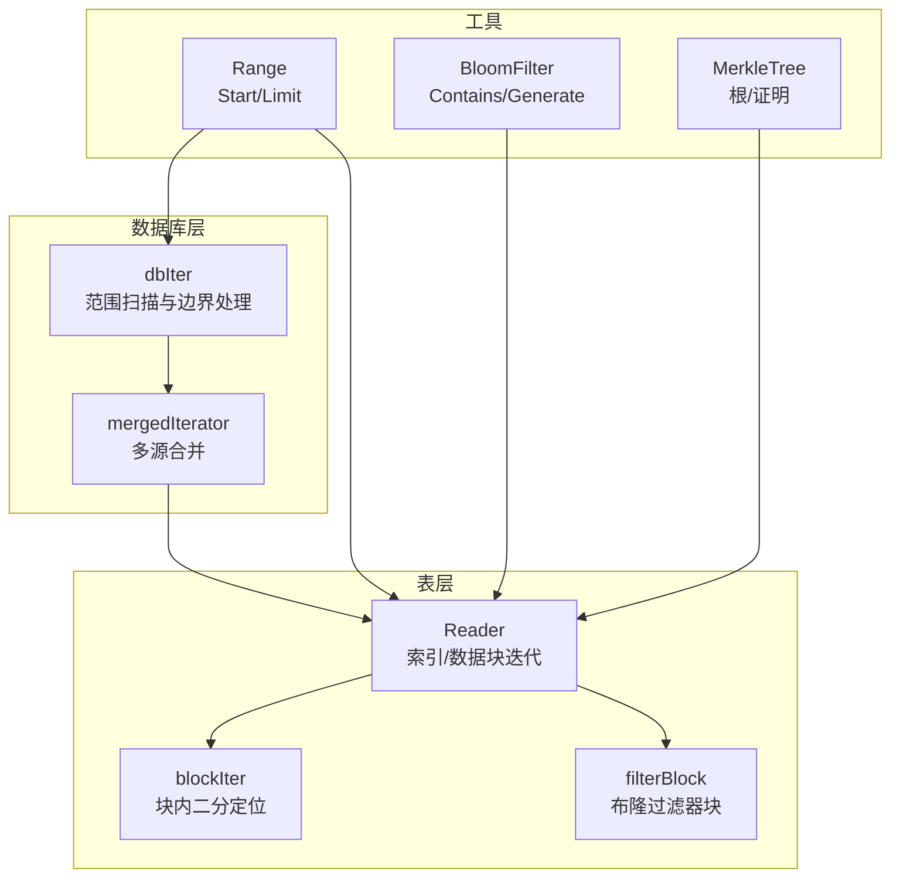
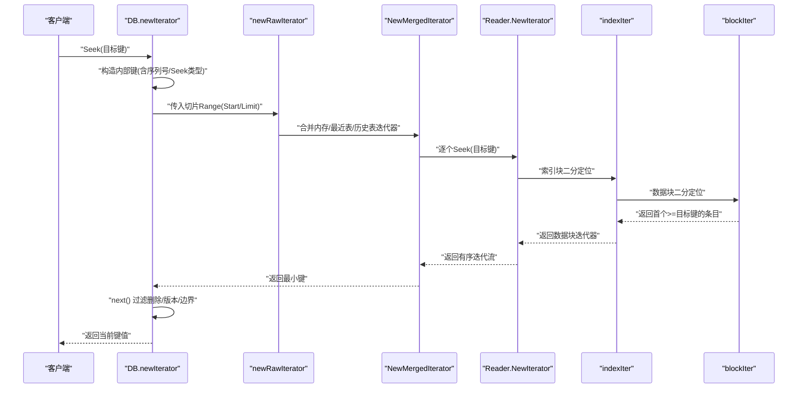
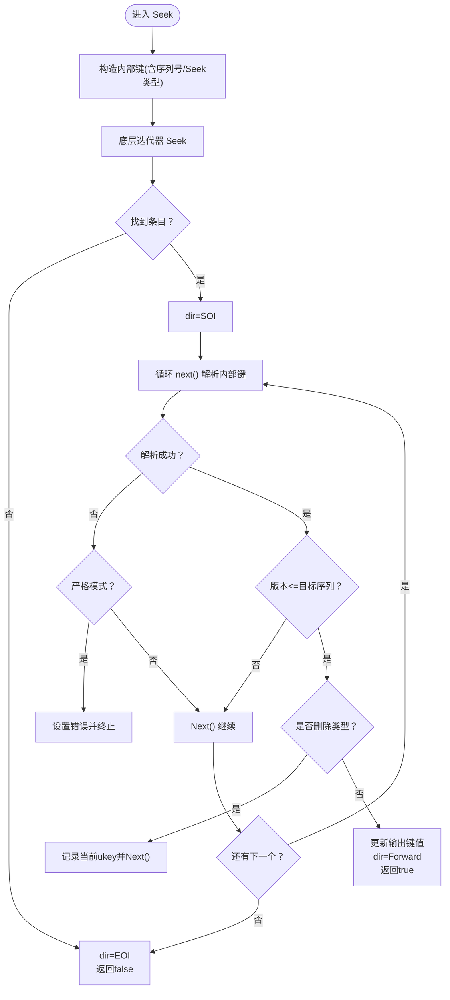
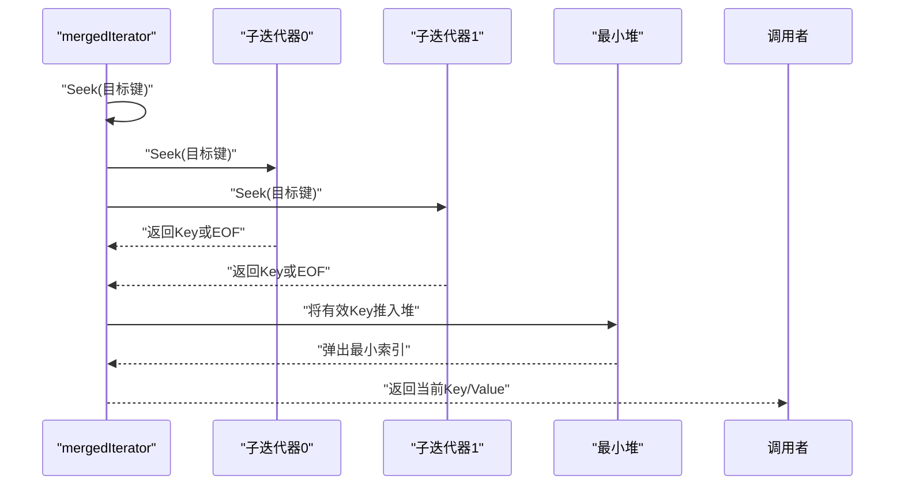
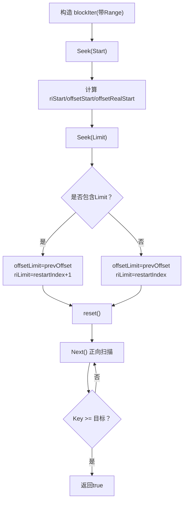
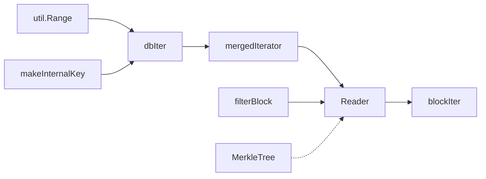

# 范围查询与扫描

<cite>
**本文引用的文件**
- [leveldb/db_iter.go](file://leveldb/db_iter.go)
- [leveldb/iterator/iter.go](file://leveldb/iterator/iter.go)
- [leveldb/iterator/merged_iter.go](file://leveldb/iterator/merged_iter.go)
- [leveldb/table/reader.go](file://leveldb/table/reader.go)
- [leveldb/filter/bloom.go](file://leveldb/filter/bloom.go)
- [leveldb/util/range.go](file://leveldb/util/range.go)
- [leveldb/key.go](file://leveldb/key.go)
- [leveldb/version.go](file://leveldb/version.go)
- [leveldb/merkle/tree.go](file://leveldb/merkle/tree.go)
</cite>

## 目录
1. [简介](#简介)
2. [项目结构](#项目结构)
3. [核心组件](#核心组件)
4. [架构总览](#架构总览)
5. [详细组件分析](#详细组件分析)
6. [依赖关系分析](#依赖关系分析)
7. [性能考量](#性能考量)
8. [故障排查指南](#故障排查指南)
9. [结论](#结论)
10. [附录：最佳实践与示例路径](#附录最佳实践与示例路径)

## 简介
本篇文档围绕 avccDB 中“基于迭代器的范围查询机制”展开，重点解释如何通过 Seek 配合 Next 实现高效的数据范围扫描，支持前缀匹配与区间查询；阐述在调用 Seek 后如何正确处理边界条件，避免遗漏或重复读取；结合 db_iter.go 的实现，说明数据库层如何优化范围查询性能（与布隆过滤器、索引块协同），并给出全表扫描、指定前缀遍历、有限范围查询的最佳实践。最后讨论在大数据集上的内存管理与性能注意事项，并说明如何结合 Merkle 树结构验证所获取数据范围的完整性。

## 项目结构
与范围查询直接相关的模块主要分布在以下位置：
- 数据库迭代器与合并迭代器：leveldb/db_iter.go、leveldb/iterator/merged_iter.go、leveldb/iterator/iter.go
- 表层迭代器与索引/过滤块：leveldb/table/reader.go
- 前缀与范围定义：leveldb/util/range.go
- 内部键格式与序列号/类型编码：leveldb/key.go
- 版本与重叠表选择：leveldb/version.go
- 布隆过滤器：leveldb/filter/bloom.go
- Merkle 树：leveldb/merkle/tree.go

图表来源
- [leveldb/db_iter.go](file://leveldb/db_iter.go#L63-L120)
- [leveldb/iterator/merged_iter.go](file://leveldb/iterator/merged_iter.go#L119-L143)
- [leveldb/table/reader.go](file://leveldb/table/reader.go#L730-L768)
- [leveldb/util/range.go](file://leveldb/util/range.go#L9-L16)
- [leveldb/filter/bloom.go](file://leveldb/filter/bloom.go#L26-L52)
- [leveldb/merkle/tree.go](file://leveldb/merkle/tree.go#L68-L74)

章节来源
- [leveldb/db_iter.go](file://leveldb/db_iter.go#L63-L120)
- [leveldb/iterator/merged_iter.go](file://leveldb/iterator/merged_iter.go#L119-L143)
- [leveldb/table/reader.go](file://leveldb/table/reader.go#L730-L768)
- [leveldb/util/range.go](file://leveldb/util/range.go#L9-L16)
- [leveldb/filter/bloom.go](file://leveldb/filter/bloom.go#L26-L52)
- [leveldb/merkle/tree.go](file://leveldb/merkle/tree.go#L68-L74)

## 核心组件
- 范围切片 Range：定义 Start/Limit，用于限定扫描区间；前缀匹配通过构造 Limit 实现。
- 内部键与序列号：内部键包含用户键与序列号/类型，Seek 使用 keyTypeSeek 以保证排序正确。
- 数据库迭代器 dbIter：封装合并后的迭代器，负责边界状态、版本过滤、采样等。
- 合并迭代器 mergedIterator：将多个子迭代器按比较器顺序合并，统一暴露 Seek/Next/Prev。
- 表迭代器 Reader/blockIter：基于索引块定位到数据块，使用重启点二分快速定位目标键。
- 布隆过滤器 filterBlock：在精确查找场景下先用过滤器快速排除不可能的块，减少 IO。
- Merkle 树：提供范围完整性校验能力，可生成证明并验证。

章节来源
- [leveldb/util/range.go](file://leveldb/util/range.go#L9-L16)
- [leveldb/key.go](file://leveldb/key.go#L50-L66)
- [leveldb/db_iter.go](file://leveldb/db_iter.go#L186-L201)
- [leveldb/iterator/merged_iter.go](file://leveldb/iterator/merged_iter.go#L119-L143)
- [leveldb/table/reader.go](file://leveldb/table/reader.go#L730-L768)
- [leveldb/filter/bloom.go](file://leveldb/filter/bloom.go#L26-L52)
- [leveldb/merkle/tree.go](file://leveldb/merkle/tree.go#L68-L74)

## 架构总览
范围查询从 DB 层开始，构建包含内存、最近磁盘表与历史表的合并迭代器，再由 Reader 的索引块与数据块迭代器完成区间内的定位与扫描。布隆过滤器在精确查找时参与快速剪枝，Merkle 树为范围完整性提供支撑。

图表来源
- [leveldb/db_iter.go](file://leveldb/db_iter.go#L63-L120)
- [leveldb/db_iter.go](file://leveldb/db_iter.go#L186-L201)
- [leveldb/db_iter.go](file://leveldb/db_iter.go#L204-L244)
- [leveldb/iterator/merged_iter.go](file://leveldb/iterator/merged_iter.go#L119-L143)
- [leveldb/table/reader.go](file://leveldb/table/reader.go#L730-L768)
- [leveldb/table/reader.go](file://leveldb/table/reader.go#L225-L249)

## 详细组件分析

### 组件A：数据库层范围扫描（dbIter）
- 构造内部键：Seek 时将用户键与最大序列号和 keyTypeSeek 组合成内部键，确保排序正确性。
- 边界状态机：dirSOI/dirEOI/dirForward/dirBackward 控制方向与边界，避免越界访问。
- next()/prev()：解析内部键，过滤删除键、版本号超限、严格模式下的错误；遇到新用户键才更新输出。
- 采样与压缩：根据配置随机采样，降低频繁 Seek 的开销。
- 错误传播：任何底层迭代器错误都会被设置到 dbIter 并终止后续操作。

图表来源
- [leveldb/db_iter.go](file://leveldb/db_iter.go#L186-L201)
- [leveldb/db_iter.go](file://leveldb/db_iter.go#L204-L244)
- [leveldb/db_iter.go](file://leveldb/db_iter.go#L246-L304)
- [leveldb/key.go](file://leveldb/key.go#L50-L66)

章节来源
- [leveldb/db_iter.go](file://leveldb/db_iter.go#L186-L201)
- [leveldb/db_iter.go](file://leveldb/db_iter.go#L204-L244)
- [leveldb/db_iter.go](file://leveldb/db_iter.go#L246-L304)
- [leveldb/key.go](file://leveldb/key.go#L50-L66)

### 组件B：合并迭代器（mergedIterator）
- 多源合并：将内存、最近表、历史表等迭代器合并为一个有序流，统一暴露 Seek/Next/Prev。
- 堆管理：使用最小堆维护各子迭代器当前位置，确保每次返回最小键。
- 严格模式：当某子迭代器出现非损坏错误时，严格模式下会中断整个合并迭代器。

图表来源
- [leveldb/iterator/merged_iter.go](file://leveldb/iterator/merged_iter.go#L119-L143)
- [leveldb/iterator/merged_iter.go](file://leveldb/iterator/merged_iter.go#L145-L187)
- [leveldb/iterator/merged_iter.go](file://leveldb/iterator/merged_iter.go#L199-L245)

章节来源
- [leveldb/iterator/merged_iter.go](file://leveldb/iterator/merged_iter.go#L119-L143)
- [leveldb/iterator/merged_iter.go](file://leveldb/iterator/merged_iter.go#L145-L187)
- [leveldb/iterator/merged_iter.go](file://leveldb/iterator/merged_iter.go#L199-L245)

### 组件C：表层迭代器与索引/数据块（Reader/blockIter）
- 索引块迭代：使用二分搜索定位目标重启点，再推进到首个>=目标键的条目。
- 数据块迭代：基于重启点缓存与逆向缓存，支持正向/反向遍历，避免重复解码。
- 切片范围：在构造 blockIter 时，根据 Range.Start/Limit 计算 riStart/offsetStart/offsetLimit，仅扫描必要区间。

图表来源
- [leveldb/table/reader.go](file://leveldb/table/reader.go#L730-L768)
- [leveldb/table/reader.go](file://leveldb/table/reader.go#L225-L249)
- [leveldb/table/reader.go](file://leveldb/table/reader.go#L251-L302)

章节来源
- [leveldb/table/reader.go](file://leveldb/table/reader.go#L730-L768)
- [leveldb/table/reader.go](file://leveldb/table/reader.go#L225-L249)
- [leveldb/table/reader.go](file://leveldb/table/reader.go#L251-L302)

### 组件D：布隆过滤器与索引块协同
- 在精确查找场景（如 Reader.Find/FindKey）中，先用 filterBlock 对最近数据块进行快速判断，若过滤器判定不存在则直接返回未命中，避免读取数据块。
- 对于范围扫描，通常不依赖布隆过滤器进行剪枝，因为需要覆盖区间内的所有可能键；但可在某些预热策略中利用过滤器减少不必要的数据块读取。

章节来源
- [leveldb/filter/bloom.go](file://leveldb/filter/bloom.go#L26-L52)
- [leveldb/table/reader.go](file://leveldb/table/reader.go#L826-L943)

### 组件E：前缀匹配与区间查询
- 前缀匹配：通过 util.BytesPrefix 将前缀转换为 Range{Start: prefix, Limit: computeLimit(prefix)}，其中 Limit 为 prefix 增加最低位使 prefix 变为“下一个字节序”的键。
- 区间查询：直接传入 Range{Start: min, Limit: max}，Reader 在构造 blockIter 时根据 Start/Limit 缩小扫描范围。

章节来源
- [leveldb/util/range.go](file://leveldb/util/range.go#L18-L33)
- [leveldb/table/reader.go](file://leveldb/table/reader.go#L730-L768)

### 组件F：版本与序列号过滤
- 内部键包含序列号与类型，Seek 时使用 keyTypeSeek 以保证排序正确；dbIter 在 next() 中检查 seq 是否超过目标序列，从而实现快照语义。
- 版本化键支持：内部键可携带版本字段，解析时优先尝试带版本键解析，失败再回退到普通内部键。

章节来源
- [leveldb/key.go](file://leveldb/key.go#L50-L66)
- [leveldb/key.go](file://leveldb/key.go#L106-L132)
- [leveldb/db_iter.go](file://leveldb/db_iter.go#L204-L244)

### 组件G：Merkle 树与范围完整性
- Merkle 树提供根哈希与证明生成/验证能力，可用于验证某一范围内的键值集合是否完整且未被篡改。
- 通过树的叶子映射与路径构建，可生成存在/不存在证明，结合范围扫描结果进行完整性校验。

章节来源
- [leveldb/merkle/tree.go](file://leveldb/merkle/tree.go#L68-L74)
- [leveldb/merkle/tree.go](file://leveldb/merkle/tree.go#L85-L121)
- [leveldb/merkle/tree.go](file://leveldb/merkle/tree.go#L194-L211)

## 依赖关系分析
- DB.newIterator 依赖 util.Range 与内部键构造函数，将用户请求转换为内部键切片，再交给 newRawIterator。
- newRawIterator 将内存、最近表、历史表的迭代器合并为单一有序流。
- Reader.NewIterator 通过索引块与数据块迭代器实现区间扫描，blockIter 的二分搜索与重启点机制是性能关键。
- 布隆过滤器与索引块协同，减少不必要的数据块读取。
- Merkle 树作为上层完整性保障，与范围扫描结果结合使用。

图表来源
- [leveldb/util/range.go](file://leveldb/util/range.go#L9-L16)
- [leveldb/key.go](file://leveldb/key.go#L75-L88)
- [leveldb/db_iter.go](file://leveldb/db_iter.go#L63-L120)
- [leveldb/iterator/merged_iter.go](file://leveldb/iterator/merged_iter.go#L299-L317)
- [leveldb/table/reader.go](file://leveldb/table/reader.go#L730-L768)
- [leveldb/filter/bloom.go](file://leveldb/filter/bloom.go#L26-L52)
- [leveldb/merkle/tree.go](file://leveldb/merkle/tree.go#L68-L74)

章节来源
- [leveldb/util/range.go](file://leveldb/util/range.go#L9-L16)
- [leveldb/key.go](file://leveldb/key.go#L75-L88)
- [leveldb/db_iter.go](file://leveldb/db_iter.go#L63-L120)
- [leveldb/iterator/merged_iter.go](file://leveldb/iterator/merged_iter.go#L299-L317)
- [leveldb/table/reader.go](file://leveldb/table/reader.go#L730-L768)
- [leveldb/filter/bloom.go](file://leveldb/filter/bloom.go#L26-L52)
- [leveldb/merkle/tree.go](file://leveldb/merkle/tree.go#L68-L74)

## 性能考量
- 二分定位与重启点：blockIter 使用重启点与二分搜索，显著降低块内定位成本。
- 合并迭代器堆：mergedIterator 使用最小堆，避免全量归并带来的额外开销。
- 布隆过滤器：在精确查找场景下可减少 IO；范围扫描通常不依赖过滤器剪枝。
- 采样与随机化：dbIter 的采样机制降低频繁 Seek 的代价，提高吞吐。
- 缓存与只读：Reader 支持缓存数据块与过滤器块，fillCache 可按需开启。
- 内存管理：迭代器必须显式释放；dbIter 在 Release 中清理资源并减少存活迭代器计数。

章节来源
- [leveldb/table/reader.go](file://leveldb/table/reader.go#L624-L656)
- [leveldb/table/reader.go](file://leveldb/table/reader.go#L716-L728)
- [leveldb/db_iter.go](file://leveldb/db_iter.go#L93-L95)
- [leveldb/db_iter.go](file://leveldb/db_iter.go#L360-L378)

## 故障排查指南
- 迭代器已释放：调用已释放的迭代器会触发 ErrIterReleased，需重新创建迭代器。
- 严格模式错误：当 strict=true 时，底层损坏错误不会被忽略，应检查底层存储与一致性。
- 范围无效：若 Range.Start/Limit 设置不当导致 offsetStart > offsetLimit，会报错。
- 内部键格式错误：解析内部键失败会触发错误，需确认键构造与序列号/类型编码。
- Merkle 校验失败：若证明与树根不一致或路径不匹配，VerifyProof 返回 false。

章节来源
- [leveldb/iterator/iter.go](file://leveldb/iterator/iter.go#L17-L20)
- [leveldb/iterator/merged_iter.go](file://leveldb/iterator/merged_iter.go#L50-L61)
- [leveldb/table/reader.go](file://leveldb/table/reader.go#L762-L766)
- [leveldb/key.go](file://leveldb/key.go#L106-L132)
- [leveldb/merkle/tree.go](file://leveldb/merkle/tree.go#L213-L225)

## 结论
avccDB 的范围查询通过“内部键+合并迭代器+索引/数据块二分定位”实现了高效、可控的区间扫描。Seek+Next 的组合确保了边界条件的正确处理，避免遗漏与重复。布隆过滤器与索引块协同进一步提升了精确查找与范围扫描的性能。结合 Merkle 树，可以在大数据集上对范围结果进行完整性验证，满足高可靠场景需求。

## 附录：最佳实践与示例路径
- 全表扫描
  - 使用 Range{Start: nil, Limit: nil} 创建迭代器，然后循环调用 Next() 直到 EOFI。
  - 示例路径参考：[leveldb/db_iter.go](file://leveldb/db_iter.go#L149-L168)、[leveldb/db_iter.go](file://leveldb/db_iter.go#L246-L260)
- 指定前缀遍历
  - 使用 util.BytesPrefix(prefix) 生成 Range，再创建迭代器，循环调用 Next()。
  - 示例路径参考：[leveldb/util/range.go](file://leveldb/util/range.go#L18-L33)、[leveldb/table/reader.go](file://leveldb/table/reader.go#L730-L768)
- 有限范围查询
  - 显式传入 Range{Start: min, Limit: max}，Reader 会在 blockIter 上裁剪扫描区间。
  - 示例路径参考：[leveldb/table/reader.go](file://leveldb/table/reader.go#L730-L768)
- 边界条件处理
  - Seek 后调用 next() 过滤删除键与版本限制；若无下一个条目，dir=EOI。
  - 示例路径参考：[leveldb/db_iter.go](file://leveldb/db_iter.go#L186-L201)、[leveldb/db_iter.go](file://leveldb/db_iter.go#L204-L244)
- 内存管理
  - 迭代器必须显式 Release；避免长时间持有大量迭代器。
  - 示例路径参考：[leveldb/db_iter.go](file://leveldb/db_iter.go#L360-L378)
- 完整性校验
  - 使用 Merkle 树生成证明并验证范围结果。
  - 示例路径参考：[leveldb/merkle/tree.go](file://leveldb/merkle/tree.go#L85-L121)、[leveldb/merkle/tree.go](file://leveldb/merkle/tree.go#L213-L225)