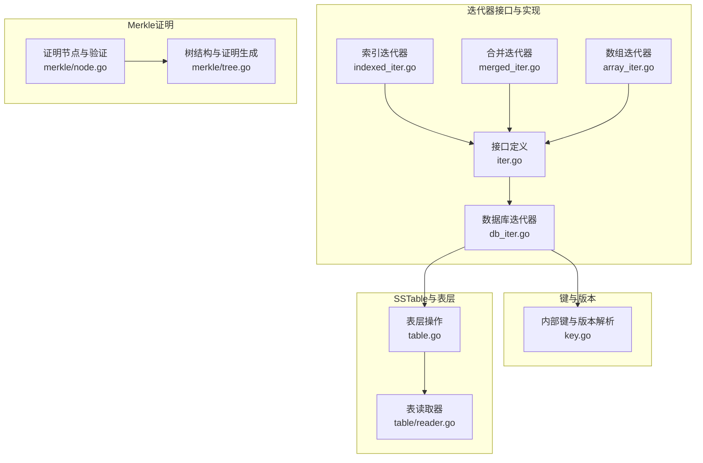
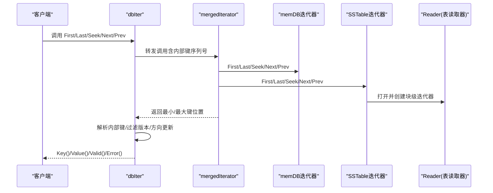
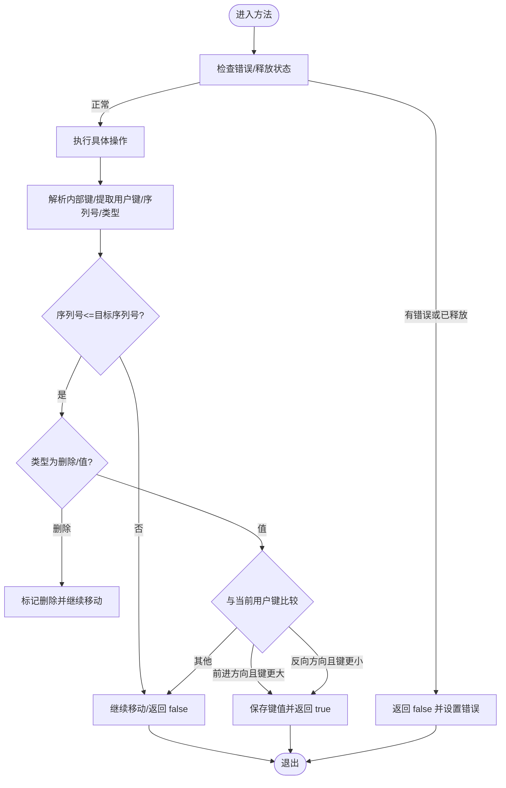
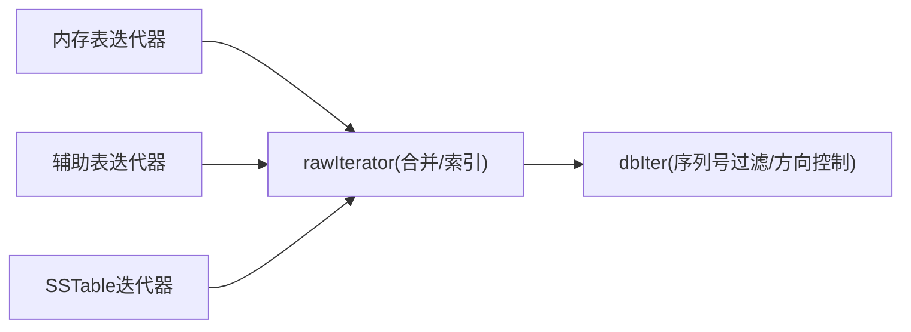
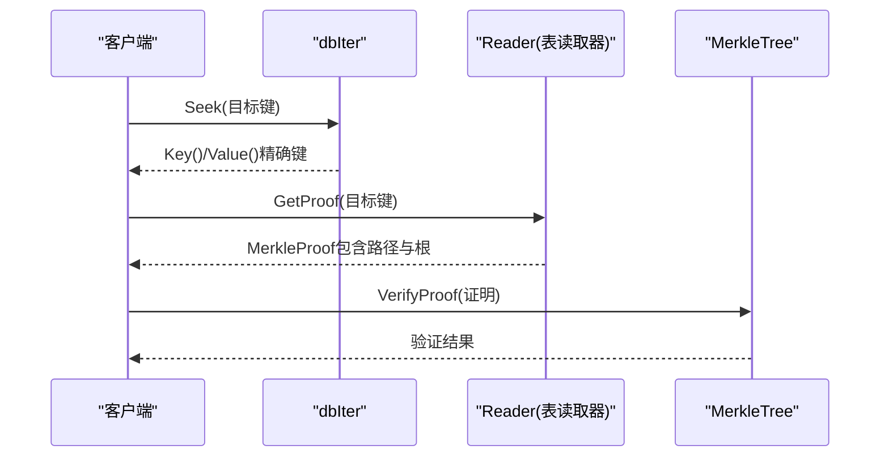
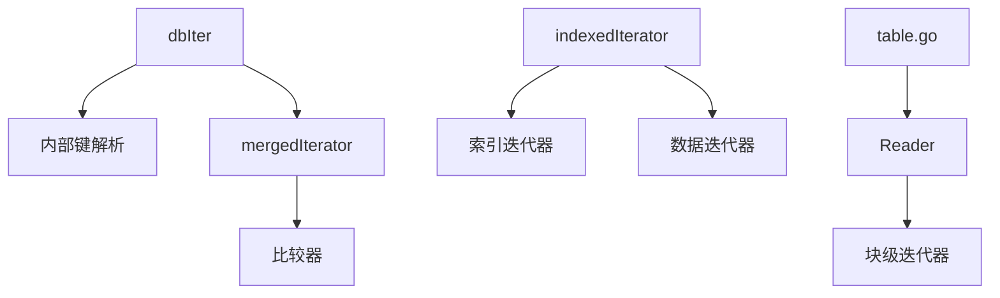

# 迭代器基础操作

<cite>
**本文引用的文件**
- [leveldb/iterator/iter.go](file://leveldb/iterator/iter.go)
- [leveldb/db_iter.go](file://leveldb/db_iter.go)
- [leveldb/iterator/array_iter.go](file://leveldb/iterator/array_iter.go)
- [leveldb/iterator/indexed_iter.go](file://leveldb/iterator/indexed_iter.go)
- [leveldb/iterator/merged_iter.go](file://leveldb/iterator/merged_iter.go)
- [leveldb/key.go](file://leveldb/key.go)
- [leveldb/table.go](file://leveldb/table.go)
- [leveldb/table/reader.go](file://leveldb/table/reader.go)
- [leveldb/merkle/node.go](file://leveldb/merkle/node.go)
- [leveldb/merkle/tree.go](file://leveldb/merkle/tree.go)
- [leveldb/testutil/iter.go](file://leveldb/testutil/iter.go)
</cite>

## 目录
1. [简介](#简介)
2. [项目结构](#项目结构)
3. [核心组件](#核心组件)
4. [架构总览](#架构总览)
5. [详细组件分析](#详细组件分析)
6. [依赖关系分析](#依赖关系分析)
7. [性能考量](#性能考量)
8. [故障排查指南](#故障排查指南)
9. [结论](#结论)
10. [附录](#附录)

## 简介
本文件聚焦于 avccDB 的迭代器基础操作，系统性讲解 First、Last、Seek、Next、Prev 的行为特征、返回值语义、数据状态变化，以及在 LSM 树多层结构下与内存表（memDB）和 SSTable 的交互。同时给出正向遍历（Next）、反向遍历（Prev）与定位到特定键（Seek）的实践建议，并结合 Merkle 验证路径，说明如何在生成数据证明时利用精确的键定位能力。

## 项目结构
围绕迭代器的基础接口与实现，主要涉及以下模块：
- 接口定义与通用迭代器：leveldb/iterator/iter.go
- 数据库层迭代器封装：leveldb/db_iter.go
- 基础数组迭代器：leveldb/iterator/array_iter.go
- 索引型迭代器（索引 -> 数据迭代器）：leveldb/iterator/indexed_iter.go
- 多路合并迭代器：leveldb/iterator/merged_iter.go
- 内部键与版本解析：leveldb/key.go
- 表层迭代器与 SSTable 读取：leveldb/table.go、leveldb/table/reader.go
- Merkle 证明与树结构：leveldb/merkle/node.go、leveldb/merkle/tree.go
- 测试工具与行为验证：leveldb/testutil/iter.go

图表来源
- [leveldb/iterator/iter.go](file://leveldb/iterator/iter.go#L1-L133)
- [leveldb/db_iter.go](file://leveldb/db_iter.go#L1-L393)
- [leveldb/iterator/array_iter.go](file://leveldb/iterator/array_iter.go#L1-L182)
- [leveldb/iterator/indexed_iter.go](file://leveldb/iterator/indexed_iter.go#L1-L242)
- [leveldb/iterator/merged_iter.go](file://leveldb/iterator/merged_iter.go#L1-L351)
- [leveldb/key.go](file://leveldb/key.go#L1-L197)
- [leveldb/table.go](file://leveldb/table.go#L500-L510)
- [leveldb/table/reader.go](file://leveldb/table/reader.go#L1106-L1146)
- [leveldb/merkle/node.go](file://leveldb/merkle/node.go#L104-L152)
- [leveldb/merkle/tree.go](file://leveldb/merkle/tree.go#L1-L225)

章节来源
- [leveldb/iterator/iter.go](file://leveldb/iterator/iter.go#L1-L133)
- [leveldb/db_iter.go](file://leveldb/db_iter.go#L1-L393)
- [leveldb/iterator/array_iter.go](file://leveldb/iterator/array_iter.go#L1-L182)
- [leveldb/iterator/indexed_iter.go](file://leveldb/iterator/indexed_iter.go#L1-L242)
- [leveldb/iterator/merged_iter.go](file://leveldb/iterator/merged_iter.go#L1-L351)
- [leveldb/key.go](file://leveldb/key.go#L1-L197)
- [leveldb/table.go](file://leveldb/table.go#L500-L510)
- [leveldb/table/reader.go](file://leveldb/table/reader.go#L1106-L1146)
- [leveldb/merkle/node.go](file://leveldb/merkle/node.go#L104-L152)
- [leveldb/merkle/tree.go](file://leveldb/merkle/tree.go#L1-L225)

## 核心组件
- 迭代器接口族：Iterator、CommonIterator、IteratorSeeker 定义了统一的遍历与定位能力，并约定 Valid、Key、Value、Error、Release 等方法。
- 数据库迭代器 dbIter：对底层多个迭代器源（内存表、SSTable、辅助表）进行封装，负责序列号过滤、方向状态管理、严格模式错误处理与采样统计。
- 数组迭代器 arrayIterator：面向有序数组的简单迭代器，支持 First/Last/Seek/Next/Prev 与 Key/Value 返回当前项。
- 索引迭代器 indexedIterator：索引层返回“数据迭代器”，按需切换数据层迭代器，实现分层遍历。
- 合并迭代器 mergedIterator：多路输入迭代器的最小堆合并，保证严格递增顺序输出。
- 内部键与版本：内部键包含用户键、版本号、序列号与类型，用于精确比较与过滤。
- 表层迭代器：SSTable Reader 提供基于块的迭代器，配合合并/索引迭代器形成最终视图。
- Merkle 证明：提供存在性/不存在性证明、路径聚合与根哈希校验，便于生成数据证明。

章节来源
- [leveldb/iterator/iter.go](file://leveldb/iterator/iter.go#L1-L133)
- [leveldb/db_iter.go](file://leveldb/db_iter.go#L97-L393)
- [leveldb/iterator/array_iter.go](file://leveldb/iterator/array_iter.go#L1-L182)
- [leveldb/iterator/indexed_iter.go](file://leveldb/iterator/indexed_iter.go#L1-L242)
- [leveldb/iterator/merged_iter.go](file://leveldb/iterator/merged_iter.go#L1-L351)
- [leveldb/key.go](file://leveldb/key.go#L75-L152)
- [leveldb/table.go](file://leveldb/table.go#L500-L510)
- [leveldb/table/reader.go](file://leveldb/table/reader.go#L1106-L1146)
- [leveldb/merkle/node.go](file://leveldb/merkle/node.go#L104-L152)
- [leveldb/merkle/tree.go](file://leveldb/merkle/tree.go#L1-L225)

## 架构总览
数据库迭代器 dbIter 将内存表、辅助表与当前版本的 SSTable 迭代器通过合并迭代器组合，再以内部键序列号过滤与方向状态控制，向上提供稳定的键值遍历视图。SSTable 层由 Reader 提供块级迭代器，必要时可生成 Merkle 证明。

图表来源
- [leveldb/db_iter.go](file://leveldb/db_iter.go#L63-L123)
- [leveldb/db_iter.go](file://leveldb/db_iter.go#L153-L344)
- [leveldb/iterator/merged_iter.go](file://leveldb/iterator/merged_iter.go#L67-L117)
- [leveldb/table.go](file://leveldb/table.go#L500-L510)
- [leveldb/table/reader.go](file://leveldb/table/reader.go#L1106-L1146)

## 详细组件分析

### 方法行为与返回值语义
- First/Last/Seek/Next/Prev 的返回值均为布尔值，表示当前位置是否有效；若为 false，应通过 Error() 获取错误信息或通过 Valid() 判断是否到达边界。
- Key()/Value() 返回当前项，调用后一次遍历中可能被下一次调用覆盖，不应保存引用。
- Release() 必须在使用完毕后调用，释放资源并标记迭代器已释放；重复释放会触发错误。

章节来源
- [leveldb/iterator/iter.go](file://leveldb/iterator/iter.go#L21-L106)
- [leveldb/iterator/iter.go](file://leveldb/iterator/iter.go#L107-L133)
- [leveldb/db_iter.go](file://leveldb/db_iter.go#L346-L393)

### 数据库迭代器 dbIter 的执行逻辑
- 方向状态：dirSOI（开始）、dirEOI（结束）、dirForward、dirBackward；用于控制 Next/Prev 的边界与回退策略。
- 版本过滤：内部键包含序列号与类型，dbIter 在每次移动时解析内部键，仅保留小于等于给定序列号且类型为值的记录。
- 严格模式：当 strict 为真时，遇到损坏错误直接中断；否则尝试跳过并继续下一个迭代器。
- 采样统计：对 Seek 次数进行采样，减少频繁 Seek 对性能的影响。

图表来源
- [leveldb/db_iter.go](file://leveldb/db_iter.go#L153-L344)
- [leveldb/key.go](file://leveldb/key.go#L106-L152)

章节来源
- [leveldb/db_iter.go](file://leveldb/db_iter.go#L97-L152)
- [leveldb/db_iter.go](file://leveldb/db_iter.go#L153-L344)
- [leveldb/key.go](file://leveldb/key.go#L75-L152)

### 正向遍历（Next）
- 从当前位置向后移动，解析内部键并过滤版本，遇到删除键则跳过，遇到新键则保存。
- 若到达末尾或发生错误，方向置为 dirEOI 并返回 false。

章节来源
- [leveldb/db_iter.go](file://leveldb/db_iter.go#L246-L260)
- [leveldb/db_iter.go](file://leveldb/db_iter.go#L204-L244)

### 反向遍历（Prev）
- 从当前位置向前移动，解析内部键并过滤版本，遇到删除键则跳过，遇到新键则保存。
- 若到达开头或发生错误，方向置为 dirSOI 并返回 false。

章节来源
- [leveldb/db_iter.go](file://leveldb/db_iter.go#L306-L344)
- [leveldb/db_iter.go](file://leveldb/db_iter.go#L262-L305)

### 定位到特定键（Seek）
- 将用户键转换为内部键（携带序列号与类型），在底层迭代器上执行 Seek。
- 由于底层可能返回任意键，dbIter 会继续调用 Next/Prev 以找到满足条件的最新版本键。

章节来源
- [leveldb/db_iter.go](file://leveldb/db_iter.go#L186-L202)
- [leveldb/key.go](file://leveldb/key.go#L75-L104)

### 与 LSM 树多层结构的交互
- 内存表与辅助表：dbIter 在构造原始迭代器时，会将当前内存表、冻结内存表与辅助表加入迭代器列表，确保最新写入可见。
- 当前版本 SSTable：通过版本管理器获取各层级的 SSTable 迭代器，再由合并迭代器统一输出。
- 表层迭代器：SSTable Reader 提供块级迭代器，支持查找与偏移估算等能力。

图表来源
- [leveldb/db_iter.go](file://leveldb/db_iter.go#L31-L61)
- [leveldb/db_iter.go](file://leveldb/db_iter.go#L63-L91)
- [leveldb/table.go](file://leveldb/table.go#L500-L510)

章节来源
- [leveldb/db_iter.go](file://leveldb/db_iter.go#L31-L61)
- [leveldb/db_iter.go](file://leveldb/db_iter.go#L63-L91)
- [leveldb/table.go](file://leveldb/table.go#L500-L510)

### Merkle 验证路径与精确键定位
- 存在性证明：通过表层 Reader 为指定键生成证明，包含从叶节点到根的兄弟节点路径与根哈希。
- 不存在性证明：通过相邻键推导间隙，生成非存在性证明。
- 与迭代器的关系：在需要生成数据证明时，先用 Seek 精确定位到目标键，再从表层读取器获取证明；或在多层结构下，将各层 SST 的根哈希聚合为层根，再与上层聚合得到 MasterRoot。

图表来源
- [leveldb/db_iter.go](file://leveldb/db_iter.go#L186-L202)
- [leveldb/table/reader.go](file://leveldb/table/reader.go#L1128-L1146)
- [leveldb/merkle/node.go](file://leveldb/merkle/node.go#L104-L152)
- [leveldb/merkle/tree.go](file://leveldb/merkle/tree.go#L194-L211)

章节来源
- [leveldb/table/reader.go](file://leveldb/table/reader.go#L1106-L1146)
- [leveldb/merkle/node.go](file://leveldb/merkle/node.go#L104-L152)
- [leveldb/merkle/tree.go](file://leveldb/merkle/tree.go#L194-L211)

## 依赖关系分析
- dbIter 依赖内部键解析函数，以正确识别用户键、版本与序列号。
- dbIter 依赖合并迭代器对多源迭代器进行统一输出。
- 合并迭代器依赖比较器进行键排序。
- 索引迭代器依赖索引层迭代器返回数据层迭代器。
- 表层迭代器依赖 Reader 提供块级迭代能力。

图表来源
- [leveldb/db_iter.go](file://leveldb/db_iter.go#L153-L344)
- [leveldb/iterator/merged_iter.go](file://leveldb/iterator/merged_iter.go#L1-L351)
- [leveldb/iterator/indexed_iter.go](file://leveldb/iterator/indexed_iter.go#L1-L242)
- [leveldb/table.go](file://leveldb/table.go#L500-L510)
- [leveldb/table/reader.go](file://leveldb/table/reader.go#L312-L370)

章节来源
- [leveldb/db_iter.go](file://leveldb/db_iter.go#L153-L344)
- [leveldb/iterator/merged_iter.go](file://leveldb/iterator/merged_iter.go#L1-L351)
- [leveldb/iterator/indexed_iter.go](file://leveldb/iterator/indexed_iter.go#L1-L242)
- [leveldb/table.go](file://leveldb/table.go#L500-L510)
- [leveldb/table/reader.go](file://leveldb/table/reader.go#L312-L370)

## 性能考量
- 采样统计：dbIter 对 Seek 次数进行随机采样，避免频繁 Seek 导致的额外开销。
- 严格模式：严格模式下遇到损坏错误会立即中断，减少无效遍历。
- 合并迭代器：使用堆维护最小键，注意输入迭代器数量较多时的堆操作成本。
- 索引迭代器：按需打开数据层迭代器，避免一次性加载所有子迭代器。

章节来源
- [leveldb/db_iter.go](file://leveldb/db_iter.go#L93-L106)
- [leveldb/db_iter.go](file://leveldb/db_iter.go#L124-L135)
- [leveldb/iterator/merged_iter.go](file://leveldb/iterator/merged_iter.go#L145-L187)
- [leveldb/iterator/indexed_iter.go](file://leveldb/iterator/indexed_iter.go#L74-L113)

## 故障排查指南
- 错误状态：调用任何定位方法后，若返回 false，应立即检查 Error() 是否为空；Valid() 也可用于判断是否处于有效区间。
- 已释放迭代器：对已 Release() 的迭代器再次调用方法会返回错误；请确保迭代器生命周期管理正确。
- 跨 goroutine 共享：迭代器不是并发安全的，不建议在多个 goroutine 中共享同一实例；如需并发访问，请为每个 goroutine 创建独立迭代器。
- 严格模式与损坏：严格模式下遇到损坏错误会直接中断；非严格模式会尝试跳过并继续下一个迭代器源。
- Seek 与边界：Seek 可能返回大于等于目标键的第一个键；若目标键不存在，应根据返回值判断是否命中。

章节来源
- [leveldb/iterator/iter.go](file://leveldb/iterator/iter.go#L72-L106)
- [leveldb/db_iter.go](file://leveldb/db_iter.go#L360-L393)
- [leveldb/iterator/merged_iter.go](file://leveldb/iterator/merged_iter.go#L50-L61)

## 结论
avccDB 的迭代器体系通过统一接口与多层封装，实现了对 LSM 树多层数据源的一致遍历与定位。dbIter 在内部键解析、版本过滤与方向控制方面提供了稳健的实现，结合合并与索引迭代器，能够高效地在内存表与 SSTable 之间切换。在需要生成数据证明时，借助表层 Reader 的 Merkle 证明能力，可以与 Seek 精确定位相结合，构建完整的数据可信路径。

## 附录
- 使用建议
  - 正向遍历：先调用 First 或 Seek 至起始点，然后循环调用 Next 直到返回 false。
  - 反向遍历：先调用 Last 或 Seek 至终点，然后循环调用 Prev 直到返回 false。
  - 精确定位：使用 Seek 定位到目标键，随后通过 Key()/Value() 获取结果；若返回 false，可通过 Error() 判断原因。
  - 并发安全：为每个 goroutine 分配独立迭代器实例，避免跨 goroutine 共享。
  - 资源释放：遍历完成后务必调用 Release() 释放资源。

- 常见错误模式警示
  - 在已释放的迭代器上调用方法：会导致错误；请在调用前检查 Valid() 或 Error()。
  - 跨 goroutine 共享单个迭代器实例：可能导致竞态与未定义行为；请为每个 goroutine 创建独立实例。
  - 忽略 Error()：即使返回 true，也应在每次操作后检查 Error()，以发现潜在问题。
  - 依赖 Key()/Value() 的持久引用：它们的内容可能在下一次调用后改变；请及时复制所需数据。

章节来源
- [leveldb/testutil/iter.go](file://leveldb/testutil/iter.go#L107-L173)
- [leveldb/testutil/iter.go](file://leveldb/testutil/iter.go#L175-L230)
- [leveldb/testutil/iter.go](file://leveldb/testutil/iter.go#L232-L327)