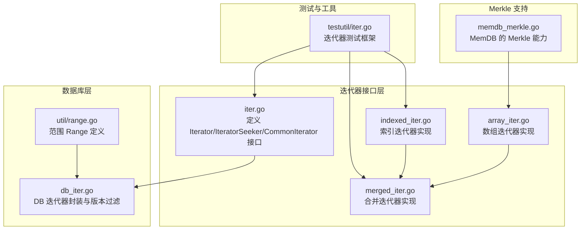
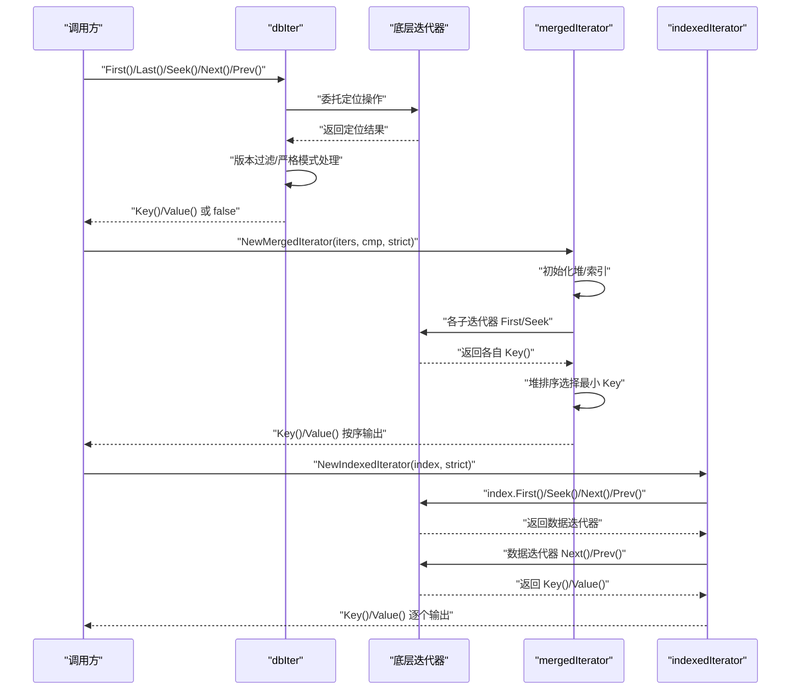
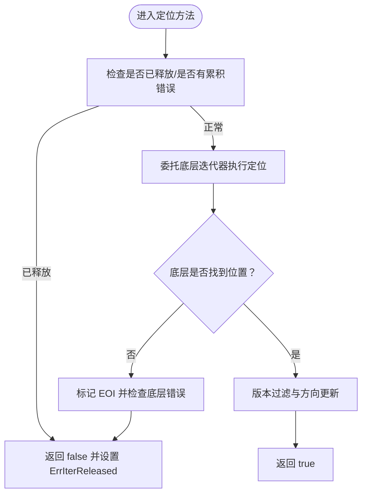
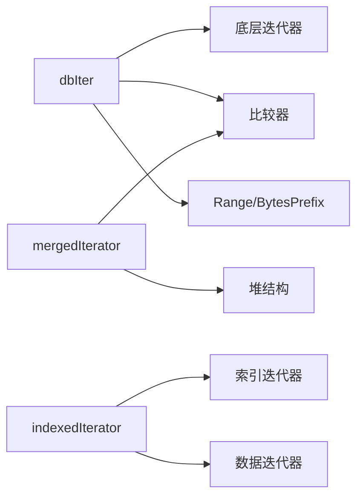

# 迭代器接口

<cite>
**本文引用的文件**
- [leveldb/iterator/iter.go](file://leveldb/iterator/iter.go)
- [leveldb/db_iter.go](file://leveldb/db_iter.go)
- [leveldb/iterator/array_iter.go](file://leveldb/iterator/array_iter.go)
- [leveldb/iterator/indexed_iter.go](file://leveldb/iterator/indexed_iter.go)
- [leveldb/iterator/merged_iter.go](file://leveldb/iterator/merged_iter.go)
- [leveldb/util/range.go](file://leveldb/util/range.go)
- [leveldb/testutil/iter.go](file://leveldb/testutil/iter.go)
- [leveldb/memdb/memdb_merkle.go](file://leveldb/memdb/memdb_merkle.go)
</cite>

## 目录
1. [简介](#简介)
2. [项目结构](#项目结构)
3. [核心组件](#核心组件)
4. [架构总览](#架构总览)
5. [详细组件分析](#详细组件分析)
6. [依赖关系分析](#依赖关系分析)
7. [性能考量](#性能考量)
8. [故障排查指南](#故障排查指南)
9. [结论](#结论)
10. [附录：常见使用场景与最佳实践](#附录常见使用场景与最佳实践)

## 简介
本文件为 avccDB 的迭代器系统提供全面的 API 参考文档。重点覆盖以下方面：
- Iterator 接口及其方法（First、Last、Seek、Next、Prev、Key、Value）的行为与语义
- 迭代器生命周期管理与资源释放机制
- 错误处理模式与有效性检查
- 范围查询（slice）的使用与限制
- 并发使用注意事项与性能优化建议
- 与 Merkle 验证相关的特殊迭代器能力说明
- 常见使用场景与最佳实践（全表扫描、范围查询、反向遍历）

## 项目结构
迭代器相关代码主要位于 leveldb/iterator 子模块，并在 leveldb 层通过 db_iter.go 对外暴露数据库级迭代器；范围查询支持由 util/range.go 提供；测试工具 testutil/iter.go 提供统一的迭代器行为验证流程；Merkle 相关能力在 memdb_merkle.go 中体现。

图表来源
- [leveldb/iterator/iter.go](file://leveldb/iterator/iter.go#L1-L133)
- [leveldb/db_iter.go](file://leveldb/db_iter.go#L1-L120)
- [leveldb/iterator/array_iter.go](file://leveldb/iterator/array_iter.go#L1-L182)
- [leveldb/iterator/merged_iter.go](file://leveldb/iterator/merged_iter.go#L1-L120)
- [leveldb/iterator/indexed_iter.go](file://leveldb/iterator/indexed_iter.go#L1-L120)
- [leveldb/util/range.go](file://leveldb/util/range.go#L1-L33)
- [leveldb/testutil/iter.go](file://leveldb/testutil/iter.go#L1-L120)
- [leveldb/memdb/memdb_merkle.go](file://leveldb/memdb/memdb_merkle.go#L1-L120)

章节来源
- [leveldb/iterator/iter.go](file://leveldb/iterator/iter.go#L1-L133)
- [leveldb/db_iter.go](file://leveldb/db_iter.go#L1-L120)
- [leveldb/util/range.go](file://leveldb/util/range.go#L1-L33)

## 核心组件
- 接口族
  - IteratorSeeker：定义基本定位操作（First、Last、Seek、Next、Prev）
  - CommonIterator：在定位操作基础上增加资源释放（Release）、有效性检查（Valid）、错误查询（Error）
  - Iterator：在 CommonIterator 基础上增加 Key、Value 访问
  - ErrorCallbackSetter：允许设置错误回调，用于 indexed 和 merged 迭代器
- 数据库迭代器 dbIter：对底层迭代器进行版本过滤、严格模式处理、采样触发等
- 具体实现
  - 数组迭代器 arrayIterator：基于有序数组的随机访问
  - 合并迭代器 mergedIterator：多路归并，按比较器顺序输出
  - 索引迭代器 indexedIterator：索引返回数据迭代器，逐个展开
- 范围查询 Range：Start/Limit 定义闭区间 [Start, Limit)，BytesPrefix 辅助前缀范围构造
- 测试框架 testutil/iter.go：统一的迭代器行为验证流程

章节来源
- [leveldb/iterator/iter.go](file://leveldb/iterator/iter.go#L1-L133)
- [leveldb/db_iter.go](file://leveldb/db_iter.go#L90-L160)
- [leveldb/iterator/array_iter.go](file://leveldb/iterator/array_iter.go#L1-L182)
- [leveldb/iterator/merged_iter.go](file://leveldb/iterator/merged_iter.go#L1-L120)
- [leveldb/iterator/indexed_iter.go](file://leveldb/iterator/indexed_iter.go#L1-L120)
- [leveldb/util/range.go](file://leveldb/util/range.go#L1-L33)
- [leveldb/testutil/iter.go](file://leveldb/testutil/iter.go#L1-L120)

## 架构总览
数据库迭代器 dbIter 将外部传入的 slice 转换为内部键，再委托底层迭代器完成实际遍历，并在每次移动时进行版本过滤与严格模式错误处理。合并迭代器负责多路归并，索引迭代器负责“索引 -> 数据迭代器”的展开。

图表来源
- [leveldb/db_iter.go](file://leveldb/db_iter.go#L160-L393)
- [leveldb/iterator/merged_iter.go](file://leveldb/iterator/merged_iter.go#L120-L245)
- [leveldb/iterator/indexed_iter.go](file://leveldb/iterator/indexed_iter.go#L70-L195)

## 详细组件分析

### 接口族与生命周期
- IteratorSeeker/ CommonIterator/ Iterator 的职责边界清晰，便于组合与扩展
- 生命周期
  - 释放：调用 Release 后，迭代器进入已释放状态，后续任何操作均返回 false 并可能返回 ErrIterReleased
  - 有效性：Valid 返回当前是否处于有效位置；Key/Value 在无效时返回 nil
  - 错误：Error 返回累积错误；遍历过程中遇到错误，后续定位操作返回 false
- 并发性
  - 单迭代器不保证并发安全；允许多个迭代器在不同 goroutine 中并发使用

章节来源
- [leveldb/iterator/iter.go](file://leveldb/iterator/iter.go#L1-L133)
- [leveldb/db_iter.go](file://leveldb/db_iter.go#L360-L393)

### 数据库迭代器 dbIter
- 特性
  - 版本过滤：根据序列号 seq 过滤过期或未来版本
  - 严格模式：strict=true 时，解析错误或损坏错误会终止迭代
  - 采样触发：按访问量采样，触发 compaction 采样
  - 内部键转换：将用户键转换为内部键以支持 Seek 定位
- 方法语义
  - First/Last/Seek/Next/Prev：委托底层迭代器，随后进行版本过滤与方向标记更新
  - Key/Value：返回当前有效键值
  - Error/Release：错误收集与资源释放
- 范围查询
  - slice 通过内部键转换后传递到底层迭代器，确保定位落在 [Start, Limit) 区间内

图表来源
- [leveldb/db_iter.go](file://leveldb/db_iter.go#L149-L202)

章节来源
- [leveldb/db_iter.go](file://leveldb/db_iter.go#L120-L202)
- [leveldb/db_iter.go](file://leveldb/db_iter.go#L204-L344)
- [leveldb/db_iter.go](file://leveldb/db_iter.go#L346-L393)

### 数组迭代器 arrayIterator
- 适用场景：基于有序数组的快速随机访问与顺序遍历
- 行为要点
  - First/Last/Seek/Next/Prev：维护当前位置，越界则到达 EOI/SOI
  - Key/Value：按需从数组读取，避免不必要的拷贝
- 性能：O(1) 定位，O(log n) Seek 使用数组的二分搜索接口

章节来源
- [leveldb/iterator/array_iter.go](file://leveldb/iterator/array_iter.go#L1-L182)

### 合并迭代器 mergedIterator
- 适用场景：将多个已排序的迭代器合并为一个整体有序迭代器
- 行为要点
  - 使用堆维护各子迭代器当前最小 Key，按比较器顺序输出
  - 支持严格模式：损坏错误在严格模式下会终止
  - 错误回调：可设置错误回调，统一处理子迭代器错误
- 复杂度：每次 Next/Prev 操作 O(log k)，k 为子迭代器数量

章节来源
- [leveldb/iterator/merged_iter.go](file://leveldb/iterator/merged_iter.go#L1-L120)
- [leveldb/iterator/merged_iter.go](file://leveldb/iterator/merged_iter.go#L120-L245)
- [leveldb/iterator/merged_iter.go](file://leveldb/iterator/merged_iter.go#L246-L351)

### 索引迭代器 indexedIterator
- 适用场景：索引返回“数据迭代器”，逐个展开数据项
- 行为要点
  - First/Last/Seek/Next/Prev：先驱动索引迭代器，再驱动对应数据迭代器
  - 严格模式：索引错误不忽略；数据错误在严格模式下终止，否则尝试下一个数据迭代器
  - 错误回调：可设置错误回调，统一上报
- 与合并迭代器配合：常用于将“段索引 -> 段内数据”映射到“全局有序数据”

章节来源
- [leveldb/iterator/indexed_iter.go](file://leveldb/iterator/indexed_iter.go#L1-L120)
- [leveldb/iterator/indexed_iter.go](file://leveldb/iterator/indexed_iter.go#L120-L242)

### 范围查询（slice）
- Range 结构：Start（包含）、Limit（不包含），形成半开区间 [Start, Limit)
- BytesPrefix：基于字节比较器生成前缀范围
- 在数据库层：slice 被转换为内部键后传递给底层迭代器，确保定位落在指定范围内

章节来源
- [leveldb/util/range.go](file://leveldb/util/range.go#L1-L33)
- [leveldb/db_iter.go](file://leveldb/db_iter.go#L63-L91)

### Merkle 验证相关迭代器能力
- 当前仓库中未发现直接面向 Merkle 的“迭代器接口”扩展；但存在：
  - MemDB 的 MerkleDB：提供构建 Merkle 树、获取根哈希、生成证明等能力
  - Merkle 树节点与证明结构：用于验证与聚合
- 与迭代器的关系
  - 可通过迭代器遍历数据源，结合 MerkleDB 构建树并生成证明
  - 适合需要“一致性校验 + 遍历”的场景

章节来源
- [leveldb/memdb/memdb_merkle.go](file://leveldb/memdb/memdb_merkle.go#L1-L181)

## 依赖关系分析
- dbIter 依赖
  - 底层迭代器（来自合并/索引/表迭代器等）
  - 比较器与内部键编码
  - 严格模式与采样策略
- mergedIterator 依赖
  - 比较器接口
  - 堆结构维护最小 Key
- indexedIterator 依赖
  - 索引迭代器返回数据迭代器
  - 错误处理与严格模式
- Range 与 BytesPrefix 为通用范围工具

图表来源
- [leveldb/db_iter.go](file://leveldb/db_iter.go#L1-L120)
- [leveldb/iterator/merged_iter.go](file://leveldb/iterator/merged_iter.go#L1-L120)
- [leveldb/iterator/indexed_iter.go](file://leveldb/iterator/indexed_iter.go#L1-L120)
- [leveldb/util/range.go](file://leveldb/util/range.go#L1-L33)

章节来源
- [leveldb/db_iter.go](file://leveldb/db_iter.go#L1-L120)
- [leveldb/iterator/merged_iter.go](file://leveldb/iterator/merged_iter.go#L1-L120)
- [leveldb/iterator/indexed_iter.go](file://leveldb/iterator/indexed_iter.go#L1-L120)
- [leveldb/util/range.go](file://leveldb/util/range.go#L1-L33)

## 性能考量
- 采样触发：dbIter 在访问路径上按大小采样，触发 compaction 采样，有助于后台维护
- 合并迭代器：子迭代器数量越多，堆操作越昂贵；建议合理拆分数据源
- 索引迭代器：索引与数据迭代器的切换成本需考虑；严格模式下错误短路更高效
- 数组迭代器：Seek 使用数组的二分搜索接口，适合静态或小规模数据
- 并发读：允许多迭代器并发，但单迭代器不保证线程安全

章节来源
- [leveldb/db_iter.go](file://leveldb/db_iter.go#L124-L135)
- [leveldb/iterator/merged_iter.go](file://leveldb/iterator/merged_iter.go#L145-L245)
- [leveldb/iterator/indexed_iter.go](file://leveldb/iterator/indexed_iter.go#L120-L195)
- [leveldb/iterator/array_iter.go](file://leveldb/iterator/array_iter.go#L79-L92)

## 故障排查指南
- 常见错误
  - ErrIterReleased：迭代器已释放，继续操作会返回 false 并携带该错误
  - 解析错误：内部键解析失败，严格模式下会终止
  - 损坏错误：底层数据损坏，严格模式下会终止
- 排查步骤
  - 调用 Error() 获取累积错误
  - 确认是否已调用 Release
  - 检查 slice 是否正确转换为内部键
  - 在严格模式下观察错误是否被吞掉
- 测试辅助
  - 使用 testutil/iter.go 的统一测试框架验证行为一致性

章节来源
- [leveldb/iterator/iter.go](file://leveldb/iterator/iter.go#L1-L60)
- [leveldb/db_iter.go](file://leveldb/db_iter.go#L137-L147)
- [leveldb/iterator/merged_iter.go](file://leveldb/iterator/merged_iter.go#L50-L61)
- [leveldb/iterator/indexed_iter.go](file://leveldb/iterator/indexed_iter.go#L48-L68)
- [leveldb/testutil/iter.go](file://leveldb/testutil/iter.go#L1-L120)

## 结论
avccDB 的迭代器体系以清晰的接口分层与可组合实现为核心，dbIter 提供了版本过滤与严格模式控制，mergedIterator 与 indexedIterator 则分别满足多路归并与索引展开场景。范围查询通过 Range/BytesPrefix 实现，配合内部键转换确保定位准确。在并发与性能方面，提供了采样触发与严格的错误处理策略。对于 Merkle 验证，可通过 MemDB 的 MerkleDB 能力与迭代器配合实现一致性校验与证明生成。

## 附录：常见使用场景与最佳实践

### 全表扫描
- 使用数据库迭代器遍历所有键值
- 注意：迭代器不会自动快照，若需一致视图，应结合快照或事务
- 最佳实践
  - 遍历结束后及时 Release
  - 使用 Valid/Key/Value 前检查 Error()

章节来源
- [leveldb/db_iter.go](file://leveldb/db_iter.go#L149-L202)
- [leveldb/testutil/iter.go](file://leveldb/testutil/iter.go#L120-L200)

### 范围查询（前缀/区间）
- 使用 util.BytesPrefix 构造前缀范围，或直接提供 Start/Limit
- 将 Range 转换为内部键后传入迭代器，确保定位在 [Start, Limit)
- 最佳实践
  - 仅在标准字节比较器下使用 BytesPrefix
  - 范围过大时考虑分批处理

章节来源
- [leveldb/util/range.go](file://leveldb/util/range.go#L1-L33)
- [leveldb/db_iter.go](file://leveldb/db_iter.go#L63-L91)

### 反向遍历
- 使用 Last/Prev 组合实现反向遍历
- 注意：在 EOI/SOI 边界处的行为与正向不同，需检查 dir 状态
- 最佳实践
  - 先调用 Last，再 Prev
  - 检查 Error() 与 Valid()

章节来源
- [leveldb/db_iter.go](file://leveldb/db_iter.go#L170-L184)
- [leveldb/db_iter.go](file://leveldb/db_iter.go#L306-L344)

### 并发使用注意事项
- 单迭代器不保证并发安全
- 允许多个迭代器在不同 goroutine 中并发使用
- 与写入并发时，结果不保证一致性快照

章节来源
- [leveldb/iterator/iter.go](file://leveldb/iterator/iter.go#L83-L106)
- [leveldb/iterator/array_iter.go](file://leveldb/iterator/array_iter.go#L46-L77)

### 性能优化技巧
- 合并迭代器：减少子迭代器数量，降低堆操作复杂度
- 索引迭代器：尽量减少索引与数据迭代器切换次数
- 采样触发：利用采样触发后台 compaction，保持数据结构健康
- 数组迭代器：Seek 使用二分搜索，适合静态数据

章节来源
- [leveldb/iterator/merged_iter.go](file://leveldb/iterator/merged_iter.go#L145-L245)
- [leveldb/iterator/indexed_iter.go](file://leveldb/iterator/indexed_iter.go#L120-L195)
- [leveldb/db_iter.go](file://leveldb/db_iter.go#L124-L135)
- [leveldb/iterator/array_iter.go](file://leveldb/iterator/array_iter.go#L79-L92)

### Merkle 验证相关实践
- 使用 MemDB 的 MerkleDB 构建树、获取根哈希、生成证明
- 通过迭代器遍历数据源，结合 MerkleDB 能力进行一致性校验
- 注意：Merkle 验证与迭代器接口无直接耦合，需在业务层组织

章节来源
- [leveldb/memdb/memdb_merkle.go](file://leveldb/memdb/memdb_merkle.go#L1-L181)