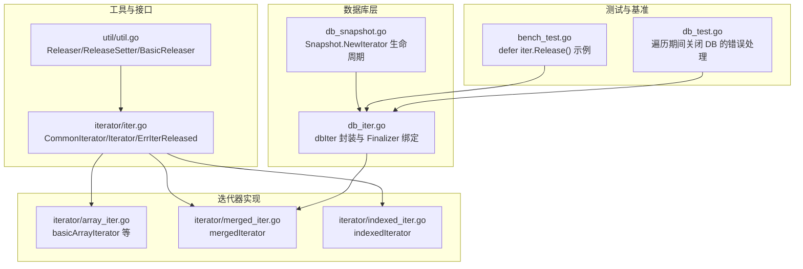
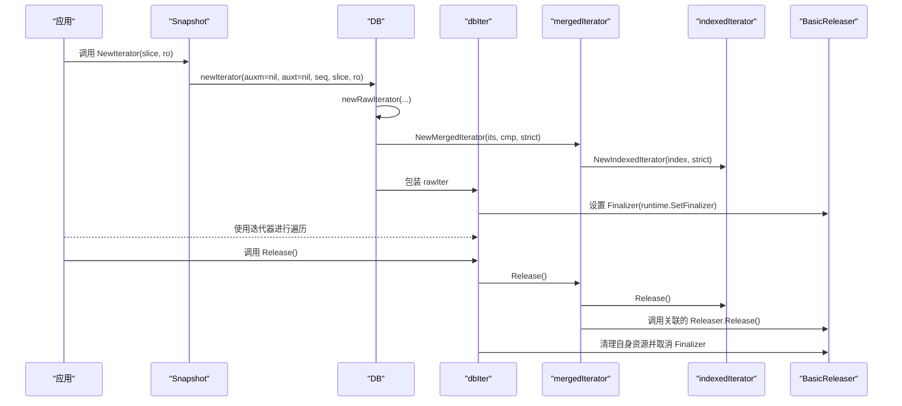
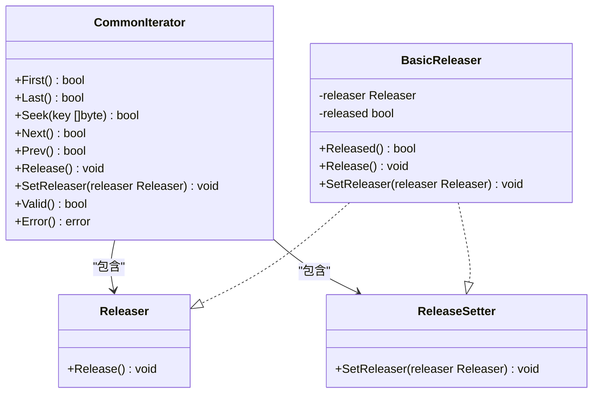
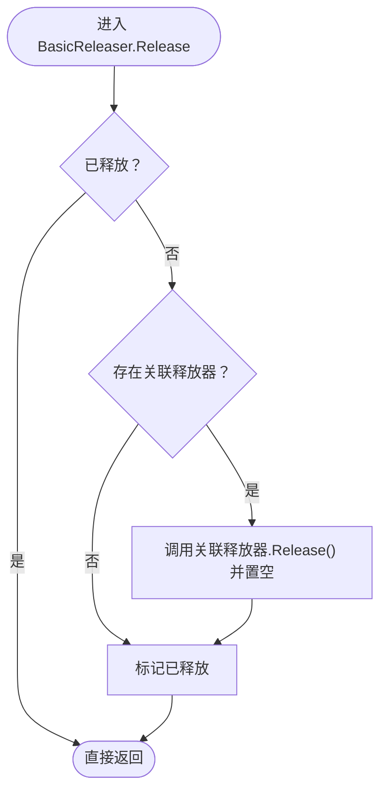
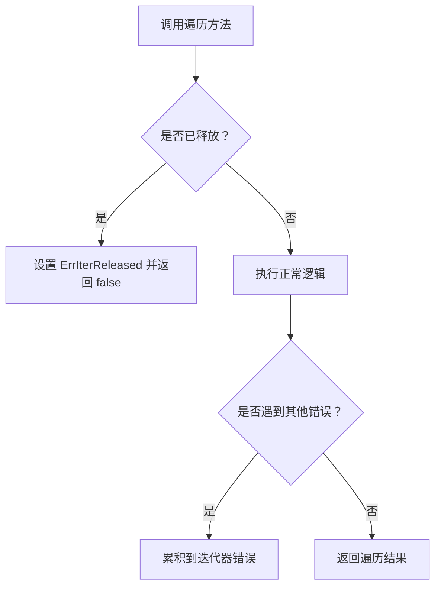
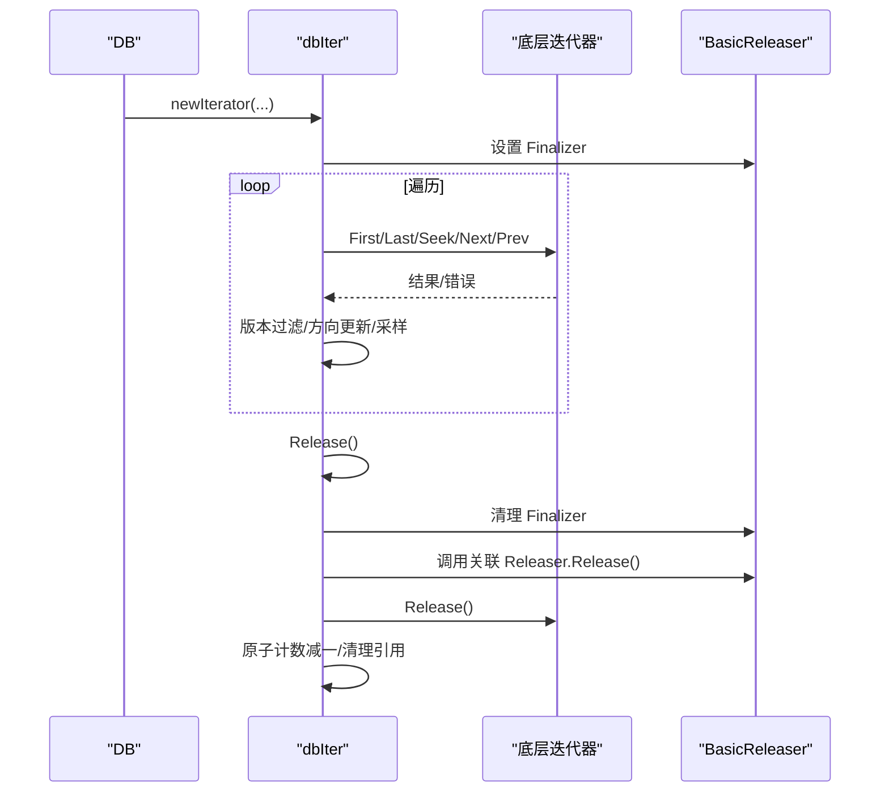
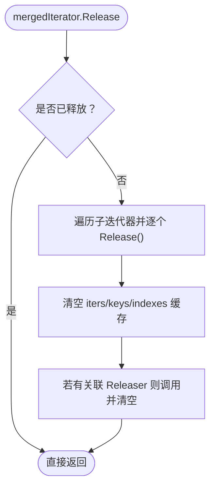
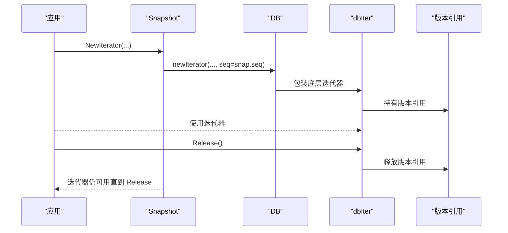
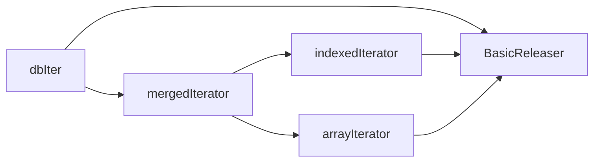

# 迭代器生命周期管理

<cite>
**本文引用的文件**
- [leveldb/util/util.go](file://leveldb/util/util.go)
- [leveldb/iterator/iter.go](file://leveldb/iterator/iter.go)
- [leveldb/db_iter.go](file://leveldb/db_iter.go)
- [leveldb/db_snapshot.go](file://leveldb/db_snapshot.go)
- [leveldb/iterator/indexed_iter.go](file://leveldb/iterator/indexed_iter.go)
- [leveldb/iterator/merged_iter.go](file://leveldb/iterator/merged_iter.go)
- [leveldb/iterator/array_iter.go](file://leveldb/iterator/array_iter.go)
- [leveldb/bench_test.go](file://leveldb/bench_test.go)
- [leveldb/db_test.go](file://leveldb/db_test.go)
</cite>

## 目录
1. [引言](#引言)
2. [项目结构](#项目结构)
3. [核心组件](#核心组件)
4. [架构总览](#架构总览)
5. [详细组件分析](#详细组件分析)
6. [依赖关系分析](#依赖关系分析)
7. [性能考量](#性能考量)
8. [故障排查指南](#故障排查指南)
9. [结论](#结论)

## 引言
本文件系统性梳理 avccDB 中迭代器的生命周期管理机制，覆盖从创建到释放的完整过程；重点阐述 CommonIterator 接口中的 Release、SetReleaser、Valid 方法的作用与实现原理；解释 BasicReleaser 在资源管理中的角色及如何防止资源泄漏；说明 ErrIterReleased 错误的触发条件与应对策略；给出正确使用 Release 的代码范例（强调 defer 模式）；分析迭代器与数据库快照、事务上下文之间的生命周期依赖关系，并确保在快照过期前正确释放迭代器；最后说明 Error 方法的累积错误机制及其在长时间遍历中的诊断价值。

## 项目结构
围绕迭代器生命周期管理的相关代码主要分布在以下模块：
- util：通用资源释放接口与基础实现 BasicReleaser
- iterator：迭代器接口与多种具体迭代器实现
- db：数据库层对迭代器的封装与生命周期绑定
- snapshot：快照与迭代器的关系
- bench/test：基准测试与测试用例中展示正确的释放模式

图表来源
- [leveldb/util/util.go](file://leveldb/util/util.go#L1-L74)
- [leveldb/iterator/iter.go](file://leveldb/iterator/iter.go#L1-L133)
- [leveldb/iterator/array_iter.go](file://leveldb/iterator/array_iter.go#L1-L182)
- [leveldb/iterator/merged_iter.go](file://leveldb/iterator/merged_iter.go#L260-L351)
- [leveldb/iterator/indexed_iter.go](file://leveldb/iterator/indexed_iter.go#L59-L241)
- [leveldb/db_iter.go](file://leveldb/db_iter.go#L63-L120)
- [leveldb/db_snapshot.go](file://leveldb/db_snapshot.go#L133-L170)
- [leveldb/bench_test.go](file://leveldb/bench_test.go#L465-L507)
- [leveldb/db_test.go](file://leveldb/db_test.go#L2977-L3002)

章节来源
- [leveldb/util/util.go](file://leveldb/util/util.go#L1-L74)
- [leveldb/iterator/iter.go](file://leveldb/iterator/iter.go#L1-L133)
- [leveldb/db_iter.go](file://leveldb/db_iter.go#L63-L120)
- [leveldb/db_snapshot.go](file://leveldb/db_snapshot.go#L133-L170)
- [leveldb/bench_test.go](file://leveldb/bench_test.go#L465-L507)
- [leveldb/db_test.go](file://leveldb/db_test.go#L2977-L3002)

## 核心组件
- CommonIterator 接口：统一了 Seek/Next/Prev 等遍历方法、资源释放 Releaser、释放器设置 ReleaseSetter、Valid 判定与 Error 错误查询。
- BasicReleaser：为实现了 Releaser/ReleaseSetter 的对象提供基础的“已释放标记”和“可选的二次释放器”机制，保证 Release 可多次调用且幂等。
- 具体迭代器实现：
  - dbIter：数据库层对底层迭代器的封装，负责版本过滤、采样、方向状态机与最终释放。
  - mergedIterator：合并多个子迭代器，支持严格模式下的错误传播与聚合。
  - indexedIterator：索引-数据两层迭代器，内部持有索引迭代器与数据迭代器。
  - arrayIterator/basicArrayIterator：基于数组的简单迭代器，用于索引或数据层。
- 快照与事务：Snapshot.NewIterator 返回的迭代器不依赖快照生命周期，但其底层版本引用在迭代器释放时才真正释放。

章节来源
- [leveldb/iterator/iter.go](file://leveldb/iterator/iter.go#L51-L133)
- [leveldb/util/util.go](file://leveldb/util/util.go#L14-L74)
- [leveldb/db_iter.go](file://leveldb/db_iter.go#L97-L123)
- [leveldb/iterator/merged_iter.go](file://leveldb/iterator/merged_iter.go#L260-L351)
- [leveldb/iterator/indexed_iter.go](file://leveldb/iterator/indexed_iter.go#L59-L241)
- [leveldb/iterator/array_iter.go](file://leveldb/iterator/array_iter.go#L39-L182)
- [leveldb/db_snapshot.go](file://leveldb/db_snapshot.go#L133-L170)

## 架构总览
下图展示了从数据库层到具体迭代器实现的生命周期链路，以及 Finalizer 与显式 Release 的双重保障。

图表来源
- [leveldb/db_snapshot.go](file://leveldb/db_snapshot.go#L133-L170)
- [leveldb/db_iter.go](file://leveldb/db_iter.go#L63-L120)
- [leveldb/db_iter.go](file://leveldb/db_iter.go#L360-L393)
- [leveldb/iterator/merged_iter.go](file://leveldb/iterator/merged_iter.go#L260-L351)
- [leveldb/iterator/indexed_iter.go](file://leveldb/iterator/indexed_iter.go#L211-L216)
- [leveldb/util/util.go](file://leveldb/util/util.go#L38-L74)

## 详细组件分析

### CommonIterator 接口与生命周期关键方法
- Release：释放与迭代器相关的所有资源，保证幂等（可多次调用），并在释放后不再允许继续遍历。
- SetReleaser：为迭代器绑定一个 Releaser，在迭代器释放时由 BasicReleaser 调用该 Releaser，从而实现“二次释放器”的资源回收（如版本引用、内存表引用等）。
- Valid：返回当前迭代位置是否有效；在某些实现中还会检查 BasicReleaser 是否已释放，以避免无效访问。

图表来源
- [leveldb/iterator/iter.go](file://leveldb/iterator/iter.go#L51-L133)
- [leveldb/util/util.go](file://leveldb/util/util.go#L14-L74)

章节来源
- [leveldb/iterator/iter.go](file://leveldb/iterator/iter.go#L51-L133)
- [leveldb/util/util.go](file://leveldb/util/util.go#L14-L74)

### BasicReleaser 的角色与资源管理
- 已释放标记：通过 released 字段避免重复释放。
- 关联释放器：通过内部的 Releaser 字段保存“二次释放器”，在 Release 时调用并清空，确保外部资源（如版本、内存表）被正确释放。
- 幂等性：Release 可多次调用，不会产生副作用。
- 安全性：SetReleaser 在已释放或已有释放器时会触发 panic，防止误用。

图表来源
- [leveldb/util/util.go](file://leveldb/util/util.go#L38-L74)

章节来源
- [leveldb/util/util.go](file://leveldb/util/util.go#L38-L74)

### 错误处理与 ErrIterReleased
- 触发条件：当迭代器已被释放（BasicReleaser.Released 为真）而仍尝试调用遍历方法（First/Last/Seek/Next/Prev）时，各实现会在方法入口处设置 ErrIterReleased 并返回 false。
- 影响范围：对于 dbIter、mergedIterator、indexedIterator、arrayIterator 等，均在对应方法入口处检查释放状态并设置错误。
- 应对策略：
  - 避免在 Release 后继续使用迭代器；
  - 使用 defer iter.Release() 保证即使发生异常也能释放；
  - 在遍历过程中定期调用 Error() 获取累积错误，以便定位问题。

图表来源
- [leveldb/iterator/merged_iter.go](file://leveldb/iterator/merged_iter.go#L67-L117)
- [leveldb/iterator/indexed_iter.go](file://leveldb/iterator/indexed_iter.go#L115-L163)
- [leveldb/iterator/array_iter.go](file://leveldb/iterator/array_iter.go#L50-L120)
- [leveldb/iterator/iter.go](file://leveldb/iterator/iter.go#L107-L132)

章节来源
- [leveldb/iterator/merged_iter.go](file://leveldb/iterator/merged_iter.go#L67-L117)
- [leveldb/iterator/indexed_iter.go](file://leveldb/iterator/indexed_iter.go#L115-L163)
- [leveldb/iterator/array_iter.go](file://leveldb/iterator/array_iter.go#L50-L120)
- [leveldb/iterator/iter.go](file://leveldb/iterator/iter.go#L107-L132)

### 数据库层 dbIter 的生命周期与 Finalizer
- 创建：newIterator 返回 dbIter，并设置 runtime.SetFinalizer，作为兜底释放手段。
- 使用：dbIter 对底层迭代器进行版本过滤、方向状态机控制与采样统计。
- 释放：Release 清理 Finalizer、调用关联 Releaser、释放底层迭代器、原子计数减一、清理引用，确保资源完全回收。
- Finalizer 与显式 Release 的关系：优先显式 Release；若未显式释放，Finalizer 会在 GC 时兜底释放，但不保证及时性。

图表来源
- [leveldb/db_iter.go](file://leveldb/db_iter.go#L63-L120)
- [leveldb/db_iter.go](file://leveldb/db_iter.go#L360-L393)

章节来源
- [leveldb/db_iter.go](file://leveldb/db_iter.go#L63-L120)
- [leveldb/db_iter.go](file://leveldb/db_iter.go#L360-L393)

### 合并迭代器 mergedIterator 的生命周期
- Release：释放所有子迭代器，清空内部缓存与索引，调用关联 Releaser（如版本引用）。
- SetReleaser：在已释放状态下禁止设置新释放器；若已有释放器再次设置会 panic，避免重复绑定。

图表来源
- [leveldb/iterator/merged_iter.go](file://leveldb/iterator/merged_iter.go#L260-L351)

章节来源
- [leveldb/iterator/merged_iter.go](file://leveldb/iterator/merged_iter.go#L260-L351)

### 索引迭代器 indexedIterator 的生命周期
- Release：先清理数据层迭代器与索引迭代器，再调用 BasicReleaser.Release。
- Valid：委托给数据层迭代器，同时在进入方法时检查释放状态并设置 ErrIterReleased。

章节来源
- [leveldb/iterator/indexed_iter.go](file://leveldb/iterator/indexed_iter.go#L211-L216)
- [leveldb/iterator/indexed_iter.go](file://leveldb/iterator/indexed_iter.go#L70-L72)

### 数组迭代器 arrayIterator 的生命周期
- Valid：在 pos 有效且未释放时返回 true。
- 各遍历方法：在方法入口检查释放状态并设置 ErrIterReleased。

章节来源
- [leveldb/iterator/array_iter.go](file://leveldb/iterator/array_iter.go#L46-L120)

### 快照与事务上下文的生命周期依赖
- Snapshot.NewIterator：返回的迭代器不依赖快照生命周期，但其底层版本引用在迭代器释放时才真正释放。
- Transaction.NewIterator：返回的迭代器对事务内的写入可见，且迭代器释放不影响事务本身。

图表来源
- [leveldb/db_snapshot.go](file://leveldb/db_snapshot.go#L133-L170)
- [leveldb/db_iter.go](file://leveldb/db_iter.go#L63-L120)

章节来源
- [leveldb/db_snapshot.go](file://leveldb/db_snapshot.go#L133-L170)
- [leveldb/db_transaction.go](file://leveldb/db_transaction.go#L61-L90)

### 正确使用 Release 的代码范例与 defer 模式
- 基准测试中展示了典型的 defer iter.Release() 模式，确保无论遍历是否完成或是否出错，迭代器都会被释放。
- 测试中演示了在遍历过程中关闭数据库时，应先检查 Error() 再释放迭代器，避免悬挂资源。

章节来源
- [leveldb/bench_test.go](file://leveldb/bench_test.go#L465-L507)
- [leveldb/db_test.go](file://leveldb/db_test.go#L2977-L3002)

## 依赖关系分析
- dbIter 依赖底层迭代器（mergedIterator/indexedIterator 等）与 BasicReleaser，通过 SetReleaser 绑定版本引用释放器。
- mergedIterator 依赖多个子迭代器，Release 时需逐一释放并清理内部缓存。
- indexedIterator 依赖索引迭代器与数据迭代器，Release 时需同时释放两者。
- arrayIterator 基于数组，不涉及外部资源，但同样遵循释放状态检查与错误累积。

图表来源
- [leveldb/db_iter.go](file://leveldb/db_iter.go#L63-L120)
- [leveldb/iterator/merged_iter.go](file://leveldb/iterator/merged_iter.go#L260-L351)
- [leveldb/iterator/indexed_iter.go](file://leveldb/iterator/indexed_iter.go#L211-L216)
- [leveldb/iterator/array_iter.go](file://leveldb/iterator/array_iter.go#L39-L182)

章节来源
- [leveldb/db_iter.go](file://leveldb/db_iter.go#L63-L120)
- [leveldb/iterator/merged_iter.go](file://leveldb/iterator/merged_iter.go#L260-L351)
- [leveldb/iterator/indexed_iter.go](file://leveldb/iterator/indexed_iter.go#L211-L216)
- [leveldb/iterator/array_iter.go](file://leveldb/iterator/array_iter.go#L39-L182)

## 性能考量
- Finalizer 兜底释放：dbIter 在创建时设置 Finalizer，避免遗漏释放导致的资源泄漏；但 Finalizer 不保证及时性，建议优先显式 Release。
- 采样与方向状态机：dbIter 在遍历时维护方向状态与采样间隔，减少不必要的开销；严格模式下错误传播更及时，有助于早期发现数据问题。
- 合并迭代器的堆管理：mergedIterator 使用堆来维护多路归并，注意在大量子迭代器场景下的内存占用与分配成本。

[本节为一般性指导，无需列出具体文件来源]

## 故障排查指南
- ErrIterReleased：当迭代器已释放仍调用遍历方法时出现。排查要点：
  - 确认是否在 Release 后继续使用迭代器；
  - 检查是否存在并发访问同一迭代器实例；
  - 使用 defer iter.Release() 防止遗漏释放。
- Error 方法的诊断价值：
  - 在长时间遍历中定期调用 Error() 获取累积错误，有助于定位数据损坏、解析失败等问题；
  - 对于 mergedIterator/indexedIterator，错误可能来自底层子迭代器或索引层。
- 快照过期与迭代器：
  - 快照释放不会自动释放迭代器；应在业务逻辑结束时显式 Release；
  - 若需要长期持有迭代器，请评估快照生命周期与业务需求的一致性。

章节来源
- [leveldb/iterator/merged_iter.go](file://leveldb/iterator/merged_iter.go#L287-L293)
- [leveldb/iterator/indexed_iter.go](file://leveldb/iterator/indexed_iter.go#L217-L225)
- [leveldb/db_snapshot.go](file://leveldb/db_snapshot.go#L168-L170)

## 结论
avccDB 的迭代器生命周期管理通过 CommonIterator 接口统一了遍历、释放与错误查询能力；BasicReleaser 提供了安全可靠的资源释放基元，结合 SetReleaser 实现“二次释放器”以释放深层资源（如版本引用）。dbIter 作为数据库层封装，承担了严格的版本过滤、方向状态机与 Finalizer 兜底释放职责。mergedIterator 与 indexedIterator 则分别在多路归并与索引-数据两层结构上实现了完整的生命周期管理。遵循 defer iter.Release() 模式、在遍历中定期检查 Error()、以及在快照过期前显式释放迭代器，是避免资源泄漏与提升系统稳定性的关键实践。