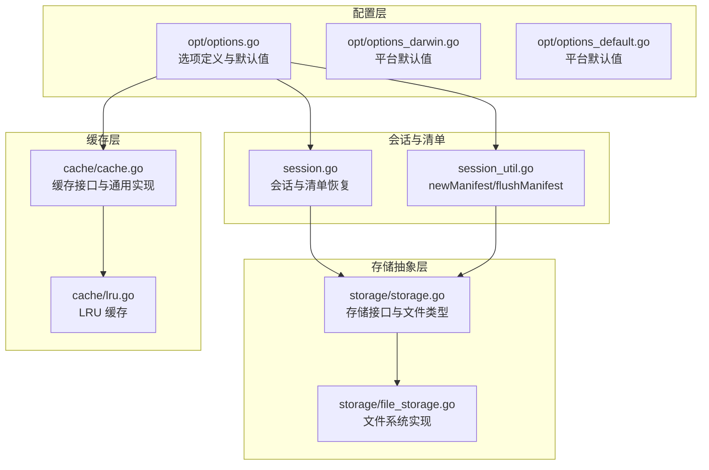
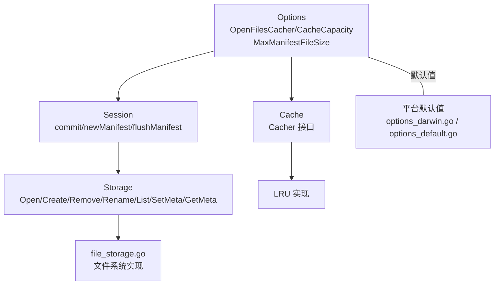
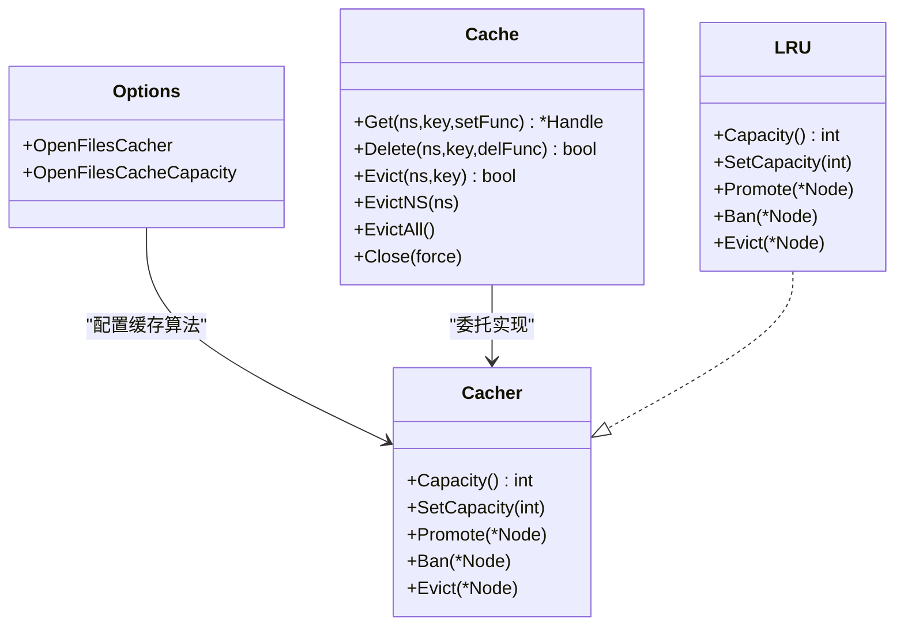
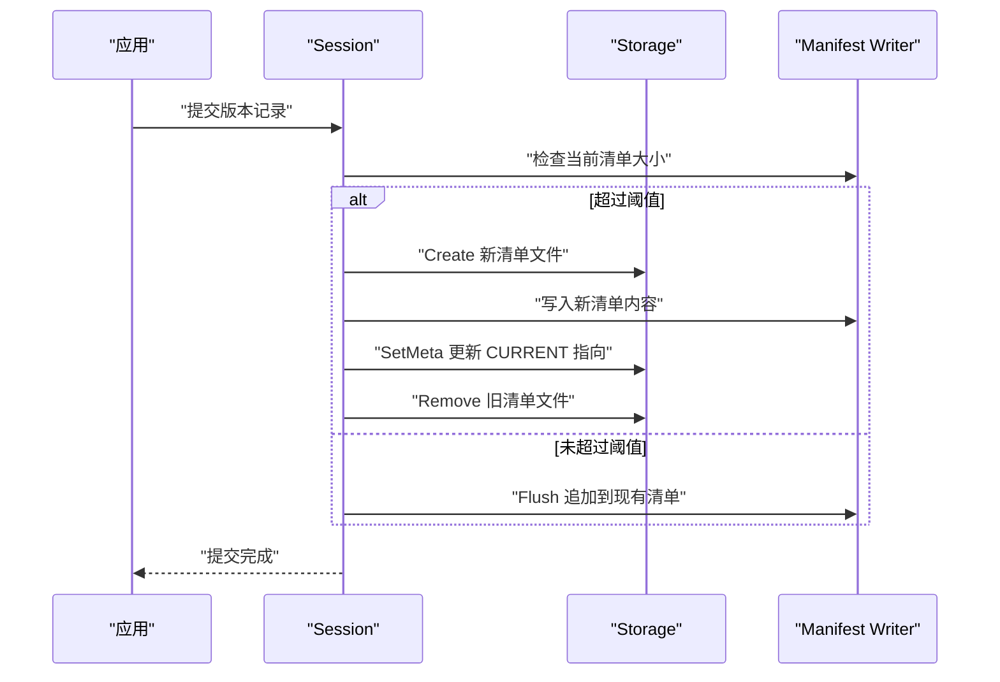
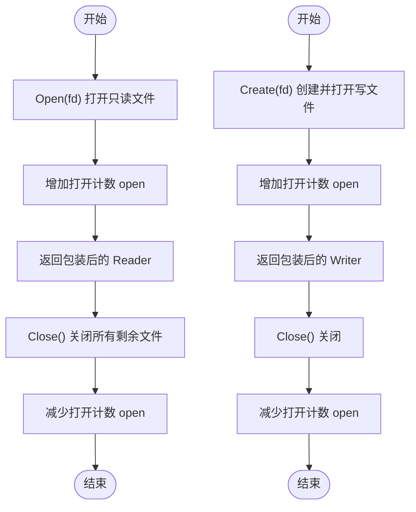
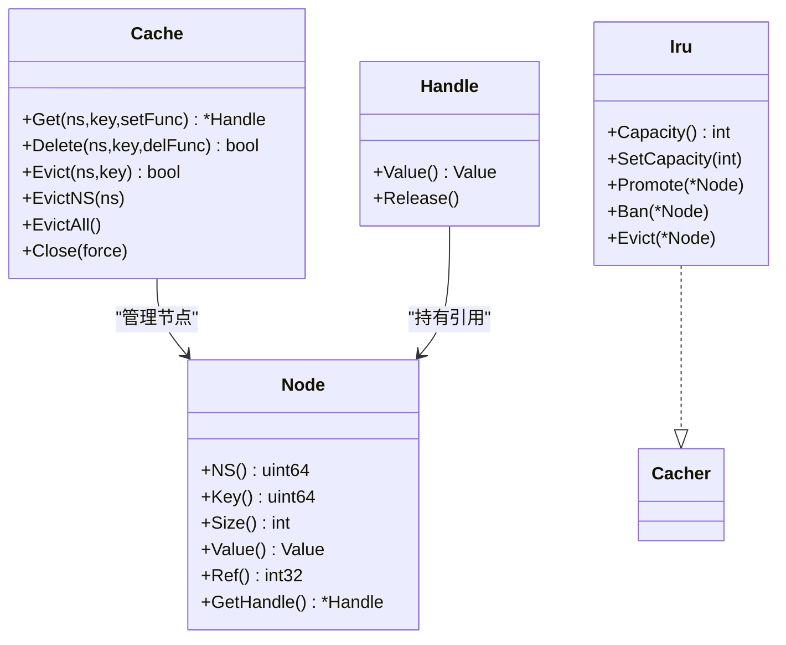
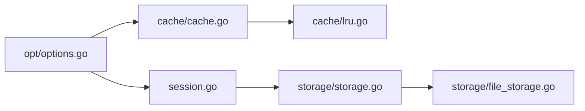

# 存储配置

<cite>
**本文引用的文件**
- [options.go](file://leveldb/opt/options.go)
- [options_darwin.go](file://leveldb/opt/options_darwin.go)
- [options_default.go](file://leveldb/opt/options_default.go)
- [storage.go](file://leveldb/storage/storage.go)
- [file_storage.go](file://leveldb/storage/file_storage.go)
- [session.go](file://leveldb/session.go)
- [session_util.go](file://leveldb/session_util.go)
- [cache.go](file://leveldb/cache/cache.go)
- [lru.go](file://leveldb/cache/lru.go)
</cite>

## 目录
1. [简介](#简介)
2. [项目结构](#项目结构)
3. [核心组件](#核心组件)
4. [架构总览](#架构总览)
5. [详细组件分析](#详细组件分析)
6. [依赖关系分析](#依赖关系分析)
7. [性能考量](#性能考量)
8. [故障排查指南](#故障排查指南)
9. [结论](#结论)

## 简介
本文件聚焦于 avccDB 的存储配置选项，围绕以下关键参数展开：
- 数据库路径与文件系统抽象：通过存储接口与文件系统实现，统一管理数据库文件的打开、读写、重命名与删除。
- 文件打开缓存（OpenFilesCacher 与 OpenFilesCacheCapacity）：控制数据库在运行时对已打开文件句柄的缓存策略，避免频繁打开/关闭带来的系统调用开销。
- 清单文件大小限制（MaxManifestFileSize）：控制 MANIFEST 日志文件的增长上限，超过阈值后触发新清单文件创建，保障元数据一致性与可恢复性。

本文将解释这些配置如何影响文件系统行为与存储效率，并给出针对 SSD/HDD 的配置建议；同时阐述文件描述符管理与缓存机制的工作原理，以及配置不当可能引发的资源耗尽问题与解决方案。

## 项目结构
与存储配置直接相关的模块主要分布在以下位置：
- 配置层：leveldb/opt 下的选项定义与默认值
- 存储抽象层：leveldb/storage 下的存储接口与文件系统实现
- 会话与清单：leveldb/session 与 session_util 中的清单创建与切换逻辑
- 缓存层：leveldb/cache 下的通用缓存接口与 LRU 实现

图表来源
- [options.go](file://leveldb/opt/options.go#L1-L120)
- [options_darwin.go](file://leveldb/opt/options_darwin.go#L1-L8)
- [options_default.go](file://leveldb/opt/options_default.go#L1-L8)
- [storage.go](file://leveldb/storage/storage.go#L1-L120)
- [file_storage.go](file://leveldb/storage/file_storage.go#L1-L120)
- [session.go](file://leveldb/session.go#L1-L120)
- [session_util.go](file://leveldb/session_util.go#L391-L491)
- [cache.go](file://leveldb/cache/cache.go#L1-L120)
- [lru.go](file://leveldb/cache/lru.go#L1-L80)

章节来源
- [options.go](file://leveldb/opt/options.go#L1-L120)
- [storage.go](file://leveldb/storage/storage.go#L1-L120)
- [file_storage.go](file://leveldb/storage/file_storage.go#L1-L120)
- [session.go](file://leveldb/session.go#L1-L120)
- [session_util.go](file://leveldb/session_util.go#L391-L491)
- [cache.go](file://leveldb/cache/cache.go#L1-L120)
- [lru.go](file://leveldb/cache/lru.go#L1-L80)

## 核心组件
- 选项与默认值（OpenFilesCacher、OpenFilesCacheCapacity、MaxManifestFileSize）
- 存储接口与文件系统实现（文件打开/创建/删除/重命名、锁与日志）
- 会话与清单（清单创建、刷新、切换与 CURRENT 元数据）
- 缓存接口与 LRU 实现（节点生命周期、容量控制、淘汰）

章节来源
- [options.go](file://leveldb/opt/options.go#L362-L424)
- [options_darwin.go](file://leveldb/opt/options_darwin.go#L1-L8)
- [options_default.go](file://leveldb/opt/options_default.go#L1-L8)
- [storage.go](file://leveldb/storage/storage.go#L1-L120)
- [file_storage.go](file://leveldb/storage/file_storage.go#L465-L585)
- [session.go](file://leveldb/session.go#L180-L242)
- [session_util.go](file://leveldb/session_util.go#L391-L491)
- [cache.go](file://leveldb/cache/cache.go#L1-L120)
- [lru.go](file://leveldb/cache/lru.go#L1-L80)

## 架构总览
下图展示了存储配置在整体架构中的作用：Options 决定缓存策略与清单大小限制；Session 在提交版本时根据清单大小决定是否创建新清单；Storage 抽象屏蔽了底层文件系统的差异；Cache 提供通用缓存能力，LRU 实现具体淘汰策略。

图表来源
- [options.go](file://leveldb/opt/options.go#L362-L424)
- [options_darwin.go](file://leveldb/opt/options_darwin.go#L1-L8)
- [options_default.go](file://leveldb/opt/options_default.go#L1-L8)
- [session.go](file://leveldb/session.go#L180-L242)
- [session_util.go](file://leveldb/session_util.go#L391-L491)
- [storage.go](file://leveldb/storage/storage.go#L1-L120)
- [file_storage.go](file://leveldb/storage/file_storage.go#L465-L585)
- [cache.go](file://leveldb/cache/cache.go#L1-L120)
- [lru.go](file://leveldb/cache/lru.go#L1-L80)

## 详细组件分析

### 组件一：OpenFilesCacher 与 OpenFilesCacheCapacity
- 作用
  - OpenFilesCacher：指定用于“已打开文件”缓存的算法（例如 LRU），以减少频繁打开/关闭文件带来的系统调用与磁盘寻道开销。
  - OpenFilesCacheCapacity：限制该缓存的最大容量（单位通常为文件句柄数量）。当达到容量上限时，应依据缓存算法进行淘汰。
- 默认值与平台差异
  - macOS 默认容量为 200；其他平台默认容量为 500。
- 工作流程
  - 当数据库需要打开某个文件时，优先从 OpenFilesCacher 中查找；若命中则复用句柄；未命中则实际打开文件，并通过 Cacher.Promote 将其加入缓存；当缓存满或不再使用时，通过 Evict/Ban 进行淘汰或禁止再次提升。
- 影响
  - 合理设置可显著降低文件句柄数量与系统调用次数，提高并发读写吞吐；容量过小会导致频繁淘汰与重复打开，容量过大则可能占用过多内存或接近系统文件描述符上限。

图表来源
- [options.go](file://leveldb/opt/options.go#L362-L424)
- [cache.go](file://leveldb/cache/cache.go#L1-L120)
- [lru.go](file://leveldb/cache/lru.go#L1-L80)

章节来源
- [options.go](file://leveldb/opt/options.go#L362-L424)
- [options_darwin.go](file://leveldb/opt/options_darwin.go#L1-L8)
- [options_default.go](file://leveldb/opt/options_default.go#L1-L8)
- [cache.go](file://leveldb/cache/cache.go#L1-L120)
- [lru.go](file://leveldb/cache/lru.go#L1-L80)

### 组件二：MaxManifestFileSize（清单文件大小限制）
- 作用
  - 控制 MANIFEST 日志文件的最大大小。当当前清单大小达到或超过该阈值时，会触发创建新的清单文件，旧清单会被清理。
- 触发点
  - 在提交版本（commit）时检查当前清单大小与阈值比较，若超过则调用 newManifest 创建新清单并更新 CURRENT 元数据。
- 影响
  - 合理的阈值有助于：
    - 降低单个清单文件过大导致的恢复时间与内存占用；
    - 减少长时间持有大文件句柄的时间，降低文件系统压力；
    - 在极端情况下避免清单文件无限增长。
  - 过小的阈值会频繁创建新清单，增加写放大与磁盘碎片；过大则可能影响恢复速度与可靠性。

图表来源
- [session.go](file://leveldb/session.go#L180-L242)
- [session_util.go](file://leveldb/session_util.go#L391-L491)
- [storage.go](file://leveldb/storage/storage.go#L150-L188)

章节来源
- [session.go](file://leveldb/session.go#L180-L242)
- [session_util.go](file://leveldb/session_util.go#L391-L491)
- [storage.go](file://leveldb/storage/storage.go#L150-L188)

### 组件三：文件描述符管理与文件系统行为
- 文件打开/创建/删除/重命名
  - file_storage.Open/Create/Remove/Rename 提供对文件的底层操作，内部维护打开计数 open，确保在关闭前无文件仍处于打开状态。
- 锁与元数据
  - Storage.Lock 提供互斥锁，防止多进程同时访问同一数据库目录；SetMeta/GetMeta 通过 CURRENT/CURRENT.bak 等文件记录当前清单文件描述符。
- 文件类型与命名
  - 支持 MANIFEST、JOURNAL、TABLE、TEMP 等文件类型，文件名格式由工具函数生成与解析，兼容旧名称以便迁移。

图表来源
- [file_storage.go](file://leveldb/storage/file_storage.go#L465-L585)
- [storage.go](file://leveldb/storage/storage.go#L150-L188)

章节来源
- [file_storage.go](file://leveldb/storage/file_storage.go#L465-L585)
- [storage.go](file://leveldb/storage/storage.go#L1-L120)

### 组件四：缓存机制（Node/Handle 与 LRU）
- 节点与句柄
  - Node 表示缓存项，Handle 是对外持有的引用；Release 时通过原子计数判断是否释放并触发删除。
- LRU 策略
  - 通过双向链表维护最近使用顺序；Promote 将节点插入最近端；SetCapacity/容量调整时从尾部逐出；Ban 禁止再次提升。
- 与存储的关系
  - OpenFilesCacher 可以使用 LRU 对“已打开文件”进行缓存，从而减少频繁打开/关闭文件带来的系统调用与磁盘寻道。

图表来源
- [cache.go](file://leveldb/cache/cache.go#L1-L200)
- [lru.go](file://leveldb/cache/lru.go#L1-L159)

章节来源
- [cache.go](file://leveldb/cache/cache.go#L1-L200)
- [lru.go](file://leveldb/cache/lru.go#L1-L159)

## 依赖关系分析
- Options 与 Session
  - Options.GetMaxManifestFileSize 决定 Session.commit 是否触发 newManifest；Options.GetOpenFilesCacher/GetOpenFilesCacheCapacity 决定文件打开缓存策略。
- Session 与 Storage
  - Session 在创建/刷新清单时通过 Storage 接口执行 Create/SetMeta/Remove 等操作；通过 Open/List 获取文件列表与句柄。
- Storage 与 file_storage
  - file_storage 实现了 Storage 接口，负责具体的文件系统操作与锁管理。
- Cache/LRU
  - OpenFilesCacher 可以委托 LRU 实现，从而将“已打开文件”作为缓存对象进行管理。

图表来源
- [options.go](file://leveldb/opt/options.go#L362-L424)
- [session.go](file://leveldb/session.go#L180-L242)
- [storage.go](file://leveldb/storage/storage.go#L1-L120)
- [file_storage.go](file://leveldb/storage/file_storage.go#L465-L585)
- [cache.go](file://leveldb/cache/cache.go#L1-L120)
- [lru.go](file://leveldb/cache/lru.go#L1-L80)

章节来源
- [options.go](file://leveldb/opt/options.go#L362-L424)
- [session.go](file://leveldb/session.go#L180-L242)
- [storage.go](file://leveldb/storage/storage.go#L1-L120)
- [file_storage.go](file://leveldb/storage/file_storage.go#L465-L585)
- [cache.go](file://leveldb/cache/cache.go#L1-L120)
- [lru.go](file://leveldb/cache/lru.go#L1-L80)

## 性能考量
- OpenFilesCacheCapacity
  - 建议根据工作集大小与并发访问模式设置。对于高并发、热点文件较多的场景，适当增大容量可降低打开/关闭频率；但需注意系统文件描述符上限。
- MaxManifestFileSize
  - 增大阈值可减少频繁创建新清单，降低写放大；但会增加恢复时间与内存占用。建议结合业务写入节奏与硬件条件权衡。
- 平台默认值
  - macOS 默认容量较低，生产环境建议显式设置以适配实际负载。
- 文件系统介质
  - SSD：延迟低、随机 IO 强，可适度提高 OpenFilesCacheCapacity 与 MaxManifestFileSize，以减少系统调用与清单切换。
  - HDD：寻道与旋转延迟高，更应重视减少打开/关闭与清单切换，建议保守设置 OpenFilesCacheCapacity，合理设置 MaxManifestFileSize，避免频繁创建新清单。

[本节为通用指导，不直接分析具体文件]

## 故障排查指南
- 现象：频繁出现“清单过大”或“恢复缓慢”
  - 排查：检查 MaxManifestFileSize 设置是否过小；观察提交日志中是否频繁触发 newManifest。
  - 处理：适当增大阈值，或优化写入模式减少一次性大量变更。
- 现象：文件句柄不足或打开失败
  - 排查：确认 OpenFilesCacheCapacity 是否过大导致接近系统限制；检查是否存在未正确关闭的文件句柄。
  - 处理：降低 OpenFilesCacheCapacity 或优化并发访问；确保应用在异常路径也能释放句柄。
- 现象：存储层报错（如 ErrClosed/ErrLocked）
  - 排查：确认 Storage 是否被提前关闭；确认 Lock 是否被其他进程占用。
  - 处理：避免重复关闭；确保数据库目录唯一性与锁释放。

章节来源
- [file_storage.go](file://leveldb/storage/file_storage.go#L465-L585)
- [storage.go](file://leveldb/storage/storage.go#L150-L188)
- [session_util.go](file://leveldb/session_util.go#L391-L491)

## 结论
- OpenFilesCacher 与 OpenFilesCacheCapacity 通过缓存“已打开文件”句柄，有效降低系统调用与磁盘寻道开销，建议结合工作集与并发场景合理设置。
- MaxManifestFileSize 通过控制清单文件大小，平衡恢复性能与写放大，建议根据介质与业务特征进行调优。
- 文件描述符管理与存储抽象保证了跨平台一致性与可靠性，配合合理的缓存策略可显著提升整体存储效率与稳定性。