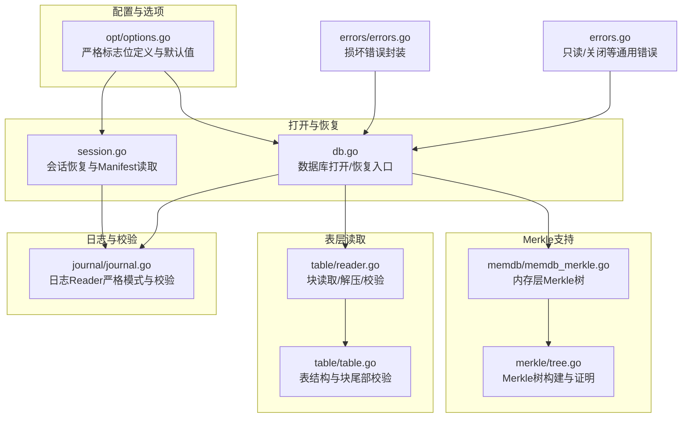
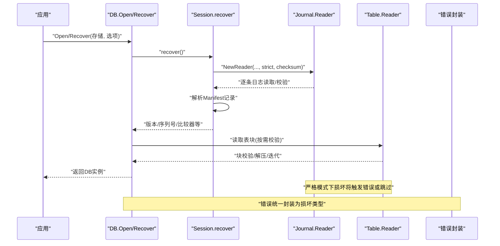
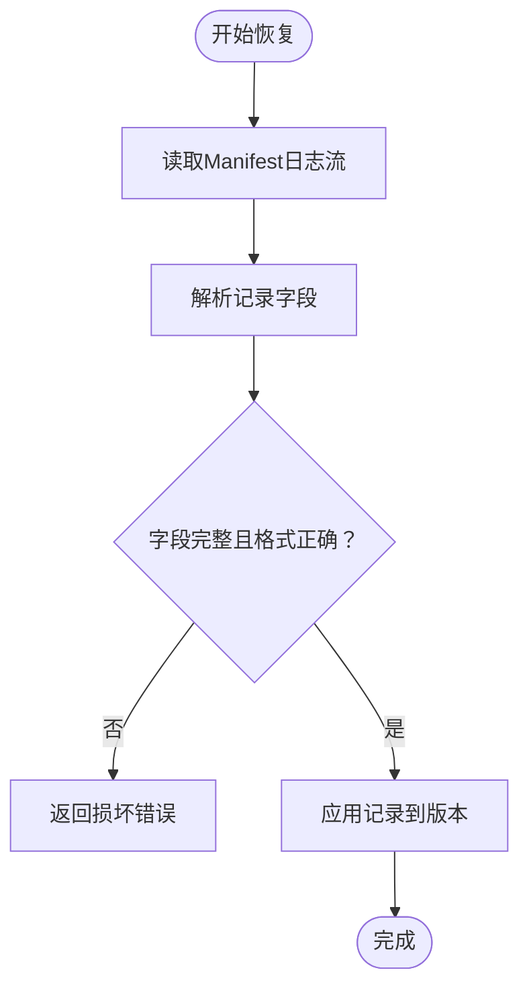
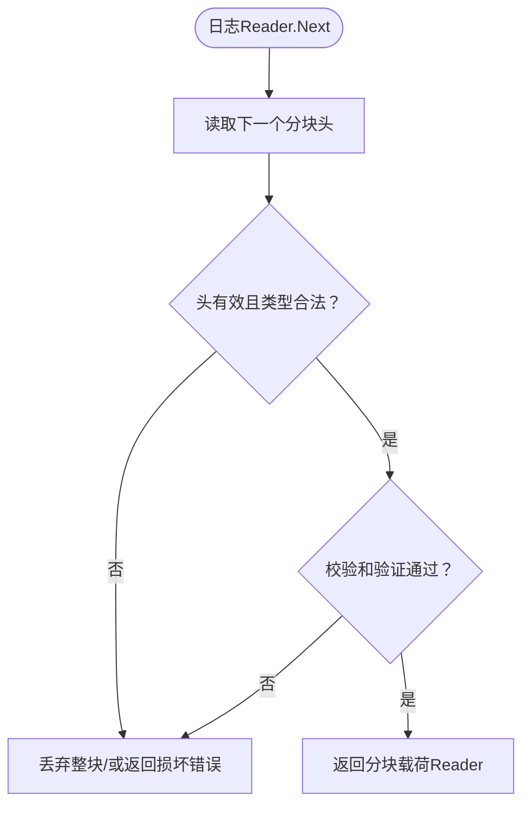
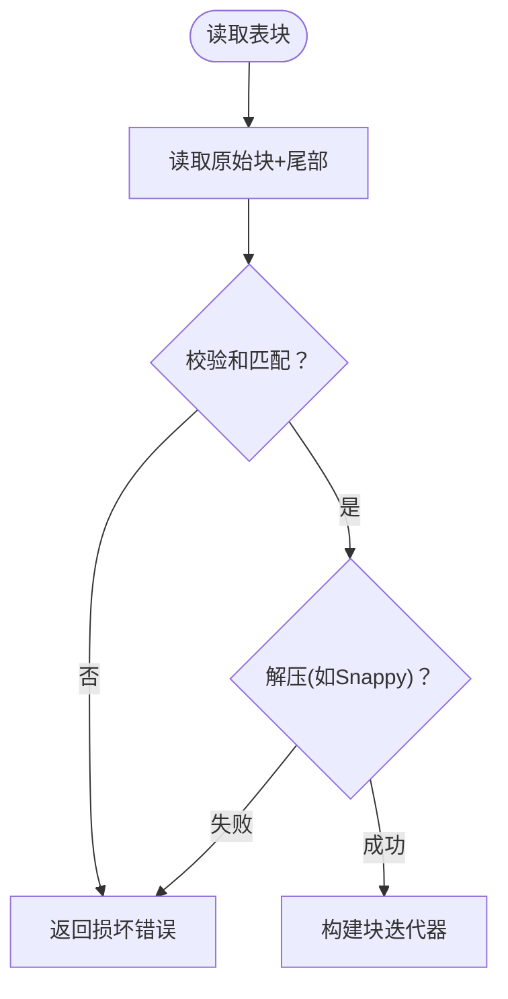
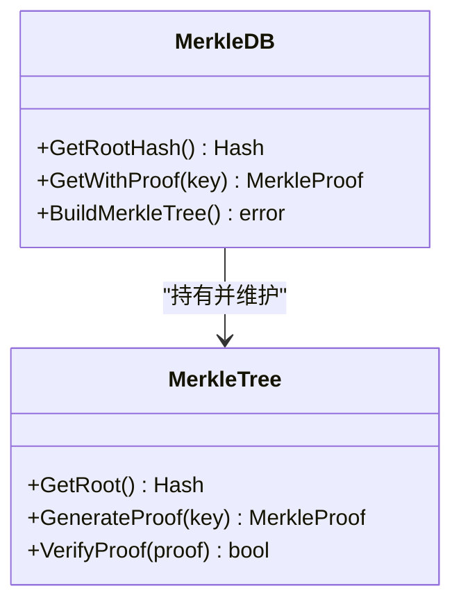
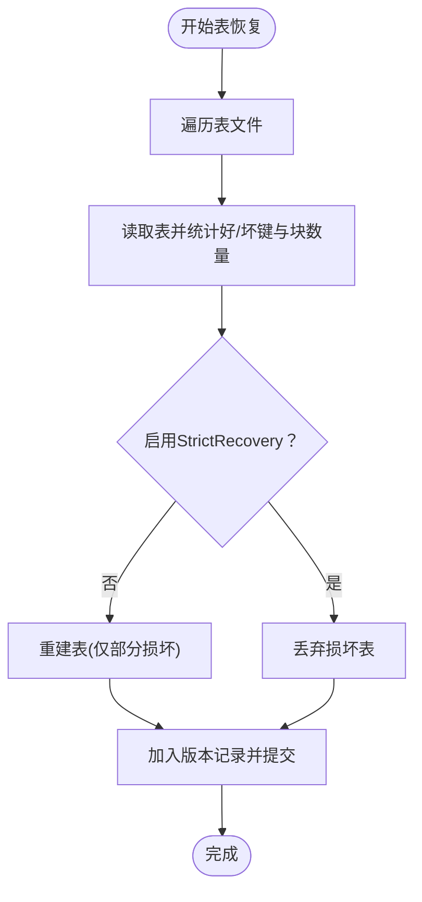
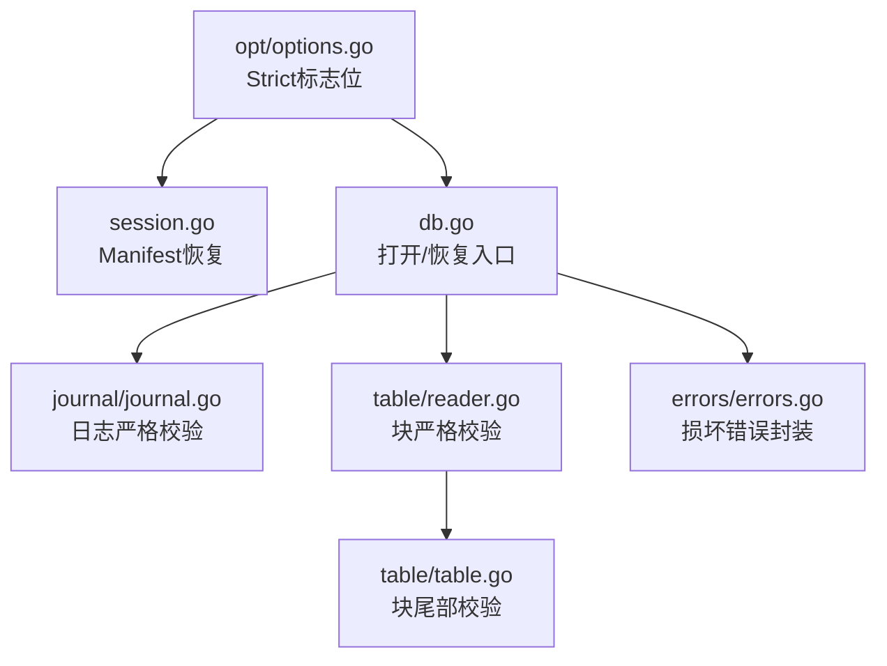

# 安全与完整性配置

<cite>
**本文引用的文件**
- [options.go](file://leveldb/opt/options.go)
- [options.go（主模块）](file://leveldb/options.go)
- [session.go](file://leveldb/session.go)
- [session_record.go](file://leveldb/session_record.go)
- [journal.go](file://leveldb/journal/journal.go)
- [table.go](file://leveldb/table/table.go)
- [reader.go](file://leveldb/table/reader.go)
- [memdb_merkle.go](file://leveldb/memdb/merkle.go)
- [tree.go](file://leveldb/merkle/tree.go)
- [db.go](file://leveldb/db.go)
- [errors.go](file://leveldb/errors.go)
- [errors/errors.go](file://leveldb/errors/errors.go)
- [util.go](file://leveldb/util.go)
</cite>

## 目录
1. [引言](#引言)
2. [项目结构](#项目结构)
3. [核心组件](#核心组件)
4. [架构总览](#架构总览)
5. [详细组件分析](#详细组件分析)
6. [依赖关系分析](#依赖关系分析)
7. [性能考量](#性能考量)
8. [故障排查指南](#故障排查指南)
9. [结论](#结论)
10. [附录：最佳实践清单](#附录最佳实践清单)

## 引言
本文件聚焦于 avccDB 的安全与完整性配置，系统性阐述“严格模式”（Strict）相关配置项及其在数据完整性与防篡改方面的保障机制。重点覆盖：
- StrictManifest、StrictJournalChecksum、StrictBlockChecksum 等严格标志位的行为边界与影响范围
- 与 Merkle 树验证相关的安全保证（含内存层与表层）
- 不同严格级别对性能与可用性的权衡
- 生产环境中的安全配置建议与故障恢复策略

## 项目结构
围绕安全与完整性，本仓库的关键模块分布如下：
- 配置层：选项定义与默认值（opt/options.go）
- 打开/恢复流程：会话初始化、Manifest 恢复、日志恢复（leveldb/session.go、db.go）
- 日志读写与校验：日志记录器与严格模式下的块/分块校验（journal/journal.go）
- 表层读取与校验：块级校验、压缩解码、过滤器与索引块（table/reader.go、table/table.go）
- Merkle 支持：内存层与表层的 Merkle 树构建与证明生成（memdb/memdb_merkle.go、merkle/tree.go）
- 错误类型与一致性判断：统一的错误封装与“是否损坏”的判定（errors/errors.go、errors.go）

图表来源
- [options.go（选项定义）](file://leveldb/opt/options.go#L130-L174)
- [session.go](file://leveldb/session.go#L128-L208)
- [db.go](file://leveldb/db.go#L100-L175)
- [journal.go](file://leveldb/journal/journal.go#L149-L201)
- [table.go](file://leveldb/table/table.go#L144-L174)
- [reader.go](file://leveldb/table/reader.go#L568-L622)
- [memdb_merkle.go](file://leveldb/memdb/memdb_merkle.go#L1-L181)
- [tree.go](file://leveldb/merkle/tree.go#L1-L120)
- [errors/errors.go](file://leveldb/errors/errors.go#L50-L79)
- [errors.go](file://leveldb/errors.go#L14-L21)

章节来源
- [options.go（选项定义）](file://leveldb/opt/options.go#L130-L174)
- [session.go](file://leveldb/session.go#L128-L208)
- [db.go](file://leveldb/db.go#L100-L175)
- [journal.go](file://leveldb/journal/journal.go#L149-L201)
- [table.go](file://leveldb/table/table.go#L144-L174)
- [reader.go](file://leveldb/table/reader.go#L568-L622)
- [memdb_merkle.go](file://leveldb/memdb/memdb_merkle.go#L1-L181)
- [tree.go](file://leveldb/merkle/tree.go#L1-L120)
- [errors/errors.go](file://leveldb/errors/errors.go#L50-L79)
- [errors.go](file://leveldb/errors.go#L14-L21)

## 核心组件
- 严格模式标志位（Strict）：通过位掩码组合控制 Manifest、日志、块、压缩、只读、恢复等行为
- 日志严格模式：在日志块/分块层面启用严格校验，遇到损坏时可直接报错或跳过
- 表块严格模式：在读取与压缩解码阶段进行块尾部校验，确保块内数据完整性
- Manifest 恢复严格模式：Manifest 解码失败时是否直接报错，避免加载损坏元信息
- Merkle 支持：内存层与表层均可生成 Merkle 根与证明，用于外部验证与审计

章节来源
- [options.go（选项定义）](file://leveldb/opt/options.go#L130-L174)
- [journal.go](file://leveldb/journal/journal.go#L149-L201)
- [reader.go](file://leveldb/table/reader.go#L568-L622)
- [session.go](file://leveldb/session.go#L128-L208)
- [memdb_merkle.go](file://leveldb/memdb/memdb_merkle.go#L1-L181)
- [tree.go](file://leveldb/merkle/tree.go#L1-L120)

## 架构总览
下图展示了从打开数据库到读取数据的关键路径，以及严格模式如何贯穿各层以保障完整性与一致性。

图表来源
- [db.go](file://leveldb/db.go#L100-L175)
- [session.go](file://leveldb/session.go#L128-L208)
- [journal.go](file://leveldb/journal/journal.go#L149-L201)
- [reader.go](file://leveldb/table/reader.go#L568-L622)
- [errors/errors.go](file://leveldb/errors/errors.go#L50-L79)

## 详细组件分析

### 严格模式标志位详解
- StrictManifest：Manifest 解码严格模式。当启用时，Manifest 中缺失必要字段或格式不正确将导致打开失败，防止加载损坏元信息。
- StrictJournalChecksum：日志分块校验严格模式。启用后，日志分块头中的校验和将被验证；校验失败将触发错误。
- StrictJournal：日志损坏严格模式。启用后，日志块/分块损坏将直接报错，阻止打开包含损坏日志的数据库。
- StrictBlockChecksum：表块校验严格模式。启用后，读取表块时将验证块尾部校验和；压缩解码与校验失败将报错。
- StrictCompaction：压缩（合并）严格模式。启用后，表块损坏会导致合并失败，并进入只读模式。
- StrictReader：读取严格模式。启用后，表块损坏会中断读操作。
- StrictRecovery：恢复严格模式。启用后，恢复过程中若检测到损坏表块，将丢弃该表（而非尝试修复），以保证一致性。

默认严格模式（DefaultStrict）包含：StrictJournalChecksum、StrictBlockChecksum、StrictCompaction、StrictReader。这体现了对日志与块校验的强制要求，以及对压缩与读取行为的严格约束。

章节来源
- [options.go（选项定义）](file://leveldb/opt/options.go#L130-L174)
- [options.go（主模块）](file://leveldb/options.go#L14-L23)

### Manifest 恢复与 StrictManifest
- Manifest 读取由 Journal Reader 提供，其构造时接收 strict 与 checksum 参数。
- 在恢复流程中，会根据 StrictManifest 决定是否对 Manifest 记录进行严格校验。
- 若 Manifest 缺失关键字段或格式异常，将返回“损坏”错误，阻止数据库打开。

图表来源
- [session.go](file://leveldb/session.go#L128-L208)
- [session_record.go](file://leveldb/session_record.go#L198-L245)

章节来源
- [session.go](file://leveldb/session.go#L128-L208)
- [session_record.go](file://leveldb/session_record.go#L198-L245)

### 日志严格模式与校验
- Journal Reader 在构造时接受 strict 与 checksum 标志。
- 当 strict 为真时，遇到无效分块类型、零头、长度溢出、校验和不匹配等情况，将直接返回损坏错误。
- checksum 为真时，会对分块类型与载荷计算校验和并与头部校验和比对。
- 严格模式下，损坏的日志块会被视为不可恢复，从而阻止数据库打开。

图表来源
- [journal.go](file://leveldb/journal/journal.go#L149-L201)
- [journal.go](file://leveldb/journal/journal.go#L244-L341)

章节来源
- [journal.go](file://leveldb/journal/journal.go#L149-L201)
- [journal.go](file://leveldb/journal/journal.go#L244-L341)

### 表块严格模式与校验
- 表块尾部包含压缩类型与校验和，读取时先进行校验和比对，再进行解压。
- 压缩类型未知或解压失败均被视为损坏。
- 严格模式下，任何块损坏都会导致读取失败，避免污染后续读取结果。

图表来源
- [reader.go](file://leveldb/table/reader.go#L568-L622)
- [table.go](file://leveldb/table/table.go#L144-L174)

章节来源
- [reader.go](file://leveldb/table/reader.go#L568-L622)
- [table.go](file://leveldb/table/table.go#L144-L174)

### Merkle 树验证与安全保证
- 内存层（MemDB）：支持基于当前状态构建 Merkle 树，提供根哈希与证明生成接口，便于外部审计与验证。
- 表层（Table）：支持在表中嵌入 Merkle 树元数据，读取时可生成证明，用于验证键值存在性或不存在性。
- 与严格模式协同：启用 StrictBlockChecksum 后，表块损坏将被严格拦截；结合 Merkle 证明可对外部验证提供更强的完整性保障。

图表来源
- [memdb_merkle.go](file://leveldb/memdb/memdb_merkle.go#L1-L181)
- [tree.go](file://leveldb/merkle/tree.go#L1-L120)

章节来源
- [memdb_merkle.go](file://leveldb/memdb/memdb_merkle.go#L1-L181)
- [tree.go](file://leveldb/merkle/tree.go#L1-L120)

### 故障恢复与 StrictRecovery
- 恢复流程会扫描所有表文件，逐个评估损坏情况。
- 当启用 StrictRecovery 时，若检测到损坏（键或块损坏），将丢弃该表，避免污染新版本。
- 未损坏的数据会被重建为新的表文件并加入版本记录，最终提交新的 Manifest。

图表来源
- [db.go](file://leveldb/db.go#L295-L497)

章节来源
- [db.go](file://leveldb/db.go#L295-L497)

## 依赖关系分析
- 严格模式由选项层定义，贯穿打开/恢复、日志读取、表块读取与恢复流程。
- Journal Reader 与 Table Reader 在严格模式下分别承担日志与块的完整性校验职责。
- 错误类型统一封装为“损坏”错误，便于上层判断与恢复策略选择。

图表来源
- [options.go（选项定义）](file://leveldb/opt/options.go#L130-L174)
- [session.go](file://leveldb/session.go#L128-L208)
- [db.go](file://leveldb/db.go#L100-L175)
- [journal.go](file://leveldb/journal/journal.go#L149-L201)
- [reader.go](file://leveldb/table/reader.go#L568-L622)
- [table.go](file://leveldb/table/table.go#L144-L174)
- [errors/errors.go](file://leveldb/errors/errors.go#L50-L79)

章节来源
- [options.go（选项定义）](file://leveldb/opt/options.go#L130-L174)
- [session.go](file://leveldb/session.go#L128-L208)
- [db.go](file://leveldb/db.go#L100-L175)
- [journal.go](file://leveldb/journal/journal.go#L149-L201)
- [reader.go](file://leveldb/table/reader.go#L568-L622)
- [table.go](file://leveldb/table/table.go#L144-L174)
- [errors/errors.go](file://leveldb/errors/errors.go#L50-L79)

## 性能考量
- 严格模式提升安全性的同时，会增加 CPU 开销：
  - 日志严格模式：每次分块读取均进行校验，可能带来额外的 CPU 压力。
  - 表块严格模式：块尾部校验与压缩解码均需执行，读取延迟上升。
  - 默认严格模式已开启日志与块校验，兼顾安全与性能。
- 只读模式与恢复模式下的严格行为：
  - 只读模式下仍会进行必要的校验，避免加载损坏数据。
  - 恢复模式下启用 StrictRecovery 将丢弃损坏表，避免重建过程中的额外 IO 与 CPU。
- 建议：
  - 生产环境优先使用默认严格模式，确保日志与块校验开启。
  - 对吞吐敏感场景可考虑关闭 StrictJournal 与 StrictBlockChecksum，但需配合其他审计手段（如定期快照与外部校验）。

[本节为通用指导，无需列出具体文件来源]

## 故障排查指南
- 判断是否损坏：使用“是否损坏”判断函数识别错误类型，区分可恢复与不可恢复的损坏。
- 常见症状与定位：
  - Manifest 缺失或损坏：Manifest 恢复阶段直接失败，需使用恢复功能重建。
  - 日志损坏：日志读取阶段报错，检查磁盘与文件系统，必要时启用严格模式以快速暴露问题。
  - 表块损坏：读取表块时校验失败，可通过恢复流程重建表或降级为只读模式。
- 恢复流程：
  - 使用恢复函数扫描并重建表，丢弃损坏表，保留可用数据。
  - 恢复完成后重新打开数据库，确认序列号与数据一致性。

章节来源
- [errors/errors.go](file://leveldb/errors/errors.go#L50-L79)
- [db.go](file://leveldb/db.go#L295-L497)
- [errors.go](file://leveldb/errors.go#L14-L21)

## 结论
- 严格模式通过在关键环节（Manifest、日志、表块）强制校验，显著提升了数据完整性与抗篡改能力。
- 默认严格模式在安全与性能之间取得平衡，适合大多数生产场景。
- 与 Merkle 树结合，可在应用层提供更强的审计与验证能力。
- 发生损坏时，应优先采用恢复流程丢弃损坏数据，确保系统稳定运行。

[本节为总结性内容，无需列出具体文件来源]

## 附录：最佳实践清单
- 生产环境建议
  - 使用默认严格模式（包含日志与块校验）
  - 启用 StrictCompaction 与 StrictReader，确保损坏不会传播
  - 对关键数据启用 Merkle 树，提供外部验证与审计
- 性能与安全平衡
  - 在高吞吐场景可谨慎关闭 StrictJournal 与 StrictBlockChecksum，但需加强备份与监控
  - 通过定期快照与外部校验弥补严格模式之外的潜在风险
- 故障恢复
  - 出现损坏时优先使用恢复流程重建表，避免手动干预
  - 恢复后验证序列号与数据一致性，确保业务连续性

[本节为通用指导，无需列出具体文件来源]