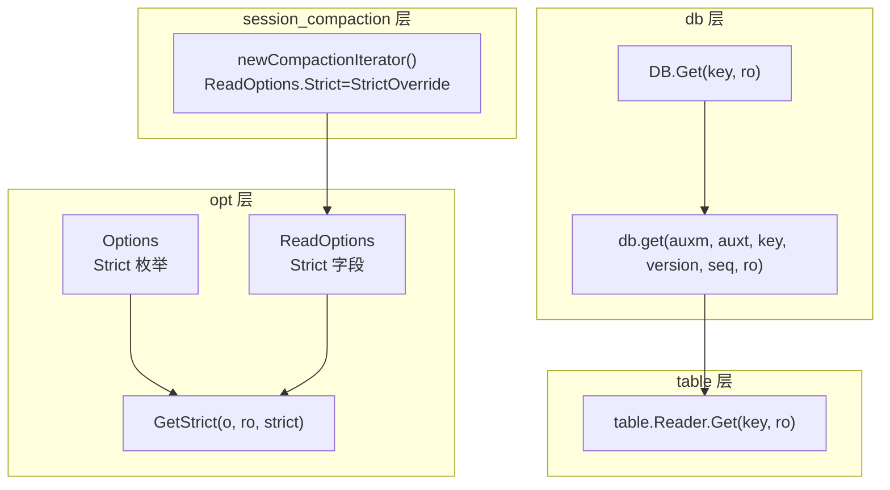
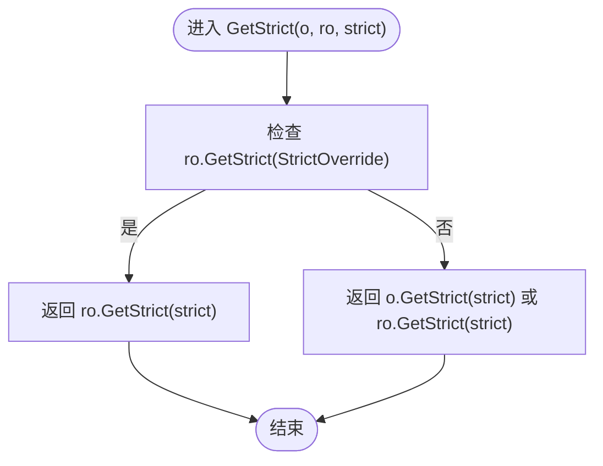
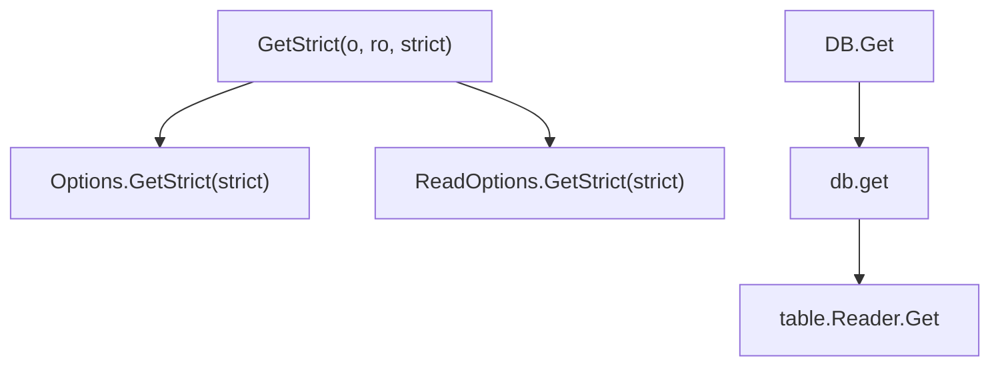

# 安全策略覆盖机制

<cite>
**本文引用的文件**
- [options.go](file://leveldb/opt/options.go)
- [db.go](file://leveldb/db.go)
- [reader.go](file://leveldb/table/reader.go)
- [session_compaction.go](file://leveldb/session_compaction.go)
- [main.go](file://cmd/leveldb-inspector/main.go)
</cite>

## 目录
1. [引言](#引言)
2. [项目结构](#项目结构)
3. [核心组件](#核心组件)
4. [架构总览](#架构总览)
5. [详细组件分析](#详细组件分析)
6. [依赖关系分析](#依赖关系分析)
7. [性能考量](#性能考量)
8. [故障排查指南](#故障排查指南)
9. [结论](#结论)
10. [附录：使用示例与最佳实践](#附录使用示例与最佳实践)

## 引言
本文件围绕 avccDB 的安全策略覆盖机制展开，重点解释 StrictOverride 标志位的特殊作用：它允许读取操作选项（ReadOptions）覆盖全局数据库安全策略，使读取操作在启用 StrictOverride 时完全使用 ReadOptions 中指定的严格级别，而非与全局策略进行 OR 运算。我们将结合源码路径，系统阐述该机制在不同场景下的应用价值、工作流程、错误处理与性能影响，并给出可直接定位到实现的参考路径。

## 项目结构
与安全策略覆盖机制直接相关的代码主要分布在以下模块：
- opt 层：定义 Strict 枚举、Options/ReadOptions 结构体及 GetStrict 判定逻辑
- db 层：Get 等读取入口调用链，贯穿版本选择、内存层与 SST 文件层
- table 层：SST 文件读取器，负责块校验、过滤块读取等
- session_compaction 层：在构建迭代器时为内部压缩过程设置 ReadOptions，体现覆盖机制的实际使用



图表来源
- [options.go](file://leveldb/opt/options.go#L137-L171)
- [options.go](file://leveldb/opt/options.go#L694-L721)
- [options.go](file://leveldb/opt/options.go#L760-L766)
- [db.go](file://leveldb/db.go#L1097-L1106)
- [db.go](file://leveldb/db.go#L797-L832)
- [reader.go](file://leveldb/table/reader.go#L950-L965)
- [session_compaction.go](file://leveldb/session_compaction.go#L300-L310)

章节来源
- [options.go](file://leveldb/opt/options.go#L137-L171)
- [options.go](file://leveldb/opt/options.go#L694-L721)
- [options.go](file://leveldb/opt/options.go#L760-L766)
- [db.go](file://leveldb/db.go#L1097-L1106)
- [db.go](file://leveldb/db.go#L797-L832)
- [reader.go](file://leveldb/table/reader.go#L950-L965)
- [session_compaction.go](file://leveldb/session_compaction.go#L300-L310)

## 核心组件
- Strict 枚举与默认策略
  - 定义了多种严格级别，包括 StrictManifest、StrictJournalChecksum、StrictJournal、StrictBlockChecksum、StrictCompaction、StrictReader、StrictRecovery 等
  - 默认严格级别由 DefaultStrict 组合定义；若 Options 未显式设置，则采用默认值
  - StrictOverride 仅适用于 ReadOptions，用于指示“覆盖全局策略”
- Options/ReadOptions
  - Options 持有全局 Strict 策略
  - ReadOptions 持有本次读取的 Strict 级别，并可启用 StrictOverride
- GetStrict(o, ro, strict)
  - 读取严格级别的判定函数：若 ReadOptions 启用了 StrictOverride，则完全以 ReadOptions.Strict 为准；否则为全局策略与 ReadOptions.Strict 的 OR 运算结果

章节来源
- [options.go](file://leveldb/opt/options.go#L137-L171)
- [options.go](file://leveldb/opt/options.go#L694-L721)
- [options.go](file://leveldb/opt/options.go#L760-L766)

## 架构总览
StrictOverride 的生效路径如下：
- 全局策略：Options.Strict
- 读取策略：ReadOptions.Strict
- 覆盖规则：GetStrict(o, ro, strict)
  - 若 ro.GetStrict(StrictOverride) 为真，则返回 ro.GetStrict(strict)
  - 否则返回 o.GetStrict(strict) || ro.GetStrict(strict)

```mermaid
sequenceDiagram
participant Caller as "调用方"
participant DB as "DB.Get"
participant Priv as "db.get(...)"
participant Tbl as "table.Reader.Get"
participant Opt as "GetStrict(o, ro, strict)"
Caller->>DB : 调用 Get(key, ro)
DB->>Priv : 获取快照并调用 get(...)
Priv->>Tbl : 从 SST 读取数据
Tbl->>Opt : 计算严格级别
Opt-->>Tbl : 返回最终严格级别
Tbl-->>Priv : 返回值/错误
Priv-->>DB : 返回值/错误
DB-->>Caller : 返回值/错误
```

图表来源
- [db.go](file://leveldb/db.go#L1097-L1106)
- [db.go](file://leveldb/db.go#L797-L832)
- [reader.go](file://leveldb/table/reader.go#L950-L965)
- [options.go](file://leveldb/opt/options.go#L760-L766)

## 详细组件分析

### 1) Strict 枚举与默认策略
- Strict 枚举包含多个与一致性、完整性、恢复相关的严格级别
- DefaultStrict 定义了默认开启的严格级别集合
- StrictOverride 仅对 ReadOptions 生效，用于强制使用 ReadOptions 中的严格级别

章节来源
- [options.go](file://leveldb/opt/options.go#L137-L171)

### 2) Options/ReadOptions 数据结构
- Options.Strict 表示全局严格级别
- ReadOptions.Strict 表示本次读取的严格级别
- ReadOptions.DontFillCache 控制是否缓存读取块
- ReadOptions.StrictOverride 用于启用覆盖机制

章节来源
- [options.go](file://leveldb/opt/options.go#L694-L721)

### 3) GetStrict 判定逻辑
- 当 ReadOptions 启用 StrictOverride 时，严格级别完全由 ReadOptions.Strict 决定
- 否则，严格级别为全局策略与 ReadOptions.Strict 的 OR 运算结果



图表来源
- [options.go](file://leveldb/opt/options.go#L760-L766)

章节来源
- [options.go](file://leveldb/opt/options.go#L760-L766)

### 4) 读取入口与调用链
- DB.Get(key, ro) 获取快照后调用 db.get(...)
- db.get(...) 在版本层查找键值，必要时触发 SST 文件读取
- table.Reader.Get(key, ro) 执行具体的数据块读取与校验

章节来源
- [db.go](file://leveldb/db.go#L1097-L1106)
- [db.go](file://leveldb/db.go#L797-L832)
- [reader.go](file://leveldb/table/reader.go#L950-L965)

### 5) 压缩过程中的覆盖机制使用
- 在构建压缩迭代器时，为内部读取设置 ReadOptions.Strict = StrictOverride
- 若全局策略要求严格压缩（StrictCompaction），还会额外设置 StrictReader，从而在压缩过程中对 SST 块进行更严格的校验

章节来源
- [session_compaction.go](file://leveldb/session_compaction.go#L300-L310)

## 依赖关系分析
- GetStrict 依赖 Options 和 ReadOptions 的严格级别判断方法
- 读取入口 DB.Get 通过 db.get 调用版本层与 SST 层
- table.Reader.Get 在读取块时依据严格级别决定是否执行校验
- 压缩过程通过 ReadOptions.Strict=StrictOverride 影响迭代器行为



图表来源
- [options.go](file://leveldb/opt/options.go#L659-L664)
- [options.go](file://leveldb/opt/options.go#L715-L720)
- [options.go](file://leveldb/opt/options.go#L760-L766)
- [db.go](file://leveldb/db.go#L1097-L1106)
- [db.go](file://leveldb/db.go#L797-L832)
- [reader.go](file://leveldb/table/reader.go#L950-L965)

章节来源
- [options.go](file://leveldb/opt/options.go#L659-L664)
- [options.go](file://leveldb/opt/options.go#L715-L720)
- [options.go](file://leveldb/opt/options.go#L760-L766)
- [db.go](file://leveldb/db.go#L1097-L1106)
- [db.go](file://leveldb/db.go#L797-L832)
- [reader.go](file://leveldb/table/reader.go#L950-L965)

## 性能考量
- 启用 StrictReader 会增加块校验成本，可能影响读取延迟
- 使用 StrictOverride 可在局部场景下精确控制严格级别，避免不必要的全局严格开销
- 压缩过程中的严格校验有助于提前发现损坏，但会增加 CPU 与 I/O 压力
- 通过 DontFillCache 可减少缓存压力，但可能增加重复读取成本

章节来源
- [options.go](file://leveldb/opt/options.go#L694-L721)
- [session_compaction.go](file://leveldb/session_compaction.go#L300-L310)

## 故障排查指南
- 若读取返回“损坏”类错误，优先检查是否启用了 StrictBlockChecksum、StrictReader 等严格级别
- 在压缩过程中出现错误，检查 StrictCompaction 与 StrictRecovery 的配置
- 对于压缩迭代器内部读取，确认 ReadOptions.Strict 是否正确设置为 StrictOverride

章节来源
- [options.go](file://leveldb/opt/options.go#L137-L171)
- [session_compaction.go](file://leveldb/session_compaction.go#L300-L310)

## 结论
StrictOverride 提供了细粒度的安全策略控制能力：在保持全局宽松策略的同时，允许个别读取操作启用更高的严格级别，或在批量处理时临时降低严格级别以提升性能。通过 GetStrict 的覆盖逻辑与压缩过程中的 ReadOptions 设置，系统实现了灵活而可控的安全策略执行路径。

## 附录：使用示例与最佳实践
以下示例均以“代码片段路径”形式给出，便于快速定位实现位置。请根据实际需求调整 ReadOptions 的 Strict 字段组合。

- 在 Get 操作中启用 StrictOverride 并设置严格级别
  - 示例路径：[db.go](file://leveldb/db.go#L1097-L1106)，[options.go](file://leveldb/opt/options.go#L760-L766)
  - 步骤要点：
    - 创建 ReadOptions，设置 DontFillCache（可选）
    - 设置 Strict 字段为目标严格级别（如 StrictReader）
    - 设置 StrictOverride 为真
    - 将 ReadOptions 传入 DB.Get

- 在压缩过程中为内部读取启用 StrictOverride
  - 示例路径：[session_compaction.go](file://leveldb/session_compaction.go#L300-L310)
  - 步骤要点：
    - 构建 ReadOptions，Strict 设为 StrictOverride
    - 如需严格压缩，再按需叠加 StrictReader
    - 使用该 ReadOptions 构建迭代器

- 在工具程序中演示严格级别切换
  - 示例路径：[main.go](file://cmd/leveldb-inspector/main.go)
  - 步骤要点：
    - 通过命令行参数或配置切换 Options.Strict
    - 针对敏感数据读取时，单独为 ReadOptions 设置更高严格级别并启用 StrictOverride

- 最佳实践建议
  - 全局策略保持默认宽松，针对敏感数据或关键路径使用 StrictOverride 提升严格级别
  - 批量扫描或统计任务可临时关闭 StrictReader 以降低校验开销
  - 压缩阶段建议启用 StrictCompaction 与 StrictReader，确保数据一致性

章节来源
- [db.go](file://leveldb/db.go#L1097-L1106)
- [options.go](file://leveldb/opt/options.go#L760-L766)
- [session_compaction.go](file://leveldb/session_compaction.go#L300-L310)
- [main.go](file://cmd/leveldb-inspector/main.go)