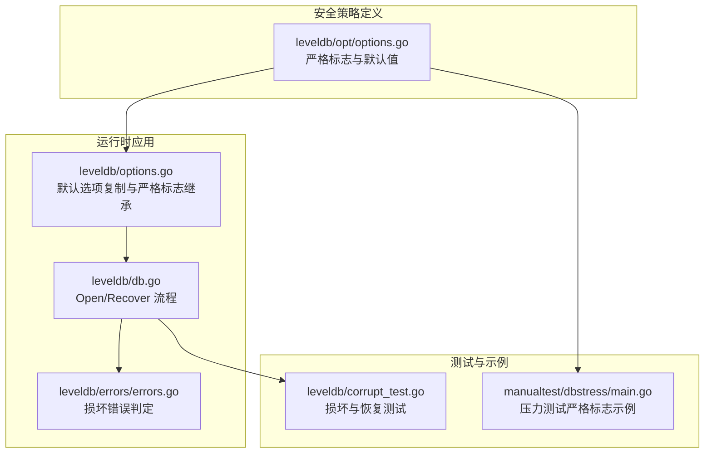
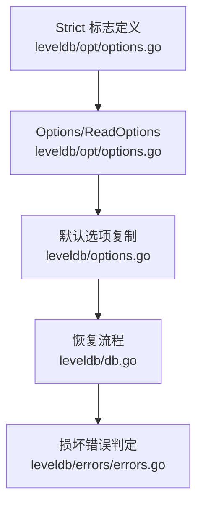

# 安全策略配置

<cite>
**本文引用的文件**
- [leveldb/opt/options.go](file://leveldb/opt/options.go)
- [leveldb/options.go](file://leveldb/options.go)
- [leveldb/db.go](file://leveldb/db.go)
- [leveldb/errors/errors.go](file://leveldb/errors/errors.go)
- [leveldb/corrupt_test.go](file://leveldb/corrupt_test.go)
- [manualtest/dbstress/main.go](file://manualtest/dbstress/main.go)
</cite>

## 目录
1. [简介](#简介)
2. [项目结构](#项目结构)
3. [核心组件](#核心组件)
4. [架构总览](#架构总览)
5. [详细组件分析](#详细组件分析)
6. [依赖关系分析](#依赖关系分析)
7. [性能考量](#性能考量)
8. [故障排查指南](#故障排查指南)
9. [结论](#结论)
10. [附录：配置示例与最佳实践](#附录配置示例与最佳实践)

## 简介
本文件围绕 avccDB 的安全策略配置进行系统化说明，重点解释 DefaultStrict、StrictAll 和 NoStrict 三种预定义策略的组成与适用场景；阐述如何通过位运算组合不同的严格标志以创建自定义安全策略；分析不同策略组合对系统安全性、性能与可用性的影响；并给出面向高安全性与高性能两类场景的安全配置建议及完整配置示例路径。

## 项目结构
与安全策略直接相关的核心文件位于 leveldb 子模块中：
- 严格标志定义与默认值：leveldb/opt/options.go
- 默认选项复制与严格标志继承逻辑：leveldb/options.go
- 恢复流程与严格标志在恢复过程中的作用：leveldb/db.go
- 错误类型与“损坏”判定工具：leveldb/errors/errors.go
- 损坏测试用例与恢复行为验证：leveldb/corrupt_test.go
- 手动压力测试中对严格标志的使用示例：manualtest/dbstress/main.go



图表来源
- [leveldb/opt/options.go](file://leveldb/opt/options.go#L130-L174)
- [leveldb/options.go](file://leveldb/options.go#L14-L23)
- [leveldb/db.go](file://leveldb/db.go#L245-L300)
- [leveldb/errors/errors.go](file://leveldb/errors/errors.go#L50-L79)
- [leveldb/corrupt_test.go](file://leveldb/corrupt_test.go#L343-L373)
- [manualtest/dbstress/main.go](file://manualtest/dbstress/main.go#L160-L180)

章节来源
- [leveldb/opt/options.go](file://leveldb/opt/options.go#L130-L174)
- [leveldb/options.go](file://leveldb/options.go#L14-L23)
- [leveldb/db.go](file://leveldb/db.go#L245-L300)
- [leveldb/errors/errors.go](file://leveldb/errors/errors.go#L50-L79)
- [leveldb/corrupt_test.go](file://leveldb/corrupt_test.go#L343-L373)
- [manualtest/dbstress/main.go](file://manualtest/dbstress/main.go#L160-L180)

## 核心组件
- 严格标志类型与枚举
  - 严格标志类型为无符号整数，每个标志占用一位，支持按位或组合。
  - 关键标志包括：清单校验、日志块校验、日志严格模式、块校验、压缩过程严格、读取严格、恢复严格、读取严格覆盖等。
- 预定义策略
  - StrictAll：启用所有严格标志。
  - DefaultStrict：默认严格标志集合，用于全局默认值。
  - NoStrict：禁用所有严格标志（通过按位取反 StrictAll 得到）。
- 严格标志继承与覆盖
  - 全局 Options 中的 Strict 字段若未设置，则使用 DefaultStrict。
  - 读取操作的 ReadOptions 可通过 StrictOverride 覆盖全局严格级别，且仅对读取严格生效。

章节来源
- [leveldb/opt/options.go](file://leveldb/opt/options.go#L130-L174)
- [leveldb/options.go](file://leveldb/options.go#L14-L23)
- [leveldb/opt/options.go](file://leveldb/opt/options.go#L659-L665)
- [leveldb/opt/options.go](file://leveldb/opt/options.go#L704-L721)

## 架构总览
下图展示了从应用层到存储层的严格标志传递链路，以及恢复阶段对严格标志的特殊处理。

```mermaid
sequenceDiagram
participant App as "应用"
participant Opt as "Options/ReadOptions"
participant Dup as "默认选项复制(dupOptions)"
participant DB as "数据库会话(session)"
participant Rec as "恢复流程(recoverTable)"
participant Store as "存储层"
App->>Opt : 设置 Strict 或 ReadOptions.Strict
Opt->>Dup : 未设置则使用 DefaultStrict
Dup-->>Opt : 返回带默认严格级别的 Options
Opt->>DB : 打开数据库/Open/Recover
DB->>Rec : 恢复表时屏蔽 StrictReader
Rec->>Store : 读取表并迭代扫描
Store-->>Rec : 返回损坏错误
Rec->>Rec : 若 StrictRecovery 开启则丢弃损坏表
Rec-->>DB : 恢复完成
DB-->>App : 返回数据库实例
```

图表来源
- [leveldb/options.go](file://leveldb/options.go#L14-L23)
- [leveldb/db.go](file://leveldb/db.go#L295-L315)
- [leveldb/db.go](file://leveldb/db.go#L392-L438)

## 详细组件分析

### 严格标志定义与语义
- 清单严格（StrictManifest）
  - 对清单文件中的无效或损坏块/片段进行严格检查，防止损坏的清单导致数据库被打开。
- 日志块校验（StrictJournalChecksum）
  - 对日志块进行校验，确保日志完整性。
- 日志严格（StrictJournal）
  - 对日志中的无效或损坏块/片段进行严格处理，阻止损坏的日志导致数据库被打开。
- 块校验（StrictBlockChecksum）
  - 对有序表块进行校验，影响读取与压缩过程。
- 压缩过程严格（StrictCompaction）
  - 对损坏的有序表在压缩阶段失败，数据库进入只读模式。
- 读取严格（StrictReader）
  - 对损坏的有序表在读取阶段停止。
- 恢复严格（StrictRecovery）
  - 在恢复过程中丢弃损坏的有序表。
- 读取严格覆盖（StrictOverride）
  - 仅适用于 ReadOptions，当存在该标志时，读取严格级别覆盖全局严格级别（仅对读取严格有效）。

章节来源
- [leveldb/opt/options.go](file://leveldb/opt/options.go#L130-L174)

### 预定义策略与默认值
- StrictAll
  - 启用所有严格标志，提供最高级别的数据完整性保护。
- DefaultStrict
  - 默认严格标志集合，包含日志块校验、块校验、压缩过程严格、读取严格，兼顾安全与可用性。
- NoStrict
  - 禁用所有严格标志，通过按位取反 StrictAll 实现。

章节来源
- [leveldb/opt/options.go](file://leveldb/opt/options.go#L165-L173)

### 默认选项复制与严格标志继承
- 当 Options.Strict 未显式设置时，会在复制阶段赋予 DefaultStrict，确保默认安全级别。
- 读取阶段的严格级别可通过 ReadOptions.Strict 与 StrictOverride 进行局部覆盖。

章节来源
- [leveldb/options.go](file://leveldb/options.go#L14-L23)
- [leveldb/opt/options.go](file://leveldb/opt/options.go#L659-L665)
- [leveldb/opt/options.go](file://leveldb/opt/options.go#L704-L721)

### 恢复流程中的严格标志
- 恢复阶段会屏蔽 StrictReader，以便在恢复过程中尽可能修复或重建数据。
- 若开启 StrictRecovery，则对损坏的有序表执行丢弃策略，避免损坏传播。
- 恢复完成后，数据库根据其他严格标志决定后续行为（如是否进入只读模式）。

章节来源
- [leveldb/db.go](file://leveldb/db.go#L295-L315)
- [leveldb/db.go](file://leveldb/db.go#L392-L438)

### 错误类型与损坏判定
- 提供 IsCorrupted 判定函数，用于识别损坏类错误，便于区分一般错误与损坏错误。
- 恢复流程中对损坏错误进行专门处理，非损坏错误则直接返回。

章节来源
- [leveldb/errors/errors.go](file://leveldb/errors/errors.go#L50-L79)
- [leveldb/db.go](file://leveldb/db.go#L392-L438)

### 自定义策略组合与位运算
- 严格标志采用位掩码方式定义，可使用按位或（|）组合多个标志，使用按位与（&）判断是否启用某标志。
- 常见组合思路：
  - 高安全：StrictAll 或在 DefaultStrict 基础上增加 StrictManifest。
  - 平衡安全与性能：DefaultStrict。
  - 低安全/高吞吐：NoStrict 或仅启用必要标志（如 StrictBlockChecksum）。
- 注意事项：
  - 读取严格覆盖仅对读取严格有效，不影响写入与压缩路径。
  - 恢复阶段会屏蔽 StrictReader，避免在恢复过程中因读取严格导致无法修复。

章节来源
- [leveldb/opt/options.go](file://leveldb/opt/options.go#L130-L174)
- [leveldb/opt/options.go](file://leveldb/opt/options.go#L659-L665)
- [leveldb/opt/options.go](file://leveldb/opt/options.go#L704-L721)
- [leveldb/db.go](file://leveldb/db.go#L295-L315)

### 策略组合对系统的影响
- 安全性
  - 启用 StrictManifest、StrictJournal、StrictJournalChecksum、StrictBlockChecksum、StrictCompaction、StrictReader、StrictRecovery 越多，越能及时发现并阻断损坏传播，降低数据不一致风险。
- 性能
  - 校验与严格检查会带来额外 CPU 与 I/O 开销；StrictBlockChecksum、StrictCompaction、StrictJournalChecksum 对读取与压缩路径均有影响。
- 可用性
  - 严格模式下，损坏可能导致数据库无法打开或进入只读模式；恢复阶段的 StrictRecovery 可在一定程度上提升可用性，但也会丢弃损坏数据。

章节来源
- [leveldb/opt/options.go](file://leveldb/opt/options.go#L130-L174)
- [leveldb/db.go](file://leveldb/db.go#L392-L438)

## 依赖关系分析
- 严格标志定义与默认值位于 opt 层，被上层 Options 与 ReadOptions 使用。
- 默认选项复制逻辑确保未设置的 Strict 字段自动继承 DefaultStrict。
- 恢复流程在特定阶段屏蔽 StrictReader，体现严格标志在不同阶段的差异化作用。
- 错误判定工具贯穿 Open/Recover/迭代器回调等路径，支撑严格模式下的错误处理。



图表来源
- [leveldb/opt/options.go](file://leveldb/opt/options.go#L130-L174)
- [leveldb/opt/options.go](file://leveldb/opt/options.go#L659-L721)
- [leveldb/options.go](file://leveldb/options.go#L14-L23)
- [leveldb/db.go](file://leveldb/db.go#L295-L315)
- [leveldb/errors/errors.go](file://leveldb/errors/errors.go#L50-L79)

## 性能考量
- 校验成本
  - 块校验与日志校验会增加读取与压缩时的 CPU 与 I/O 成本。
- 压缩与只读模式
  - 启用压缩过程严格可能触发只读模式，影响写入与后台压缩。
- 恢复阶段
  - 恢复时屏蔽读取严格，有助于快速修复；但 StrictRecovery 会丢弃损坏表，可能影响数据完整性与查询结果。

章节来源
- [leveldb/opt/options.go](file://leveldb/opt/options.go#L130-L174)
- [leveldb/db.go](file://leveldb/db.go#L295-L315)

## 故障排查指南
- 如何识别损坏错误
  - 使用 IsCorrupted 判断错误类型，区分一般错误与损坏错误。
- 常见问题定位
  - 清单损坏：Open 失败且提示损坏，需使用 Recover。
  - 表损坏：读取或压缩阶段出现损坏错误，可启用 StrictRecovery 进行丢弃或重建。
  - 日志损坏：日志块校验失败，可能阻止数据库打开，需启用日志严格或修复日志。
- 恢复流程要点
  - 恢复阶段会屏蔽 StrictReader，优先尝试修复或重建；若 StrictRecovery 开启，损坏表会被丢弃。

章节来源
- [leveldb/errors/errors.go](file://leveldb/errors/errors.go#L50-L79)
- [leveldb/db.go](file://leveldb/db.go#L295-L315)
- [leveldb/db.go](file://leveldb/db.go#L392-L438)

## 结论
- DefaultStrict 提供了在安全与性能之间的平衡点，适合大多数生产环境。
- StrictAll 适用于对数据完整性要求极高的场景，但需权衡性能与可用性。
- NoStrict 适用于追求极致性能且可接受一定风险的场景，应谨慎评估潜在的数据不一致风险。
- 自定义策略可通过位运算灵活组合，结合业务需求选择合适的标志集。

## 附录：配置示例与最佳实践

### 配置示例路径
- 使用默认严格级别（推荐用于多数场景）
  - 示例路径：[leveldb/options.go](file://leveldb/options.go#L14-L23)
- 使用严格全部标志（高安全）
  - 示例路径：[leveldb/opt/options.go](file://leveldb/opt/options.go#L165-L173)
- 禁用所有严格标志（高性能）
  - 示例路径：[leveldb/opt/options.go](file://leveldb/opt/options.go#L171-L173)
- 在读取阶段覆盖严格级别（仅对读取严格生效）
  - 示例路径：[leveldb/opt/options.go](file://leveldb/opt/options.go#L704-L721)
- 恢复流程中的严格标志处理
  - 示例路径：[leveldb/db.go](file://leveldb/db.go#L295-L315)

### 场景化建议
- 高安全性要求系统（金融、审计、关键数据）
  - 推荐：StrictAll 或在 DefaultStrict 基础上增加 StrictManifest。
  - 依据：全面的校验与严格的错误处理，最大限度降低数据不一致风险。
- 高性能要求系统（日志、监控、缓存）
  - 推荐：DefaultStrict 或 NoStrict，视业务容忍度而定。
  - 依据：在保证基本完整性的同时，尽量减少校验带来的性能损耗。
- 混合场景（部分关键数据高安全，部分数据高性能）
  - 推荐：分库或分表策略，关键库使用 StrictAll，普通库使用 DefaultStrict 或 NoStrict。
  - 依据：通过策略隔离实现资源与安全性的最优分配。

### 位运算组合示例路径
- 组合多个严格标志（按位或）
  - 示例路径：[leveldb/opt/options.go](file://leveldb/opt/options.go#L165-L173)
- 判断某个严格标志是否启用（按位与）
  - 示例路径：[leveldb/opt/options.go](file://leveldb/opt/options.go#L659-L665)
- 读取阶段覆盖严格级别
  - 示例路径：[leveldb/opt/options.go](file://leveldb/opt/options.go#L704-L721)