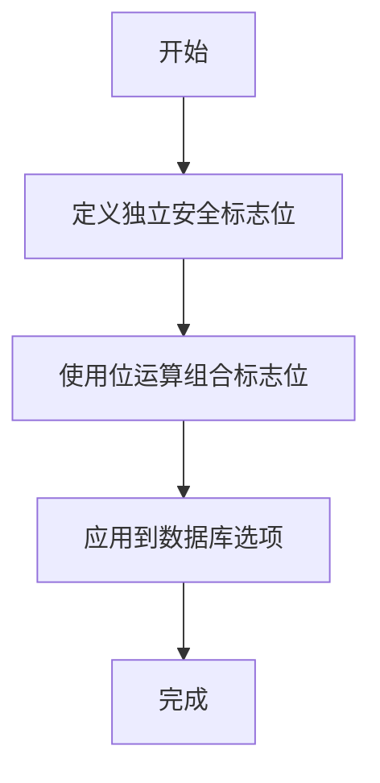
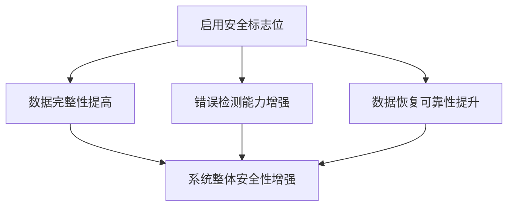
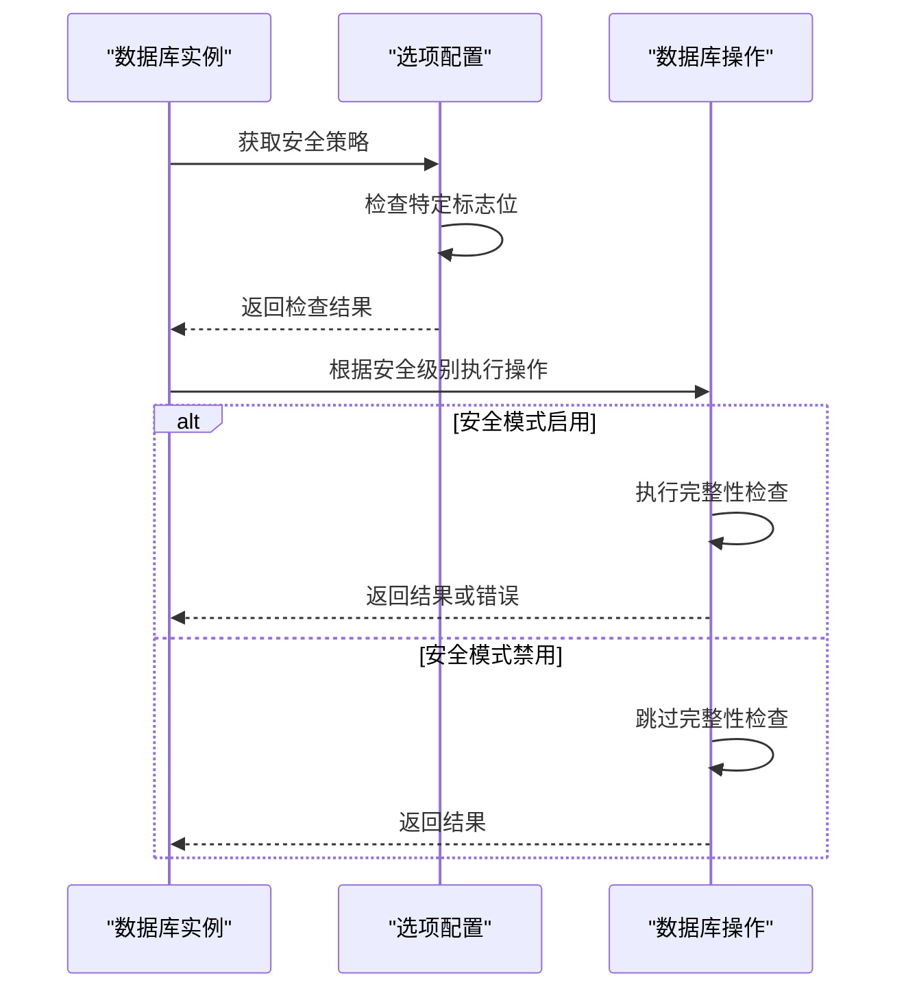

# 自定义安全策略

<cite>
**本文档引用的文件**
- [options.go](file://leveldb/opt/options.go#L137-L173)
- [db.go](file://leveldb/db.go#L296-L312)
- [journal.go](file://leveldb/journal/journal.go#L149-L173)
- [reader.go](file://leveldb/table/reader.go#L568-L581)
- [corrupt_test.go](file://leveldb/corrupt_test.go#L37-L38)
</cite>

## 目录
1. [引言](#引言)
2. [安全标志位详解](#安全标志位详解)
3. [位运算组合策略](#位运算组合策略)
4. [安全策略对系统的影响](#安全策略对系统的影响)
5. [代码实现分析](#代码实现分析)
6. [最佳实践建议](#最佳实践建议)

## 引言
avccDB提供了一套灵活的自定义安全策略系统，通过位运算组合多个独立的安全标志位来构建不同级别的数据完整性保护。这些安全标志位允许开发者根据具体应用场景的需求，精确控制数据库在面对数据损坏时的行为。系统默认启用了合理的安全级别，同时提供了完全自定义的选项，使开发者能够在数据安全性和系统性能之间找到最佳平衡点。

## 安全标志位详解

### StrictManifest
当启用此标志位时，如果清单文件（manifest）日志中存在损坏或无效的块，系统将直接返回错误而不是丢弃损坏的数据。这可以有效防止带有损坏清单文件的数据库被打开，确保数据库元数据的完整性。

**Section sources**
- [options.go](file://leveldb/opt/options.go#L137-L138)

### StrictJournalChecksum
此标志位启用日志块校验和验证功能。在读取日志文件时，系统会计算并验证每个日志块的校验和，确保日志数据在存储和读取过程中没有发生意外更改，提供基本的数据完整性保护。

**Section sources**
- [options.go](file://leveldb/opt/options.go#L139-L140)

### StrictJournal
启用此标志位后，如果日志文件中存在任何损坏或无效的块，系统将立即返回错误而不是尝试恢复或跳过损坏部分。这种严格的处理方式可以防止数据库使用可能已损坏的事务日志，确保数据一致性。

**Section sources**
- [options.go](file://leveldb/opt/options.go#L142-L145)

### StrictBlockChecksum
此标志位要求对排序表（sorted table）的数据块进行校验和验证。该验证在读取操作和压缩过程中都会执行，确保数据块的完整性，防止读取到已损坏的数据。

**Section sources**
- [options.go](file://leveldb/opt/options.go#L147-L149)

### StrictCompaction
当启用此标志位时，如果在压缩过程中发现损坏的排序表，压缩操作将失败，数据库将进入只读模式。这种保护机制可以防止损坏的数据在压缩过程中被传播到其他层级。

**Section sources**
- [options.go](file://leveldb/opt/options.go#L151-L153)

### StrictReader
此标志位阻止读取任何已损坏的排序表数据。当读取操作遇到损坏的数据块时，系统将立即返回错误，而不是尝试返回部分数据，确保应用程序不会处理损坏的数据。

**Section sources**
- [options.go](file://leveldb/opt/options.go#L155-L156)

### StrictRecovery
此标志位控制数据库恢复行为。当启用时，leveldb.Recover操作将丢弃损坏的排序表，而不是尝试修复它们。这可以确保恢复后的数据库只包含完整且未损坏的数据。

**Section sources**
- [options.go](file://leveldb/opt/options.go#L158-L159)

## 位运算组合策略

### 基本组合方法
avccDB使用Go语言的位运算符来组合这些安全标志位。每个标志位都是一个独立的位，通过按位或（|）操作符进行组合，形成最终的安全策略。

**Diagram sources**
- [options.go](file://leveldb/opt/options.go#L166-L167)

### 预定义策略
系统提供了几个预定义的安全策略组合：

- **StrictAll**: 启用所有安全标志位，提供最高级别的数据保护
- **DefaultStrict**: 默认安全策略，包含StrictJournalChecksum、StrictBlockChecksum、StrictCompaction和StrictReader
- **NoStrict**: 禁用所有安全标志位，提供最高性能但最低安全级别

**Section sources**
- [options.go](file://leveldb/opt/options.go#L166-L173)

## 安全策略对系统的影响

### 安全性影响
启用更多的安全标志位可以显著提高数据库的数据完整性保护能力。例如，同时启用StrictJournal和StrictJournalChecksum可以确保事务日志的完整性和正确性，防止由于日志损坏导致的数据不一致问题。

**Diagram sources**
- [options.go](file://leveldb/opt/options.go#L137-L173)

### 性能影响
不同的安全策略组合对系统性能有不同的影响：

- **高安全策略**: 启用所有校验和验证和严格检查会增加CPU开销和I/O延迟
- **中等安全策略**: 仅启用关键校验和验证，在安全性和性能之间取得平衡
- **低安全策略**: 最小化安全检查，提供最高性能但风险较高

**Section sources**
- [options.go](file://leveldb/opt/options.go#L170-L171)

## 代码实现分析

### 安全策略应用流程
安全策略在数据库初始化和各种操作中被应用。系统通过GetStrict方法检查特定安全标志位是否启用，并根据结果决定操作行为。

**Diagram sources**
- [options.go](file://leveldb/opt/options.go#L659-L664)
- [db.go](file://leveldb/db.go#L528-L530)

### 日志处理安全机制
在日志处理过程中，系统根据StrictJournal和StrictJournalChecksum标志位的设置来决定如何处理可能损坏的日志数据。

**Section sources**
- [db.go](file://leveldb/db.go#L528-L554)
- [journal.go](file://leveldb/journal/journal.go#L149-L173)

### 表读取安全机制
在读取排序表时，系统会根据StrictBlockChecksum和StrictReader标志位的设置来验证数据块的完整性。

**Section sources**
- [reader.go](file://leveldb/table/reader.go#L568-L581)

## 最佳实践建议
在实际应用中，建议根据具体场景选择合适的安全策略：
- 对于金融、医疗等对数据完整性要求极高的应用，建议使用StrictAll策略
- 对于一般应用，使用默认的DefaultStrict策略即可提供足够的保护
- 在性能要求极高且数据可恢复的场景下，可以考虑使用更宽松的安全策略

**Section sources**
- [options.go](file://leveldb/opt/options.go#L170-L171)
- [corrupt_test.go](file://leveldb/corrupt_test.go#L37-L38)