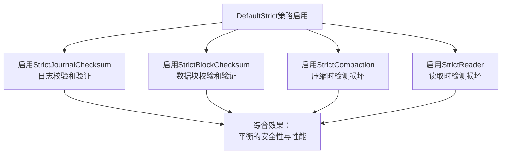
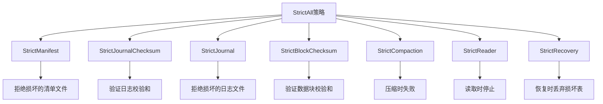
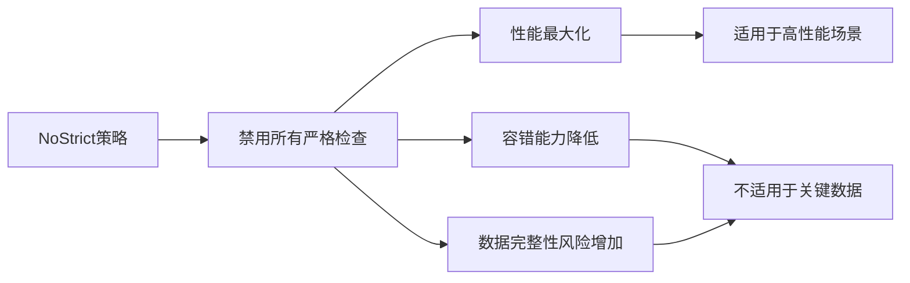

# 预定义安全策略

<cite>
**本文档引用的文件**  
- [options.go](file://leveldb/opt/options.go#L137-L173)
- [options.go](file://leveldb/options.go#L19)
- [db.go](file://leveldb/db.go#L296-L300)
- [db.go](file://leveldb/db.go#L529)
- [db_compaction.go](file://leveldb/db_compaction.go#L600)
- [table/reader.go](file://leveldb/table/reader.go#L1201)
- [db_iter.go](file://leveldb/db_iter.go#L80)
- [corrupt_test.go](file://leveldb/corrupt_test.go#L36)
</cite>

## 目录
1. [引言](#引言)
2. [预定义安全策略概述](#预定义安全策略概述)
3. [DefaultStrict策略详解](#defaultstrict策略详解)
4. [StrictAll策略分析](#strictall策略分析)
5. [NoStrict策略分析](#nostrict策略分析)
6. [策略影响评估](#策略影响评估)
7. [应用场景与选择建议](#应用场景与选择建议)

## 引言
avccDB提供了多种预定义的安全策略，用于在数据完整性、性能和容错能力之间进行权衡。这些策略通过不同的严格级别标志位组合来实现，允许用户根据具体应用场景选择最适合的配置。本文档详细解释了DefaultStrict、StrictAll和NoStrict三种预定义策略的组成、工作机制及其对数据库系统的影响。

## 预定义安全策略概述
avccDB定义了三种主要的预定义安全策略：DefaultStrict、StrictAll和NoStrict。这些策略通过`Strict`类型的位标志进行配置，每个标志位控制数据库在特定操作中的严格程度。策略的选择直接影响数据库在面对数据损坏时的行为，包括是否允许打开损坏的数据库、是否验证校验和、以及在检测到损坏时是继续运行还是进入只读模式。

**Section sources**
- [options.go](file://leveldb/opt/options.go#L137-L173)

## DefaultStrict策略详解
DefaultStrict是avccDB的默认安全策略，由四个关键的严格标志位组成：StrictJournalChecksum、StrictBlockChecksum、StrictCompaction和StrictReader。这些标志位共同提供了平衡的安全性和性能保障。

### StrictJournalChecksum标志位
当启用StrictJournalChecksum时，系统会对日志文件中的每个数据块进行校验和验证。这一机制确保了写入操作的完整性，防止由于存储介质错误或系统崩溃导致的数据损坏。在数据库恢复过程中，如果发现校验和不匹配，系统将拒绝使用该日志文件，从而避免将损坏的数据加载到数据库中。

### StrictBlockChecksum标志位
StrictBlockChecksum标志位要求对排序表（sorted table）中的每个数据块进行校验和验证。这种验证不仅在读取操作时进行，也在压缩过程中执行。通过这种方式，系统能够及时发现并处理存储介质上的数据损坏问题，确保读取的数据是完整和准确的。

### StrictCompaction标志位
启用StrictCompaction后，如果在压缩过程中发现损坏的排序表，压缩操作将失败，数据库将进入只读模式。这种机制防止了损坏数据在压缩过程中被传播到新的数据文件中，保护了数据库的整体完整性。在只读模式下，系统仍然可以提供数据查询服务，但禁止所有写入操作，直到问题得到解决。

### StrictReader标志位
StrictReader标志位确保在读取操作中遇到损坏的排序表时立即停止操作。这防止了应用程序读取到部分损坏或不一致的数据，保证了数据访问的可靠性。当检测到损坏时，系统会返回错误，而不是尝试继续读取可能不正确的数据。

**Diagram sources**
- [options.go](file://leveldb/opt/options.go#L169)

**Section sources**
- [options.go](file://leveldb/opt/options.go#L139-L156)
- [db.go](file://leveldb/db.go#L529)
- [table/reader.go](file://leveldb/table/reader.go#L1201)
- [db_compaction.go](file://leveldb/db_compaction.go#L600)
- [db_iter.go](file://leveldb/db_iter.go#L80)

## StrictAll策略分析
StrictAll策略启用了所有可用的严格标志位，包括StrictManifest、StrictJournalChecksum、StrictJournal、StrictBlockChecksum、StrictCompaction、StrictReader和StrictRecovery。这是avccDB提供的最高安全级别的配置，适用于对数据完整性要求极高的场景。

该策略的特点是任何级别的数据损坏都会导致相应的操作失败。例如，损坏的清单文件（manifest）将阻止数据库打开，损坏的日志文件将无法用于恢复，损坏的数据表在读取和压缩时都会被拒绝。这种"零容忍"的策略确保了数据库始终处于一致和可靠的状态，但可能会降低系统的可用性，特别是在面对轻微的存储介质错误时。

**Diagram sources**
- [options.go](file://leveldb/opt/options.go#L165)

**Section sources**
- [options.go](file://leveldb/opt/options.go#L165-L166)

## NoStrict策略分析
NoStrict策略通过`^StrictAll`表达式禁用了所有严格标志位，提供了最高的性能但最低的安全保障。这种配置适用于对性能要求极高而对数据完整性要求相对较低的场景，如临时数据存储或日志系统。

在NoStrict模式下，系统会尽可能地容忍数据损坏。例如，损坏的日志块会被跳过而不是导致整个数据库无法打开，损坏的数据块在读取时可能被忽略或返回部分数据。这种"尽力而为"的策略最大化了系统的可用性和性能，但增加了读取到损坏或不一致数据的风险。

**Diagram sources**
- [options.go](file://leveldb/opt/options.go#L172)

**Section sources**
- [options.go](file://leveldb/opt/options.go#L172-L173)
- [manualtest/dbstress/main.go](file://manualtest/dbstress/main.go#L171)

## 策略影响评估
不同的安全策略对数据库的性能、安全性和容错能力有着显著的影响。本节评估了三种预定义策略在这些关键指标上的表现。

### 安全性影响
| 策略 | 安全性等级 | 主要保护机制 |
|------|-----------|-------------|
| StrictAll | 极高 | 全面的数据完整性验证，任何损坏都导致操作失败 |
| DefaultStrict | 高 | 关键路径上的校验和验证和损坏检测 |
| NoStrict | 低 | 最小化检查，尽可能继续操作 |

### 性能影响
| 策略 | 性能开销 | 主要性能影响因素 |
|------|---------|-----------------|
| StrictAll | 高 | 全面的校验和计算和验证 |
| DefaultStrict | 中等 | 关键路径上的校验和验证 |
| NoStrict | 低 | 最小化的检查开销 |

### 容错能力
| 策略 | 容错能力 | 损坏时的行为 |
|------|---------|-------------|
| StrictAll | 低 | 严格拒绝任何损坏，可能导致服务中断 |
| DefaultStrict | 中等 | 在关键路径上检测损坏，提供合理的保护 |
| NoStrict | 高 | 尽可能继续操作，容忍一定程度的损坏 |

**Section sources**
- [options.go](file://leveldb/opt/options.go#L137-L173)

## 应用场景与选择建议
根据不同的业务需求和环境条件，选择合适的预定义安全策略至关重要。以下是针对不同应用场景的建议：

### 金融系统
对于金融系统等对数据完整性要求极高的应用，建议使用StrictAll策略。这类系统不能容忍任何数据损坏，即使这意味着在面对存储介质错误时可能需要人工干预来恢复服务。金融交易记录、账户余额等关键数据必须始终保持一致和准确。

### 日志系统
对于日志系统等对性能要求高而对个别数据项完整性要求相对较低的应用，建议使用NoStrict策略。在这种场景下，丢失少量日志条目通常是可以接受的，而系统的高吞吐量和低延迟更为重要。即使部分日志文件损坏，系统也应该尽可能继续运行。

### 通用业务系统
对于大多数通用业务系统，DefaultStrict是最佳选择。它在安全性和性能之间提供了良好的平衡，能够防御常见的数据损坏问题，同时保持良好的系统性能。这种配置适合大多数Web应用、移动后端和其他企业级应用。

### 开发和测试环境
在开发和测试环境中，可以根据测试目的选择不同的策略。为了测试系统的容错能力，可以使用NoStrict策略来模拟损坏的存储环境。为了验证数据完整性保护机制，可以使用StrictAll策略来确保所有潜在的损坏都被检测到。

**Section sources**
- [options.go](file://leveldb/opt/options.go#L137-L173)