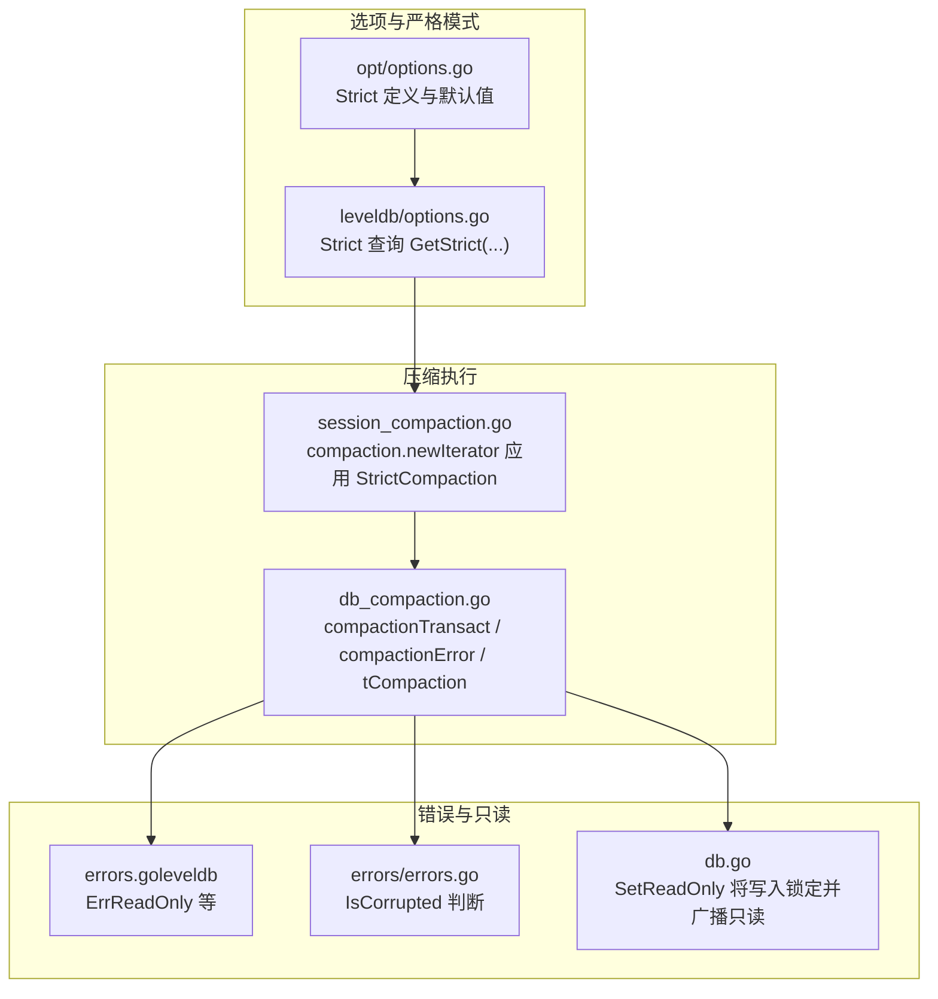
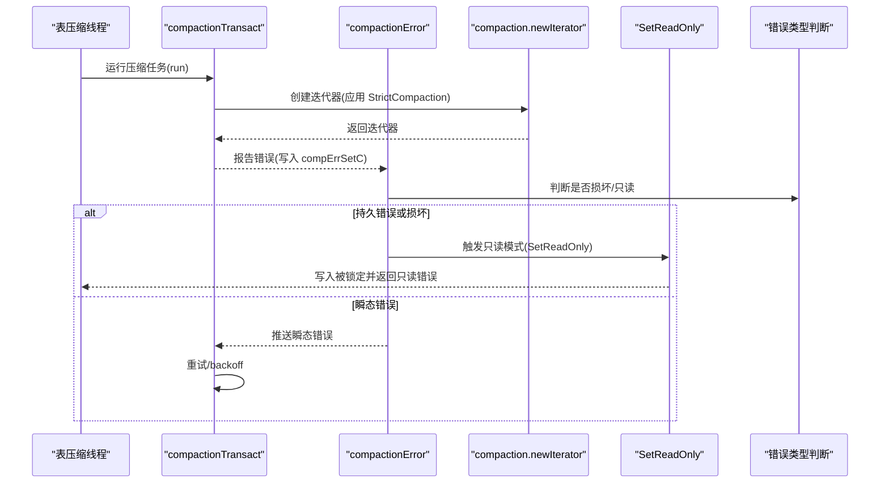
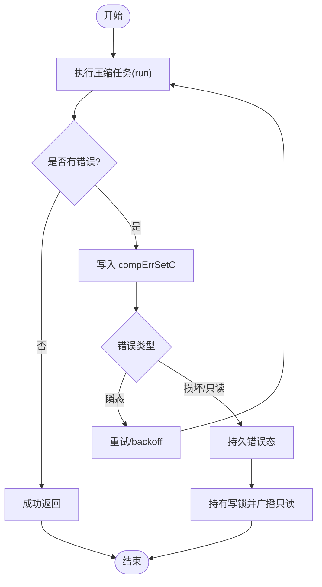
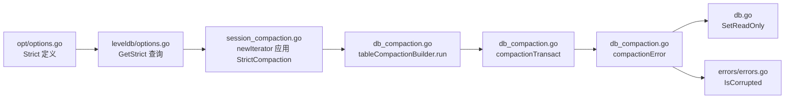

# 压缩故障处理

<cite>
**本文引用的文件**
- [session_compaction.go](file://leveldb/session_compaction.go)
- [db_compaction.go](file://leveldb/db_compaction.go)
- [options.go（opt）](file://leveldb/opt/options.go)
- [options.go（session）](file://leveldb/options.go)
- [errors.go（leveldb）](file://leveldb/errors.go)
- [errors.go（errors包）](file://leveldb/errors/errors.go)
- [db.go](file://leveldb/db.go)
</cite>

## 目录
1. [简介](#简介)
2. [项目结构](#项目结构)
3. [核心组件](#核心组件)
4. [架构总览](#架构总览)
5. [详细组件分析](#详细组件分析)
6. [依赖关系分析](#依赖关系分析)
7. [性能考量](#性能考量)
8. [故障排查指南](#故障排查指南)
9. [结论](#结论)
10. [附录：生产实践与监控建议](#附录生产实践与监控建议)

## 简介
本文件聚焦于 avccDB 的压缩过程故障处理机制，特别是 StrictCompaction 配置项的行为与实现路径。文档将解释：
- 当压缩过程中检测到损坏的 SSTable 时，系统如何依据 StrictCompaction 设置决定失败退出或尝试恢复；
- 压缩线程的错误传播通道与状态机；
- StrictCompaction 启用时如何导致数据库进入只读模式；
- 在 session_compaction.go 中如何检查严格级别并处理错误；
- 生产环境中的最佳实践，包括压缩失败率监控与告警配置。

## 项目结构
围绕压缩与严格模式的关键文件组织如下：
- 选项与严格模式定义：opt/options.go
- 会话层选项缓存与 Strict 查询：options.go（session）
- 压缩流程与事务重试：db_compaction.go
- 压缩迭代器与严格模式应用：session_compaction.go
- 错误类型与只读模式切换：errors.go（leveldb）、errors.go（errors包）、db.go

图表来源
- [opt/options.go（opt）](file://leveldb/opt/options.go#L130-L174)
- [options.go（opt）](file://leveldb/opt/options.go#L659-L664)
- [session_compaction.go](file://leveldb/session_compaction.go#L292-L330)
- [db_compaction.go](file://leveldb/db_compaction.go#L87-L139)
- [errors.go（leveldb）](file://leveldb/errors.go#L14-L21)
- [errors.go（errors包）](file://leveldb/errors/errors.go#L50-L79)
- [db.go](file://leveldb/db.go#L503-L529)

章节来源
- [opt/options.go（opt）](file://leveldb/opt/options.go#L130-L174)
- [options.go（opt）](file://leveldb/opt/options.go#L659-L664)
- [session_compaction.go](file://leveldb/session_compaction.go#L292-L330)
- [db_compaction.go](file://leveldb/db_compaction.go#L87-L139)
- [errors.go（leveldb）](file://leveldb/errors.go#L14-L21)
- [errors.go（errors包）](file://leveldb/errors/errors.go#L50-L79)
- [db.go](file://leveldb/db.go#L503-L529)

## 核心组件
- Strict 定义与默认值：opt/options.go 中定义了 StrictCompaction、StrictReader、StrictBlockChecksum 等标志位，并给出默认 Strict 组合。
- 严格模式查询：opt.Options.GetStrict(...) 提供全局与读选项的严格级别合并逻辑。
- 压缩事务与重试：db_compaction.go 的 compactionTransact 负责运行压缩任务并在错误时进行回退与重试；compactionError 负责错误状态机与只读切换。
- 压缩迭代器严格模式：session_compaction.go 的 compaction.newIterator 在构建迭代器时根据 StrictCompaction 设置读取严格级别。
- 只读模式切换：db.go 的 SetReadOnly 将写入锁定并广播只读状态，使后续写操作返回只读错误。

章节来源
- [opt/options.go（opt）](file://leveldb/opt/options.go#L130-L174)
- [options.go（opt）](file://leveldb/opt/options.go#L659-L664)
- [db_compaction.go](file://leveldb/db_compaction.go#L152-L235)
- [session_compaction.go](file://leveldb/session_compaction.go#L292-L330)
- [db.go](file://leveldb/db.go#L503-L529)

## 架构总览
压缩故障处理的整体流程如下：
- 压缩任务通过 compactionTransact 执行，内部循环重试，遇到错误时写入 compErrSetC；
- compactionError 作为后台协程，根据收到的错误类型在“瞬态错误”、“持久错误”之间切换；
- 当检测到持久错误（如损坏）或显式只读请求时，SetReadOnly 将写入锁定并广播只读；
- 压缩迭代器在构建阶段根据 StrictCompaction 决定是否开启严格校验，从而影响压缩过程中对损坏数据的处理策略。

图表来源
- [db_compaction.go](file://leveldb/db_compaction.go#L152-L235)
- [db_compaction.go](file://leveldb/db_compaction.go#L87-L139)
- [session_compaction.go](file://leveldb/session_compaction.go#L292-L330)
- [db.go](file://leveldb/db.go#L503-L529)
- [errors.go（errors包）](file://leveldb/errors/errors.go#L50-L79)

## 详细组件分析

### StrictCompaction 行为与实现机制
- Strict 定义：opt/options.go 中明确标注 StrictCompaction 的语义为“压缩过程中损坏的 SSTable 将导致压缩失败”，并会使数据库进入只读模式。
- 默认严格级别：DefaultStrict 包含 StrictCompaction，意味着未显式配置时默认启用该行为。
- 严格级别查询：opt.Options.GetStrict(...) 支持全局 Strict 与读选项 StrictOverride 的组合，确保读取与压缩均能正确应用严格级别。

章节来源
- [opt/options.go（opt）](file://leveldb/opt/options.go#L130-L174)
- [opt/options.go（opt）](file://leveldb/opt/options.go#L659-L664)

### 压缩迭代器中的严格级别应用
- 在 session_compaction.go 的 compaction.newIterator 中：
  - 从会话选项获取 StrictCompaction；
  - 若启用，则将读选项的 Strict 或者 StrictReader 合并到读取严格级别；
  - 使用合并后的严格级别创建迭代器，从而在压缩过程中对块校验等进行严格检查。
- 这一机制确保当 StrictCompaction 开启时，压缩读取阶段即启用严格的块校验，一旦发现损坏，压缩过程将直接失败并触发错误传播。

章节来源
- [session_compaction.go](file://leveldb/session_compaction.go#L292-L330)

### 压缩事务与错误传播
- compactionTransact：
  - 循环执行压缩任务，记录执行计数；
  - 将每次 run 的结果写入 compErrSetC；
  - 若返回错误，根据是否损坏或关闭，决定是否退出或重试；
  - 支持禁用重试退避（DisableCompactionBackoff）。
- compactionError：
  - 三态状态机：无错误 -> 瞬态错误 -> 持久错误；
  - 对于损坏或只读错误，进入持久错误态并持有写锁，阻止写入；
  - 对于普通瞬态错误，仅向外部通道广播，不阻塞写入。

图表来源
- [db_compaction.go](file://leveldb/db_compaction.go#L152-L235)
- [db_compaction.go](file://leveldb/db_compaction.go#L87-L139)

章节来源
- [db_compaction.go](file://leveldb/db_compaction.go#L87-L139)
- [db_compaction.go](file://leveldb/db_compaction.go#L152-L235)

### 数据库进入只读模式的触发点
- SetReadOnly：
  - 获取写锁并标记 compWriteLocking；
  - 向 compErrSetC 发送 ErrReadOnly；
  - 外部写入路径在获取写锁时会立即收到只读错误，从而避免写入破坏数据。
- 该机制由 compactionError 的持久错误态与写锁协作完成，确保在压缩检测到严重问题后，系统整体进入只读保护。

章节来源
- [db.go](file://leveldb/db.go#L503-L529)
- [errors.go（leveldb）](file://leveldb/errors.go#L14-L21)

### session_compaction.go 中的严格级别检查与错误处理
- 在 compaction.newIterator 中：
  - 读取 StrictCompaction；
  - 若启用，将 StrictReader 合并到读取严格级别；
  - 使用合并后的严格级别创建迭代器，用于压缩读取。
- 在 tableCompactionBuilder.run 中：
  - 当解析内部键发生错误且 strict 为真时，直接返回错误，终止压缩；
  - 这保证了在严格模式下，损坏的键会被视为致命错误，防止污染输出。

章节来源
- [session_compaction.go](file://leveldb/session_compaction.go#L292-L330)
- [db_compaction.go](file://leveldb/db_compaction.go#L532-L555)

## 依赖关系分析
- Strict 定义与查询链路：
  - opt/options.go 定义 Strict 标志位；
  - options.go（session）提供缓存与查询方法；
  - session_compaction.go 与 db_compaction.go 通过查询应用严格级别。
- 错误类型与传播链路：
  - errors/errors.go 提供 IsCorrupted 判断；
  - db_compaction.go 的 compactionTransact 与 compactionError 共同构成错误传播与状态机；
  - db.go 的 SetReadOnly 与 ErrReadOnly 形成只读保护闭环。

图表来源
- [opt/options.go（opt）](file://leveldb/opt/options.go#L130-L174)
- [options.go（opt）](file://leveldb/opt/options.go#L659-L664)
- [session_compaction.go](file://leveldb/session_compaction.go#L292-L330)
- [db_compaction.go](file://leveldb/db_compaction.go#L152-L235)
- [db.go](file://leveldb/db.go#L503-L529)
- [errors.go（errors包）](file://leveldb/errors/errors.go#L50-L79)

章节来源
- [opt/options.go（opt）](file://leveldb/opt/options.go#L130-L174)
- [options.go（opt）](file://leveldb/opt/options.go#L659-L664)
- [session_compaction.go](file://leveldb/session_compaction.go#L292-L330)
- [db_compaction.go](file://leveldb/db_compaction.go#L152-L235)
- [db.go](file://leveldb/db.go#L503-L529)
- [errors.go（errors包）](file://leveldb/errors/errors.go#L50-L79)

## 性能考量
- 严格模式下的块校验会增加 CPU 与 I/O 开销，建议在生产环境中按需启用 StrictCompaction；
- 重试退避可降低频繁重试带来的压力，可通过 DisableCompactionBackoff 关闭以减少抖动；
- 压缩失败率升高时应优先检查底层存储健康度与硬件可靠性，避免因磁盘故障引发大量损坏块。

## 故障排查指南
- 如何识别损坏的 SSTable：
  - 观察压缩日志与错误通道，IsCorrupted 错误会触发持久错误态；
  - 检查 compErrC 与 compPerErrC 的消费情况，确认是否进入只读保护。
- 如何验证严格模式生效：
  - 在 options 中启用 StrictCompaction，默认已包含；
  - 通过压缩迭代器严格级别应用路径验证，确保损坏键直接导致压缩失败。
- 如何恢复只读模式：
  - SetReadOnly 会广播只读并持有写锁，阻止后续写入；
  - 重启数据库或修复底层存储后，可重新打开为读写模式。

章节来源
- [db_compaction.go](file://leveldb/db_compaction.go#L87-L139)
- [errors.go（errors包）](file://leveldb/errors/errors.go#L50-L79)
- [db.go](file://leveldb/db.go#L503-L529)

## 结论
StrictCompaction 在 avccDB 的压缩过程中扮演关键角色：它通过在压缩读取阶段启用严格校验，确保损坏的 SSTable 能够被及时发现并阻止进一步写入风险；当检测到持久性错误或用户请求只读时，系统通过写锁与错误通道协同，将数据库置于只读保护状态，保障数据一致性与可用性。生产环境中应结合监控与告警策略，及时发现压缩失败率异常并定位底层存储问题。

## 附录：生产实践与监控建议
- 监控指标建议：
  - 压缩失败次数与失败率（按级别统计）；
  - 压缩耗时分布与重试次数；
  - 只读模式触发次数与持续时间；
  - 底层存储 I/O 错误与磁盘健康度。
- 告警阈值建议：
  - 压缩失败率超过阈值（例如单实例每小时超过若干次）触发告警；
  - 持续进入只读模式超过阈值时触发紧急告警；
  - 存储 I/O 错误率上升时触发预警。
- 配置建议：
  - 在高可靠性场景启用 StrictCompaction；
  - 合理设置 DisableCompactionBackoff 以平衡稳定性与吞吐；
  - 定期巡检磁盘与文件系统，预防性更换老化设备。