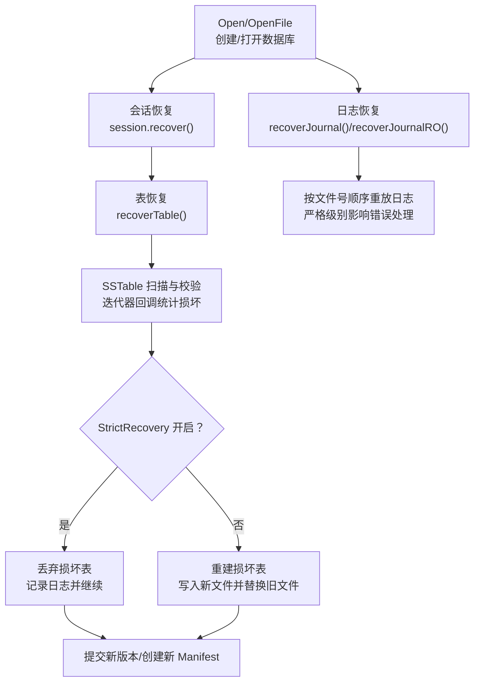
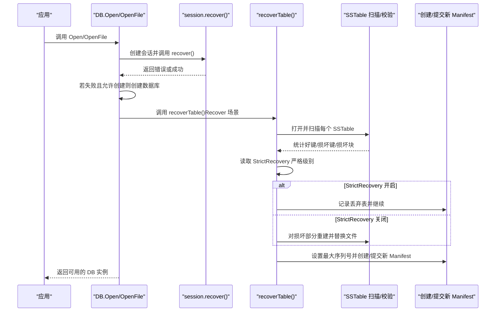
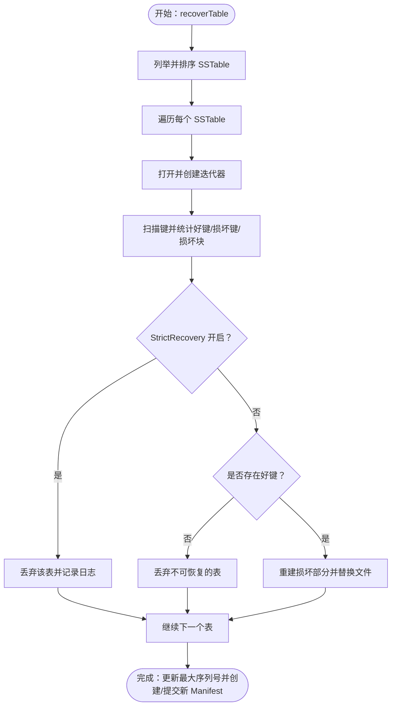
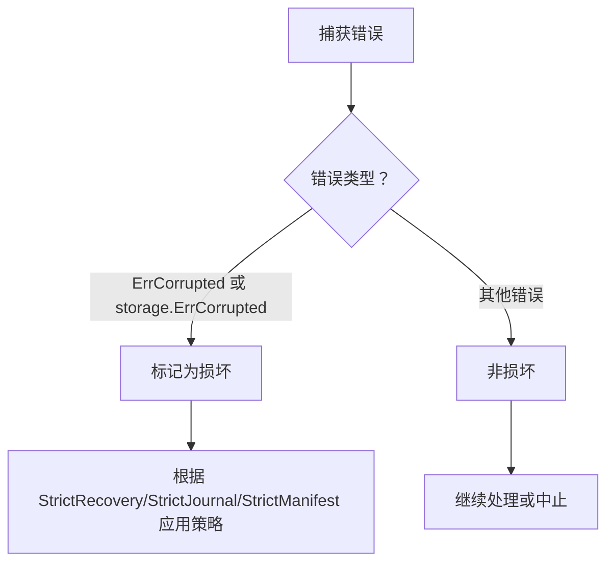
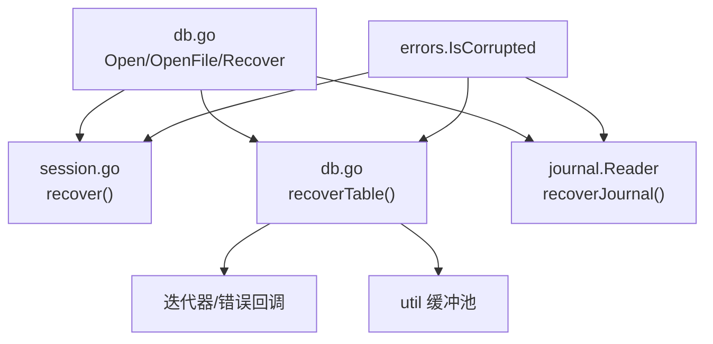

# 恢复策略

<cite>
**本文引用的文件列表**
- [db.go](file://leveldb/db.go)
- [options.go](file://leveldb/opt/options.go)
- [session.go](file://leveldb/session.go)
- [errors.go](file://leveldb/errors/errors.go)
- [corrupt_test.go](file://leveldb/corrupt_test.go)
</cite>

## 目录
1. [简介](#简介)
2. [项目结构](#项目结构)
3. [核心组件](#核心组件)
4. [架构总览](#架构总览)
5. [详细组件分析](#详细组件分析)
6. [依赖关系分析](#依赖关系分析)
7. [性能考量](#性能考量)
8. [故障排查指南](#故障排查指南)
9. [结论](#结论)
10. [附录](#附录)

## 简介
本文件面向 avccDB 的数据库恢复策略，聚焦 StrictRecovery 配置项的行为与实现机制。文档详细说明在数据库打开与恢复过程中，当遇到损坏的 SSTable 文件时，系统如何依据 StrictRecovery 设置决定丢弃损坏文件继续启动或中止恢复；解释 IsCorrupted 函数如何识别各类损坏类型，并阐述恢复流程中 StrictRecovery 策略的应用方式。同时，提供代码路径示例，展示 db.go 中恢复逻辑与严格级别的交互，并给出数据丢失风险评估与生产环境安全恢复实践建议。

## 项目结构
围绕恢复策略的关键代码主要分布在以下模块：
- 数据库打开与恢复入口：Open、OpenFile、Recover、RecoverFile
- 恢复流程：会话恢复（Manifest）、日志恢复（Journal）、表恢复（Table）
- 严格级别与选项：StrictRecovery、StrictJournal、StrictJournalChecksum、StrictReader
- 错误类型与判断：ErrCorrupted、IsCorrupted

图表来源
- [db.go](file://leveldb/db.go#L177-L293)
- [session.go](file://leveldb/session.go#L129-L208)
- [db.go](file://leveldb/db.go#L295-L497)

章节来源
- [db.go](file://leveldb/db.go#L177-L293)
- [session.go](file://leveldb/session.go#L129-L208)

## 核心组件
- 严格级别定义与默认值
  - StrictRecovery：启用后，表恢复阶段遇到损坏将直接丢弃该表，不进行重建。
  - StrictJournal、StrictJournalChecksum：影响日志读取的严格性。
  - StrictReader：影响只读模式下的严格级别。
  - 默认严格级别包含 StrictJournalChecksum、StrictBlockChecksum、StrictCompaction、StrictReader。
- 恢复入口
  - Open/OpenFile：尝试打开现有数据库，若不存在且允许则创建；若存在但损坏则返回错误（除非使用 Recover）。
  - Recover/RecoverFile：忽略 Manifest 并执行表级恢复，强制走 recoverTable 流程。
- 表恢复 recoverTable
  - 列举所有 SSTable，逐个扫描，统计“好键”“损坏键”“损坏块”数量。
  - 若 StrictRecovery 开启且检测到任何损坏，则丢弃该表；否则在有好键的前提下重建表并替换原文件。
- 日志恢复 recoverJournal/recoverJournalRO
  - 严格级别影响对损坏日志条目的处理：StrictJournal 开启时，损坏将导致错误；关闭时可跳过损坏并继续重放。
- 错误识别 IsCorrupted
  - 用于判断错误是否属于“损坏”类别，从而决定是否跳过或中止。

章节来源
- [options.go](file://leveldb/opt/options.go#L130-L174)
- [options.go](file://leveldb/opt/options.go#L659-L664)
- [db.go](file://leveldb/db.go#L177-L293)
- [db.go](file://leveldb/db.go#L295-L497)
- [db.go](file://leveldb/db.go#L499-L767)
- [errors.go](file://leveldb/errors/errors.go#L49-L59)

## 架构总览
下图展示了数据库打开与恢复的整体流程，以及 StrictRecovery 在表恢复阶段的关键作用点。

图表来源
- [db.go](file://leveldb/db.go#L177-L293)
- [session.go](file://leveldb/session.go#L129-L208)
- [db.go](file://leveldb/db.go#L295-L497)

## 详细组件分析

### StrictRecovery 的行为与实现机制
- 严格级别来源与默认值
  - 严格级别通过 Options.Strict 传递，StrictRecovery 位用于控制表恢复阶段的策略。
  - 默认严格级别包含多个位，StrictRecovery 不在默认集合中，需显式开启。
- 表恢复 recoverTable 的关键步骤
  - 列举并排序所有 SSTable。
  - 为每个表创建迭代器，设置错误回调以统计损坏块。
  - 扫描键，解析内部键，统计“好键/损坏键/损坏块”。
  - 读取 StrictRecovery 严格级别：
    - 若开启且检测到任何损坏（损坏键或损坏块），则丢弃该表并记录日志，继续下一个表。
    - 若关闭且存在好键，则对损坏部分进行重建（重新写入有效键），然后替换原文件。
  - 更新最大序列号、记录表到 level0，并最终创建/提交新的 Manifest。
- 与 StrictReader 的关系
  - recoverTable 内部会屏蔽 StrictReader，确保 StrictRecovery 能够独立生效，避免 Reader 严格级别覆盖恢复策略。

图表来源
- [db.go](file://leveldb/db.go#L295-L497)

章节来源
- [db.go](file://leveldb/db.go#L295-L497)
- [options.go](file://leveldb/opt/options.go#L130-L174)
- [options.go](file://leveldb/opt/options.go#L659-L664)

### IsCorrupted 如何识别损坏类型
- IsCorrupted 判断逻辑
  - 当错误类型为 ErrCorrupted 或 storage.ErrCorrupted 时，返回真，表示该错误属于“损坏”类别。
- 在恢复流程中的应用
  - 表恢复：迭代器错误回调中，若错误被识别为损坏，会增加“损坏块”计数；最终根据 StrictRecovery 决定丢弃或重建。
  - 日志恢复：当解码日志批次出现损坏且非严格模式时，会跳过该批次并继续重放。
  - Manifest 恢复：当读取 Manifest 条目出现损坏且严格级别开启时，会中止恢复并返回错误。

图表来源
- [errors.go](file://leveldb/errors/errors.go#L49-L59)
- [db.go](file://leveldb/db.go#L295-L497)
- [db.go](file://leveldb/db.go#L499-L767)
- [session.go](file://leveldb/session.go#L129-L208)

章节来源
- [errors.go](file://leveldb/errors/errors.go#L49-L59)
- [db.go](file://leveldb/db.go#L295-L497)
- [db.go](file://leveldb/db.go#L499-L767)
- [session.go](file://leveldb/session.go#L129-L208)

### 恢复流程与严格级别的交互（代码路径示例）
- 表恢复入口与严格级别
  - recoverTable：读取 StrictRecovery 并据此决定丢弃或重建。
  - 代码路径参考：[recoverTable](file://leveldb/db.go#L295-L497)
- 日志恢复与严格级别
  - recoverJournal/recoverJournalRO：读取 StrictJournal 和 StrictJournalChecksum，决定是否跳过损坏或中止。
  - 代码路径参考：[recoverJournal](file://leveldb/db.go#L499-L767)
- Manifest 恢复与严格级别
  - session.recover：读取 StrictManifest，决定跳过损坏条目或中止。
  - 代码路径参考：[session.recover](file://leveldb/session.go#L129-L208)
- 选项与默认严格级别
  - Options.GetStrict：根据全局 Strict 与默认值计算实际严格级别。
  - 代码路径参考：[Options.GetStrict](file://leveldb/opt/options.go#L659-L664)

章节来源
- [db.go](file://leveldb/db.go#L295-L497)
- [db.go](file://leveldb/db.go#L499-L767)
- [session.go](file://leveldb/session.go#L129-L208)
- [options.go](file://leveldb/opt/options.go#L659-L664)

### 生产环境安全恢复实践指南
- 建议的严格级别组合
  - 一般生产环境建议开启：StrictJournalChecksum、StrictBlockChecksum、StrictCompaction、StrictReader。
  - 若需要在表损坏时尽可能保留数据，可考虑关闭 StrictRecovery，以便自动重建损坏表。
  - 若希望在表损坏时立即中止，确保数据一致性优先，可开启 StrictRecovery。
- 恢复前准备
  - 备份当前数据库目录（至少备份 Manifest 与日志文件）。
  - 使用 Recover/RecoverFile 进行恢复，避免直接打开损坏的数据库。
- 恢复后验证
  - 通过迭代器扫描关键范围，核对键值数量与一致性。
  - 参考测试用例中的检查方法，确保数据完整性。
- 数据丢失风险评估
  - StrictRecovery 开启：遇到损坏表将直接丢弃，可能导致部分键丢失；适合容忍少量数据损失的场景。
  - StrictRecovery 关闭：对损坏部分进行重建，尽量保留数据，但可能引入重建过程中的不一致风险。
  - 日志损坏：在严格模式下可能导致恢复失败；在非严格模式下会跳过损坏日志，可能丢失最近写入的数据。

章节来源
- [corrupt_test.go](file://leveldb/corrupt_test.go#L222-L262)
- [corrupt_test.go](file://leveldb/corrupt_test.go#L264-L309)
- [corrupt_test.go](file://leveldb/corrupt_test.go#L460-L486)

## 依赖关系分析
- 组件耦合
  - DB.Open/OpenFile 依赖 session.recover 与 recoverTable。
  - recoverTable 依赖迭代器与表读写器，统计损坏并决定丢弃或重建。
  - 日志恢复依赖 journal.Reader，并受 StrictJournal/StrictJournalChecksum 影响。
  - 错误识别 IsCorrupted 作为通用判断工具贯穿各恢复阶段。
- 外部依赖
  - storage 层负责文件列表、打开、读写与删除等操作。
  - util 缓冲池用于高效复制与重建。

图表来源
- [db.go](file://leveldb/db.go#L177-L293)
- [db.go](file://leveldb/db.go#L295-L497)
- [db.go](file://leveldb/db.go#L499-L767)
- [session.go](file://leveldb/session.go#L129-L208)
- [errors.go](file://leveldb/errors/errors.go#L49-L59)

章节来源
- [db.go](file://leveldb/db.go#L177-L293)
- [db.go](file://leveldb/db.go#L295-L497)
- [db.go](file://leveldb/db.go#L499-L767)
- [session.go](file://leveldb/session.go#L129-L208)
- [errors.go](file://leveldb/errors/errors.go#L49-L59)

## 性能考量
- 严格级别对性能的影响
  - StrictBlockChecksum 与 StrictJournalChecksum 会在读取与重放时增加校验开销，提升可靠性但降低吞吐。
  - StrictRecovery 关闭时，重建损坏表会产生额外的写入与重命名操作，可能带来短暂延迟。
- I/O 与缓冲
  - 表重建使用 util.BufferPool 提升复制效率，减少临时文件的多次分配与释放。
- 建议
  - 在高可靠需求场景开启 StrictJournalChecksum、StrictBlockChecksum、StrictCompaction。
  - 在数据量大、频繁恢复场景，适当调整 WriteBuffer 与压缩策略以平衡性能与恢复成本。

## 故障排查指南
- 常见问题定位
  - Manifest 损坏：使用 Recover 执行表恢复，或手动修复 Manifest。
  - 日志损坏：检查 StrictJournal/StrictJournalChecksum 设置，必要时跳过损坏日志。
  - SSTable 损坏：根据 StrictRecovery 决策，确认是否丢弃或重建。
- 关键日志与指标
  - 表恢复日志包含“好键/损坏键/损坏块/大小/序列号”，可用于快速定位问题表。
  - 日志恢复日志包含“文件号、错误类型、跳过/中止”信息。
- 代码路径参考
  - Manifest 恢复错误处理与中止条件：[session.recover](file://leveldb/session.go#L129-L208)
  - 日志恢复错误处理与跳过逻辑：[recoverJournal](file://leveldb/db.go#L499-L767)
  - 表恢复丢弃/重建分支：[recoverTable](file://leveldb/db.go#L295-L497)

章节来源
- [session.go](file://leveldb/session.go#L129-L208)
- [db.go](file://leveldb/db.go#L295-L497)
- [db.go](file://leveldb/db.go#L499-L767)

## 结论
StrictRecovery 是 avccDB 恢复策略中的关键开关：开启时，系统在表恢复阶段遇到任何损坏即丢弃该表，保证快速启动但可能造成数据丢失；关闭时，系统尝试重建损坏部分，尽量保留数据，但可能引入重建风险。结合 StrictJournal、StrictJournalChecksum、StrictReader 与 StrictBlockChecksum，可在可靠性与可用性之间取得平衡。生产环境中应基于业务容忍度选择合适的严格级别组合，并在恢复前后做好备份与验证工作。

## 附录
- 术语
  - Manifest：数据库元信息文件，记录版本、表分布、序列号等。
  - Journal：内存日志文件，记录未落盘的写入批次。
  - SSTable：Sorted String Table，持久化的键值存储文件。
- 参考测试
  - 表损坏与恢复测试：[corrupt_test.go](file://leveldb/corrupt_test.go#L222-L262)
  - Manifest 缺失与恢复测试：[corrupt_test.go](file://leveldb/corrupt_test.go#L264-L309)
  - 表恢复与序列号一致性测试：[corrupt_test.go](file://leveldb/corrupt_test.go#L460-L486)