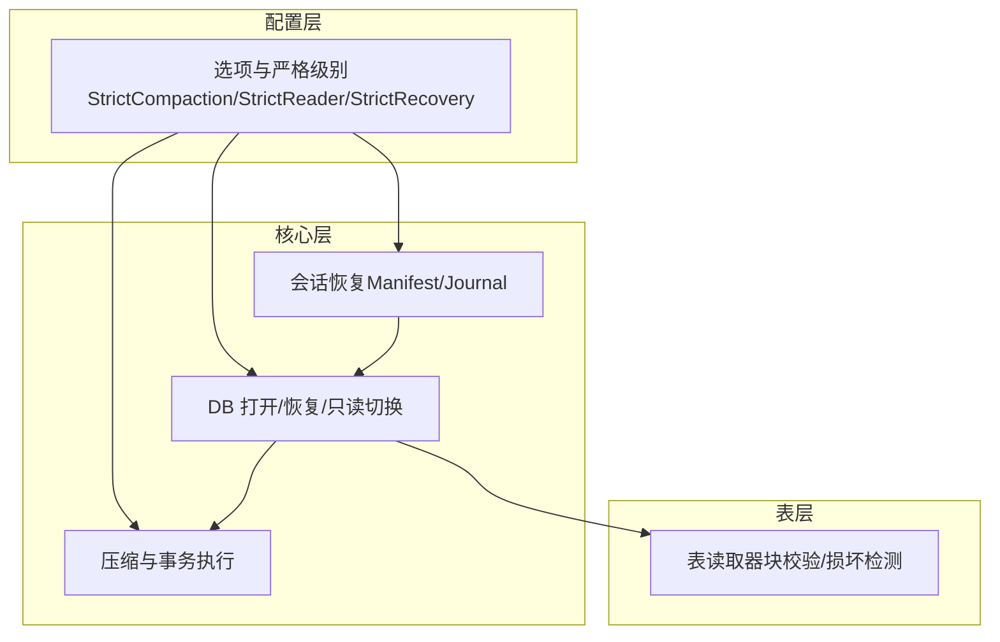
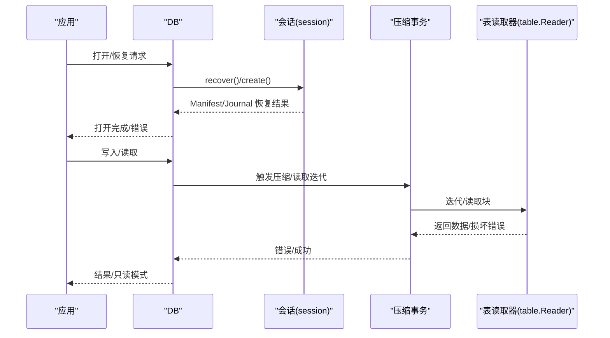
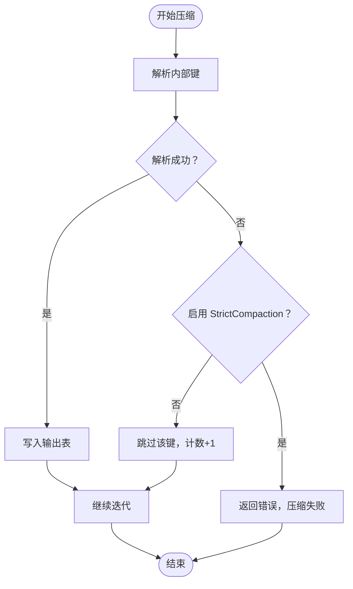
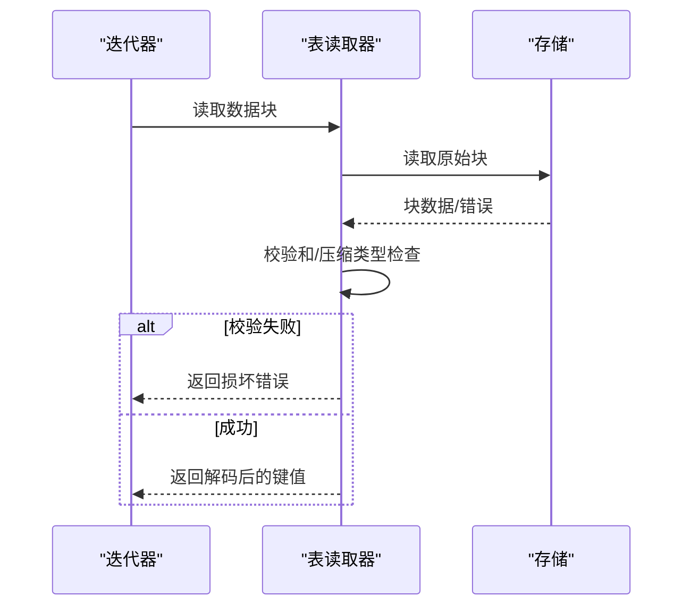
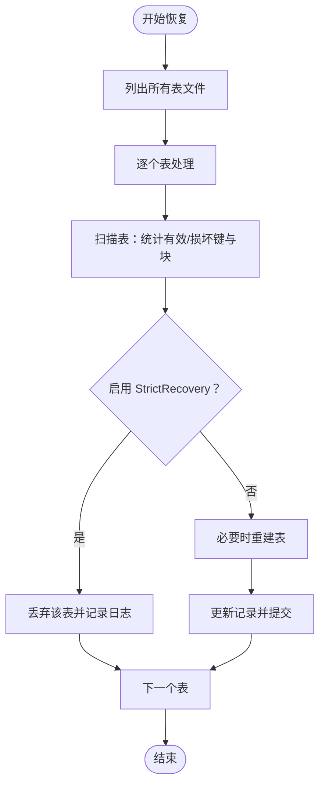
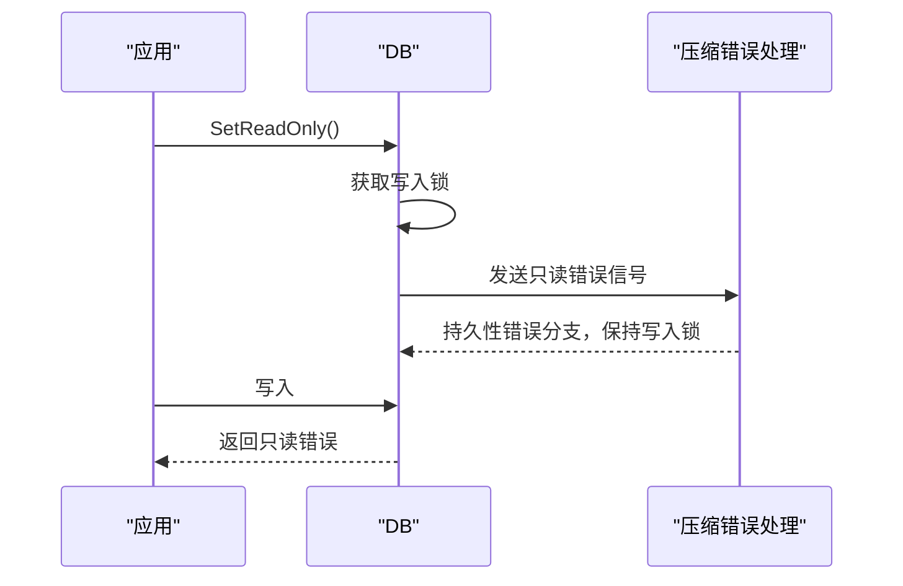
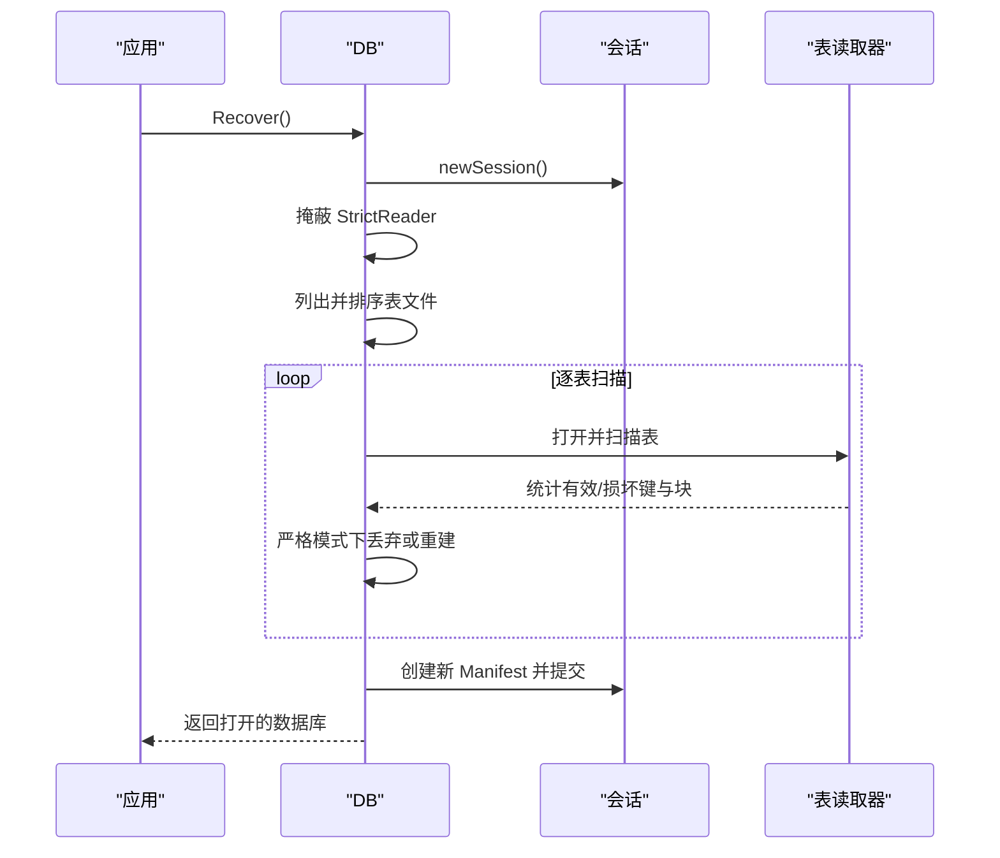
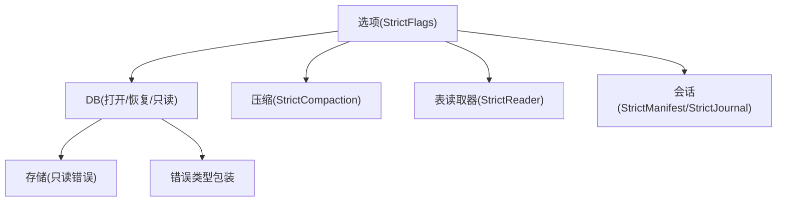

# 故障处理策略

<cite>
**本文引用的文件**
- [leveldb/opt/options.go](file://leveldb/opt/options.go)
- [leveldb/db.go](file://leveldb/db.go)
- [leveldb/db_compaction.go](file://leveldb/db_compaction.go)
- [leveldb/session.go](file://leveldb/session.go)
- [leveldb/table/reader.go](file://leveldb/table/reader.go)
- [leveldb/errors.go](file://leveldb/errors.go)
- [leveldb/db_write.go](file://leveldb/db_write.go)
</cite>

## 目录
1. [简介](#简介)
2. [项目结构](#项目结构)
3. [核心组件](#核心组件)
4. [架构总览](#架构总览)
5. [详细组件分析](#详细组件分析)
6. [依赖关系分析](#依赖关系分析)
7. [性能考量](#性能考量)
8. [故障排查指南](#故障排查指南)
9. [结论](#结论)
10. [附录](#附录)

## 简介
本文件聚焦于 avccDB 的故障处理机制，围绕 StrictCompaction、StrictReader 和 StrictRecovery 三项严格级别配置展开，系统性阐述在压缩过程、读取操作与恢复阶段遇到损坏的 SSTable 时的响应策略；明确数据库进入只读模式的触发条件与影响，并给出生产环境中的监控指标与告警建议及手动恢复流程。

## 项目结构
- 配置与严格级别定义位于选项模块，包含 StrictCompaction、StrictReader、StrictRecovery 等标志位。
- 数据库打开、恢复、压缩与只读切换逻辑集中在核心 DB 模块。
- 表读取器负责块级校验与损坏检测，是 StrictReader 生效的关键。
- 会话层负责 Manifest 与 Journal 的恢复，体现 StrictManifest、StrictJournal、StrictJournalChecksum 的作用。

图表来源
- [leveldb/opt/options.go](file://leveldb/opt/options.go#L130-L174)
- [leveldb/db.go](file://leveldb/db.go#L177-L293)
- [leveldb/db_compaction.go](file://leveldb/db_compaction.go#L87-L139)
- [leveldb/session.go](file://leveldb/session.go#L129-L208)
- [leveldb/table/reader.go](file://leveldb/table/reader.go#L550-L606)

章节来源
- [leveldb/opt/options.go](file://leveldb/opt/options.go#L130-L174)
- [leveldb/db.go](file://leveldb/db.go#L177-L293)
- [leveldb/db_compaction.go](file://leveldb/db_compaction.go#L87-L139)
- [leveldb/session.go](file://leveldb/session.go#L129-L208)
- [leveldb/table/reader.go](file://leveldb/table/reader.go#L550-L606)

## 核心组件
- 严格级别枚举与默认值：
  - StrictCompaction：压缩过程中遇到损坏的 SSTable 将导致压缩失败并可能使数据库进入只读模式。
  - StrictReader：读取过程中遇到损坏的 SSTable 将中断读取并返回错误。
  - StrictRecovery：恢复阶段遇到损坏的 SSTable 将被丢弃或重建。
- 数据库打开与恢复：
  - Open/OpenFile：根据选项决定是否创建新数据库、是否以只读方式打开。
  - Recover/RecoverFile：忽略损坏的 Manifest，仅基于可用数据重建数据库。
- 压缩与事务：
  - 压缩过程通过事务封装，支持重试与回滚；持久化错误会阻塞写入并可能触发只读模式。
- 表读取器：
  - 负责块级校验、解码与损坏检测，严格级别影响其行为与错误传播。

章节来源
- [leveldb/opt/options.go](file://leveldb/opt/options.go#L130-L174)
- [leveldb/db.go](file://leveldb/db.go#L177-L293)
- [leveldb/db_compaction.go](file://leveldb/db_compaction.go#L152-L235)
- [leveldb/table/reader.go](file://leveldb/table/reader.go#L550-L606)

## 架构总览
下图展示严格级别在不同阶段的作用路径与关键决策点。

图表来源
- [leveldb/db.go](file://leveldb/db.go#L177-L293)
- [leveldb/session.go](file://leveldb/session.go#L129-L208)
- [leveldb/db_compaction.go](file://leveldb/db_compaction.go#L152-L235)
- [leveldb/table/reader.go](file://leveldb/table/reader.go#L550-L606)

## 详细组件分析

### 严格级别：StrictCompaction
- 行为要点
  - 在压缩构建阶段，若遇到损坏键或损坏块且启用 StrictCompaction，则压缩直接失败。
  - 压缩失败会被视为持久性错误，触发写入锁并可能使数据库进入只读模式。
- 关键实现位置
  - 压缩构建器在遍历输入时，若 strict 为真且解析内部键失败，会直接返回错误，终止压缩。
  - 压缩事务捕获压缩错误，区分瞬时与持久性错误，持久性错误会导致写入锁与只读模式。

图表来源
- [leveldb/db_compaction.go](file://leveldb/db_compaction.go#L529-L555)

章节来源
- [leveldb/db_compaction.go](file://leveldb/db_compaction.go#L529-L555)
- [leveldb/db_compaction.go](file://leveldb/db_compaction.go#L87-L139)

### 严格级别：StrictReader
- 行为要点
  - 读取过程中，表读取器在块解码或校验失败时，会构造损坏错误并返回。
  - 若启用 StrictReader，读取操作将因损坏而中断，返回错误。
- 关键实现位置
  - 表读取器在读取块与解码条目时，对块头、校验和、压缩类型等进行严格校验，失败即返回损坏错误。
  - 读取器将损坏错误包装为带文件描述符的统一错误类型，便于上层识别。

图表来源
- [leveldb/table/reader.go](file://leveldb/table/reader.go#L568-L606)
- [leveldb/table/reader.go](file://leveldb/table/reader.go#L608-L656)

章节来源
- [leveldb/table/reader.go](file://leveldb/table/reader.go#L550-L606)
- [leveldb/table/reader.go](file://leveldb/table/reader.go#L608-L656)

### 严格级别：StrictRecovery
- 行为要点
  - 恢复阶段会扫描所有 SSTable，统计有效键、损坏键与损坏块数量。
  - 当启用 StrictRecovery 且发现损坏时，会丢弃该 SSTable 并记录日志。
  - 若 SSTable 中无有效键，则判定为不可恢复并丢弃。
- 关键实现位置
  - recoverTable 中对每个表进行扫描与重建判断，严格模式下直接丢弃损坏表。
  - 恢复完成后创建新的 Manifest 并提交。

图表来源
- [leveldb/db.go](file://leveldb/db.go#L295-L497)

章节来源
- [leveldb/db.go](file://leveldb/db.go#L295-L497)

### 数据库打开与只读模式
- 打开流程
  - Open/OpenFile 根据选项决定创建或打开数据库；若只读或存在缺失则按策略处理。
  - 打开后根据只读选项决定是否立即进入只读模式。
- 只读模式触发
  - SetReadOnly 通过向压缩错误通道发送只读错误，从而持有写入锁并阻止后续写入。
  - 压缩错误处理线程检测到只读错误后，进入持久性错误分支，保持写入锁并阻塞写入。
- 影响
  - 写入操作返回只读错误；读取仍可正常进行；数据库保持一致性状态。

图表来源
- [leveldb/db_write.go](file://leveldb/db_write.go#L503-L529)
- [leveldb/db_compaction.go](file://leveldb/db_compaction.go#L87-L139)

章节来源
- [leveldb/db_write.go](file://leveldb/db_write.go#L503-L529)
- [leveldb/db_compaction.go](file://leveldb/db_compaction.go#L87-L139)
- [leveldb/errors.go](file://leveldb/errors.go#L14-L21)

### 恢复流程（Recover）
- 流程概述
  - 忽略 Manifest 文件，直接扫描所有表文件，按文件号排序。
  - 对每个表进行扫描与统计，严格模式下丢弃损坏表；必要时重建有效表。
  - 更新序列号，创建新 Manifest 并提交。
- 关键差异
  - 恢复时会屏蔽 StrictReader，确保恢复过程不受读取严格性影响。

图表来源
- [leveldb/db.go](file://leveldb/db.go#L245-L293)
- [leveldb/db.go](file://leveldb/db.go#L295-L497)
- [leveldb/session.go](file://leveldb/session.go#L129-L208)

章节来源
- [leveldb/db.go](file://leveldb/db.go#L245-L293)
- [leveldb/db.go](file://leveldb/db.go#L295-L497)
- [leveldb/session.go](file://leveldb/session.go#L129-L208)

## 依赖关系分析
- 严格级别与各模块耦合
  - 选项模块提供 StrictCompaction、StrictReader、StrictRecovery 的定义与默认值。
  - DB 层在打开、恢复、压缩与只读切换中读取严格级别并影响控制流。
  - 表读取器在块级校验中受 StrictReader 影响。
  - 会话层在 Manifest/Journal 恢复中受 StrictManifest、StrictJournal、StrictJournalChecksum 影响。
- 外部依赖
  - 存储层在只读模式下返回只读错误，防止写入。
  - 错误类型统一包装，便于上层识别与处理。

图表来源
- [leveldb/opt/options.go](file://leveldb/opt/options.go#L130-L174)
- [leveldb/db.go](file://leveldb/db.go#L177-L293)
- [leveldb/db_compaction.go](file://leveldb/db_compaction.go#L529-L555)
- [leveldb/table/reader.go](file://leveldb/table/reader.go#L550-L606)
- [leveldb/session.go](file://leveldb/session.go#L129-L208)
- [leveldb/errors.go](file://leveldb/errors.go#L14-L21)

章节来源
- [leveldb/opt/options.go](file://leveldb/opt/options.go#L130-L174)
- [leveldb/db.go](file://leveldb/db.go#L177-L293)
- [leveldb/db_compaction.go](file://leveldb/db_compaction.go#L529-L555)
- [leveldb/table/reader.go](file://leveldb/table/reader.go#L550-L606)
- [leveldb/session.go](file://leveldb/session.go#L129-L208)
- [leveldb/errors.go](file://leveldb/errors.go#L14-L21)

## 性能考量
- 压缩回退与重试
  - 压缩事务在发生错误时采用指数回退策略，避免频繁重试造成资源争用。
- 写入延迟与暂停
  - 当 L0 文件过多时，写入会因压缩暂停而延迟；可通过属性接口查询写入延迟与暂停状态。
- 缓存与 I/O
  - 读取严格性会增加校验成本；在高并发场景下需权衡严格性与性能。

章节来源
- [leveldb/db_compaction.go](file://leveldb/db_compaction.go#L170-L235)
- [leveldb/db.go](file://leveldb/db.go#L1322-L1351)

## 故障排查指南

### 常见问题定位
- 压缩失败
  - 检查是否启用了 StrictCompaction；若损坏键较多，压缩会直接失败。
  - 查看压缩错误通道与持久性错误队列，确认是否已进入只读模式。
- 读取中断
  - 检查是否启用了 StrictReader；若表损坏，读取会返回损坏错误。
  - 使用表读取器的错误包装信息定位具体块与原因。
- 恢复异常
  - 恢复时会屏蔽 StrictReader，但 StrictRecovery 会丢弃损坏表；确认日志中“丢弃”与“不可恢复”的记录。

章节来源
- [leveldb/db_compaction.go](file://leveldb/db_compaction.go#L87-L139)
- [leveldb/table/reader.go](file://leveldb/table/reader.go#L550-L606)
- [leveldb/db.go](file://leveldb/db.go#L295-L497)

### 手动恢复步骤
- 步骤概览
  - 使用 Recover/RecoverFile 忽略损坏的 Manifest，仅基于可用表重建数据库。
  - 恢复后检查序列号与表清单，确认数据完整性。
  - 如需保留历史数据，可在恢复前备份当前目录。
- 注意事项
  - 恢复时 StrictReader 被屏蔽，避免读取阶段干扰恢复。
  - 恢复完成后建议进行一次全量读取验证。

章节来源
- [leveldb/db.go](file://leveldb/db.go#L245-L293)
- [leveldb/db.go](file://leveldb/db.go#L295-L497)

### 监控指标与告警建议
- 关键指标
  - leveldb.writedelay：累计写入延迟与暂停状态，用于判断压缩压力。
  - leveldb.stats：各层级表数量、大小、读写字节与时长，评估压缩效果。
  - leveldb.sstables：各级别 SSTable 列表，辅助定位异常文件。
  - leveldb.alivesnaps/aliveiters：快照与迭代器数量，监控资源泄漏风险。
- 告警建议
  - 写入延迟持续升高且暂停状态为真时，应检查压缩队列与磁盘 I/O。
  - 某一层级 SSTable 数量异常增长，应触发压缩策略调整或容量预警。
  - 恢复日志出现大量“丢弃/不可恢复”记录，应立即介入并隔离损坏介质。

章节来源
- [leveldb/db.go](file://leveldb/db.go#L1245-L1441)

## 结论
- StrictCompaction、StrictReader、StrictRecovery 分别在压缩、读取与恢复三个关键阶段提供严格的错误处理策略。
- 启用严格级别可提升数据一致性与稳定性，但可能带来性能与可用性方面的权衡。
- 数据库在检测到持久性错误时会进入只读模式，保障数据安全；生产环境中应结合监控指标与告警体系及时处置。

## 附录
- 严格级别默认值
  - 默认严格级别包含 StrictJournalChecksum、StrictBlockChecksum、StrictCompaction、StrictReader。
- 只读模式影响
  - 写入操作返回只读错误；读取与查询仍可进行；数据库保持一致性。

章节来源
- [leveldb/opt/options.go](file://leveldb/opt/options.go#L160-L174)
- [leveldb/errors.go](file://leveldb/errors.go#L14-L21)