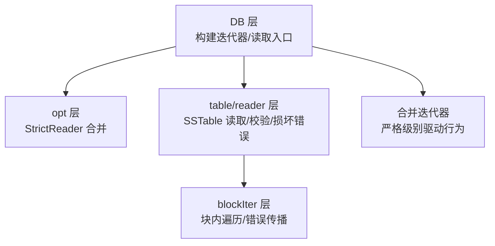
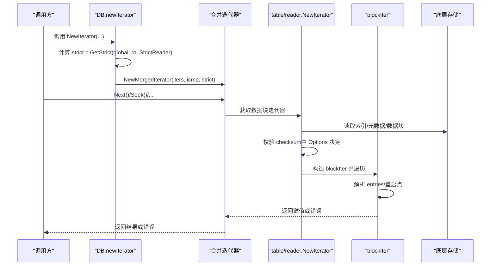
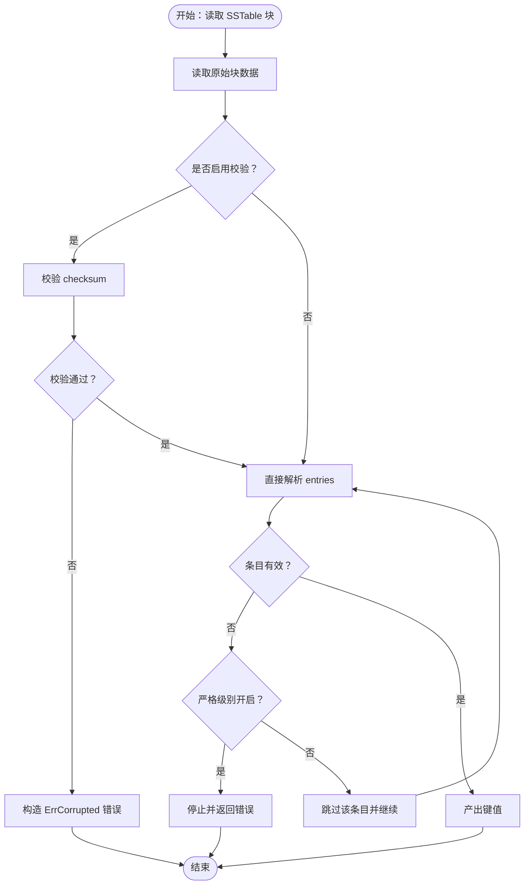
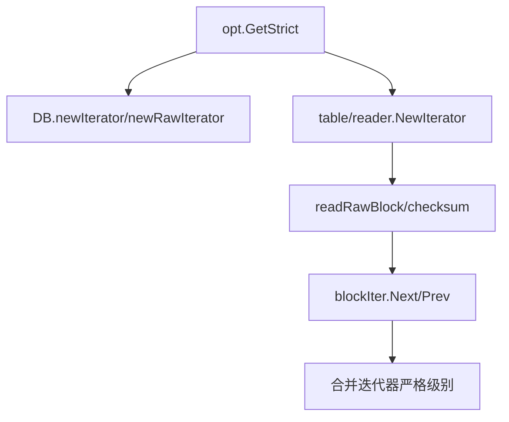

# 读取故障处理

<cite>
**本文引用的文件**
- [leveldb/db_iter.go](file://leveldb/db_iter.go)
- [leveldb/table/reader.go](file://leveldb/table/reader.go)
- [leveldb/opt/options.go](file://leveldb/opt/options.go)
- [leveldb/db.go](file://leveldb/db.go)
- [leveldb/corrupt_test.go](file://leveldb/corrupt_test.go)
- [manualtest/dbstress/main.go](file://manualtest/dbstress/main.go)
</cite>

## 目录
1. [简介](#简介)
2. [项目结构](#项目结构)
3. [核心组件](#核心组件)
4. [架构总览](#架构总览)
5. [详细组件分析](#详细组件分析)
6. [依赖关系分析](#依赖关系分析)
7. [性能考量](#性能考量)
8. [故障排查指南](#故障排查指南)
9. [结论](#结论)
10. [附录](#附录)

## 简介
本文件聚焦于 avccDB 的“读取操作故障处理”机制，特别是 StrictReader 配置项的行为与实现路径。文档解释当读取操作遇到损坏的 SSTable 块时，系统如何依据 StrictReader 设置决定是中断返回错误，还是尝试跳过损坏数据；并梳理从 DB 层到 table reader 层的错误传播链路，以及 opt.GetStrict 如何合并全局与读取选项的严格级别。文末提供性能影响分析与不同应用场景下的配置建议。

## 项目结构
围绕读取与故障处理的关键模块：
- DB 层：负责迭代器构建、严格级别合并、错误传播与上层可见性
- table/reader 层：负责 SSTable 块读取、校验（含 checksum）、损坏错误构造与传播
- opt 层：定义 StrictReader 标志位、默认严格级别与读取选项合并逻辑
- 测试与工具：验证 StrictReader 行为、模拟损坏场景与恢复流程

图表来源
- [leveldb/db_iter.go](file://leveldb/db_iter.go#L31-L61)
- [leveldb/table/reader.go](file://leveldb/table/reader.go#L800-L824)
- [leveldb/opt/options.go](file://leveldb/opt/options.go#L130-L174)

章节来源
- [leveldb/db_iter.go](file://leveldb/db_iter.go#L31-L61)
- [leveldb/table/reader.go](file://leveldb/table/reader.go#L800-L824)
- [leveldb/opt/options.go](file://leveldb/opt/options.go#L130-L174)

## 核心组件
- StrictReader 标志位：用于控制读取阶段对损坏块的处理策略（中断或跳过）
- opt.GetStrict：合并全局 Options 与 ReadOptions 的严格级别，决定 StrictReader 是否生效
- DB 迭代器：在构建原始迭代器时注入严格级别，驱动上层合并迭代器行为
- table/reader：负责块读取、校验与损坏错误构造；在读取失败时返回可识别的损坏错误
- blockIter：在块内遍历时遇到损坏条目时，按严格级别决定是否停止或继续

章节来源
- [leveldb/opt/options.go](file://leveldb/opt/options.go#L130-L174)
- [leveldb/opt/options.go](file://leveldb/opt/options.go#L760-L766)
- [leveldb/db_iter.go](file://leveldb/db_iter.go#L31-L61)
- [leveldb/db_iter.go](file://leveldb/db_iter.go#L76-L81)
- [leveldb/table/reader.go](file://leveldb/table/reader.go#L568-L622)
- [leveldb/table/reader.go](file://leveldb/table/reader.go#L770-L787)

## 架构总览
从 DB 到 table/reader 的读取与故障处理链路如下：

图表来源
- [leveldb/db_iter.go](file://leveldb/db_iter.go#L31-L61)
- [leveldb/db_iter.go](file://leveldb/db_iter.go#L76-L81)
- [leveldb/table/reader.go](file://leveldb/table/reader.go#L800-L824)
- [leveldb/table/reader.go](file://leveldb/table/reader.go#L568-L622)

## 详细组件分析

### StrictReader 的行为与实现机制
- 标志位定义：StrictReader 位于 opt.Strict 枚举中，用于指示“读取阶段遇到损坏块时应中断”。
- 默认严格级别：DefaultStrict 包含 StrictReader，意味着默认情况下读取会因损坏而中断。
- 合并策略：opt.GetStrict 将全局 Options 与 ReadOptions 的 Strict 合并，若 ReadOptions 指定 StrictOverride，则优先使用 ReadOptions 的 StrictReader；否则为全局 StrictReader 或 ReadOptions 的 StrictReader 任一为真即生效。

章节来源
- [leveldb/opt/options.go](file://leveldb/opt/options.go#L130-L174)
- [leveldb/opt/options.go](file://leveldb/opt/options.go#L760-L766)

### 从 DB 层到 table/reader 层的错误处理链
- DB 层构建迭代器时，通过 opt.GetStrict 计算最终严格级别，并将其传递给合并迭代器。
- table/reader 在读取块时进行 checksum 校验（由 Options 控制），并在解析块条目时检测损坏，构造 ErrCorrupted 错误并返回。
- blockIter 在遍历过程中遇到损坏条目时，按严格级别决定是否停止并向上抛出错误。

图表来源
- [leveldb/table/reader.go](file://leveldb/table/reader.go#L568-L622)
- [leveldb/table/reader.go](file://leveldb/table/reader.go#L251-L302)
- [leveldb/table/reader.go](file://leveldb/table/reader.go#L304-L403)

章节来源
- [leveldb/table/reader.go](file://leveldb/table/reader.go#L568-L622)
- [leveldb/table/reader.go](file://leveldb/table/reader.go#L251-L302)
- [leveldb/table/reader.go](file://leveldb/table/reader.go#L304-L403)

### opt.GetStrict 的合并逻辑
- 若 ReadOptions 指定 StrictOverride，则仅使用 ReadOptions 的 StrictReader。
- 否则，使用 Options.GetStrict(StrictReader) 或 ReadOptions.GetStrict(StrictReader) 任一为真即为真。
- DB 层在构建迭代器时调用此函数以确定严格级别。

章节来源
- [leveldb/opt/options.go](file://leveldb/opt/options.go#L760-L766)
- [leveldb/db_iter.go](file://leveldb/db_iter.go#L31-L61)
- [leveldb/db_iter.go](file://leveldb/db_iter.go#L76-L81)

### db_iter.go 中的严格级别应用
- DB.newRawIterator 与 DB.newIterator 在创建迭代器时，分别通过 opt.GetStrict 计算 strict，并传入合并迭代器。
- dbIter 在遍历过程中，若解析内部键失败且 strict 为真，则设置迭代器错误并停止。

章节来源
- [leveldb/db_iter.go](file://leveldb/db_iter.go#L31-L61)
- [leveldb/db_iter.go](file://leveldb/db_iter.go#L76-L81)
- [leveldb/db_iter.go](file://leveldb/db_iter.go#L204-L244)
- [leveldb/db_iter.go](file://leveldb/db_iter.go#L262-L304)
- [leveldb/db_iter.go](file://leveldb/db_iter.go#L306-L344)

### reader.go 中的块读取与错误处理
- table/reader.NewIterator 在创建索引迭代器后，将严格级别传递给 IndexedIterator。
- readRawBlock 在启用校验时执行 checksum 校验，失败时构造 ErrCorrupted 错误。
- blockIter 在 Next/Prev 遍历中解析 entries，遇到损坏时调用 fixErrCorruptedBH 包装错误并返回。

章节来源
- [leveldb/table/reader.go](file://leveldb/table/reader.go#L800-L824)
- [leveldb/table/reader.go](file://leveldb/table/reader.go#L568-L622)
- [leveldb/table/reader.go](file://leveldb/table/reader.go#L251-L302)
- [leveldb/table/reader.go](file://leveldb/table/reader.go#L304-L403)

### 代码示例路径（不展示具体代码）
- 严格级别合并：[opt.GetStrict](file://leveldb/opt/options.go#L760-L766)
- DB 构建迭代器并注入严格级别：[DB.newIterator](file://leveldb/db_iter.go#L63-L91)
- DB 原始迭代器注入严格级别：[DB.newRawIterator](file://leveldb/db_iter.go#L31-L61)
- table/reader 传递严格级别给 IndexedIterator：[Reader.NewIterator](file://leveldb/table/reader.go#L800-L824)
- 块读取与校验（含 checksum）：[Reader.readRawBlock](file://leveldb/table/reader.go#L568-L606)
- 块条目解析与损坏检测：[blockIter.Next/Prev](file://leveldb/table/reader.go#L251-L302), [blockIter.Next/Prev](file://leveldb/table/reader.go#L304-L403)

## 依赖关系分析
- DB 层依赖 opt.GetStrict 来确定 StrictReader 生效与否
- table/reader 层在读取块时根据 Options 决定是否校验 checksum，并在损坏时构造 ErrCorrupted
- blockIter 在块内遍历时依据严格级别决定继续或停止
- 合并迭代器接收严格级别参数，从而在上游返回错误时决定是否中断

图表来源
- [leveldb/opt/options.go](file://leveldb/opt/options.go#L760-L766)
- [leveldb/db_iter.go](file://leveldb/db_iter.go#L31-L61)
- [leveldb/db_iter.go](file://leveldb/db_iter.go#L63-L91)
- [leveldb/table/reader.go](file://leveldb/table/reader.go#L800-L824)
- [leveldb/table/reader.go](file://leveldb/table/reader.go#L568-L606)
- [leveldb/table/reader.go](file://leveldb/table/reader.go#L251-L302)

章节来源
- [leveldb/opt/options.go](file://leveldb/opt/options.go#L760-L766)
- [leveldb/db_iter.go](file://leveldb/db_iter.go#L31-L61)
- [leveldb/db_iter.go](file://leveldb/db_iter.go#L63-L91)
- [leveldb/table/reader.go](file://leveldb/table/reader.go#L800-L824)
- [leveldb/table/reader.go](file://leveldb/table/reader.go#L568-L606)
- [leveldb/table/reader.go](file://leveldb/table/reader.go#L251-L302)

## 性能考量
- 校验开销：启用 StrictBlockChecksum 与 StrictReader 会在读取块时增加 checksum 校验与错误包装成本，可能带来 CPU 与内存压力。
- 缓存命中：启用块缓存可显著降低重复读取的 IO 与校验成本，但损坏块仍可能导致缓存未命中或错误传播。
- 迭代器采样：DB 层的迭代器采样策略与 StrictReader 无直接冲突，但大量损坏块会增加迭代器错误处理次数。
- 恢复与重建：在 Recover 流程中，StrictReader 不参与（被屏蔽），系统会尝试重建表以恢复可用数据，这可能带来额外的写入与 IO 开销。

章节来源
- [leveldb/db.go](file://leveldb/db.go#L295-L313)
- [leveldb/db.go](file://leveldb/db.go#L368-L469)
- [leveldb/table/reader.go](file://leveldb/table/reader.go#L568-L606)

## 故障排查指南
- 现象识别：读取返回错误且错误类型为 ErrCorrupted，包含损坏位置、块类型与原因。
- 定位来源：检查 table/reader 在读取块时的校验与错误构造逻辑，确认是否启用了 StrictBlockChecksum。
- 严格级别：确认 Options 与 ReadOptions 的 StrictReader 设置，必要时通过 ReadOptions.StrictOverride 强制覆盖。
- 数据恢复：若损坏块较多且 StrictReader 导致频繁中断，可考虑在 Recover 流程中屏蔽 StrictReader，让系统自动重建表。
- 工具验证：使用 manualtest/dbstress 对 SSTable 进行扫描与校验，观察 checksum 不一致导致的损坏检测。

章节来源
- [leveldb/table/reader.go](file://leveldb/table/reader.go#L550-L566)
- [leveldb/table/reader.go](file://leveldb/table/reader.go#L568-L606)
- [leveldb/db.go](file://leveldb/db.go#L295-L313)
- [manualtest/dbstress/main.go](file://manualtest/dbstress/main.go#L158-L238)

## 结论
StrictReader 是 avccDB 读取阶段的关键安全开关：它通过 opt.GetStrict 合并全局与读取选项，决定遇到损坏块时是中断返回错误还是尝试跳过。DB 层在构建迭代器时注入严格级别，table/reader 层在块读取与解析过程中构造并传播损坏错误，最终由上层迭代器与调用方感知。在生产环境中，建议结合业务容忍度与数据完整性要求选择合适的 StrictReader 配置，并在出现大规模损坏时配合 Recover 流程进行修复。

## 附录
- 应用场景与配置建议
  - 高一致性场景：启用 StrictReader 与 StrictBlockChecksum，确保任何损坏都立即暴露，避免污染数据传播。
  - 可容忍部分损坏场景：关闭 StrictReader，允许系统跳过损坏条目，提高可用性；同时保留 StrictBlockChecksum 以保证块级完整性。
  - 恢复与诊断：在 Recover 流程中屏蔽 StrictReader，优先恢复可用数据；随后再逐步启用 StrictReader 进行验证。
- 关键实现参考路径
  - [opt.GetStrict](file://leveldb/opt/options.go#L760-L766)
  - [DB.newIterator/newRawIterator](file://leveldb/db_iter.go#L31-L61)
  - [Reader.NewIterator](file://leveldb/table/reader.go#L800-L824)
  - [Reader.readRawBlock](file://leveldb/table/reader.go#L568-L606)
  - [blockIter.Next/Prev](file://leveldb/table/reader.go#L251-L302)