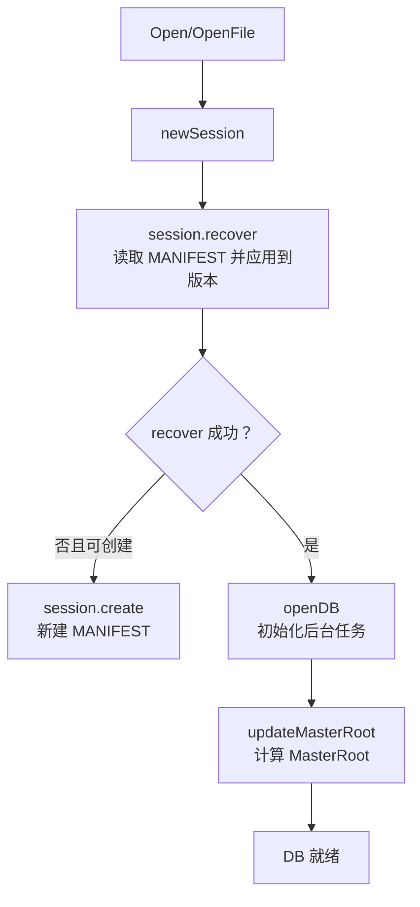
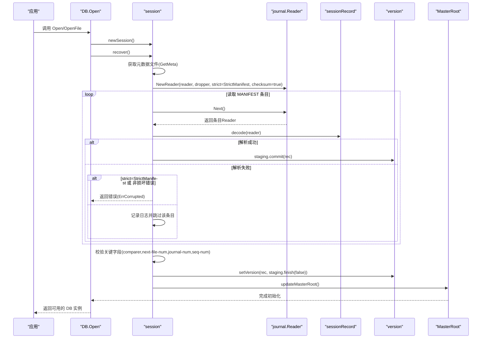
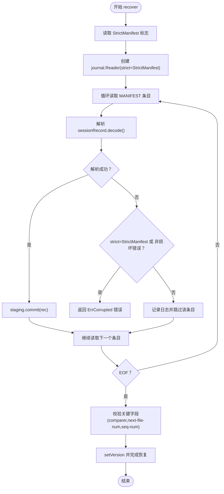
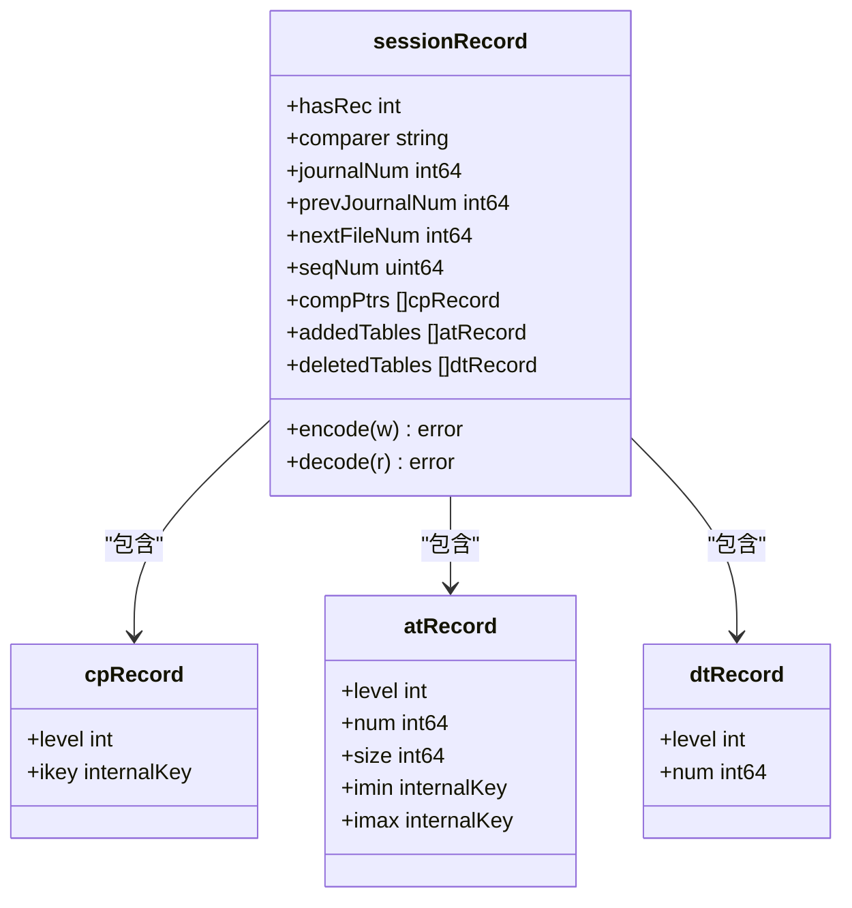
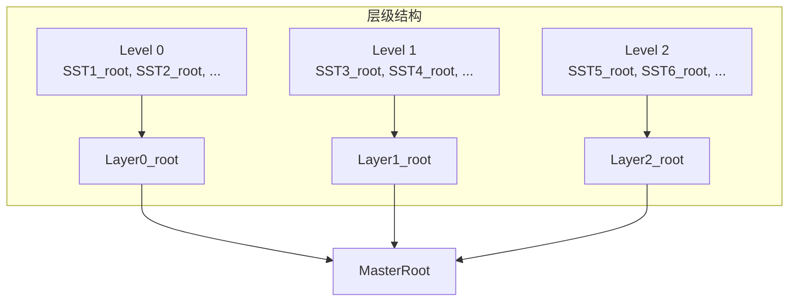
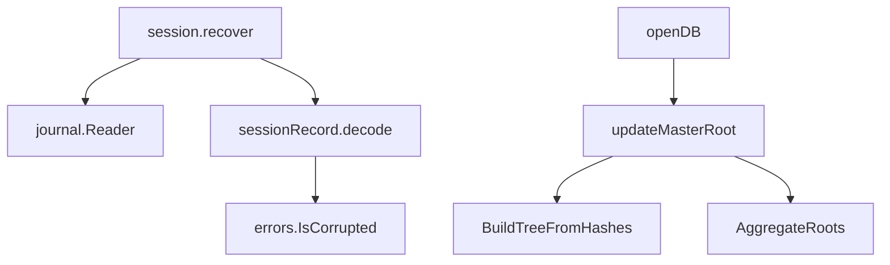

# manifest完整性

<cite>
**本文引用的文件**
- [leveldb/session.go](file://leveldb/session.go)
- [leveldb/session_record.go](file://leveldb/session_record.go)
- [leveldb/db.go](file://leveldb/db.go)
- [leveldb/opt/options.go](file://leveldb/opt/options.go)
- [leveldb/journal/journal.go](file://leveldb/journal/journal.go)
- [leveldb/version.go](file://leveldb/version.go)
- [leveldb/merkle/hash.go](file://leveldb/merkle/hash.go)
- [leveldb/merkle/tree.go](file://leveldb/merkle/tree.go)
- [leveldb/merkle/tree_builder.go](file://leveldb/merkle/tree_builder.go)
- [leveldb/errors/errors.go](file://leveldb/errors/errors.go)
</cite>

## 目录
1. [简介](#简介)
2. [项目结构](#项目结构)
3. [核心组件](#核心组件)
4. [架构总览](#架构总览)
5. [详细组件分析](#详细组件分析)
6. [依赖关系分析](#依赖关系分析)
7. [性能考量](#性能考量)
8. [故障排查指南](#故障排查指南)
9. [结论](#结论)

## 简介
本文件围绕 avccDB 的 manifest 完整性验证展开，重点解释 StrictManifest 配置项在数据库启动与运行期间如何校验 MANIFEST 文件的完整性；当 manifest 文件出现损坏或无效块时，系统依据 StrictManifest 设置决定报错或尝试恢复；同时阐述 MANIFEST 在数据库元数据管理中的角色及其与 Merkle 树结构的关系；最后给出配置 StrictManifest 的方法，并分析其对数据库启动时间与故障恢复能力的影响。

## 项目结构
- 数据库启动流程由 Open/OpenFile 触发，内部通过 newSession 创建会话并执行 recover；若 recover 失败且满足条件则 create 创建新的 MANIFEST；成功后进入 openDB 初始化阶段并计算 MasterRoot。
- MANIFEST 的读取使用 journal.Reader，支持严格模式 StrictManifest 控制错误处理策略。
- 元数据记录通过 sessionRecord 编解码，包含比较器、文件号、序列号、压缩指针等字段。
- Merkle 树用于生成各层 SST 的根哈希，并聚合为 MasterRoot，支撑版本化查询与证明。

图表来源
- [leveldb/db.go](file://leveldb/db.go#L177-L215)
- [leveldb/session.go](file://leveldb/session.go#L122-L208)
- [leveldb/db.go](file://leveldb/db.go#L160-L175)

章节来源
- [leveldb/db.go](file://leveldb/db.go#L177-L215)
- [leveldb/session.go](file://leveldb/session.go#L122-L208)

## 核心组件
- StrictManifest：控制 MANIFEST 读取过程中的严格性，开启后任何损坏或格式错误将导致打开失败。
- journal.Reader：负责从 MANIFEST 中按块读取日志条目，支持严格模式与校验和检查。
- session.recover：读取 MANIFEST，逐条解析 sessionRecord，应用到版本并进行完整性校验。
- sessionRecord：定义 MANIFEST 条目的编码/解码格式，包含比较器、文件号、序列号等关键字段。
- Merkle 树与 MasterRoot：用于聚合各层 SST 的 Merkle 根，形成全局 MasterRoot，支撑版本化查询与证明。

章节来源
- [leveldb/opt/options.go](file://leveldb/opt/options.go#L130-L171)
- [leveldb/journal/journal.go](file://leveldb/journal/journal.go#L149-L174)
- [leveldb/session.go](file://leveldb/session.go#L129-L208)
- [leveldb/session_record.go](file://leveldb/session_record.go#L198-L323)
- [leveldb/db.go](file://leveldb/db.go#L1480-L1569)

## 架构总览
下图展示了数据库启动时 MANIFEST 的读取与校验路径，以及与 Merkle 结构的关系。

图表来源
- [leveldb/db.go](file://leveldb/db.go#L177-L215)
- [leveldb/session.go](file://leveldb/session.go#L129-L208)
- [leveldb/journal/journal.go](file://leveldb/journal/journal.go#L149-L174)
- [leveldb/session_record.go](file://leveldb/session_record.go#L198-L323)
- [leveldb/db.go](file://leveldb/db.go#L160-L175)

## 详细组件分析

### StrictManifest 配置与行为
- 位置与含义：StrictManifest 是 opt.Strict 的一个标志位，用于控制 MANIFEST 读取过程中的严格性。开启后，任何损坏或格式错误都会导致打开失败，防止损坏的数据库被打开。
- 生效点：
  - 在 session.recover 中，通过 s.o.GetStrict(opt.StrictManifest) 获取严格模式；
  - 传递给 journal.NewReader(strict=StrictManifest, checksum=true)，使 journal.Reader 在遇到损坏块时直接返回错误；
  - 当解析 sessionRecord 出错时，若 strict 或非损坏错误，则立即返回错误；否则记录日志并跳过该条目。
- 影响范围：仅影响 MANIFEST 的读取与解析阶段，不影响已存在的有效数据访问。

图表来源
- [leveldb/session.go](file://leveldb/session.go#L129-L208)
- [leveldb/journal/journal.go](file://leveldb/journal/journal.go#L149-L174)
- [leveldb/session_record.go](file://leveldb/session_record.go#L198-L323)

章节来源
- [leveldb/opt/options.go](file://leveldb/opt/options.go#L130-L171)
- [leveldb/session.go](file://leveldb/session.go#L129-L208)
- [leveldb/journal/journal.go](file://leveldb/journal/journal.go#L149-L174)
- [leveldb/session_record.go](file://leveldb/session_record.go#L198-L323)

### MANIFEST 元数据管理与 sessionRecord
- sessionRecord 定义了 MANIFEST 条目的字段集合与编码/解码规则，包括：
  - 比较器名称、下一个文件号、日志文件号、序列号、压缩指针、新增/删除表等。
- 解码流程：
  - 使用 readUvarint/readVarint/readBytes 等方法读取字段头与内容；
  - 对于短读、负值、EOF 等异常，构造 ErrManifestCorrupted 错误；
  - 将解析结果写入 sessionRecord 的对应域。
- 应用阶段：
  - staging.commit 将新增/删除表应用到版本；
  - 最终通过 setVersion 将新版本应用到数据库。

图表来源
- [leveldb/session_record.go](file://leveldb/session_record.go#L37-L132)
- [leveldb/session_record.go](file://leveldb/session_record.go#L198-L323)

章节来源
- [leveldb/session_record.go](file://leveldb/session_record.go#L37-L132)
- [leveldb/session_record.go](file://leveldb/session_record.go#L198-L323)

### MANIFEST 与 Merkle 树结构的关系
- 层次化结构：
  - SST 层：每个 SSTable 有自身的 Merkle 根；
  - 层级层：同一层级内所有 SST 根组成 Merkle 树，得到该层的根；
  - Master 层：将所有层级根组成 Merkle 树，得到 MasterRoot。
- 计算流程：
  - computeMasterRoot 收集各层级 SST 的 Merkle 根，调用 BuildTreeFromHashes 构建层级根；
  - 再对所有层级根调用 BuildTreeFromHashes 得到 MasterRoot；
  - updateMasterRoot 在 flush/compaction 后更新内存中的 masterRoot。
- 版本化查询与证明：
  - getWithProof 在找到值后，结合 MasterRoot 生成或增强 Merkle 证明，便于外部验证数据一致性。

图表来源
- [leveldb/db.go](file://leveldb/db.go#L1491-L1560)
- [leveldb/merkle/tree_builder.go](file://leveldb/merkle/tree_builder.go#L153-L201)
- [leveldb/merkle/hash.go](file://leveldb/merkle/hash.go#L127-L152)

章节来源
- [leveldb/db.go](file://leveldb/db.go#L1491-L1560)
- [leveldb/merkle/tree_builder.go](file://leveldb/merkle/tree_builder.go#L153-L201)
- [leveldb/merkle/hash.go](file://leveldb/merkle/hash.go#L127-L152)

### 代码示例：如何配置 StrictManifest
- 在 Options 中设置 Strict 标志位，包含 StrictManifest 即可启用 MANIFEST 严格模式。
- 可参考以下路径定位设置位置：
  - [设置 Strict 的位置](file://leveldb/opt/options.go#L659-L664)
  - [StrictManifest 常量定义](file://leveldb/opt/options.go#L130-L171)

章节来源
- [leveldb/opt/options.go](file://leveldb/opt/options.go#L659-L664)
- [leveldb/opt/options.go](file://leveldb/opt/options.go#L130-L171)

### 运行时与启动时的行为差异
- 启动时（Open）：
  - 通过 session.recover 读取 MANIFEST，StrictManifest 严格控制损坏条目的处理；
  - 若 MANIFEST 缺失或损坏，Open 可能失败，除非满足创建条件或只读模式。
- 运行时（正常操作）：
  - MANIFEST 的读取严格性由 StrictManifest 控制；
  - 正常写入/读取不涉及 MANIFEST 的严格读取，而是通过写入日志与表文件维持一致性。

章节来源
- [leveldb/db.go](file://leveldb/db.go#L177-L215)
- [leveldb/session.go](file://leveldb/session.go#L129-L208)

## 依赖关系分析
- session.recover 依赖 journal.Reader 的严格模式与 checksum 校验；
- sessionRecord.decode 依赖错误类型判断（errors.IsCorrupted）；
- db.openDB 在启动完成后调用 updateMasterRoot，依赖 Merkle 树构建工具。

图表来源
- [leveldb/session.go](file://leveldb/session.go#L129-L208)
- [leveldb/journal/journal.go](file://leveldb/journal/journal.go#L149-L174)
- [leveldb/session_record.go](file://leveldb/session_record.go#L198-L323)
- [leveldb/errors/errors.go](file://leveldb/errors/errors.go#L50-L79)
- [leveldb/db.go](file://leveldb/db.go#L160-L175)
- [leveldb/merkle/tree_builder.go](file://leveldb/merkle/tree_builder.go#L153-L201)
- [leveldb/merkle/hash.go](file://leveldb/merkle/hash.go#L127-L152)

章节来源
- [leveldb/session.go](file://leveldb/session.go#L129-L208)
- [leveldb/journal/journal.go](file://leveldb/journal/journal.go#L149-L174)
- [leveldb/session_record.go](file://leveldb/session_record.go#L198-L323)
- [leveldb/errors/errors.go](file://leveldb/errors/errors.go#L50-L79)
- [leveldb/db.go](file://leveldb/db.go#L160-L175)
- [leveldb/merkle/tree_builder.go](file://leveldb/merkle/tree_builder.go#L153-L201)
- [leveldb/merkle/hash.go](file://leveldb/merkle/hash.go#L127-L152)

## 性能考量
- 启动时间：
  - StrictManifest 开启后，若 MANIFEST 存在损坏，将更快失败，避免扫描与修复带来的额外开销；
  - 关闭 StrictManifest 时，系统会尝试跳过损坏条目，可能增加启动时间但提升可用性。
- 故障恢复：
  - StrictManifest 提升数据完整性保障，但降低容忍度；
  - 对于 MANIFEST 缺失或严重损坏，可通过 Recover 流程重建 MANIFEST（不依赖现有 MANIFEST），但此流程会重扫表文件并重建元数据，耗时较长。
- Merkle 计算：
  - MasterRoot 的计算在 flush/compaction 后触发，通常不会显著影响在线请求；
  - 大型数据库中，层级较多时计算成本上升，建议在批量操作后统一触发更新。

## 故障排查指南
- 常见错误类型：
  - ErrManifestCorrupted：由 sessionRecord.decode 或 journal.Reader 在严格模式下抛出，表示 MANIFEST 字段缺失、格式错误或损坏。
  - errors.IsCorrupted：通用损坏检测函数，用于区分损坏与其它错误。
- 排查步骤：
  - 启用 StrictManifest，确保 MANIFEST 读取严格，快速暴露问题；
  - 若 recover 失败，检查存储介质与文件权限；
  - 对于 MANIFEST 缺失或损坏，使用 Recover 流程重建 MANIFEST（注意：此流程会重扫表文件并重建元数据）。
- 相关实现参考：
  - [ErrManifestCorrupted 定义与包装](file://leveldb/session.go#L21-L35)
  - [journal.Reader.corrupt 严格模式处理](file://leveldb/journal/journal.go#L164-L173)
  - [session.recover 中的错误分支与校验](file://leveldb/session.go#L170-L208)
  - [errors.IsCorrupted 判断](file://leveldb/errors/errors.go#L50-L79)

章节来源
- [leveldb/session.go](file://leveldb/session.go#L21-L35)
- [leveldb/journal/journal.go](file://leveldb/journal/journal.go#L164-L173)
- [leveldb/session.go](file://leveldb/session.go#L170-L208)
- [leveldb/errors/errors.go](file://leveldb/errors/errors.go#L50-L79)

## 结论
- StrictManifest 在数据库启动阶段提供了对 MANIFEST 的强一致性保障，开启后可快速发现并阻止损坏的数据库被打开，提升系统可靠性。
- 当 MANIFEST 出现损坏或无效块时，StrictManifest 会优先报错；关闭时系统会尝试跳过并继续恢复，提高可用性但牺牲部分完整性。
- MANIFEST 是数据库元数据的核心载体，承载比较器、文件号、序列号等关键信息；其与 Merkle 结构共同支撑版本化查询与全局一致性证明。
- 配置 StrictManifest 需要在 Options 中设置相应标志位；在生产环境中建议开启以保证数据完整性，同时配合定期备份与监控，平衡可用性与可靠性。