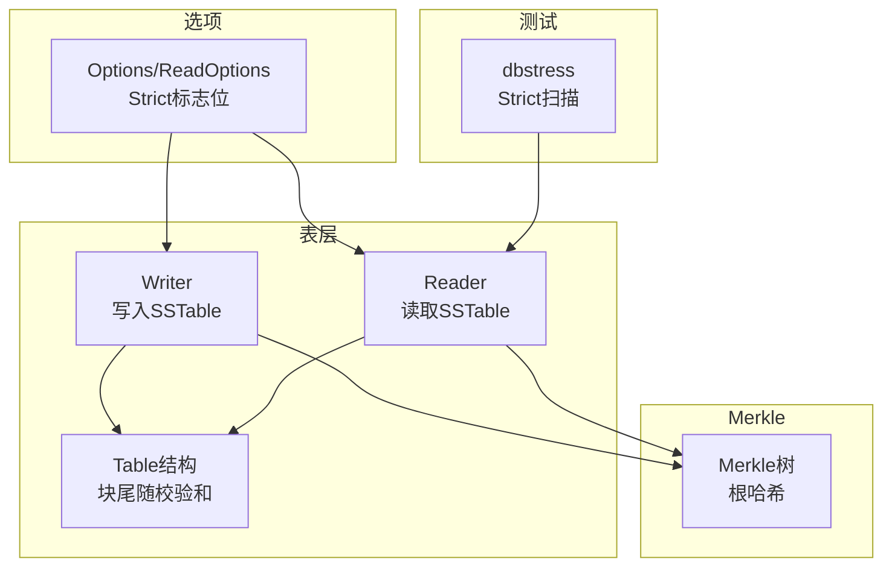
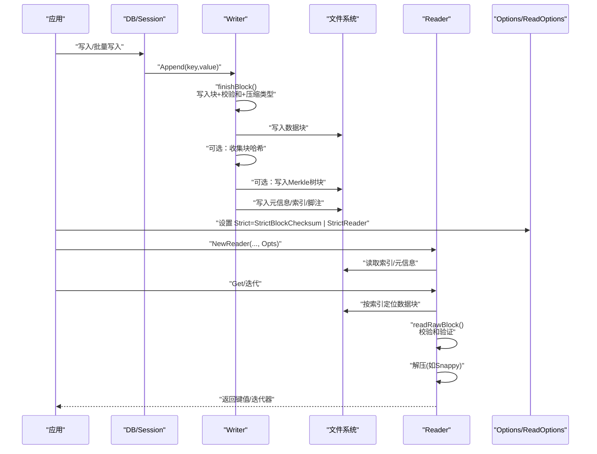
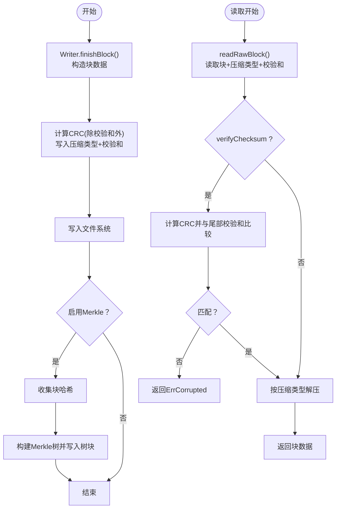
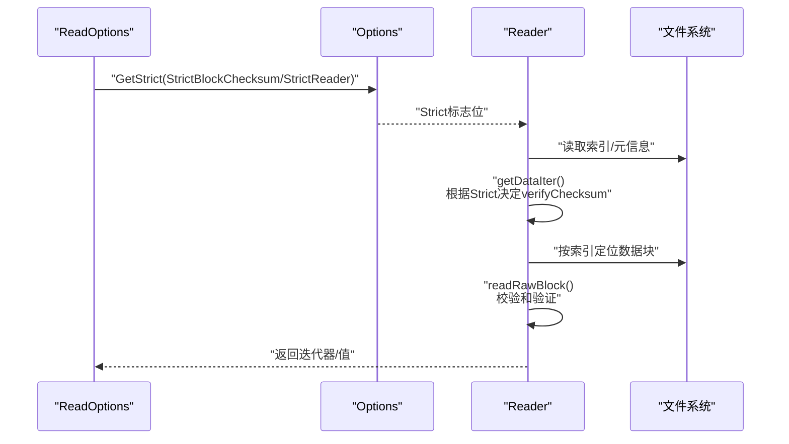
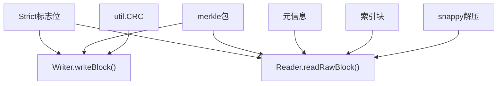

# 块级验证

<cite>
**本文引用的文件**
- [leveldb/opt/options.go](file://leveldb/opt/options.go)
- [leveldb/table/table.go](file://leveldb/table/table.go)
- [leveldb/table/writer.go](file://leveldb/table/writer.go)
- [leveldb/table/reader.go](file://leveldb/table/reader.go)
- [leveldb/table/reader_merkle_test.go](file://leveldb/table/reader_merkle_test.go)
- [leveldb/merkle/tree.go](file://leveldb/merkle/tree.go)
- [manualtest/dbstress/main.go](file://manualtest/dbstress/main.go)
</cite>

## 目录
1. [简介](#简介)
2. [项目结构](#项目结构)
3. [核心组件](#核心组件)
4. [架构总览](#架构总览)
5. [详细组件分析](#详细组件分析)
6. [依赖关系分析](#依赖关系分析)
7. [性能考量](#性能考量)
8. [故障排查指南](#故障排查指南)
9. [结论](#结论)
10. [附录](#附录)

## 简介
本文件围绕 avccDB 的 SSTable 块级验证进行系统化技术文档编制，重点解释 StrictBlockChecksum 配置项在“读取操作”和“压缩过程”中的作用机制，详述块校验和的生成、存储与验证流程，以及块数据与校验和的分离存储方式；进一步阐述块级校验与 Merkle 树哈希验证如何形成双重保障；最后分析 StrictBlockChecksum 与 StrictCompaction、StrictReader 的相互作用，并给出配置示例与性能影响评估方法。

## 项目结构
- 表层读写：table 包负责 SSTable 的写入与读取，包含 Writer、Reader、block 结构与索引/过滤器等。
- 选项与严格模式：opt 包定义 Options、ReadOptions、WriteOptions 以及 Strict 标志位集合。
- Merkle 支持：merkle 包提供树构建、证明生成与验证能力，table 侧在写入时收集数据块哈希并在元信息中记录 Merkle 树根。
- 手工压力测试：manualtest/dbstress 提供基于 Strict 的扫描与校验逻辑，用于演示 StrictBlockChecksum 在读取路径上的强制校验行为。

图表来源
- [leveldb/table/writer.go](file://leveldb/table/writer.go#L178-L209)
- [leveldb/table/reader.go](file://leveldb/table/reader.go#L568-L622)
- [leveldb/table/table.go](file://leveldb/table/table.go#L144-L174)
- [leveldb/opt/options.go](file://leveldb/opt/options.go#L130-L174)
- [leveldb/merkle/tree.go](file://leveldb/merkle/tree.go#L68-L74)
- [manualtest/dbstress/main.go](file://manualtest/dbstress/main.go#L158-L190)

章节来源
- [leveldb/table/table.go](file://leveldb/table/table.go#L144-L174)
- [leveldb/opt/options.go](file://leveldb/opt/options.go#L130-L174)

## 核心组件
- Strict 标志位集合：定义了 StrictManifest、StrictJournalChecksum、StrictJournal、StrictBlockChecksum、StrictCompaction、StrictReader、StrictRecovery、StrictOverride 等标志位及其默认值与组合。
- Writer 写入流程：在写入每个数据块后计算校验和并追加到块尾，同时支持压缩类型标记；在 Close 时可选地构建 Merkle 树并将根哈希写入元信息。
- Reader 读取流程：按需读取块，若开启校验则对块数据进行 CRC 校验；根据压缩类型解压；通过索引定位数据块并返回迭代器。
- Merkle 树：Writer 收集数据块哈希，构建 Merkle 树并序列化写入；Reader 从元信息加载 Merkle 树，用于上层验证或证明生成。

章节来源
- [leveldb/opt/options.go](file://leveldb/opt/options.go#L130-L174)
- [leveldb/table/writer.go](file://leveldb/table/writer.go#L178-L209)
- [leveldb/table/reader.go](file://leveldb/table/reader.go#L568-L622)
- [leveldb/merkle/tree.go](file://leveldb/merkle/tree.go#L68-L74)

## 架构总览
下图展示了 StrictBlockChecksum 在读取与压缩路径中的关键交互点，以及与 Merkle 树的关系。

图表来源
- [leveldb/table/writer.go](file://leveldb/table/writer.go#L178-L209)
- [leveldb/table/reader.go](file://leveldb/table/reader.go#L568-L622)
- [leveldb/opt/options.go](file://leveldb/opt/options.go#L130-L174)
- [manualtest/dbstress/main.go](file://manualtest/dbstress/main.go#L158-L190)

## 详细组件分析

### 组件A：块校验和生成、存储与验证
- 块尾结构：每个块以“数据体 + 压缩类型(1字节) + 校验和(4字节)”的形式存储，校验和使用 Castagnoli 多项式（CRC-32）对除校验和外的所有字节求值。
- 写入端：
  - Writer.finishBlock() 中完成块收尾，调用 writeBlock() 计算 CRC 并写入压缩类型与校验和，随后更新索引与元信息。
  - 若启用 Merkle，则在写入前收集块哈希，最终写入 Merkle 树块并将其块句柄写入元信息。
- 读取端：
  - Reader.readRawBlock() 读取块数据后，若 verifyChecksum=true 则对数据体进行 CRC 校验；随后依据压缩类型字段进行解压。
  - Reader.readBlockCached()/getDataIter() 等路径会根据 Options 与 ReadOptions 的 Strict 标志决定是否开启校验。

图表来源
- [leveldb/table/writer.go](file://leveldb/table/writer.go#L178-L209)
- [leveldb/table/reader.go](file://leveldb/table/reader.go#L568-L622)
- [leveldb/table/table.go](file://leveldb/table/table.go#L144-L174)

章节来源
- [leveldb/table/writer.go](file://leveldb/table/writer.go#L178-L209)
- [leveldb/table/reader.go](file://leveldb/table/reader.go#L568-L622)
- [leveldb/table/table.go](file://leveldb/table/table.go#L144-L174)

### 组件B：StrictBlockChecksum 在读取与压缩中的作用
- 读取路径：
  - 当 Options.Strict 含有 StrictBlockChecksum 或 ReadOptions.Strict 含有 StrictReader 且覆盖全局时，Reader 在读取块时会强制执行校验。
  - 读取端通过 verifyChecksum 参数控制是否进行 CRC 校验，从而实现对每个数据块的完整性检查。
- 压缩路径：
  - 压缩过程本身不直接改变块校验和；但 Writer.finishBlock() 在写入前计算 CRC，确保压缩后的数据体与压缩类型共同参与校验。
  - 若启用 StrictCompaction，压缩合并阶段遇到损坏的块将导致合并失败并进入只读模式（由上层策略处理），这与块级校验和验证相辅相成。

图表来源
- [leveldb/opt/options.go](file://leveldb/opt/options.go#L659-L665)
- [leveldb/table/reader.go](file://leveldb/table/reader.go#L770-L787)
- [manualtest/dbstress/main.go](file://manualtest/dbstress/main.go#L158-L190)

章节来源
- [leveldb/opt/options.go](file://leveldb/opt/options.go#L659-L665)
- [leveldb/table/reader.go](file://leveldb/table/reader.go#L770-L787)
- [manualtest/dbstress/main.go](file://manualtest/dbstress/main.go#L158-L190)

### 组件C：块数据与校验和的分离存储机制
- 存储布局：
  - 数据块：包含键值条目与重启点列表，末尾附加“重启点长度(4字节) + 重启点偏移数组”。
  - 块尾：压缩类型(1字节) + 校验和(4字节)，共 5 字节。
- 读取解析：
  - Reader.readBlock() 从块末尾解析重启点长度与偏移，构造 block 对象以便迭代。
  - Reader.readRawBlock() 先进行校验，再按压缩类型解压，得到原始数据体供后续解析。

章节来源
- [leveldb/table/table.go](file://leveldb/table/table.go#L144-L174)
- [leveldb/table/reader.go](file://leveldb/table/reader.go#L608-L622)

### 组件D：与 Merkle 树的双重保障
- Merkle 树构建：
  - Writer.finishBlock() 收集每个数据块的哈希，Close() 时构建 Merkle 树并写入树块，元信息中记录树块句柄。
- Merkle 树加载与使用：
  - Reader 从元信息加载 Merkle 树，可用于上层验证或生成证明；与块级校验和共同提供“逐块完整性 + 整体一致性”的双重保障。
- 双重保障对比：
  - 块级校验和：面向单个块的数据完整性，快速、细粒度。
  - Merkle 树：面向整体数据结构的一致性，便于跨块验证与证明生成。

章节来源
- [leveldb/table/writer.go](file://leveldb/table/writer.go#L346-L396)
- [leveldb/table/reader_merkle_test.go](file://leveldb/table/reader_merkle_test.go#L193-L275)
- [leveldb/merkle/tree.go](file://leveldb/merkle/tree.go#L68-L74)

### 组件E：StrictBlockChecksum 与 StrictCompaction、StrictReader 的相互作用
- StrictBlockChecksum：
  - 强制在读取与压缩过程中对块进行校验，任何校验失败都会返回错误，避免传播损坏数据。
- StrictReader：
  - 仅影响读取路径，当启用时即使全局未开启 StrictBlockChecksum，读取端也会强制校验。
- StrictCompaction：
  - 影响压缩合并阶段，遇到损坏的块会导致合并失败并可能触发只读模式，从而阻止损坏块进入更深层级。

章节来源
- [leveldb/opt/options.go](file://leveldb/opt/options.go#L130-L174)
- [leveldb/table/reader.go](file://leveldb/table/reader.go#L568-L622)

## 依赖关系分析
- Writer 依赖 util.CRC 计算与压缩库，输出块尾随校验和与压缩类型。
- Reader 依赖 util.CRC 校验与压缩解码，结合索引块定位数据块。
- Merkle 树依赖 merkle 包的树构建与序列化能力，Writer 收集块哈希，Reader 加载树。
- Strict 标志位通过 Options/ReadOptions 的 GetStrict 接口统一传递到 Reader/Writer。

图表来源
- [leveldb/table/writer.go](file://leveldb/table/writer.go#L178-L209)
- [leveldb/table/reader.go](file://leveldb/table/reader.go#L568-L622)
- [leveldb/opt/options.go](file://leveldb/opt/options.go#L659-L665)

章节来源
- [leveldb/table/writer.go](file://leveldb/table/writer.go#L178-L209)
- [leveldb/table/reader.go](file://leveldb/table/reader.go#L568-L622)
- [leveldb/opt/options.go](file://leveldb/opt/options.go#L659-L665)

## 性能考量
- 校验开销：
  - 每个数据块读取时进行 CRC 校验，CPU 开销与块数量线性相关；在高并发读取场景下建议适度调整 BlockSize 与 BlockCache 容量以平衡缓存命中率与校验成本。
- 压缩与校验：
  - 压缩后再计算校验和，避免重复解压带来的额外开销；Snappy 解压失败会立即报错，减少无效工作。
- Merkle 树：
  - Writer 在 Close 时构建 Merkle 树，属于一次性开销；Reader 加载 Merkle 树仅在需要证明或验证时使用，通常不会显著影响常规读取路径。
- 严格模式：
  - 启用 StrictBlockChecksum/StrictReader 会在读取路径增加校验步骤，可能提升延迟；StrictCompaction 会阻断损坏块进入更深层级，有助于长期稳定性。

[本节为通用性能讨论，无需特定文件引用]

## 故障排查指南
- 常见错误类型：
  - ErrCorrupted：由 Reader.readRawBlock() 在校验失败或解压失败时返回，包含位置、大小、块类型与原因。
- 定位手段：
  - 使用 manualtest/dbstress 中的 scanTable 方法，通过设置 Options.Strict=StrictBlockChecksum|StrictReader，对 SSTable 进行扫描并比对校验和，快速发现损坏块。
- 处理建议：
  - 发生校验失败时，优先检查底层存储与文件系统一致性；必要时重建受影响的 SSTable 文件。
  - 在生产环境建议开启 StrictBlockChecksum 与 StrictReader，以尽早暴露问题。

章节来源
- [leveldb/table/reader.go](file://leveldb/table/reader.go#L550-L566)
- [manualtest/dbstress/main.go](file://manualtest/dbstress/main.go#L158-L190)

## 结论
StrictBlockChecksum 通过在读取与压缩过程中对每个数据块执行 CRC 校验，提供了细粒度的块级完整性保障；与 Merkle 树提供的整体一致性验证相结合，形成“逐块完整性 + 整体一致性”的双重防护。StrictBlockChecksum 与 StrictCompaction、StrictReader 协同工作，既能在读取路径及时发现损坏，也能在压缩路径阻止问题扩散。合理配置与监控可有效提升系统的可靠性与可维护性。

[本节为总结性内容，无需特定文件引用]

## 附录

### A. 配置示例（路径参考）
- 在读取路径强制校验：
  - 设置 Options.Strict 含 StrictBlockChecksum 或 ReadOptions.Strict 含 StrictReader，参考路径：
    - [leveldb/opt/options.go](file://leveldb/opt/options.go#L659-L665)
    - [manualtest/dbstress/main.go](file://manualtest/dbstress/main.go#L158-L190)
- 在压缩路径启用严格模式：
  - 将 StrictCompaction 置于 Options.Strict，参考路径：
    - [leveldb/opt/options.go](file://leveldb/opt/options.go#L130-L174)
- 启用 Merkle 树：
  - Writer.enableMerkle=true，Close() 时自动构建并写入 Merkle 树块，参考路径：
    - [leveldb/table/writer.go](file://leveldb/table/writer.go#L346-L396)
    - [leveldb/table/reader_merkle_test.go](file://leveldb/table/reader_merkle_test.go#L193-L275)

### B. 关键流程图（代码映射）
- 块写入与校验和生成：
  - [leveldb/table/writer.go](file://leveldb/table/writer.go#L178-L209)
- 块读取与校验和验证：
  - [leveldb/table/reader.go](file://leveldb/table/reader.go#L568-L622)
- Merkle 树构建与加载：
  - [leveldb/table/writer.go](file://leveldb/table/writer.go#L346-L396)
  - [leveldb/table/reader_merkle_test.go](file://leveldb/table/reader_merkle_test.go#L193-L275)