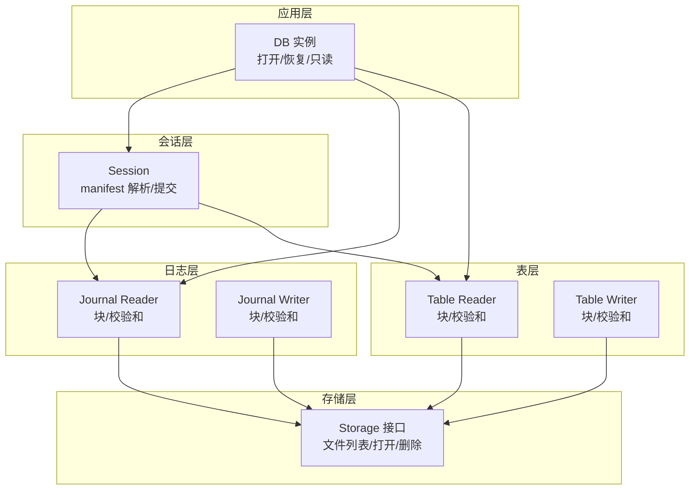
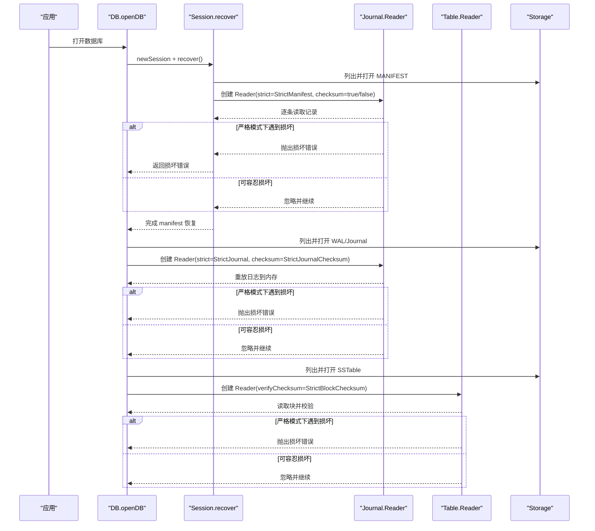
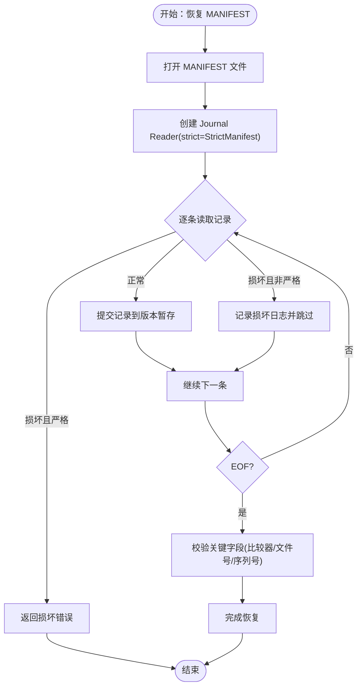
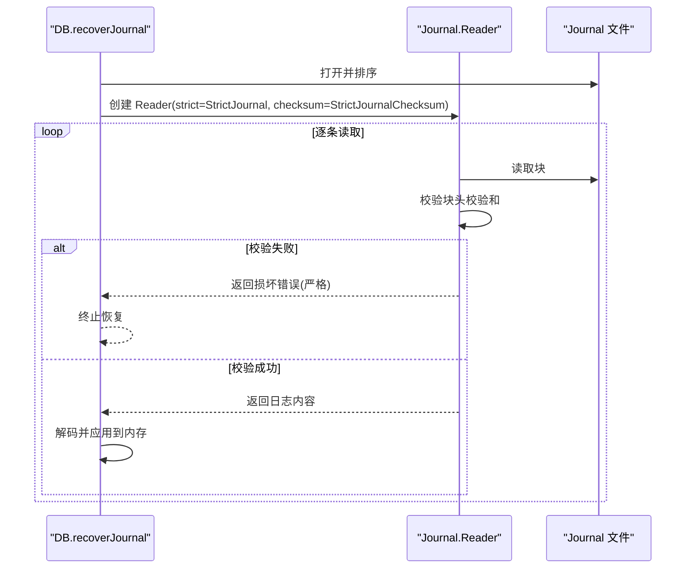
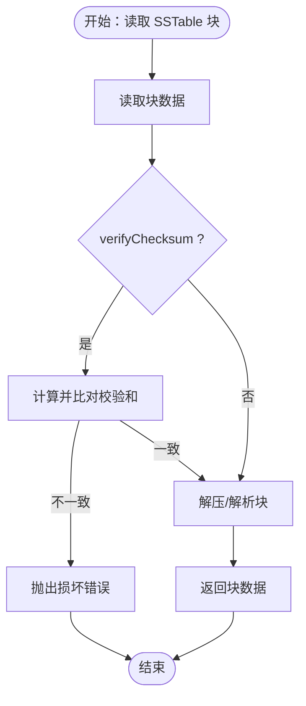
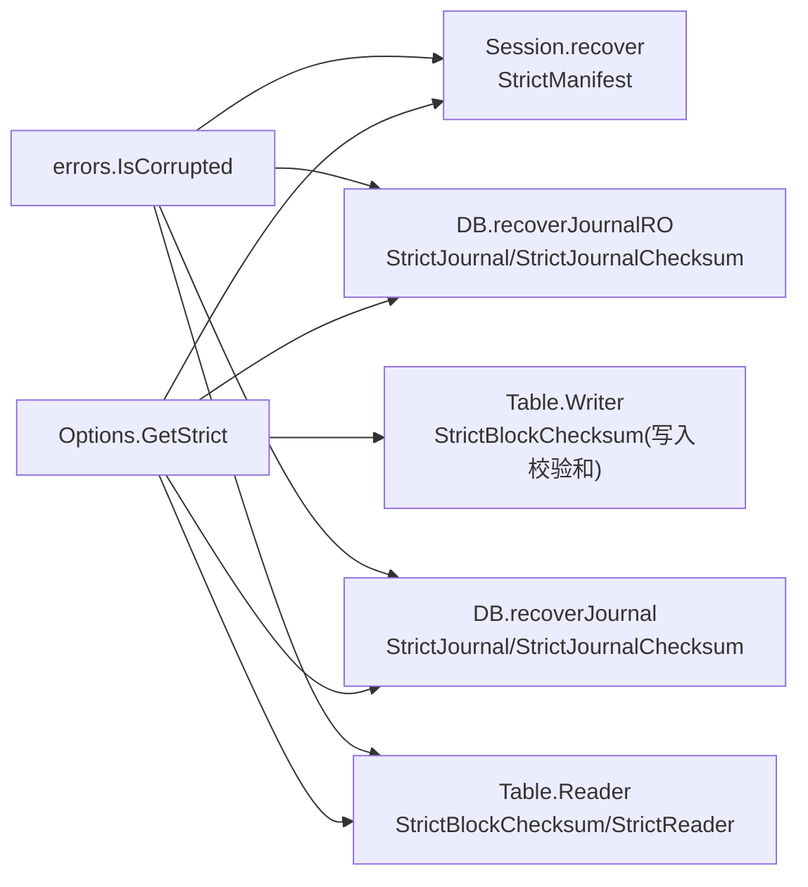

# 数据验证配置

<cite>
**本文引用的文件**
- [leveldb/opt/options.go](file://leveldb/opt/options.go)
- [leveldb/session.go](file://leveldb/session.go)
- [leveldb/journal/journal.go](file://leveldb/journal/journal.go)
- [leveldb/table/reader.go](file://leveldb/table/reader.go)
- [leveldb/table/writer.go](file://leveldb/table/writer.go)
- [leveldb/db.go](file://leveldb/db.go)
- [leveldb/errors/errors.go](file://leveldb/errors/errors.go)
- [manualtest/dbstress/main.go](file://manualtest/dbstress/main.go)
</cite>

## 目录
1. [简介](#简介)
2. [项目结构](#项目结构)
3. [核心组件](#核心组件)
4. [架构总览](#架构总览)
5. [详细组件分析](#详细组件分析)
6. [依赖关系分析](#依赖关系分析)
7. [性能考量](#性能考量)
8. [故障排查指南](#故障排查指南)
9. [结论](#结论)
10. [附录：配置启用示例路径](#附录配置启用示例路径)

## 简介
本文件围绕 avccDB 的数据验证配置进行系统化说明，重点覆盖以下三项严格校验开关：
- StrictManifest：对 MANIFEST 日志（记录数据库元信息）进行严格校验，遇到损坏时直接报错，阻止打开数据库。
- StrictJournalChecksum：对 WAL 日志（写入缓冲区）块级校验和进行验证。
- StrictBlockChecksum：对 SSTable 块级校验和进行验证，影响读取与压缩合并过程。

文档将解释这些配置在写入与读取流程中的工作机制，涵盖 manifest 文件、日志文件与 SSTable 块的校验过程；说明检测到数据损坏时的处理策略（忽略、报错或进入只读模式）；并给出启用这些验证功能的参考路径与性能影响分析。

## 项目结构
本仓库采用按领域分层的组织方式：
- 存储层：文件系统抽象与存储接口
- 日志层：WAL 日志读写器
- 表层：SSTable 的读写与块校验
- 会话层：数据库会话管理、manifest 解析与提交
- 错误层：统一的损坏错误类型与判定工具
- 应用入口：数据库打开、恢复与只读模式

图示来源
- [leveldb/db.go](file://leveldb/db.go#L100-L175)
- [leveldb/session.go](file://leveldb/session.go#L122-L208)
- [leveldb/journal/journal.go](file://leveldb/journal/journal.go#L148-L214)
- [leveldb/table/reader.go](file://leveldb/table/reader.go#L568-L622)
- [leveldb/table/writer.go](file://leveldb/table/writer.go#L178-L209)

章节来源
- [leveldb/db.go](file://leveldb/db.go#L100-L175)
- [leveldb/session.go](file://leveldb/session.go#L122-L208)

## 核心组件
- 严格级别枚举与默认值：定义了 StrictManifest、StrictJournalChecksum、StrictJournal、StrictBlockChecksum 等标志位及其默认组合。
- 选项解析：通过 Options.GetStrict 判断是否启用某严格级别。
- 会话恢复：在恢复 manifest 时使用 StrictManifest 控制损坏行为。
- 日志读写：Journal Reader/Writer 在严格模式下执行块级校验和验证。
- 表读写：Table Reader/Writer 在严格模式下执行块级校验和验证。
- 错误类型：统一的损坏错误包装与判定工具。

章节来源
- [leveldb/opt/options.go](file://leveldb/opt/options.go#L130-L174)
- [leveldb/opt/options.go](file://leveldb/opt/options.go#L659-L664)
- [leveldb/session.go](file://leveldb/session.go#L153-L208)
- [leveldb/journal/journal.go](file://leveldb/journal/journal.go#L148-L214)
- [leveldb/table/reader.go](file://leveldb/table/reader.go#L568-L622)
- [leveldb/table/writer.go](file://leveldb/table/writer.go#L178-L209)
- [leveldb/errors/errors.go](file://leveldb/errors/errors.go#L30-L80)

## 架构总览
下面以序列图展示“打开数据库”时，严格校验如何贯穿 manifest、journal 与 SSTable 的恢复流程。

图示来源
- [leveldb/db.go](file://leveldb/db.go#L100-L175)
- [leveldb/session.go](file://leveldb/session.go#L153-L208)
- [leveldb/journal/journal.go](file://leveldb/journal/journal.go#L148-L214)
- [leveldb/table/reader.go](file://leveldb/table/reader.go#L568-L622)

## 详细组件分析

### StrictManifest：Manifest 文件严格校验
- 工作机制
  - 在恢复 manifest 时，从存储中打开 MANIFEST 文件，使用 Journal Reader 逐条读取记录。
  - 严格模式下（StrictManifest），遇到损坏或格式错误会直接返回错误，阻止数据库打开。
  - 非严格模式下，若记录损坏且非损坏错误，则会跳过该记录并继续恢复。
- 关键点
  - 严格模式由 Options.GetStrict 判定，缺省默认包含 StrictJournalChecksum、StrictBlockChecksum、StrictCompaction、StrictReader。
  - manifest 恢复完成后，还会校验关键字段（比较器、下一个文件号、日志文件号、序列号等）。
- 处理策略
  - 严格：报错并拒绝打开。
  - 非严格：跳过损坏记录，继续恢复。
- 影响范围
  - 仅影响 manifest 恢复阶段，决定数据库能否成功打开。

图示来源
- [leveldb/session.go](file://leveldb/session.go#L153-L208)

章节来源
- [leveldb/session.go](file://leveldb/session.go#L153-L208)
- [leveldb/opt/options.go](file://leveldb/opt/options.go#L659-L664)

### StrictJournalChecksum：WAL 日志块级校验和
- 工作机制
  - 在恢复 WAL/Journal 时，Journal Reader 支持开启 checksum 校验。
  - 当 StrictJournalChecksum 开启时，块头中的校验和字段与计算值不一致将触发损坏错误。
  - 严格模式（StrictJournal）下，遇到损坏会直接报错；否则可能忽略并继续。
- 关键点
  - Journal Writer 写入块时会计算并写入校验和，Reader 读取时进行验证。
  - 严格模式与 checksum 校验分别控制“是否验证校验和”和“遇到损坏是否报错”。
- 处理策略
  - 严格+校验和：报错。
  - 非严格或非校验和：忽略并继续。
- 影响范围
  - 影响 WAL/Journal 重放阶段，决定是否能从日志恢复数据。

图示来源
- [leveldb/db.go](file://leveldb/db.go#L499-L755)
- [leveldb/journal/journal.go](file://leveldb/journal/journal.go#L148-L214)

章节来源
- [leveldb/db.go](file://leveldb/db.go#L499-L755)
- [leveldb/journal/journal.go](file://leveldb/journal/journal.go#L148-L214)

### StrictBlockChecksum：SSTable 块级校验和
- 工作机制
  - Table Writer 写入块时计算并附加校验和，Table Reader 读取块时可选择验证。
  - 严格模式（StrictBlockChecksum）下，读取块时若校验失败则抛出损坏错误。
  - 严格模式（StrictReader）下，读取操作遇到损坏会中断；StrictCompaction 下，损坏会导致压缩失败并进入只读模式。
- 关键点
  - Reader.readRawBlock 中对块尾部校验和进行比对；失败时构造带位置信息的损坏错误。
  - Writer.writeBlock 中计算并写入校验和。
- 处理策略
  - 严格+损坏：报错或进入只读模式。
  - 非严格：忽略并继续（取决于具体场景）。
- 影响范围
  - 影响所有读取与压缩合并过程，确保数据块完整性。

图示来源
- [leveldb/table/reader.go](file://leveldb/table/reader.go#L568-L622)
- [leveldb/table/writer.go](file://leveldb/table/writer.go#L178-L209)

章节来源
- [leveldb/table/reader.go](file://leveldb/table/reader.go#L568-L622)
- [leveldb/table/writer.go](file://leveldb/table/writer.go#L178-L209)

### 严格级别与默认值
- 严格级别枚举与含义
  - StrictManifest：对 manifest 进行严格校验，损坏即报错。
  - StrictJournalChecksum：对 WAL 块级校验和进行验证。
  - StrictJournal：对 WAL 块/块头格式进行严格校验，损坏即报错。
  - StrictBlockChecksum：对 SSTable 块级校验和进行验证。
  - StrictCompaction：损坏导致压缩失败并进入只读模式。
  - StrictReader：损坏导致读取操作中断。
  - StrictRecovery：恢复时丢弃损坏的 SSTable。
- 默认严格级别
  - 默认包含 StrictJournalChecksum、StrictBlockChecksum、StrictCompaction、StrictReader。

章节来源
- [leveldb/opt/options.go](file://leveldb/opt/options.go#L130-L174)
- [leveldb/opt/options.go](file://leveldb/opt/options.go#L659-L664)

## 依赖关系分析
- 严格级别通过 Options.GetStrict 全局生效，也可在 ReadOptions 中通过 StrictOverride 覆盖。
- 会话层在恢复 manifest 时使用 StrictManifest 控制损坏处理。
- 数据库层在恢复 WAL/Journal 时使用 StrictJournal 与 StrictJournalChecksum 控制损坏处理。
- 表层在读取 SSTable 时根据 StrictBlockChecksum 与 StrictReader 控制损坏处理。
- 错误层提供统一的损坏错误类型与判定工具，便于上层区分处理。

图示来源
- [leveldb/opt/options.go](file://leveldb/opt/options.go#L659-L664)
- [leveldb/session.go](file://leveldb/session.go#L153-L208)
- [leveldb/db.go](file://leveldb/db.go#L499-L755)
- [leveldb/table/reader.go](file://leveldb/table/reader.go#L568-L622)
- [leveldb/table/writer.go](file://leveldb/table/writer.go#L178-L209)
- [leveldb/errors/errors.go](file://leveldb/errors/errors.go#L49-L59)

章节来源
- [leveldb/opt/options.go](file://leveldb/opt/options.go#L659-L664)
- [leveldb/errors/errors.go](file://leveldb/errors/errors.go#L49-L59)

## 性能考量
- 校验和计算成本
  - 写入阶段：Table Writer 在每个块写入时计算并附加校验和，增加少量 CPU 与 I/O 开销。
  - 读取阶段：Table Reader 在读取块时进行校验和比对，带来额外 CPU 成本。
  - WAL/Journal：Journal Writer 写入块头校验和；Journal Reader 读取时进行校验，带来额外 CPU 成本。
- 严格模式下的开销
  - 严格模式下遇到损坏立即报错，避免后续无效重试，但也会导致失败更快发生。
  - 非严格模式下会尝试跳过损坏并继续，可能延长恢复时间。
- 建议
  - 生产环境建议开启 StrictJournalChecksum 与 StrictBlockChecksum，以保证数据完整性。
  - 若对吞吐敏感且可接受一定风险，可在测试或离线场景关闭严格模式。
  - 只读模式下，StrictReader 会中断读取，避免污染读结果。

[本节为通用指导，无需特定文件引用]

## 故障排查指南
- 常见错误类型
  - 损坏错误：errors.ErrCorrupted 包装底层损坏原因，可用于判断是否为数据损坏。
  - 损坏判定：errors.IsCorrupted 可用于识别损坏类错误。
- 处理策略
  - 严格模式（StrictManifest/StrictJournal/StrictBlockChecksum/StrictCompaction/StrictReader）：遇到损坏直接报错或进入只读模式。
  - 非严格模式：尝试跳过损坏并继续，但可能丢失部分数据或产生不一致。
- 恢复与只读
  - 只读模式：数据库打开后设置为只读，避免进一步写入破坏数据。
  - 恢复：使用 Recover/RecoverFile 重新构建数据库，必要时丢弃损坏的 SSTable（StrictRecovery）。

章节来源
- [leveldb/errors/errors.go](file://leveldb/errors/errors.go#L30-L80)
- [leveldb/db.go](file://leveldb/db.go#L100-L175)
- [leveldb/db.go](file://leveldb/db.go#L245-L293)
- [leveldb/db.go](file://leveldb/db.go#L295-L400)

## 结论
StrictManifest、StrictJournalChecksum 与 StrictBlockChecksum 三者共同构成了 avccDB 的三层数据完整性保障：
- Manifest 层：确保数据库元信息完整，避免因元数据损坏导致的异常。
- WAL/Journal 层：确保写入缓冲区的块级数据完整，防止日志损坏引发的数据丢失。
- SSTable 层：确保持久化数据块完整，读取与压缩合并均受保护。

通过合理启用这些严格级别，可以在生产环境中显著提升数据可靠性；同时，结合只读模式与恢复能力，能够在检测到损坏时快速止损并重建健康状态。

[本节为总结，无需特定文件引用]

## 附录：配置启用示例路径
以下为启用严格校验的参考路径（以代码片段路径代替具体代码）：
- 启用 StrictJournalChecksum 与 StrictBlockChecksum（默认包含）
  - 参考：[leveldb/opt/options.go](file://leveldb/opt/options.go#L168-L170)
- 显式设置 StrictManifest
  - 参考：[leveldb/opt/options.go](file://leveldb/opt/options.go#L659-L664)
  - 使用处：[leveldb/session.go](file://leveldb/session.go#L153-L159)
- 显式设置 StrictJournal 与 StrictJournalChecksum
  - 使用处：[leveldb/db.go](file://leveldb/db.go#L529-L531)
  - 使用处：[leveldb/db.go](file://leveldb/db.go#L686-L688)
- 显式设置 StrictBlockChecksum
  - 使用处：[leveldb/table/reader.go](file://leveldb/table/reader.go#L770-L776)
  - 使用处：[leveldb/table/reader.go](file://leveldb/table/reader.go#L778-L787)
- 严格模式下的性能对比测试参考
  - 参考：[manualtest/dbstress/main.go](file://manualtest/dbstress/main.go#L170-L177)
  - 参考：[manualtest/dbstress/main.go](file://manualtest/dbstress/main.go#L584-L616)

章节来源
- [leveldb/opt/options.go](file://leveldb/opt/options.go#L168-L170)
- [leveldb/opt/options.go](file://leveldb/opt/options.go#L659-L664)
- [leveldb/session.go](file://leveldb/session.go#L153-L159)
- [leveldb/db.go](file://leveldb/db.go#L529-L531)
- [leveldb/db.go](file://leveldb/db.go#L686-L688)
- [leveldb/table/reader.go](file://leveldb/table/reader.go#L770-L776)
- [leveldb/table/reader.go](file://leveldb/table/reader.go#L778-L787)
- [manualtest/dbstress/main.go](file://manualtest/dbstress/main.go#L170-L177)
- [manualtest/dbstress/main.go](file://manualtest/dbstress/main.go#L584-L616)