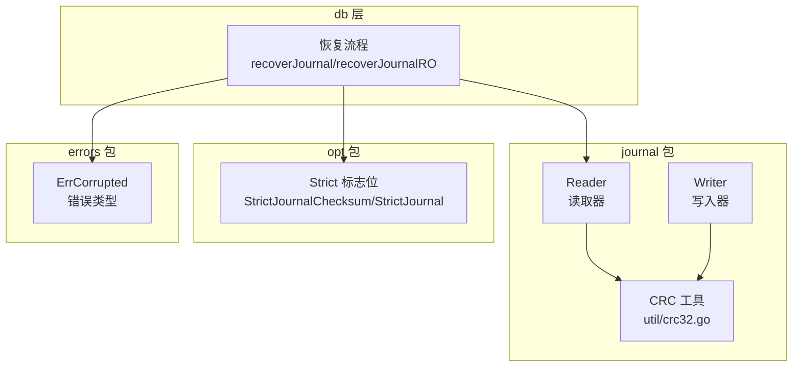
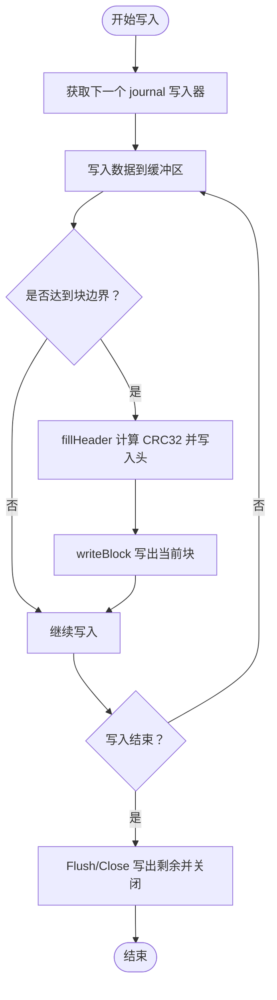
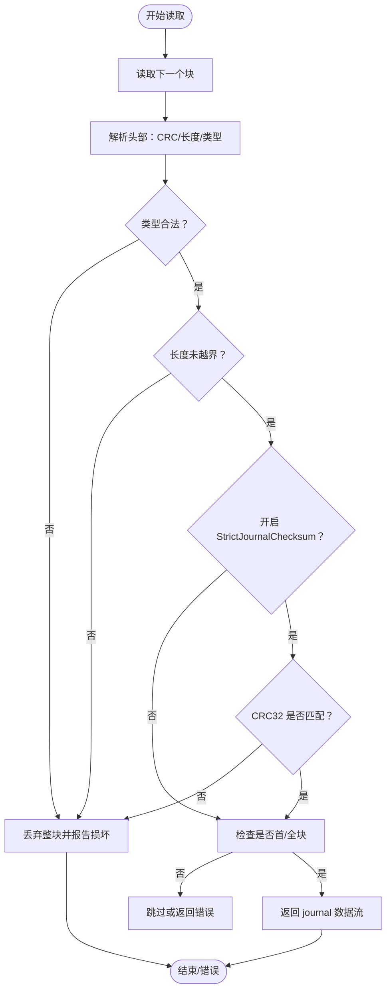
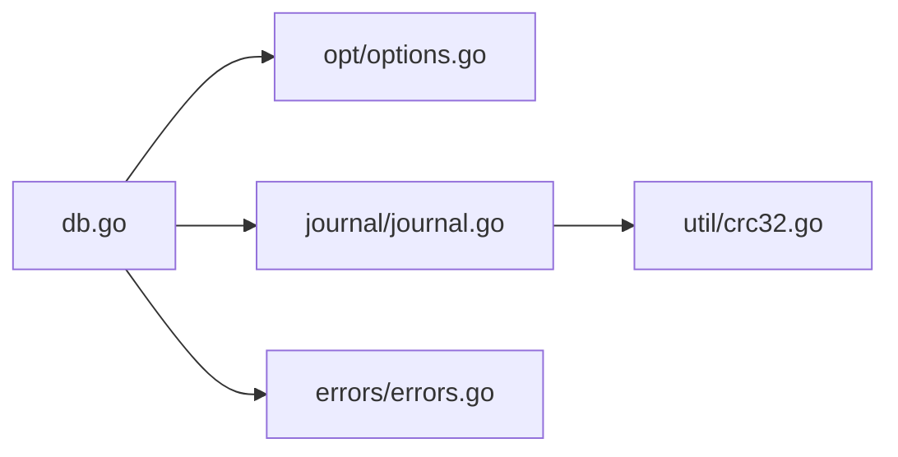

# 校验和验证

<cite>
**本文引用的文件列表**
- [journal.go](file://leveldb/journal/journal.go)
- [crc32.go](file://leveldb/util/crc32.go)
- [options.go](file://leveldb/opt/options.go)
- [db.go](file://leveldb/db.go)
- [errors.go](file://leveldb/errors/errors.go)
- [journal_test.go](file://leveldb/journal/journal_test.go)
- [corrupt_test.go](file://leveldb/corrupt_test.go)
</cite>

## 目录
1. [简介](#简介)
2. [项目结构](#项目结构)
3. [核心组件](#核心组件)
4. [架构总览](#架构总览)
5. [详细组件分析](#详细组件分析)
6. [依赖关系分析](#依赖关系分析)
7. [性能考量](#性能考量)
8. [故障排查指南](#故障排查指南)
9. [结论](#结论)
10. [附录：配置与使用示例路径](#附录配置与使用示例路径)

## 简介
本文件围绕 avccDB 的日志校验和验证机制，系统性阐述 StrictJournalChecksum 配置项在写入与读取过程中如何验证 journal 文件的 CRC32 校验和。内容涵盖：
- 校验和的计算时机与存储位置
- 单个 chunk 的校验与完整日志流的验证策略
- 当检测到校验和不匹配时的错误处理机制
- StrictJournalChecksum 与 StrictJournal 的协同工作方式
- 如何启用与配置校验和验证，以及其对写入性能的影响

## 项目结构
与校验和验证直接相关的模块位于以下文件：
- journal 包：负责 journal 的读写、块与 chunk 的解析、校验和计算与验证
- util 包：提供 CRC32 计算工具
- opt 包：定义 StrictJournalChecksum、StrictJournal 等严格模式标志位
- db.go：数据库恢复流程中使用 StrictJournal 与 StrictJournalChecksum 控制读取行为
- errors 包：统一的错误类型与辅助函数，用于标记损坏文件与判定损坏类型
- journal_test.go、corrupt_test.go：测试用例覆盖了校验和验证与损坏恢复场景



图表来源
- [journal.go](file://leveldb/journal/journal.go#L123-L216)
- [crc32.go](file://leveldb/util/crc32.go#L1-L31)
- [options.go](file://leveldb/opt/options.go#L137-L171)
- [db.go](file://leveldb/db.go#L529-L755)
- [errors.go](file://leveldb/errors/errors.go#L30-L80)

章节来源
- [journal.go](file://leveldb/journal/journal.go#L123-L216)
- [crc32.go](file://leveldb/util/crc32.go#L1-L31)
- [options.go](file://leveldb/opt/options.go#L137-L171)
- [db.go](file://leveldb/db.go#L529-L755)
- [errors.go](file://leveldb/errors/errors.go#L30-L80)

## 核心组件
- Journal Reader/Writer
  - Reader 在读取每个 chunk 前进行校验：类型合法性、长度合法性、以及 CRC32 校验；当 StrictJournalChecksum 开启且校验失败时，会根据 StrictJournal 决定是跳过还是抛错。
  - Writer 在填充 chunk 头部时计算 CRC32 并写入；当 chunk 完整或块边界满时写入底层存储。
- CRC32 工具
  - 提供基于 Castagnoli 多项式的 CRC32 计算，并对结果进行掩码与移位处理以保证一致性。
- Strict 标志位
  - StrictJournalChecksum：开启 journal chunk 的 CRC32 校验
  - StrictJournal：开启 journal 的严格模式，遇到损坏时直接报错而非丢弃
- 错误模型
  - 使用 ErrCorrupted 包装损坏信息，并可附加文件描述符，便于定位问题文件

章节来源
- [journal.go](file://leveldb/journal/journal.go#L123-L216)
- [journal.go](file://leveldb/journal/journal.go#L378-L418)
- [crc32.go](file://leveldb/util/crc32.go#L1-L31)
- [options.go](file://leveldb/opt/options.go#L137-L171)
- [errors.go](file://leveldb/errors/errors.go#L30-L80)

## 架构总览
下图展示了从数据库打开到恢复阶段，StrictJournalChecksum 与 StrictJournal 如何共同作用于 journal 的读取与校验。

```mermaid
sequenceDiagram
participant DB as "DB 层"
participant Opt as "Options<br/>Strict 标志位"
participant JR as "Journal Reader"
participant CRC as "CRC 工具"
participant Store as "存储层"
DB->>Opt : 读取 StrictJournal/StrictJournalChecksum
DB->>Store : 打开 journal 文件
DB->>JR : 创建/重置 Reader(strict, checksum)
loop 逐条读取 journal
JR->>Store : 读取下一个块
JR->>JR : 解析 chunk 头部
JR->>CRC : 计算 payload 的 CRC32
alt 校验失败
JR->>DB : 返回 ErrCorrupted 或跳过
else 校验通过
JR-->>DB : 返回 journal 数据流
end
end
DB->>DB : 应用到内存数据库并提交
```

图表来源
- [db.go](file://leveldb/db.go#L529-L755)
- [journal.go](file://leveldb/journal/journal.go#L123-L216)
- [crc32.go](file://leveldb/util/crc32.go#L1-L31)

## 详细组件分析

### 组件一：Journal Writer（写入端校验和）
- 计算时机
  - 在写入 chunk 时，Writer 先将 chunk 类型写入头部，随后调用 fillHeader 计算 CRC32 并写入校验字段；最后写入块或刷新缓冲区。
- 存储位置
  - 校验和存储在 chunk 头部的前 4 字节，紧随 chunk 类型与长度字段之后。
- 关键流程
  - Next 获取新 journal 的写入器，内部确保块边界安全
  - Write 将数据写入缓冲区，必要时触发块写入与 CRC 计算
  - Flush/Close 将剩余缓冲区写出并关闭



图表来源
- [journal.go](file://leveldb/journal/journal.go#L378-L418)
- [journal.go](file://leveldb/journal/journal.go#L470-L536)

章节来源
- [journal.go](file://leveldb/journal/journal.go#L378-L418)
- [journal.go](file://leveldb/journal/journal.go#L470-L536)

### 组件二：Journal Reader（读取端校验和）
- 计算时机
  - Reader 在解析下一个 chunk 时，先读取头部字段，再对“chunk 类型 + payload”计算 CRC32 并与头部中的校验值比对。
- 存储位置
  - 校验和位于 chunk 头部前 4 字节，采用小端序编码。
- 验证策略
  - 类型检查：chunk 类型必须在合法范围内（full/first/middle/last）
  - 长度检查：payload 长度不得超出块边界
  - CRC32 校验：当开启 StrictJournalChecksum 时，若不一致则判定为损坏
  - 严格模式：当开启 StrictJournal 且非跳过情况时，直接返回 ErrCorrupted，阻止数据库打开
- 单个 chunk 与完整日志流
  - 单个 chunk：Reader 对每个 chunk 进行独立校验，失败即丢弃当前块或返回错误
  - 完整日志流：Reader 通过 Next 连续读取多个 journal，每个 journal 可能由一个或多个 chunk 组成



图表来源
- [journal.go](file://leveldb/journal/journal.go#L175-L216)
- [journal.go](file://leveldb/journal/journal.go#L244-L261)

章节来源
- [journal.go](file://leveldb/journal/journal.go#L175-L216)
- [journal.go](file://leveldb/journal/journal.go#L244-L261)

### 组件三：CRC32 工具
- 多项式与掩码
  - 使用 Castagnoli 多项式进行 CRC32 计算，并对结果进行移位与异或掩码，确保跨平台一致性
- 接口
  - NewCRC：基于字节切片创建 CRC 实例
  - Update：增量更新 CRC
  - Value：返回最终掩码后的 32 位值

章节来源
- [crc32.go](file://leveldb/util/crc32.go#L1-L31)

### 组件四：StrictJournalChecksum 与 StrictJournal 的协同
- 读取阶段
  - DB 在打开/恢复时，从 Options 中读取 StrictJournal 与 StrictJournalChecksum
  - 将这两个标志传递给 Journal Reader：strict 控制严格模式（损坏直接报错），checksum 控制是否进行 CRC32 校验
- 错误处理
  - 当 checksum 为真且 CRC 不匹配：若 strict 为真，则返回 ErrCorrupted；否则返回跳过信号，允许继续读取后续 journal
  - 当 strict 为真但非 CRC 导致的损坏：同样返回 ErrCorrupted，阻止数据库打开
- 恢复流程
  - recoverJournal/recoverJournalRO 中，Reader 以 (strict, checksum) 参数构造，随后逐条 replay journal 并应用到内存数据库

```mermaid
sequenceDiagram
participant DB as "DB"
participant Opt as "Options"
participant JR as "Journal Reader"
participant ERR as "ErrCorrupted"
DB->>Opt : 读取 StrictJournal/StrictJournalChecksum
DB->>JR : NewReader(..., strict, checksum)
loop 读取 journal
JR->>JR : 校验 chunk 头部与 CRC
alt 校验失败
alt strict 为真
JR-->>DB : 返回 ERRCorrupted
DB-->>DB : 停止恢复并报错
else strict 为假
JR-->>DB : 返回跳过信号
DB-->>DB : 继续读取下一个 journal
end
else 校验成功
JR-->>DB : 返回 journal 数据
end
end
```

图表来源
- [db.go](file://leveldb/db.go#L529-L755)
- [journal.go](file://leveldb/journal/journal.go#L149-L173)
- [errors.go](file://leveldb/errors/errors.go#L30-L80)

章节来源
- [db.go](file://leveldb/db.go#L529-L755)
- [journal.go](file://leveldb/journal/journal.go#L149-L173)
- [errors.go](file://leveldb/errors/errors.go#L30-L80)

## 依赖关系分析
- Journal Reader 依赖 CRC 工具进行校验
- DB 层通过 Options 决定 Reader 的 strict 与 checksum 行为
- 错误模型统一使用 ErrCorrupted，支持附加文件描述符以便定位损坏文件



图表来源
- [db.go](file://leveldb/db.go#L529-L755)
- [options.go](file://leveldb/opt/options.go#L137-L171)
- [journal.go](file://leveldb/journal/journal.go#L123-L216)
- [crc32.go](file://leveldb/util/crc32.go#L1-L31)
- [errors.go](file://leveldb/errors/errors.go#L30-L80)

章节来源
- [db.go](file://leveldb/db.go#L529-L755)
- [options.go](file://leveldb/opt/options.go#L137-L171)
- [journal.go](file://leveldb/journal/journal.go#L123-L216)
- [crc32.go](file://leveldb/util/crc32.go#L1-L31)
- [errors.go](file://leveldb/errors/errors.go#L30-L80)

## 性能考量
- 计算开销
  - Writer 在每个 chunk 写入前计算 CRC32，属于 O(n) 的线性复杂度，n 为 payload 长度
  - Reader 在每个 chunk 读取后计算 CRC32，同样为 O(n)
- I/O 影响
  - Writer 在块边界满时写入，避免频繁小块 I/O；在 Flush/Close 时写出剩余缓冲
  - Reader 以 32KiB 块为单位读取，减少系统调用次数
- 严格模式权衡
  - 启用 StrictJournalChecksum 会在读取阶段增加一次 CRC 计算与比较，带来轻微 CPU 开销
  - 启用 StrictJournal 会在发现损坏时立即停止，避免后续无效处理，提升安全性但可能延长启动时间

[本节为通用性能讨论，无需列出具体文件来源]

## 故障排查指南
- 常见错误类型
  - ErrCorrupted：表示数据库损坏，可包含文件描述符信息，便于定位
  - io.ErrUnexpectedEOF：在非严格模式下，损坏导致的数据截断
- 排查步骤
  - 确认 Options 中是否启用 StrictJournalChecksum 与 StrictJournal
  - 观察恢复流程中返回的错误类型与文件描述符
  - 若为 CRC 不匹配，检查底层存储介质与写入路径是否存在数据损坏
  - 若为类型或长度异常，检查写入端逻辑或外部进程对 journal 文件的修改
- 测试参考
  - journal_test.go 中包含大量边界与随机数据的读写测试，可作为回归验证的参考
  - corrupt_test.go 展示了在 journal 损坏场景下的恢复行为与期望结果

章节来源
- [errors.go](file://leveldb/errors/errors.go#L30-L80)
- [journal_test.go](file://leveldb/journal/journal_test.go#L1-L200)
- [corrupt_test.go](file://leveldb/corrupt_test.go#L1-L250)

## 结论
StrictJournalChecksum 通过在写入端计算 CRC32 并在读取端进行严格校验，有效提升了 journal 的完整性保障。结合 StrictJournal，可在损坏发生时及时终止并阻止数据库打开，从而避免潜在的数据不一致。尽管引入了额外的 CPU 与 I/O 成本，但其带来的可靠性收益在多数生产环境中是值得的。建议在关键业务场景下启用 StrictJournalChecksum，并配合严格的存储与备份策略，以获得更高的数据安全性。

[本节为总结性内容，无需列出具体文件来源]

## 附录：配置与使用示例路径
- 启用 StrictJournalChecksum
  - 在 Options 中设置 Strict 标志位包含 StrictJournalChecksum
  - 示例路径：[选项定义](file://leveldb/opt/options.go#L137-L171)
- 在恢复流程中传递 strict 与 checksum
  - DB 在打开/恢复时从 Options 读取 StrictJournal 与 StrictJournalChecksum，并传入 Journal Reader
  - 示例路径：[恢复流程](file://leveldb/db.go#L529-L755)
- 校验和计算与验证
  - 写入端：fillHeader 计算 CRC32 并写入头部
  - 读取端：nextChunk 解析头部并验证 CRC32
  - 示例路径：
    - [写入端 CRC 计算](file://leveldb/journal/journal.go#L378-L418)
    - [读取端 CRC 验证](file://leveldb/journal/journal.go#L175-L216)
- 错误处理与文件定位
  - 使用 ErrCorrupted 包装错误并附加文件描述符
  - 示例路径：[错误类型与辅助函数](file://leveldb/errors/errors.go#L30-L80)

章节来源
- [options.go](file://leveldb/opt/options.go#L137-L171)
- [db.go](file://leveldb/db.go#L529-L755)
- [journal.go](file://leveldb/journal/journal.go#L175-L216)
- [journal.go](file://leveldb/journal/journal.go#L378-L418)
- [errors.go](file://leveldb/errors/errors.go#L30-L80)