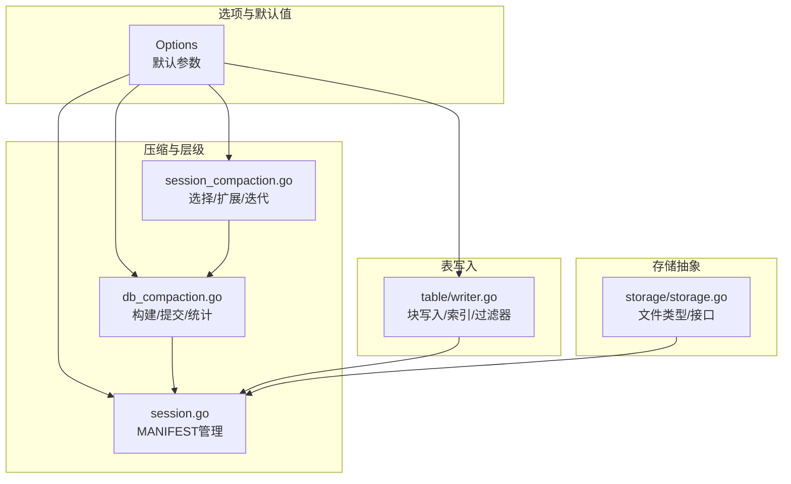
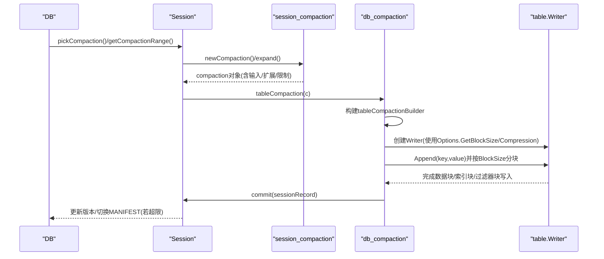
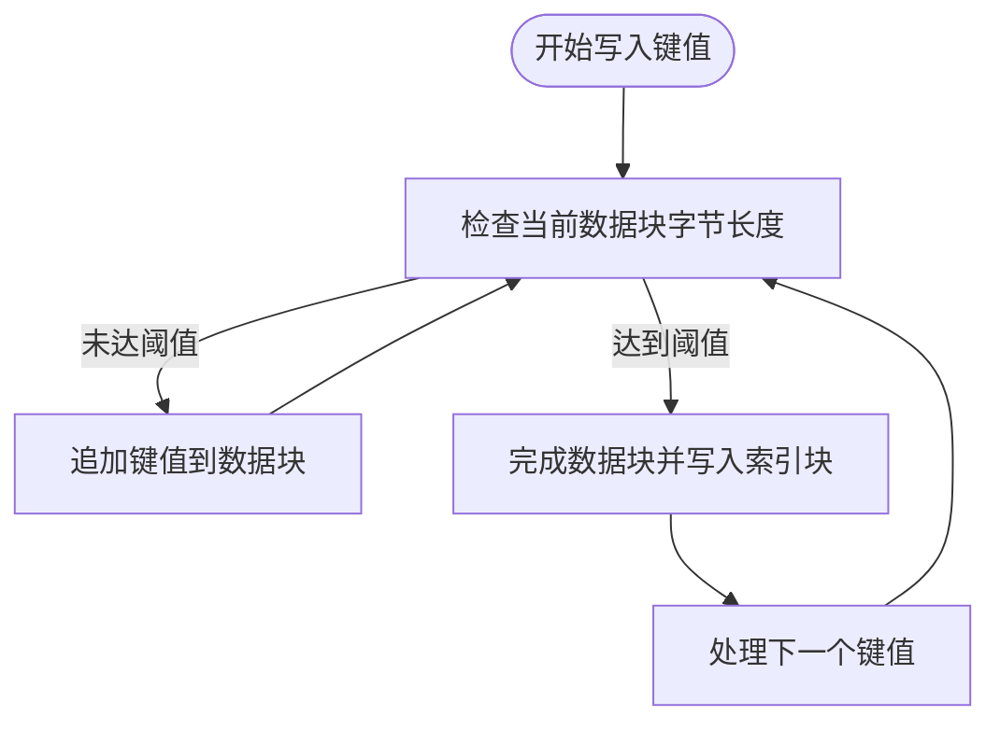
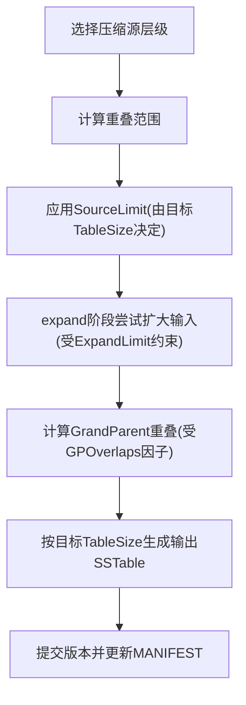
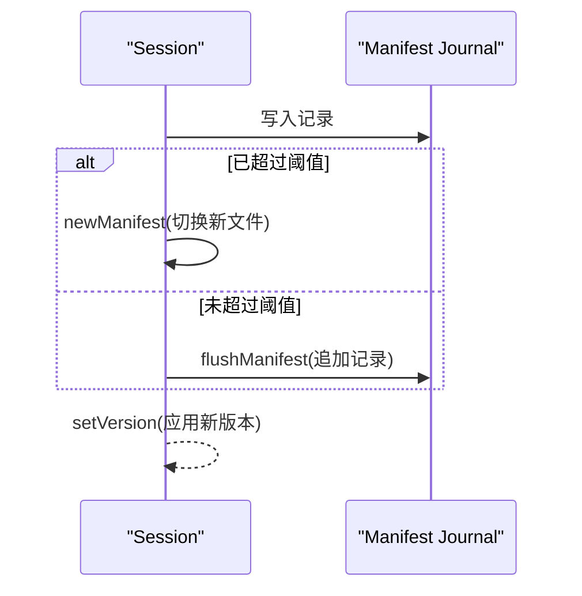
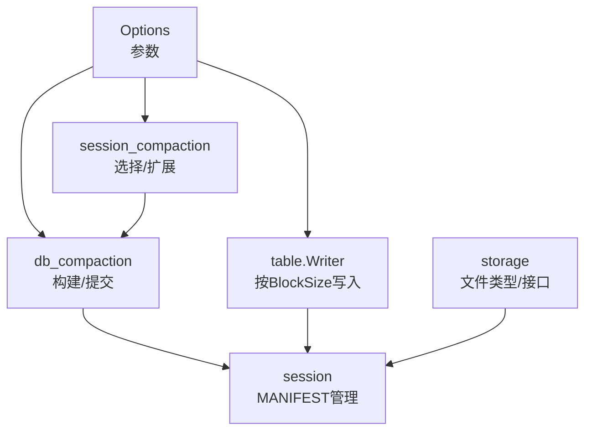

# I/O优化

<cite>
**本文引用的文件**
- [leveldb/opt/options.go](file://leveldb/opt/options.go)
- [leveldb/db_compaction.go](file://leveldb/db_compaction.go)
- [leveldb/session.go](file://leveldb/session.go)
- [leveldb/table/writer.go](file://leveldb/table/writer.go)
- [leveldb/session_compaction.go](file://leveldb/session_compaction.go)
- [leveldb/storage/storage.go](file://leveldb/storage/storage.go)
- [leveldb/db_test.go](file://leveldb/db_test.go)
- [leveldb/table/table_test.go](file://leveldb/table/table_test.go)
</cite>

## 目录
1. [简介](#简介)
2. [项目结构](#项目结构)
3. [核心组件](#核心组件)
4. [架构总览](#架构总览)
5. [详细组件分析](#详细组件分析)
6. [依赖关系分析](#依赖关系分析)
7. [性能考量](#性能考量)
8. [故障排查指南](#故障排查指南)
9. [结论](#结论)
10. [附录：不同存储介质的I/O优化建议](#附录不同存储介质的io优化建议)

## 简介
本文件围绕 avccDB 的 I/O 优化配置进行系统化说明，重点解释以下参数与行为：
- BlockSize 如何影响 SSTable 数据块大小，进而影响读取放大与压缩效率
- CompactionTableSize 与 CompactionTotalSize 如何控制压缩生成的 SSTable 大小与层级总大小，优化 I/O 模式
- MaxManifestFileSize 如何管理 MANIFEST 文件大小，避免单文件过大带来的恢复与写入压力
- 针对 SSD/HDD 的 I/O 优化配置建议

目标是帮助读者在不同工作负载与存储介质下，通过合理设置这些参数获得更优的吞吐、延迟与稳定性表现。

## 项目结构
与 I/O 优化直接相关的核心模块包括：
- 选项与默认值：leveldb/opt/options.go
- 压缩流程与触发：leveldb/db_compaction.go、leveldb/session_compaction.go
- 表写入与块划分：leveldb/table/writer.go
- MANIFEST 管理：leveldb/session.go
- 存储抽象：leveldb/storage/storage.go
- 测试用例与验证：leveldb/db_test.go、leveldb/table/table_test.go

图表来源
- [leveldb/opt/options.go](file://leveldb/opt/options.go#L24-45)
- [leveldb/session_compaction.go](file://leveldb/session_compaction.go#L56-134)
- [leveldb/db_compaction.go](file://leveldb/db_compaction.go#L567-629)
- [leveldb/session.go](file://leveldb/session.go#L210-243)
- [leveldb/table/writer.go](file://leveldb/table/writer.go#L451-490)
- [leveldb/storage/storage.go](file://leveldb/storage/storage.go#L16-41)

章节来源
- [leveldb/opt/options.go](file://leveldb/opt/options.go#L24-45)
- [leveldb/session_compaction.go](file://leveldb/session_compaction.go#L56-134)
- [leveldb/db_compaction.go](file://leveldb/db_compaction.go#L567-629)
- [leveldb/session.go](file://leveldb/session.go#L210-243)
- [leveldb/table/writer.go](file://leveldb/table/writer.go#L451-490)
- [leveldb/storage/storage.go](file://leveldb/storage/storage.go#L16-41)

## 核心组件
- Options：集中定义 I/O 相关参数及其默认值，如 BlockSize、CompactionTableSize、CompactionTotalSize、MaxManifestFileSize 等，并提供获取方法以支持按层级动态计算。
- 压缩流程：从选择输入、扩展输入、构建输出表到提交版本，贯穿读写放大与压缩效率的关键路径。
- 表写入：基于 BlockSize 将键值写入数据块，生成索引块与过滤器块，决定 SSTable 的物理布局与读放大。
- MANIFEST 管理：当 MANIFEST 超过阈值时自动切换新文件，避免单文件过大导致的恢复与写入开销。

章节来源
- [leveldb/opt/options.go](file://leveldb/opt/options.go#L24-45)
- [leveldb/opt/options.go](file://leveldb/opt/options.go#L493-541)
- [leveldb/db_compaction.go](file://leveldb/db_compaction.go#L567-629)
- [leveldb/session.go](file://leveldb/session.go#L210-243)
- [leveldb/table/writer.go](file://leveldb/table/writer.go#L262-294)

## 架构总览
下面的序列图展示了压缩过程中的关键调用链，体现参数如何影响 I/O 行为。

图表来源
- [leveldb/session_compaction.go](file://leveldb/session_compaction.go#L56-134)
- [leveldb/db_compaction.go](file://leveldb/db_compaction.go#L567-629)
- [leveldb/table/writer.go](file://leveldb/table/writer.go#L451-490)
- [leveldb/session.go](file://leveldb/session.go#L210-243)

## 详细组件分析

### 参数一：BlockSize 对 SSTable 块大小的影响
- 作用机制
  - 表写入器根据 BlockSize 决定何时结束一个数据块，从而影响 SSTable 的块数量与索引块大小。
  - 更小的 BlockSize 会增加块数量，提升随机读命中细粒度块的能力，但也会增大索引块与元数据开销；更大的 BlockSize 则相反。
- 关键实现点
  - 表写入器在 Append 时检查当前数据块字节数是否达到 BlockSize，达到则完成该块并写入索引块。
  - Writer 初始化时读取 Options.GetBlockSize 并据此构造数据块与索引块。
- 读取放大的权衡
  - 更多的小块意味着更少的冗余数据被加载，但索引块更大、元数据更多，可能增加随机访问的寻址成本。
  - 合理的 BlockSize 可降低不必要的块读取，减少读取放大。

图表来源
- [leveldb/table/writer.go](file://leveldb/table/writer.go#L262-294)
- [leveldb/table/writer.go](file://leveldb/table/writer.go#L451-490)

章节来源
- [leveldb/table/writer.go](file://leveldb/table/writer.go#L262-294)
- [leveldb/table/writer.go](file://leveldb/table/writer.go#L451-490)
- [leveldb/table/table_test.go](file://leveldb/table/table_test.go#L77-131)

### 参数二：CompactionTableSize 与 CompactionTotalSize 控制压缩输出与层级规模
- 作用机制
  - CompactionTableSize：控制压缩后生成的 SSTable 大小，按层级指数或自定义倍数增长。
  - CompactionTotalSize：控制每层的总大小上限，用于限制层级膨胀与写放大。
  - 两者共同决定压缩输入范围、输出大小与层级总容量，从而影响 I/O 模式。
- 关键实现点
  - Options.GetCompactionTableSize(level) 与 Options.GetCompactionTotalSize(level) 提供按层级计算的限制。
  - 选择压缩时，getCompactionRange 会根据源层级的 CompactionSourceLimit（由目标层级的 TableSize 决定）限制一次合并的输入大小。
  - 扩展阶段 expand 会根据 CompactionExpandLimit 与 GrandParent 重叠限制扩大输入范围，避免过度扩大导致写放大。
- I/O 模式优化
  - 较小的 TableSize 有利于降低单次写放大，但会增加层级数量与索引块开销。
  - 较大的 TotalSize 有助于抑制层级膨胀，但可能增加单次压缩 I/O 量。
  - 合理设置倍数与层级上限可平衡读写放大。

图表来源
- [leveldb/session_compaction.go](file://leveldb/session_compaction.go#L97-134)
- [leveldb/session_compaction.go](file://leveldb/session_compaction.go#L196-246)
- [leveldb/db_compaction.go](file://leveldb/db_compaction.go#L567-629)
- [leveldb/opt/options.go](file://leveldb/opt/options.go#L493-541)

章节来源
- [leveldb/opt/options.go](file://leveldb/opt/options.go#L241-280)
- [leveldb/opt/options.go](file://leveldb/opt/options.go#L493-541)
- [leveldb/session_compaction.go](file://leveldb/session_compaction.go#L97-134)
- [leveldb/session_compaction.go](file://leveldb/session_compaction.go#L196-246)
- [leveldb/db_compaction.go](file://leveldb/db_compaction.go#L567-629)
- [leveldb/db_test.go](file://leveldb/db_test.go#L2579-2637)

### 参数三：MaxManifestFileSize 管理 MANIFEST 文件大小
- 作用机制
  - 当 MANIFEST 写入超过阈值时，会新建一个 MANIFEST 文件，避免单文件过大导致恢复与写入压力。
- 关键实现点
  - session.commit 在写入 MANIFEST 前检查 Size 是否超过阈值，超过则新建 MANIFEST。
  - 默认阈值来自 Options.GetMaxManifestFileSize()。
- I/O 影响
  - 合理的阈值可降低 MANIFEST 写入与恢复的开销，避免单文件过大带来的锁竞争与磁盘寻道。

图表来源
- [leveldb/session.go](file://leveldb/session.go#L210-243)
- [leveldb/opt/options.go](file://leveldb/opt/options.go#L418-423)

章节来源
- [leveldb/session.go](file://leveldb/session.go#L210-243)
- [leveldb/opt/options.go](file://leveldb/opt/options.go#L418-423)

## 依赖关系分析
- Options 为压缩与表写入提供统一的参数来源，包括 BlockSize、CompactionTableSize、CompactionTotalSize、MaxManifestFileSize 等。
- session_compaction 负责选择压缩输入、扩展输入范围与限制重叠，直接影响写放大与 I/O 模式。
- db_compaction 负责构建输出表、统计 I/O 与提交版本，连接压缩与 MANIFEST。
- table/writer 负责按 BlockSize 分块写入，决定 SSTable 的物理布局与读放大。
- storage/storage 定义了文件类型与接口，为 MANIFEST/SSTable/Journal 的管理提供抽象。

图表来源
- [leveldb/opt/options.go](file://leveldb/opt/options.go#L241-280)
- [leveldb/session_compaction.go](file://leveldb/session_compaction.go#L56-134)
- [leveldb/db_compaction.go](file://leveldb/db_compaction.go#L567-629)
- [leveldb/table/writer.go](file://leveldb/table/writer.go#L451-490)
- [leveldb/session.go](file://leveldb/session.go#L210-243)
- [leveldb/storage/storage.go](file://leveldb/storage/storage.go#L16-41)

章节来源
- [leveldb/opt/options.go](file://leveldb/opt/options.go#L241-280)
- [leveldb/session_compaction.go](file://leveldb/session_compaction.go#L56-134)
- [leveldb/db_compaction.go](file://leveldb/db_compaction.go#L567-629)
- [leveldb/table/writer.go](file://leveldb/table/writer.go#L451-490)
- [leveldb/session.go](file://leveldb/session.go#L210-243)
- [leveldb/storage/storage.go](file://leveldb/storage/storage.go#L16-41)

## 性能考量
- 读取放大
  - BlockSize 过小会增加块数量与索引块开销，可能提升随机访问的寻址成本；过大则可能引入不必要的冗余数据读取。
  - 合理的 BlockSize 应结合键分布与访问模式，使热点键所在的块尽可能命中缓存。
- 写放大
  - CompactionTableSize 过小会增加层级数量，导致多次合并；过大则单次压缩 I/O 增大。
  - CompactionTotalSize 过小会频繁触发压缩，过大则层级膨胀严重。
- 压缩效率
  - 压缩输入范围受 SourceLimit 与 ExpandLimit 限制，避免无谓扩大导致写放大。
  - GrandParent 重叠限制（GPOverlaps）有助于控制输出块的重叠，减少后续压缩压力。
- MANIFEST 管理
  - 合理的 MaxManifestFileSize 避免单文件过大，降低恢复与写入的开销。

[本节为通用指导，不直接分析具体文件]

## 故障排查指南
- MANIFEST 过大导致恢复缓慢
  - 检查 Options.GetMaxManifestFileSize 是否过小或过大；适当调整以平衡写入与恢复成本。
  - 观察 session.commit 中的 MANIFEST 写入逻辑是否频繁切换文件。
- 压缩导致写放大过高
  - 检查 CompactionTableSize 与 CompactionTotalSize 的层级倍数设置；必要时降低倍数或提高 TotalSize。
  - 关注 SourceLimit 与 ExpandLimit 的设置，避免输入范围过大。
- 读取放大明显
  - 检查 BlockSize 设置；结合访问模式调整以减少不必要的块读取。
  - 确认过滤器（如 Bloom）已启用并正确配置，以减少无效块读取。

章节来源
- [leveldb/session.go](file://leveldb/session.go#L210-243)
- [leveldb/opt/options.go](file://leveldb/opt/options.go#L241-280)
- [leveldb/session_compaction.go](file://leveldb/session_compaction.go#L97-134)
- [leveldb/table/writer.go](file://leveldb/table/writer.go#L262-294)

## 结论
通过合理设置 BlockSize、CompactionTableSize、CompactionTotalSize 与 MaxManifestFileSize，可以在不同工作负载与存储介质下取得更优的 I/O 表现。建议以实际压测结果为导向，逐步微调参数，关注读取放大、写放大与压缩效率之间的平衡。

[本节为总结性内容，不直接分析具体文件]

## 附录：不同存储介质的I/O优化建议
- SSD
  - BlockSize：适中偏大，以减少索引块与元数据开销，同时保持较好的顺序写性能。
  - CompactionTableSize：适度增大，降低层级数量与随机写放大。
  - CompactionTotalSize：适当提高，抑制层级膨胀，减少频繁压缩。
  - MaxManifestFileSize：适中，避免单文件过大影响恢复与写入。
- HDD
  - BlockSize：略小，以提升随机读命中率，减少寻道开销。
  - CompactionTableSize：较小，降低单次压缩 I/O 量，避免长时间随机写。
  - CompactionTotalSize：适中，避免层级过度膨胀导致频繁合并。
  - MaxManifestFileSize：较小，便于快速恢复与减少 MANIFEST 写入压力。

[本节为通用指导，不直接分析具体文件]