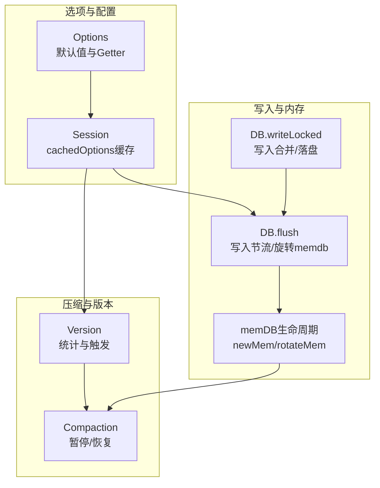
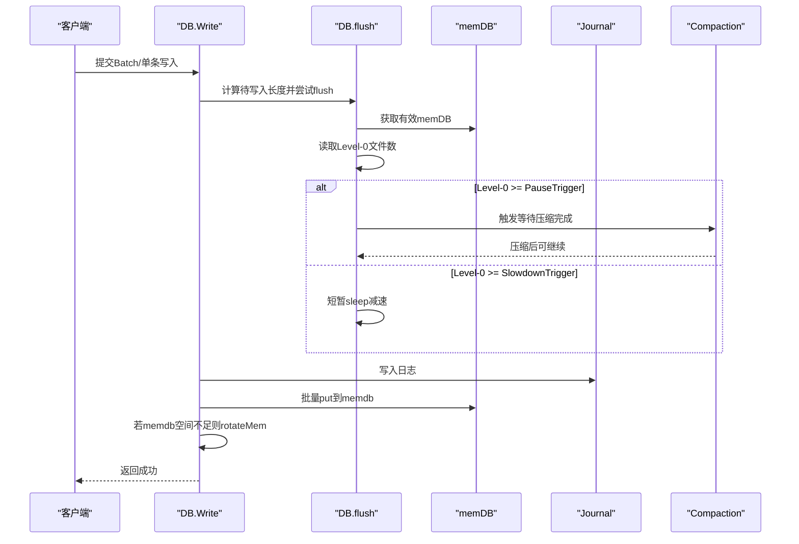
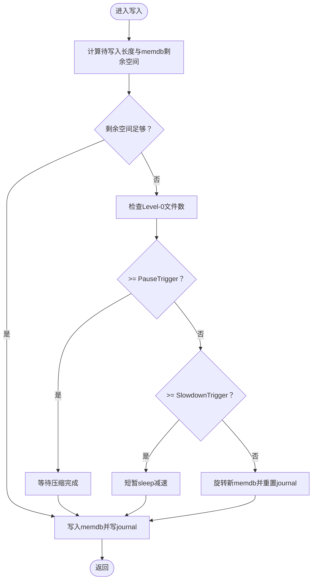
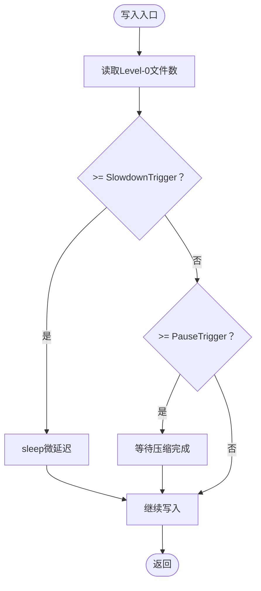
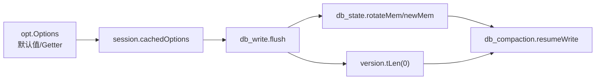

# 内存管理

<cite>
**本文引用的文件**
- [leveldb/opt/options.go](file://leveldb/opt/options.go)
- [leveldb/db_write.go](file://leveldb/db_write.go)
- [leveldb/db_state.go](file://leveldb/db_state.go)
- [leveldb/db_compaction.go](file://leveldb/db_compaction.go)
- [leveldb/version.go](file://leveldb/version.go)
- [leveldb/session.go](file://leveldb/session.go)
- [leveldb/db_test.go](file://leveldb/db_test.go)
</cite>

## 目录
1. [简介](#简介)
2. [项目结构与定位](#项目结构与定位)
3. [核心组件](#核心组件)
4. [架构总览](#架构总览)
5. [详细组件分析](#详细组件分析)
6. [依赖关系分析](#依赖关系分析)
7. [性能考量](#性能考量)
8. [故障排查指南](#故障排查指南)
9. [结论](#结论)
10. [附录：内存使用估算与调优建议](#附录内存使用估算与调优建议)

## 简介
本篇文档聚焦于 avccDB 的内存管理配置，围绕 WriteBuffer、WriteL0PauseTrigger、WriteL0SlowdownTrigger 三个关键参数，系统阐述：
- WriteBuffer 如何控制内存中 memdb 的大小，并影响写入性能与内存占用；
- 当 memdb 达到 WriteBuffer 触发刷新（flush）到 SSTable 的机制；
- WriteL0PauseTrigger 与 WriteL0SlowdownTrigger 如何基于 Level-0 的 SSTable 数量进行写入减速与暂停，以抑制写入放大；
- 针对不同工作负载的内存使用估算方法与调优建议。

## 项目结构与定位
- 内存管理相关的核心配置位于选项模块；写入路径在写入模块中实现；版本与压缩逻辑在版本与压缩模块中体现；会话层负责持久化与缓存选项。
- 关键文件映射：
  - 选项定义与默认值：leveldb/opt/options.go
  - 写入与刷新流程：leveldb/db_write.go
  - memdb 生命周期与池化：leveldb/db_state.go
  - 压缩与写入节流：leveldb/db_compaction.go
  - 版本统计与触发策略：leveldb/version.go
  - 会话与选项缓存：leveldb/session.go
  - 行为验证测试：leveldb/db_test.go

图表来源
- [leveldb/opt/options.go](file://leveldb/opt/options.go#L392-L411)
- [leveldb/session.go](file://leveldb/session.go#L45-L65)
- [leveldb/db_write.go](file://leveldb/db_write.go#L66-L131)
- [leveldb/db_state.go](file://leveldb/db_state.go#L120-L159)
- [leveldb/version.go](file://leveldb/version.go#L656-L695)
- [leveldb/db_compaction.go](file://leveldb/db_compaction.go#L682-L686)

章节来源
- [leveldb/opt/options.go](file://leveldb/opt/options.go#L392-L411)
- [leveldb/session.go](file://leveldb/session.go#L45-L65)

## 核心组件
- WriteBuffer（写缓冲）
  - 定义：memdb 的最大容量阈值，默认值参见选项定义。
  - 影响：决定写入路径何时触发 flush 到磁盘 SSTable；直接影响内存峰值与写放大。
- WriteL0SlowdownTrigger（Level-0 写入减速阈值）
  - 定义：当 Level-0 的 SSTable 数量达到该阈值时，写入开始减速（微延迟）。
- WriteL0PauseTrigger（Level-0 写入暂停阈值）
  - 定义：当 Level-0 的 SSTable 数量达到该阈值时，写入被暂停，直到压缩将 Level-0 文件数降至阈值以下。

章节来源
- [leveldb/opt/options.go](file://leveldb/opt/options.go#L392-L411)

## 架构总览
写入路径在执行前先评估当前 memdb 可用空间与 Level-0 文件数量，必要时进行减速或暂停，随后将批量写入写入 memdb 并同步到日志，最后在满足条件时旋转新的 memdb 并触发压缩。

图表来源
- [leveldb/db_write.go](file://leveldb/db_write.go#L155-L266)
- [leveldb/db_write.go](file://leveldb/db_write.go#L66-L131)
- [leveldb/db_state.go](file://leveldb/db_state.go#L120-L159)
- [leveldb/db_compaction.go](file://leveldb/db_compaction.go#L682-L686)

## 详细组件分析

### WriteBuffer：memdb 大小控制与刷新机制
- 作用
  - 控制 memdb 的容量上限，超过阈值即触发 flush。
  - 默认值在选项中定义，且注释明确指出“可能同时持有两个 memdb”。
- 实现要点
  - 写入前通过 flush 计算待写入长度与 memdb 剩余空间，若剩余不足则尝试旋转新的 memdb 或等待压缩释放空间。
  - recover 过程中，journal 回放到 memdb，当 memdb 的 Size 达到 writeBuffer 时触发 flush。
  - memdb 池化：复用容量等于默认 WriteBuffer 的 memdb，减少频繁分配。

图表来源
- [leveldb/db_write.go](file://leveldb/db_write.go#L66-L131)
- [leveldb/db_write.go](file://leveldb/db_write.go#L155-L266)
- [leveldb/db_state.go](file://leveldb/db_state.go#L120-L159)
- [leveldb/db_state.go](file://leveldb/db_state.go#L83-L96)

章节来源
- [leveldb/opt/options.go](file://leveldb/opt/options.go#L392-L411)
- [leveldb/db_write.go](file://leveldb/db_write.go#L66-L131)
- [leveldb/db_write.go](file://leveldb/db_write.go#L155-L266)
- [leveldb/db_state.go](file://leveldb/db_state.go#L83-L96)
- [leveldb/db_state.go](file://leveldb/db_state.go#L120-L159)

### WriteL0PauseTrigger 与 WriteL0SlowdownTrigger：基于 Level-0 的写入节流
- 作用
  - SlowdownTrigger：当 Level-0 文件数达到该阈值时，写入路径进入微延迟，降低写入速率。
  - PauseTrigger：当 Level-0 文件数达到该阈值时，写入被暂停，等待压缩将 Level-0 文件数降至阈值以下。
- 实现要点
  - flush 中读取 Level-0 文件数并与两个阈值比较，按需减速或暂停。
  - 恢复写入的条件是 resumeWrite 判断 Level-0 文件数低于 PauseTrigger。
  - 版本统计中 Level-0 使用“文件数”作为评分基准，体现对 Level-0 文件数量的敏感性。

图表来源
- [leveldb/db_write.go](file://leveldb/db_write.go#L66-L131)
- [leveldb/db_compaction.go](file://leveldb/db_compaction.go#L682-L686)
- [leveldb/version.go](file://leveldb/version.go#L656-L671)

章节来源
- [leveldb/db_write.go](file://leveldb/db_write.go#L66-L131)
- [leveldb/db_compaction.go](file://leveldb/db_compaction.go#L682-L686)
- [leveldb/version.go](file://leveldb/version.go#L656-L671)

### memdb 生命周期与池化
- 新建与冻结
  - newMem 创建新 memdb 并切换 journal，冻结旧 memdb。
- 旋转与回收
  - rotateMem 在压缩等待后创建新 memdb 并调度压缩。
  - decref 将标准容量 memdb 放回池中，避免频繁分配。
- 池化策略
  - mpoolGet 优先从池中获取容量不小于请求大小的 memdb，否则新建；容量取 max(默认WriteBuffer, 请求大小)。

章节来源
- [leveldb/db_state.go](file://leveldb/db_state.go#L120-L159)
- [leveldb/db_state.go](file://leveldb/db_state.go#L23-L49)
- [leveldb/db_state.go](file://leveldb/db_state.go#L83-L96)

### 选项缓存与默认值
- cachedOptions
  - 会话层将常用选项缓存，避免每次访问重复计算。
- 默认值
  - WriteBuffer 默认值、WriteL0SlowdownTrigger 默认值、WriteL0PauseTrigger 默认值均在选项定义中给出。

章节来源
- [leveldb/session.go](file://leveldb/session.go#L45-L65)
- [leveldb/opt/options.go](file://leveldb/opt/options.go#L392-L411)

### 行为验证与测试
- 测试覆盖
  - 通过测试验证在高写入压力下，Level-0 文件数不会超过 PauseTrigger 加上一个安全余量，从而限制写入放大。
  - 该测试间接验证了 WriteL0PauseTrigger 的作用边界。

章节来源
- [leveldb/db_test.go](file://leveldb/db_test.go#L989-L1039)

## 依赖关系分析
- 写入模块依赖选项模块提供的阈值（WriteBuffer、WriteL0SlowdownTrigger、WriteL0PauseTrigger）。
- flush 依赖版本层的 Level-0 文件计数（tLen(0)）与压缩模块的等待接口。
- memdb 生命周期依赖会话层的存储与比较器，以及压缩模块的调度。

图表来源
- [leveldb/opt/options.go](file://leveldb/opt/options.go#L392-L411)
- [leveldb/session.go](file://leveldb/session.go#L45-L65)
- [leveldb/db_write.go](file://leveldb/db_write.go#L66-L131)
- [leveldb/db_state.go](file://leveldb/db_state.go#L120-L159)
- [leveldb/db_compaction.go](file://leveldb/db_compaction.go#L682-L686)
- [leveldb/version.go](file://leveldb/version.go#L656-L671)

章节来源
- [leveldb/opt/options.go](file://leveldb/opt/options.go#L392-L411)
- [leveldb/db_write.go](file://leveldb/db_write.go#L66-L131)
- [leveldb/db_state.go](file://leveldb/db_state.go#L120-L159)
- [leveldb/db_compaction.go](file://leveldb/db_compaction.go#L682-L686)
- [leveldb/version.go](file://leveldb/version.go#L656-L671)

## 性能考量
- WriteBuffer 对内存峰值与写放大有直接影响
  - 增大 WriteBuffer 可降低 flush 频率，但会提高内存峰值与一次压缩的规模。
  - 减小 WriteBuffer 可降低内存峰值，但会增加 flush 与压缩次数，提升写放大。
- Level-0 文件数控制写入速率
  - SlowdownTrigger 用于平滑写入速率，避免瞬时压力过大。
  - PauseTrigger 用于强制暂停，确保压缩能够跟上写入节奏，防止 Level-0 膨胀导致读放大与写放大。
- 合理设置阈值
  - 需要结合数据分布、写入模式与硬件资源综合权衡。

[本节为通用指导，无需列出具体文件来源]

## 故障排查指南
- 写入明显变慢
  - 检查 Level-0 文件数是否接近或超过 WriteL0SlowdownTrigger，确认是否存在压缩积压。
  - 查看写入延迟统计与暂停标志位，确认是否因 PauseTrigger 导致写入暂停。
- 写入长时间阻塞
  - 确认压缩线程是否正常运行，检查压缩命令通道与错误通道。
  - 观察 resumeWrite 条件是否满足（Level-0 文件数低于 PauseTrigger）。
- 内存占用异常升高
  - 检查 WriteBuffer 设置是否过大，导致 memdb 长期未 flush。
  - 确认 memdb 池化是否生效，避免频繁分配。

章节来源
- [leveldb/db_write.go](file://leveldb/db_write.go#L66-L131)
- [leveldb/db_compaction.go](file://leveldb/db_compaction.go#L682-L686)
- [leveldb/db_state.go](file://leveldb/db_state.go#L23-L49)

## 结论
- WriteBuffer 是控制 memdb 大小与 flush 触发的核心参数，直接影响内存峰值与写放大。
- WriteL0SlowdownTrigger 与 WriteL0PauseTrigger 通过 Level-0 文件数对写入进行动态节流与暂停，是抑制写入放大的关键手段。
- 合理配置三者并结合工作负载特征，可在吞吐、延迟与内存占用之间取得平衡。

[本节为总结性内容，无需列出具体文件来源]

## 附录：内存使用估算与调优建议

- 内存使用估算
  - 估算公式（近似）：
    - 写入阶段内存峰值 ≈ WriteBuffer × 并发 memdb 数量（通常最多 2 个）
    - 压缩阶段内存峰值 ≈ 单次压缩涉及的 Level-0 文件数 × 平均 SSTable 大小（受压缩策略影响）
  - 注意：上述估算未考虑块缓存、迭代器等其他内存占用，实际峰值可能更高。

- 调优建议
  - 高写入吞吐场景
    - 适度增大 WriteBuffer，降低 flush 频率；同时适当提高 PauseTrigger，避免 Level-0 快速膨胀。
  - 内存受限场景
    - 减小 WriteBuffer，降低内存峰值；配合较小的 PauseTrigger，确保压缩及时跟进。
  - 写入压力波动较大
    - 将 SlowdownTrigger 设为略低于 PauseTrigger，使写入在压力上升时先减速，再在接近暂停阈值时暂停，避免抖动。
  - 数据分布高度重叠
    - 可考虑减小 PauseTrigger，缩短压缩窗口，降低 Level-0 文件数带来的读放大风险。

[本节为通用指导，无需列出具体文件来源]