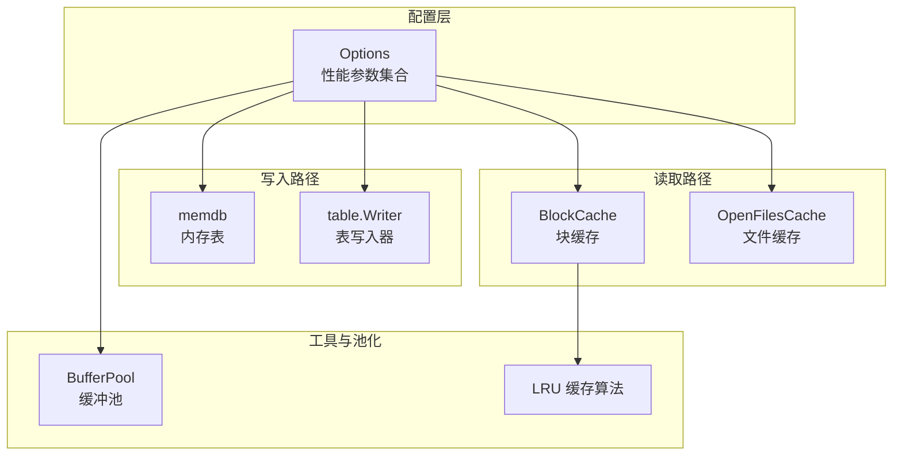
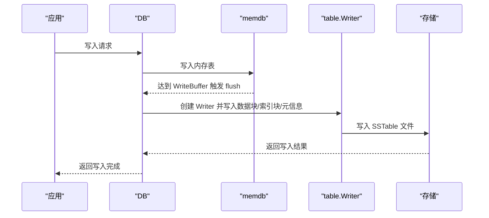
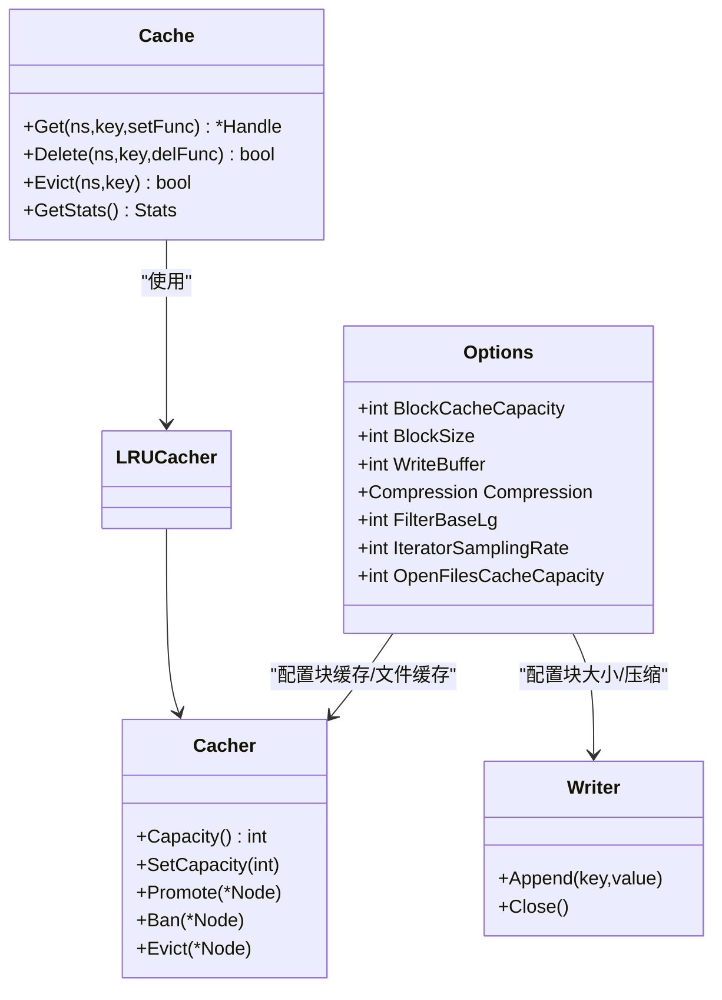

# 性能配置

<cite>
**本文引用的文件**
- [leveldb/opt/options.go](file://leveldb/opt/options.go)
- [leveldb/options.go](file://leveldb/options.go)
- [leveldb/cache/cache.go](file://leveldb/cache/cache.go)
- [leveldb/cache/lru.go](file://leveldb/cache/lru.go)
- [leveldb/table/writer.go](file://leveldb/table/writer.go)
- [leveldb/memdb/memdb.go](file://leveldb/memdb/memdb.go)
- [leveldb/util/buffer_pool.go](file://leveldb/util/buffer_pool.go)
- [leveldb/bench_test.go](file://leveldb/bench_test.go)
- [manualtest/dbstress/main.go](file://manualtest/dbstress/main.go)
- [leveldb/db.go](file://leveldb/db.go)
</cite>

## 目录
1. [简介](#简介)
2. [项目结构与定位](#项目结构与定位)
3. [核心组件与默认值](#核心组件与默认值)
4. [架构总览](#架构总览)
5. [关键性能参数详解](#关键性能参数详解)
6. [依赖关系与耦合分析](#依赖关系与耦合分析)
7. [性能影响与权衡](#性能影响与权衡)
8. [工作负载调优指南](#工作负载调优指南)
9. [内存使用估算与实测数据](#内存使用估算与实测数据)
10. [故障排查与监控](#故障排查与监控)
11. [结论](#结论)

## 简介
本文件聚焦于 avccDB 的性能相关配置，系统性梳理并解释写缓冲区大小（WriteBuffer）、块缓存容量（BlockCacheCapacity）、块大小（BlockSize）、压缩设置（Compression）等关键参数对读写吞吐量、内存使用与 I/O 模式的影响，并给出面向读密集型与写密集型场景的调优建议。同时提供内存使用估算方法与来自基准测试与压力测试的实测参考路径，帮助读者在不同硬件与业务场景下做出合理取舍。

## 项目结构与定位
- 性能配置入口位于选项模块，通过 Options 结构体集中管理各类性能参数。
- 写入路径涉及内存表（memdb）与表写入器（table writer），压缩与块大小直接影响写入阶段的 CPU 与 I/O。
- 读取路径通过块缓存（block cache）与文件缓存（open files cache）提升命中率，降低磁盘访问。
- 基准测试与压力测试提供了可复现实验的脚手架，便于对比不同配置下的性能表现。

图表来源
- [leveldb/opt/options.go](file://leveldb/opt/options.go#L176-L424)
- [leveldb/table/writer.go](file://leveldb/table/writer.go#L148-L489)
- [leveldb/cache/cache.go](file://leveldb/cache/cache.go#L19-L116)
- [leveldb/cache/lru.go](file://leveldb/cache/lru.go#L1-L159)
- [leveldb/util/buffer_pool.go](file://leveldb/util/buffer_pool.go#L1-L135)

章节来源
- [leveldb/opt/options.go](file://leveldb/opt/options.go#L176-L424)

## 核心组件与默认值
以下参数在选项中定义了默认值，可在运行时按需调整以适配不同工作负载：
- 写缓冲区大小（WriteBuffer）：默认 4 MiB
- 块大小（BlockSize）：默认 4 KiB
- 块缓存容量（BlockCacheCapacity）：默认 8 MiB
- 压缩类型（Compression）：默认 Snappy 压缩
- 过滤器基 lg（FilterBaseLg）：默认 11（对应 2 KiB）
- 迭代采样率（IteratorSamplingRate）：默认 1 MiB
- 打开文件缓存容量（OpenFilesCacheCapacity）：默认 500（非 macOS 为 200）

章节来源
- [leveldb/opt/options.go](file://leveldb/opt/options.go#L18-L45)

## 架构总览
从写入到落盘的关键流程如下：
- 应用写入请求进入 DB 层，根据 Options 配置决定是否同步刷盘与合并策略。
- 数据先写入内存表（memdb），当达到 WriteBuffer 上限时触发 flush 到磁盘生成 SSTable。
- 表写入器（table.Writer）按 BlockSize 分块，支持 Snappy 压缩，写入索引块与元信息块。
- 读取时优先命中块缓存（BlockCache），未命中则从磁盘读取并通过过滤器（可选）减少磁盘扫描。

图表来源
- [leveldb/db.go](file://leveldb/db.go#L539-L666)
- [leveldb/memdb/memdb.go](file://leveldb/memdb/memdb.go#L273-L340)
- [leveldb/table/writer.go](file://leveldb/table/writer.go#L148-L489)

## 关键性能参数详解

### 写缓冲区大小（WriteBuffer）
- 定义位置与默认值：参见 Options 中的 WriteBuffer 字段，默认 4 MiB。
- 影响范围：
  - 写入延迟：较大的 WriteBuffer 可减少 flush 次数，但会增加单次 flush 的时间与内存峰值。
  - 内存占用：直接决定 memdb 占用上限，flush 后释放。
  - 写吞吐：在写密集场景适当增大可提升批量写入效率；在内存受限或需要低延迟场景应减小。
- 调整建议：
  - 写密集型：适度增大（如 8–16 MiB）以减少 flush 频率。
  - 低延迟/内存受限：减小（如 2 MiB）以缩短延迟并控制峰值内存。
- 相关实现路径：
  - 获取默认值与校验逻辑：[leveldb/opt/options.go](file://leveldb/opt/options.go#L392-L400)
  - 写入路径中用于判断 flush 的阈值：[leveldb/db.go](file://leveldb/db.go#L539-L666)

章节来源
- [leveldb/opt/options.go](file://leveldb/opt/options.go#L392-L400)
- [leveldb/db.go](file://leveldb/db.go#L539-L666)

### 块缓存容量（BlockCacheCapacity）
- 定义位置与默认值：参见 Options 中的 BlockCacheCapacity 字段，默认 8 MiB。
- 影响范围：
  - 读取命中率：更大的块缓存可显著提升热点数据命中率，降低磁盘 I/O。
  - 内存占用：直接决定块缓存占用上限，配合 LRU 算法淘汰冷数据。
  - 读延迟：命中率提升通常带来更低的平均读延迟。
- 调整建议：
  - 读密集型：增大至 16–64 MiB 或更高，视工作集大小而定。
  - 写密集型：适度降低以腾出内存给写路径或减少碎片。
- 相关实现路径：
  - 默认值与获取逻辑：[leveldb/opt/options.go](file://leveldb/opt/options.go#L186-L201)
  - 缓存接口与 LRU 实现：[leveldb/cache/cache.go](file://leveldb/cache/cache.go#L19-L116), [leveldb/cache/lru.go](file://leveldb/cache/lru.go#L1-L159)

章节来源
- [leveldb/opt/options.go](file://leveldb/opt/options.go#L186-L201)
- [leveldb/cache/cache.go](file://leveldb/cache/cache.go#L19-L116)
- [leveldb/cache/lru.go](file://leveldb/cache/lru.go#L1-L159)

### 块大小（BlockSize）
- 定义位置与默认值：参见 Options 中的 BlockSize 字段，默认 4 KiB。
- 影响范围：
  - 压缩比：较小块可能降低压缩比，较大块有利于压缩但增加单次解压成本。
  - 读放大：更小块意味着更多块头与索引项，但随机读时更易命中。
  - 内存使用：块大小与块缓存容量共同决定缓存节点数量与内存占用。
- 调整建议：
  - 读放大敏感场景：适当增大（如 8–16 KiB）以提高压缩比与减少索引项。
  - 随机读高并发场景：保持默认或略增，避免过大导致单次解压开销过高。
- 相关实现路径：
  - 默认值与获取逻辑：[leveldb/opt/options.go](file://leveldb/opt/options.go#L209-L213)
  - 表写入器按块大小分块与写入：[leveldb/table/writer.go](file://leveldb/table/writer.go#L262-L294)

章节来源
- [leveldb/opt/options.go](file://leveldb/opt/options.go#L209-L213)
- [leveldb/table/writer.go](file://leveldb/table/writer.go#L262-L294)

### 压缩设置（Compression）
- 定义位置与默认值：参见 Options 中的 Compression 字段，默认 Snappy 压缩。
- 影响范围：
  - 存储空间：Snappy 提供较好的压缩比与较低 CPU 开销，适合大多数场景。
  - CPU 使用：压缩/解压带来额外 CPU 开销，读多场景可考虑关闭以换取更低延迟。
  - I/O 带宽：压缩可降低网络/磁盘带宽占用，但会增加 CPU 压力。
- 调整建议：
  - 读密集且对延迟敏感：可考虑关闭压缩（NoCompression）。
  - 写密集或存储带宽紧张：启用 Snappy 压缩。
- 相关实现路径：
  - 默认值与枚举字符串表示：[leveldb/opt/options.go](file://leveldb/opt/options.go#L108-L129)
  - 表写入器中的压缩分支与写入流程：[leveldb/table/writer.go](file://leveldb/table/writer.go#L178-L209)

章节来源
- [leveldb/opt/options.go](file://leveldb/opt/options.go#L108-L129)
- [leveldb/table/writer.go](file://leveldb/table/writer.go#L178-L209)

### 其他与性能相关的参数
- 过滤器基 lg（FilterBaseLg）：默认 11（对应 2 KiB）。影响布隆过滤器粒度与命中率。
- 迭代采样率（IteratorSamplingRate）：默认 1 MiB。用于触发 compaction 的采样间隔。
- 打开文件缓存容量（OpenFilesCacheCapacity）：默认 500（非 macOS 为 200）。影响文件句柄缓存与 I/O 并发。

章节来源
- [leveldb/opt/options.go](file://leveldb/opt/options.go#L413-L424)

## 依赖关系与耦合分析
- Options 作为全局配置入口，被 session 与各子系统读取，用于初始化缓存、表写入器与压缩策略。
- 缓存系统（BlockCache/OpenFilesCache）通过统一的 Cacher 接口抽象，采用 LRU 算法进行淘汰。
- 表写入器（table.Writer）依据 Options 的 BlockSize、Compression 等参数组织数据块与索引块。
- 基准测试与压力测试通过 flag 控制参数，输出关键指标（如块缓存、打开表数、写延迟、IO 统计等）。

图表来源
- [leveldb/opt/options.go](file://leveldb/opt/options.go#L176-L424)
- [leveldb/cache/cache.go](file://leveldb/cache/cache.go#L19-L116)
- [leveldb/cache/lru.go](file://leveldb/cache/lru.go#L1-L159)
- [leveldb/table/writer.go](file://leveldb/table/writer.go#L148-L489)

## 性能影响与权衡
- 写缓冲区大小（WriteBuffer）
  - 增大：减少 flush 次数，提升写吞吐；但单次 flush 时间与内存峰值上升。
  - 减小：降低延迟与峰值内存，但 flush 更频繁，可能影响吞吐。
- 块缓存容量（BlockCacheCapacity）
  - 增大：提升读命中率，降低磁盘 I/O；但占用更多内存。
  - 减小：节省内存，但命中率下降，读放大上升。
- 块大小（BlockSize）
  - 增大：压缩比更好，索引项更少；但单次解压成本更高，随机读命中更困难。
  - 减小：随机读命中更容易，但索引项增多，压缩比下降。
- 压缩（Compression）
  - 启用 Snappy：降低存储与带宽占用，CPU 开销适中。
  - 关闭压缩：降低 CPU 压力，读延迟更低，但占用更多存储与带宽。

章节来源
- [leveldb/opt/options.go](file://leveldb/opt/options.go#L18-L45)
- [leveldb/table/writer.go](file://leveldb/table/writer.go#L178-L209)

## 工作负载调优指南
- 读密集型
  - 增大块缓存容量（BlockCacheCapacity）至 16–64 MiB 或更高。
  - 保持默认块大小（BlockSize）或略增（8–16 KiB）以提升压缩比。
  - 启用 Snappy 压缩（Compression）以降低存储与带宽占用。
  - 若延迟极敏感，可考虑关闭压缩（NoCompression）。
- 写密集型
  - 适度增大写缓冲区（WriteBuffer）至 8–16 MiB 以减少 flush 频率。
  - 保持默认块大小（4 KiB）或略增，避免过大导致单次解压成本过高。
  - 启用 Snappy 压缩以节省存储与带宽。
  - 如内存紧张，可适当降低块缓存容量以腾出内存给写路径。

章节来源
- [leveldb/opt/options.go](file://leveldb/opt/options.go#L18-L45)
- [leveldb/table/writer.go](file://leveldb/table/writer.go#L178-L209)

## 内存使用估算与实测数据
- 内存使用估算
  - 块缓存占用：约 BlockCacheCapacity 大小（受 LRU 淘汰影响）。
  - 写缓冲占用：约 WriteBuffer × 2（同时存在热/冻结 memdb）。
  - 表写入期间临时缓冲：约 BlockSize × N（N 为当前块内条目数），受 BufferPool 影响。
  - 文件缓存占用：约 OpenFilesCacheCapacity × 平均文件句柄大小。
- 实测参考路径
  - 基准测试：提供多种写入/读取/迭代场景的基准，可直接运行对比不同配置。
    - 参考路径：[leveldb/bench_test.go](file://leveldb/bench_test.go#L264-L508)
  - 压力测试：提供可配置的读写并发、事务概率、压缩开关、块缓存开关等参数，输出关键指标（块缓存、打开表数、写延迟、IO 统计等）。
    - 参考路径：[manualtest/dbstress/main.go](file://manualtest/dbstress/main.go#L80-L92), [manualtest/dbstress/main.go](file://manualtest/dbstress/main.go#L392-L467)

章节来源
- [leveldb/bench_test.go](file://leveldb/bench_test.go#L264-L508)
- [manualtest/dbstress/main.go](file://manualtest/dbstress/main.go#L80-L92)
- [manualtest/dbstress/main.go](file://manualtest/dbstress/main.go#L392-L467)

## 故障排查与监控
- 关键监控指标
  - 块缓存统计：可通过属性查询获取当前块缓存大小与命中情况。
    - 参考路径：[leveldb/db.go](file://leveldb/db.go#L1337-L1344)
  - 打开表数与迭代器/快照数量：评估文件句柄与并发读取状态。
    - 参考路径：[leveldb/db.go](file://leveldb/db.go#L1345-L1351)
  - 写延迟与暂停状态：评估写入压力与 compaction 对写入的影响。
    - 参考路径：[leveldb/db.go](file://leveldb/db.go#L1322-L1330)
  - IO 统计：累计读写字节数，辅助评估 I/O 带宽与压缩效果。
    - 参考路径：[leveldb/db.go](file://leveldb/db.go#L1322-L1326)
- 常见问题定位
  - 读延迟升高：检查块缓存命中率与容量是否足够；确认过滤器是否启用。
  - 写延迟升高：检查 WriteBuffer 是否过小导致频繁 flush；观察写延迟与暂停状态。
  - 存储占用偏高：评估是否启用了压缩；适当增大块大小以提升压缩比。

章节来源
- [leveldb/db.go](file://leveldb/db.go#L1322-L1351)

## 结论
通过对 avccDB 性能配置的系统梳理，可以得出以下结论：
- 写缓冲区、块缓存与块大小是影响吞吐与延迟的核心参数；压缩在存储带宽与 CPU 开销之间提供平衡点。
- 不同工作负载应采用差异化策略：读密集型侧重提升块缓存与压缩比，写密集型侧重减少 flush 频率与控制内存峰值。
- 建议结合基准测试与压力测试持续验证配置效果，并通过内置属性查询与统计接口进行实时监控与优化。