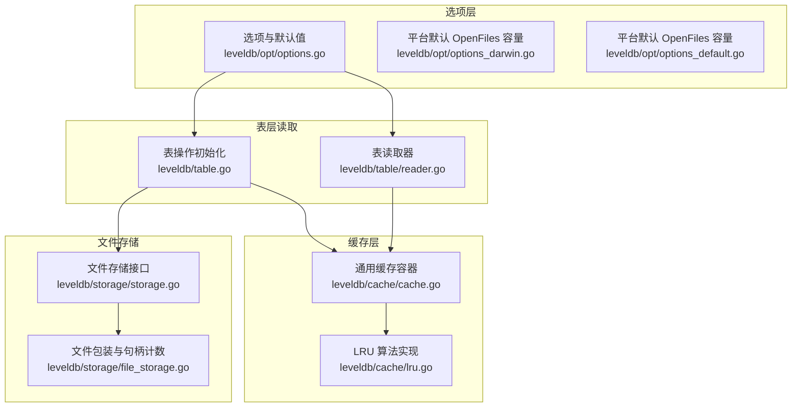
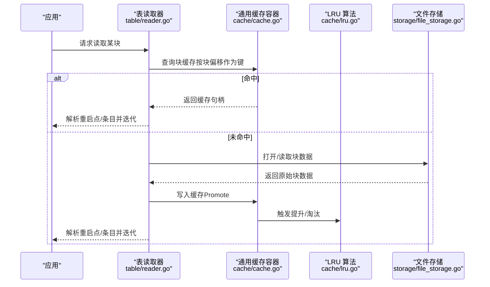
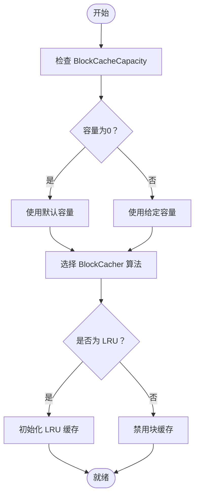
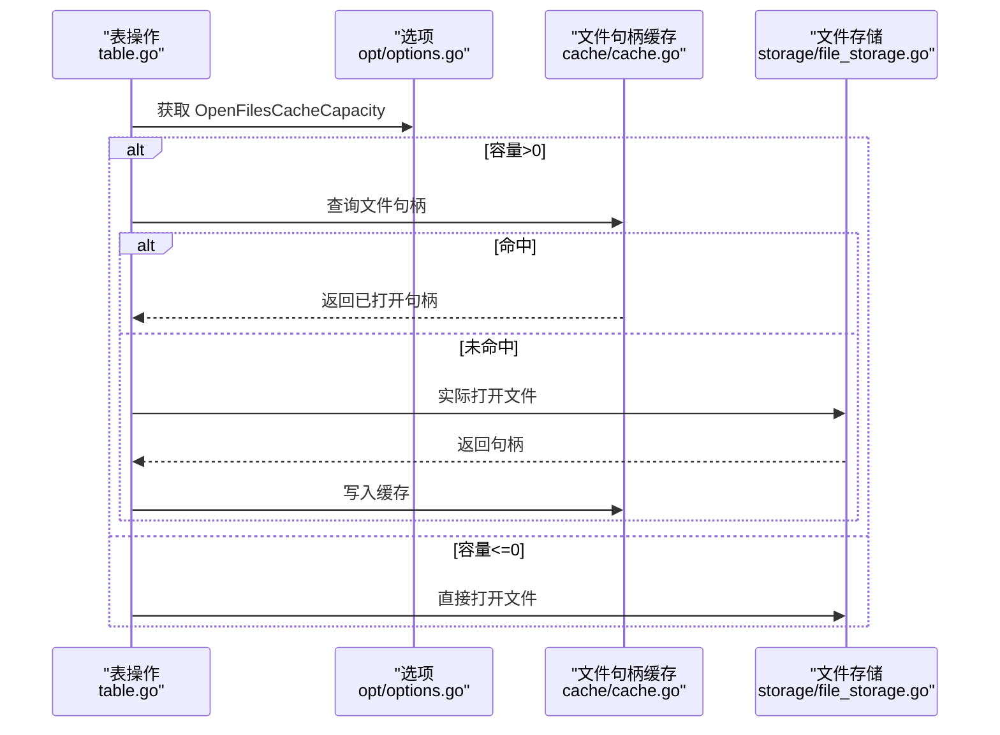
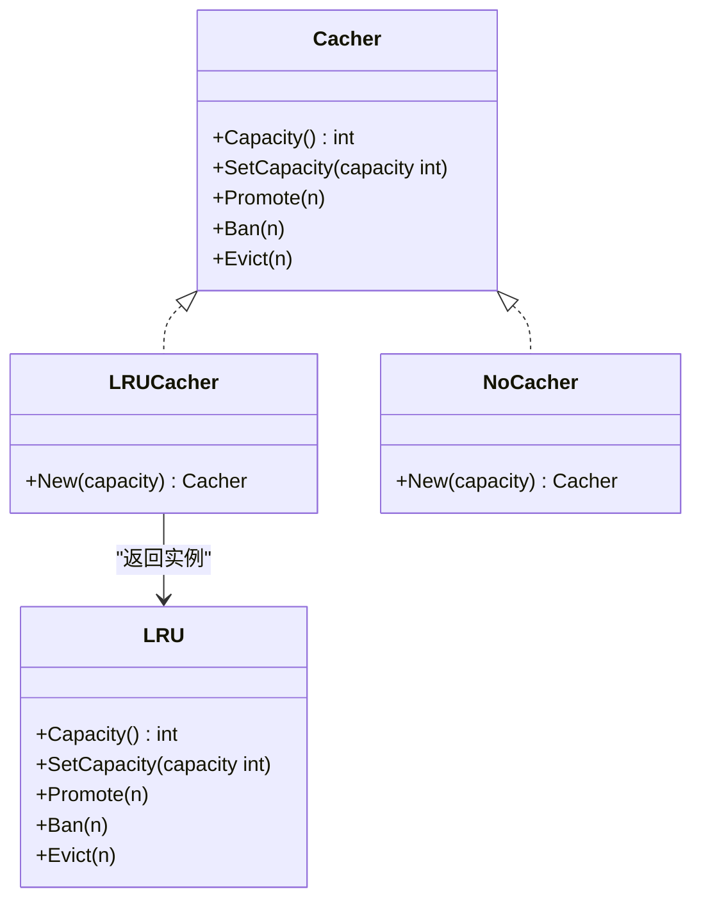
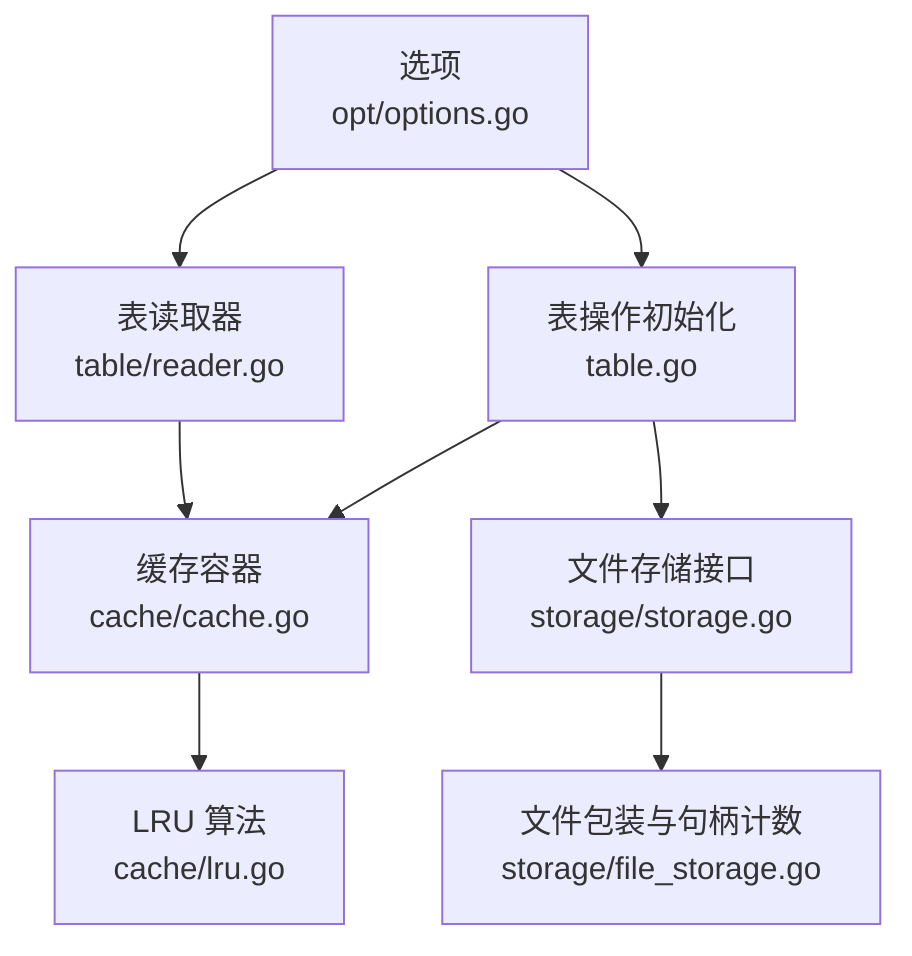

# 缓存策略

<cite>
**本文引用的文件**
- [leveldb/cache/cache.go](file://leveldb/cache/cache.go)
- [leveldb/cache/lru.go](file://leveldb/cache/lru.go)
- [leveldb/opt/options.go](file://leveldb/opt/options.go)
- [leveldb/opt/options_darwin.go](file://leveldb/opt/options_darwin.go)
- [leveldb/opt/options_default.go](file://leveldb/opt/options_default.go)
- [leveldb/table/reader.go](file://leveldb/table/reader.go)
- [leveldb/table.go](file://leveldb/table.go)
- [leveldb/storage/file_storage.go](file://leveldb/storage/file_storage.go)
- [leveldb/storage/storage.go](file://leveldb/storage/storage.go)
</cite>

## 目录
1. [简介](#简介)
2. [项目结构与定位](#项目结构与定位)
3. [核心组件](#核心组件)
4. [架构总览](#架构总览)
5. [详细组件分析](#详细组件分析)
6. [依赖关系分析](#依赖关系分析)
7. [性能考量](#性能考量)
8. [故障排查指南](#故障排查指南)
9. [结论](#结论)
10. [附录：配置示例与最佳实践](#附录配置示例与最佳实践)

## 简介
本文件围绕 avccDB 的缓存策略进行系统化说明，重点覆盖以下方面：
- BlockCacheCapacity 与 BlockCacher：如何影响 SSTable 数据块的缓存效率与读取性能
- OpenFilesCacheCapacity：如何控制“已打开文件句柄”的缓存，降低文件系统开销
- LRUCacher 与 NoCacher：缓存算法选择及对性能的影响
- 共享缓存配置示例与多实例部署最佳实践

目标是帮助读者在不同工作负载下，合理配置缓存参数以获得稳定且高效的读取性能。

## 项目结构与定位
- 缓存接口与实现位于 leveldb/cache，包含通用缓存容器与 LRU 算法实现
- 选项定义位于 leveldb/opt，包含默认值、容量与算法选择项
- 表层读取逻辑位于 leveldb/table，负责将块级数据从磁盘读取并按需写入块缓存
- 文件存储层位于 leveldb/storage，负责文件打开/关闭与句柄计数，支撑“打开文件句柄”缓存

图表来源
- [leveldb/cache/cache.go](file://leveldb/cache/cache.go#L1-L120)
- [leveldb/cache/lru.go](file://leveldb/cache/lru.go#L1-L159)
- [leveldb/opt/options.go](file://leveldb/opt/options.go#L1-L120)
- [leveldb/opt/options_darwin.go](file://leveldb/opt/options_darwin.go#L1-L8)
- [leveldb/opt/options_default.go](file://leveldb/opt/options_default.go#L1-L8)
- [leveldb/table/reader.go](file://leveldb/table/reader.go#L568-L714)
- [leveldb/table.go](file://leveldb/table.go#L537-L565)
- [leveldb/storage/storage.go](file://leveldb/storage/storage.go#L157-L188)
- [leveldb/storage/file_storage.go](file://leveldb/storage/file_storage.go#L473-L517)

章节来源
- [leveldb/cache/cache.go](file://leveldb/cache/cache.go#L1-L120)
- [leveldb/cache/lru.go](file://leveldb/cache/lru.go#L1-L159)
- [leveldb/opt/options.go](file://leveldb/opt/options.go#L1-L120)
- [leveldb/opt/options_darwin.go](file://leveldb/opt/options_darwin.go#L1-L8)
- [leveldb/opt/options_default.go](file://leveldb/opt/options_default.go#L1-L8)
- [leveldb/table/reader.go](file://leveldb/table/reader.go#L568-L714)
- [leveldb/table.go](file://leveldb/table.go#L537-L565)
- [leveldb/storage/storage.go](file://leveldb/storage/storage.go#L157-L188)
- [leveldb/storage/file_storage.go](file://leveldb/storage/file_storage.go#L473-L517)

## 核心组件
- 通用缓存容器（Cache）：提供键空间隔离的缓存映射，支持并发安全访问，并通过 Cacher 接口驱动具体算法（如 LRU）
- LRU 算法（LRU）：基于双向链表维护最近使用顺序，按容量上限淘汰最久未使用项
- 选项系统（Options）：集中管理缓存相关参数，包括 BlockCacher、BlockCacheCapacity、OpenFilesCacher、OpenFilesCacheCapacity 等
- 表读取器（Table Reader）：在读取 SSTable 块时，按需从缓存获取或填充缓存；同时支持按需校验校验和与解压
- 文件存储（File Storage）：封装文件打开/关闭与句柄计数，支撑“打开文件句柄”缓存

章节来源
- [leveldb/cache/cache.go](file://leveldb/cache/cache.go#L19-L60)
- [leveldb/cache/lru.go](file://leveldb/cache/lru.go#L41-L159)
- [leveldb/opt/options.go](file://leveldb/opt/options.go#L176-L206)
- [leveldb/opt/options.go](file://leveldb/opt/options.go#L372-L382)
- [leveldb/table/reader.go](file://leveldb/table/reader.go#L624-L714)
- [leveldb/storage/file_storage.go](file://leveldb/storage/file_storage.go#L473-L517)

## 架构总览
下面的序列图展示了“读取 SSTable 数据块”的关键流程，以及缓存参与的时机：

图表来源
- [leveldb/table/reader.go](file://leveldb/table/reader.go#L624-L714)
- [leveldb/cache/cache.go](file://leveldb/cache/cache.go#L464-L518)
- [leveldb/cache/lru.go](file://leveldb/cache/lru.go#L82-L116)
- [leveldb/storage/file_storage.go](file://leveldb/storage/file_storage.go#L473-L517)

章节来源
- [leveldb/table/reader.go](file://leveldb/table/reader.go#L624-L714)
- [leveldb/cache/cache.go](file://leveldb/cache/cache.go#L464-L518)
- [leveldb/cache/lru.go](file://leveldb/cache/lru.go#L82-L116)
- [leveldb/storage/file_storage.go](file://leveldb/storage/file_storage.go#L473-L517)

## 详细组件分析

### BlockCacheCapacity 与 BlockCacher
- BlockCacheCapacity：定义块缓存的容量上限（字节）。当设置为负值时，行为等同于禁用块缓存；当为 0 时采用默认值
- BlockCacher：指定块缓存使用的算法，默认为 LRU；也可选择 NoCacher 来完全禁用缓存
- 工作机制：
  - 表读取器在读取块时，先尝试从缓存获取；若未命中，则从文件系统读取并调用缓存的 Promote 进行插入
  - LRU 算法根据当前使用量与容量上限进行淘汰，确保缓存占用不超过设定阈值
- 性能影响：
  - 合理增大容量可提高热点块命中率，降低磁盘 IO；但过大会增加内存占用
  - 若热点数据分布不均，建议结合业务特征调整容量与算法

图表来源
- [leveldb/opt/options.go](file://leveldb/opt/options.go#L185-L206)
- [leveldb/opt/options.go](file://leveldb/opt/options.go#L433-L447)
- [leveldb/table.go](file://leveldb/table.go#L544-L553)
- [leveldb/cache/lru.go](file://leveldb/cache/lru.go#L153-L159)

章节来源
- [leveldb/opt/options.go](file://leveldb/opt/options.go#L185-L206)
- [leveldb/opt/options.go](file://leveldb/opt/options.go#L433-L447)
- [leveldb/table.go](file://leveldb/table.go#L544-L553)
- [leveldb/cache/lru.go](file://leveldb/cache/lru.go#L153-L159)

### OpenFilesCacheCapacity 与打开文件句柄缓存
- OpenFilesCacheCapacity：定义“已打开文件句柄”的缓存容量（数量）。当设置为负值时，行为等同于禁用该缓存；当为 0 时采用平台默认值
- 平台默认值：
  - macOS：200
  - 非 macOS：500
- 工作机制：
  - 表层操作在打开 SSTable 文件时，优先从“打开文件句柄缓存”中复用；若未命中则实际打开文件并加入缓存
  - 文件存储层维护一个打开文件计数，用于统计与日志提示
- 性能影响：
  - 合理的句柄缓存可显著减少频繁打开/关闭文件带来的系统调用与上下文切换开销
  - 在高并发、大量小文件场景下尤为有效

图表来源
- [leveldb/table.go](file://leveldb/table.go#L537-L565)
- [leveldb/opt/options.go](file://leveldb/opt/options.go#L372-L382)
- [leveldb/opt/options_darwin.go](file://leveldb/opt/options_darwin.go#L1-L8)
- [leveldb/opt/options_default.go](file://leveldb/opt/options_default.go#L1-L8)
- [leveldb/cache/cache.go](file://leveldb/cache/cache.go#L464-L518)
- [leveldb/storage/file_storage.go](file://leveldb/storage/file_storage.go#L473-L517)

章节来源
- [leveldb/table.go](file://leveldb/table.go#L537-L565)
- [leveldb/opt/options.go](file://leveldb/opt/options.go#L372-L382)
- [leveldb/opt/options_darwin.go](file://leveldb/opt/options_darwin.go#L1-L8)
- [leveldb/opt/options_default.go](file://leveldb/opt/options_default.go#L1-L8)
- [leveldb/cache/cache.go](file://leveldb/cache/cache.go#L464-L518)
- [leveldb/storage/file_storage.go](file://leveldb/storage/file_storage.go#L473-L517)

### LRUCacher 与 NoCacher
- LRUCacher：基于 LRU 的缓存算法，适合大多数随机访问场景，命中率稳定
- NoCacher：禁用缓存，适用于极低内存环境或写密集型场景，避免缓存抖动
- 选择建议：
  - 读多写少、热点明显：优先 LRUCacher
  - 内存受限或写多读少：可考虑 NoCacher 或缩小容量
  - 多实例共享：通过共享缓存实例实现跨实例复用

图表来源
- [leveldb/opt/options.go](file://leveldb/opt/options.go#L47-L106)
- [leveldb/cache/lru.go](file://leveldb/cache/lru.go#L41-L159)

章节来源
- [leveldb/opt/options.go](file://leveldb/opt/options.go#L47-L106)
- [leveldb/cache/lru.go](file://leveldb/cache/lru.go#L41-L159)

### 读取路径中的缓存参与点
- 块缓存参与点：
  - 读取块时，先查询缓存；未命中则从文件系统读取并写入缓存
  - 支持按需校验校验和与解压
- 文件句柄缓存参与点：
  - 打开 SSTable 文件时，优先从缓存复用；否则实际打开并加入缓存

章节来源
- [leveldb/table/reader.go](file://leveldb/table/reader.go#L624-L714)
- [leveldb/table.go](file://leveldb/table.go#L537-L565)

## 依赖关系分析
- 选项层决定缓存策略与容量
- 表层读取器依赖缓存容器与算法实现
- 文件存储层提供底层文件句柄能力，支撑“打开文件句柄”缓存

图表来源
- [leveldb/opt/options.go](file://leveldb/opt/options.go#L176-L206)
- [leveldb/opt/options.go](file://leveldb/opt/options.go#L372-L382)
- [leveldb/table.go](file://leveldb/table.go#L537-L565)
- [leveldb/table/reader.go](file://leveldb/table/reader.go#L624-L714)
- [leveldb/cache/cache.go](file://leveldb/cache/cache.go#L19-L60)
- [leveldb/cache/lru.go](file://leveldb/cache/lru.go#L41-L159)
- [leveldb/storage/storage.go](file://leveldb/storage/storage.go#L157-L188)
- [leveldb/storage/file_storage.go](file://leveldb/storage/file_storage.go#L473-L517)

章节来源
- [leveldb/opt/options.go](file://leveldb/opt/options.go#L176-L206)
- [leveldb/opt/options.go](file://leveldb/opt/options.go#L372-L382)
- [leveldb/table.go](file://leveldb/table.go#L537-L565)
- [leveldb/table/reader.go](file://leveldb/table/reader.go#L624-L714)
- [leveldb/cache/cache.go](file://leveldb/cache/cache.go#L19-L60)
- [leveldb/cache/lru.go](file://leveldb/cache/lru.go#L41-L159)
- [leveldb/storage/storage.go](file://leveldb/storage/storage.go#L157-L188)
- [leveldb/storage/file_storage.go](file://leveldb/storage/file_storage.go#L473-L517)

## 性能考量
- 块缓存容量与命中率：容量越大通常命中率越高，但内存占用也越高。建议结合热点数据大小与访问模式进行调优
- LRU 淘汰策略：在容量超限时按“最近最少使用”淘汰，适合随机访问；若存在明显的冷热分层，可考虑更保守的容量或禁用缓存
- 打开文件句柄缓存：减少频繁打开/关闭文件的系统调用，尤其在高并发与大量小文件场景下收益明显
- 平台差异：macOS 默认打开文件句柄缓存容量较低，非 macOS 较高，应结合实际部署环境调整

## 故障排查指南
- 读取性能异常下降
  - 检查 BlockCacheCapacity 是否过小导致命中率过低
  - 检查是否误用了 NoCacher 导致缓存被禁用
- 内存占用过高
  - 适当降低 BlockCacheCapacity 或启用更保守的算法策略
  - 关注 LRU 使用量与淘汰频率（可通过缓存统计接口观察）
- 文件句柄过多或频繁打开/关闭
  - 提升 OpenFilesCacheCapacity，或确认平台默认值是否满足需求
  - 检查文件存储层的打开计数与日志输出

章节来源
- [leveldb/cache/cache.go](file://leveldb/cache/cache.go#L424-L437)
- [leveldb/opt/options.go](file://leveldb/opt/options.go#L372-L382)
- [leveldb/opt/options_darwin.go](file://leveldb/opt/options_darwin.go#L1-L8)
- [leveldb/opt/options_default.go](file://leveldb/opt/options_default.go#L1-L8)
- [leveldb/storage/file_storage.go](file://leveldb/storage/file_storage.go#L565-L582)

## 结论
- BlockCacheCapacity 与 BlockCacher 是影响 SSTable 数据块读取性能的关键因素，应结合业务特征与硬件资源进行权衡
- OpenFilesCacheCapacity 对文件系统开销有直接影响，建议在高并发与小文件场景下适度提升
- LRUCacher 适合大多数随机访问场景，NoCacher 适合内存受限或写密集场景
- 通过共享缓存实例可在多实例间复用缓存，进一步提升整体命中率与资源利用率

## 附录：配置示例与最佳实践
- 示例一：启用块缓存（LRU），容量为 8MiB
  - 设置 BlockCacher 为 LRUCacher，BlockCacheCapacity 为 8MiB
  - 适用于一般读多写少场景
- 示例二：禁用块缓存
  - 将 BlockCacher 设为 NoCacher 或 BlockCacheCapacity 设为 0（等效禁用）
  - 适用于内存极度受限或写多读少场景
- 示例三：共享缓存（跨实例）
  - 创建共享的 LRU 缓存实例，分别赋给多个 DB 实例的 BlockCacher 与 OpenFilesCacher
  - 有助于在多实例间最大化命中率与减少重复内存占用
- 最佳实践
  - 读多写少：优先启用块缓存（LRU），容量适中；提升 OpenFilesCacheCapacity
  - 写多读少：考虑禁用块缓存或减小容量；保持合理的打开文件句柄缓存
  - 多实例部署：使用共享缓存实例，统一容量与算法，便于运维与观测
  - 平台差异：macOS 默认打开文件句柄缓存较小，需根据实际并发与文件规模调优

章节来源
- [leveldb/opt/options.go](file://leveldb/opt/options.go#L75-L94)
- [leveldb/opt/options.go](file://leveldb/opt/options.go#L185-L206)
- [leveldb/opt/options.go](file://leveldb/opt/options.go#L372-L382)
- [leveldb/table.go](file://leveldb/table.go#L537-L565)