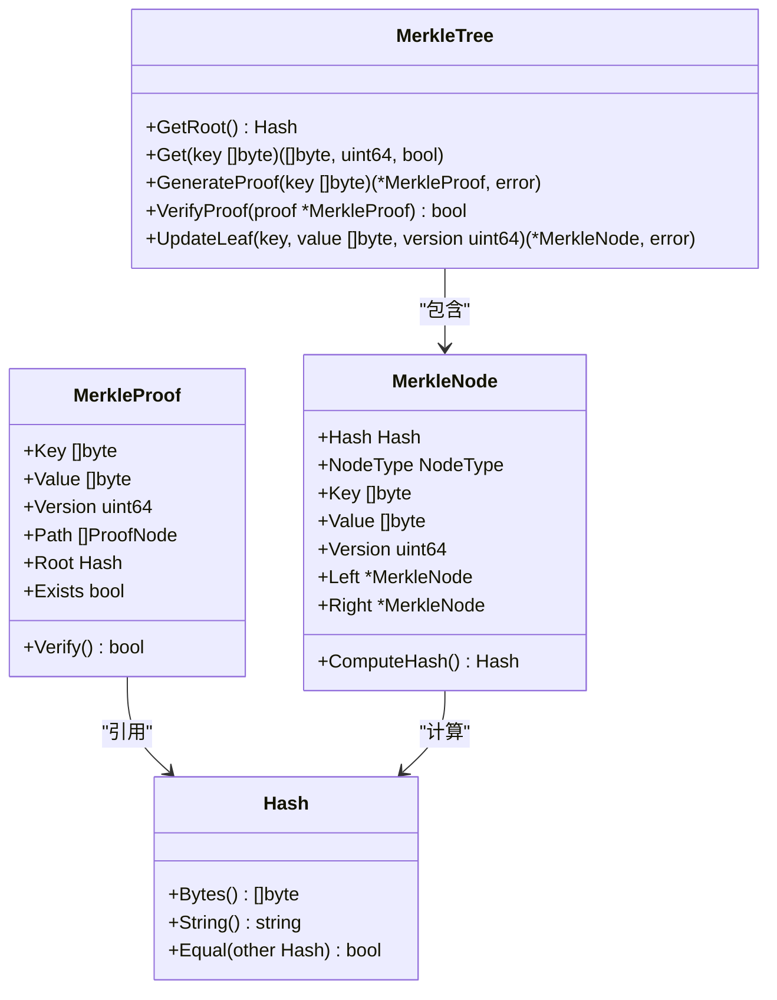

# 配置选项接口

<cite>
**本文档中引用的文件**  
- [options.go](file://leveldb\opt\options.go)
- [options_default.go](file://leveldb\opt\options_default.go)
- [options_darwin.go](file://leveldb\opt\options_darwin.go)
- [options.go](file://leveldb\options.go)
- [db.go](file://leveldb\db.go)
- [session.go](file://leveldb\session.go)
- [merkle\tree.go](file://leveldb\merkle\tree.go)
- [merkle\node.go](file://leveldb\merkle\node.go)
- [merkle\hash.go](file://leveldb\merkle\hash.go)
- [merkle\errors.go](file://leveldb\merkle\errors.go)
- [memdb\memdb_merkle.go](file://leveldb\memdb\memdb_merkle.go)
</cite>

## 目录
1. [简介](#简介)
2. [核心配置参数](#核心配置参数)
3. [Merkle树安全配置](#merkle树安全配置)
4. [配置继承与默认值](#配置继承与默认值)
5. [配置验证与错误处理](#配置验证与错误处理)
6. [性能调优指南](#性能调优指南)
7. [生产环境最佳实践](#生产环境最佳实践)

## 简介
avccDB的配置选项系统通过`Options`结构体提供全面的数据库行为控制。该系统允许开发者精细调整数据库的性能、安全性和资源使用。配置选项涵盖了从基本的数据库路径到高级的压缩设置和Merkle树验证等各个方面。本API参考文档详细说明了所有可配置参数，包括它们的作用、合理取值范围、对性能的影响以及在不同工作负载下的配置建议。

## 核心配置参数

### 数据库路径与文件管理
- **ErrorIfExist**: 当数据库已存在时是否返回错误。默认值为`false`，允许打开现有数据库。
- **ErrorIfMissing**: 当数据库不存在时是否返回错误。默认值为`false`，如果数据库不存在则自动创建。
- **ReadOnly**: 是否以只读模式打开数据库。默认值为`false`。

### 缓存配置
- **BlockCacher**: 用于'排序表'块缓存的缓存算法。默认值为`LRUCacher`，表示使用LRU（最近最少使用）缓存算法。
- **BlockCacheCapacity**: '排序表'块缓存的容量。默认值为8MiB。
- **DisableBlockCache**: 是否禁用'排序表'块的缓存功能。默认值为`false`。
- **OpenFilesCacher**: 用于打开文件缓存的缓存算法。默认值为`LRUCacher`。
- **OpenFilesCacheCapacity**: 打开文件缓存的容量。在macOS上默认值为200，在其他系统上默认值为500。

### 写缓冲区配置
- **WriteBuffer**: 在刷新到'排序表'之前，'memdb'（内存数据库）的最大大小。默认值为4MiB。LevelDB可能同时持有最多两个'memdb'。
- **WriteL0PauseTrigger**: 触发写入暂停的level-0中'排序表'的数量。默认值为12。
- **WriteL0SlowdownTrigger**: 触发写入减速的level-0中'排序表'的数量。默认值为8。

### 压缩设置
- **Compression**: '排序表'块使用的压缩算法。默认值为`SnappyCompression`，使用Snappy压缩。
- **DisableBufferPool**: 是否禁用`util.BufferPool`功能。默认值为`false`。

### 压缩与表大小配置
- **CompactionTableSize**: 压缩生成的'排序表'的大小限制。默认值为2MiB。
- **CompactionTableSizeMultiplier**: `CompactionTableSize`的乘数。默认值为1.0。
- **CompactionTotalSize**: 每个级别的'排序表'总大小限制。默认值为10MiB。
- **CompactionTotalSizeMultiplier**: `CompactionTotalSize`的乘数。默认值为10.0。

### 其他性能相关配置
- **BlockSize**: 每个'排序表'块的最小未压缩大小（字节）。默认值为4KiB。
- **BlockRestartInterval**: 键的增量编码的重启点之间的键数。默认值为16。
- **IteratorSamplingRate**: 迭代器读取采样的近似间隔（字节）。默认值为1MiB。
- **MaxManifestFileSize**: MANIFEST-******文件的最大大小限制。默认值为64MiB。

**Section sources**
- [options.go](file://leveldb\opt\options.go#L177-L424)

## Merkle树安全配置

### 严格性级别配置
`Strict`字段定义了数据库的严格级别，对Merkle树验证和数据完整性检查至关重要。这些标志可以组合使用，以实现不同级别的数据安全保证。

- **StrictManifest**: 如果存在，则清单日志中的损坏或无效块或块将导致错误而不是被丢弃。这将防止具有损坏清单的数据库被打开。
- **StrictJournalChecksum**: 如果存在，则会验证日志块的校验和。
- **StrictJournal**: 如果存在，则日志中的损坏或无效块将导致错误而不是被丢弃。这将防止具有损坏日志的数据库被打开。
- **StrictBlockChecksum**: 如果存在，则会验证'排序表'块的校验和。这对读取操作和压缩都有影响。
- **StrictCompaction**: 如果存在，则损坏的'排序表'将导致压缩失败。数据库将进入只读模式。
- **StrictReader**: 如果存在，则损坏的'排序表'将中断读取操作。
- **StrictRecovery**: 仅适用于`leveldb.Recover`，如果存在，则会丢弃损坏的'排序表'。
- **StrictOverride**: 仅适用于`ReadOptions`，如果存在，则此`ReadOptions`的'严格级别'将覆盖全局设置。

默认的严格级别（`DefaultStrict`）包括`StrictJournalChecksum`、`StrictBlockChecksum`、`StrictCompaction`和`StrictReader`，提供了平衡的安全性和性能。

### Merkle树验证机制
avccDB集成了Merkle树来增强数据完整性验证。Merkle树的根哈希（MasterRoot）聚合了所有级别的状态，为整个数据库提供了一个密码学承诺。

- **MasterRoot**: 在`DB`结构体中维护，通过`AggregateRoots`函数计算，该函数将所有级别的Merkle根哈希聚合为一个主根哈希。
- **Proof Generation**: `MerkleTree`结构体的`GenerateProof`方法可以为任何键生成Merkle证明，证明其存在性或不存在性。
- **Proof Verification**: `MerkleProof`结构体的`Verify`方法可以验证证明的有效性，确保数据未被篡改。

**Diagram sources**
- [merkle\tree.go](file://leveldb\merkle\tree.go#L10-L285)
- [merkle\node.go](file://leveldb\merkle\node.go#L22-L96)
- [merkle\hash.go](file://leveldb\merkle\hash.go#L16-L48)

**Section sources**
- [options.go](file://leveldb\opt\options.go#L130-L174)
- [db.go](file://leveldb\db.go#L89-L92)
- [merkle\tree.go](file://leveldb\merkle\tree.go#L10-L285)

## 配置继承与默认值

### 配置继承机制
avccDB的配置系统支持继承和覆盖。`Options`结构体中的每个字段都有一个对应的`Get`方法（例如`GetBlockCacheCapacity`），这些方法实现了继承逻辑：

1.  **优先使用用户配置**: 如果用户在`Options`结构体中设置了某个值（非零或非nil），则使用该值。
2.  **回退到默认值**: 如果用户未设置，则使用预定义的默认值（如`DefaultBlockCacheCapacity`）。
3.  **特殊处理**: 对于某些字段（如负值），有特殊的处理逻辑（例如，`GetBlockCacheCapacity`中负值被视为0）。

这种机制确保了配置的灵活性和健壮性。

### 默认值设置
默认值在`opt`包中定义，部分默认值根据操作系统有所不同：

- **DefaultBlockCacheCapacity**: 8 * MiB
- **DefaultWriteBuffer**: 4 * MiB
- **DefaultCompactionTableSize**: 2 * MiB
- **DefaultOpenFilesCacheCapacity**: 在macOS上为200，在其他系统上为500。

这些默认值是经过精心选择的，旨在为大多数工作负载提供良好的性能起点。

**Section sources**
- [options.go](file://leveldb\opt\options.go#L440-L447)
- [options_default.go](file://leveldb\opt\options_default.go#L7)
- [options_darwin.go](file://leveldb\opt\options_darwin.go#L7)
- [options.go](file://leveldb\options.go#L14-L22)

## 配置验证与错误处理

### 配置验证
系统在打开数据库时会进行严格的配置验证：

- **清单验证**: 在`session.recover()`中，会检查清单（MANIFEST）文件的完整性，包括比较器名称、下一个文件号、日志文件号和序列号。
- **严格性检查**: 根据`Strict`标志，系统会验证日志校验和、块校验和等，任何不匹配都会导致错误。
- **Merkle树验证**: 在读取操作中，可以通过`StrictReader`标志验证Merkle树的完整性。

### 错误处理
当配置或数据验证失败时，系统会返回特定的错误：

- **ErrCorrupted**: 当检测到数据库损坏时返回。
- **ErrManifestCorrupted**: 当清单文件损坏时返回。
- **ErrInvalidProof**: 当Merkle证明验证失败时返回。
- **ErrEmptyTree**: 当在空的Merkle树上操作时返回。

开发者应使用`errors.IsCorrupted()`等函数来检查错误类型，并根据需要进行恢复。

**Section sources**
- [session.go](file://leveldb\session.go#L190-L200)
- [options.go](file://leveldb\opt\options.go#L659-L664)
- [merkle\errors.go](file://leveldb\merkle\errors.go#L10-L31)

## 性能调优指南

### 不同工作负载的配置建议

#### 高写入吞吐量工作负载
- **增加WriteBuffer**: 将`WriteBuffer`增加到8-16MiB，以减少内存数据库刷新到磁盘的频率。
- **调整Compaction参数**: 增加`CompactionTableSize`和`CompactionTotalSize`，以减少压缩的频率。
- **禁用CompactionBackoff**: 设置`DisableCompactionBackoff`为`true`，以避免因压缩而延迟写入。

#### 高读取吞吐量工作负载
- **增加BlockCacheCapacity**: 将`BlockCacheCapacity`增加到64MiB或更高，以提高缓存命中率。
- **优化BlockSize**: 根据典型读取大小调整`BlockSize`，对于大值读取，可以增加块大小。
- **启用Filter**: 使用`Filter`字段配置布隆过滤器，以减少不必要的磁盘I/O。

#### 低延迟工作负载
- **减少WriteL0PauseTrigger**: 将`WriteL0PauseTrigger`降低到8，以更早地触发压缩，保持level-0较小。
- **启用NoSync**: 在可以接受数据丢失风险的情况下，设置`NoSync`为`true`，以避免fsync调用。
- **优化OpenFilesCacheCapacity**: 确保`OpenFilesCacheCapacity`足够大，以避免频繁打开和关闭文件。

### Merkle树性能考虑
- **证明生成**: Merkle证明的生成时间与树的高度成正比，通常为O(log n)。对于大型数据库，这仍然是高效的。
- **验证开销**: 证明验证涉及少量哈希计算，开销非常低。
- **更新成本**: 更新Merkle树需要重建受影响的子树，成本较高。因此，Merkle树更适合读多写少的场景。

**Section sources**
- [options.go](file://leveldb\opt\options.go#L177-L424)
- [memdb\memdb_merkle.go](file://leveldb\memdb\memdb_merkle.go#L63-L180)

## 生产环境最佳实践

1.  **启用严格模式**: 在生产环境中，强烈建议使用`DefaultStrict`或更严格的设置，以确保数据完整性。
2.  **监控Merkle根哈希**: 定期记录和监控`MasterRoot`，任何意外的变化都可能是数据损坏或篡改的迹象。
3.  **合理配置缓存**: 根据可用内存和工作负载特征，仔细调整`BlockCacheCapacity`和`OpenFilesCacheCapacity`。
4.  **定期备份**: 即使有Merkle树保护，也应定期备份数据库文件。
5.  **压力测试**: 在部署前，使用`manualtest/dbstress`等工具对配置进行压力测试。
6.  **日志监控**: 启用并监控数据库日志，以便及时发现潜在问题。

遵循这些最佳实践可以确保avccDB在生产环境中稳定、安全、高效地运行。

**Section sources**
- [options.go](file://leveldb\opt\options.go#L169-L174)
- [db.go](file://leveldb\db.go#L169)
- [merkle\hash.go](file://leveldb\merkle\hash.go#L127-L152)