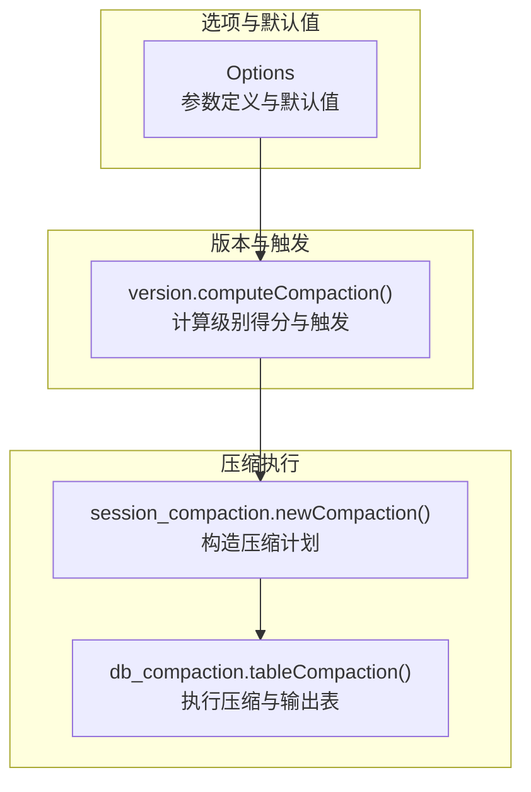
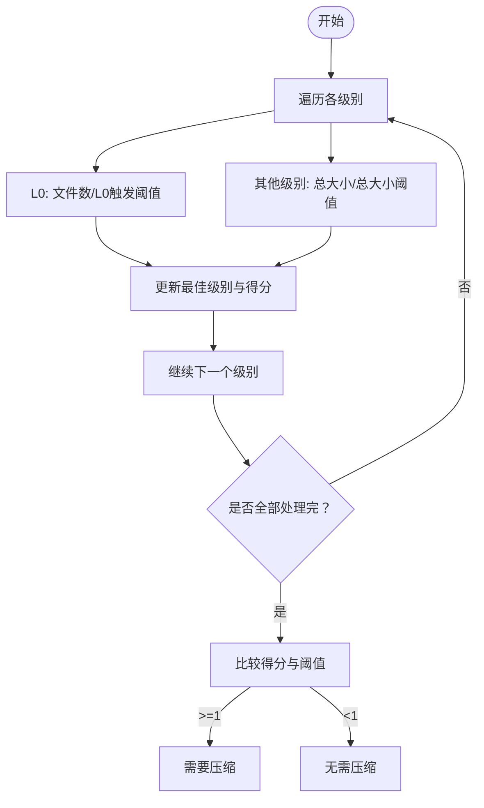

# 压缩策略配置

<cite>
**本文引用的文件列表**
- [leveldb/opt/options.go](file://leveldb/opt/options.go)
- [leveldb/version.go](file://leveldb/version.go)
- [leveldb/session_compaction.go](file://leveldb/session_compaction.go)
- [leveldb/db_compaction.go](file://leveldb/db_compaction.go)
- [leveldb/mlsm_final_comprehensive_test.go](file://leveldb/mlsm_final_comprehensive_test.go)
</cite>

## 目录
1. [简介](#简介)
2. [项目结构与定位](#项目结构与定位)
3. [核心组件与参数总览](#核心组件与参数总览)
4. [架构概览](#架构概览)
5. [关键参数详解与机制](#关键参数详解与机制)
6. [依赖关系与计算流程](#依赖关系与计算流程)
7. [性能影响与调优建议](#性能影响与调优建议)
8. [故障排查与常见问题](#故障排查与常见问题)
9. [结论](#结论)
10. [附录：配置示例与对比参考](#附录配置示例与对比参考)

## 简介
本文件面向 avccDB 的压缩策略配置，系统性解释 CompactionTableSize、CompactionL0Trigger、CompactionTotalSize 及其扩展参数（CompactionTableSizeMultiplier、CompactionTotalSizeMultiplier、CompactionExpandLimitFactor、CompactionGPOverlapsFactor、CompactionSourceLimitFactor）的作用机制、相互关系与对性能的影响。同时给出针对写密集型与读密集型工作负载的调优建议与实践参考。

## 项目结构与定位
- 压缩策略的核心参数定义位于选项模块，用于计算各级别表大小与触发条件。
- 版本选择与触发逻辑在版本模块中实现，依据级别统计与阈值决定是否需要压缩。
- 具体压缩执行由会话与表构建器完成，按级别规则生成新的表并提交版本变更。



图表来源
- [leveldb/opt/options.go](file://leveldb/opt/options.go#L207-L541)
- [leveldb/version.go](file://leveldb/version.go#L646-L695)
- [leveldb/session_compaction.go](file://leveldb/session_compaction.go#L136-L149)
- [leveldb/db_compaction.go](file://leveldb/db_compaction.go#L567-L629)

章节来源
- [leveldb/opt/options.go](file://leveldb/opt/options.go#L207-L541)
- [leveldb/version.go](file://leveldb/version.go#L646-L695)
- [leveldb/session_compaction.go](file://leveldb/session_compaction.go#L136-L149)
- [leveldb/db_compaction.go](file://leveldb/db_compaction.go#L567-L629)

## 核心组件与参数总览
- 参数来源与默认值：所有压缩相关参数均在选项模块集中定义，并提供默认值。
- 计算接口：
  - 获取各级别“单表大小”与“总大小”的计算函数，支持全局倍数或逐级倍数。
  - 获取各级别“展开限制”、“祖父级重叠限制”、“源限制”等派生参数。
- 触发与选择：
  - 版本模块根据级别文件数量（L0）与级别总大小与阈值比值计算得分，选择最优压缩级别。
- 执行：
  - 会话与表构建器根据级别规则与限制进行扩展、重叠检查与输出新表。

章节来源
- [leveldb/opt/options.go](file://leveldb/opt/options.go#L207-L541)
- [leveldb/version.go](file://leveldb/version.go#L646-L695)
- [leveldb/session_compaction.go](file://leveldb/session_compaction.go#L136-L149)
- [leveldb/db_compaction.go](file://leveldb/db_compaction.go#L567-L629)

## 架构概览
压缩策略从“参数定义—级别计算—压缩计划—执行输出”形成闭环。下图展示关键调用链路。

```mermaid
sequenceDiagram
participant Ver as "版本(version)"
participant Opt as "选项(options)"
participant Ses as "会话(session)"
participant DB as "数据库(DB)"
Ver->>Opt : "获取各级别阈值(单表/总大小)"
Ver->>Ver : "计算级别得分(score)"
Ver-->>DB : "needCompaction()>=1 时触发"
DB->>Ses : "pickCompaction()/getCompactionRange()"
Ses-->>DB : "返回压缩计划(compaction)"
DB->>DB : "tableCompaction() 执行"
DB->>DB : "tableCompactionBuilder 输出新表"
DB->>Ses : "提交版本变更"
```

图表来源
- [leveldb/version.go](file://leveldb/version.go#L646-L695)
- [leveldb/db_compaction.go](file://leveldb/db_compaction.go#L567-L629)
- [leveldb/session_compaction.go](file://leveldb/session_compaction.go#L136-L149)
- [leveldb/opt/options.go](file://leveldb/opt/options.go#L470-L541)

## 关键参数详解与机制

### 1) CompactionTableSize 与 Multiplier
- 作用：限制每级“单个输出表”的大小上限；通过乘方或逐级倍数控制各级别表大小差异。
- 默认值与范围：参见默认常量与获取函数。
- 计算方式：
  - 若设置了逐级倍数数组且对应级别有效，则优先使用该数组值；
  - 否则使用全局倍数的级别幂次；
  - 若两者都无效，则使用默认倍数的级别幂次。
- 影响：
  - 表越大，单次压缩输出越多，I/O 与 CPU 压力越大；
  - 表越小，压缩次数增多，但单次压力降低，读放大可能增加。

章节来源
- [leveldb/opt/options.go](file://leveldb/opt/options.go#L241-L260)
- [leveldb/opt/options.go](file://leveldb/opt/options.go#L501-L520)

### 2) CompactionTotalSize 与 Multiplier
- 作用：限制每级“所有表的总大小”上限；同样支持全局或逐级倍数。
- 计算方式：与单表大小一致，但返回类型为整型，用于版本选择的分母。
- 影响：
  - 总大小阈值越小，级别越容易达到触发条件，压缩更频繁；
  - 总大小阈值越大，级别更稳定，减少压缩频率，但磁盘占用更高。

章节来源
- [leveldb/opt/options.go](file://leveldb/opt/options.go#L261-L280)
- [leveldb/opt/options.go](file://leveldb/opt/options.go#L522-L541)
- [leveldb/version.go](file://leveldb/version.go#L646-L695)

### 3) CompactionL0Trigger
- 作用：当 L0 文件数量超过该阈值时，触发 L0 到 L1 的压缩。
- 影响：
  - 阈值越小，L0 越快下沉到 L1，读放大降低；
  - 阈值越大，L0 暂留时间更长，写放大可能降低，但后续读放大上升。

章节来源
- [leveldb/opt/options.go](file://leveldb/opt/options.go#L228-L233)
- [leveldb/version.go](file://leveldb/version.go#L646-L695)

### 4) CompactionExpandLimitFactor
- 作用：压缩后可扩展的最大大小限制（以目标级别单表上限乘以该因子得到）。
- 影响：防止单次压缩过度扩大，避免 I/O 峰值过高。

章节来源
- [leveldb/opt/options.go](file://leveldb/opt/options.go#L215-L219)
- [leveldb/opt/options.go](file://leveldb/opt/options.go#L470-L476)
- [leveldb/session_compaction.go](file://leveldb/session_compaction.go#L225-L236)

### 5) CompactionGPOverlapsFactor
- 作用：单个输出表对“祖父级（Level+2）”的重叠字节上限（以祖父级单表上限乘以该因子得到）。
- 影响：控制压缩对上层级别的重叠程度，避免过多跨层扫描。

章节来源
- [leveldb/opt/options.go](file://leveldb/opt/options.go#L221-L226)
- [leveldb/opt/options.go](file://leveldb/opt/options.go#L478-L484)
- [leveldb/version.go](file://leveldb/version.go#L618-L644)
- [leveldb/session_compaction.go](file://leveldb/session_compaction.go#L238-L290)

### 6) CompactionSourceLimitFactor
- 作用：非 L0 的压缩源大小限制（以目标级别单表上限乘以该因子得到）。
- 影响：限制每次压缩涉及的源表数量，平衡吞吐与资源占用。

章节来源
- [leveldb/opt/options.go](file://leveldb/opt/options.go#L234-L239)
- [leveldb/opt/options.go](file://leveldb/opt/options.go#L493-L499)
- [leveldb/db_compaction.go](file://leveldb/db_compaction.go#L567-L629)

## 依赖关系与计算流程

### 1) 级别选择与触发（版本模块）
- 计算每个级别的得分：L0 使用文件数量与 L0 触发阈值比值；其他级别使用级别总大小与总大小阈值比值。
- 选择最高得分级别作为下一次压缩的目标级别。
- 当任一级别得分≥1 或存在“寻址触发”时，认为需要压缩。



图表来源
- [leveldb/version.go](file://leveldb/version.go#L646-L695)

章节来源
- [leveldb/version.go](file://leveldb/version.go#L646-L695)

### 2) 压缩计划与执行（会话与数据库）
- 会话根据级别与重叠信息构造压缩计划，计算扩展与重叠限制。
- 数据库执行压缩，按目标级别单表上限确定输出表大小，迭代源表并写入新表。
- 提交版本变更，更新主根（mLSM 场景下的聚合根）。

```mermaid
sequenceDiagram
participant Ses as "会话(session)"
participant DB as "数据库(DB)"
participant Opt as "选项(options)"
Ses->>Ses : "newCompaction() 构造计划"
Ses->>Opt : "GetCompactionGPOverlaps(level)"
Ses->>Ses : "expand() 扩展候选表集"
DB->>DB : "tableCompaction() 执行"
DB->>Opt : "GetCompactionTableSize(level+1)"
DB->>DB : "tableCompactionBuilder 写入输出表"
DB->>Ses : "提交版本变更"
```

图表来源
- [leveldb/session_compaction.go](file://leveldb/session_compaction.go#L136-L149)
- [leveldb/session_compaction.go](file://leveldb/session_compaction.go#L225-L290)
- [leveldb/db_compaction.go](file://leveldb/db_compaction.go#L567-L629)
- [leveldb/opt/options.go](file://leveldb/opt/options.go#L470-L541)

章节来源
- [leveldb/session_compaction.go](file://leveldb/session_compaction.go#L136-L149)
- [leveldb/session_compaction.go](file://leveldb/session_compaction.go#L225-L290)
- [leveldb/db_compaction.go](file://leveldb/db_compaction.go#L567-L629)
- [leveldb/opt/options.go](file://leveldb/opt/options.go#L470-L541)

## 性能影响与调优建议

### 1) 写密集型工作负载
- 目标：降低写放大，尽快将 L0 下沉至 L1，减少 L0 读放大。
- 建议：
  - 降低 CompactionL0Trigger，使 L0 更早触发压缩。
  - 适当减小 CompactionTableSize，缩短单次压缩时间与内存占用峰值。
  - 适度增大 CompactionTotalSizeMultiplier，使上层级别容量更大，减少频繁压缩。
  - 控制 CompactionExpandLimitFactor 与 CompactionSourceLimitFactor，避免单次压缩过大。
- 实践参考：
  - 在测试中可见较小的 WriteBuffer 与较小的 CompactionTableSize、较低的 L0 触发阈值可促使数据更快下沉，便于观察多层压缩效果。

章节来源
- [leveldb/mlsm_final_comprehensive_test.go](file://leveldb/mlsm_final_comprehensive_test.go#L36-L75)
- [leveldb/version.go](file://leveldb/version.go#L646-L695)
- [leveldb/opt/options.go](file://leveldb/opt/options.go#L228-L239)
- [leveldb/opt/options.go](file://leveldb/opt/options.go#L241-L280)

### 2) 读密集型工作负载
- 目标：降低读放大，保持较少的级别与较大的单表，减少跨层扫描。
- 建议：
  - 提高 CompactionL0Trigger，延长 L0 存留时间，减少 L0 读放大。
  - 增大 CompactionTableSize 与 CompactionTotalSize，提升单表与级别容量。
  - 适度提高 CompactionTotalSizeMultiplier，使上层级别容量更大。
  - 合理设置 CompactionGPOverlapsFactor，避免输出表对上层造成过多重叠。
- 注意：读密集场景需权衡磁盘占用与压缩频率，避免上层表过多导致读放大反弹。

章节来源
- [leveldb/version.go](file://leveldb/version.go#L646-L695)
- [leveldb/opt/options.go](file://leveldb/opt/options.go#L228-L280)

## 故障排查与常见问题
- 压缩过于频繁
  - 现象：CPU 占用高、I/O 峰值明显。
  - 排查：检查 CompactionTotalSize 是否过小、CompactionTableSize 是否过小、L0 触发阈值是否过低。
  - 处置：增大级别总大小阈值与单表大小，或提高 L0 触发阈值。
- 压缩不触发
  - 现象：磁盘占用增长、读放大升高。
  - 排查：确认级别得分是否达到阈值；检查 CompactionTotalSizeMultiplier 是否过大导致阈值过高。
  - 处置：适当降低级别阈值倍数或调整单表大小。
- 重叠过多导致读放大
  - 现象：输出表对上层重叠严重，读取跨层扫描增多。
  - 排查：检查 CompactionGPOverlapsFactor 设置是否过大或过小。
  - 处置：根据数据分布与访问模式微调该因子，避免过度扩展。
- 写入暂停或延迟
  - 现象：写入被暂停或出现延迟。
  - 排查：检查 L0 文件数量与写入暂停阈值；确认压缩是否持续进行。
  - 处置：降低 L0 触发阈值或增大单表大小，减少 L0 积压。

章节来源
- [leveldb/version.go](file://leveldb/version.go#L646-L695)
- [leveldb/opt/options.go](file://leveldb/opt/options.go#L228-L280)
- [leveldb/db_compaction.go](file://leveldb/db_compaction.go#L674-L687)

## 结论
压缩策略的关键在于“单表大小、级别总大小、触发阈值与扩展/重叠限制”的协同。合理配置可显著改善写放大、读放大与 I/O 峰值之间的平衡。针对不同工作负载应采用差异化策略，并结合实际数据分布与访问模式进行迭代调优。

## 附录：配置示例与对比参考
以下为基于仓库内测试与默认参数的配置思路示例（仅列出参数名与取值方向，不直接粘贴代码）：
- 写密集型示例（偏向快速下沉 L0、较小单表、适中级别容量）
  - CompactionL0Trigger：降低
  - CompactionTableSize：较小
  - CompactionTotalSize：适中
  - CompactionTotalSizeMultiplier：略增
  - CompactionExpandLimitFactor：中等
  - CompactionGPOverlapsFactor：中等
  - CompactionSourceLimitFactor：中等
- 读密集型示例（偏向较大单表、较大级别容量、较长 L0 存留）
  - CompactionL0Trigger：提高
  - CompactionTableSize：较大
  - CompactionTotalSize：较大
  - CompactionTotalSizeMultiplier：较大
  - CompactionExpandLimitFactor：较高
  - CompactionGPOverlapsFactor：适中
  - CompactionSourceLimitFactor：较高

章节来源
- [leveldb/mlsm_final_comprehensive_test.go](file://leveldb/mlsm_final_comprehensive_test.go#L36-L75)
- [leveldb/opt/options.go](file://leveldb/opt/options.go#L207-L541)
- [leveldb/version.go](file://leveldb/version.go#L646-L695)