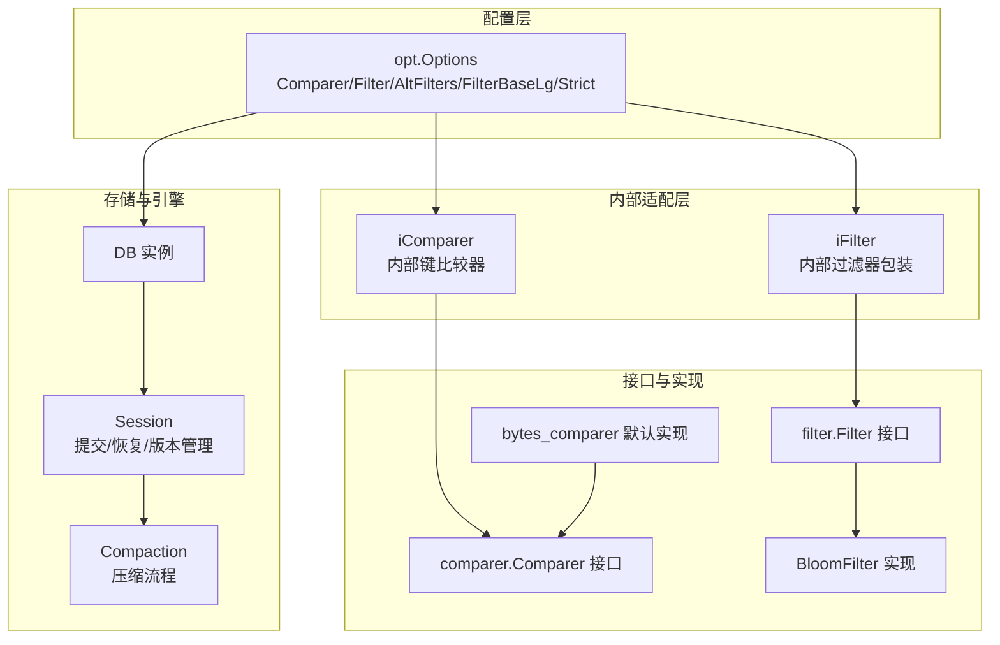
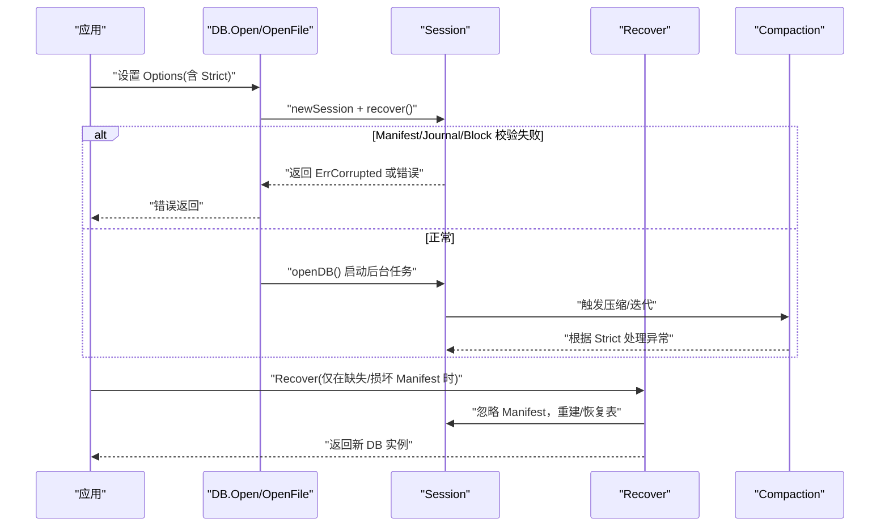
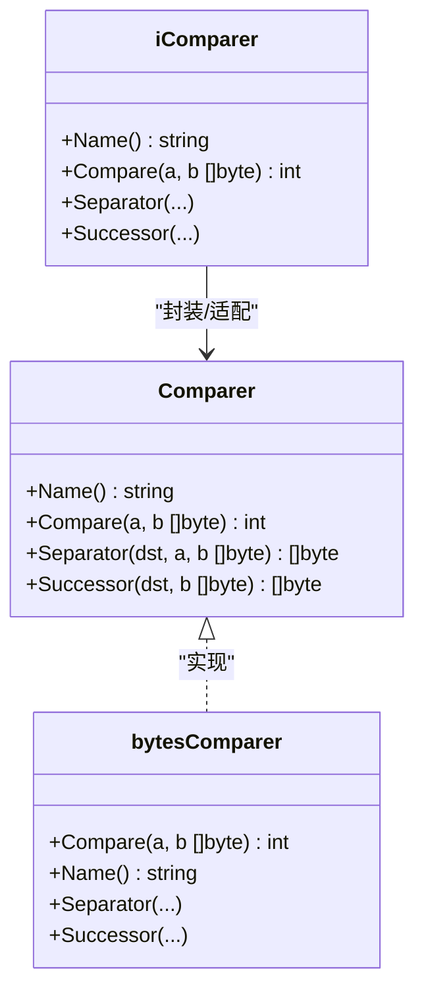
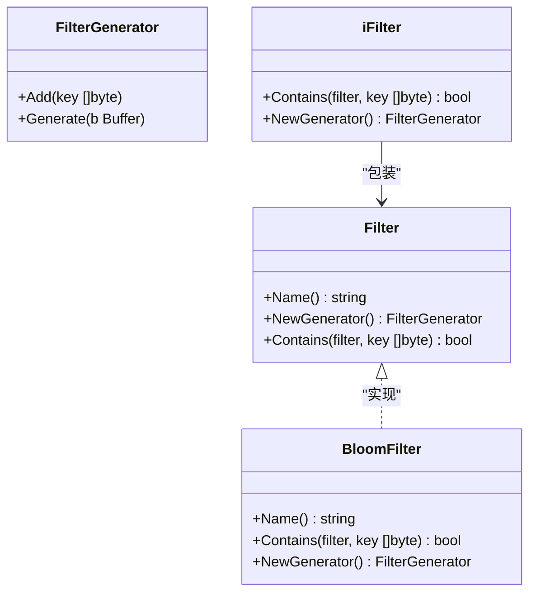
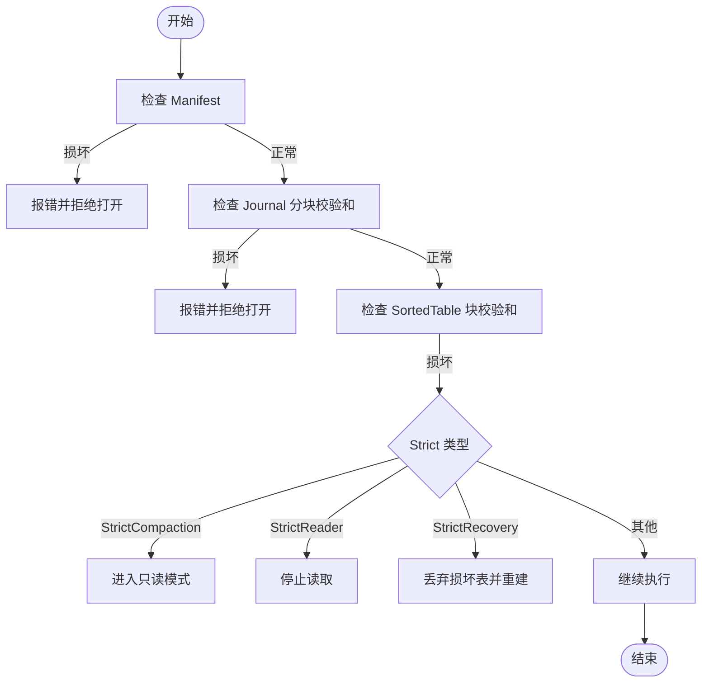
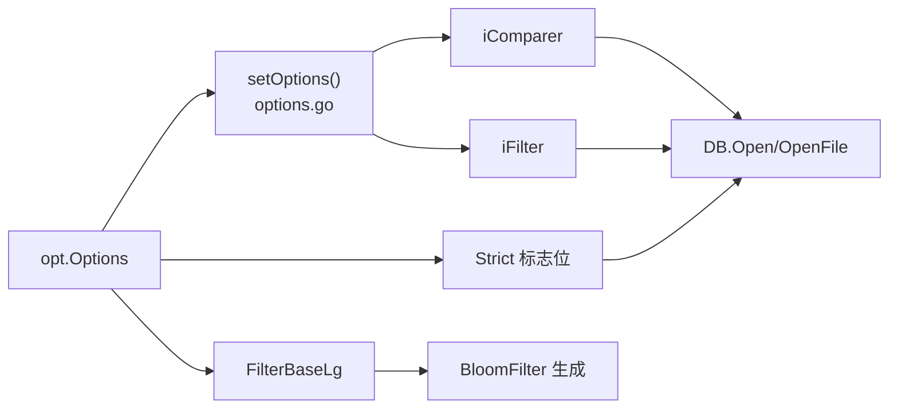

# 扩展功能配置

<cite>
**本文引用的文件列表**
- [leveldb/comparer/comparer.go](file://leveldb/comparer/comparer.go)
- [leveldb/comparer/bytes_comparer.go](file://leveldb/comparer/bytes_comparer.go)
- [leveldb/comparer.go](file://leveldb/comparer.go)
- [leveldb/filter/filter.go](file://leveldb/filter/filter.go)
- [leveldb/filter/bloom.go](file://leveldb/filter/bloom.go)
- [leveldb/filter.go](file://leveldb/filter.go)
- [leveldb/opt/options.go](file://leveldb/opt/options.go)
- [leveldb/options.go](file://leveldb/options.go)
- [leveldb/db.go](file://leveldb/db.go)
- [leveldb/session.go](file://leveldb/session.go)
- [leveldb/session_compaction.go](file://leveldb/session_compaction.go)
- [leveldb/db_compaction.go](file://leveldb/db_compaction.go)
- [README.md](file://README.md)
</cite>

## 目录
1. [简介](#简介)
2. [项目结构](#项目结构)
3. [核心组件](#核心组件)
4. [架构总览](#架构总览)
5. [详细组件分析](#详细组件分析)
6. [依赖关系分析](#依赖关系分析)
7. [性能考量](#性能考量)
8. [故障排查指南](#故障排查指南)
9. [结论](#结论)
10. [附录](#附录)

## 简介
本文件面向 avccDB 的高级配置与安全加固需求，系统性阐述以下扩展功能：
- Comparer 自定义比较器：如何定义键的排序规则，以及在版本/序列号语义下的比较策略。
- Filter 与 AltFilters 布隆过滤器：如何配置有效过滤器与备用过滤器，以及 FilterBaseLg 对误判率的影响。
- Strict 严格模式：各标志位（如 StrictReader、StrictCompaction）的安全性与数据完整性保障机制。
- 最佳实践：在高安全性场景下，如何组合配置 Comparer、Filter、AltFilters 与 Strict 模式。

## 项目结构
围绕扩展功能的关键模块分布如下：
- 比较器：comparer 接口与默认实现，以及内部适配器 iComparer。
- 过滤器：Filter 接口、内置布隆过滤器 BloomFilter 及其生成器。
- 选项：opt.Options 提供 Comparer、Filter、AltFilters、FilterBaseLg、Strict 等配置入口。
- 会话与写入：options.go 中将用户配置转换为内部适配器（iComparer/iFilter），并缓存计算结果。
- 数据库与恢复：db.go、session.go、session_compaction.go、db_compaction.go 展示了 Strict 在打开、恢复、读取、压缩过程中的作用路径。

图表来源
- [leveldb/opt/options.go](file://leveldb/opt/options.go#L176-L424)
- [leveldb/options.go](file://leveldb/options.go#L25-L44)
- [leveldb/comparer.go](file://leveldb/comparer.go#L13-L121)
- [leveldb/filter.go](file://leveldb/filter.go#L13-L31)
- [leveldb/comparer/comparer.go](file://leveldb/comparer/comparer.go#L11-L58)
- [leveldb/comparer/bytes_comparer.go](file://leveldb/comparer/bytes_comparer.go#L11-L51)
- [leveldb/filter/filter.go](file://leveldb/filter/filter.go#L16-L60)
- [leveldb/filter/bloom.go](file://leveldb/filter/bloom.go#L17-L116)
- [leveldb/db.go](file://leveldb/db.go#L177-L243)
- [leveldb/session.go](file://leveldb/session.go#L200-L243)
- [leveldb/session_compaction.go](file://leveldb/session_compaction.go#L86-L137)
- [leveldb/db_compaction.go](file://leveldb/db_compaction.go#L147-L210)

章节来源
- [leveldb/opt/options.go](file://leveldb/opt/options.go#L176-L424)
- [leveldb/options.go](file://leveldb/options.go#L25-L44)

## 核心组件
- Comparer 接口与实现
  - Comparer 定义键序关系、名称、分隔符与后继生成等能力，用于索引块空间优化与键范围推断。
  - 默认 bytes_comparer 使用字节序比较；内部 iComparer 在此基础上加入版本/序列号语义，确保 Seek 行为与最新版本优先级正确。
- Filter 与 BloomFilter
  - Filter 接口定义名称、生成器与包含判断；BloomFilter 是内置实现，支持按 bitsPerKey 计算哈希与位图大小，并持久化编码 k 值以兼容不同参数。
  - iFilter 包装外部 Filter，屏蔽内部键与用户键差异。
- Strict 严格模式
  - 通过位掩码控制 Manifest/Journal/Block/Reader/Compaction 等环节的容错策略，默认启用 JournalChecksum、BlockChecksum、Compaction、Reader，可按需增强或关闭。
- FilterBaseLg
  - 控制每表过滤块的大小（以 2 的幂表示），影响布隆过滤器位数与误判率；较大的 FilterBaseLg 通常降低误判率但增加磁盘占用。

章节来源
- [leveldb/comparer/comparer.go](file://leveldb/comparer/comparer.go#L11-L58)
- [leveldb/comparer/bytes_comparer.go](file://leveldb/comparer/bytes_comparer.go#L11-L51)
- [leveldb/comparer.go](file://leveldb/comparer.go#L13-L121)
- [leveldb/filter/filter.go](file://leveldb/filter/filter.go#L16-L60)
- [leveldb/filter/bloom.go](file://leveldb/filter/bloom.go#L17-L116)
- [leveldb/filter.go](file://leveldb/filter.go#L13-L31)
- [leveldb/opt/options.go](file://leveldb/opt/options.go#L130-L174)
- [leveldb/opt/options.go](file://leveldb/opt/options.go#L413-L424)

## 架构总览
下面的时序图展示了 Strict 在数据库打开与恢复阶段的关键行为：

图表来源
- [leveldb/db.go](file://leveldb/db.go#L177-L243)
- [leveldb/db.go](file://leveldb/db.go#L245-L293)
- [leveldb/db.go](file://leveldb/db.go#L295-L497)
- [leveldb/db.go](file://leveldb/db.go#L499-L666)
- [leveldb/db.go](file://leveldb/db.go#L668-L767)
- [leveldb/db_compaction.go](file://leveldb/db_compaction.go#L147-L210)

## 详细组件分析

### Comparer 自定义比较器
- 设计要点
  - Comparer 需要保证“全序关系”，且名称一旦改变，将导致磁盘格式不兼容。
  - 内部 iComparer 在 Compare 中先比较用户键，再按版本降序、序列号降序处理；当查询键携带特殊通配符时，确保 Seek 能找到最新版本。
  - Separator/Successor 用于索引块的区间推断，减少不必要的扫描。
- 使用场景
  - 版本化键：同一用户键下按版本与序列号排序，Seek 查询时优先命中最新版本。
  - 自定义排序：如复合键、前缀键、数值键等，需要通过自定义 Comparer 保证稳定排序。
- 代码参考路径
  - [Comparer 接口定义](file://leveldb/comparer/comparer.go#L11-L58)
  - [默认字节序实现](file://leveldb/comparer/bytes_comparer.go#L11-L51)
  - [内部 iComparer 实现](file://leveldb/comparer.go#L13-L121)

图表来源
- [leveldb/comparer/comparer.go](file://leveldb/comparer/comparer.go#L11-L58)
- [leveldb/comparer/bytes_comparer.go](file://leveldb/comparer/bytes_comparer.go#L11-L51)
- [leveldb/comparer.go](file://leveldb/comparer.go#L13-L121)

章节来源
- [leveldb/comparer/comparer.go](file://leveldb/comparer/comparer.go#L11-L58)
- [leveldb/comparer/bytes_comparer.go](file://leveldb/comparer/bytes_comparer.go#L11-L51)
- [leveldb/comparer.go](file://leveldb/comparer.go#L13-L121)

### Filter 与 AltFilters 布隆过滤器
- Filter 接口与 BloomFilter
  - Filter 定义名称、生成器与包含判断；BloomFilter 通过双哈希与旋转位移实现探针序列，k 值随 bitsPerKey 动态计算。
  - 生成器在 Generate 时计算位图大小并写入末尾编码 k，确保不同参数生成的过滤器仍可互操作。
- AltFilters
  - 当有效过滤器无法匹配时，系统会尝试备用过滤器集合，提升迁移与兼容性。
- 配置入口
  - Options.Filter 设置有效过滤器；Options.AltFilters 设置备用过滤器集合。
  - FilterBaseLg 控制每表过滤块大小（以 2 的幂表示），影响布隆过滤器位数与误判率。
- 代码参考路径
  - [Filter 接口](file://leveldb/filter/filter.go#L16-L60)
  - [BloomFilter 实现](file://leveldb/filter/bloom.go#L17-L116)
  - [iFilter 包装](file://leveldb/filter.go#L13-L31)
  - [Options 字段与 Getter](file://leveldb/opt/options.go#L176-L424)
  - [会话中适配 Filter](file://leveldb/options.go#L25-L44)

图表来源
- [leveldb/filter/filter.go](file://leveldb/filter/filter.go#L16-L60)
- [leveldb/filter/bloom.go](file://leveldb/filter/bloom.go#L17-L116)
- [leveldb/filter.go](file://leveldb/filter.go#L13-L31)

章节来源
- [leveldb/filter/filter.go](file://leveldb/filter/filter.go#L16-L60)
- [leveldb/filter/bloom.go](file://leveldb/filter/bloom.go#L17-L116)
- [leveldb/filter.go](file://leveldb/filter.go#L13-L31)
- [leveldb/opt/options.go](file://leveldb/opt/options.go#L176-L424)
- [leveldb/options.go](file://leveldb/options.go#L25-L44)

### Strict 严格模式
- 标志位含义
  - StrictManifest：Manifest 条目校验失败直接报错，防止打开损坏的 Manifest。
  - StrictJournalChecksum：强制校验 Journal 分块校验和。
  - StrictJournal：Journal 块损坏直接报错，防止打开损坏的 Journal。
  - StrictBlockChecksum：强制校验 SortedTable 块校验和，读与压缩均受影响。
  - StrictCompaction：压缩遇到损坏表失败并进入只读模式。
  - StrictReader：读取遇到损坏表直接停止。
  - StrictRecovery：Recover 时丢弃损坏表。
  - StrictOverride：ReadOptions 中覆盖全局 Strict。
- 默认与全局生效
  - 默认启用 StrictJournalChecksum、StrictBlockChecksum、StrictCompaction、StrictReader；可通过 Options.Strict 覆盖。
- 代码参考路径
  - [Strict 标志位定义](file://leveldb/opt/options.go#L130-L174)
  - [Options.Strict 获取](file://leveldb/opt/options.go#L389-L424)
  - [ReadOptions.Strict 获取](file://leveldb/opt/options.go#L694-L722)
  - [会话设置与 Strict 应用](file://leveldb/options.go#L14-L23)
  - [Recover 中 Mask Reader 与 StrictRecovery](file://leveldb/db.go#L295-L314)
  - [Journal 恢复中的 Strict 校验](file://leveldb/db.go#L499-L666)
  - [压缩流程中的错误处理](file://leveldb/db_compaction.go#L147-L210)

图表来源
- [leveldb/opt/options.go](file://leveldb/opt/options.go#L130-L174)
- [leveldb/db.go](file://leveldb/db.go#L295-L314)
- [leveldb/db.go](file://leveldb/db.go#L499-L666)
- [leveldb/db_compaction.go](file://leveldb/db_compaction.go#L147-L210)

章节来源
- [leveldb/opt/options.go](file://leveldb/opt/options.go#L130-L174)
- [leveldb/opt/options.go](file://leveldb/opt/options.go#L389-L424)
- [leveldb/opt/options.go](file://leveldb/opt/options.go#L694-L722)
- [leveldb/options.go](file://leveldb/options.go#L14-L23)
- [leveldb/db.go](file://leveldb/db.go#L295-L314)
- [leveldb/db.go](file://leveldb/db.go#L499-L666)
- [leveldb/db_compaction.go](file://leveldb/db_compaction.go#L147-L210)

### FilterBaseLg 对误判率的影响
- FilterBaseLg 决定每表过滤块大小（单位：2 的幂），进而决定布隆过滤器位数与探针次数 k。
- 较大的 FilterBaseLg 通常能显著降低误判率，但会增加磁盘占用与写放大。
- 代码参考路径
  - [FilterBaseLg 字段与默认值](file://leveldb/opt/options.go#L413-L424)
  - [BloomFilter 生成逻辑（bitsPerKey/k 计算）](file://leveldb/filter/bloom.go#L54-L105)

章节来源
- [leveldb/opt/options.go](file://leveldb/opt/options.go#L413-L424)
- [leveldb/filter/bloom.go](file://leveldb/filter/bloom.go#L54-L105)

## 依赖关系分析
- Comparer/Filter 由用户通过 Options 注入，内部通过 options.go 转换为 iComparer/iFilter，并缓存到 cachedOptions 中，避免重复计算。
- Strict 在打开、恢复、读取、压缩等路径上被条件启用，形成“安全边界”。
- FilterBaseLg 影响 BloomFilter 生成的位图大小，从而影响误判率与 IO。

图表来源
- [leveldb/options.go](file://leveldb/options.go#L25-L44)
- [leveldb/opt/options.go](file://leveldb/opt/options.go#L176-L424)
- [leveldb/filter/bloom.go](file://leveldb/filter/bloom.go#L54-L105)

章节来源
- [leveldb/options.go](file://leveldb/options.go#L25-L44)
- [leveldb/opt/options.go](file://leveldb/opt/options.go#L176-L424)

## 性能考量
- Comparer
  - 自定义比较器应尽量保持 O(1) 或线性前缀比较，避免复杂字符串解析。
  - 使用 Separator/Successor 可减少索引块大小，提高范围查询效率。
- Filter/Bloom
  - 合理设置 FilterBaseLg 与 bitsPerKey，权衡误判率与磁盘占用。
  - AltFilters 可平滑过渡过滤器策略变更，减少迁移期的误判与回退。
- Strict
  - 开启 StrictBlockChecksum/StrictJournalChecksum 会增加 CPU 与 IO 成本，建议在高可靠性场景启用。
  - StrictCompaction/StrictReader 会在检测到损坏时采取保守策略，可能影响吞吐，但保障一致性。

## 故障排查指南
- Manifest/Journal/Block 损坏
  - 若 StrictManifest/StrictJournal/StrictBlockChecksum 启用，损坏将直接导致打开失败；可使用 Recover 重建表并丢弃损坏内容（受 StrictRecovery 影响）。
- 读取异常
  - 若 StrictReader 启用，读取遇到损坏表会立即停止；可在 ReadOptions 中临时启用 StrictOverride 覆盖全局策略进行诊断。
- 压缩失败
  - 若 StrictCompaction 启用，损坏表会导致压缩失败并进入只读模式；需先修复或丢弃问题表。
- 代码参考路径
  - [Recover 流程与 StrictRecovery](file://leveldb/db.go#L295-L314)
  - [Journal 恢复与 Strict 校验](file://leveldb/db.go#L499-L666)
  - [压缩错误处理与只读切换](file://leveldb/db_compaction.go#L147-L210)

章节来源
- [leveldb/db.go](file://leveldb/db.go#L295-L314)
- [leveldb/db.go](file://leveldb/db.go#L499-L666)
- [leveldb/db_compaction.go](file://leveldb/db_compaction.go#L147-L210)

## 结论
- Comparer 与 Filter 是 avccDB 的“排序与索引”基石，直接影响查询性能与范围扫描效率。
- Strict 提供从 Manifest 到 Block 的多层安全边界，适合高可靠性场景。
- FilterBaseLg 是平衡误判率与资源消耗的关键参数，应结合业务特征与硬件条件调优。
- AltFilters 为过滤器演进提供了平滑过渡通道，降低迁移风险。

## 附录

### 配置清单与示例路径
- 自定义比较器
  - 定义 Comparer 并设置到 Options.Comparer。
  - 参考路径：
    - [Comparer 接口](file://leveldb/comparer/comparer.go#L11-L58)
    - [默认字节序实现](file://leveldb/comparer/bytes_comparer.go#L11-L51)
    - [Options.Comparer](file://leveldb/opt/options.go#L282-L288)
- 布隆过滤器与备用过滤器
  - 设置 Options.Filter 与 Options.AltFilters。
  - 参考路径：
    - [Options.Filter/AltFilters](file://leveldb/opt/options.go#L176-L200)
    - [BloomFilter 生成](file://leveldb/filter/bloom.go#L106-L116)
    - [会话适配 Filter](file://leveldb/options.go#L25-L44)
- FilterBaseLg
  - 设置 Options.FilterBaseLg。
  - 参考路径：
    - [FilterBaseLg](file://leveldb/opt/options.go#L413-L424)
- Strict 模式
  - 设置 Options.Strict 并在 ReadOptions 中使用 StrictOverride。
  - 参考路径：
    - [Strict 标志位](file://leveldb/opt/options.go#L130-L174)
    - [Options.Strict 获取](file://leveldb/opt/options.go#L389-L424)
    - [ReadOptions.Strict 获取](file://leveldb/opt/options.go#L694-L722)
- 示例用法（README）
  - 参考路径：
    - [README 中 BloomFilter 使用示例](file://README.md#L94-L103)

章节来源
- [leveldb/comparer/comparer.go](file://leveldb/comparer/comparer.go#L11-L58)
- [leveldb/comparer/bytes_comparer.go](file://leveldb/comparer/bytes_comparer.go#L11-L51)
- [leveldb/opt/options.go](file://leveldb/opt/options.go#L130-L174)
- [leveldb/opt/options.go](file://leveldb/opt/options.go#L176-L200)
- [leveldb/opt/options.go](file://leveldb/opt/options.go#L282-L288)
- [leveldb/opt/options.go](file://leveldb/opt/options.go#L389-L424)
- [leveldb/opt/options.go](file://leveldb/opt/options.go#L413-L424)
- [leveldb/opt/options.go](file://leveldb/opt/options.go#L694-L722)
- [leveldb/filter/bloom.go](file://leveldb/filter/bloom.go#L106-L116)
- [leveldb/options.go](file://leveldb/options.go#L25-L44)
- [README.md](file://README.md#L94-L103)