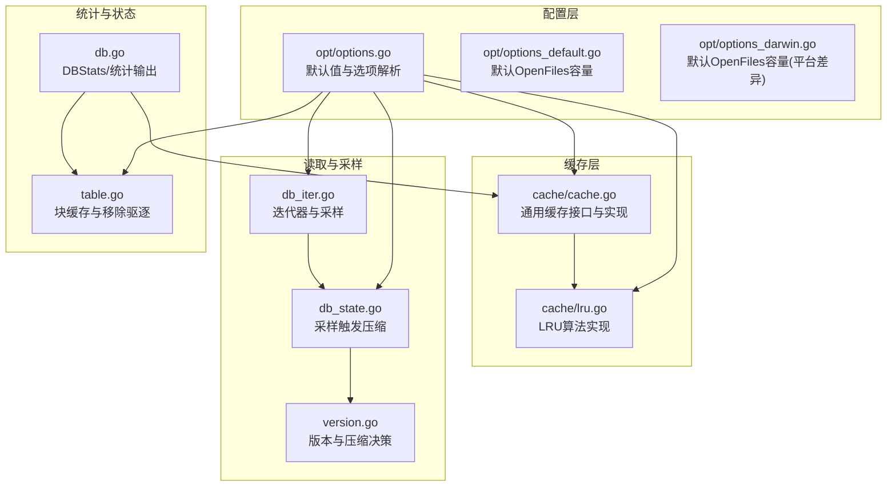
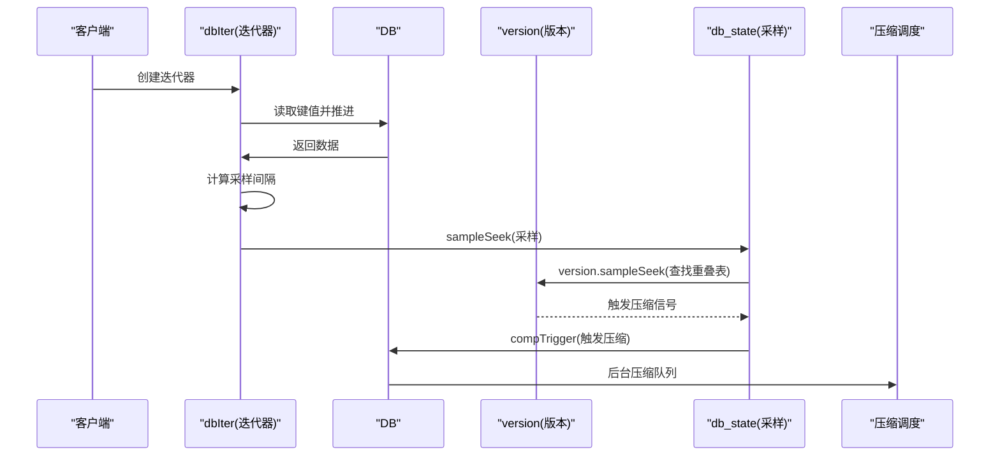
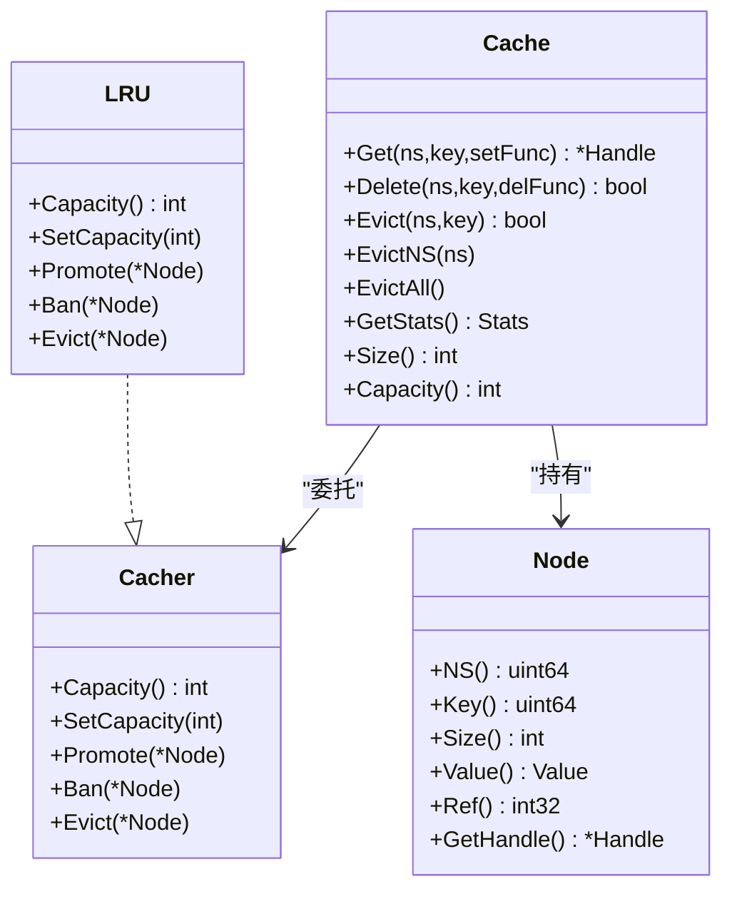
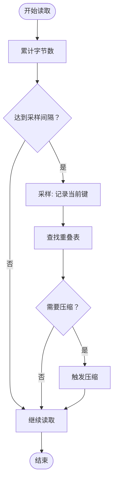
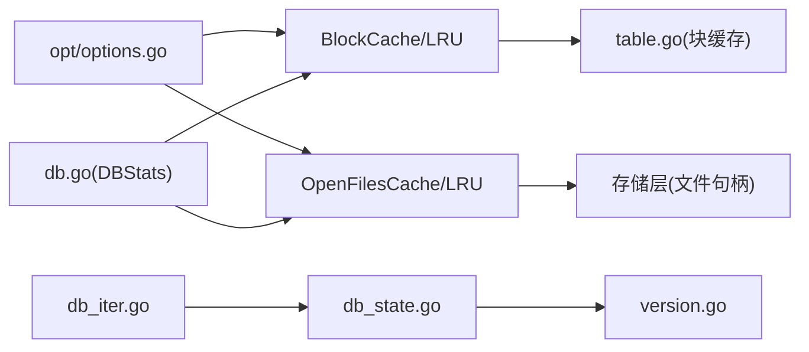

# 数据访问优化

<cite>
**本文引用的文件列表**
- [leveldb/opt/options.go](file://leveldb/opt/options.go)
- [leveldb/cache/cache.go](file://leveldb/cache/cache.go)
- [leveldb/cache/lru.go](file://leveldb/cache/lru.go)
- [leveldb/db_iter.go](file://leveldb/db_iter.go)
- [leveldb/db_state.go](file://leveldb/db_state.go)
- [leveldb/version.go](file://leveldb/version.go)
- [leveldb/db.go](file://leveldb/db.go)
- [leveldb/table.go](file://leveldb/table.go)
- [leveldb/opt/options_darwin.go](file://leveldb/opt/options_darwin.go)
- [leveldb/opt/options_default.go](file://leveldb/opt/options_default.go)
</cite>

## 目录
1. [简介](#简介)
2. [项目结构与定位](#项目结构与定位)
3. [核心组件与配置项](#核心组件与配置项)
4. [架构总览](#架构总览)
5. [关键组件深度解析](#关键组件深度解析)
6. [依赖关系分析](#依赖关系分析)
7. [性能考量与容量规划](#性能考量与容量规划)
8. [故障排查与监控建议](#故障排查与监控建议)
9. [结论](#结论)
10. [附录：基准测试与配置建议](#附录：基准测试与配置建议)

## 简介
本文件聚焦于 avccDB 的数据访问优化能力，围绕以下三项关键配置展开：
- BlockCache 与 BlockCacheCapacity：控制“有序表（SST）块”的内存缓存策略与容量，直接影响读放大与命中率。
- IteratorSamplingRate：通过迭代器采样驱动压缩决策，平衡读写路径与后台压缩触发时机。
- OpenFilesCacher 与 OpenFilesCacheCapacity：控制打开文件句柄的缓存策略与容量，影响文件系统句柄开销与I/O吞吐。

文档将从实现原理、工作机制、性能影响、容量规划与监控建议等方面进行系统化说明，并给出不同配置下的性能对比思路与实践建议。

## 项目结构与定位
- 配置层：位于 opt 包，定义默认值、选项解析与获取逻辑。
- 缓存层：位于 cache 包，提供通用缓存接口与 LRU 实现。
- 迭代与采样：位于 db_iter.go 与 db_state.go，负责迭代器采样与触发压缩。
- 版本与压缩：位于 version.go 与 db_compaction.go，负责压缩决策与执行。
- 统计与状态：位于 db.go，提供缓存统计、I/O统计与运行时指标。

图表来源
- [leveldb/opt/options.go](file://leveldb/opt/options.go#L24-L45)
- [leveldb/cache/cache.go](file://leveldb/cache/cache.go#L19-L36)
- [leveldb/cache/lru.go](file://leveldb/cache/lru.go#L41-L159)
- [leveldb/db_iter.go](file://leveldb/db_iter.go#L63-L95)
- [leveldb/db_state.go](file://leveldb/db_state.go#L65-L72)
- [leveldb/version.go](file://leveldb/version.go#L534-L549)
- [leveldb/db.go](file://leveldb/db.go#L1388-L1441)
- [leveldb/table.go](file://leveldb/table.go#L559-L561)
- [leveldb/opt/options_default.go](file://leveldb/opt/options_default.go#L6-L8)
- [leveldb/opt/options_darwin.go](file://leveldb/opt/options_darwin.go#L6-L8)

章节来源
- [leveldb/opt/options.go](file://leveldb/opt/options.go#L24-L45)
- [leveldb/cache/cache.go](file://leveldb/cache/cache.go#L19-L36)
- [leveldb/cache/lru.go](file://leveldb/cache/lru.go#L41-L159)
- [leveldb/db_iter.go](file://leveldb/db_iter.go#L63-L95)
- [leveldb/db_state.go](file://leveldb/db_state.go#L65-L72)
- [leveldb/version.go](file://leveldb/version.go#L534-L549)
- [leveldb/db.go](file://leveldb/db.go#L1388-L1441)
- [leveldb/table.go](file://leveldb/table.go#L559-L561)
- [leveldb/opt/options_default.go](file://leveldb/opt/options_default.go#L6-L8)
- [leveldb/opt/options_darwin.go](file://leveldb/opt/options_darwin.go#L6-L8)

## 核心组件与配置项
- BlockCache 与 BlockCacheCapacity
  - 作用：为“有序表（SST）块”提供内存缓存，提升顺序读取命中率，降低磁盘I/O。
  - 默认值：BlockCacher 默认 LRU；BlockCacheCapacity 默认 8 MiB。
  - 关键行为：通过 Cacher 接口与 LRU 实现，按容量上限淘汰最久未使用块。
- BlockCacheEvictRemoved
  - 作用：当移除某张表后，是否强制驱逐该表对应的已缓存块，避免内存浪费。
  - 默认值：false。
- IteratorSamplingRate
  - 作用：迭代器在遍历时以近似字节间隔进行采样，用于触发压缩决策。
  - 默认值：1 MiB；若禁用或设置为非正值，则关闭采样。
  - 关键行为：采样间隔随机化，避免固定模式导致抖动。
- OpenFilesCacher 与 OpenFilesCacheCapacity
  - 作用：缓存打开的文件句柄，减少频繁打开/关闭带来的系统调用与资源消耗。
  - 默认值：OpenFilesCacher 默认 LRU；OpenFilesCacheCapacity 平台相关，默认 500（非 macOS），200（macOS）。
  - 关键行为：容量不足时按 LRU 淘汰旧句柄。

章节来源
- [leveldb/opt/options.go](file://leveldb/opt/options.go#L24-L45)
- [leveldb/opt/options.go](file://leveldb/opt/options.go#L184-L201)
- [leveldb/opt/options.go](file://leveldb/opt/options.go#L352-L361)
- [leveldb/opt/options.go](file://leveldb/opt/options.go#L372-L382)
- [leveldb/opt/options_darwin.go](file://leveldb/opt/options_darwin.go#L6-L8)
- [leveldb/opt/options_default.go](file://leveldb/opt/options_default.go#L6-L8)

## 架构总览
下图展示从读取到采样再到压缩触发的关键链路，以及缓存与文件句柄缓存的参与点。

图表来源
- [leveldb/db_iter.go](file://leveldb/db_iter.go#L63-L95)
- [leveldb/db_state.go](file://leveldb/db_state.go#L65-L72)
- [leveldb/version.go](file://leveldb/version.go#L534-L549)

## 关键组件深度解析

### BlockCache 与 BlockCacheCapacity
- 设计要点
  - 通用缓存接口：Cacher 定义容量、Promote/Ban/Evict 等操作，便于替换算法。
  - LRU 实现：维护双向链表与最近使用计数，容量超限时淘汰尾部节点。
  - 与表块加载结合：表读取时通过缓存接口按需创建/命中块，Promote 更新热度。
- 性能影响
  - 增大容量可提高命中率，降低磁盘I/O，但占用更多内存。
  - LRU 能够有效保留热点块，减少抖动。
- 内存管理
  - BlockCacheEvictRemoved 可在表被删除后主动驱逐对应块，避免残留占用。
  - 当容量为负时，BlockCache 被禁用（等价于 NoCacher）。

图表来源
- [leveldb/cache/cache.go](file://leveldb/cache/cache.go#L19-L36)
- [leveldb/cache/cache.go](file://leveldb/cache/cache.go#L362-L463)
- [leveldb/cache/lru.go](file://leveldb/cache/lru.go#L41-L159)

章节来源
- [leveldb/cache/cache.go](file://leveldb/cache/cache.go#L19-L36)
- [leveldb/cache/cache.go](file://leveldb/cache/cache.go#L362-L463)
- [leveldb/cache/lru.go](file://leveldb/cache/lru.go#L41-L159)
- [leveldb/opt/options.go](file://leveldb/opt/options.go#L184-L201)
- [leveldb/table.go](file://leveldb/table.go#L559-L561)

### IteratorSamplingRate 与压缩触发
- 工作机制
  - 迭代器在每次推进时累计字节数，当达到采样间隔（随机化）时触发一次采样。
  - 采样会查询当前键所在层级的重叠表，若发现需要压缩则通过版本层设置压缩信号。
  - DB 收到信号后触发后台压缩队列，安排合适的压缩任务。
- 影响与权衡
  - 提高采样频率会更早触发压缩，降低后续读放大，但增加后台工作负载。
  - 设置过低可能无法及时触发压缩，导致读放大累积。
  - 禁用采样（非正值）会完全关闭该机制，读取路径不再作为压缩触发源。

图表来源
- [leveldb/db_iter.go](file://leveldb/db_iter.go#L80-L95)
- [leveldb/db_iter.go](file://leveldb/db_iter.go#L123-L135)
- [leveldb/db_state.go](file://leveldb/db_state.go#L65-L72)
- [leveldb/version.go](file://leveldb/version.go#L534-L549)

章节来源
- [leveldb/db_iter.go](file://leveldb/db_iter.go#L80-L95)
- [leveldb/db_iter.go](file://leveldb/db_iter.go#L123-L135)
- [leveldb/db_state.go](file://leveldb/db_state.go#L65-L72)
- [leveldb/version.go](file://leveldb/version.go#L534-L549)
- [leveldb/opt/options.go](file://leveldb/opt/options.go#L352-L361)

### OpenFilesCacher 与 OpenFilesCacheCapacity
- 设计要点
  - 通过缓存接口统一管理打开文件句柄，避免频繁系统调用。
  - LRU 策略按最近使用排序，容量不足时淘汰最久未使用的句柄。
  - 平台默认容量不同（macOS 200，其他 500），以适配系统限制。
- 性能影响
  - 合理的容量可显著降低文件句柄抖动与系统调用次数，提升并发读取稳定性。
  - 过小会导致频繁驱逐，增大句柄切换成本；过大可能占用较多内核资源。
- 与 I/O 的关系
  - 文件句柄缓存与底层存储实现（如文件系统）配合，减少打开/关闭开销，间接提升 I/O 吞吐。

章节来源
- [leveldb/opt/options.go](file://leveldb/opt/options.go#L372-L382)
- [leveldb/opt/options_default.go](file://leveldb/opt/options_default.go#L6-L8)
- [leveldb/opt/options_darwin.go](file://leveldb/opt/options_darwin.go#L6-L8)
- [leveldb/cache/cache.go](file://leveldb/cache/cache.go#L362-L463)
- [leveldb/cache/lru.go](file://leveldb/cache/lru.go#L41-L159)

## 依赖关系分析
- 配置到缓存
  - Options 中的 BlockCacher/BlockCacheCapacity 与 OpenFilesCacher/OpenFilesCacheCapacity 通过 GetXxx 方法生效。
  - LRU 实现依赖通用缓存接口，保证替换算法可插拔。
- 读取到采样
  - db_iter 在构造迭代器时读取 IteratorSamplingRate，并在推进过程中按随机间隔采样。
  - 采样结果经由 db_state 与 version 层触发压缩。
- 统计与可观测性
  - DBStats 提供 BlockCache/FileCache 的统计信息，便于监控命中率与容量使用情况。

图表来源
- [leveldb/opt/options.go](file://leveldb/opt/options.go#L24-L45)
- [leveldb/cache/cache.go](file://leveldb/cache/cache.go#L362-L463)
- [leveldb/cache/lru.go](file://leveldb/cache/lru.go#L41-L159)
- [leveldb/db_iter.go](file://leveldb/db_iter.go#L63-L95)
- [leveldb/db_state.go](file://leveldb/db_state.go#L65-L72)
- [leveldb/version.go](file://leveldb/version.go#L534-L549)
- [leveldb/db.go](file://leveldb/db.go#L1388-L1441)
- [leveldb/table.go](file://leveldb/table.go#L559-L561)

章节来源
- [leveldb/opt/options.go](file://leveldb/opt/options.go#L24-L45)
- [leveldb/cache/cache.go](file://leveldb/cache/cache.go#L362-L463)
- [leveldb/cache/lru.go](file://leveldb/cache/lru.go#L41-L159)
- [leveldb/db_iter.go](file://leveldb/db_iter.go#L63-L95)
- [leveldb/db_state.go](file://leveldb/db_state.go#L65-L72)
- [leveldb/version.go](file://leveldb/version.go#L534-L549)
- [leveldb/db.go](file://leveldb/db.go#L1388-L1441)
- [leveldb/table.go](file://leveldb/table.go#L559-L561)

## 性能考量与容量规划
- BlockCache 容量规划
  - 建议：根据热点数据分布与内存预算设定。通常以“热点块大小 × 期望命中率”为目标，结合 DBStats 的 BlockCache 命中/未命中计数评估。
  - 注意：启用 BlockCacheEvictRemoved 可减少无效缓存占用，适合表频繁删除场景。
- IteratorSamplingRate 规划
  - 建议：从默认 1 MiB 开始，结合读取模式与压缩触发频率微调。高并发顺序扫描场景可适当降低采样率以提前触发压缩。
  - 注意：禁用采样会失去“读取即触发压缩”的能力，需依赖其他压缩触发条件。
- OpenFilesCache 容量规划
  - 建议：以“活跃表数量 × 1.2~2”为起点，观察文件句柄抖动与系统调用次数。平台差异需考虑系统句柄限制。
  - 注意：容量过小会导致频繁打开/关闭，影响吞吐；过大可能超出系统限制。

章节来源
- [leveldb/opt/options.go](file://leveldb/opt/options.go#L184-L201)
- [leveldb/opt/options.go](file://leveldb/opt/options.go#L352-L361)
- [leveldb/opt/options.go](file://leveldb/opt/options.go#L372-L382)
- [leveldb/opt/options_default.go](file://leveldb/opt/options_default.go#L6-L8)
- [leveldb/opt/options_darwin.go](file://leveldb/opt/options_darwin.go#L6-L8)
- [leveldb/db.go](file://leveldb/db.go#L1388-L1441)

## 故障排查与监控建议
- 常见问题
  - 读放大明显：检查 BlockCache 命中率与容量是否足够；确认是否启用了 BlockCacheEvictRemoved。
  - 压缩不及时：检查 IteratorSamplingRate 是否被禁用；观察 SeekComp 统计。
  - 文件句柄抖动：检查 OpenFilesCache 命中率与容量，必要时增大容量或调整 LRU 策略。
- 监控指标
  - BlockCache：命中/未命中/节点数/大小/增长/收缩次数。
  - FileCache：同上。
  - SeekComp：因读取采样触发的压缩次数。
  - I/O：IORead/IOWrite，辅助判断磁盘压力。
- 建议手段
  - 使用 DBStats 获取缓存与压缩统计，持续观察趋势。
  - 在压测环境中对比不同配置组合，记录延迟、吞吐与缓存命中率。

章节来源
- [leveldb/db.go](file://leveldb/db.go#L1388-L1441)
- [leveldb/cache/cache.go](file://leveldb/cache/cache.go#L424-L437)

## 结论
- BlockCache 与 BlockCacheCapacity 是降低读放大的关键，应结合热点与内存预算合理配置，并在表频繁变更场景启用 BlockCacheEvictRemoved。
- IteratorSamplingRate 将读取路径与压缩触发耦合，有助于在顺序扫描场景提前清理冗余数据，建议从默认值起步并按实际效果微调。
- OpenFilesCacheCapacity 对文件句柄抖动与系统调用有直接影响，需考虑平台差异与系统限制，以稳定吞吐为目标进行容量规划。

## 附录：基准测试与配置建议
- 基准测试设计思路
  - 场景一：顺序扫描（高命中率）
    - 配置：较大的 BlockCacheCapacity，适度降低 IteratorSamplingRate，适中 OpenFilesCacheCapacity。
    - 关注：BlockCache 命中率、SeekComp 次数、IOWrite。
  - 场景二：随机读写（高抖动）
    - 配置：中等 BlockCacheCapacity，启用 BlockCacheEvictRemoved，适度提高 IteratorSamplingRate，较大 OpenFilesCacheCapacity。
    - 关注：BlockCache 命中率波动、SeekComp 次数、IOWrite。
  - 场景三：高并发只读
    - 配置：最大 BlockCacheCapacity，禁用采样或提高采样间隔，较大 OpenFilesCacheCapacity。
    - 关注：IOWrite、SeekComp、文件句柄抖动。
- 性能基线建议
  - 优先确保 BlockCache 命中率稳定在较高水平（例如 >80%）。
  - 保持 SeekComp 次数与读放大成正比增长，避免突发高峰。
  - 文件句柄抖动应接近零，OpenFilesCache 命中率维持在高位。
- 实施步骤
  - 使用 DBStats 持续采集指标，建立基线。
  - 逐步调整 BlockCacheCapacity、IteratorSamplingRate、OpenFilesCacheCapacity，观察指标变化。
  - 在生产环境前进行小规模 A/B 测试，验证收益后再扩大范围。

[本节为方法论与实践建议，不直接分析具体代码文件]