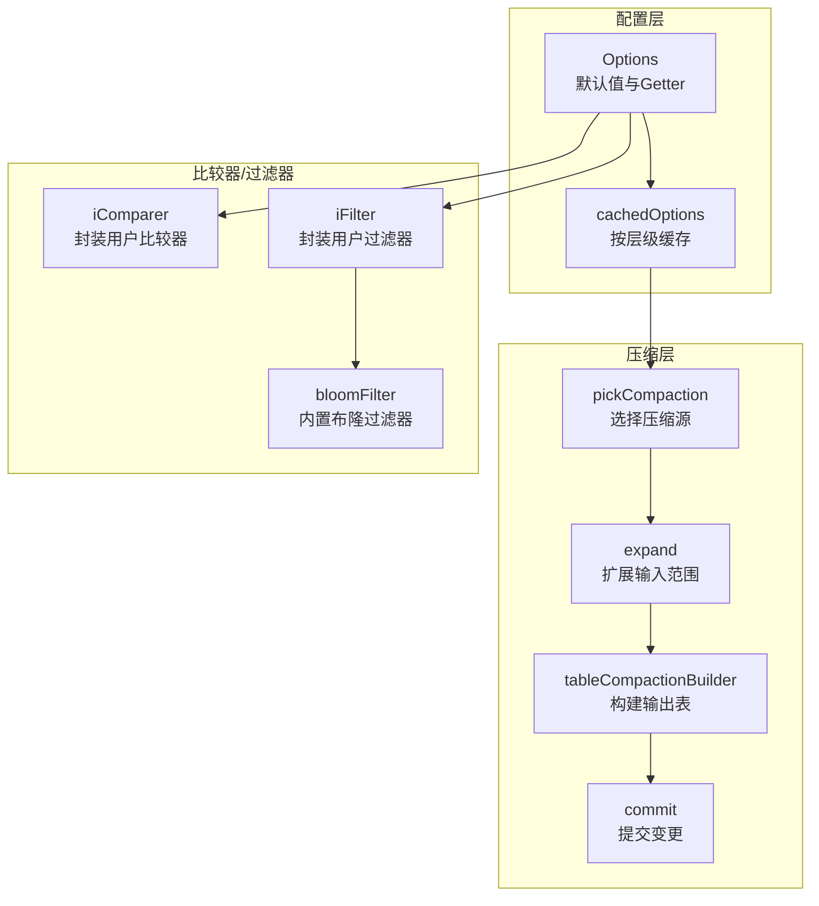
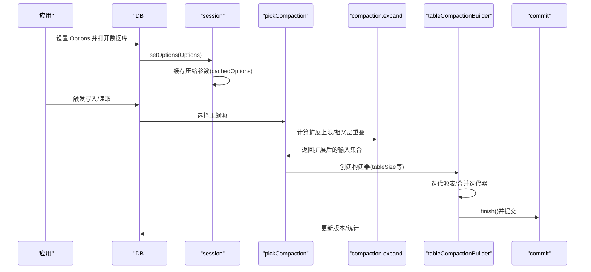
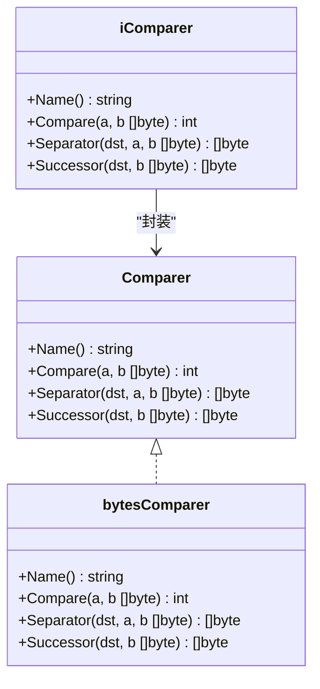
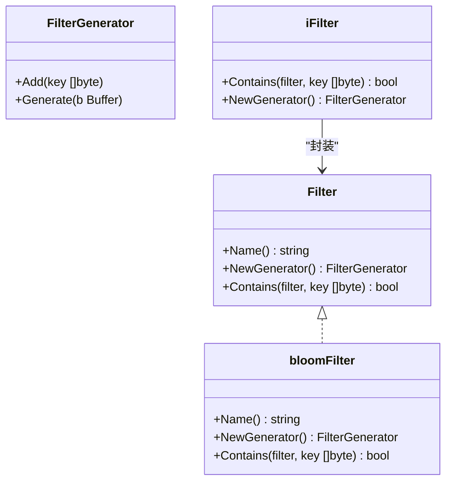
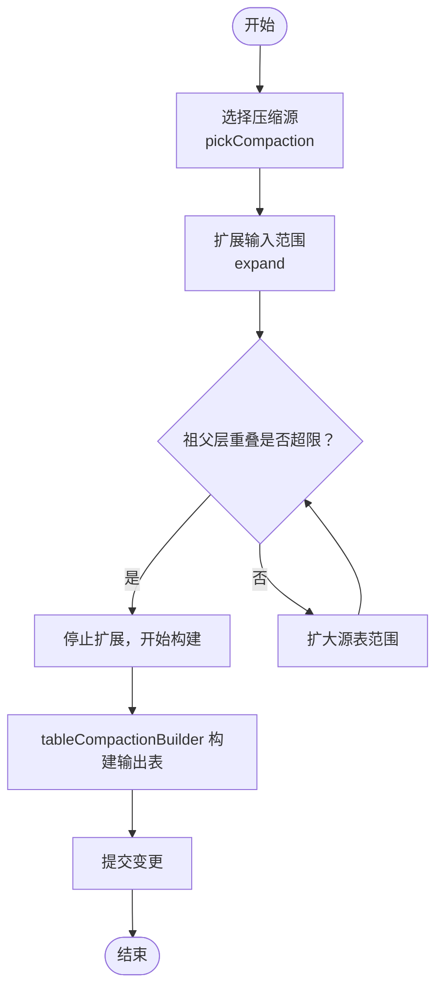
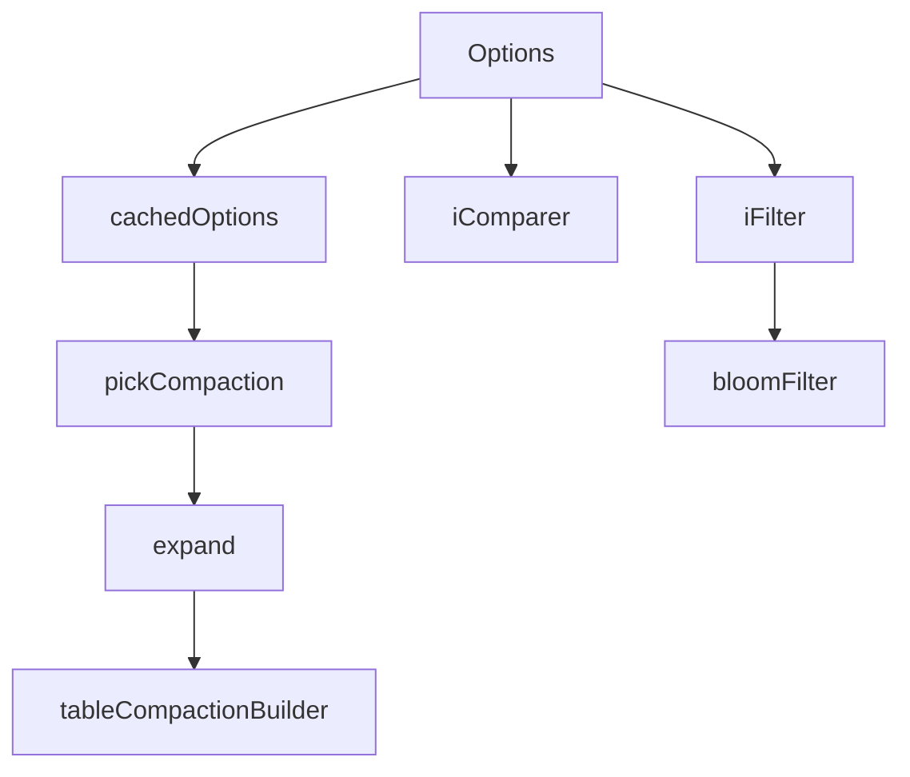

# 高级配置

<cite>
**本文引用的文件**
- [leveldb/opt/options.go](file://leveldb/opt/options.go)
- [leveldb/options.go](file://leveldb/options.go)
- [leveldb/db_compaction.go](file://leveldb/db_compaction.go)
- [leveldb/session_compaction.go](file://leveldb/session_compaction.go)
- [leveldb/comparer.go](file://leveldb/comparer.go)
- [leveldb/comparer/comparer.go](file://leveldb/comparer/comparer.go)
- [leveldb/comparer/bytes_comparer.go](file://leveldb/comparer/bytes_comparer.go)
- [leveldb/filter.go](file://leveldb/filter.go)
- [leveldb/filter/filter.go](file://leveldb/filter/filter.go)
- [leveldb/filter/bloom.go](file://leveldb/filter/bloom.go)
- [leveldb/version.go](file://leveldb/version.go)
- [leveldb/db_test.go](file://leveldb/db_test.go)
- [leveldb/mlsm_final_comprehensive_test.go](file://leveldb/mlsm_final_comprehensive_test.go)
</cite>

## 目录
1. [简介](#简介)
2. [项目结构](#项目结构)
3. [核心组件](#核心组件)
4. [架构总览](#架构总览)
5. [详细组件分析](#详细组件分析)
6. [依赖关系分析](#依赖关系分析)
7. [性能考量](#性能考量)
8. [故障排查指南](#故障排查指南)
9. [结论](#结论)
10. [附录](#附录)

## 简介
本文件面向需要精细化调优 avccDB 的高级用户，围绕压缩策略（Compaction 相关参数）、比较器（Comparer）、过滤器（Filter）等高级配置展开。重点解释 CompactionTableSize、CompactionL0Trigger 等参数如何影响数据库的压缩行为与性能，并提供自定义比较器与布隆过滤器的配置方法。同时给出大规模数据集的高级调优技巧、复杂配置组合示例与注意事项，帮助在生产环境中获得稳定且可预期的吞吐与延迟表现。

## 项目结构
与高级配置直接相关的模块主要集中在以下位置：
- 选项与默认值：leveldb/opt/options.go
- 会话与缓存选项：leveldb/options.go
- 压缩流程与触发：leveldb/db_compaction.go、leveldb/session_compaction.go
- 比较器接口与实现：leveldb/comparer.go、leveldb/comparer/comparer.go、leveldb/comparer/bytes_comparer.go
- 过滤器接口与布隆过滤器：leveldb/filter.go、leveldb/filter/filter.go、leveldb/filter/bloom.go
- 版本与压缩选择：leveldb/version.go
- 配置示例与测试：leveldb/db_test.go、leveldb/mlsm_final_comprehensive_test.go

图表来源
- [leveldb/opt/options.go](file://leveldb/opt/options.go#L176-L424)
- [leveldb/options.go](file://leveldb/options.go#L25-L108)
- [leveldb/session_compaction.go](file://leveldb/session_compaction.go#L56-L134)
- [leveldb/db_compaction.go](file://leveldb/db_compaction.go#L567-L629)
- [leveldb/comparer.go](file://leveldb/comparer.go#L13-L122)
- [leveldb/filter.go](file://leveldb/filter.go#L13-L32)
- [leveldb/filter/bloom.go](file://leveldb/filter/bloom.go#L106-L117)

章节来源
- [leveldb/opt/options.go](file://leveldb/opt/options.go#L176-L424)
- [leveldb/options.go](file://leveldb/options.go#L25-L108)

## 核心组件
- Options：集中定义所有可调参数，包括压缩相关（如 CompactionTableSize、CompactionL0Trigger、CompactionTotalSize 等）、比较器、过滤器、块缓存、压缩算法、严格模式等。
- cachedOptions：对压缩相关参数按层级进行预计算与缓存，避免每次读取时重复计算。
- iComparer/iFilter：在会话初始化时将用户提供的 Comparer/Filter 封装为内部实现，确保与内部键格式兼容。
- 压缩流程：从 pickCompaction 选择源文件，expand 扩展输入范围，tableCompactionBuilder 构建输出表，最后 commit 提交。

章节来源
- [leveldb/opt/options.go](file://leveldb/opt/options.go#L176-L424)
- [leveldb/options.go](file://leveldb/options.go#L25-L108)
- [leveldb/comparer.go](file://leveldb/comparer.go#L13-L122)
- [leveldb/filter.go](file://leveldb/filter.go#L13-L32)
- [leveldb/session_compaction.go](file://leveldb/session_compaction.go#L56-L134)
- [leveldb/db_compaction.go](file://leveldb/db_compaction.go#L567-L629)

## 架构总览
下图展示压缩参数如何贯穿到压缩选择与执行的关键路径。

图表来源
- [leveldb/options.go](file://leveldb/options.go#L25-L108)
- [leveldb/session_compaction.go](file://leveldb/session_compaction.go#L56-L134)
- [leveldb/db_compaction.go](file://leveldb/db_compaction.go#L567-L629)

## 详细组件分析

### 压缩策略配置（Compaction 参数）
- CompactionTableSize：控制压缩生成的单表大小。默认 2MiB；可通过 CompactionTableSizeMultiplier 或每层乘数进行层级化调整。
- CompactionTableSizeMultiplier：全局乘数，用于按层级指数增长表大小。
- CompactionTableSizeMultiplierPerLevel：逐层乘数，可为某些层级设置不同倍率，或用 0 跳过该层。
- CompactionTotalSize：每层总大小上限，按层级指数增长，决定何时触发压缩。
- CompactionTotalSizeMultiplier/PerLevel：与 TotalSize 对应的全局与逐层乘数。
- CompactionL0Trigger：L0 文件数量达到该阈值时触发压缩。
- CompactionSourceLimitFactor：非 L0 源文件大小上限因子，限制一次压缩的源文件总量。
- CompactionExpandLimitFactor：扩展后目标层表大小上限因子，限制 expand 后的输入范围。
- CompactionGPOverlapsFactor：与“祖父层”重叠字节数上限因子，用于控制输出表的重叠风险。
- IteratorSamplingRate：迭代器采样率，用于“寻址触发压缩”的启发式判断。
- DisableSeeksCompaction：禁用“寻址触发压缩”，避免过多小压缩。
- DisableCompactionBackoff：禁用压缩重试退避，便于测试或特殊场景。

这些参数通过 Options.Get* 方法统一读取，并由 cachedOptions 在会话中按层级缓存，减少运行时计算开销。

章节来源
- [leveldb/opt/options.go](file://leveldb/opt/options.go#L215-L281)
- [leveldb/opt/options.go](file://leveldb/opt/options.go#L470-L541)
- [leveldb/options.go](file://leveldb/options.go#L48-L108)
- [leveldb/session_compaction.go](file://leveldb/session_compaction.go#L112-L134)
- [leveldb/db_compaction.go](file://leveldb/db_compaction.go#L601-L603)

### CompactionTableSize 与 CompactionL0Trigger 的影响与调优
- CompactionTableSize
  - 较小表：增加压缩次数，降低单次压缩成本，但会提高元数据与索引开销；适合高并发写入、频繁合并的场景。
  - 较大表：减少压缩次数，提升读放大与写放大之间的平衡，适合顺序写入、批量导入。
  - 层级化乘数：通过 PerLevel 为不同层级设置不同大小，可实现“上层更大、下层更小”的分层策略，平衡读取与写入。
- CompactionL0Trigger
  - 较小触发阈值：更快将 L0 数据下沉到 L1，降低 L0 压力，但可能引发频繁 L0 压缩。
  - 较大触发阈值：允许更多 L0 表存在，配合 WriteL0SlowdownTrigger/WriteL0PauseTrigger 控制写入节奏，避免写入雪崩。
- 实战建议
  - 写入密集型：适当降低 CompactionL0Trigger，增大 CompactionTableSize，减少 L0 压缩频率。
  - 读取密集型：适度增大 CompactionTableSize，结合较大的 CompactionTotalSize，提升 L1+ 层容量。
  - 大规模批量导入：先临时增大 CompactionTableSize 与 TotalSize，导入后再恢复默认，避免中间态导致的过度压缩。

章节来源
- [leveldb/opt/options.go](file://leveldb/opt/options.go#L228-L281)
- [leveldb/db_compaction.go](file://leveldb/db_compaction.go#L601-L603)
- [leveldb/session_compaction.go](file://leveldb/session_compaction.go#L112-L134)

### 比较器（Comparer）
- 接口与默认实现
  - Comparer 定义了键的全序关系、名称、以及用于索引优化的 Separator/Successor。
  - 默认 bytesComparer 使用字节序比较，名称为“leveldb.BytewiseComparator”，并提供合理的 Separator/Successor。
- 内部封装
  - iComparer 在会话中封装用户提供的 Comparer，内部键解析后仅对用户键部分进行比较，保证版本号与序列号的正确排序。
- 自定义比较器
  - 实现 Comparer 接口（Name/Compare/Separator/Successor），并在 Options 中设置 Comparer 字段。
  - 注意：一旦数据库创建后，比较器不可更改，否则打开会失败。

图表来源
- [leveldb/comparer/comparer.go](file://leveldb/comparer/comparer.go#L11-L58)
- [leveldb/comparer/bytes_comparer.go](file://leveldb/comparer/bytes_comparer.go#L1-L52)
- [leveldb/comparer.go](file://leveldb/comparer.go#L13-L122)

章节来源
- [leveldb/comparer/comparer.go](file://leveldb/comparer/comparer.go#L11-L58)
- [leveldb/comparer/bytes_comparer.go](file://leveldb/comparer/bytes_comparer.go#L1-L52)
- [leveldb/comparer.go](file://leveldb/comparer.go#L13-L122)

### 过滤器（Filter）与布隆过滤器
- 接口与内置实现
  - Filter 定义名称、生成器与 Contains 判断。
  - 内置 NewBloomFilter(bitsPerKey) 返回布隆过滤器实例，Name 固定为“leveldb.BuiltinBloomFilter”。
- 内部封装
  - iFilter 在会话中封装用户提供的 Filter，确保对内部键的用户键部分进行判断。
- 自定义过滤器
  - 实现 Filter 接口（Name/NewGenerator/Contains），并在 Options 中设置 Filter 字段。
  - 可同时设置 AltFilters，作为备用过滤器，过渡期间避免缺失过滤器导致的读放大。
- 布隆过滤器参数
  - bitsPerKey 会影响误判率与过滤器体积，参数持久化，可向后兼容。

图表来源
- [leveldb/filter/filter.go](file://leveldb/filter/filter.go#L16-L61)
- [leveldb/filter/bloom.go](file://leveldb/filter/bloom.go#L106-L117)
- [leveldb/filter.go](file://leveldb/filter.go#L13-L32)

章节来源
- [leveldb/filter/filter.go](file://leveldb/filter/filter.go#L16-L61)
- [leveldb/filter/bloom.go](file://leveldb/filter/bloom.go#L13-L117)
- [leveldb/filter.go](file://leveldb/filter.go#L13-L32)

### 压缩选择与执行流程
- 选择压缩源
  - 若 cScore >= 1，选择当前得分最高的层级作为源；否则若存在“寻址触发压缩”，则选择特定表。
- 扩展输入范围
  - 根据 CompactionExpandLimitFactor 与目标层表大小上限，扩展源表范围，尽量覆盖连续区间。
  - 计算“祖父层”重叠字节数，超过 CompactionGPOverlapsFactor 上限则停止，避免输出表过大。
- 构建输出表
  - 使用 tableCompactionBuilder 迭代源表，按用户键去重并保留最新版本；根据 tableSize 分割输出表。
- 提交变更
  - 事务式提交，支持回滚与重试；记录压缩统计与性能指标。

图表来源
- [leveldb/session_compaction.go](file://leveldb/session_compaction.go#L56-L134)
- [leveldb/db_compaction.go](file://leveldb/db_compaction.go#L567-L629)

章节来源
- [leveldb/session_compaction.go](file://leveldb/session_compaction.go#L196-L291)
- [leveldb/db_compaction.go](file://leveldb/db_compaction.go#L567-L629)

### 复杂配置组合示例与注意事项
- 示例一：面向大规模写入的紧凑型配置
  - 目标：降低 L0 压缩压力，提升写入吞吐。
  - 配置要点：降低 CompactionL0Trigger，适当增大 CompactionTableSize 与 CompactionTotalSize，必要时关闭压缩以简化调试。
  - 参考路径：[示例配置片段](file://leveldb/mlsm_final_comprehensive_test.go#L42-L51)
- 示例二：面向批量导入的宽松配置
  - 目标：快速导入大量数据，避免中间态引发的频繁压缩。
  - 配置要点：临时增大 CompactionTableSize 与 CompactionTotalSize，导入完成后恢复默认。
  - 参考路径：[批量导入测试片段](file://leveldb/db_test.go#L2592-L2600)
- 示例三：自定义比较器与过滤器
  - 目标：按业务键语义排序与高效过滤。
  - 配置要点：实现 Comparer/Filter 接口，设置到 Options；注意数据库创建后不可更改比较器。
  - 参考路径：[比较器接口](file://leveldb/comparer/comparer.go#L11-L58)、[过滤器接口](file://leveldb/filter/filter.go#L16-L61)

注意事项
- 比较器不可更改：数据库创建后若更换比较器，打开会失败。
- 过滤器兼容性：布隆过滤器参数持久化，可向后兼容；切换过滤器时建议将旧过滤器加入 AltFilters。
- 层级化乘数：PerLevel 为 0 表示跳过该层，需谨慎设置以免出现空层。
- 寻址触发压缩：开启后可减少读取时的“级别查找”，但可能导致大量小压缩，需权衡。

章节来源
- [leveldb/mlsm_final_comprehensive_test.go](file://leveldb/mlsm_final_comprehensive_test.go#L42-L51)
- [leveldb/db_test.go](file://leveldb/db_test.go#L2592-L2600)
- [leveldb/comparer/comparer.go](file://leveldb/comparer/comparer.go#L11-L58)
- [leveldb/filter/filter.go](file://leveldb/filter/filter.go#L16-L61)

## 依赖关系分析
- Options 与 cachedOptions
  - Options 提供参数 Getter，cachedOptions 将压缩相关参数按层级缓存，减少重复计算。
- 压缩流程依赖
  - pickCompaction 依赖 cachedOptions 的层级上限；expand 依赖 ExpandLimit/GPOverlaps；tableCompactionBuilder 依赖 tableSize 与 strict 模式。
- 比较器/过滤器封装
  - setOptions 将用户 Comparer/Filter 封装为 iComparer/iFilter，注入到 session 中。

图表来源
- [leveldb/opt/options.go](file://leveldb/opt/options.go#L470-L541)
- [leveldb/options.go](file://leveldb/options.go#L48-L108)
- [leveldb/session_compaction.go](file://leveldb/session_compaction.go#L196-L291)
- [leveldb/db_compaction.go](file://leveldb/db_compaction.go#L567-L629)
- [leveldb/comparer.go](file://leveldb/comparer.go#L13-L122)
- [leveldb/filter.go](file://leveldb/filter.go#L13-L32)

章节来源
- [leveldb/opt/options.go](file://leveldb/opt/options.go#L470-L541)
- [leveldb/options.go](file://leveldb/options.go#L48-L108)
- [leveldb/session_compaction.go](file://leveldb/session_compaction.go#L196-L291)
- [leveldb/db_compaction.go](file://leveldb/db_compaction.go#L567-L629)
- [leveldb/comparer.go](file://leveldb/comparer.go#L13-L122)
- [leveldb/filter.go](file://leveldb/filter.go#L13-L32)

## 性能考量
- 写入放大与读取放大
  - 减小 CompactionTableSize 与 CompactionTotalSize 会增加压缩次数，降低单次压缩成本，但可能提升读放大。
  - 增大表大小与总上限有利于减少压缩次数，但会增加单次压缩成本与磁盘占用。
- L0 压力控制
  - 通过 CompactionL0Trigger、WriteL0SlowdownTrigger、WriteL0PauseTrigger 协同控制 L0 压力，避免写入雪崩。
- 过滤器误判率
  - 布隆过滤器的 bitsPerKey 影响误判率与体积，需结合访问模式与存储预算权衡。
- 压缩重试与退避
  - 默认启用压缩重试退避，有助于应对瞬时 IO 错误；在测试或特殊场景可禁用。

[本节为通用指导，无需列出具体文件来源]

## 故障排查指南
- 打不开数据库（比较器不匹配）
  - 现象：打开数据库时报错，提示比较器不一致。
  - 排查：确认数据库创建时使用的 Comparer 名称与当前配置一致。
  - 参考路径：[比较器接口文档说明](file://leveldb/comparer/comparer.go#L20-L37)
- 过滤器缺失导致读放大
  - 现象：Get/迭代读取变慢。
  - 排查：检查 Filter 是否设置；如切换过滤器，将旧过滤器加入 AltFilters。
  - 参考路径：[Options.Filter 文档说明](file://leveldb/opt/options.go#L338-L351)
- 压缩频繁或停滞
  - 现象：压缩过于频繁或长时间不触发。
  - 排查：调整 CompactionL0Trigger、CompactionTableSize、CompactionTotalSize 与 PerLevel 乘数；必要时禁用“寻址触发压缩”。
  - 参考路径：[压缩参数说明](file://leveldb/opt/options.go#L215-L281)
- 压缩错误与重试
  - 现象：压缩过程中出现瞬时 IO 错误。
  - 排查：观察压缩重试日志；确认 DisableCompactionBackoff 是否被禁用；必要时启用严格模式以提前暴露问题。
  - 参考路径：[压缩重试与错误处理](file://leveldb/db_compaction.go#L141-L235)

章节来源
- [leveldb/comparer/comparer.go](file://leveldb/comparer/comparer.go#L20-L37)
- [leveldb/opt/options.go](file://leveldb/opt/options.go#L338-L351)
- [leveldb/opt/options.go](file://leveldb/opt/options.go#L215-L281)
- [leveldb/db_compaction.go](file://leveldb/db_compaction.go#L141-L235)

## 结论
通过对压缩参数、比较器与过滤器的系统化配置，可以在不同工作负载下取得更优的吞吐与延迟表现。建议在生产环境采用渐进式调优策略：先确定写入/读取模式，再微调 CompactionTableSize、L0 触发阈值与总上限，最后引入自定义比较器与布隆过滤器，并通过 AltFilters 平滑过渡。同时，关注压缩重试、严格模式与层级化乘数的副作用，确保系统稳定性与可维护性。

[本节为总结性内容，无需列出具体文件来源]

## 附录
- 常用参数速查
  - CompactionTableSize/Multiplier/PerLevel：控制单表大小与层级化增长
  - CompactionTotalSize/Multiplier/PerLevel：控制每层总容量
  - CompactionL0Trigger：L0 触发压缩阈值
  - CompactionSourceLimitFactor/ExpandLimitFactor/GPOverlapsFactor：限制源文件与扩展范围
  - IteratorSamplingRate/DisableSeeksCompaction：寻址触发压缩相关
  - Comparer/Filter/AltFilters：自定义排序与过滤策略
- 测试参考
  - 大规模写入与压缩验证：[测试片段](file://leveldb/mlsm_final_comprehensive_test.go#L42-L51)
  - 批量导入与表大小控制：[测试片段](file://leveldb/db_test.go#L2592-L2600)

[本节为补充信息，无需列出具体文件来源]