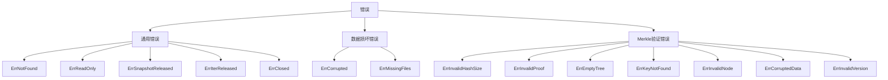
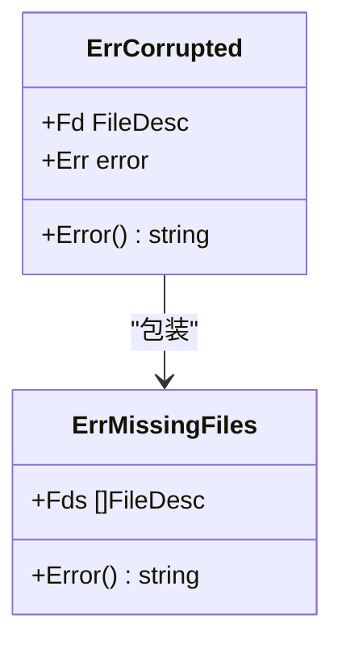
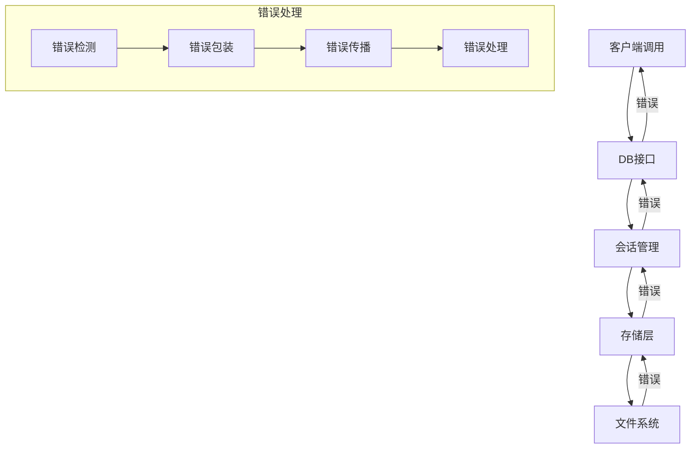
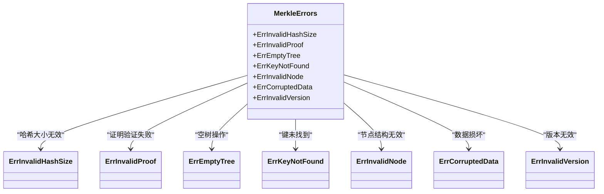
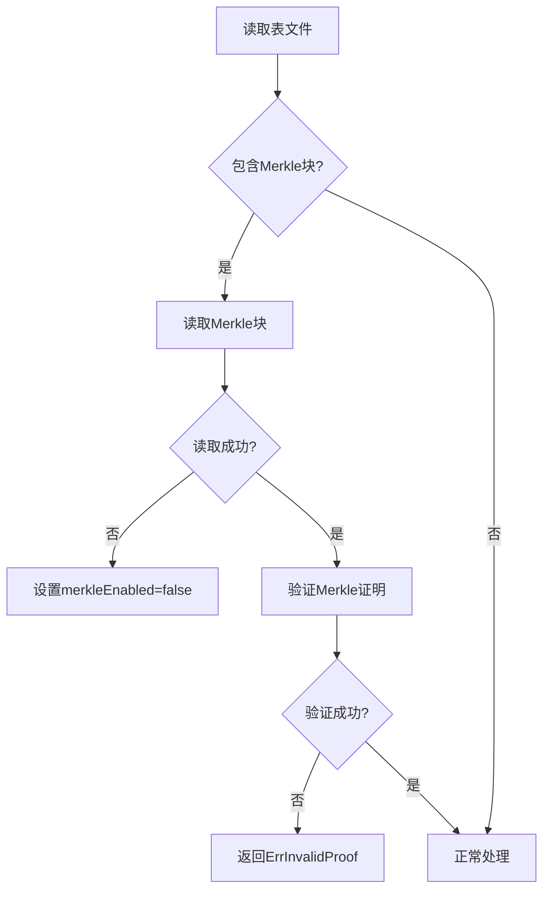
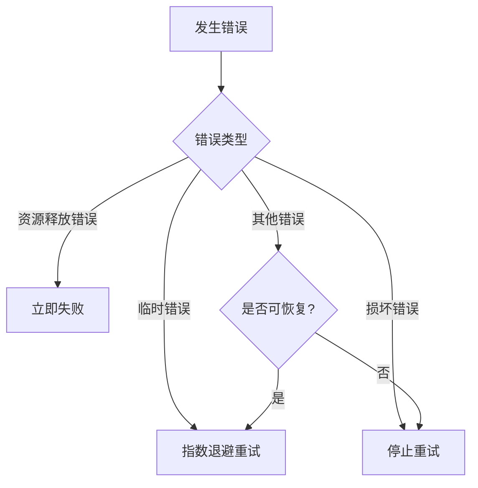

# 错误处理接口

<cite>
**本文档中引用的文件**
- [errors.go](file://leveldb/errors.go)
- [errors/errors.go](file://leveldb/errors/errors.go)
- [merkle/errors.go](file://leveldb/merkle/errors.go)
- [db.go](file://leveldb/db.go)
- [db_compaction.go](file://leveldb/db_compaction.go)
- [table/reader.go](file://leveldb/table/reader.go)
- [storage/storage.go](file://leveldb/storage/storage.go)
- [util/util.go](file://leveldb/util/util.go)
</cite>

## 目录
1. [简介](#简介)
2. [核心错误类型](#核心错误类型)
3. [错误分类体系](#错误分类体系)
4. [错误传播机制](#错误传播机制)
5. [错误判断辅助函数](#错误判断辅助函数)
6. [Merkle验证相关错误](#merkle验证相关错误)
7. [错误处理最佳实践](#错误处理最佳实践)
8. [错误日志与监控](#错误日志与监控)
9. [模式与反模式](#模式与反模式)

## 简介
avccDB的错误处理系统设计用于提供健壮、可诊断和可恢复的数据库操作。该系统通过清晰的错误分类、详细的错误信息和结构化的错误处理机制，确保数据库在各种异常情况下能够正确响应并提供足够的诊断信息。本API参考文档详细记录了所有自定义错误类型、错误分类体系、错误传播机制以及最佳实践，帮助开发者构建可靠的错误处理逻辑。

## 核心错误类型

avccDB定义了一系列核心错误类型，用于表示数据库操作中的各种异常情况。这些错误类型分为通用错误、数据损坏错误和Merkle验证相关错误三大类。

### 通用错误类型
通用错误类型表示数据库操作中的常见异常情况：

- **ErrNotFound**: 当请求的键不存在时返回
- **ErrReadOnly**: 当在只读模式下尝试写操作时返回
- **ErrSnapshotReleased**: 当访问已释放的快照时返回
- **ErrIterReleased**: 当使用已释放的迭代器时返回
- **ErrClosed**: 当对已关闭的数据库实例进行操作时返回

### 数据损坏错误类型
数据损坏错误类型用于表示数据库文件或数据结构的损坏情况：

- **ErrCorrupted**: 包装表示数据库损坏的错误，包含文件描述符和底层错误信息
- **ErrMissingFiles**: 表示由于缺少文件导致的损坏，总是被ErrCorrupted包装

### Merkle验证相关错误
Merkle验证相关的错误类型定义在`leveldb/merkle`包中，用于处理Merkle树相关的异常：

- **ErrInvalidHashSize**: 当哈希大小无效时返回
- **ErrInvalidProof**: 当Merkle证明验证失败时返回
- **ErrEmptyTree**: 当对空Merkle树进行操作时返回
- **ErrKeyNotFound**: 当在树中找不到键时返回
- **ErrInvalidNode**: 当节点结构损坏时返回
- **ErrCorruptedData**: 当数据损坏时返回
- **ErrInvalidVersion**: 当版本号无效时返回

**Section sources**
- [errors.go](file://leveldb/errors.go#L14-L20)
- [errors/errors.go](file://leveldb/errors/errors.go#L18-L23)
- [merkle/errors.go](file://leveldb/merkle/errors.go#L10-L31)

## 错误分类体系

avccDB的错误分类体系采用分层结构，将错误分为不同的类别，便于错误处理和诊断。

### 错误类别层次


**Diagram sources**
- [errors.go](file://leveldb/errors.go#L14-L20)
- [errors/errors.go](file://leveldb/errors/errors.go#L18-L23)
- [merkle/errors.go](file://leveldb/merkle/errors.go#L10-L31)

### 错误包装机制
avccDB采用错误包装机制来提供更丰富的错误信息。`ErrCorrupted`类型包含文件描述符(Fd)和底层错误(Err)，使得错误信息既包含具体的错误原因，又包含发生错误的文件上下文。



**Diagram sources**
- [errors/errors.go](file://leveldb/errors/errors.go#L32-L47)

## 错误传播机制

avccDB的错误传播机制设计用于在系统各组件之间正确传递错误信息，同时保持错误的语义和上下文。

### 错误传播路径


**Diagram sources**
- [db.go](file://leveldb/db.go#L351-L353)
- [db_compaction.go](file://leveldb/db_compaction.go#L95-L97)

### 严格模式与非严格模式
avccDB在错误处理中区分严格模式和非严格模式。在非严格模式下，某些损坏错误可能被忽略以尝试恢复数据；而在严格模式下，任何损坏错误都会导致操作失败。

```go
// 在非严格模式下，忽略损坏错误
if err != nil && !errors.IsCorrupted(err) {
    return err
}
```

**Section sources**
- [db.go](file://leveldb/db.go#L351-L353)
- [db_compaction.go](file://leveldb/db_compaction.go#L95-L97)

## 错误判断辅助函数

avccDB提供了一系列辅助函数来帮助开发者判断错误类型和进行错误处理。

### IsCorrupted函数
`IsCorrupted`函数用于判断一个错误是否表示数据损坏。这是错误处理中的关键函数，用于区分可恢复错误和不可恢复错误。

```mermaid
flowchart TD
A[IsCorrupted(err)] --> B{错误类型}
B --> |*ErrCorrupted| C[返回true]
B --> |*storage.ErrCorrupted| D[返回true]
B --> |其他类型| E[返回false]
```

**Diagram sources**
- [errors/errors.go](file://leveldb/errors/errors.go#L51-L58)

### SetFd函数
`SetFd`函数用于为错误设置文件信息，主要用于`ErrCorrupted`类型的错误，以便在错误信息中包含发生错误的文件上下文。

```go
// 为错误设置文件描述符
func SetFd(err error, fd storage.FileDesc) error {
    switch x := err.(type) {
    case *ErrCorrupted:
        x.Fd = fd
        return x
    default:
        return err
    }
}
```

**Section sources**
- [errors/errors.go](file://leveldb/errors/errors.go#L71-L78)

## Merkle验证相关错误

Merkle验证相关的错误类型专门用于处理Merkle树结构的验证和操作异常。

### Merkle错误类型


**Diagram sources**
- [merkle/errors.go](file://leveldb/merkle/errors.go#L10-L31)

### Merkle错误处理流程


**Section sources**
- [table/reader.go](file://leveldb/table/reader.go#L1252-L1263)

## 错误处理最佳实践

### 重试策略
avccDB的重试策略基于错误类型和上下文：



**Section sources**
- [db_compaction.go](file://leveldb/db_compaction.go#L176-L233)

### 故障恢复
故障恢复策略包括：

1. **数据恢复**: 尝试从损坏的表文件中恢复可用数据
2. **状态重建**: 从日志和快照重建数据库状态
3. **降级操作**: 在非严格模式下继续操作，忽略某些损坏

```go
// 在表恢复过程中处理损坏错误
if strict && (tcorruptedKey > 0 || tcorruptedBlock > 0) {
    droppedTable++
    return nil
}
```

**Section sources**
- [db.go](file://leveldb/db.go#L433-L437)

## 错误日志与监控

### 错误日志记录
avccDB在关键操作点记录详细的错误日志：

```go
// 记录块损坏信息
if errors.IsCorrupted(err) {
    s.logf("table@recovery block corruption @%d %q", fd.Num, err)
    tcorruptedBlock++
}
```

**Section sources**
- [db.go](file://leveldb/db.go#L398-L402)

### 监控建议
1. **关键错误监控**: 监控`ErrCorrupted`等严重错误
2. **错误率监控**: 跟踪各类错误的发生频率
3. **错误上下文收集**: 收集错误相关的文件和操作信息

## 模式与反模式

### 推荐模式
```mermaid
flowchart TD
A[检查错误] --> B{IsCorrupted(err)?}
B --> |是| C[记录详细信息]
B --> |否| D{是否可恢复?}
D --> |是| E[尝试恢复]
D --> |否| F[向上抛出]
C --> G[决定处理策略]
G --> H{严格模式?}
H --> |是| I[停止操作]
H --> |否| J[尝试继续]
```

### 反模式
1. **忽略损坏错误**: 在严格模式下忽略`ErrCorrupted`错误
2. **过度重试**: 对不可恢复错误进行无限重试
3. **丢失上下文**: 处理错误时丢失原始错误信息

**Section sources**
- [db.go](file://leveldb/db.go#L351-L353)
- [db_compaction.go](file://leveldb/db_compaction.go#L95-L97)
- [table/reader.go](file://leveldb/table/reader.go#L1236-L1238)