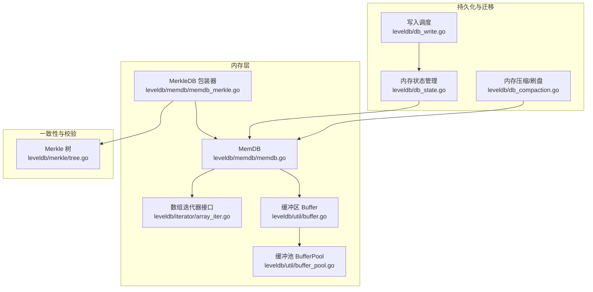
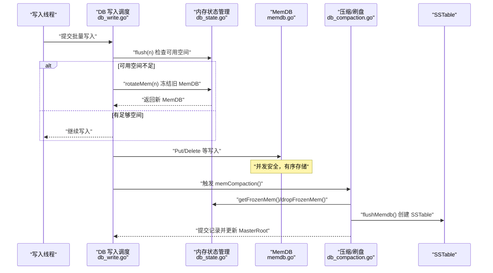
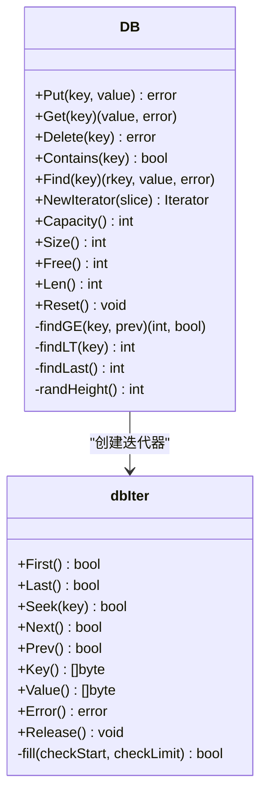
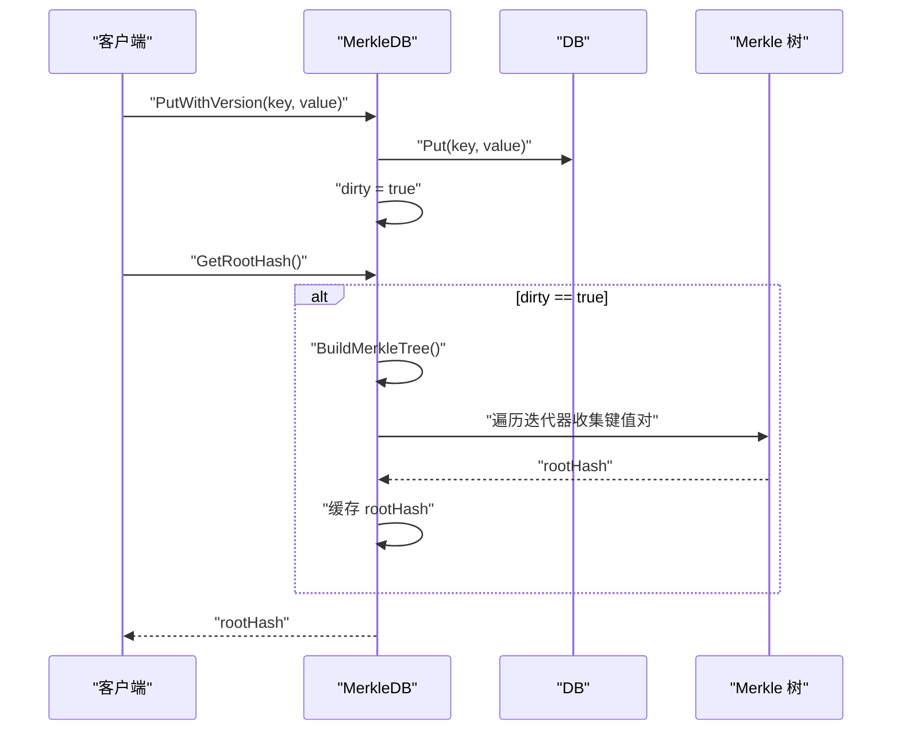
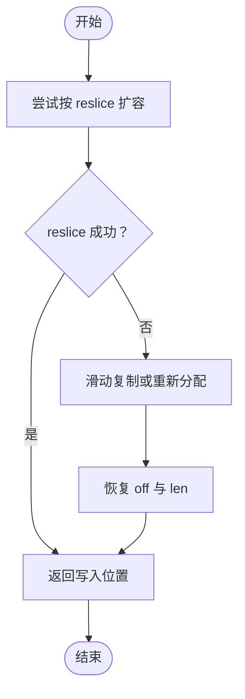
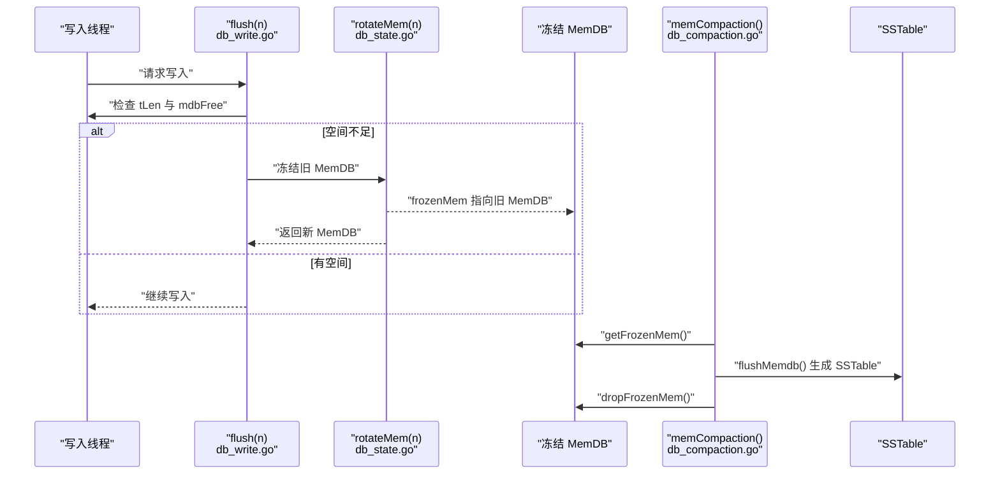
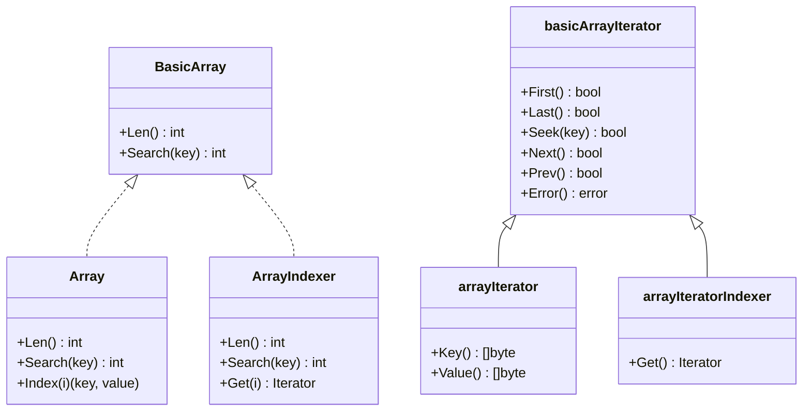
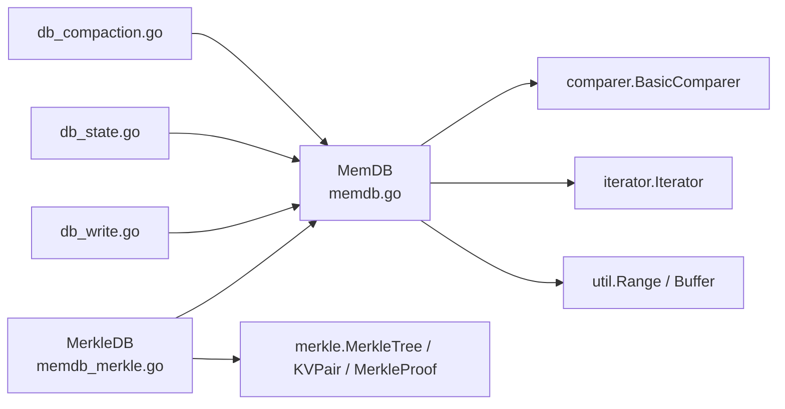

# 内存数据结构

<cite>
**本文引用的文件列表**
- [memdb.go](file://leveldb/memdb/memdb.go)
- [memdb_merkle.go](file://leveldb/memdb/memdb_merkle.go)
- [buffer.go](file://leveldb/util/buffer.go)
- [buffer_pool.go](file://leveldb/util/buffer_pool.go)
- [array_iter.go](file://leveldb/iterator/array_iter.go)
- [tree.go](file://leveldb/merkle/tree.go)
- [db_write.go](file://leveldb/db_write.go)
- [db_compaction.go](file://leveldb/db_compaction.go)
- [db_state.go](file://leveldb/db_state.go)
</cite>

## 目录
1. [引言](#引言)
2. [项目结构](#项目结构)
3. [核心组件](#核心组件)
4. [架构总览](#架构总览)
5. [详细组件分析](#详细组件分析)
6. [依赖关系分析](#依赖关系分析)
7. [性能考量](#性能考量)
8. [故障排查指南](#故障排查指南)
9. [结论](#结论)
10. [附录](#附录)

## 引言
本文件系统性阐述 avccDB 中内存数据库（MemDB）的实现机制，重点围绕以下方面：
- 基于跳表（Skip List）的数据结构设计，如何保证键的有序存储与高效插入、查找。
- MemDB 与 Merkle 树的集成（memdb_merkle.go），在每次写入时动态维护 Merkle 根哈希，确保内存中数据的完整性可验证。
- 内存管理策略：缓冲区（buffer.go）的复用机制与内存分配优化。
- 作为写入前缓存的角色，以及在刷新到 SSTable 时的数据迁移过程。
- 迭代器（array_iter.go）的实现，支持有序遍历。

## 项目结构
MemDB 所在目录为 leveldb/memdb，配合 util、iterator、merkle 等模块共同完成内存键值存储、迭代与 Merkle 验证；同时通过 db_write.go、db_compaction.go、db_state.go 实现从内存到磁盘的迁移与管理。

图表来源
- [memdb.go](file://leveldb/memdb/memdb.go#L180-L480)
- [memdb_merkle.go](file://leveldb/memdb/memdb_merkle.go#L1-L181)
- [array_iter.go](file://leveldb/iterator/array_iter.go#L1-L182)
- [buffer.go](file://leveldb/util/buffer.go#L1-L315)
- [buffer_pool.go](file://leveldb/util/buffer_pool.go#L1-L136)
- [tree.go](file://leveldb/merkle/tree.go#L1-L286)
- [db_write.go](file://leveldb/db_write.go#L1-L200)
- [db_compaction.go](file://leveldb/db_compaction.go#L269-L404)
- [db_state.go](file://leveldb/db_state.go#L120-L237)

章节来源
- [memdb.go](file://leveldb/memdb/memdb.go#L180-L480)
- [memdb_merkle.go](file://leveldb/memdb/memdb_merkle.go#L1-L181)
- [buffer.go](file://leveldb/util/buffer.go#L1-L315)
- [buffer_pool.go](file://leveldb/util/buffer_pool.go#L1-L136)
- [array_iter.go](file://leveldb/iterator/array_iter.go#L1-L182)
- [tree.go](file://leveldb/merkle/tree.go#L1-L286)
- [db_write.go](file://leveldb/db_write.go#L1-L200)
- [db_compaction.go](file://leveldb/db_compaction.go#L269-L404)
- [db_state.go](file://leveldb/db_state.go#L120-L237)

## 核心组件
- MemDB（跳表实现）：提供键值对的有序存储、并发安全的插入/删除/查询、容量统计与重置。
- MerkleDB（包装器）：在 MemDB 基础上增加 Merkle 树构建与根哈希缓存，支持按需重建与证明生成。
- 缓冲区与缓冲池：通过 Buffer 与 BufferPool 提升内存分配效率，减少频繁分配带来的 GC 压力。
- 迭代器：提供有序遍历能力，支持 First/Last/Seek/Next/Prev 等操作。
- 刷盘与迁移：通过写入调度、冻结内存数据库、触发压缩与创建 SSTable 完成从内存到磁盘的迁移。

章节来源
- [memdb.go](file://leveldb/memdb/memdb.go#L273-L480)
- [memdb_merkle.go](file://leveldb/memdb/memdb_merkle.go#L1-L181)
- [buffer.go](file://leveldb/util/buffer.go#L1-L315)
- [buffer_pool.go](file://leveldb/util/buffer_pool.go#L1-L136)
- [array_iter.go](file://leveldb/iterator/array_iter.go#L1-L182)
- [db_compaction.go](file://leveldb/db_compaction.go#L269-L404)
- [db_state.go](file://leveldb/db_state.go#L120-L237)

## 架构总览
MemDB 作为写入前缓存驻留于内存，负责高并发下的快速读写与有序存储；当达到阈值或需要持久化时，由写入调度与压缩流程将其冻结并刷盘为 SSTable。同时，MerkleDB 在写入路径上维护 Merkle 树，确保数据完整性可验证。

图表来源
- [db_write.go](file://leveldb/db_write.go#L66-L131)
- [db_state.go](file://leveldb/db_state.go#L120-L237)
- [db_compaction.go](file://leveldb/db_compaction.go#L269-L404)
- [memdb.go](file://leveldb/memdb/memdb.go#L273-L480)

## 详细组件分析

### 跳表式 MemDB 数据结构与并发控制
- 结构组成
  - kvData：连续字节缓冲区，顺序存放所有键值对（追加只增不减）。
  - nodeData：节点元数据数组，每条记录包含：
    - KV 偏移、键长、值长、高度、多层 next 指针。
  - prevNode：用于查找插入位置的辅助数组。
  - maxHeight：当前最大高度，随随机高度增长而更新。
  - n、kvSize：条目数与键值总长度（删除不回收缓冲区）。
  - RWMutex：读写锁保护并发访问。
- 键有序性
  - 通过 findGE/findLT/findLast 等方法沿高层向右搜索，遇键相等则定位到目标节点；否则在下降过程中记录前驱节点，最终在第 0 层确定插入点。
- 插入/删除/查找
  - Put：若键存在则覆盖值；否则生成随机高度，扩展 prevNode 并更新各层 next 指针，同时在 kvData 追加键值。
  - Delete：定位后沿各层跳过该节点，更新前驱 next 指针，不释放 kvData 空间。
  - Get/Contains/Find：仅读锁，沿高层搜索，O(log n) 平均时间复杂度。
- 并发与安全
  - 读写分离：读操作使用 RLock，写操作使用 Lock。
  - 迭代器 dbIter：持有 DB 指针与范围切片，内部通过 RLock 保护遍历期间的可见性。
- 统计与重置
  - Capacity/Size/Free/Len：提供容量、已用空间、剩余空间与条目数。
  - Reset：重置状态并复用缓冲区，保留预分配容量。

图表来源
- [memdb.go](file://leveldb/memdb/memdb.go#L180-L480)

章节来源
- [memdb.go](file://leveldb/memdb/memdb.go#L201-L315)
- [memdb.go](file://leveldb/memdb/memdb.go#L317-L480)

### Merkle 树集成与根哈希维护
- 设计要点
  - MerkleDB 包装 DB，新增 tree/dirty/rootHash 字段，支持按需重建 Merkle 树。
  - 写入路径：Put/PutWithVersion 先写入底层 DB，再标记 dirty=true。
  - 读取路径：GetRootHash/GetWithProof 在 dirty 时重建树并缓存根哈希。
- 树构建
  - BuildMerkleTree：遍历 DB 的迭代器收集键值对，调用 merkle.BuildFromSorted 构建树，设置 rootHash 并清空 dirty。
- 证明生成
  - GetWithProof：确保树已构建，调用 merkle.GenerateProof 返回 MerkleProof。
- 统计信息
  - GetMerkleStats：返回树统计、根哈希、脏标记与条目数。

图表来源
- [memdb_merkle.go](file://leveldb/memdb/memdb_merkle.go#L1-L181)
- [tree.go](file://leveldb/merkle/tree.go#L1-L286)

章节来源
- [memdb_merkle.go](file://leveldb/memdb/memdb_merkle.go#L1-L181)
- [tree.go](file://leveldb/merkle/tree.go#L1-L286)

### 内存管理策略：缓冲区复用与分配优化
- Buffer（leveldb/util/buffer.go）
  - 追加只增不减的字节缓冲，提供 tryGrowByReslice/grow 两种扩容策略，优先通过 reslice 扩容以避免复制；必要时进行滑动复制或重新分配。
  - 支持 Alloc/Grow/Write/ReadFrom 等常用 I/O 接口，适合大块数据拼接场景。
- BufferPool（leveldb/util/buffer_pool.go）
  - 多级 sync.Pool 池，按容量基线分档，减少频繁分配与 GC 压力。
  - Get/Put 统计命中情况（小于/等于/大于期望容量、miss 等），便于监控与调优。
- MemDB 对缓冲区的使用
  - kvData 采用追加策略，删除不回收空间，Reset 可复用缓冲区，降低分配成本。
  - nodeData 以固定字段布局存储节点元信息，next 指针按高度动态扩展。

图表来源
- [buffer.go](file://leveldb/util/buffer.go#L66-L128)
- [buffer_pool.go](file://leveldb/util/buffer_pool.go#L1-L136)
- [memdb.go](file://leveldb/memdb/memdb.go#L441-L480)

章节来源
- [buffer.go](file://leveldb/util/buffer.go#L1-L315)
- [buffer_pool.go](file://leveldb/util/buffer_pool.go#L1-L136)
- [memdb.go](file://leveldb/memdb/memdb.go#L441-L480)

### 作为写入前缓存的角色与数据迁移
- 写入前缓存
  - DB 写入路径：写入调度器根据 L0 表数量与 MemDB 可用空间决定是否冻结当前 MemDB 或继续写入。
  - 当可用空间不足或达到暂停阈值时，触发 rotateMem 冻结旧 MemDB，创建新的 MemDB。
- 刷新到 SSTable
  - 触发 memCompaction 后，从冻结的 MemDB 中读取数据，逐条写入 SSTable，完成后丢弃冻结 MemDB 并更新 MasterRoot。
- 版本化写入
  - MerkleDB 的 PutWithVersion 将版本号信息交由批处理层编码到内部键，写入后标记 dirty，后续按需重建 Merkle 树。

图表来源
- [db_write.go](file://leveldb/db_write.go#L66-L131)
- [db_state.go](file://leveldb/db_state.go#L120-L237)
- [db_compaction.go](file://leveldb/db_compaction.go#L269-L404)

章节来源
- [db_write.go](file://leveldb/db_write.go#L1-L200)
- [db_state.go](file://leveldb/db_state.go#L120-L237)
- [db_compaction.go](file://leveldb/db_compaction.go#L269-L404)

### 迭代器实现：有序遍历
- 数组迭代器接口
  - BasicArray/Array/ArrayIndexer 定义了基本长度、索引与搜索能力。
- 基础迭代器
  - basicArrayIterator：维护当前位置与错误状态，支持 First/Last/Seek/Next/Prev。
  - arrayIterator：在基础迭代器之上按需加载 key/value。
  - arrayIteratorIndexer：按索引返回子迭代器。
- MemDB 迭代器
  - dbIter：持有 DB 指针与 Range 切片，利用 nodeData 的 next 指针顺序遍历，支持正向/反向移动与边界检查。

图表来源
- [array_iter.go](file://leveldb/iterator/array_iter.go#L1-L182)

章节来源
- [array_iter.go](file://leveldb/iterator/array_iter.go#L1-L182)
- [memdb.go](file://leveldb/memdb/memdb.go#L28-L172)

## 依赖关系分析
- MemDB 依赖
  - comperer：比较器接口，用于键排序与查找。
  - iterator：迭代器接口，用于遍历。
  - util：缓冲区与 Range 结构，支撑 kvData 与迭代器范围切片。
- MerkleDB 依赖
  - merkle：MerkleTree、KVPair、MerkleProof 等，用于树构建与证明生成。
- 写入与刷盘链路
  - db_write.go：写入调度与空间检查。
  - db_state.go：冻结/获取 MemDB、创建新 MemDB。
  - db_compaction.go：冻结 MemDB 的刷盘流程与 SSTable 生成。

图表来源
- [memdb.go](file://leveldb/memdb/memdb.go#L1-L60)
- [memdb_merkle.go](file://leveldb/memdb/memdb_merkle.go#L1-L60)
- [db_write.go](file://leveldb/db_write.go#L1-L60)
- [db_state.go](file://leveldb/db_state.go#L120-L180)
- [db_compaction.go](file://leveldb/db_compaction.go#L269-L330)

章节来源
- [memdb.go](file://leveldb/memdb/memdb.go#L1-L60)
- [memdb_merkle.go](file://leveldb/memdb/memdb_merkle.go#L1-L60)
- [db_write.go](file://leveldb/db_write.go#L1-L60)
- [db_state.go](file://leveldb/db_state.go#L120-L180)
- [db_compaction.go](file://leveldb/db_compaction.go#L269-L330)

## 性能考量
- 时间复杂度
  - 查找/插入/删除：平均 O(log n)，最坏 O(n)。
  - 迭代：O(k) 遍历 k 个条目。
- 空间复杂度
  - kvData 追加只增不减，删除不回收；Reset 可复用缓冲区。
  - nodeData 每节点固定字段+高度数组，空间开销与条目数和高度相关。
- 并发与锁粒度
  - 读写分离，读路径无写锁竞争；写路径短时持有写锁。
- 内存分配优化
  - Buffer/BufferPool 降低频繁分配与复制，提升大块数据拼接效率。
- 刷盘与压缩
  - 写入调度与冻结策略避免 L0 表堆积；压缩阶段按范围选择落盘层级，减少后续合并压力。

[本节为通用性能讨论，无需列出具体文件来源]

## 故障排查指南
- 迭代器释放错误
  - dbIter 在释放后仍被使用会返回 ErrIterReleased，应确保迭代器在使用完毕后调用 Release。
- 未找到键
  - Get/Find 在不存在时返回 ErrNotFound，确认键是否存在可通过 Contains 或先执行 Find。
- 删除失败
  - Delete 对不存在键返回 ErrNotFound，检查键是否已存在。
- Merkle 根哈希为空
  - 若未构建树或树为空，GetRootHash 返回零哈希；先调用 Put/PutWithVersion 再构建树。
- 证明生成异常
  - GetWithProof 在树为空时返回错误；确保树已构建后再生成证明。
- 写入阻塞或延迟
  - flush 流程可能因 L0 表过多或空间不足而延迟；检查写入速率与阈值配置。

章节来源
- [memdb.go](file://leveldb/memdb/memdb.go#L20-L40)
- [memdb.go](file://leveldb/memdb/memdb.go#L317-L386)
- [memdb_merkle.go](file://leveldb/memdb/memdb_merkle.go#L108-L148)
- [db_write.go](file://leveldb/db_write.go#L66-L131)

## 结论
MemDB 通过跳表实现键有序存储与高效并发访问，结合缓冲区与缓冲池优化内存分配；MerkleDB 在写入路径上维护 Merkle 树，确保数据完整性可验证。写入前缓存与刷盘流程协同工作，将内存中的数据稳定迁移到磁盘 SSTable，形成完整的 LSM-Tree 写入链路。迭代器提供稳定的有序遍历能力，满足查询与导出需求。

[本节为总结性内容，无需列出具体文件来源]

## 附录
- 关键 API 与路径参考
  - MemDB 插入/删除/查询：[memdb.go](file://leveldb/memdb/memdb.go#L273-L386)
  - MemDB 迭代器创建与遍历：[memdb.go](file://leveldb/memdb/memdb.go#L388-L410)
  - MerkleDB 写入与根哈希：[memdb_merkle.go](file://leveldb/memdb/memdb_merkle.go#L42-L124)
  - Merkle 树构建与证明：[memdb_merkle.go](file://leveldb/memdb/memdb_merkle.go#L58-L148), [tree.go](file://leveldb/merkle/tree.go#L1-L120)
  - 缓冲区与缓冲池：[buffer.go](file://leveldb/util/buffer.go#L66-L128), [buffer_pool.go](file://leveldb/util/buffer_pool.go#L1-L136)
  - 写入调度与冻结：[db_write.go](file://leveldb/db_write.go#L66-L131), [db_state.go](file://leveldb/db_state.go#L120-L237)
  - 刷盘与压缩：[db_compaction.go](file://leveldb/db_compaction.go#L269-L404)