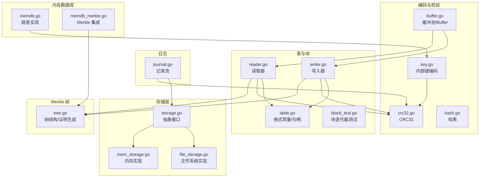
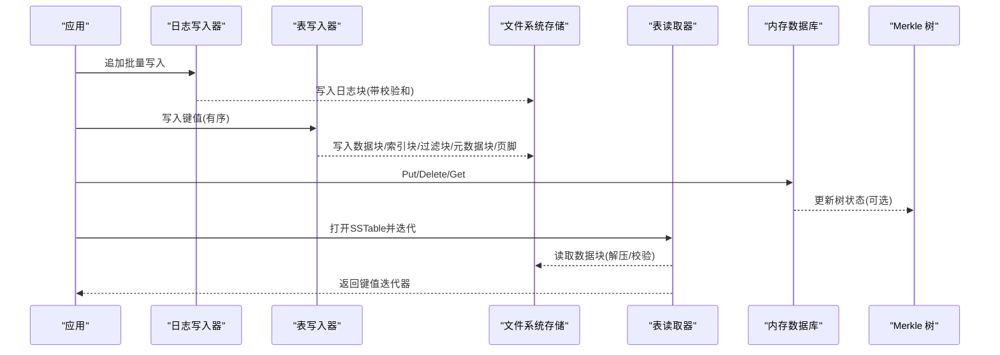
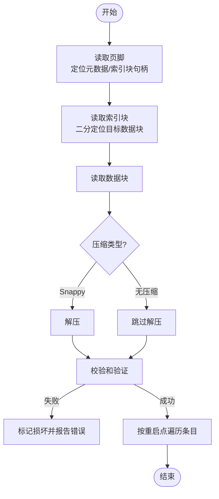
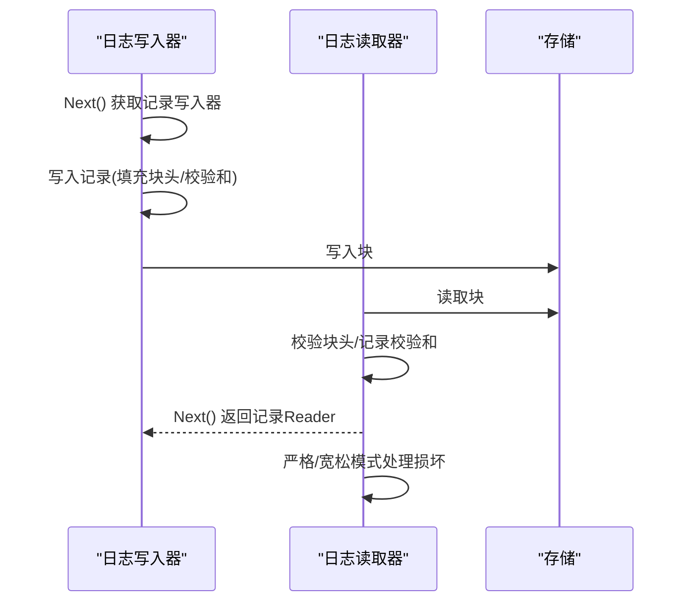
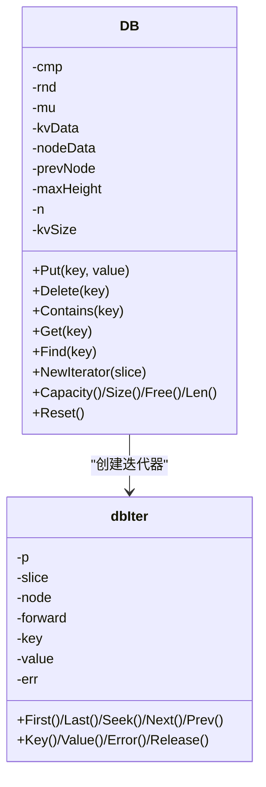
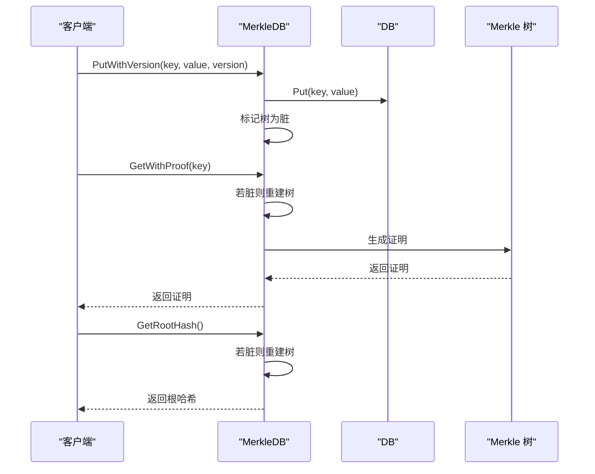
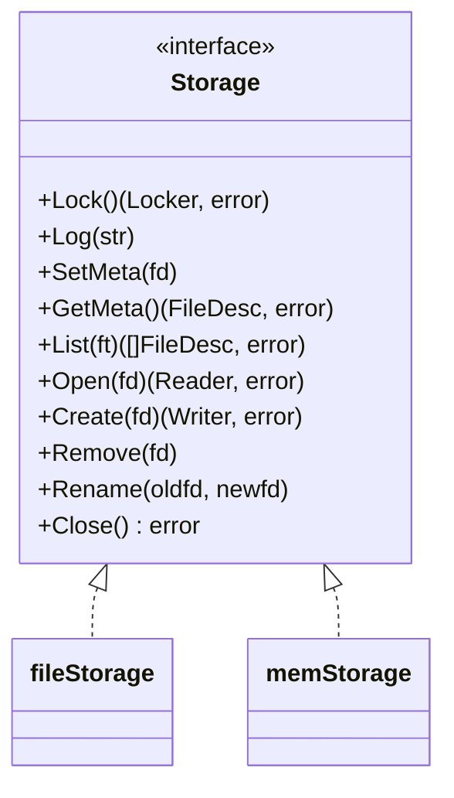
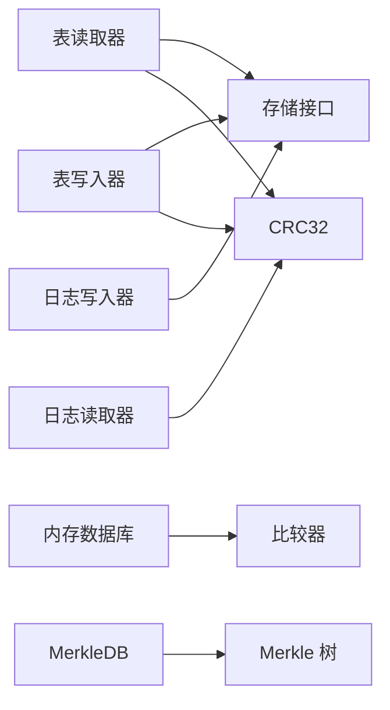

# 内部实现

<cite>
**本文引用的文件**
- [journal.go](file://leveldb/journal/journal.go)
- [memdb.go](file://leveldb/memdb/memdb.go)
- [memdb_merkle.go](file://leveldb/memdb/memdb_merkle.go)
- [storage.go](file://leveldb/storage/storage.go)
- [file_storage.go](file://leveldb/storage/file_storage.go)
- [mem_storage.go](file://leveldb/storage/mem_storage.go)
- [table.go](file://leveldb/table/table.go)
- [reader.go](file://leveldb/table/reader.go)
- [writer.go](file://leveldb/table/writer.go)
- [block_test.go](file://leveldb/table/block_test.go)
- [key.go](file://leveldb/key.go)
- [crc32.go](file://leveldb/util/crc32.go)
- [hash.go](file://leveldb/util/hash.go)
- [buffer.go](file://leveldb/util/buffer.go)
- [tree.go](file://leveldb/merkle/tree.go)
- [file_storage_test.go](file://leveldb/storage/file_storage_test.go)
- [memdb_test.go](file://leveldb/memdb/memdb_test.go)
</cite>

## 目录
1. [简介](#简介)
2. [项目结构](#项目结构)
3. [核心组件](#核心组件)
4. [架构总览](#架构总览)
5. [详细组件分析](#详细组件分析)
6. [依赖关系分析](#依赖关系分析)
7. [性能考量](#性能考量)
8. [故障排查指南](#故障排查指南)
9. [结论](#结论)
10. [附录](#附录)

## 简介
本技术文档面向希望深入理解 avccDB 底层实现的高级用户与贡献者，系统性解析以下关键机制：
- SSTable 文件格式、块结构与索引机制
- 日志（Journal）的持久化与恢复流程
- 内存数据库（MemDB）的跳表实现与 Merkle 树集成
- 存储抽象层（storage.go）对文件与内存存储的支持及跨平台差异
- 数据编码（key.go）、压缩（Snappy）与校验和（CRC32）等底层细节

## 项目结构
仓库采用按功能域分层组织：核心引擎位于 leveldb 目录，包含存储、表读写、内存数据库、日志、工具库与 Merkle 树等模块；cmd 与 manualtest 提供示例与手动测试工具；testutil 提供统一的测试基础设施。

图表来源
- [storage.go](file://leveldb/storage/storage.go#L1-L189)
- [file_storage.go](file://leveldb/storage/file_storage.go#L1-L680)
- [mem_storage.go](file://leveldb/storage/mem_storage.go#L1-L222)
- [table.go](file://leveldb/table/table.go#L1-L174)
- [writer.go](file://leveldb/table/writer.go#L1-L490)
- [reader.go](file://leveldb/table/reader.go#L1-L800)
- [memdb.go](file://leveldb/memdb/memdb.go#L1-L480)
- [memdb_merkle.go](file://leveldb/memdb/memdb_merkle.go#L1-L181)
- [journal.go](file://leveldb/journal/journal.go#L1-L537)
- [key.go](file://leveldb/key.go#L1-L197)
- [crc32.go](file://leveldb/util/crc32.go#L1-L31)
- [hash.go](file://leveldb/util/hash.go#L1-L49)
- [buffer.go](file://leveldb/util/buffer.go#L1-L315)
- [tree.go](file://leveldb/merkle/tree.go#L1-L286)

章节来源
- [storage.go](file://leveldb/storage/storage.go#L1-L189)
- [table.go](file://leveldb/table/table.go#L1-L174)

## 核心组件
- 存储抽象层：定义统一的文件操作接口，屏蔽文件系统与内存实现差异，提供锁、元数据管理、列表、打开/创建/删除/重命名等能力。
- 表与块：SSTable 文件格式规范，块内键值条目共享前缀、重启点索引，尾部包含重启点偏移数组与校验和；索引块记录数据块起止键或分隔键。
- 内存数据库：基于跳表的有序键值存储，支持并发读写、范围迭代与容量统计；可选集成 Merkle 树以生成根哈希与证明。
- 日志：记录流（journal）以固定块大小分块，每块含多个紧密打包的记录，记录带校验和，支持严格/宽松模式与丢弃回调。
- 编码与校验：内部键编码包含用户键、版本号、序列号与类型；使用 CRC32（Castagnoli 多项式）进行块与记录校验；提供通用哈希函数。

章节来源
- [storage.go](file://leveldb/storage/storage.go#L1-L189)
- [table.go](file://leveldb/table/table.go#L1-L174)
- [memdb.go](file://leveldb/memdb/memdb.go#L1-L480)
- [memdb_merkle.go](file://leveldb/memdb/memdb_merkle.go#L1-L181)
- [journal.go](file://leveldb/journal/journal.go#L1-L537)
- [key.go](file://leveldb/key.go#L1-L197)
- [crc32.go](file://leveldb/util/crc32.go#L1-L31)
- [hash.go](file://leveldb/util/hash.go#L1-L49)

## 架构总览
下图展示从应用到磁盘的关键路径：写入通过日志追加与表写入器生成 SSTable，读取通过表读取器定位数据块并解压/校验，内存数据库提供快速查询与可选 Merkle 根哈希。

图表来源
- [journal.go](file://leveldb/journal/journal.go#L343-L537)
- [writer.go](file://leveldb/table/writer.go#L178-L449)
- [reader.go](file://leveldb/table/reader.go#L568-L800)
- [memdb.go](file://leveldb/memdb/memdb.go#L273-L386)
- [memdb_merkle.go](file://leveldb/memdb/memdb_merkle.go#L58-L124)

## 详细组件分析

### SSTable 文件格式与块结构（table.go、reader.go、writer.go）
- 文件布局
  - 数据块：包含键值条目，条目共享前缀，重启点索引用于二分查找；块尾部包含重启点偏移数组与重启点数量。
  - 索引块：记录数据块的分隔键或最后键，重启间隔为 1，便于快速定位目标数据块。
  - 过滤块：可选，按 baseLg 划分键区间生成过滤器，加速不存在键的判定。
  - 元数据块：记录过滤器名称与对应块句柄，以及可选的 Merkle 树块句柄。
  - 页脚：包含元数据块与索引块句柄，以及魔数。
- 压缩与校验
  - 块尾部包含压缩类型与校验和；支持无压缩与 Snappy 压缩；校验和覆盖除校验和外的所有字节。
- 读取流程
  - 读取页脚定位元数据块与索引块；根据用户键在索引块中二分定位目标数据块；读取数据块后解压与校验；利用重启点与共享前缀高效遍历条目。
- 写入流程
  - 按块大小阈值累积键值，构建数据块；同时维护索引块分隔键；写入过滤块；写入元数据块（含过滤器句柄与可选 Merkle 句柄）；写入索引块；写入页脚。

图表来源
- [table.go](file://leveldb/table/table.go#L144-L174)
- [reader.go](file://leveldb/table/reader.go#L568-L714)
- [writer.go](file://leveldb/table/writer.go#L178-L260)

章节来源
- [table.go](file://leveldb/table/table.go#L1-L174)
- [reader.go](file://leveldb/table/reader.go#L1-L800)
- [writer.go](file://leveldb/table/writer.go#L1-L490)
- [block_test.go](file://leveldb/table/block_test.go#L1-L140)

### 索引机制（索引块与分隔键）
- 索引块的键是相邻数据块之间的分隔键或最后一个数据块的最后键，重启间隔为 1，便于二分查找。
- 写入时通过比较器计算分隔键或后继键，确保键序正确；读取时使用二分搜索定位目标重启点，再线性扫描至目标条目。

章节来源
- [writer.go](file://leveldb/table/writer.go#L211-L236)
- [reader.go](file://leveldb/table/reader.go#L61-L91)

### 日志（Journal）持久化与恢复
- 记录流格式
  - 固定 32KB 块；每块包含多个记录，记录头包含校验和、长度与类型（全记录、首块、中间块、末块）。
  - 支持严格模式（遇到损坏直接停止）与宽松模式（跳过损坏块），并可通过 Dropper 回调报告被丢弃的块。
- 写入流程
  - Writer 将记录写入缓冲，当缓冲满或需要切换块时填充块头并写入块；支持 Flush 与 Close。
- 读取流程
  - Reader 逐块扫描，校验块头与记录校验和；遇到损坏块按策略移动到下一个块；Next 返回单个记录的 Reader。

图表来源
- [journal.go](file://leveldb/journal/journal.go#L343-L537)

章节来源
- [journal.go](file://leveldb/journal/journal.go#L1-L537)

### 内存数据库（MemDB）与跳表实现
- 跳表结构
  - 使用多层链表实现有序插入与查找；节点数组存储键值偏移、键长、值长、高度与各层后继指针。
  - 插入时随机高度，更新各层前驱指针；删除时沿各层删除对应指针；Get/Contains/Find 在只读锁下执行。
- 并发控制
  - 读写分离：读操作使用 RWMutex 的读锁；写操作使用互斥锁。
- 迭代器
  - dbIter 实现双向迭代与范围切片，支持 First/Last/Seek/Next/Prev 等操作。
- 统计与容量
  - 提供容量、大小、空闲空间、条目数量等统计方法。

图表来源
- [memdb.go](file://leveldb/memdb/memdb.go#L182-L480)

章节来源
- [memdb.go](file://leveldb/memdb/memdb.go#L1-L480)
- [memdb_test.go](file://leveldb/memdb/memdb_test.go#L1-L134)

### MemDB 与 Merkle 树集成（memdb_merkle.go）
- MerkleDB 包装 DB，在 Put/迭代等操作上透明扩展 Merkle 功能。
- 树构建策略
  - 当脏标志为真时，遍历当前所有键值对，构建有序 KV 对列表，使用 Merkle 构建器生成树，缓存根哈希。
- 查询与证明
  - GetWithProof 生成存在/不存在证明；GetRootHash 返回当前根哈希；GetMerkleStats 返回树统计信息。
- 版本化支持
  - 提供 PutWithVersion 接口，内部键编码包含版本号字段，便于后续版本化查询与证明。

图表来源
- [memdb_merkle.go](file://leveldb/memdb/memdb_merkle.go#L1-L181)
- [tree.go](file://leveldb/merkle/tree.go#L1-L286)
- [key.go](file://leveldb/key.go#L90-L146)

章节来源
- [memdb_merkle.go](file://leveldb/memdb/memdb_merkle.go#L1-L181)
- [tree.go](file://leveldb/merkle/tree.go#L1-L286)
- [key.go](file://leveldb/key.go#L1-L197)

### 存储抽象层（storage.go）与跨平台差异
- 抽象接口
  - Storage 定义锁、日志、元数据、文件列表、打开/创建/删除/重命名与关闭等方法。
  - FileDesc 描述文件类型与编号，支持字符串化与有效性检查。
- 文件系统实现（file_storage.go）
  - 支持 LOCK 文件锁、CURRENT/CURRENT.bak 与 CURRENT.<num> 的“待重命名”文件策略，自动选择最新有效元数据。
  - LOG 日志轮转与时间戳记录；对 MANIFEST 文件写入后同步父目录以提升可靠性。
  - 文件名解析与兼容旧后缀（如 .sst -> .ldb）。
- 内存实现（mem_storage.go）
  - 基于内存映射的文件集合，提供与文件系统一致的接口，便于测试与临时场景。
- 跨平台差异
  - 通过条件编译文件（如 file_storage_windows.go 等）适配不同平台的文件锁与系统调用。

图表来源
- [storage.go](file://leveldb/storage/storage.go#L1-L189)
- [file_storage.go](file://leveldb/storage/file_storage.go#L1-L680)
- [mem_storage.go](file://leveldb/storage/mem_storage.go#L1-L222)

章节来源
- [storage.go](file://leveldb/storage/storage.go#L1-L189)
- [file_storage.go](file://leveldb/storage/file_storage.go#L1-L680)
- [mem_storage.go](file://leveldb/storage/mem_storage.go#L1-L222)
- [file_storage_test.go](file://leveldb/storage/file_storage_test.go#L1-L403)

### 数据编码（key.go）
- 内部键结构
  - 非版本化：用户键 + 8 字节序列号+类型（低 8 位为类型，其余为序列号）。
  - 版本化：用户键 + 8 字节版本号 + 8 字节序列号+类型。
- 解析与断言
  - 提供解析函数与断言，确保内部键长度与类型合法；支持提取版本号与判断是否包含版本。
- 用途
  - 作为 SSTable 内部键编码基础，配合比较器排序；在 MemDB 中用于版本化键存储与查询。

章节来源
- [key.go](file://leveldb/key.go#L1-L197)

### 压缩（Snappy）与校验和（CRC32）
- 压缩
  - 表写入器在启用 Snappy 压缩时，先计算最大可能压缩长度，再调用编码器写入压缩块与块尾部。
- 校验和
  - 使用 Castagnoli 多项式计算 CRC32；块与记录均包含校验和，写入时写入 4 字节校验和，读取时进行一致性校验。
- 哈希
  - 提供通用哈希函数（类似 Murmur），用于 Bloom 过滤器等场景。

章节来源
- [writer.go](file://leveldb/table/writer.go#L178-L209)
- [reader.go](file://leveldb/table/reader.go#L568-L606)
- [crc32.go](file://leveldb/util/crc32.go#L1-L31)
- [hash.go](file://leveldb/util/hash.go#L1-L49)

### 工具与缓冲（buffer.go）
- Buffer 提供可增长的字节缓冲区，支持分配、写入、读取、复制与重置；在写入器与读取器中广泛使用，减少内存分配与拷贝。
- BufferPool 用于复用缓冲区，降低 GC 压力。

章节来源
- [buffer.go](file://leveldb/util/buffer.go#L1-L315)
- [writer.go](file://leveldb/table/writer.go#L1-L120)
- [reader.go](file://leveldb/table/reader.go#L1-L120)

## 依赖关系分析
- 组件耦合
  - 表读取器依赖存储 ReaderAt 接口与比较器；写入器依赖比较器、过滤器与选项；日志读写器依赖存储与校验和。
  - MemDB 依赖比较器与迭代器接口；MerkleDB 依赖 Merkle 树实现。
- 外部依赖
  - Snappy 压缩库用于 SSTable 压缩；标准库 hash/crc32 用于校验。
- 循环依赖
  - 代码未发现循环导入；接口与实现清晰分离。

图表来源
- [reader.go](file://leveldb/table/reader.go#L568-L800)
- [writer.go](file://leveldb/table/writer.go#L178-L449)
- [journal.go](file://leveldb/journal/journal.go#L343-L537)
- [memdb.go](file://leveldb/memdb/memdb.go#L182-L480)
- [memdb_merkle.go](file://leveldb/memdb/memdb_merkle.go#L1-L181)

章节来源
- [reader.go](file://leveldb/table/reader.go#L1-L800)
- [writer.go](file://leveldb/table/writer.go#L1-L490)
- [journal.go](file://leveldb/journal/journal.go#L1-L537)
- [memdb.go](file://leveldb/memdb/memdb.go#L1-L480)
- [memdb_merkle.go](file://leveldb/memdb/memdb_merkle.go#L1-L181)

## 性能考量
- 压缩与校验
  - 合理设置块大小与重启间隔，平衡查找效率与压缩比；Snappy 压缩在写入阶段带来 CPU 开销，但显著降低磁盘占用。
- 内存数据库
  - 跳表高度与随机层数影响查找复杂度；建议在高并发读场景下使用只读锁保护迭代器生命周期。
- 存储层
  - 文件系统实现中对 MANIFEST 写入后的目录同步可提高崩溃安全性；日志轮转避免单文件过大。
- Merkle 树
  - 树重建成本较高，应结合脏标志与懒加载策略；仅在需要证明或根哈希时触发重建。

## 故障排查指南
- 日志损坏
  - 严格模式下损坏会直接报错；宽松模式会跳过损坏块并继续读取。可通过 Dropper 回调观察被丢弃的块与原因。
- 表损坏
  - 校验和不匹配会返回损坏错误；检查页脚、索引块与数据块的完整性。
- 存储元数据异常
  - CURRENT/CURRENT.bak 与 CURRENT.<num> 的优先级与恢复逻辑可导致元数据不一致；确认目标文件是否存在且可访问。
- 内存数据库
  - 迭代器释放后继续使用会返回已释放错误；注意迭代器生命周期与并发安全。

章节来源
- [journal.go](file://leveldb/journal/journal.go#L162-L214)
- [reader.go](file://leveldb/table/reader.go#L550-L566)
- [file_storage_test.go](file://leveldb/storage/file_storage_test.go#L108-L212)
- [memdb.go](file://leveldb/memdb/memdb.go#L1-L120)

## 结论
avccDB 的底层实现围绕“可靠持久化 + 高效检索”的目标展开：通过严格的块与记录校验、可选的压缩与索引机制，确保 SSTable 的一致性与性能；借助日志保障写入原子性与可恢复性；内存数据库提供快速查询与可选的 Merkle 树证明能力；存储抽象层统一了文件与内存实现，兼顾跨平台与可靠性。整体设计在工程实践中具备良好的可维护性与扩展性。

## 附录
- 关键实现路径参考
  - 表写入：[writer.go](file://leveldb/table/writer.go#L262-L449)
  - 表读取：[reader.go](file://leveldb/table/reader.go#L568-L800)
  - 日志读写：[journal.go](file://leveldb/journal/journal.go#L343-L537)
  - 内存数据库：[memdb.go](file://leveldb/memdb/memdb.go#L273-L480)
  - Merkle 集成：[memdb_merkle.go](file://leveldb/memdb/memdb_merkle.go#L58-L181)
  - 存储抽象：[storage.go](file://leveldb/storage/storage.go#L140-L189)
  - 文件存储：[file_storage.go](file://leveldb/storage/file_storage.go#L448-L680)
  - 内存存储：[mem_storage.go](file://leveldb/storage/mem_storage.go#L94-L171)
  - 内部键编码：[key.go](file://leveldb/key.go#L75-L146)
  - 校验与哈希：[crc32.go](file://leveldb/util/crc32.go#L1-L31)、[hash.go](file://leveldb/util/hash.go#L1-L49)
  - 缓冲工具：[buffer.go](file://leveldb/util/buffer.go#L1-L315)