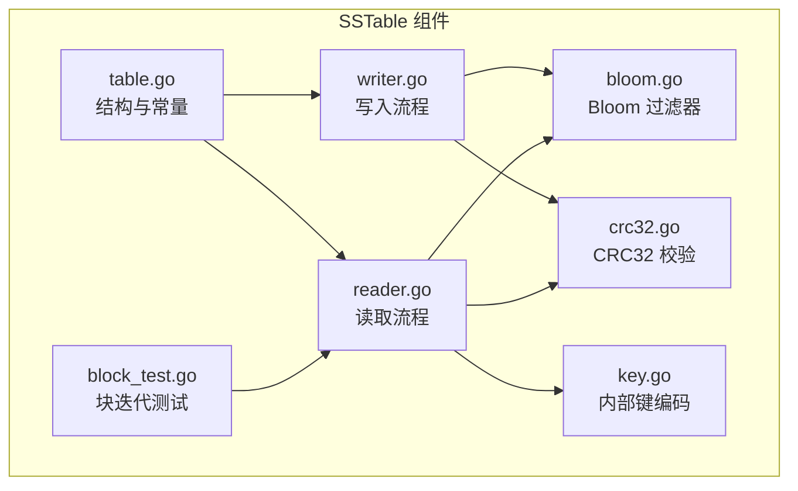
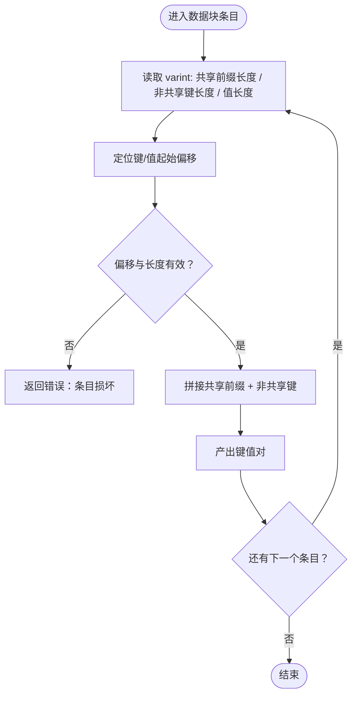
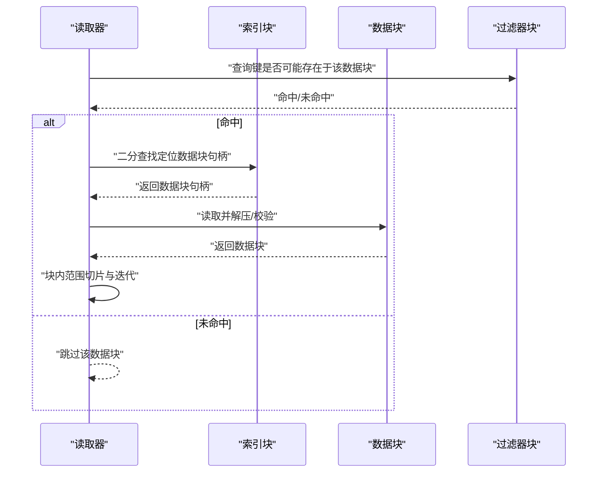
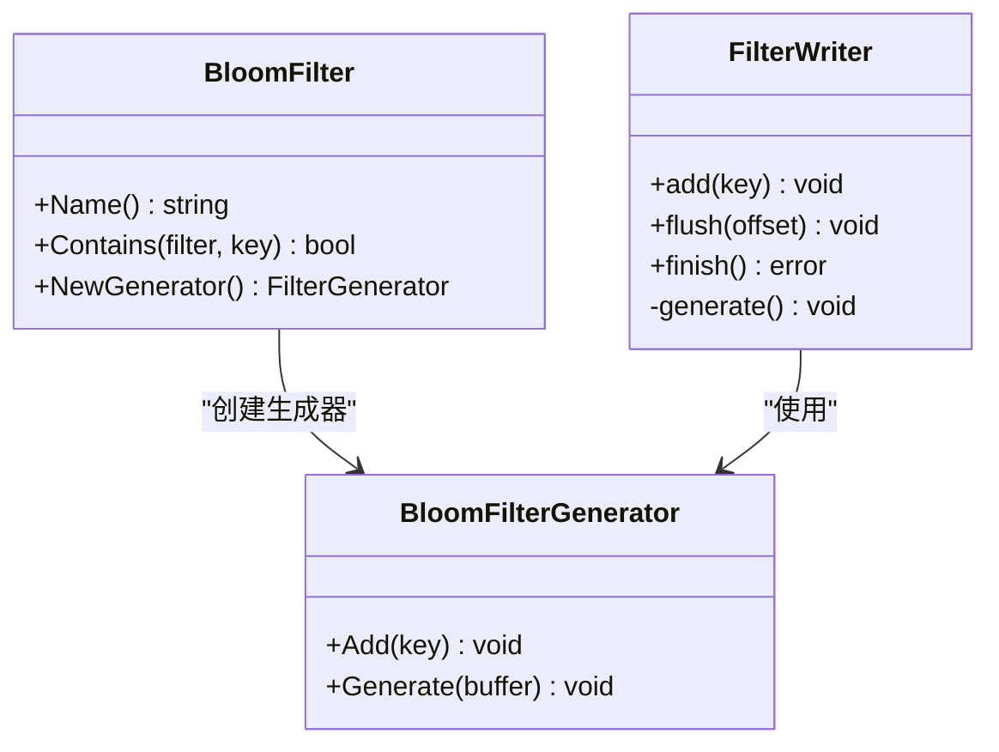
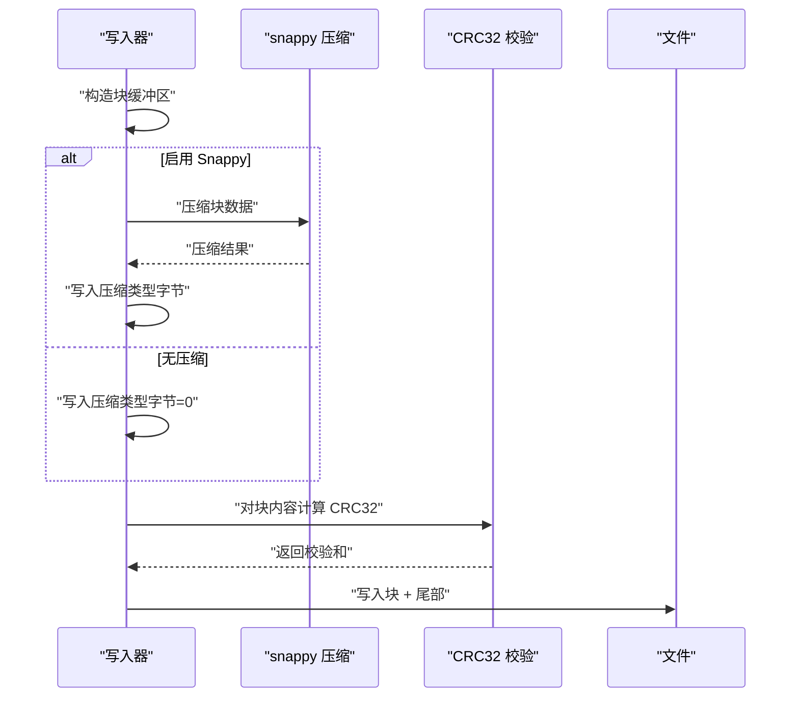
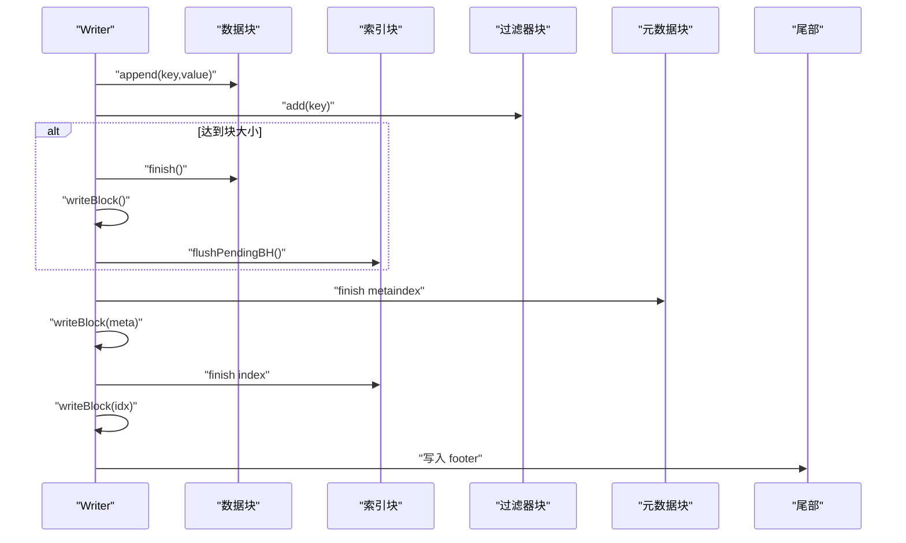
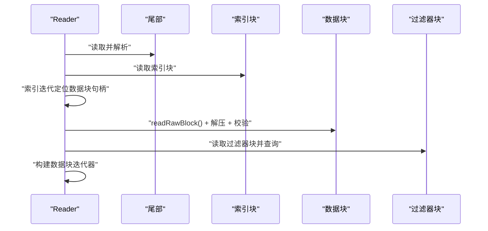
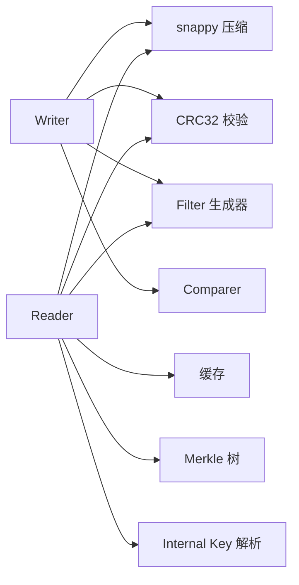

# 存储格式

<cite>
**本文引用的文件**
- [table.go](file://leveldb/table/table.go)
- [writer.go](file://leveldb/table/writer.go)
- [reader.go](file://leveldb/table/reader.go)
- [bloom.go](file://leveldb/filter/bloom.go)
- [crc32.go](file://leveldb/util/crc32.go)
- [key.go](file://leveldb/key.go)
- [block_test.go](file://leveldb/table/block_test.go)
</cite>

## 目录
1. [简介](#简介)
2. [项目结构](#项目结构)
3. [核心组件](#核心组件)
4. [架构总览](#架构总览)
5. [详细组件分析](#详细组件分析)
6. [依赖关系分析](#依赖关系分析)
7. [性能考量](#性能考量)
8. [故障排查指南](#故障排查指南)
9. [结论](#结论)

## 简介
本文件面向 avccDB 的 SSTable 存储格式，系统性解析其文件结构与读写流程，重点覆盖：
- 文件整体布局：数据块、索引块、元数据块、过滤器块（可选）、尾部（footer）
- 数据块内部编码：键值对共享前缀压缩、重启点、条目长度编码
- 内部键（Internal Key）结构：用户键、序列号、类型字段的组合方式
- 块级压缩与校验：snappy 压缩与 CRC32 校验（Castagnoli 多项式）
- 快速定位策略：索引块通过“最后键”或分隔键记录数据块边界
- 过滤器集成：Bloom 过滤器的生成与查询路径
- 写入与读取流程：基于 writer.go 与 reader.go 的实现细节
- 性能优化建议：缓冲池、重启间隔、块大小、压缩策略等

## 项目结构
围绕 SSTable 的核心代码位于 leveldb/table 目录，关键文件如下：
- table.go：SSTable 结构定义、常量、块句柄编码/解码、注释化的文件布局说明
- writer.go：表写入器，负责数据块构建、索引块更新、过滤器块生成、元数据块写入、尾部写入、校验与压缩
- reader.go：表读取器，负责块读取、解压、校验、索引迭代、过滤器查询、数据块迭代
- bloom.go：Bloom 过滤器实现，包含生成器与查询逻辑
- crc32.go：CRC32 计算（Castagnoli 多项式），用于块校验
- key.go：内部键（Internal Key）编码/解码，包含用户键、序列号、类型字段
- block_test.go：块迭代与重启点行为的测试用例，辅助理解数据块内部结构

图表来源
- [table.go](file://leveldb/table/table.go#L1-L174)
- [writer.go](file://leveldb/table/writer.go#L1-L490)
- [reader.go](file://leveldb/table/reader.go#L1-L800)
- [bloom.go](file://leveldb/filter/bloom.go#L1-L117)
- [crc32.go](file://leveldb/util/crc32.go#L1-L31)
- [key.go](file://leveldb/key.go#L1-L197)
- [block_test.go](file://leveldb/table/block_test.go#L1-L140)

章节来源
- [table.go](file://leveldb/table/table.go#L1-L174)
- [writer.go](file://leveldb/table/writer.go#L1-L490)
- [reader.go](file://leveldb/table/reader.go#L1-L800)
- [bloom.go](file://leveldb/filter/bloom.go#L1-L117)
- [crc32.go](file://leveldb/util/crc32.go#L1-L31)
- [key.go](file://leveldb/key.go#L1-L197)
- [block_test.go](file://leveldb/table/block_test.go#L1-L140)

## 核心组件
- 表写入器（Writer）
  - 负责数据块构建、索引块维护、过滤器块生成、元数据块写入、索引块写入、尾部写入、块级压缩与校验
  - 关键字段：比较器、过滤器、压缩策略、块大小、缓冲池、块句柄、偏移、条目计数、重启间隔等
- 表读取器（Reader）
  - 负责块读取、解压、校验、索引块迭代、过滤器块查询、数据块迭代
  - 关键字段：文件描述、只读读取器、缓存、选项、比较器、过滤器、校验开关、元/索引/过滤器块句柄、索引块与过滤器块缓存
- 数据块（block）
  - 包含原始数据、重启点数量、重启点偏移等，供块迭代器使用
- 块迭代器（blockIter）
  - 在数据块内进行正向/反向遍历、查找、范围切片
- 过滤器块（filterBlock）
  - 存放过滤器数据与偏移表，支持按键查询是否可能存在于对应数据块
- Bloom 过滤器
  - 生成器与查询器，按位数组与探测次数 k 编码，兼容不同参数序列化

章节来源
- [writer.go](file://leveldb/table/writer.go#L148-L489)
- [reader.go](file://leveldb/table/reader.go#L56-L120)
- [reader.go](file://leveldb/table/reader.go#L120-L404)
- [reader.go](file://leveldb/table/reader.go#L457-L485)
- [bloom.go](file://leveldb/filter/bloom.go#L1-L117)

## 架构总览
SSTable 文件由以下部分组成（从头到尾顺序）：
- 数据块（data block）：包含键值对条目与重启点，按重启间隔共享前缀压缩
- 可选的过滤器块（filter block）：包含多个过滤器数据及偏移表
- 元数据块（metaindex block）：记录过滤器块与可选的 Merkle 树块句柄
- 索引块（index block）：记录每个数据块的边界键与数据块句柄
- 尾部（footer）：包含元数据块句柄、索引块句柄、魔数

块尾部（trailer）固定 5 字节，包含：
- 压缩类型（1 字节）
- 校验和（4 字节）

尾部（footer）固定 48 字节，包含：
- 元数据块句柄
- 索引块句柄
- 魔数（8 字节）

章节来源
- [table.go](file://leveldb/table/table.go#L14-L116)
- [table.go](file://leveldb/table/table.go#L144-L174)
- [writer.go](file://leveldb/table/writer.go#L178-L209)
- [writer.go](file://leveldb/table/writer.go#L433-L449)

## 详细组件分析

### 数据块与内部键编码
- 键值对编码
  - 每个条目包含：共享前缀长度（varint）、非共享键长度（varint）、值长度（varint）、非共享键字节、值字节
  - 重启点处保存完整键；重启点之间仅保存非共享部分，减少冗余
- 重启点与范围切片
  - 重启点数组末尾额外写入重启点数量，便于二分查找与范围定位
  - 块迭代器根据范围切片调整重启区间与偏移起点/终点
- 内部键（Internal Key）
  - 用户键 + 序列号 + 类型字段（8 字节打包）；类型字段区分删除/插入
  - 解析时从尾部 8 字节提取序列号与类型，用户键为除尾部外的部分
  - 支持带版本号的内部键（额外 8 字节版本），解析时区分两种格式

图表来源
- [reader.go](file://leveldb/table/reader.go#L92-L112)
- [reader.go](file://leveldb/table/reader.go#L120-L404)
- [key.go](file://leveldb/key.go#L75-L117)
- [key.go](file://leveldb/key.go#L119-L132)

章节来源
- [table.go](file://leveldb/table/table.go#L74-L116)
- [reader.go](file://leveldb/table/reader.go#L92-L112)
- [reader.go](file://leveldb/table/reader.go#L120-L404)
- [key.go](file://leveldb/key.go#L75-L117)
- [key.go](file://leveldb/key.go#L119-L132)

### 索引块与快速定位
- 索引块条目
  - 使用“上一个数据块的最后键”的分隔键作为索引键，或使用相邻块之间的短分隔键/最后一个键的后继键
  - 索引块重启间隔为 1，确保每个数据块边界键均可直接定位
- 定位流程
  - 读取索引块，二分查找目标数据块句柄
  - 若启用范围切片，则进一步在数据块内定位起止偏移
  - 通过过滤器块可快速判断某键是否可能存在于对应数据块，避免读取无关块

图表来源
- [writer.go](file://leveldb/table/writer.go#L211-L236)
- [reader.go](file://leveldb/table/reader.go#L486-L510)
- [reader.go](file://leveldb/table/reader.go#L568-L622)
- [reader.go](file://leveldb/table/reader.go#L658-L714)
- [bloom.go](file://leveldb/filter/bloom.go#L26-L52)

章节来源
- [writer.go](file://leveldb/table/writer.go#L211-L236)
- [reader.go](file://leveldb/table/reader.go#L486-L510)
- [reader.go](file://leveldb/table/reader.go#L658-L714)
- [bloom.go](file://leveldb/filter/bloom.go#L26-L52)

### 过滤器块与 Bloom 集成
- 过滤器块布局
  - 多个过滤器数据连续存放，末尾包含偏移表与 base Lg（1 字节）
  - 偏移表记录每个过滤器数据的起止偏移，便于按键所在块快速定位过滤器
- Bloom 生成与查询
  - 生成器按 bitsPerKey 推导探测次数 k，生成位图并附加 k 值
  - 查询时按位图逐次探测，若任一位未置位则否定，全部置位则可能包含
- 写入阶段
  - Writer 在追加键时同步向过滤器生成器添加键，按块大小阈值触发生成
  - Close 阶段写入过滤器块，并在元数据块中登记过滤器名称与块句柄

图表来源
- [bloom.go](file://leveldb/filter/bloom.go#L1-L117)
- [writer.go](file://leveldb/table/writer.go#L96-L147)

章节来源
- [bloom.go](file://leveldb/filter/bloom.go#L1-L117)
- [writer.go](file://leveldb/table/writer.go#L96-L147)
- [writer.go](file://leveldb/table/writer.go#L386-L406)

### 块级压缩与校验
- 压缩
  - Writer 在写入块时根据压缩策略选择 snappy 或无压缩
  - snappy 压缩后，块尾部追加压缩类型字节
- 校验
  - 块内容（不含尾部）使用 CRC32（Castagnoli 多项式）计算校验和，写入尾部
  - Reader 读取时先校验压缩类型，再解压，最后校验 CRC32
- 常量与长度
  - 块尾部长度固定为 5 字节（压缩类型 + CRC32）
  - 尾部长度固定为 48 字节（含元/索引句柄与魔数）

图表来源
- [writer.go](file://leveldb/table/writer.go#L178-L209)
- [crc32.go](file://leveldb/util/crc32.go#L1-L31)
- [reader.go](file://leveldb/table/reader.go#L568-L622)

章节来源
- [writer.go](file://leveldb/table/writer.go#L178-L209)
- [crc32.go](file://leveldb/util/crc32.go#L1-L31)
- [reader.go](file://leveldb/table/reader.go#L568-L622)

### 写入流程（writer.go）
- 关键步骤
  - Append：校验键递增、追加到数据块、向过滤器生成器添加键、达到块大小阈值则完成当前数据块
  - finishBlock：完成数据块重启点数组、写入块、记录待定数据块句柄
  - flushPendingBH：计算分隔键/后继键，编码块句柄写入索引块
  - Close：写入元数据块（登记过滤器与可选的 Merkle 树块句柄）、索引块、尾部（含魔数）
- Merkle 树支持
  - 可选启用，写入阶段收集各数据块哈希，最终序列化 Merkle 树并写入单独块，登记于元数据块

图表来源
- [writer.go](file://leveldb/table/writer.go#L262-L310)
- [writer.go](file://leveldb/table/writer.go#L316-L449)

章节来源
- [writer.go](file://leveldb/table/writer.go#L262-L310)
- [writer.go](file://leveldb/table/writer.go#L316-L449)

### 读取流程（reader.go）
- 关键步骤
  - 读取尾部，解析元/索引句柄与魔数
  - 读取索引块，构建索引迭代器；根据范围切片定位目标数据块句柄
  - 读取数据块：校验压缩类型、解压、校验 CRC32、构建块迭代器
  - 过滤器块：读取偏移表与 base Lg，按键所在块查询 Bloom 判断是否可能命中
- 错误处理
  - 对损坏的块句柄与条目进行定位与包装，返回统一的 ErrCorrupted 错误

图表来源
- [reader.go](file://leveldb/table/reader.go#L568-L622)
- [reader.go](file://leveldb/table/reader.go#L658-L714)
- [reader.go](file://leveldb/table/reader.go#L716-L788)

章节来源
- [reader.go](file://leveldb/table/reader.go#L568-L622)
- [reader.go](file://leveldb/table/reader.go#L658-L714)
- [reader.go](file://leveldb/table/reader.go#L716-L788)

## 依赖关系分析
- Writer 依赖
  - 压缩：snappy
  - 校验：util.CRC（Castagnoli）
  - 过滤器：filter.Filter 与 FilterGenerator
  - 比较器：comparer.Comparer（用于分隔键/后继键）
  - 缓冲池：util.BufferPool
- Reader 依赖
  - snappy 解压
  - util.CRC 校验
  - 缓存：cache.NamespaceGetter
  - 过滤器：filter.Filter
  - Merkle：merkle（可选）
- Internal Key 依赖
  - key.go 提供内部键编码/解码，供上层逻辑使用

图表来源
- [writer.go](file://leveldb/table/writer.go#L1-L490)
- [reader.go](file://leveldb/table/reader.go#L1-L800)
- [crc32.go](file://leveldb/util/crc32.go#L1-L31)
- [key.go](file://leveldb/key.go#L1-L197)

章节来源
- [writer.go](file://leveldb/table/writer.go#L1-L490)
- [reader.go](file://leveldb/table/reader.go#L1-L800)
- [crc32.go](file://leveldb/util/crc32.go#L1-L31)
- [key.go](file://leveldb/key.go#L1-L197)

## 性能考量
- 压缩策略
  - Snappy 压缩通常带来显著空间节省，适合大块数据；对于小块或热点数据，可评估是否启用压缩
- 块大小与重启间隔
  - 增大块大小可提升压缩率与顺序读吞吐，但会增加随机访问延迟
  - 降低重启间隔可提升范围切片效率，但会增加重启点开销
- 缓冲池与内存复用
  - 使用 BufferPool 减少频繁分配，提高写入吞吐
- 过滤器参数
  - bitsPerKey 影响 Bloom 过滤器大小与误判率；较小值可降低空间占用但提高误判
- 校验成本
  - CRC32 校验开销较低，建议开启以保证可靠性
- 并发与缓存
  - Reader 支持缓存命中回调，合理配置缓存可显著降低磁盘 IO

[本节为通用性能建议，不直接分析具体文件]

## 故障排查指南
- 常见错误类型
  - 条目损坏：条目长度或偏移越界、重启点对齐错误
  - 校验失败：CRC32 不匹配或压缩类型未知
  - 块句柄异常：分隔键/后继键计算错误导致索引块定位失败
- 定位方法
  - 通过 newErrCorruptedBH 将错误定位到具体块句柄范围
  - 使用 blockIter.seek 与 entry 解析定位损坏条目
  - 校验 snappy 解码长度与解压结果
- 建议
  - 开启 verifyChecksum 严格校验
  - 对关键路径启用缓存
  - 记录魔数与句柄一致性，防止文件损坏

章节来源
- [reader.go](file://leveldb/table/reader.go#L30-L49)
- [reader.go](file://leveldb/table/reader.go#L550-L566)
- [reader.go](file://leveldb/table/reader.go#L568-L622)
- [reader.go](file://leveldb/table/reader.go#L233-L249)

## 结论
avccDB 的 SSTable 采用标准的 LevelDB 风格布局：数据块共享前缀压缩 + 重启点、索引块记录边界键、可选过滤器块、元数据块登记外部块句柄、尾部固定布局与魔数。写入侧通过 Writer 实现块级压缩与 CRC 校验，读取侧通过 Reader 完成解压、校验与快速定位。结合 Bloom 过滤器与范围切片，可在大规模数据场景下获得良好的读取性能与空间效率。建议在生产环境中启用校验与缓存，并根据工作负载调优块大小、重启间隔与过滤器参数。