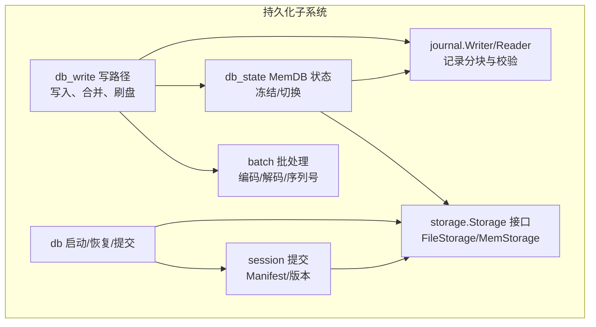
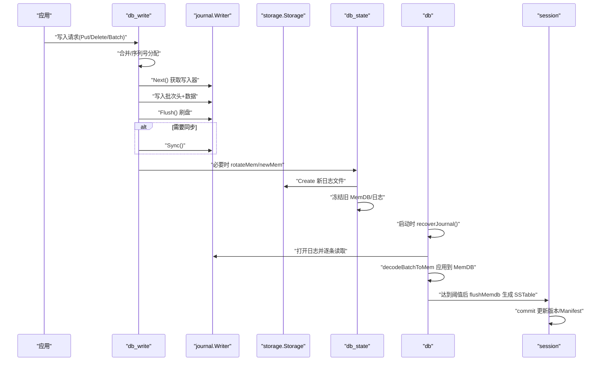
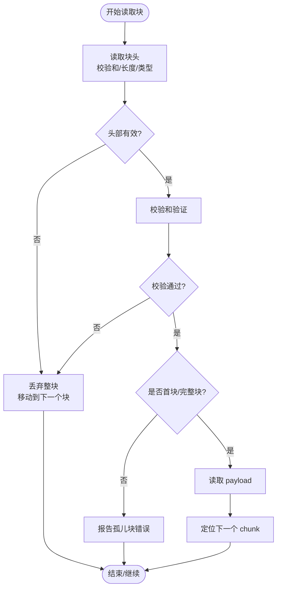
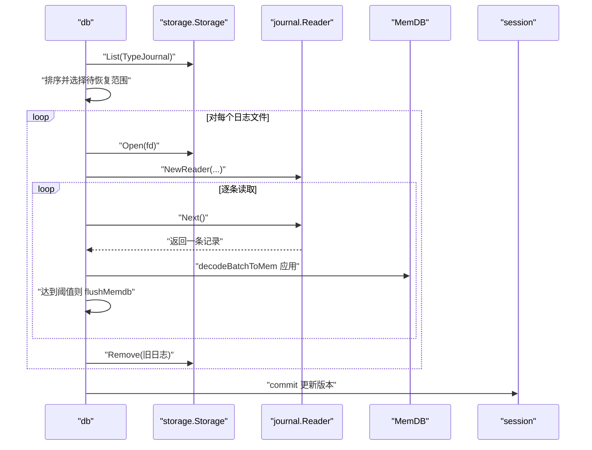
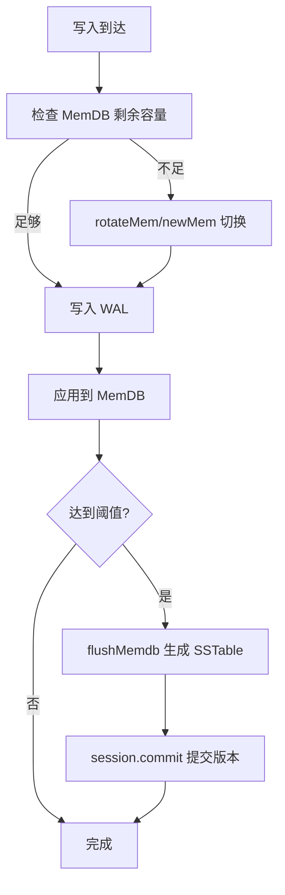
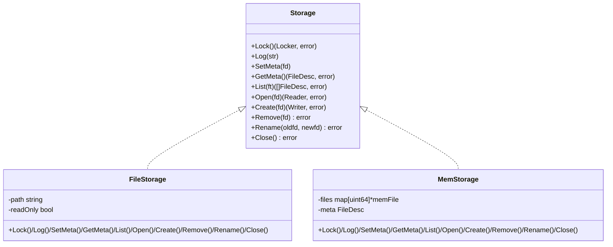
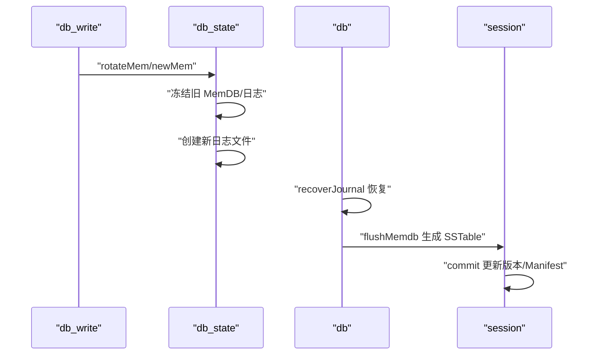
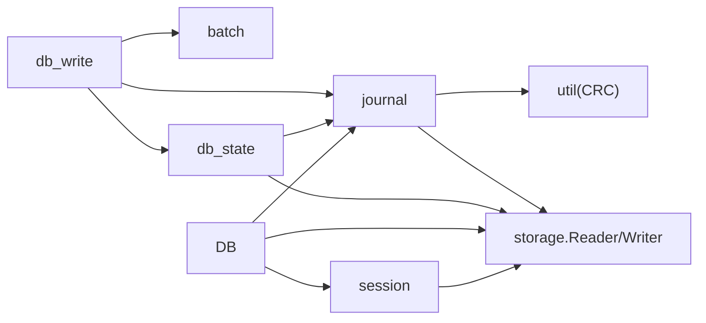

# 持久化机制

<cite>
**本文引用的文件**
- [journal.go](file://leveldb/journal/journal.go)
- [storage.go](file://leveldb/storage/storage.go)
- [file_storage.go](file://leveldb/storage/file_storage.go)
- [mem_storage.go](file://leveldb/storage/mem_storage.go)
- [db_write.go](file://leveldb/db_write.go)
- [db_state.go](file://leveldb/db_state.go)
- [db.go](file://leveldb/db.go)
- [batch.go](file://leveldb/batch.go)
- [session.go](file://leveldb/session.go)
</cite>

## 目录
1. [引言](#引言)
2. [项目结构](#项目结构)
3. [核心组件](#核心组件)
4. [架构总览](#架构总览)
5. [详细组件分析](#详细组件分析)
6. [依赖关系分析](#依赖关系分析)
7. [性能考量](#性能考量)
8. [故障排查指南](#故障排查指南)
9. [结论](#结论)

## 引言
本文件聚焦 avccDB 的持久化机制，围绕 WAL（Write-Ahead Log）的实现展开，系统性解析 journal 模块如何将写入操作（Put/Delete）序列化为“日志记录”并追加到日志文件中，以保证崩溃恢复时的数据持久性；深入剖析 journal.go 中的记录格式、校验和保护以及日志段（log segment）管理策略；说明当 MemDB 达到阈值或被冻结时，系统如何触发日志重放与 SSTable 生成；同时阐述存储抽象层（storage.go）的设计，包括 FileStorage 和 MemStorage 两种实现如何统一处理文件 I/O 并支持跨平台兼容；最后结合 db_write.go 与 db_state.go，解释数据库状态转换与持久化操作的协同工作流程。

## 项目结构
与持久化相关的关键目录与文件：
- journal：WAL 记录读写与分块格式定义
- storage：存储抽象接口与 FileStorage/MemStorage 实现
- db_write：写路径、合并、刷盘与 MemDB 切换逻辑
- db_state：MemDB 生命周期与冻结/解冻管理
- db：数据库启动、恢复、提交与主根更新
- batch：批处理编码/解码与序列号分配
- session：会话与清单（Manifest）提交

图表来源
- [journal.go](file://leveldb/journal/journal.go#L1-L120)
- [storage.go](file://leveldb/storage/storage.go#L1-L189)
- [file_storage.go](file://leveldb/storage/file_storage.go#L1-L120)
- [mem_storage.go](file://leveldb/storage/mem_storage.go#L1-L80)
- [db_write.go](file://leveldb/db_write.go#L1-L120)
- [db_state.go](file://leveldb/db_state.go#L120-L160)
- [db.go](file://leveldb/db.go#L499-L666)
- [batch.go](file://leveldb/batch.go#L339-L413)
- [session.go](file://leveldb/session.go#L184-L243)

章节来源
- [journal.go](file://leveldb/journal/journal.go#L1-L120)
- [storage.go](file://leveldb/storage/storage.go#L1-L189)
- [file_storage.go](file://leveldb/storage/file_storage.go#L1-L120)
- [mem_storage.go](file://leveldb/storage/mem_storage.go#L1-L80)
- [db_write.go](file://leveldb/db_write.go#L1-L120)
- [db_state.go](file://leveldb/db_state.go#L120-L160)
- [db.go](file://leveldb/db.go#L499-L666)
- [batch.go](file://leveldb/batch.go#L339-L413)
- [session.go](file://leveldb/session.go#L184-L243)

## 核心组件
- WAL（journal）：负责将写入批次序列化为记录并写入日志文件，提供严格的分块格式与校验和保护，支持严格模式下的损坏跳过与错误传播。
- 存储抽象（storage）：统一文件 I/O 接口，屏蔽 FileStorage（文件系统）与 MemStorage（内存）差异，支持跨平台兼容。
- 写路径（db_write）：协调写入合并、序列号分配、WAL 写入与刷盘，必要时触发 MemDB 切换。
- MemDB 状态（db_state）：管理有效/冻结 MemDB 生命周期，负责创建新日志、冻结旧日志与清理。
- 恢复与提交（db/session）：启动时按序重放日志至 MemDB，达到阈值后刷盘生成 SSTable，并通过 Manifest 提交版本变更。

章节来源
- [journal.go](file://leveldb/journal/journal.go#L1-L120)
- [storage.go](file://leveldb/storage/storage.go#L1-L189)
- [db_write.go](file://leveldb/db_write.go#L1-L120)
- [db_state.go](file://leveldb/db_state.go#L120-L160)
- [db.go](file://leveldb/db.go#L499-L666)
- [session.go](file://leveldb/session.go#L184-L243)

## 架构总览
下面的时序图展示了从写入到持久化的完整链路，包括 WAL 写入、MemDB 切换、日志重放与 SSTable 生成：

图表来源
- [db_write.go](file://leveldb/db_write.go#L1-L120)
- [journal.go](file://leveldb/journal/journal.go#L343-L537)
- [db_state.go](file://leveldb/db_state.go#L120-L160)
- [db.go](file://leveldb/db.go#L499-L666)
- [batch.go](file://leveldb/batch.go#L339-L413)
- [session.go](file://leveldb/session.go#L184-L243)

## 详细组件分析

### WAL（journal）记录格式与校验和保护
- 分块格式与块大小
  - 日志流被划分为固定大小的块（默认 32 KiB），每个块内紧密打包多个“块”（chunk）。块边界不可跨越，最后一个块可小于 32 KiB。
  - 每个块包含若干 chunk，chunk 头部包含校验和、payload 长度与类型三部分，随后是 payload。
- chunk 类型
  - 完整块（full）、首块（first）、中间块（middle）、尾块（last）。多 chunk 的日志由一个 first 开始，若干 middle，以 last 结束。
- 校验和与损坏处理
  - 校验和覆盖 chunk 类型与 payload，若校验失败或块头无效，Reader 会在严格模式下返回错误，在非严格模式下跳过该块并继续扫描。
  - Reader 支持“丢弃回调”，用于统计损坏信息；Writer 在写入前填充校验和与长度字段。
- 顺序与并发
  - Reader/Writer 不是并发安全的，同一时间仅允许一个 Reader 或 Writer 使用；内部通过序列号与“过期”检查防止复用已关闭的句柄。

图表来源
- [journal.go](file://leveldb/journal/journal.go#L164-L242)

章节来源
- [journal.go](file://leveldb/journal/journal.go#L62-L120)
- [journal.go](file://leveldb/journal/journal.go#L164-L242)
- [journal.go](file://leveldb/journal/journal.go#L343-L537)

### 日志段（log segment）管理
- 文件命名与枚举
  - 日志文件采用数字编号命名，存储层提供 List(TypeJournal) 枚举所有日志文件并排序，便于按序恢复。
- 创建与切换
  - 当需要切换 MemDB 时，db_state 调用 newMem 创建新的日志文件并重置 journal Writer；旧日志文件被标记为冻结并最终清理。
- 恢复流程
  - db 在启动时列出当前可用日志，按编号排序后依次打开；对每个日志使用 journal.Reader 逐条读取，应用到 MemDB；达到阈值后 flushMemdb 生成 SSTable 并提交。

图表来源
- [db.go](file://leveldb/db.go#L499-L666)
- [storage.go](file://leveldb/storage/storage.go#L160-L189)
- [journal.go](file://leveldb/journal/journal.go#L243-L305)
- [batch.go](file://leveldb/batch.go#L339-L413)
- [session.go](file://leveldb/session.go#L184-L243)

章节来源
- [db.go](file://leveldb/db.go#L499-L666)
- [storage.go](file://leveldb/storage/storage.go#L160-L189)
- [journal.go](file://leveldb/journal/journal.go#L243-L305)
- [batch.go](file://leveldb/batch.go#L339-L413)
- [session.go](file://leveldb/session.go#L184-L243)

### MemDB 满时的日志重放与 SSTable 生成
- 触发条件
  - 写入路径中，当 MemDB 剩余容量不足以容纳本次写入，或达到写缓冲阈值，会触发 rotateMem/newMem 切换。
  - 启动恢复阶段，当 MemDB 大小达到阈值时，也会触发 flushMemdb 生成 SSTable。
- 写入与序列号
  - db_write 将多个写入合并为批次，分配自增序列号，先写入 WAL，再写入 MemDB；必要时进行序列号回滚或调整。
- 刷盘与提交
  - flushMemdb 将 MemDB 内容写入 SSTable，生成表文件；随后通过 session.commit 提交版本变更，更新 Manifest。

图表来源
- [db_write.go](file://leveldb/db_write.go#L1-L120)
- [db_state.go](file://leveldb/db_state.go#L120-L160)
- [db.go](file://leveldb/db.go#L499-L666)
- [session.go](file://leveldb/session.go#L184-L243)

章节来源
- [db_write.go](file://leveldb/db_write.go#L1-L120)
- [db_state.go](file://leveldb/db_state.go#L120-L160)
- [db.go](file://leveldb/db.go#L499-L666)
- [session.go](file://leveldb/session.go#L184-L243)

### 存储抽象层（storage.go）设计
- 接口统一
  - Storage 抽象了锁、日志、元数据、文件列表、打开/创建/删除/重命名与关闭等操作；Reader/Writer 统一了读写与同步能力。
- FileStorage 实现
  - 基于文件系统，支持只读模式、日志轮转、CURRENT 文件原子化更新、目录同步等；提供 SetMeta/GetMeta 的一致性保障。
- MemStorage 实现
  - 基于内存字节缓冲，适合测试与临时场景；提供与 FileStorage 相同的接口语义，但不落盘。
- 兼容性
  - 通过接口抽象屏蔽平台差异，具体平台适配在 storage 包内以不同文件实现（如 unix/windows 版本），对外保持一致行为。

图表来源
- [storage.go](file://leveldb/storage/storage.go#L1-L189)
- [file_storage.go](file://leveldb/storage/file_storage.go#L1-L120)
- [mem_storage.go](file://leveldb/storage/mem_storage.go#L1-L80)

章节来源
- [storage.go](file://leveldb/storage/storage.go#L1-L189)
- [file_storage.go](file://leveldb/storage/file_storage.go#L1-L120)
- [mem_storage.go](file://leveldb/storage/mem_storage.go#L1-L80)

### 数据库状态转换与持久化协同
- 写入路径
  - db_write 协调写入合并、序列号分配、WAL 写入与刷盘；当容量不足或达到阈值时触发 MemDB 切换。
- MemDB 生命周期
  - db_state.newMem 创建新日志并冻结旧 MemDB；dropFrozenMem 清理旧日志文件；getMems/getEffectiveMem/getFrozenMem 提供并发安全访问。
- 恢复与提交
  - db.recoverJournal 按序重放日志到 MemDB，达到阈值后 flushMemdb；最后通过 session.commit 提交版本并更新 Manifest。

图表来源
- [db_write.go](file://leveldb/db_write.go#L1-L120)
- [db_state.go](file://leveldb/db_state.go#L120-L160)
- [db.go](file://leveldb/db.go#L499-L666)
- [session.go](file://leveldb/session.go#L184-L243)

章节来源
- [db_write.go](file://leveldb/db_write.go#L1-L120)
- [db_state.go](file://leveldb/db_state.go#L120-L160)
- [db.go](file://leveldb/db.go#L499-L666)
- [session.go](file://leveldb/session.go#L184-L243)

## 依赖关系分析
- journal 依赖 util 的 CRC 校验工具与 storage 的 Reader/Writer 接口。
- db_write 依赖 journal.Writer、memdb.DB 与 batch 编解码。
- db_state 依赖 storage.Storage 与 journal.Writer，管理 MemDB 生命周期。
- db 在启动时依赖 storage 列举日志、journal.Reader 重放、session 提交。
- session 负责 Manifest 的创建与提交，维护版本状态。

图表来源
- [journal.go](file://leveldb/journal/journal.go#L1-L120)
- [db_write.go](file://leveldb/db_write.go#L1-L120)
- [db_state.go](file://leveldb/db_state.go#L120-L160)
- [db.go](file://leveldb/db.go#L499-L666)
- [batch.go](file://leveldb/batch.go#L339-L413)
- [session.go](file://leveldb/session.go#L184-L243)

章节来源
- [journal.go](file://leveldb/journal/journal.go#L1-L120)
- [db_write.go](file://leveldb/db_write.go#L1-L120)
- [db_state.go](file://leveldb/db_state.go#L120-L160)
- [db.go](file://leveldb/db.go#L499-L666)
- [batch.go](file://leveldb/batch.go#L339-L413)
- [session.go](file://leveldb/session.go#L184-L243)

## 性能考量
- WAL 写入与刷盘
  - 批量写入与 Flush/Sync 的使用需权衡吞吐与可靠性；严格模式下损坏跳过可提升鲁棒性，但可能丢失部分记录。
- MemDB 切换与刷盘频率
  - 阈值设置影响 flush 次数与 SSTable 数量；过高导致内存占用上升，过低增加写放大。
- 存储层优化
  - FileStorage 的目录同步与 CURRENT 文件原子化更新有助于减少元数据损坏风险；MemStorage 适合测试场景，避免磁盘 IO。

## 故障排查指南
- WAL 损坏与跳过
  - 若启用严格模式，损坏块将导致读取中断；非严格模式下会跳过并继续扫描。可通过 Dropper 回调获取损坏统计。
- 恢复阶段错误
  - 恢复过程中遇到损坏记录会根据严格选项决定跳过或终止；检查日志文件完整性与磁盘健康。
- 元数据一致性
  - CURRENT 文件的原子化更新与目录同步有助于避免元数据损坏；若出现不一致，可尝试修复 CURRENT 或回退到备份。
- 写入阻塞与合并
  - 写入合并通道与锁竞争可能导致延迟；关注 writeDelay/writeDelayN 统计指标。

章节来源
- [journal.go](file://leveldb/journal/journal.go#L164-L242)
- [db.go](file://leveldb/db.go#L499-L666)
- [file_storage.go](file://leveldb/storage/file_storage.go#L247-L384)

## 结论
avccDB 的持久化机制以 WAL 为核心，通过严格的分块格式与校验和保护确保崩溃后的数据可恢复；存储抽象层统一了文件 I/O，支持 FileStorage 与 MemStorage 并具备跨平台兼容性。写入路径与 MemDB 状态管理协同工作，实现了在容量压力下的平滑切换与高效刷盘；启动时的有序日志重放与阈值触发的 SSTable 生成，共同构成了可靠且高性能的持久化闭环。